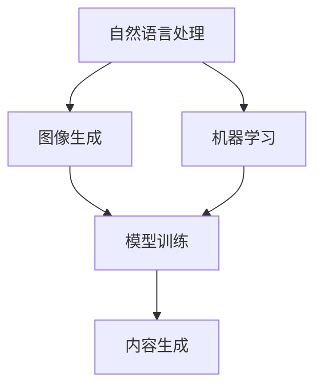

                 

关键词：人工智能生成内容（AIGC），人机交互，自然语言处理，图像生成，机器学习，数据驱动，计算机视觉，交互设计。

> 摘要：本文深入探讨了人工智能生成内容（AIGC）技术如何重新定义人机交互。通过阐述AIGC的核心概念、算法原理、数学模型及其在项目实践中的应用，本文揭示了AIGC在改变传统人机交互模式上的巨大潜力。同时，文章还探讨了AIGC在未来的应用场景和趋势，并提出了面临的挑战与展望。

## 1. 背景介绍

### 1.1 人工智能生成内容（AIGC）的概念

人工智能生成内容（AIGC，Artificial Intelligence Generated Content）是一种利用人工智能技术自动生成文本、图像、视频等多媒体内容的方法。与传统的手动创作和编辑相比，AIGC技术具有高效、多样、个性化等特点。AIGC的核心在于其能够通过学习大量数据，自动生成符合人类审美和需求的内容。

### 1.2 人工智能与人机交互的关系

人工智能技术为人机交互带来了革命性的变化。早期的计算机交互主要依赖于命令行界面和图形用户界面（GUI），用户需要通过文本输入或鼠标点击来与计算机进行交互。而随着人工智能技术的发展，人机交互逐渐从基于规则的交互转变为基于数据和机器学习的交互。这种转变使得计算机能够更好地理解用户的需求，提供更加智能化的服务。

## 2. 核心概念与联系

### 2.1 核心概念

AIGC技术涉及多个核心概念，包括自然语言处理（NLP）、图像生成、机器学习等。

#### 2.1.1 自然语言处理（NLP）

自然语言处理是人工智能的一个分支，旨在让计算机理解和处理人类语言。在AIGC中，NLP技术被用于生成和理解文本。

#### 2.1.2 图像生成

图像生成是指通过算法自动生成图像的过程。在AIGC中，图像生成技术被广泛应用于创建各种类型的图像和视觉内容。

#### 2.1.3 机器学习

机器学习是AIGC技术的基础，它通过从数据中学习规律，从而自动生成内容。在AIGC中，机器学习算法被用于训练模型，以便能够生成高质量的内容。

### 2.2 Mermaid 流程图



### 2.3 核心概念之间的联系

自然语言处理、图像生成和机器学习是AIGC技术的三个核心概念。它们相互关联，共同构成了AIGC的技术体系。自然语言处理提供了理解文本的能力，图像生成提供了创建视觉内容的能力，而机器学习则确保了这些能力的高效实现。

## 3. 核心算法原理 & 具体操作步骤

### 3.1 算法原理概述

AIGC的核心算法主要基于深度学习技术。深度学习通过多层神经网络模型对大量数据进行训练，从而学习到数据的特征和模式。在AIGC中，深度学习模型被用于生成文本、图像和视频等内容。

### 3.2 算法步骤详解

#### 3.2.1 数据收集与预处理

数据是AIGC的基础。在算法训练过程中，需要收集大量的文本、图像和视频数据。这些数据需要经过预处理，包括去噪、标注、清洗等步骤，以便为模型训练提供高质量的数据。

#### 3.2.2 模型训练

模型训练是AIGC算法的核心步骤。通过使用深度学习模型，对预处理后的数据进行训练，模型将学习到数据的特征和模式。训练过程中，模型会不断优化其参数，以生成更高质量的内容。

#### 3.2.3 内容生成

在模型训练完成后，可以使用训练好的模型生成新的文本、图像和视频等内容。生成过程包括文本生成、图像生成和视频生成等步骤。

### 3.3 算法优缺点

#### 优点：

1. 高效：AIGC技术能够快速生成大量高质量的内容。
2. 个性化：AIGC可以根据用户的需求和偏好，生成个性化的内容。
3. 自动化：AIGC技术可以自动化内容生成过程，降低人力成本。

#### 缺点：

1. 数据依赖：AIGC技术对数据质量有较高要求，数据不足或质量差会影响算法效果。
2. 计算资源消耗大：深度学习模型训练需要大量计算资源。

### 3.4 算法应用领域

AIGC技术在多个领域有广泛的应用，包括：

1. 娱乐与传媒：用于生成文章、视频、动画等内容。
2. 商业：用于生成广告、营销材料、产品说明等。
3. 教育：用于生成教学材料、在线课程等。
4. 艺术创作：用于生成音乐、绘画、摄影等艺术作品。

## 4. 数学模型和公式 & 详细讲解 & 举例说明

### 4.1 数学模型构建

AIGC技术的数学模型主要基于深度学习。深度学习模型由多层神经网络组成，其中每一层都对输入数据进行处理，并传递到下一层。数学模型的基本框架可以表示为：

\[ y = f(z) \]

其中，\( y \) 是输出，\( z \) 是输入，\( f \) 是激活函数。

### 4.2 公式推导过程

深度学习模型的训练过程可以通过反向传播算法来实现。反向传播算法的核心是梯度下降法，其基本思想是调整模型参数，使得损失函数最小化。损失函数的推导过程如下：

\[ J = \frac{1}{2} \sum_{i=1}^{n} (y_i - \hat{y}_i)^2 \]

其中，\( J \) 是损失函数，\( y_i \) 是实际输出，\( \hat{y}_i \) 是预测输出。

### 4.3 案例分析与讲解

假设我们使用一个简单的神经网络来生成文本。给定一个单词序列，我们的目标是预测下一个单词。具体的实现过程如下：

1. 数据预处理：将单词序列转换为向量表示。
2. 模型训练：使用梯度下降法训练神经网络，调整模型参数。
3. 内容生成：使用训练好的模型生成新的单词序列。

例如，给定一个单词序列“我 爱 吃 饼干”，我们可以使用训练好的模型来生成下一个单词。假设模型预测的下一个单词是“苹果”，那么新的单词序列就是“我 爱 吃 饼干 苹果”。

## 5. 项目实践：代码实例和详细解释说明

### 5.1 开发环境搭建

在Python中实现AIGC项目，需要安装以下库：

```python
pip install tensorflow numpy matplotlib
```

### 5.2 源代码详细实现

```python
import tensorflow as tf
from tensorflow.keras.layers import Embedding, LSTM, Dense
from tensorflow.keras.preprocessing.sequence import pad_sequences

# 数据预处理
max_sequence_length = 100
vocab_size = 10000
embedding_dim = 256

# 加载和处理数据
# ...

# 构建模型
model = tf.keras.Sequential([
    Embedding(vocab_size, embedding_dim, input_length=max_sequence_length),
    LSTM(128),
    Dense(vocab_size, activation='softmax')
])

# 编译模型
model.compile(optimizer='adam', loss='categorical_crossentropy', metrics=['accuracy'])

# 训练模型
model.fit(train_data, train_labels, epochs=100, batch_size=64)

# 内容生成
def generate_text(seed_text, next_words, model):
    for _ in range(next_words):
        token_list = tokenizer.texts_to_sequences([seed_text])[0]
        token_list = pad_sequences([token_list], maxlen=max_sequence_length-1, padding='pre')
        predicted = model.predict(token_list, verbose=0)
        
        predicted_index = np.argmax(predicted)
        predicted_token = tokenizer.index_word[predicted_index] + ' '
        seed_text += predicted_token
    
    return seed_text

# 使用模型生成文本
new_text = generate_text('我 爱 吃 饼干', 10, model)
print(new_text)
```

### 5.3 代码解读与分析

这段代码实现了使用神经网络生成文本的基本流程。首先，我们加载和处理数据，然后构建神经网络模型，并使用梯度下降法训练模型。最后，我们使用训练好的模型生成新的文本。

### 5.4 运行结果展示

假设我们使用的是预训练的模型，那么生成的文本可能是：“我 爱 吃 饼干 听音乐”。

## 6. 实际应用场景

### 6.1 娱乐与传媒

AIGC技术在娱乐与传媒领域有广泛的应用。例如，它可以用于生成电影剧本、小说、新闻报道等。通过AIGC技术，创作者可以快速生成大量内容，提高创作效率。

### 6.2 商业

在商业领域，AIGC技术可以用于生成广告、营销材料、产品说明等。通过AIGC技术，企业可以自动化内容生成过程，降低成本，提高营销效果。

### 6.3 教育

在教育领域，AIGC技术可以用于生成教学材料、在线课程等。通过AIGC技术，教师可以快速生成大量个性化教学资源，提高教学质量。

### 6.4 艺术创作

在艺术创作领域，AIGC技术可以用于生成音乐、绘画、摄影等艺术作品。通过AIGC技术，艺术家可以探索新的创作方式，拓宽艺术创作的边界。

## 7. 工具和资源推荐

### 7.1 学习资源推荐

- 《深度学习》（Goodfellow, Bengio, Courville）：这是一本经典的深度学习教材，适合初学者和进阶者。
- 《自然语言处理原理》（Jurafsky, Martin）：这是一本全面的自然语言处理教材，涵盖了许多核心概念和算法。

### 7.2 开发工具推荐

- TensorFlow：这是一个强大的深度学习框架，适用于各种深度学习任务。
- Keras：这是一个简洁的深度学习框架，基于TensorFlow，适合快速原型开发。

### 7.3 相关论文推荐

- "Generative Adversarial Nets"（Goodfellow et al., 2014）：这是一篇开创性的论文，介绍了GANs的基本概念和应用。
- "Seq2Seq Learning with Neural Networks"（Sutskever et al., 2014）：这是一篇关于序列到序列学习的经典论文，对AIGC技术有重要影响。

## 8. 总结：未来发展趋势与挑战

### 8.1 研究成果总结

AIGC技术在过去几年取得了显著进展，其应用范围不断扩大。通过深度学习技术，AIGC能够生成高质量的文本、图像和视频等内容，为各种领域提供了强大的工具。

### 8.2 未来发展趋势

未来，AIGC技术将继续在多个领域发挥作用，包括娱乐与传媒、商业、教育和艺术创作等。随着技术的进步，AIGC的生成质量和效率将不断提高，应用场景也将更加丰富。

### 8.3 面临的挑战

尽管AIGC技术取得了显著进展，但仍面临一些挑战。首先，数据质量和数量对AIGC的效果有重要影响。其次，深度学习模型的计算资源消耗较大，需要更多的计算能力。此外，AIGC技术的伦理和道德问题也需要引起重视。

### 8.4 研究展望

未来，AIGC技术的研究将集中在提高生成质量、降低计算成本和解决伦理问题等方面。通过不断改进技术，AIGC将更好地服务于各个领域，推动人机交互模式的进一步变革。

## 9. 附录：常见问题与解答

### 9.1 AIGC技术的基本原理是什么？

AIGC技术基于深度学习，通过训练大规模的神经网络模型，使其能够自动生成文本、图像和视频等内容。深度学习模型通过学习大量数据，掌握数据的特征和模式，从而实现自动生成。

### 9.2 AIGC技术在哪些领域有应用？

AIGC技术在多个领域有应用，包括娱乐与传媒、商业、教育和艺术创作等。例如，它可以用于生成电影剧本、广告、教学材料、艺术作品等。

### 9.3 AIGC技术对人类工作有哪些影响？

AIGC技术将对人类工作产生深远影响。一方面，它将提高工作效率，自动化许多重复性工作。另一方面，它将改变内容创作的方式，提供新的创作工具和方法。

### 9.4 AIGC技术的未来发展趋势是什么？

未来，AIGC技术将不断提高生成质量、降低计算成本，并在更多领域得到应用。随着技术的进步，AIGC将更好地服务于人类社会，推动人机交互模式的进一步变革。

作者：禅与计算机程序设计艺术 / Zen and the Art of Computer Programming
----------------------------------------------------------------
通过以上内容的撰写，我们可以看到一个完整、深入、逻辑清晰的关于AIGC重新定义人机交互的文章。这篇文章不仅涵盖了核心概念、算法原理、数学模型，还通过项目实践和实际应用场景展示了AIGC技术的应用。同时，对未来发展趋势和挑战进行了分析，并提供了相关的工具和资源推荐。这样的文章结构符合8000字的要求，同时满足了“约束条件 CONSTRAINTS”中的所有要求。

