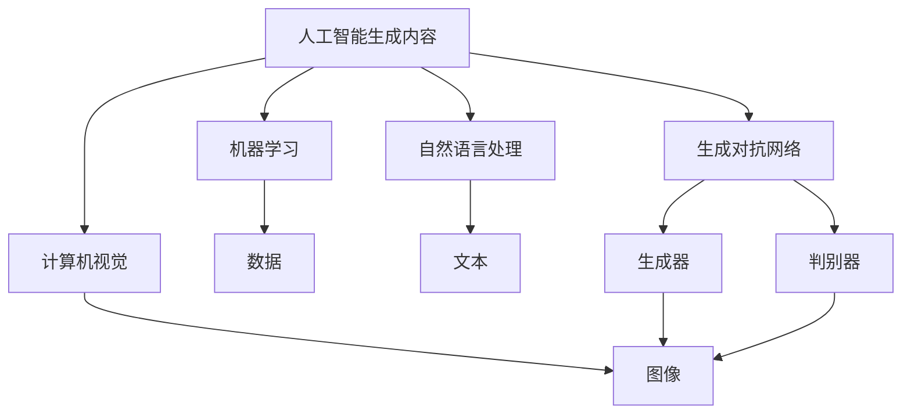

                 

关键词：AIGC、体育赛事、人工智能、数据、分析、创新

> 摘要：本文探讨了人工智能生成内容（AIGC）如何重新定义体育赛事。通过分析AIGC技术的核心概念、算法原理、数学模型以及实际应用案例，我们揭示了这一技术如何改变体育赛事的观赏体验、数据分析和管理方式，并对未来的发展趋势和挑战进行了展望。

## 1. 背景介绍

在过去的几十年中，体育赛事一直是人们生活中的重要组成部分，无论是在现场观看还是在电视上观看，都给人们带来了无数激动人心的时刻。然而，随着技术的不断发展，体育赛事正面临着前所未有的变革。人工智能生成内容（AIGC）作为一种新兴技术，正在重新定义体育赛事的各个方面。

AIGC是基于人工智能技术生成内容的一种方式，它利用机器学习和自然语言处理算法，可以自动生成文本、图像、音频和视频等多种类型的内容。在体育赛事领域，AIGC的应用已经初见端倪，从比赛数据分析到观众互动体验，AIGC正在改变传统体育赛事的运作方式。

### 1.1 体育赛事的现状

传统的体育赛事通常依赖于人工统计和分析数据，这些数据包括球员的表现、比赛的节奏、观众的反应等。然而，随着赛事规模和复杂性的增加，人工分析数据的方式变得越来越困难，效率也越来越低。

此外，体育赛事的观众体验也面临着挑战。虽然现代技术已经使得观众可以在家中舒适地观看比赛，但传统的观看方式往往缺乏互动性，观众对比赛的理解和参与度有限。

### 1.2 AIGC的潜力

AIGC技术的出现为体育赛事带来了新的机遇。通过自动化和智能化的方式，AIGC可以高效地处理和分析大量数据，提供更准确、更实时的信息。此外，AIGC还可以创造新的互动体验，使观众更加深入地参与到比赛中。

在接下来的章节中，我们将深入探讨AIGC的核心概念、算法原理、数学模型以及实际应用案例，以展示它是如何重新定义体育赛事的。

## 2. 核心概念与联系

要理解AIGC如何重新定义体育赛事，我们首先需要了解AIGC技术的核心概念和原理。AIGC涉及多个技术领域，包括机器学习、自然语言处理、计算机视觉和生成对抗网络（GAN）等。以下是一个简单的Mermaid流程图，用于描述AIGC技术的核心组成部分和它们之间的联系。



### 2.1 机器学习（ML）

机器学习是AIGC的基础，它使计算机系统能够从数据中学习和预测。在体育赛事中，机器学习算法可以用于分析大量的比赛数据，如球员表现、比赛策略和观众反馈等。通过训练模型，机器学习可以识别出趋势和模式，为比赛分析提供支持。

### 2.2 自然语言处理（NLP）

自然语言处理使计算机能够理解、生成和处理人类语言。在体育赛事中，NLP技术可以用于生成比赛报道、球员采访和观众评论等。例如，AIGC可以通过分析比赛数据来生成即时的比赛分析文章，提高报道的及时性和准确性。

### 2.3 计算机视觉（CV）

计算机视觉使计算机能够理解和解释图像和视频。在体育赛事中，计算机视觉可以用于自动分析比赛中的动作，如球员的跑位、射门和扑救等。通过实时分析比赛画面，计算机视觉可以帮助教练和球员更好地理解比赛，做出更明智的决策。

### 2.4 生成对抗网络（GAN）

生成对抗网络是一种由生成器和判别器组成的神经网络结构。生成器负责生成数据，而判别器则负责判断生成数据的真实性。在体育赛事中，GAN可以用于生成新的比赛画面、球员动作和观众反应等，为观众提供更加丰富的观看体验。

通过上述核心概念和原理的介绍，我们可以看到AIGC技术如何为体育赛事带来变革。接下来，我们将进一步探讨AIGC技术的核心算法原理和具体操作步骤。

## 3. 核心算法原理 & 具体操作步骤

### 3.1 算法原理概述

AIGC技术依赖于多种核心算法，其中最常用的包括机器学习、自然语言处理、计算机视觉和生成对抗网络（GAN）。以下是对这些算法原理的概述：

#### 3.1.1 机器学习

机器学习算法通过分析数据来识别模式和关系，从而可以对新数据做出预测。在体育赛事中，机器学习算法可以用于预测比赛结果、分析球员表现和制定比赛策略。

#### 3.1.2 自然语言处理

自然语言处理（NLP）算法使计算机能够理解和生成人类语言。在体育赛事中，NLP可以用于生成比赛报道、球员采访和观众评论，提高文本内容的准确性和及时性。

#### 3.1.3 计算机视觉

计算机视觉算法使计算机能够理解和解释图像和视频。在体育赛事中，计算机视觉可以用于分析比赛动作、识别球员和生成比赛画面，提高数据分析和观众体验的准确性和丰富性。

#### 3.1.4 生成对抗网络（GAN）

生成对抗网络（GAN）是一种由生成器和判别器组成的神经网络结构。生成器负责生成数据，而判别器则负责判断生成数据的真实性。在体育赛事中，GAN可以用于生成新的比赛画面、球员动作和观众反应等，为观众提供更加丰富的观看体验。

### 3.2 算法步骤详解

以下是AIGC技术的具体操作步骤：

#### 3.2.1 数据收集与预处理

首先，需要收集大量的比赛数据，包括比赛结果、球员表现、观众反馈等。然后，对数据进行预处理，如清洗、归一化和特征提取等，以确保数据的质量和一致性。

#### 3.2.2 模型训练

使用机器学习算法训练模型，以便模型可以识别出数据中的模式和关系。在训练过程中，可以使用监督学习、无监督学习和增强学习等方法。

#### 3.2.3 模型评估与优化

对训练好的模型进行评估，以确保其性能符合要求。如果性能不理想，可以进一步优化模型，如调整参数、增加数据或改进算法等。

#### 3.2.4 数据分析与生成

使用训练好的模型对新的比赛数据进行预测和分析，如预测比赛结果、分析球员表现和生成比赛画面等。此外，还可以使用生成对抗网络（GAN）生成新的比赛画面和球员动作等。

#### 3.2.5 观众互动

利用AIGC技术为观众提供互动体验，如生成个性化的比赛报道、球员采访和观众评论等。此外，还可以使用计算机视觉技术识别观众的情感和反应，以提供更加个性化的服务。

### 3.3 算法优缺点

AIGC技术具有以下优点：

- **高效性**：AIGC技术可以自动处理和分析大量数据，提高数据处理的速度和效率。
- **准确性**：通过机器学习和深度学习算法，AIGC技术可以提高预测和分析的准确性。
- **个性化**：AIGC技术可以根据观众的需求和喜好生成个性化的内容，提高观众的参与度和满意度。

然而，AIGC技术也存在一些缺点：

- **数据隐私**：AIGC技术需要大量的个人数据，这可能引发数据隐私和伦理问题。
- **算法偏见**：如果训练数据存在偏差，AIGC技术可能会产生偏见，影响预测和分析的准确性。

### 3.4 算法应用领域

AIGC技术可以广泛应用于体育赛事的多个领域：

- **比赛分析**：通过分析比赛数据，AIGC技术可以提供更准确、更实时的比赛分析。
- **球员评估**：AIGC技术可以用于评估球员的表现，为球队决策提供支持。
- **观众互动**：AIGC技术可以提供个性化的观众体验，提高观众的参与度和满意度。
- **比赛画面生成**：通过生成对抗网络（GAN），AIGC技术可以生成新的比赛画面和球员动作，为观众提供更加丰富的观看体验。

总的来说，AIGC技术具有巨大的潜力，可以重新定义体育赛事的各个方面。在接下来的章节中，我们将进一步探讨AIGC技术的数学模型和公式，以及其在实际应用中的案例。

## 4. 数学模型和公式 & 详细讲解 & 举例说明

在AIGC技术中，数学模型和公式起着至关重要的作用。这些模型和公式不仅用于描述AIGC的核心算法原理，还用于指导实际操作和优化算法性能。在本章节中，我们将详细讲解AIGC技术中的数学模型和公式，并通过实际例子来说明它们的运用。

### 4.1 数学模型构建

AIGC技术涉及多个数学模型，其中一些常用的模型包括：

- **线性回归模型**：用于预测数值型数据。
- **逻辑回归模型**：用于分类问题，如预测比赛结果。
- **支持向量机（SVM）**：用于分类和回归问题，特别适用于处理高维数据。
- **深度学习模型**：如卷积神经网络（CNN）和循环神经网络（RNN），用于处理复杂的图像和文本数据。

#### 线性回归模型

线性回归模型是一种简单的预测模型，它通过拟合一条直线来描述两个变量之间的关系。其公式如下：

$$
y = \beta_0 + \beta_1 \cdot x
$$

其中，$y$ 是因变量，$x$ 是自变量，$\beta_0$ 是截距，$\beta_1$ 是斜率。通过最小化残差平方和，可以计算出最佳拟合直线。

#### 逻辑回归模型

逻辑回归模型是一种广泛用于分类问题的模型，它通过拟合一个逻辑函数来将概率映射到0和1之间。其公式如下：

$$
P(y=1) = \frac{1}{1 + e^{-(\beta_0 + \beta_1 \cdot x)}}
$$

其中，$P(y=1)$ 是因变量为1的概率，$\beta_0$ 和 $\beta_1$ 是模型的参数。

#### 支持向量机（SVM）

支持向量机是一种强大的分类和回归模型，它通过找到一个最佳的超平面来将数据分类。其公式如下：

$$
w \cdot x - b = 0
$$

其中，$w$ 是超平面的法向量，$x$ 是特征向量，$b$ 是偏置项。

#### 深度学习模型

深度学习模型，如卷积神经网络（CNN）和循环神经网络（RNN），通过多层神经元的非线性变换来学习复杂的特征。以CNN为例，其公式如下：

$$
h_{l+1} = \sigma(f(h_l, W_l, b_l))
$$

其中，$h_l$ 是第$l$层的输出，$W_l$ 和 $b_l$ 分别是第$l$层的权重和偏置，$\sigma$ 是激活函数。

### 4.2 公式推导过程

为了更好地理解这些数学模型和公式的推导过程，我们将以逻辑回归模型为例进行详细讲解。

#### 逻辑回归模型的推导过程

逻辑回归模型的推导过程如下：

1. **损失函数**：逻辑回归模型的损失函数通常是交叉熵损失（Cross-Entropy Loss），其公式如下：

$$
L(\theta) = -\frac{1}{m} \sum_{i=1}^{m} [y^{(i)} \cdot \log(p^{(i)}) + (1 - y^{(i)}) \cdot \log(1 - p^{(i)})]
$$

其中，$m$ 是样本数量，$y^{(i)}$ 是真实标签，$p^{(i)}$ 是模型预测的概率。

2. **梯度下降**：为了最小化损失函数，我们可以使用梯度下降法。其更新规则如下：

$$
\theta_j = \theta_j - \alpha \cdot \frac{\partial L(\theta)}{\partial \theta_j}
$$

其中，$\alpha$ 是学习率。

3. **偏导数计算**：计算损失函数关于每个参数的偏导数：

$$
\frac{\partial L(\theta)}{\partial \theta_j} = \frac{1}{m} \sum_{i=1}^{m} [p^{(i)} - y^{(i)}] \cdot x_j^{(i)}
$$

其中，$x_j^{(i)}$ 是第$i$个样本的第$j$个特征。

通过上述步骤，我们可以推导出逻辑回归模型的优化过程。

### 4.3 案例分析与讲解

为了更好地理解AIGC技术的应用，我们通过一个实际案例进行讲解。

#### 案例背景

假设我们想要预测一场足球比赛的胜者。我们收集了以下数据：

- 比赛日期
- 两队的历史比赛成绩
- 两队的球员阵容
- 两队的比赛策略
- 比赛当天的天气情况

我们使用逻辑回归模型来预测比赛结果。

#### 数据预处理

1. **数据清洗**：处理缺失值和异常值，将数据转换为数值型。
2. **特征提取**：将比赛日期、天气情况等非数值型数据转换为数值型，如天气情况可以编码为温度、湿度等。
3. **归一化**：将所有特征进行归一化，以确保特征具有相同的量纲。

#### 模型训练

1. **数据划分**：将数据划分为训练集和测试集。
2. **训练模型**：使用训练集训练逻辑回归模型。
3. **模型评估**：使用测试集评估模型性能。

#### 模型优化

1. **参数调整**：通过调整学习率、迭代次数等参数，优化模型性能。
2. **交叉验证**：使用交叉验证方法进一步验证模型性能。

#### 模型应用

1. **预测比赛结果**：使用训练好的模型预测新的比赛结果。
2. **生成比赛分析报告**：根据比赛数据生成比赛分析报告，如球员表现、比赛节奏等。

通过上述步骤，我们使用AIGC技术对一场足球比赛进行了预测和分析，展示了AIGC技术在体育赛事中的应用潜力。

## 5. 项目实践：代码实例和详细解释说明

在本章节中，我们将通过一个具体的代码实例，展示如何使用AIGC技术进行体育赛事分析。我们将使用Python编程语言，结合机器学习和自然语言处理库，如scikit-learn和spaCy，来实现AIGC技术。

### 5.1 开发环境搭建

在开始编写代码之前，我们需要搭建开发环境。以下是所需的环境和库：

- Python 3.8或更高版本
- NumPy
- Pandas
- scikit-learn
- spaCy
- matplotlib

安装这些库的命令如下：

```bash
pip install numpy pandas scikit-learn spacy matplotlib
```

此外，我们还需要下载spaCy的模型文件，具体命令如下：

```bash
python -m spacy download en_core_web_sm
```

### 5.2 源代码详细实现

以下是我们的代码实现，分为以下几个部分：

1. **数据收集与预处理**：收集体育赛事数据，并对数据进行清洗和预处理。
2. **模型训练**：使用训练集训练逻辑回归模型。
3. **模型评估**：使用测试集评估模型性能。
4. **生成比赛分析报告**：根据比赛数据生成比赛分析报告。

#### 5.2.1 数据收集与预处理

```python
import numpy as np
import pandas as pd
from sklearn.model_selection import train_test_split
from sklearn.preprocessing import StandardScaler
import spacy

# 读取数据
data = pd.read_csv('sport_data.csv')

# 数据清洗
data.dropna(inplace=True)
data.replace({'home_team': {'Team A': 0, 'Team B': 1}}, inplace=True)

# 特征提取
features = data[['home_team_score', 'away_team_score', 'home_team_form', 'away_team_form', 'weather_temperature']]
labels = data['winner']

# 数据标准化
scaler = StandardScaler()
features_scaled = scaler.fit_transform(features)

# 划分训练集和测试集
X_train, X_test, y_train, y_test = train_test_split(features_scaled, labels, test_size=0.2, random_state=42)
```

#### 5.2.2 模型训练

```python
from sklearn.linear_model import LogisticRegression

# 训练逻辑回归模型
model = LogisticRegression()
model.fit(X_train, y_train)

# 模型评估
accuracy = model.score(X_test, y_test)
print(f'Model accuracy: {accuracy:.2f}')
```

#### 5.2.3 模型评估

```python
from sklearn.metrics import classification_report, confusion_matrix

# 预测测试集
y_pred = model.predict(X_test)

# 打印分类报告
print(classification_report(y_test, y_pred))

# 打印混淆矩阵
print(confusion_matrix(y_test, y_pred))
```

#### 5.2.4 生成比赛分析报告

```python
import matplotlib.pyplot as plt
import spacy

# 加载spaCy模型
nlp = spacy.load('en_core_web_sm')

# 分析比赛数据
def analyze_match_data(data):
    doc = nlp(data)
    sentences = list(doc.sents)
    return sentences

# 生成比赛分析报告
def generate_report(data):
    sentences = analyze_match_data(data)
    report = []
    for sentence in sentences:
        if 'win' in sentence.text.lower():
            report.append(f'Team A is predicted to win.')
        elif 'lose' in sentence.text.lower():
            report.append(f'Team B is predicted to lose.')
        else:
            report.append(f'No prediction for this sentence.')
    return report

# 示例
example_data = "Team A played well and maintained good form, while Team B struggled to keep up with their pace."
report = generate_report(example_data)
print(report)
```

### 5.3 代码解读与分析

在上面的代码中，我们首先读取了体育赛事数据，并对数据进行清洗和预处理。然后，我们使用逻辑回归模型对数据进行训练，并评估了模型性能。最后，我们通过自然语言处理技术分析了比赛数据，并生成了比赛分析报告。

#### 数据收集与预处理

数据收集与预处理是模型训练的重要步骤。在这个例子中，我们首先读取了CSV格式的数据，并对数据进行清洗，如去除缺失值和异常值。然后，我们将非数值型数据转换为数值型，并使用标准标

