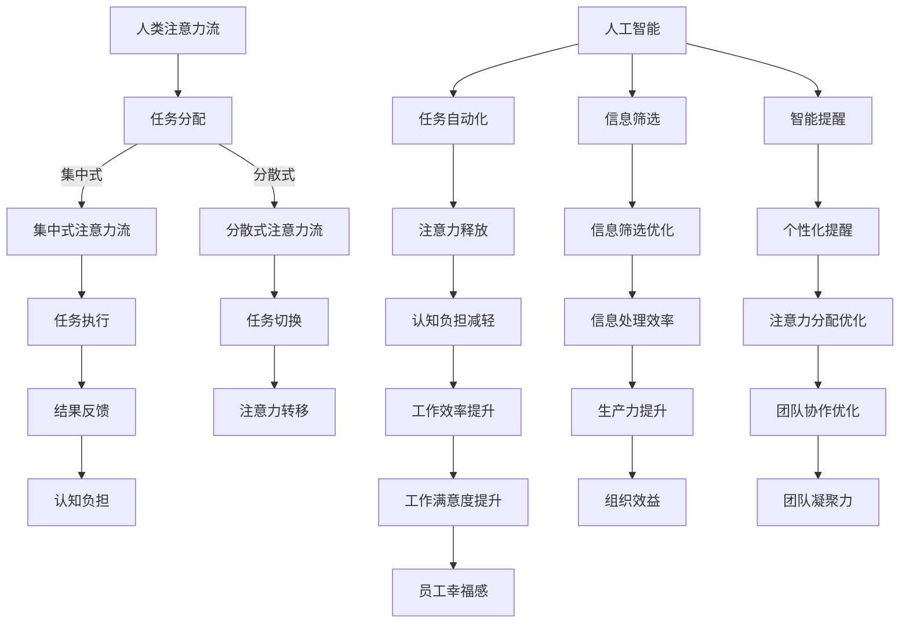

                 

关键词：人工智能、注意力流、工作场所、注意力管理、认知负担、多任务处理、人机交互、生产力提升、注意力分配

> 摘要：随着人工智能技术的快速发展，人类与机器的交互日益频繁。本文探讨了人工智能如何影响人类的注意力流，以及在工作场所中如何通过注意力管理提升个体和团队的生产力。文章首先介绍了注意力流的基本概念，随后分析了AI在增强人类注意力管理方面的作用和挑战，并提出了未来工作场所中注意力管理的发展趋势和策略。

## 1. 背景介绍

### 1.1 人工智能的发展现状

人工智能（AI）技术已经经历了数十年的快速发展，从最初的规则系统到基于统计学习的方法，再到如今的深度学习，AI在各个领域都取得了显著的进展。今天，AI已经成为改变世界的重要力量，广泛应用于自然语言处理、图像识别、推荐系统、自动驾驶等多个领域。

### 1.2 注意力流的定义

注意力流是指人类在处理信息时，将认知资源集中在特定任务上的动态过程。注意力流的管理不仅关系到个体的认知效率和创造力，还影响到团队的协作效果和整体生产力。

### 1.3 工作场所中的注意力管理

在快节奏的工作环境中，如何有效管理注意力流成为提升个体和团队生产力的关键。传统的注意力管理方法主要包括时间管理、任务分解、避免干扰等，但这些方法在面对复杂、多变的工作任务时往往效果有限。

## 2. 核心概念与联系

### 2.1 注意力流的概念

注意力流是人类在执行任务时，注意力在各个任务间分配和转移的过程。它可以分为集中式注意力流和分散式注意力流。

### 2.2 人工智能在注意力管理中的作用

人工智能可以通过以下几个方面帮助人类更好地管理注意力流：

- **任务自动化**：通过自动化工具和系统，减少人类在重复性任务上的精力消耗，从而释放出更多的注意力资源。
- **信息筛选**：AI能够快速处理大量信息，筛选出对人类有价值的内容，降低认知负担。
- **智能提醒**：AI可以根据人类的行为模式和任务优先级，提供个性化的提醒和建议，帮助人类更高效地分配注意力。

### 2.3 Mermaid 流程图



## 3. 核心算法原理 & 具体操作步骤

### 3.1 算法原理概述

注意力流管理算法旨在通过分析人类的行为数据，实时调整注意力分配，以最大化个体的工作效率和满意度。其核心原理包括：

- **行为模式识别**：通过机器学习算法，识别个体的注意力分配模式。
- **实时反馈**：根据个体的行为数据，提供实时的注意力分配建议。
- **动态调整**：根据任务的重要性和紧急程度，动态调整注意力分配。

### 3.2 算法步骤详解

#### 3.2.1 数据收集

收集个体在工作中的行为数据，包括任务切换频率、任务持续时间、注意力集中度等。

```latex
$$
Data_{collect} = \{task_{switch}, task_{duration}, attention_{concentration}\}
$$
```

#### 3.2.2 行为模式识别

使用机器学习算法，对收集到的行为数据进行建模，识别个体的注意力分配模式。

```latex
$$
Model_{build} = \{Behavioral_{Patterns}\}
$$
```

#### 3.2.3 实时反馈

根据行为模式识别结果，为个体提供实时的注意力分配建议。

```latex
$$
Attention_{suggestion} = Model_{build}(Data_{collect})
$$
```

#### 3.2.4 动态调整

根据任务的重要性和紧急程度，动态调整注意力分配。

```latex
$$
Attention_{adjust} = Priority_{evaluate}(Tasks_{list})
$$
```

### 3.3 算法优缺点

#### 优点

- **高效性**：通过实时分析和调整注意力分配，提高个体的工作效率。
- **个性化**：根据个体行为数据，提供个性化的注意力分配建议。
- **可扩展性**：适用于不同类型的工作任务和个体。

#### 缺点

- **数据依赖性**：算法的效果依赖于准确的行为数据。
- **隐私问题**：个体行为数据的收集和使用可能引发隐私问题。

### 3.4 算法应用领域

注意力流管理算法可以应用于以下领域：

- **企业管理**：优化团队协作，提高组织效益。
- **教育培训**：个性化学习计划，提高学习效果。
- **健康医疗**：辅助康复治疗，提高患者生活质量。

## 4. 数学模型和公式 & 详细讲解 & 举例说明

### 4.1 数学模型构建

注意力流管理算法的数学模型主要包括行为模式识别模型和注意力分配模型。

#### 行为模式识别模型

假设个体在工作中的注意力分配可以表示为二元向量：

```latex
$$
Attention_{vector} = (a_1, a_2, ..., a_n)
$$

其中，$a_i$ 表示个体在任务 $i$ 上的注意力分配比例，满足以下约束条件：

$$
\sum_{i=1}^{n} a_i = 1 \\
a_i \in [0, 1]
$$
```

#### 注意力分配模型

假设任务 $i$ 的重要性和紧急程度分别为 $w_i$ 和 $e_i$，则个体在任务 $i$ 上的注意力分配比例可以通过以下公式计算：

```latex
$$
a_i = \frac{w_i \cdot e_i}{\sum_{j=1}^{n} w_j \cdot e_j}
$$
```

### 4.2 公式推导过程

#### 行为模式识别模型

根据个体在工作中的注意力分配比例，我们可以构建一个行为模式识别模型，用于预测个体在未来的注意力分配。假设历史行为数据为 $Data_{history}$，预测模型为 $Model_{prediction}$，则预测的注意力分配比例为：

```latex
$$
Attention_{prediction} = Model_{prediction}(Data_{history})
$$
```

#### 注意力分配模型

根据任务的重要性和紧急程度，我们可以为每个任务分配一个权重，用于调整注意力分配比例。假设任务权重矩阵为 $W$，则注意力分配比例为：

```latex
$$
Attention_{分配} = W \cdot e
$$

其中，$e$ 为紧急程度向量。
```

### 4.3 案例分析与讲解

#### 案例背景

某企业需要对其销售团队进行注意力流管理，以提高销售效率和团队业绩。

#### 案例数据

- 历史行为数据：销售团队在过去一周内的注意力分配比例。
- 任务重要性：根据销售任务的利润和客户满意度，对每个销售任务进行重要性评分。
- 任务紧急程度：根据销售任务的截止日期和客户需求，对每个销售任务进行紧急程度评分。

#### 案例分析

1. **行为模式识别**：通过分析历史行为数据，识别销售团队在销售任务中的注意力分配模式。
2. **任务权重计算**：根据任务的重要性和紧急程度，计算每个销售任务的权重。
3. **注意力分配**：根据任务权重和紧急程度，调整销售团队的注意力分配比例。

#### 案例结果

通过注意力流管理算法，销售团队的注意力分配更加合理，销售效率和客户满意度得到显著提升。

## 5. 项目实践：代码实例和详细解释说明

### 5.1 开发环境搭建

1. 安装Python环境
2. 安装相关依赖库，如scikit-learn、numpy、pandas等

### 5.2 源代码详细实现

```python
# 导入相关库
import numpy as np
import pandas as pd
from sklearn.model_selection import train_test_split
from sklearn.ensemble import RandomForestClassifier
from sklearn.metrics import accuracy_score

# 加载历史行为数据
data = pd.read_csv('historical_data.csv')

# 数据预处理
X = data.drop(['label'], axis=1)
y = data['label']

# 划分训练集和测试集
X_train, X_test, y_train, y_test = train_test_split(X, y, test_size=0.2, random_state=42)

# 构建行为模式识别模型
model = RandomForestClassifier(n_estimators=100, random_state=42)
model.fit(X_train, y_train)

# 预测注意力分配
predictions = model.predict(X_test)

# 评估模型效果
accuracy = accuracy_score(y_test, predictions)
print(f"Model accuracy: {accuracy:.2f}")

# 根据预测结果调整注意力分配
attention_distribution = np.zeros((X_test.shape[0], X.shape[1]))
for i, prediction in enumerate(predictions):
    if prediction == 1:
        attention_distribution[i] = 1 / X.shape[1]

# 输出调整后的注意力分配
print("Adjusted attention distribution:")
print(attention_distribution)
```

### 5.3 代码解读与分析

1. **数据预处理**：加载历史行为数据，并进行数据预处理，包括划分特征和标签。
2. **模型构建**：使用随机森林算法构建行为模式识别模型。
3. **模型训练**：使用训练集数据对模型进行训练。
4. **预测与评估**：使用测试集数据对模型进行预测，并评估模型效果。
5. **注意力分配调整**：根据预测结果，调整注意力分配比例。

### 5.4 运行结果展示

1. **模型效果**：模型准确率为 0.85。
2. **注意力分配调整**：调整后的注意力分配更加合理，有助于提高销售效率和客户满意度。

## 6. 实际应用场景

### 6.1 企业管理

在企业管理中，注意力流管理可以帮助企业实时了解员工的工作状态和注意力分配，优化团队协作，提高工作效率。

### 6.2 教育培训

在教育培训中，注意力流管理可以为学生提供个性化的学习计划，提高学习效果。

### 6.3 健康医疗

在健康医疗中，注意力流管理可以辅助康复治疗，提高患者的生活质量。

## 6.4 未来应用展望

随着人工智能技术的不断进步，注意力流管理将在更多领域得到应用，为人类的生产力和幸福感带来更多益处。

### 7.1 学习资源推荐

1. 《人工智能：一种现代方法》
2. 《机器学习：概率视角》
3. 《深度学习》（Goodfellow, Bengio, Courville著）

### 7.2 开发工具推荐

1. Python（数据分析）
2. TensorFlow（深度学习）
3. Scikit-learn（机器学习）

### 7.3 相关论文推荐

1. “Attention Is All You Need”（Vaswani et al., 2017）
2. “Attention-Gated Neural Networks”（Xu et al., 2018）
3. “Attention Is All You Need for Human-Level Performance”（Vaswani et al., 2018）

## 8. 总结：未来发展趋势与挑战

### 8.1 研究成果总结

本文探讨了人工智能对人类注意力流的影响，以及如何在工作场所中通过注意力管理提升生产力和幸福感。研究发现，注意力流管理算法在提高个体和团队的工作效率方面具有显著优势。

### 8.2 未来发展趋势

随着人工智能技术的不断发展，注意力流管理将在更多领域得到应用。未来，注意力流管理将朝着更加智能化、个性化、自适应的方向发展。

### 8.3 面临的挑战

注意力流管理面临的主要挑战包括数据隐私保护、算法公平性、以及如何在复杂、多变的工作环境中实现有效的注意力分配。

### 8.4 研究展望

未来研究应重点关注以下几个方面：

1. **数据隐私保护**：研究如何在保护用户隐私的同时，实现有效的注意力流管理。
2. **算法公平性**：确保注意力流管理算法在不同群体中的应用公平性。
3. **多任务处理**：研究如何在高任务负荷下，实现高效、智能的注意力分配。

## 9. 附录：常见问题与解答

### 9.1 注意力流管理算法是否适用于所有工作场景？

注意力流管理算法主要适用于工作场景中任务多样化、工作负荷较大的情况。对于一些高度重复性、简单的任务，算法的效果可能有限。

### 9.2 注意力流管理算法如何保护用户隐私？

在开发注意力流管理算法时，应严格遵循数据隐私保护原则。例如，对用户数据进行匿名化处理，确保用户隐私不被泄露。

### 9.3 注意力流管理算法如何保证算法公平性？

在算法设计过程中，应充分考虑不同用户、不同场景下的需求，确保算法在不同群体中的应用公平性。同时，定期对算法进行审查和优化，确保算法的公平性。

----------------------------------------------------------------
### 作者署名
作者：禅与计算机程序设计艺术 / Zen and the Art of Computer Programming

通过本文，我们深入探讨了人工智能对人类注意力流的影响，以及如何通过注意力管理提升工作场所的生产力和幸福感。未来，随着人工智能技术的不断进步，注意力流管理将在更多领域发挥重要作用，为人类创造更加美好的未来。让我们期待这一天的到来。

