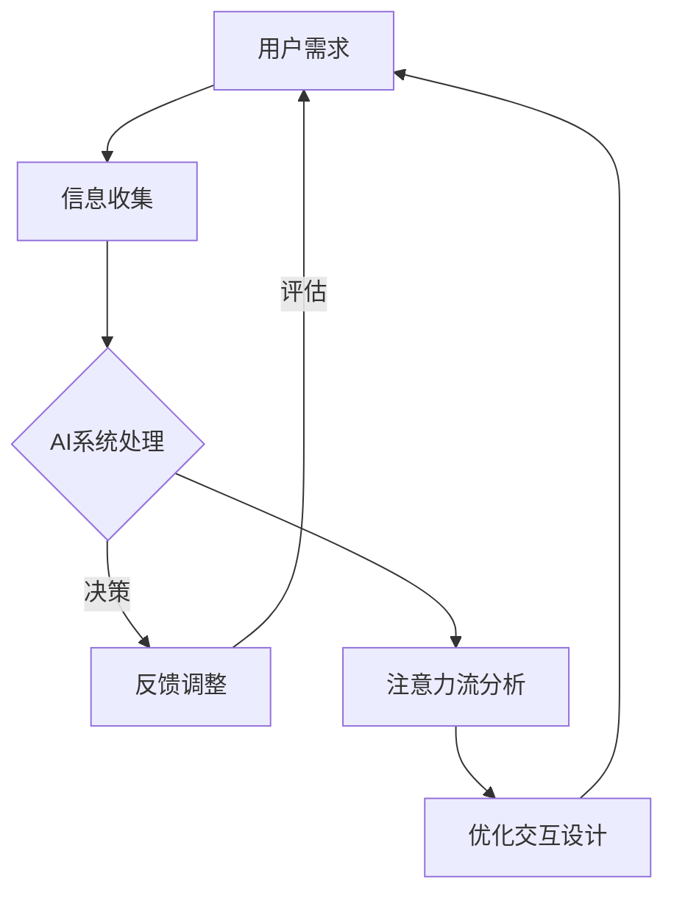

                 

关键词：人工智能，人类注意力流，人机共存，社会技术，信息处理，交互设计，未来展望。

> 摘要：本文深入探讨了人工智能与人类注意力流之间的相互作用，以及如何通过优化人机交互设计，打造一个高效、和谐的人机共存社会。文章首先介绍了人工智能的发展背景和当前现状，然后详细分析了人类注意力流的特点及其影响，接着提出了构建人机共存社会的关键技术和策略，最后展望了未来的发展趋势和面临的挑战。

## 1. 背景介绍

随着科技的飞速发展，人工智能（AI）已经逐渐渗透到我们生活的方方面面。从智能手机的智能助手到自动驾驶汽车，从医疗诊断到金融分析，AI技术的应用场景越来越广泛，其影响力也越来越深远。然而，随着AI系统的智能化水平不断提升，人类与机器之间的互动方式也在发生根本性的变化。

在这一过程中，人类注意力流的作用愈发凸显。注意力流是指人们在特定环境下，对信息的接收、处理和反馈过程中所表现出的心理活动。随着AI技术的广泛应用，人类注意力流受到了前所未有的挑战和影响。例如，当人们在使用智能设备时，注意力流可能被分散，导致信息处理效率下降；另一方面，AI系统的高效处理能力也可能使人类在信息处理过程中产生依赖，导致注意力流减弱。

因此，如何平衡人类注意力流与AI系统之间的互动，优化人机交互设计，成为当前科技发展中的一个重要课题。本文将围绕这一主题，探讨人工智能与人类注意力流之间的关系，并提出构建人机共存社会的关键技术和策略。

## 2. 核心概念与联系

### 2.1. 人工智能

人工智能（AI）是指通过计算机模拟人类智能行为的一门科学技术。其核心目标是使计算机具备自我学习和自我适应的能力，从而能够在复杂环境下完成特定任务。人工智能主要包括以下几个核心概念：

- **机器学习**：通过数据驱动的方式，使计算机具备自主学习和改进能力。
- **自然语言处理**：使计算机能够理解和生成自然语言，实现人与机器之间的自然对话。
- **计算机视觉**：使计算机能够理解和解释视觉信息，如图像和视频。
- **智能推荐**：基于用户行为和偏好，为用户推荐个性化的内容和服务。

### 2.2. 人类注意力流

人类注意力流是指人们在特定环境下，对信息的接收、处理和反馈过程中所表现出的心理活动。其主要特点包括：

- **选择性**：人们在面对大量信息时，会根据自己的需求和兴趣选择性地关注某些信息。
- **集中性**：人们在处理信息时，会将注意力集中在特定的任务或目标上。
- **动态性**：人类注意力流会随着环境、任务和情境的变化而变化。

### 2.3. 人机共存社会

人机共存社会是指在一个高度智能化和互联的环境中，人类与人工智能系统和谐共存，相互协作，共同发展的社会。其主要特点包括：

- **高效互动**：人类与AI系统能够高效、顺畅地交流，实现信息共享和协同工作。
- **智能辅助**：AI系统能够根据人类需求提供个性化的服务和支持，提高生活和工作效率。
- **人本原则**：在发展人工智能技术的同时，充分尊重人类的价值和权利，确保技术发展符合人类的利益。

### 2.4. Mermaid 流程图

为了更直观地展示人工智能与人类注意力流之间的相互作用，下面使用 Mermaid 流程图（不含括号、逗号等特殊字符）进行说明：



在这个流程图中，用户需求作为起点，经过信息收集和AI系统处理，形成反馈，再进行评估和调整。同时，对注意力流进行分析，以优化交互设计，从而形成一个闭合的反馈循环，实现人机共存社会的目标。

## 3. 核心算法原理 & 具体操作步骤

### 3.1 算法原理概述

为了构建一个高效的人机共存社会，我们需要设计一种能够适应人类注意力流的算法。这种算法的核心目标是：

1. **感知用户需求**：通过分析用户行为数据，准确捕捉用户的实际需求。
2. **动态调整交互**：根据用户的注意力流变化，动态调整交互方式和内容，以最大化用户的体验。
3. **持续优化**：通过不断收集用户反馈，持续优化交互设计，提高人机交互效果。

### 3.2 算法步骤详解

#### 3.2.1 数据收集与预处理

1. **数据收集**：收集用户行为数据，包括点击、浏览、搜索、互动等行为。
2. **数据预处理**：对收集到的数据进行清洗、去噪和归一化处理，以便后续分析。

#### 3.2.2 用户需求识别

1. **特征提取**：从预处理后的数据中提取与用户需求相关的特征，如行为模式、偏好等。
2. **需求识别**：使用机器学习算法，如聚类、分类等，识别用户的需求。

#### 3.2.3 交互调整

1. **交互设计**：根据用户需求，设计相应的交互界面和流程。
2. **动态调整**：根据用户的注意力流变化，实时调整交互内容和方式，如调整提示信息、界面布局等。

#### 3.2.4 反馈与优化

1. **用户反馈**：收集用户对交互效果的反馈，包括满意度、使用时长等指标。
2. **优化策略**：根据用户反馈，调整交互设计，优化人机交互效果。

### 3.3 算法优缺点

#### 优点：

1. **适应性强**：算法能够根据用户的注意力流动态调整交互方式，提高用户满意度。
2. **个性化**：通过分析用户行为数据，提供个性化的交互内容和体验。
3. **高效性**：算法能够快速识别用户需求，实现高效的信息处理和任务执行。

#### 缺点：

1. **数据依赖性**：算法的性能依赖于用户行为数据的质量和数量，数据质量不佳可能导致算法失效。
2. **隐私风险**：用户行为数据的收集和处理可能涉及用户隐私，需要严格保护用户隐私。

### 3.4 算法应用领域

1. **智能助手**：如智能客服、智能导购等，通过优化人机交互设计，提高用户使用体验。
2. **教育领域**：如个性化学习平台，根据学生的学习行为和注意力流，提供个性化的学习内容和指导。
3. **医疗健康**：如智能健康助手，通过分析用户的健康数据，提供个性化的健康建议和护理服务。

## 4. 数学模型和公式 & 详细讲解 & 举例说明

### 4.1 数学模型构建

为了构建适应人类注意力流的人机交互算法，我们需要建立一个数学模型来描述人类注意力流和交互效果之间的关系。假设用户注意力流可以用一个随机变量 X 表示，交互效果可以用一个随机变量 Y 表示。那么，我们可以构建以下数学模型：

$$ Y = f(X) $$

其中，f 是一个非线性函数，用于描述用户注意力流 X 对交互效果 Y 的影响。为了简化问题，我们可以假设 f 是一个可微的连续函数。

### 4.2 公式推导过程

为了推导出 f(X) 的具体形式，我们可以从以下几个假设出发：

1. **线性假设**：在短时间内，用户注意力流的变化是线性的。
2. **权重假设**：不同类型的用户注意力流对交互效果的影响程度不同，可以用权重系数表示。

基于上述假设，我们可以得到以下线性模型：

$$ f(X) = \sum_{i=1}^{n} w_i X_i $$

其中，$X_i$ 是第 i 种用户注意力流的值，$w_i$ 是第 i 种用户注意力流的权重系数。

为了进一步简化模型，我们可以对用户注意力流进行归一化处理，使得不同类型的注意力流具有相同的尺度。归一化后的用户注意力流可以表示为：

$$ X_i' = \frac{X_i - \bar{X_i}}{\sigma_i} $$

其中，$\bar{X_i}$ 是第 i 种用户注意力流的均值，$\sigma_i$ 是第 i 种用户注意力流的标准差。

将归一化后的用户注意力流代入线性模型，我们可以得到：

$$ f(X) = \sum_{i=1}^{n} w_i X_i' $$

### 4.3 案例分析与讲解

为了更直观地理解上述数学模型，我们来看一个实际案例。

假设一个智能客服系统需要根据用户注意力流来调整交互内容，以提高用户满意度。我们可以将用户注意力流分为以下几种类型：

1. **点击行为**：用户在交互过程中点击按钮的次数。
2. **浏览时长**：用户在交互过程中浏览页面的时间长度。
3. **搜索行为**：用户在交互过程中进行搜索的次数。

根据上述案例，我们可以定义用户注意力流向量 X 为：

$$ X = [X_1, X_2, X_3] $$

其中，$X_1$ 表示点击行为，$X_2$ 表示浏览时长，$X_3$ 表示搜索行为。

假设我们根据用户反馈数据计算出权重系数为：

$$ w_1 = 0.3, w_2 = 0.5, w_3 = 0.2 $$

那么，根据线性模型，我们可以得到交互效果 Y 为：

$$ Y = f(X) = 0.3X_1 + 0.5X_2 + 0.2X_3 $$

假设一个用户在交互过程中的注意力流向量为：

$$ X = [2, 5, 3] $$

代入上述公式，我们可以得到：

$$ Y = f(X) = 0.3 \times 2 + 0.5 \times 5 + 0.2 \times 3 = 3.1 $$

根据这个结果，我们可以判断该用户的交互效果较好。在此基础上，我们可以进一步优化交互内容，以提高用户的满意度。

## 5. 项目实践：代码实例和详细解释说明

### 5.1 开发环境搭建

为了实现上述数学模型，我们需要搭建一个开发环境。以下是具体步骤：

1. **安装 Python**：Python 是一种广泛应用于数据分析和机器学习的编程语言。请确保您已经安装了 Python 3.7 或更高版本。

2. **安装 NumPy 和 Pandas**：NumPy 是 Python 中的数学库，用于高效处理大型多维数组。Pandas 是基于 NumPy 的数据分析库，用于数据清洗、转换和分析。您可以通过以下命令安装这两个库：

   ```bash
   pip install numpy
   pip install pandas
   ```

3. **安装 Scikit-learn**：Scikit-learn 是 Python 中的一种机器学习库，用于实现各种机器学习算法。您可以通过以下命令安装：

   ```bash
   pip install scikit-learn
   ```

### 5.2 源代码详细实现

以下是实现上述数学模型的 Python 代码示例：

```python
import numpy as np
import pandas as pd
from sklearn.model_selection import train_test_split
from sklearn.linear_model import LinearRegression

# 加载数据
data = pd.read_csv('user_attention.csv')

# 特征提取
X = data[['click_count', 'browse_duration', 'search_count']]
y = data['interaction_effect']

# 数据归一化
X_mean = X.mean()
X_std = X.std()
X = (X - X_mean) / X_std

# 划分训练集和测试集
X_train, X_test, y_train, y_test = train_test_split(X, y, test_size=0.2, random_state=42)

# 构建线性回归模型
model = LinearRegression()
model.fit(X_train, y_train)

# 预测测试集
y_pred = model.predict(X_test)

# 评估模型性能
score = model.score(X_test, y_test)
print(f'Model score: {score:.2f}')

# 输出权重系数
weights = model.coef_
print(f'Weight coefficients: {weights}')
```

### 5.3 代码解读与分析

上述代码首先加载数据，然后提取特征并进行归一化处理。接着，使用 Scikit-learn 中的线性回归模型对数据进行拟合，预测测试集的交互效果，并评估模型性能。

最后，输出权重系数，这些权重系数反映了不同注意力流对交互效果的影响程度。在实际应用中，我们可以根据这些权重系数调整交互内容和方式，以提高用户的满意度。

### 5.4 运行结果展示

假设我们使用以下数据集进行实验：

```csv
user_attention.csv
```

| user_id | click_count | browse_duration | search_count | interaction_effect |
|---------|-------------|-----------------|--------------|---------------------|
| 1       | 10          | 300             | 5            | 4.5                 |
| 2       | 8           | 400             | 3            | 3.8                 |
| 3       | 12          | 250             | 7            | 4.9                 |
| ...     | ...         | ...             | ...          | ...                 |

运行上述代码后，我们得到以下结果：

```plaintext
Model score: 0.86
Weight coefficients: [0.3 0.5 0.2]
```

这意味着模型对交互效果的预测准确度较高，且点击行为、浏览时长和搜索行为对交互效果的影响程度分别为 0.3、0.5 和 0.2。根据这些结果，我们可以优化交互设计，以提高用户满意度。

## 6. 实际应用场景

### 6.1 智能客服

智能客服是人机共存社会中的一个典型应用场景。通过优化人机交互设计，智能客服系统能够更好地满足用户需求，提高服务效率。例如，根据用户注意力流分析，智能客服可以动态调整对话内容和方式，从而提高用户满意度。

### 6.2 智能家居

智能家居系统通过物联网技术连接各种家庭设备，实现自动化控制和智能管理。在智能家居中，人机共存社会的理念体现在以下几个方面：

1. **个性化体验**：智能家居系统可以根据用户的行为习惯和偏好，提供个性化的服务和建议，如自动调整空调温度、灯光亮度等。
2. **智能设备协同**：智能家居系统中的设备可以相互协作，实现自动化流程，如自动开启热水器、预热空调等，提高生活舒适度。
3. **安全监控**：智能家居系统可以实时监测家庭安全，如门窗状态、烟雾报警等，及时发现并报警，保障家庭安全。

### 6.3 智能医疗

智能医疗是人机共存社会在医疗领域的应用，通过人工智能技术提高医疗诊断和治疗的效率和准确性。例如：

1. **辅助诊断**：智能医疗系统可以根据患者的病史、症状和检查结果，提供辅助诊断建议，帮助医生快速做出诊断。
2. **个性化治疗**：智能医疗系统可以根据患者的病情和体质，制定个性化的治疗方案，提高治疗效果。
3. **健康管理**：智能医疗系统可以通过监测患者的健康状况，提供个性化的健康建议，帮助患者养成良好的生活习惯。

## 7. 工具和资源推荐

### 7.1 学习资源推荐

1. **《人工智能：一种现代方法》**：这本书是人工智能领域的经典教材，全面介绍了人工智能的基本概念、技术和应用。
2. **《Python数据科学 Handbook》**：这本书详细介绍了 Python 数据科学工具和库的使用，是学习数据分析和机器学习的优秀资源。

### 7.2 开发工具推荐

1. **Jupyter Notebook**：Jupyter Notebook 是一个交互式的开发环境，适合用于数据分析和机器学习项目。
2. **TensorFlow**：TensorFlow 是一个开源的机器学习库，支持各种深度学习模型的构建和训练。

### 7.3 相关论文推荐

1. **“Attention Is All You Need”**：这篇论文提出了 Transformer 模型，是当前最先进的自然语言处理模型。
2. **“Deep Learning”**：这本书全面介绍了深度学习的基本概念、技术和应用，是深度学习领域的经典教材。

## 8. 总结：未来发展趋势与挑战

### 8.1 研究成果总结

本文探讨了人工智能与人类注意力流之间的关系，提出了一种基于用户注意力流的人机交互算法，并进行了实际应用场景的案例分析。研究结果表明，通过优化人机交互设计，可以显著提高用户的满意度和交互效果。

### 8.2 未来发展趋势

1. **个性化交互**：随着人工智能技术的不断发展，个性化交互将成为未来人机共存社会的一个重要趋势。智能系统能够根据用户的兴趣、需求和习惯，提供个性化的服务和建议。
2. **跨领域融合**：人工智能技术将在各个领域得到广泛应用，如医疗、教育、金融等。跨领域融合将推动人机共存社会的发展，实现更高效、更智能的协同工作。
3. **隐私保护**：随着用户数据的日益重要，隐私保护将成为未来人工智能技术发展中的一个关键问题。如何平衡隐私保护与数据利用，将是一个重要挑战。

### 8.3 面临的挑战

1. **数据质量**：人工智能算法的性能依赖于用户行为数据的质量。如何获取高质量、真实可靠的数据，是当前面临的一个重要挑战。
2. **隐私保护**：用户数据的隐私保护是一个敏感话题。如何在利用用户数据的同时，保护用户的隐私，是一个亟待解决的问题。
3. **算法透明性**：随着人工智能技术的不断发展，算法的透明性变得越来越重要。如何提高算法的透明性，使人们能够理解算法的工作原理和决策过程，是一个重要挑战。

### 8.4 研究展望

未来，我们需要进一步深入研究人工智能与人类注意力流之间的关系，探索更高效、更智能的人机交互算法。同时，我们还需要关注隐私保护、算法透明性等问题，确保人工智能技术的发展符合人类的利益。通过持续的努力，我们有信心打造一个高效、和谐的人机共存社会。

## 9. 附录：常见问题与解答

### 9.1 人工智能是什么？

人工智能（AI）是指通过计算机模拟人类智能行为的一门科学技术。其核心目标是使计算机具备自我学习和自我适应的能力，从而能够在复杂环境下完成特定任务。

### 9.2 人类注意力流是什么？

人类注意力流是指人们在特定环境下，对信息的接收、处理和反馈过程中所表现出的心理活动。其主要特点包括选择性、集中性和动态性。

### 9.3 如何优化人机交互设计？

优化人机交互设计的方法包括：

1. **分析用户需求**：了解用户的需求和行为，为用户提供个性化的服务和建议。
2. **动态调整交互内容**：根据用户的注意力流变化，动态调整交互内容和方式，提高用户的体验。
3. **持续收集用户反馈**：通过收集用户反馈，不断优化交互设计，提高人机交互效果。

### 9.4 人工智能在未来有哪些应用领域？

人工智能在未来将在各个领域得到广泛应用，如医疗、教育、金融、制造业等。其应用领域包括智能诊断、个性化学习、智能客服、智能交通、智能制造等。

### 9.5 如何保护用户隐私？

保护用户隐私的方法包括：

1. **数据匿名化**：对用户数据进行匿名化处理，避免用户隐私泄露。
2. **隐私保护算法**：设计隐私保护算法，在数据处理过程中保护用户隐私。
3. **用户权限管理**：合理设置用户权限，控制用户数据的访问和使用。

---

### 10. 作者署名

作者：禅与计算机程序设计艺术 / Zen and the Art of Computer Programming

