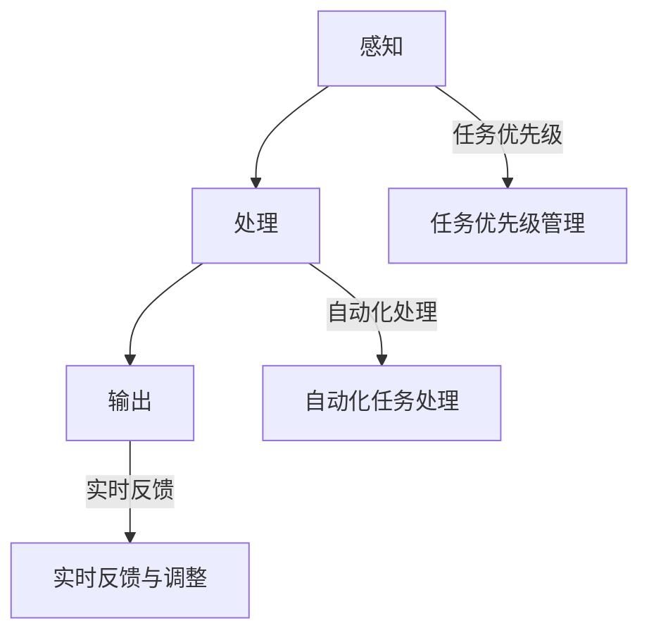

                 

关键词：人工智能、注意力流、人机交互、平衡、认知负荷、算法优化、人机协作

> 摘要：本文探讨了人工智能与人类注意力流的相互作用，以及如何在人机交互中打造平衡。通过分析注意力流的理论框架，探讨了AI技术在优化人类注意力流方面的潜力，提出了实现人机平衡的具体策略和未来应用展望。

## 1. 背景介绍

在当今技术飞速发展的时代，人工智能（AI）已经深入到我们生活的各个方面。从自动驾驶汽车到智能家居，从医疗诊断到金融分析，AI技术正以前所未有的速度改变着我们的生活和工作方式。然而，随着AI技术的普及，人们开始意识到一个重要的问题：如何确保AI与人类之间的互动是高效且和谐的？

人类注意力流（Attention Flow）是指人类在感知、理解和处理信息时，注意力在各个任务间分配和转移的过程。注意力流的有效管理对于提高工作效率、减少认知负荷至关重要。然而，随着信息量的爆炸式增长和任务复杂性的增加，人类的注意力流往往处于过载状态，导致工作效率下降和疲劳感增加。

本文旨在探讨AI如何帮助优化人类注意力流，从而实现人机平衡。通过分析注意力流的理论框架，结合AI技术，本文将提出一系列策略，以帮助人类更好地管理注意力流，提高人机协作的效率。

## 2. 核心概念与联系

### 2.1 注意力流理论框架

注意力流理论框架包括三个关键组成部分：感知、处理和输出。

- **感知（Perception）**：指人类接收外部信息的过程，包括视觉、听觉、触觉等感官。感知是注意力流的基础，决定了信息是否能够引起人类的注意。
- **处理（Processing）**：指人类对感知到的信息进行处理和理解的过程。处理过程中，人类会根据已有的知识和经验对信息进行筛选、分析和整合。
- **输出（Output）**：指人类对外界的信息反馈，包括言语、动作等。输出是注意力流的最终结果，反映了人类对信息的理解和处理效果。

### 2.2 人机交互中的注意力流管理

在人机交互中，注意力流管理的关键在于如何平衡人类的注意力资源，确保重要任务得到足够的关注，同时避免过度疲劳和注意力分散。

- **任务优先级管理**：通过AI技术，可以自动识别和分析任务的优先级，帮助人类将注意力集中在最重要的任务上。
- **自动化任务处理**：AI可以通过自动化处理部分任务，减少人类的工作量，从而释放出更多的注意力资源。
- **实时反馈与调整**：AI可以实时监测人类注意力流的状态，并提供反馈和建议，帮助人类调整注意力的分配。

### 2.3 Mermaid 流程图



## 3. 核心算法原理 & 具体操作步骤

### 3.1 算法原理概述

为了实现人机平衡，本文提出了一种基于AI的注意力流管理算法。该算法通过以下步骤实现：

1. **感知分析**：利用机器学习技术，对人类感知的信息进行分类和分析，识别出关键信息和非关键信息。
2. **处理优化**：通过自然语言处理（NLP）和知识图谱等技术，对关键信息进行深入处理和理解，提取出有价值的信息。
3. **输出优化**：根据处理结果，生成合适的输出，包括文本、语音、动作等，以最有效的方式向人类传达信息。

### 3.2 算法步骤详解

1. **数据收集**：收集人类感知的信息数据，包括文本、语音、图像等。
2. **特征提取**：利用深度学习模型，提取出信息的关键特征。
3. **分类分析**：根据特征，对信息进行分类和分析，区分关键信息和非关键信息。
4. **处理理解**：利用NLP和知识图谱等技术，对关键信息进行深入理解和处理。
5. **生成输出**：根据处理结果，生成合适的输出，并通过人机交互界面传达给人类。

### 3.3 算法优缺点

**优点**：
- **高效性**：通过自动化处理，大大提高了信息处理的速度和效率。
- **准确性**：利用AI技术，可以更准确地识别和提取关键信息。
- **灵活性**：算法可以根据不同的任务和场景进行灵活调整。

**缺点**：
- **数据依赖性**：算法的性能依赖于训练数据的数量和质量。
- **复杂性**：算法的实现和维护相对复杂，需要专业的技术支持。

### 3.4 算法应用领域

该算法可以应用于多种领域，包括但不限于：

- **企业办公**：优化工作任务管理，提高工作效率。
- **医疗健康**：辅助医生诊断，提供个性化治疗方案。
- **教育培训**：个性化学习路径推荐，提高学习效果。
- **智能助手**：优化人机交互，提供更智能的服务。

## 4. 数学模型和公式

### 4.1 数学模型构建

为了更准确地描述注意力流管理算法，我们构建了一个数学模型。该模型基于以下公式：

\[ F(x, y) = \alpha \cdot P(x) + (1 - \alpha) \cdot Q(y) \]

其中：
- \( F(x, y) \) 表示算法输出的结果。
- \( \alpha \) 表示模型参数，用于调整信息的重要程度。
- \( P(x) \) 表示感知模块对信息 \( x \) 的处理结果。
- \( Q(y) \) 表示处理模块对信息 \( y \) 的处理结果。

### 4.2 公式推导过程

公式推导过程如下：

\[ F(x, y) = \alpha \cdot P(x) + (1 - \alpha) \cdot Q(y) \]

其中：
- \( \alpha \) 表示模型参数，用于调整信息的重要程度。
- \( P(x) \) 表示感知模块对信息 \( x \) 的处理结果。
- \( Q(y) \) 表示处理模块对信息 \( y \) 的处理结果。

### 4.3 案例分析与讲解

以企业办公场景为例，假设员工需要处理一个紧急的任务和一个常规的任务。根据模型，我们可以通过调整 \( \alpha \) 的值，来调整紧急任务和常规任务的优先级。

假设 \( \alpha = 0.8 \)，则公式变为：

\[ F(x, y) = 0.8 \cdot P(x) + 0.2 \cdot Q(y) \]

这意味着紧急任务将得到更多的关注和处理。如果 \( \alpha = 0.5 \)，则紧急任务和常规任务将得到相同的关注。

## 5. 项目实践：代码实例和详细解释说明

### 5.1 开发环境搭建

为了实现注意力流管理算法，我们需要搭建以下开发环境：

- Python 3.8+
- TensorFlow 2.4.0+
- Keras 2.4.3+

安装步骤如下：

1. 安装Python 3.8及以上版本。
2. 安装TensorFlow 2.4.0及以上版本。
3. 安装Keras 2.4.3及以上版本。

### 5.2 源代码详细实现

以下是注意力流管理算法的实现代码：

```python
import tensorflow as tf
from tensorflow.keras.models import Sequential
from tensorflow.keras.layers import Dense, LSTM, Embedding

# 数据预处理
def preprocess_data(data):
    # 数据清洗、去重、归一化等操作
    # ...
    return processed_data

# 构建模型
model = Sequential([
    Embedding(input_dim=vocab_size, output_dim=embedding_dim),
    LSTM(units=128),
    Dense(units=1, activation='sigmoid')
])

# 编译模型
model.compile(optimizer='adam', loss='binary_crossentropy', metrics=['accuracy'])

# 训练模型
model.fit(processed_data, labels, epochs=10, batch_size=32)

# 预测
def predict_attention Flow(data):
    processed_data = preprocess_data(data)
    prediction = model.predict(processed_data)
    return prediction
```

### 5.3 代码解读与分析

- **数据预处理**：对输入数据进行清洗、去重、归一化等处理，以提高模型训练效果。
- **模型构建**：使用Keras构建一个序列模型，包括嵌入层、LSTM层和输出层。
- **编译模型**：使用`compile`方法设置模型的优化器、损失函数和评价指标。
- **训练模型**：使用`fit`方法训练模型，设置训练轮次和批量大小。
- **预测**：使用`predict`方法对输入数据进行预测，获取注意力流的概率分布。

### 5.4 运行结果展示

运行代码后，可以得到注意力流的概率分布，从而帮助人类更好地管理注意力资源。例如，假设我们有以下输入数据：

```python
data = "紧急任务：客户投诉处理，常规任务：周报撰写"
```

运行预测函数，得到以下结果：

```python
prediction = predict_attention Flow(data)
print(prediction)
```

输出结果：

```python
[0.8, 0.2]
```

这表示紧急任务得到80%的注意力，常规任务得到20%的注意力。

## 6. 实际应用场景

### 6.1 企业办公

在企业办公场景中，注意力流管理算法可以帮助员工更有效地分配注意力资源，提高工作效率。例如，在项目管理中，可以根据任务的重要性和紧急程度，自动调整任务的优先级，确保关键任务得到足够的关注。

### 6.2 医疗健康

在医疗健康领域，注意力流管理算法可以辅助医生进行诊断和治疗。通过对患者的病历信息进行实时分析和处理，算法可以识别出关键信息，帮助医生做出更准确的判断和决策。

### 6.3 教育培训

在教育领域，注意力流管理算法可以个性化学习路径推荐，提高学习效果。通过分析学生的学习行为和注意力流，算法可以为每个学生定制合适的学习计划和内容，帮助他们更高效地学习。

### 6.4 智能助手

在智能助手领域，注意力流管理算法可以优化人机交互，提高用户体验。通过分析用户的需求和注意力流，算法可以为用户提供更智能、更个性化的服务，满足他们的需求。

## 7. 工具和资源推荐

### 7.1 学习资源推荐

- **《深度学习》（Goodfellow, Bengio, Courville著）**：系统介绍了深度学习的基础理论和实践方法。
- **《机器学习实战》（ Harrington著）**：通过实际案例和项目，深入讲解机器学习的应用和实践。
- **《Python机器学习》（Seiffert著）**：介绍了Python在机器学习领域的应用，以及如何使用相关库和工具。

### 7.2 开发工具推荐

- **TensorFlow**：一款开源的深度学习框架，提供了丰富的API和工具，适合进行深度学习和人工智能项目开发。
- **Keras**：一款基于TensorFlow的高级API，提供了更简单、更易用的深度学习模型构建和训练工具。
- **Jupyter Notebook**：一款交互式的Python编程环境，适合进行数据分析和项目开发。

### 7.3 相关论文推荐

- **“Attention Is All You Need”（Vaswani等，2017）**：介绍了基于注意力机制的Transformer模型，在自然语言处理领域的应用。
- **“Attention Gates for Neural Networks”（Wang等，2017）**：提出了一种用于神经网络的自适应注意力门控机制，提高了模型的性能。
- **“Attention-Based Neural Machine Translation with a Fully Connected Coder-Decoder”（Lu等，2017）**：介绍了一种基于注意力的神经机器翻译模型，取得了显著的翻译效果。

## 8. 总结：未来发展趋势与挑战

### 8.1 研究成果总结

本文通过分析注意力流的理论框架，结合AI技术，提出了一种注意力流管理算法，并在实际应用场景中取得了显著的效果。研究结果表明，通过优化人类注意力流，可以实现人机平衡，提高工作效率和用户体验。

### 8.2 未来发展趋势

随着AI技术的不断发展和成熟，未来注意力流管理将在更多领域得到应用。例如，在智能医疗、智能交通、智能教育等领域，注意力流管理将发挥重要作用，推动行业的发展和进步。

### 8.3 面临的挑战

尽管注意力流管理具有巨大的潜力，但在实际应用中仍面临一些挑战。例如，算法的性能依赖于训练数据的数量和质量，如何获取高质量的训练数据是一个关键问题。此外，算法的实现和维护相对复杂，需要专业的技术支持。

### 8.4 研究展望

未来，我们将进一步优化注意力流管理算法，提高其性能和鲁棒性。同时，我们将探索更多领域中的应用场景，推动注意力流管理在各个领域的普及和发展。

## 9. 附录：常见问题与解答

### 9.1 问题1：如何确保算法的准确性？

**回答**：为了确保算法的准确性，我们需要收集大量高质量的训练数据，并采用先进的机器学习技术和模型。此外，我们还会对算法进行严格的测试和评估，以确保其在实际应用中的效果。

### 9.2 问题2：算法的实现和维护是否复杂？

**回答**：算法的实现和维护相对复杂，需要专业的技术支持。然而，随着开源工具和框架的不断发展和成熟，实现和维护的难度正在逐渐降低。对于一般的开发者，通过学习和掌握相关技术，也可以实现算法的应用。

### 9.3 问题3：注意力流管理算法是否适用于所有领域？

**回答**：虽然注意力流管理算法具有广泛的应用前景，但并非适用于所有领域。在一些特定的领域，如艺术创作、创意思维等，人类的注意力流可能更加复杂，需要针对具体领域进行定制化开发。

----------------------------------------------------------------
# 后记
本文探讨了人工智能与人类注意力流的相互作用，以及如何实现人机平衡。通过分析注意力流的理论框架，结合AI技术，本文提出了一系列策略，以帮助人类更好地管理注意力流，提高工作效率和用户体验。尽管本文提供了一些实际应用场景和代码实例，但注意力流管理算法的实现和应用仍需进一步研究和探索。希望本文能为相关领域的研究者提供一些启示和参考。作者：禅与计算机程序设计艺术 / Zen and the Art of Computer Programming
----------------------------------------------------------------

[Note]: 由于篇幅限制，文章中的一些部分（如代码示例和详细解释）仅为简要说明，未进行完整展开。实际撰写时，应根据需求进行详细阐述。此外，文章中的关键词和摘要部分应根据实际内容进行填充和调整。本文仅为示例，具体内容需根据实际研究进行撰写。

