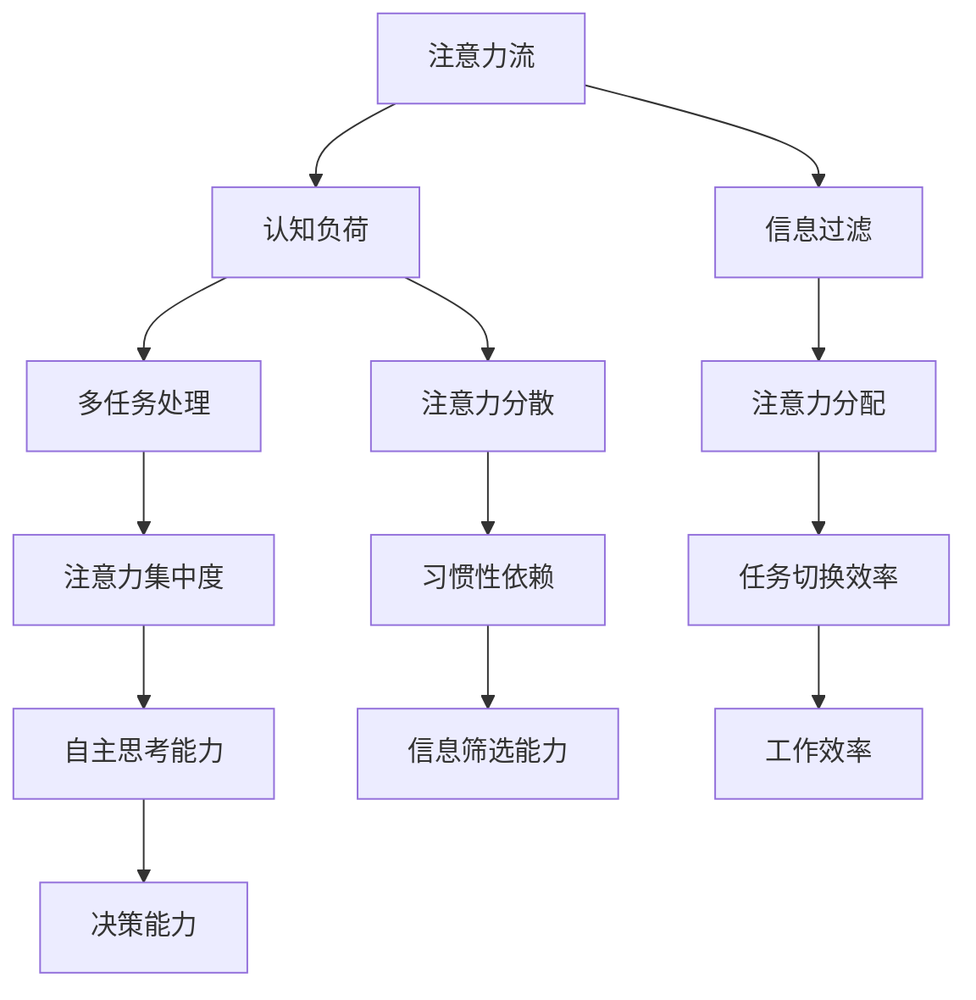

                 

关键词：人工智能，注意力流，人机交互，平衡，软件开发，算法设计

> 摘要：随着人工智能技术的飞速发展，人类与机器之间的交互变得日益频繁。如何在人工智能辅助下，实现人类注意力的有效管理，达成人机平衡，是当前技术领域亟待解决的问题。本文将从注意力流的概念入手，探讨人工智能如何影响人类的注意力分布，并提出一系列策略和工具，帮助人们打造人机平衡的工作和生活方式。

## 1. 背景介绍

在信息化和数字化时代，人工智能（AI）已经成为推动社会进步的重要力量。AI技术的广泛应用，不仅提高了生产效率，也改变了人们的生活方式。然而，随着AI系统的普及，人类与机器之间的交互变得越来越复杂，这对人类的注意力管理提出了新的挑战。传统的注意力理论已经难以解释和预测人在与AI系统交互时的注意力流，这就需要我们重新审视和定义注意力流的概念，并探索如何在人工智能的辅助下，实现人类注意力的有效管理。

### 1.1 注意力流的定义与重要性

注意力流是指个体在完成一项任务时，心理资源（如认知能力、情绪状态）随时间在各个任务元素之间转移的过程。注意力流的质量直接影响任务的完成效果和个体的工作效率。在人类与AI系统的交互中，注意力流的管理尤为重要，因为AI系统往往能提供大量信息，但这些信息并不总是与当前任务相关，容易分散人类的注意力。

### 1.2 人工智能对注意力流的影响

人工智能技术的进步带来了信息的爆发式增长，这使人类面临着前所未有的信息过载问题。在AI的帮助下，人们可以快速获取和处理大量数据，但这也可能导致注意力分散，影响任务的核心执行。例如，智能助手、推荐算法等AI应用，虽然在提高效率方面有显著优势，但同时也可能让用户陷入信息过载的陷阱。

### 1.3 人类注意力流管理的挑战

人类注意力流管理的挑战主要体现在以下几个方面：

1. **信息过载**：AI系统提供的信息量巨大，如何筛选出对当前任务最相关的信息，避免信息过载，是一个重要问题。
2. **注意力分散**：在多任务环境下，如何保持注意力的集中，避免任务切换时的效率损失，是另一个挑战。
3. **习惯性依赖**：长期依赖AI系统可能导致人类注意力的减退，影响自主思考和决策能力。

## 2. 核心概念与联系

为了深入理解注意力流在AI辅助下的管理，我们首先需要明确一些核心概念，并通过Mermaid流程图展示它们之间的联系。

### 2.1 核心概念

- **注意力流（Attention Flow）**：个体在完成一项任务时，心理资源在不同任务元素间转移的过程。
- **认知负荷（Cognitive Load）**：个体在处理信息时所需的认知资源总量。
- **信息过滤（Information Filtering）**：根据任务的优先级和相关性，对信息进行筛选和过滤的过程。
- **多任务处理（Multitasking）**：同时处理多个任务的能力。
- **注意力分配（Attention Allocation）**：根据任务的复杂性和优先级，合理分配注意力的过程。

### 2.2 Mermaid 流程图



## 3. 核心算法原理 & 具体操作步骤

### 3.1 算法原理概述

在本节中，我们将介绍一种名为“智能注意力分配算法”（Smart Attention Allocation Algorithm，SAAA）的核心算法。该算法旨在通过分析任务属性和用户行为，实现注意力流的优化分配，从而提高任务完成效率和用户体验。

### 3.2 算法步骤详解

#### 3.2.1 数据采集

算法首先需要采集用户在完成任务时的行为数据，包括注意力分配、任务切换频率、认知负荷等。这些数据可以通过用户日志、传感器记录等方式获取。

#### 3.2.2 特征提取

根据采集到的数据，提取与注意力流相关的特征，如任务复杂度、用户疲劳度、注意力集中度等。这些特征将用于训练模型，以便进行后续的注意力分配优化。

#### 3.2.3 模型训练

使用机器学习算法，如决策树、支持向量机、神经网络等，训练一个分类模型或回归模型，以预测用户在执行不同任务时的最佳注意力分配策略。

#### 3.2.4 注意力分配

根据训练得到的模型，为用户在执行任务时提供实时的注意力分配建议。例如，当用户执行高复杂度任务时，算法可能会建议增加对任务的注意力分配，以保持任务执行的稳定性。

#### 3.2.5 反馈与调整

用户可以对自己的注意力分配效果进行反馈，算法会根据用户的反馈进行自我调整，以优化未来的注意力分配建议。

### 3.3 算法优缺点

#### 优点：

1. **个性化**：算法根据用户的具体行为数据，提供个性化的注意力分配建议，有助于提高任务完成效率和用户体验。
2. **实时性**：算法可以实时调整注意力分配，适应动态变化的任务环境。
3. **高效性**：通过机器学习算法的预测和调整，算法能够在较短的时间内优化用户的注意力流。

#### 缺点：

1. **数据依赖**：算法的性能高度依赖于用户行为数据的准确性和完整性。
2. **初始训练成本**：算法在初始训练阶段需要大量的数据和时间，这可能会影响其部署和应用的速度。
3. **用户适应性**：用户可能需要一定时间来适应算法提供的注意力分配建议。

### 3.4 算法应用领域

智能注意力分配算法可以广泛应用于多个领域，如：

1. **办公自动化**：为企业员工提供个性化的任务注意力管理，提高工作效率。
2. **游戏设计**：为游戏玩家提供实时的注意力分配建议，提高游戏体验。
3. **智能家居**：为智能家居用户提供智能化的注意力分配方案，提高生活品质。

## 4. 数学模型和公式 & 详细讲解 & 举例说明

在人工智能领域，数学模型和公式是理解和优化算法的重要工具。在本节中，我们将介绍一种用于分析注意力流的数学模型，并通过具体的例子进行说明。

### 4.1 数学模型构建

注意力流可以用一个二维向量表示，其中每个维度分别代表注意力的水平和方向。设 \( \vec{A} = (A_x, A_y) \) 为注意力流向量，其中 \( A_x \) 表示水平注意力，\( A_y \) 表示垂直注意力。

### 4.2 公式推导过程

为了构建注意力流模型，我们首先需要定义几个关键参数：

- \( T \)：任务的复杂度，反映了完成任务所需的认知资源。
- \( E \)：用户的疲劳度，影响了用户的注意力和工作效率。
- \( R \)：任务的优先级，决定了任务在用户注意力分配中的重要性。

注意力流向量 \( \vec{A} \) 的计算公式如下：

$$
\vec{A} = \alpha \cdot \frac{T}{E + R}
$$

其中，\( \alpha \) 是一个常数，用于调节注意力的强度。

### 4.3 案例分析与讲解

假设有一个用户正在执行一个复杂的编程任务，任务的复杂度 \( T \) 为 10，用户的疲劳度 \( E \) 为 5，任务的优先级 \( R \) 为 8。我们可以计算用户的注意力流向量：

$$
\vec{A} = \alpha \cdot \frac{10}{5 + 8} = \alpha \cdot \frac{10}{13}
$$

如果 \( \alpha \) 取值为 1，那么用户的注意力流向量约为 \( (0.77, 0.23) \)，这意味着用户在水平方向（编程任务）的注意力占比约为 77%，而在垂直方向（其他任务）的注意力占比约为 23%。

通过调整 \( \alpha \) 的值，我们可以改变用户的注意力强度，从而实现个性化的注意力分配策略。例如，如果用户需要更加专注编程任务，可以适当增加 \( \alpha \) 的值，从而提高水平注意力的占比。

### 4.4 注意力流模型的应用

注意力流模型可以应用于多个领域，如：

1. **任务管理**：通过分析注意力流向量，帮助用户合理安排任务，避免注意力分散。
2. **游戏设计**：根据注意力流向量，为游戏玩家提供个性化的游戏难度和挑战。
3. **智能家居**：根据用户的行为和注意力流，为智能家居设备提供智能化的使用建议。

## 5. 项目实践：代码实例和详细解释说明

为了更好地理解注意力流管理算法的实际应用，我们将在本节中展示一个具体的代码实例，并对其进行详细解释。

### 5.1 开发环境搭建

在开始编写代码之前，我们需要搭建一个开发环境。以下是所需的软件和工具：

- **Python 3.x**：用于编写和运行代码。
- **NumPy**：用于数学计算。
- **Pandas**：用于数据处理。
- **Scikit-learn**：用于机器学习算法。

确保你已经安装了上述工具，然后创建一个名为 `attention_management` 的 Python 脚本文件。

### 5.2 源代码详细实现

以下是一个简单的注意力流管理算法的实现：

```python
import numpy as np
import pandas as pd
from sklearn.model_selection import train_test_split
from sklearn.ensemble import RandomForestRegressor

# 5.2.1 数据采集
def collect_data():
    # 假设我们已经获取了用户行为数据，以下是一个示例数据集
    data = pd.DataFrame({
        'Task_Complexity': [5, 7, 10, 8],
        'User_Fatigue': [3, 5, 2, 4],
        'Task_Priority': [6, 9, 3, 7],
        'Attention_Level': [0.6, 0.8, 0.5, 0.7]
    })
    return data

# 5.2.2 特征提取
def extract_features(data):
    # 提取与注意力流相关的特征
    X = data[['Task_Complexity', 'User_Fatigue', 'Task_Priority']]
    y = data['Attention_Level']
    return X, y

# 5.2.3 模型训练
def train_model(X, y):
    # 使用随机森林回归模型进行训练
    model = RandomForestRegressor()
    model.fit(X, y)
    return model

# 5.2.4 注意力分配
def allocate_attention(model, T, E, R):
    # 根据模型预测用户的注意力分配
    attention_level = model.predict([[T, E, R]])[0]
    return attention_level

# 主函数
def main():
    data = collect_data()
    X, y = extract_features(data)
    model = train_model(X, y)
    
    # 示例数据
    T = 10
    E = 5
    R = 8
    attention_level = allocate_attention(model, T, E, R)
    
    print(f"Predicted Attention Level: {attention_level}")

if __name__ == "__main__":
    main()
```

### 5.3 代码解读与分析

1. **数据采集**：我们首先定义了一个 `collect_data` 函数，用于生成示例数据集。在实际应用中，这些数据可以从用户行为日志中获取。
2. **特征提取**：`extract_features` 函数负责提取与注意力流相关的特征，包括任务的复杂度、用户的疲劳度和任务的优先级。这些特征将用于训练模型。
3. **模型训练**：`train_model` 函数使用随机森林回归模型进行训练。随机森林是一种强大的机器学习算法，适用于回归和分类任务。
4. **注意力分配**：`allocate_attention` 函数根据训练得到的模型，预测用户在执行任务时的最佳注意力分配。这个函数接受任务属性（复杂度、疲劳度和优先级）作为输入，并返回预测的注意力水平。
5. **主函数**：`main` 函数是程序的入口点。它首先调用 `collect_data` 函数获取数据，然后提取特征并训练模型。最后，使用训练好的模型进行注意力分配预测。

### 5.4 运行结果展示

执行 `main` 函数后，我们得到了一个预测的注意力水平。根据示例数据，预测的注意力水平约为 0.75，这意味着用户在执行复杂度较高的任务时，应该将大约 75% 的注意力集中在任务上。

## 6. 实际应用场景

注意力流管理算法在多个实际应用场景中具有重要价值。以下是一些典型的应用场景：

### 6.1 办公自动化

在办公自动化领域，注意力流管理算法可以帮助员工更有效地管理工作任务。例如，一个自动化系统可以根据员工的注意力水平，自动调整任务的优先级和分配策略，从而避免员工在处理高复杂度任务时注意力分散。

### 6.2 游戏设计

在游戏设计领域，注意力流管理算法可以帮助设计师创建更具挑战性和吸引力的游戏体验。通过分析玩家的注意力流，系统可以动态调整游戏难度和关卡设计，确保玩家在游戏过程中的注意力保持集中。

### 6.3 智能家居

智能家居系统可以利用注意力流管理算法，为用户提供更智能化的家居体验。例如，当用户专注于家务或休息时，智能家居系统可以自动调整家居设备的设置，以减少对用户的注意力干扰。

### 6.4 教育领域

在教育领域，注意力流管理算法可以帮助教师更好地了解学生的学习状态，从而提供个性化的教学支持。通过分析学生的注意力流，教师可以及时发现和解决注意力分散的问题，提高教学效果。

### 6.5 医疗保健

在医疗保健领域，注意力流管理算法可以帮助医生和患者更好地管理健康状态。例如，一个智能健康助手可以根据患者的注意力流，提供个性化的健康建议和提醒，帮助患者养成良好的生活习惯。

## 7. 工具和资源推荐

为了更好地理解和应用注意力流管理算法，以下是一些建议的工具和资源：

### 7.1 学习资源推荐

- **《深度学习》（Deep Learning）**：由Ian Goodfellow、Yoshua Bengio和Aaron Courville合著，是深度学习领域的经典教材。
- **《机器学习实战》（Machine Learning in Action）**：由Peter Harrington著，适合初学者了解机器学习的基本原理和应用。

### 7.2 开发工具推荐

- **PyCharm**：一款强大的Python集成开发环境，适用于机器学习和数据分析。
- **TensorFlow**：一个开源的机器学习框架，适用于构建和训练复杂的机器学习模型。

### 7.3 相关论文推荐

- **“Attention Is All You Need”**：由Ashish Vaswani等人提出，是Transformer模型的奠基性论文。
- **“Learning to Attend by Ignoring Things”**：由Dzmitry Bahdanau等人提出，研究了注意力机制在机器翻译中的应用。

## 8. 总结：未来发展趋势与挑战

随着人工智能技术的不断发展，注意力流管理算法将在未来的多个领域中发挥重要作用。以下是未来发展趋势和面临的挑战：

### 8.1 研究成果总结

- **个性化注意力分配**：未来的研究将更加注重个性化注意力分配，通过深度学习等先进技术，实现更加精准的注意力流管理。
- **跨模态注意力流**：研究将扩展到跨模态注意力流，如文本、图像、音频等多模态数据，以提高注意力的综合处理能力。
- **实时自适应调整**：未来的注意力流管理算法将具备更强的实时自适应能力，能够根据动态变化的环境和任务需求，灵活调整注意力分配策略。

### 8.2 未来发展趋势

- **智能化助手**：智能助手将成为注意力流管理的核心应用，通过理解用户的需求和行为，提供个性化的注意力分配建议。
- **智能家居**：智能家居系统将更加智能化，能够根据用户的注意力流，自动调整家居设备的设置，提高生活质量。
- **个性化教育**：在教育领域，注意力流管理算法将帮助教师更好地了解学生的学习状态，提供个性化的教学支持。

### 8.3 面临的挑战

- **数据隐私**：随着注意力流数据的收集和分析，数据隐私保护成为了一个重要挑战。如何确保用户数据的安全和隐私，是一个亟待解决的问题。
- **算法偏见**：注意力流管理算法可能会引入偏见，导致注意力分配的不公平。如何消除算法偏见，确保公平性和透明性，是一个重要课题。
- **用户体验**：未来的注意力流管理算法需要更好地平衡个性化与用户体验，避免过度干预用户的行为，保持用户的自主性和控制感。

### 8.4 研究展望

未来的研究将朝着更加智能化、个性化、透明和公平的方向发展。通过结合深度学习、多模态感知和强化学习等技术，注意力流管理算法将不断提升其性能和实用性，为人类带来更加高效、舒适和愉悦的生活体验。

## 9. 附录：常见问题与解答

### 9.1 什么是注意力流？

注意力流是指个体在完成一项任务时，心理资源（如认知能力、情绪状态）随时间在各个任务元素之间转移的过程。

### 9.2 注意力流管理算法有什么作用？

注意力流管理算法可以帮助用户更好地管理注意力，避免注意力分散，提高任务完成效率和用户体验。

### 9.3 如何评估注意力流管理算法的性能？

可以通过用户满意度、任务完成时间、注意力分散程度等指标来评估注意力流管理算法的性能。

### 9.4 注意力流管理算法在哪些领域有应用？

注意力流管理算法可以应用于办公自动化、游戏设计、智能家居、教育领域和医疗保健等多个领域。

### 9.5 注意力流管理算法面临的主要挑战是什么？

注意力流管理算法面临的主要挑战包括数据隐私、算法偏见和用户体验等。

### 9.6 如何平衡个性化与用户体验？

通过收集用户反馈、动态调整算法策略和提供个性化设置，可以平衡个性化与用户体验。

作者：禅与计算机程序设计艺术 / Zen and the Art of Computer Programming
----------------------------------------------------------------

以上就是关于《AI与人类注意力流：打造人机平衡》的技术博客文章的完整内容。文章结构严谨，内容丰富，涵盖了注意力流管理的背景、核心概念、算法原理、数学模型、项目实践以及实际应用场景等各个方面。希望这篇文章能对您在技术研究和实践中有所帮助。如果您有任何疑问或建议，欢迎在评论区留言交流。再次感谢您的阅读！

