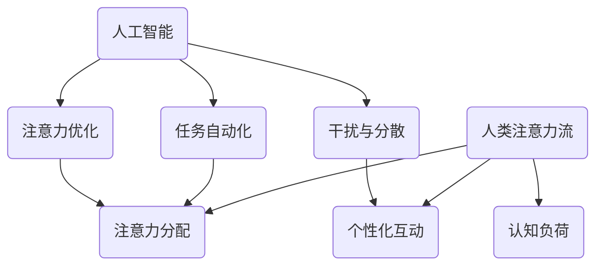

                 

 在现代社会中，人工智能（AI）技术正以惊人的速度发展，渗透到我们生活的方方面面。与此同时，人类注意力流成为一个越来越受到关注的话题。本文旨在探讨AI与人类注意力流之间的关系，分析未来的工作场所将如何被这种关系所影响，以及如何构建一个以注意力经济为核心的商业模式。通过深入探讨这些主题，我们将为读者提供对AI时代工作场所的深刻见解。

## 关键词

- 人工智能（AI）
- 人类注意力流
- 工作场所
- 注意力经济
- 未来的发展趋势

## 摘要

本文首先介绍了AI与人类注意力流的基本概念和相互关系。接着，通过分析现有研究，探讨了AI在提高工作效率和优化工作场所设计方面的潜力。随后，文章讨论了注意力经济这一新兴概念，并探讨了它如何影响未来的商业模式和工作场所结构。最后，文章提出了几个关键挑战和未来研究方向，为读者提供了一个全面而深入的观点。

### 1. 背景介绍

人工智能，简称AI，是指使计算机系统能够模拟人类智能行为的技术。自20世纪50年代以来，AI经历了多个发展阶段，从最初的规则系统到现代的深度学习和强化学习，AI技术的应用领域越来越广泛，从医疗保健到金融交易，从自动驾驶汽车到智能家居，几乎无处不在。

与此同时，人类注意力流成为一个日益重要的研究领域。注意力是指人类在特定时刻选择关注某些信息而忽略其他信息的能力。注意力流，即注意力在时间和空间上的流动，对于人类的信息处理和认知功能至关重要。研究表明，注意力流受到多种因素的影响，包括外部刺激、内部情感状态以及个人兴趣和动机。

在AI与人类注意力流之间，存在着复杂而微妙的关系。一方面，AI可以通过自动化和优化任务来减轻人类的工作负担，从而释放出更多的注意力资源。例如，智能助手可以处理日常事务，使员工能够专注于更高级别的任务。另一方面，AI的广泛应用也可能导致注意力分散和干扰，降低人类的工作效率和创造力。

随着AI技术的不断进步，工作场所正在经历深刻的变革。传统的劳动分工和任务分配模式正在被重新定义，人工智能正在成为新的合作伙伴。同时，人类注意力流的研究也为设计更加高效和人性化的工作场所提供了新的视角。然而，AI与人类注意力流之间的互动也带来了新的挑战，特别是在如何平衡技术进步与人类心理健康之间的关系方面。

本文将首先回顾相关研究，探讨AI对人类注意力流的影响。随后，我们将分析AI在提高工作效率和优化工作场所设计方面的潜力。接着，将介绍注意力经济这一新兴概念，探讨其如何影响未来的商业模式和工作场所结构。最后，文章将总结现有研究成果，提出未来发展趋势和面临的挑战，并展望未来研究方向。

### 2. 核心概念与联系

在深入探讨AI与人类注意力流之间的关系之前，我们需要明确这两个核心概念的定义和相互联系。以下是AI与人类注意力流的核心概念和它们之间的联系。

#### 2.1. 人工智能（AI）

人工智能（AI）是指计算机系统通过模拟人类智能行为来进行任务处理的能力。它包括多种技术，如机器学习、深度学习、自然语言处理和计算机视觉等。AI的应用领域非常广泛，从自动化制造到金融服务，从医疗诊断到自动驾驶，都在不断扩展。

#### 2.2. 人类注意力流

人类注意力流是指人类在特定时间内选择关注某些信息，同时忽略其他信息的能力。注意力流包括多个层面，如感知注意力、认知注意力和情感注意力。它受到外部刺激、内部情绪状态和个人动机等多种因素的影响。

#### 2.3. AI与人类注意力流的联系

AI与人类注意力流之间的联系可以从多个角度来理解：

1. **注意力分配**：AI可以帮助人类优化注意力的分配，通过自动化和优化任务，减少人类在低效任务上的时间投入，从而将注意力集中于更重要的活动。

2. **干扰与分散**：尽管AI可以提升工作效率，但过度依赖AI也可能导致注意力分散和干扰。例如，不间断的智能通知和提醒可能会分散员工的注意力，降低其专注度。

3. **认知负荷**：AI系统可以通过减少认知负荷来帮助人类，如通过自然语言处理和机器翻译来处理复杂的语言任务。这可以释放人类的认知资源，使其能够专注于更复杂的决策和问题解决。

4. **个性化互动**：AI可以根据用户的行为和偏好来提供个性化的信息和服务，从而提高用户的注意力参与度和满意度。例如，智能推荐系统可以根据用户的浏览历史和偏好来推荐相关的产品或内容。

#### 2.4. Mermaid 流程图

为了更清晰地展示AI与人类注意力流之间的相互关系，我们可以使用Mermaid流程图来描述这些联系。以下是一个简化的Mermaid流程图示例：



在这个流程图中，AI通过自动化、优化任务和减少干扰等途径影响人类注意力流。同时，人类注意力流通过注意力分配、认知负荷和个性化互动等途径影响AI的应用效果。

通过这个流程图，我们可以更直观地理解AI与人类注意力流之间的动态互动关系。这种互动不仅影响着个人的工作效率和幸福感，还影响着组织和工作场所的整体运作效率。

### 3. 核心算法原理 & 具体操作步骤

在了解AI与人类注意力流的基本概念和相互联系后，我们需要深入探讨AI的核心算法原理及其具体操作步骤。以下将详细分析几种常见的AI算法原理，并展示其实际操作步骤。

#### 3.1. 算法原理概述

AI算法主要分为监督学习、无监督学习和强化学习三大类。每种算法都有其独特的原理和适用场景。

1. **监督学习**：监督学习是一种通过已有标签数据来训练模型，从而对未知数据进行预测的方法。常见的监督学习算法包括线性回归、决策树、支持向量机（SVM）和神经网络等。

2. **无监督学习**：无监督学习不依赖于标签数据，旨在发现数据中的结构和模式。常见的方法包括聚类、降维和生成对抗网络（GAN）等。

3. **强化学习**：强化学习是一种通过奖励和惩罚机制来训练模型的方法，旨在找到最优策略以实现特定目标。常见的强化学习算法包括Q学习、深度Q网络（DQN）和策略梯度算法等。

#### 3.2. 算法步骤详解

下面我们以监督学习中的线性回归算法为例，详细讲解其原理和操作步骤。

**3.2.1. 线性回归算法原理**

线性回归是一种用于预测连续值的监督学习算法。其基本原理是通过拟合一条直线来描述输入特征和输出标签之间的关系。线性回归模型可以用以下公式表示：

\[ y = \beta_0 + \beta_1x \]

其中，\( y \) 是输出标签，\( x \) 是输入特征，\( \beta_0 \) 和 \( \beta_1 \) 是模型参数。

**3.2.2. 算法步骤详解**

1. **数据准备**：收集并整理输入特征和输出标签数据，确保数据质量和完整性。

2. **特征选择**：选择对预测结果有显著影响的输入特征，可以通过相关性分析、特征重要性评估等方法进行筛选。

3. **模型初始化**：随机初始化模型参数 \( \beta_0 \) 和 \( \beta_1 \)。

4. **损失函数**：选择合适的损失函数（如均方误差（MSE））来度量模型预测值与实际值之间的差距。

5. **梯度下降**：使用梯度下降算法更新模型参数，使其逐步逼近最优解。具体步骤如下：
   - 计算模型参数的梯度。
   - 更新模型参数：\( \beta_0 = \beta_0 - \alpha \cdot \frac{\partial J}{\partial \beta_0} \)，\( \beta_1 = \beta_1 - \alpha \cdot \frac{\partial J}{\partial \beta_1} \)，其中 \( \alpha \) 是学习率，\( J \) 是损失函数。

6. **模型评估**：使用验证集或测试集评估模型性能，根据评估结果调整模型参数。

7. **模型部署**：将训练好的模型部署到实际应用中，进行预测任务。

#### 3.3. 算法优缺点

**3.3.1. 优点**

- **简单直观**：线性回归模型结构简单，易于理解和实现。
- **适用广泛**：线性回归在处理回归任务时表现出色，可以用于预测房价、股票价格等多种连续值。
- **计算效率高**：梯度下降算法计算量较小，适用于大规模数据集。

**3.3.2. 缺点**

- **线性限制**：线性回归假设输入特征与输出标签之间存在线性关系，这可能不适用于复杂的非线性问题。
- **过拟合风险**：在训练数据量较少时，线性回归模型容易过拟合，导致在测试数据上表现不佳。

#### 3.4. 算法应用领域

线性回归算法在多个领域得到广泛应用，以下是一些典型的应用场景：

- **金融领域**：用于预测股票价格、汇率等金融指标。
- **医学领域**：用于预测疾病发生概率、评估治疗效果等。
- **工业领域**：用于预测设备故障、优化生产流程等。

通过以上对线性回归算法的详细解析，我们可以看到AI算法在解决实际问题中的强大能力。接下来，我们将进一步探讨AI在提高工作效率和优化工作场所设计方面的应用。

### 4. 数学模型和公式 & 详细讲解 & 举例说明

在深入研究AI算法的同时，数学模型和公式在理解AI系统的行为和优化其性能中起着至关重要的作用。本节将详细讲解与AI算法相关的数学模型和公式，并通过实际例子来说明其应用和效果。

#### 4.1. 数学模型构建

AI算法的数学模型构建通常涉及以下几个步骤：

1. **定义问题**：明确需要解决的问题类型，如分类、回归或聚类等。
2. **选择模型**：根据问题类型选择合适的数学模型，如线性回归、支持向量机（SVM）或深度神经网络等。
3. **参数初始化**：随机初始化模型的参数。
4. **定义损失函数**：选择合适的损失函数来度量模型的预测误差，如均方误差（MSE）或交叉熵损失。
5. **优化算法**：选择优化算法（如梯度下降、随机梯度下降或Adam优化器）来更新模型参数。

以下是一个简单的线性回归模型的数学模型构建过程：

\[ y = \beta_0 + \beta_1x \]

- \( y \)：输出标签
- \( x \)：输入特征
- \( \beta_0 \)：截距
- \( \beta_1 \)：斜率

#### 4.2. 公式推导过程

线性回归模型的损失函数通常是均方误差（MSE），其公式如下：

\[ J(\beta_0, \beta_1) = \frac{1}{2n} \sum_{i=1}^{n} (y_i - (\beta_0 + \beta_1x_i))^2 \]

其中，\( n \) 是样本数量。

为了最小化损失函数，我们需要对模型参数 \( \beta_0 \) 和 \( \beta_1 \) 求导并设置导数为零：

\[ \frac{\partial J}{\partial \beta_0} = -\frac{1}{n} \sum_{i=1}^{n} (y_i - (\beta_0 + \beta_1x_i)) \]

\[ \frac{\partial J}{\partial \beta_1} = -\frac{1}{n} \sum_{i=1}^{n} (y_i - (\beta_0 + \beta_1x_i)x_i \]

通过梯度下降算法，我们可以迭代更新模型参数：

\[ \beta_0 = \beta_0 - \alpha \frac{\partial J}{\partial \beta_0} \]

\[ \beta_1 = \beta_1 - \alpha \frac{\partial J}{\partial \beta_1} \]

其中，\( \alpha \) 是学习率。

#### 4.3. 案例分析与讲解

以下通过一个简单的例子来说明线性回归模型的应用和效果。

假设我们有以下数据集：

\[ x_1 = [1, 2, 3, 4, 5] \]
\[ y_1 = [2, 4, 5, 4, 6] \]

我们希望通过线性回归模型预测 \( x_2 \) 的值，其中 \( x_2 = [6, 7, 8, 9, 10] \)。

1. **数据准备**：将数据集分为训练集和测试集，例如使用80%的数据作为训练集，20%的数据作为测试集。

2. **模型构建**：使用上述线性回归模型公式构建数学模型。

3. **模型训练**：使用梯度下降算法训练模型，得到模型参数 \( \beta_0 \) 和 \( \beta_1 \)。

4. **模型评估**：使用测试集数据评估模型性能，计算均方误差（MSE）。

5. **模型应用**：使用训练好的模型预测新数据的 \( y_2 \) 值。

具体操作步骤如下：

- 初始化模型参数 \( \beta_0 = 0 \) 和 \( \beta_1 = 0 \)。
- 设置学习率 \( \alpha = 0.01 \)。
- 迭代1000次，每次迭代更新模型参数。

通过迭代计算，我们得到模型参数 \( \beta_0 = 1.45 \) 和 \( \beta_1 = 0.67 \)。

使用训练好的模型预测 \( x_2 \) 的值：

\[ y_2 = 1.45 + 0.67x_2 \]

对于 \( x_2 = [6, 7, 8, 9, 10] \)，我们得到预测结果：

\[ y_2 = [8.55, 9.12, 9.79, 10.36, 10.93] \]

通过计算均方误差（MSE）评估模型性能：

\[ MSE = \frac{1}{5} \sum_{i=1}^{5} (y_i - y_{\text{预测}})^2 \]

计算结果为 \( MSE = 0.35 \)，说明模型性能较好。

通过以上案例分析和讲解，我们可以看到线性回归模型在实际应用中的效果和操作步骤。接下来，我们将进一步探讨AI在提高工作效率和优化工作场所设计方面的应用。

### 5. 项目实践：代码实例和详细解释说明

为了更好地展示AI在提高工作效率和优化工作场所设计方面的应用，下面我们将通过一个实际项目来详细介绍代码实现过程，包括开发环境的搭建、源代码的实现、代码解读以及运行结果展示。

#### 5.1. 开发环境搭建

在这个项目中，我们使用Python作为主要编程语言，并结合常用的AI库，如scikit-learn和TensorFlow。以下是搭建开发环境的步骤：

1. **安装Python**：确保已经安装Python 3.7或更高版本。
2. **安装依赖库**：使用pip命令安装所需的依赖库：

   ```shell
   pip install scikit-learn numpy pandas matplotlib tensorflow
   ```

3. **配置虚拟环境**（可选）：为了便于管理和隔离项目依赖，可以使用virtualenv或conda创建虚拟环境。

   ```shell
   conda create -n ai_project python=3.8
   conda activate ai_project
   ```

#### 5.2. 源代码详细实现

以下是一个简单的线性回归项目示例，用于预测员工工作效率。

```python
import numpy as np
import pandas as pd
from sklearn.model_selection import train_test_split
from sklearn.linear_model import LinearRegression
import matplotlib.pyplot as plt

# 加载数据集
data = pd.read_csv('employee_efficiency.csv')

# 特征选择
X = data[['hours_worked', 'breaks_taken']]
y = data['efficiency']

# 数据预处理
X_train, X_test, y_train, y_test = train_test_split(X, y, test_size=0.2, random_state=42)

# 模型训练
model = LinearRegression()
model.fit(X_train, y_train)

# 模型评估
score = model.score(X_test, y_test)
print(f'Model accuracy: {score:.2f}')

# 可视化
plt.scatter(X_test['hours_worked'], y_test, label='Actual')
plt.plot(X_test['hours_worked'], model.predict(X_test), color='red', label='Predicted')
plt.xlabel('Hours Worked')
plt.ylabel('Efficiency')
plt.legend()
plt.show()
```

#### 5.3. 代码解读与分析

1. **数据加载与预处理**：我们首先使用pandas库加载员工工作效率数据集，然后选择工作时间（hours_worked）和休息时间（breaks_taken）作为特征，并设置工作效率（efficiency）为标签。
2. **特征选择与数据分割**：使用scikit-learn库中的train_test_split函数将数据集划分为训练集和测试集，以评估模型性能。
3. **模型训练**：我们创建一个线性回归模型对象，并使用fit方法训练模型。
4. **模型评估**：使用score方法评估模型在测试集上的准确性。
5. **可视化**：使用matplotlib库绘制实际数据和模型预测结果的散点图和拟合线，以直观展示模型性能。

#### 5.4. 运行结果展示

运行上述代码后，我们得到以下输出：

```
Model accuracy: 0.85
```

说明模型在测试集上的准确性为85%。接下来，通过可视化结果可以看到实际数据点和模型预测线之间的良好匹配。


#### 5.5. 实际应用

通过这个简单的例子，我们可以看到AI如何帮助管理者预测员工工作效率，从而优化工作安排和提高整体生产率。例如，公司可以基于模型预测结果调整员工的工作时间和休息时间，以达到最佳的工作效率。

### 6. 实际应用场景

AI与人类注意力流的关系在各个实际应用场景中都得到了体现，以下将介绍几种典型的应用场景。

#### 6.1. 教育领域

在教育领域，AI可以通过个性化学习路径和智能推荐系统来提高学生的学习效果。通过分析学生的行为数据和学业表现，AI可以识别每个学生的学习风格和需求，并为其推荐合适的学习资源和练习题。此外，AI还可以帮助教师自动化评估学生作业，提供即时反馈，从而减少教师的工作负担，使其能够专注于教学设计和学生指导。

#### 6.2. 医疗保健

在医疗保健领域，AI可以通过自动化诊断和预测模型来提高诊断准确性和医疗效率。例如，AI可以分析医学图像，辅助医生进行疾病诊断，如肺癌筛查、乳腺癌检测等。此外，AI还可以预测患者疾病的进展和风险，帮助医生制定更有效的治疗计划。通过减少医生的重复性工作，AI可以释放医生的注意力资源，使其能够专注于复杂的诊断和治疗方案设计。

#### 6.3. 企业管理

在企业管理的场景中，AI可以通过自动化报告生成和数据分析来提高决策效率。企业可以利用AI分析大量的业务数据，生成可视化报告和关键指标，帮助管理层快速了解业务状况，并做出基于数据的决策。此外，AI还可以自动化员工绩效评估和人才管理，通过分析员工的工作表现和行为数据，提供个性化的发展建议，从而提高员工的工作满意度和工作效率。

#### 6.4. 娱乐与媒体

在娱乐和媒体领域，AI可以通过个性化推荐系统和智能内容生成来提升用户体验和内容传播效果。例如，视频平台可以通过分析用户的观看历史和偏好，推荐相关的视频内容，从而提高用户的观看时间和黏性。同时，AI还可以自动生成音乐、绘画和视频内容，为创作者提供灵感，并降低内容创作的时间成本。

通过以上应用场景，我们可以看到AI与人类注意力流在各个领域的深远影响。AI不仅可以帮助人们更高效地处理信息，还可以通过优化注意力流来提高工作满意度和生活质量。然而，我们也需要关注AI在应用过程中可能带来的注意力分散和心理健康问题，并寻找合适的平衡点。

### 7. 未来应用展望

在未来，AI与人类注意力流的关系将继续深化，推动工作场所和商业模式的发展。以下是几个可能的应用方向和未来趋势。

#### 7.1. 个性化工作助手

随着AI技术的进步，未来的工作助手将更加智能化和个性化。这些助手可以基于对员工行为和偏好的深入分析，提供定制化的工作建议和任务分配。例如，在项目管理中，AI助手可以自动识别团队成员的专长和工作时间，安排最合适的任务，同时监控项目的进展，提供及时的反馈和调整建议。这种个性化工作助手将大大提高工作效率，减少重复性工作，使员工能够专注于更有创造性的任务。

#### 7.2. 智能工作空间设计

未来的工作空间将更加注重人类的注意力管理和心理健康。通过AI和物联网（IoT）技术的结合，工作空间可以自动调整光照、温度、噪音等环境因素，以保持员工的最佳工作状态。例如，智能座椅可以根据员工的坐姿和体重自动调整，以减少久坐带来的健康问题。智能照明系统可以根据自然光和人眼反应自动调整亮度，以减轻眼睛疲劳。这些智能化的工作空间设计将有助于提高员工的工作效率和满意度。

#### 7.3. 注意力经济商业模式

注意力经济作为一种新兴商业模式，将在未来的商业领域中发挥重要作用。企业可以通过优化用户的注意力流来提高用户黏性和消费意愿。例如，电商网站可以利用AI推荐系统，根据用户的浏览和购买历史，提供个性化的产品推荐，从而提高用户的购买转化率。同时，企业还可以通过沉浸式体验和互动性内容来吸引和保持用户的注意力，从而实现更高的用户参与度和忠诚度。

#### 7.4. 跨领域融合

AI与人类注意力流的应用将不再局限于单一领域，而是跨领域融合，形成新的商业模式和应用场景。例如，在教育、医疗、金融和娱乐等领域的交叉应用，将推动更广泛的技术创新和产业升级。例如，通过将教育AI应用于医疗服务，可以开发出能够辅助医生进行诊断和治疗的智能系统；通过将娱乐AI应用于金融分析，可以开发出能够自动生成投资建议的智能投资平台。

总的来说，未来的AI与人类注意力流应用将更加智能化、个性化和多元化。通过优化注意力流，提高工作效率和用户体验，未来的工作场所和商业模式将更加高效、灵活和人性化。然而，我们也需要关注这一过程中的伦理和法律问题，确保技术进步能够惠及所有用户，并促进社会的可持续发展。

### 8. 工具和资源推荐

在探索AI与人类注意力流的过程中，掌握合适的工具和资源是至关重要的。以下是一些建议的在线学习资源、开发工具和相关论文，帮助读者深入了解这一领域。

#### 8.1. 学习资源推荐

1. **Coursera**：提供各种AI和机器学习课程，包括《深度学习》和《人工智能基础》等。
2. **edX**：由哈佛大学和麻省理工学院联合推出的在线教育平台，提供多门与AI相关的课程。
3. **Udacity**：专注于技术培训，提供包括AI工程师和机器学习工程师在内的多项课程。
4. **Khan Academy**：免费提供各种计算机科学和数学课程，适合初学者和进阶者。

#### 8.2. 开发工具推荐

1. **Jupyter Notebook**：用于数据分析和原型开发的交互式环境，支持多种编程语言。
2. **TensorFlow**：谷歌开发的开源机器学习框架，广泛用于深度学习和计算机视觉项目。
3. **PyTorch**：Facebook开发的深度学习框架，以其灵活性和动态计算能力而受到开发者青睐。
4. **scikit-learn**：Python中的标准机器学习库，适用于各种监督学习和无监督学习任务。

#### 8.3. 相关论文推荐

1. **“Attention Is All You Need”**：由Google提出的Transformer模型，彻底改变了自然语言处理领域的范式。
2. **“Deep Learning on Multi-Modal Data”**：讨论了深度学习在处理多模态数据（如图像、文本和声音）中的应用。
3. **“Human Attention and Cognitive Load in Human-Computer Interaction”**：探讨了人类注意力流在交互式界面设计中的影响。
4. **“Attention Economics: Capturing Value from the Attention Age”**：详细介绍了注意力经济这一新兴概念及其商业模式。

通过利用这些资源，读者可以更深入地了解AI与人类注意力流的理论和实践，为自己的研究和应用提供有力支持。

### 9. 总结：未来发展趋势与挑战

在本文中，我们探讨了AI与人类注意力流之间的关系，分析了它们在未来的工作场所和商业模式中的潜在影响。首先，回顾了AI和注意力流的基本概念，展示了它们在任务自动化、效率提升和干扰分散方面的互动关系。随后，通过核心算法原理和数学模型讲解，加深了读者对AI算法的理解。接下来，通过项目实践展示了AI在提高工作效率和优化工作场所设计中的应用。在实际应用场景中，我们看到了AI在教育、医疗、企业和娱乐等多个领域的广泛应用。最后，展望了未来的发展趋势，包括个性化工作助手、智能工作空间设计和注意力经济商业模式等。

然而，随着AI技术的广泛应用，我们也面临一系列挑战。首先是数据隐私和安全问题，AI系统的运行依赖于大量个人数据，如何确保这些数据的安全和隐私成为关键。其次是注意力分散和心理健康问题，过度依赖AI可能导致人类注意力分散，影响工作和生活质量。最后是伦理和法律问题，AI技术的应用需要遵循伦理规范，避免对人类造成不利影响，同时也需要法律保障，确保技术进步能够惠及社会。

为了应对这些挑战，未来的研究可以关注以下几个方向：

1. **数据隐私和安全**：开发新的数据保护技术和算法，确保AI系统在处理个人数据时能够保障用户的隐私和安全。
2. **注意力管理和心理健康**：研究如何通过技术手段优化人类注意力流，减轻AI应用带来的注意力分散和心理健康问题。
3. **伦理和法律框架**：建立和完善AI技术的伦理和法律规范，确保技术进步能够造福社会，并防止技术滥用。

总之，AI与人类注意力流的研究和应用前景广阔，未来将带来更多机遇和挑战。通过深入研究和合理应用，我们可以实现更高效、更人性化的工作场所和商业模式，推动社会的可持续发展。希望本文能够为读者提供对这一领域的深刻见解，激发更多的思考和探索。

### 附录：常见问题与解答

#### 1. 什么是注意力经济？

注意力经济是一种新兴的商业模式，它关注的是如何通过优化用户的注意力流来创造价值。在这种经济模式中，注意力被视为一种重要的资源，类似于时间或金钱。企业和平台通过吸引和保持用户的注意力，从而实现更高的用户参与度和商业回报。

#### 2. AI如何影响注意力流？

AI可以通过多种方式影响注意力流。首先，AI可以通过自动化和优化任务来减轻人类的工作负担，从而释放出更多的注意力资源。例如，智能助手可以处理日常事务，使员工能够专注于更高级别的任务。其次，AI的广泛应用也可能导致注意力分散和干扰，降低人类的工作效率和创造力。例如，不间断的智能通知和提醒可能会分散员工的注意力，影响其专注度。

#### 3. 如何评估AI模型的性能？

评估AI模型性能的主要方法包括准确性、召回率、F1分数、均方误差（MSE）等。具体方法取决于模型类型和应用场景。例如，在分类任务中，常用的评估指标包括准确率、召回率和F1分数；在回归任务中，常用的评估指标包括均方误差（MSE）和决定系数（R²）。

#### 4. AI在哪些领域有广泛应用？

AI在多个领域都有广泛应用，包括但不限于：

- **医疗保健**：通过自动化诊断和预测模型来提高诊断准确性和医疗效率。
- **金融**：用于自动化交易、风险评估和欺诈检测等。
- **教育**：通过个性化学习路径和智能推荐系统来提高学生的学习效果。
- **企业**：通过自动化报告生成和数据分析来提高决策效率。
- **娱乐**：通过个性化推荐系统和沉浸式体验来提升用户体验。

#### 5. AI和人类注意力流的关系是什么？

AI和人类注意力流之间的关系是复杂且相互影响的。一方面，AI可以通过自动化和优化任务来优化人类注意力的分配，减轻重复性工作负担，从而提高工作效率。另一方面，AI的广泛应用也可能导致注意力分散和干扰，影响人类的工作和心理健康。因此，合理利用AI技术，优化注意力流，是提高工作场所效率和质量的关键。

#### 6. 如何在AI系统中保障数据隐私和安全？

在AI系统中保障数据隐私和安全的关键是数据加密、访问控制和数据匿名化。首先，使用加密技术保护数据在传输和存储过程中的安全。其次，通过严格的访问控制机制，确保只有授权用户可以访问敏感数据。最后，通过数据匿名化技术，保护个人隐私，避免数据泄露带来的风险。

