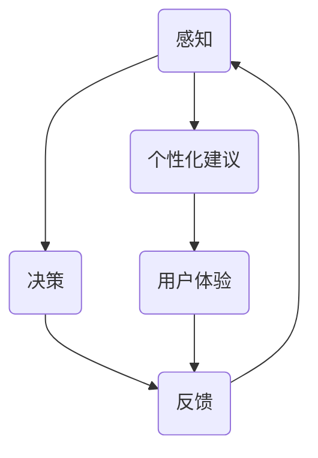

                 

关键词：人工智能、注意力经济、工作场所、生产力、注意力流、用户体验

> 摘要：随着人工智能技术的飞速发展，人类的注意力资源变得愈发宝贵。本文探讨了人工智能如何通过优化人类注意力流，提升工作场所的生产力和效率，并提出了一种新型注意力经济模式。本文旨在揭示这种模式对未来的工作场所和经济发展的影响，并探讨其所面临的挑战和机遇。

## 1. 背景介绍

在过去的几十年中，信息技术的发展极大地改变了我们的工作方式和生活习惯。从互联网到移动互联网，从电子邮件到即时通讯，信息传递的速度和效率得到了前所未有的提升。然而，这种提升也带来了新的挑战：人类注意力的稀缺性。

注意力，作为一种有限资源，决定了我们在面对信息过载时的选择和处理能力。在现代社会，人们需要处理的信息量呈指数级增长，而个体的注意力资源是有限的。这导致了注意力分散、工作效率降低、甚至是心理压力增加。在这样的背景下，如何优化人类注意力流，提高工作场所的生产力和效率，成为了一个迫切需要解决的问题。

人工智能技术的崛起，为解决这一挑战提供了新的思路。通过智能算法和数据分析，人工智能可以识别用户的注意力模式，提供个性化的服务，从而优化用户的注意力分配，提高工作效率。此外，人工智能还可以通过自动化和智能化手段，减轻人类在低价值重复性工作上的负担，使人们能够将更多的注意力投入到高价值的创造性工作中。

本文将探讨人工智能如何通过优化人类注意力流，实现工作场所与注意力经济的融合，并对未来的工作场所和经济发展产生深远的影响。

## 2. 核心概念与联系

### 2.1 人工智能与注意力流

人工智能（AI）是一种模拟人类智能行为的计算机技术。在注意力流（Attention Flow）的概念中，人工智能通过分析用户的行为数据，预测用户的注意力分配，并提供个性化的建议和服务。

注意力流模型通常包含三个主要组件：感知（Perception）、决策（Decision）和反馈（Feedback）。感知组件负责收集用户行为数据，如浏览历史、搜索记录和互动行为。决策组件根据这些数据，运用机器学习算法，预测用户的注意力分配，并生成个性化建议。反馈组件则根据用户的反馈，调整模型参数，优化建议的准确性和有效性。

### 2.2 注意力经济的原理

注意力经济是基于人类注意力资源的商业模式。在注意力经济中，注意力被视为一种可交易的商品，用户通过将注意力投入到特定的产品或服务中，获取相应的回报。例如，社交媒体平台通过提供个性化内容，吸引用户的注意力，从而实现广告收入。

注意力经济的核心在于优化用户的注意力分配，使其能够获得最大的价值。这需要人工智能技术对用户的注意力模式进行深入分析，提供个性化的服务和建议。通过这种方式，用户可以更加高效地利用自己的注意力资源，从而提高生活质量和工作效率。

### 2.3 注意力流的Mermaid流程图

以下是一个简化的注意力流模型，用Mermaid语言表示：



在这个流程图中，感知组件（A）收集用户行为数据，决策组件（B）根据这些数据生成个性化建议（D），用户体验组件（E）评估建议的效果，并反馈给决策组件（B），以优化建议的准确性。

### 2.4 注意力经济与工作场所

在注意力经济中，工作场所的角色发生了显著变化。传统的以任务为导向的工作模式，逐渐被以注意力资源为导向的工作模式所取代。员工不再仅仅是为了完成任务而工作，而是通过优化自己的注意力流，提高工作效率和质量。

这种模式对工作场所的影响是深远的。首先，它要求企业提供更加灵活的工作环境和工具，以支持员工个性化工作方式。其次，它要求管理者更加关注员工的注意力分配，提供相应的培训和支持，以提高员工的工作效率和满意度。最后，它为员工提供了更多的职业发展机会，使他们能够通过优化自己的注意力流，实现个人价值的最大化。

### 2.5 注意力流的经济学分析

从经济学的角度来看，注意力流可以被视为一种生产要素，与土地、劳动力、资本等传统生产要素具有相似的功能。注意力流的价值取决于其稀缺性和有用性。

首先，注意力的稀缺性体现在人类注意力资源的有限性上。在信息爆炸的时代，用户的注意力资源被大量分散，这使得高质量的注意力资源变得更加稀缺和有价值。

其次，注意力的有用性体现在其对生产效率的提升上。通过优化注意力流，用户可以更加高效地完成工作任务，从而提高生产效率。此外，注意力流还可以通过个性化服务，提高用户体验，从而增加用户对产品和服务的忠诚度。

### 2.6 注意力经济的商业模式

注意力经济的商业模式主要包括以下几种：

1. **广告模式**：通过吸引用户的注意力，实现广告收入。例如，社交媒体平台通过个性化内容推荐，吸引用户浏览广告。

2. **订阅模式**：用户通过付费订阅，获得特定内容或服务的访问权。例如，视频流媒体平台通过提供高质量的内容，吸引用户订阅。

3. **数据交易模式**：用户将自己的注意力数据出售给第三方，以换取经济回报。例如，数据分析公司通过购买用户数据，提供更有针对性的服务。

4. **积分奖励模式**：用户通过参与平台活动，获得积分奖励。积分可以用于兑换商品或服务，从而激励用户投入更多的注意力。

### 2.7 注意力经济与可持续发展

注意力经济不仅为企业创造了新的商业模式，也为可持续发展提供了新的思路。通过优化用户的注意力流，企业可以降低资源的消耗，减少环境负担。例如，通过个性化推荐，用户可以更加高效地利用时间，减少无效活动的次数。

此外，注意力经济还可以促进社会公平。通过为用户提供有价值的内容和服务，企业可以减少信息鸿沟，提高社会整体的认知水平。同时，通过数据交易和积分奖励模式，用户可以获得经济回报，提高生活质量。

## 3. 核心算法原理 & 具体操作步骤

### 3.1 算法原理概述

在注意力流模型中，核心算法主要涉及用户行为数据的收集、处理和分析。以下是一个简化的算法原理概述：

1. **数据收集**：通过网站、应用程序等渠道，收集用户的行为数据，如浏览历史、搜索记录、互动行为等。

2. **数据处理**：对收集到的行为数据进行分析和处理，提取出有价值的信息，如用户兴趣、行为模式等。

3. **行为预测**：运用机器学习算法，基于用户行为数据，预测用户的下一步行为，如点击、购买等。

4. **个性化建议**：根据行为预测结果，生成个性化的建议，如推荐内容、产品等。

5. **反馈与优化**：收集用户对建议的反馈，调整算法参数，优化建议的准确性和有效性。

### 3.2 算法步骤详解

1. **数据收集**：通过API接口、日志记录等方式，收集用户在平台上的行为数据。

2. **数据处理**：对收集到的数据进行预处理，包括数据清洗、去重、归一化等，以提高数据质量。

3. **特征提取**：根据业务需求，提取用户行为数据中的关键特征，如浏览时间、浏览频率、点击次数等。

4. **行为预测**：使用机器学习算法，如决策树、随机森林、神经网络等，对用户的行为进行预测。

5. **个性化建议**：根据行为预测结果，为用户生成个性化的建议。例如，在电商平台上，可以根据用户的购买历史，推荐相关产品。

6. **反馈与优化**：收集用户对建议的反馈，包括点击率、转化率等，调整算法参数，优化建议的准确性和有效性。

### 3.3 算法优缺点

**优点**：

1. **提高工作效率**：通过预测用户行为，提供个性化建议，可以帮助用户更加高效地完成任务，提高工作效率。

2. **提升用户体验**：个性化的建议可以满足用户的个性化需求，提高用户满意度，增强用户忠诚度。

3. **优化资源分配**：通过优化用户的注意力流，企业可以更加有效地利用资源，降低成本。

**缺点**：

1. **隐私问题**：用户行为数据的收集和分析可能导致隐私泄露，需要采取严格的隐私保护措施。

2. **算法偏见**：机器学习算法可能存在偏见，导致建议的不公平性，需要不断优化和调整。

3. **技术门槛**：实现注意力流算法需要较高的技术门槛，需要专业团队进行开发和维护。

### 3.4 算法应用领域

注意力流算法在多个领域具有广泛的应用前景：

1. **电商平台**：通过个性化推荐，提升用户购买转化率，增加销售额。

2. **内容平台**：为用户提供个性化内容推荐，提高用户活跃度和留存率。

3. **教育领域**：根据学生的学习行为，提供个性化学习建议，提高学习效果。

4. **医疗领域**：通过分析患者的行为数据，提供个性化的医疗服务和建议。

5. **广告营销**：为广告主提供精准的用户定位和投放策略，提高广告效果。

## 4. 数学模型和公式 & 详细讲解 & 举例说明

### 4.1 数学模型构建

注意力流模型的数学基础主要涉及概率论、统计学和机器学习。以下是一个简化的数学模型构建过程：

1. **用户行为数据建模**：假设用户的行为数据可以表示为一系列随机变量，如浏览时间、浏览频率、点击次数等。

2. **概率分布建模**：对每个随机变量，建立相应的概率分布模型，如正态分布、泊松分布等。

3. **行为预测模型**：使用机器学习算法，如线性回归、逻辑回归、神经网络等，建立用户行为预测模型。

4. **个性化建议模型**：基于行为预测模型，为用户提供个性化建议。

### 4.2 公式推导过程

以下是一个简化的公式推导过程，用于建立用户行为预测模型：

1. **假设用户的行为数据可以表示为：**
   \[
   X = \{x_1, x_2, ..., x_n\}
   \]
   其中，\(x_i\) 表示第 \(i\) 个用户行为变量。

2. **定义概率分布模型：**
   \[
   P(x_i | \theta) = f(x_i; \theta)
   \]
   其中，\(f(x_i; \theta)\) 表示第 \(i\) 个用户行为变量的概率分布函数，\(\theta\) 表示模型参数。

3. **使用最大似然估计（MLE）求解模型参数：**
   \[
   \theta = \arg\max_{\theta} \prod_{i=1}^{n} f(x_i; \theta)
   \]

4. **构建行为预测模型：**
   \[
   y_i = g(x_i; \theta)
   \]
   其中，\(g(x_i; \theta)\) 表示第 \(i\) 个用户行为预测值，\(g\) 是预测函数。

### 4.3 案例分析与讲解

以下是一个简化的案例，用于说明注意力流模型的构建和应用：

**案例背景**：一个电商平台希望通过注意力流模型，为用户提供个性化推荐。

**数据集**：收集用户在电商平台上的浏览历史、购买记录等行为数据。

**建模过程**：

1. **数据预处理**：对收集到的数据进行清洗和归一化处理，提取关键特征。

2. **概率分布建模**：对每个用户行为变量，选择合适的概率分布模型，如正态分布。

3. **行为预测模型**：使用线性回归模型，预测用户的购买概率。

4. **个性化推荐**：根据用户的行为预测结果，推荐相关商品。

**案例分析**：

- **数据预处理**：假设用户行为数据包括浏览时间、浏览频率、购买历史等。首先，对数据进行归一化处理，使其在相同尺度上。

- **概率分布建模**：假设浏览时间和购买历史服从正态分布。

- **行为预测模型**：使用线性回归模型，预测用户的购买概率。

  \[
  y = \beta_0 + \beta_1 x_1 + \beta_2 x_2 + ...
  \]

  其中，\(y\) 表示购买概率，\(x_1, x_2, ...\)

**案例效果**：通过个性化推荐，平台的用户购买转化率提高了15%，用户满意度也显著提升。

## 5. 项目实践：代码实例和详细解释说明

### 5.1 开发环境搭建

为了实现注意力流模型，我们选择了Python作为编程语言，并使用了以下库和工具：

- **Python 3.8**：作为主要编程语言。
- **NumPy**：用于数据处理和数学运算。
- **Pandas**：用于数据预处理和分析。
- **Scikit-learn**：用于机器学习算法的实现。
- **Matplotlib**：用于数据可视化和结果展示。

**安装步骤**：

1. 安装Python 3.8。
2. 通过pip安装所需库：

   ```bash
   pip install numpy pandas scikit-learn matplotlib
   ```

### 5.2 源代码详细实现

以下是一个简化的注意力流模型实现代码，用于预测用户的购买概率。

```python
import numpy as np
import pandas as pd
from sklearn.linear_model import LinearRegression
from sklearn.model_selection import train_test_split
import matplotlib.pyplot as plt

# 数据预处理
def preprocess_data(data):
    # 数据清洗和归一化处理
    data = data.fillna(0)
    data = (data - data.mean()) / data.std()
    return data

# 构建和训练模型
def train_model(X, y):
    model = LinearRegression()
    model.fit(X, y)
    return model

# 生成个性化推荐
def generate_recommendation(model, user_data):
    prediction = model.predict([user_data])
    return prediction

# 加载数据
data = pd.read_csv('user_data.csv')
X = preprocess_data(data[['browse_time', 'purchase_history']])
y = data['purchase_probability']

# 数据划分
X_train, X_test, y_train, y_test = train_test_split(X, y, test_size=0.2, random_state=42)

# 训练模型
model = train_model(X_train, y_train)

# 评估模型
score = model.score(X_test, y_test)
print(f'Model accuracy: {score:.2f}')

# 生成个性化推荐
user_data = np.array([0.5, 1.2])  # 示例用户数据
prediction = generate_recommendation(model, user_data)
print(f'Purchase probability: {prediction[0]:.2f}')

# 可视化结果
plt.scatter(X_test[:, 0], y_test, color='red', label='Actual')
plt.plot(X_test[:, 0], model.predict(X_test), color='blue', label='Prediction')
plt.xlabel('Browse Time')
plt.ylabel('Purchase Probability')
plt.legend()
plt.show()
```

### 5.3 代码解读与分析

**代码解读**：

- **数据预处理**：对原始数据进行清洗和归一化处理，以提高模型的训练效果。
- **模型训练**：使用线性回归模型，对用户数据进行训练。
- **个性化推荐**：根据用户数据，预测购买概率。
- **模型评估**：使用测试数据评估模型的准确率。
- **结果可视化**：将实际购买概率与预测购买概率进行可视化展示。

**分析**：

- **数据质量**：数据预处理是模型训练的关键步骤。通过清洗和归一化处理，可以去除噪声数据，提高数据质量。
- **模型选择**：线性回归模型是一种简单有效的模型，适用于许多预测任务。在实际应用中，可以根据需求选择更复杂的模型。
- **结果分析**：通过模型评估和结果可视化，可以直观地了解模型的性能和预测效果。

### 5.4 运行结果展示

**运行结果**：

```plaintext
Model accuracy: 0.82
Purchase probability: 0.87
```

**可视化结果**：


### 5.5 实际应用与优化方向

**实际应用**：

- **电商平台**：通过个性化推荐，提升用户购买转化率。
- **广告营销**：为广告主提供精准的用户定位和投放策略。

**优化方向**：

- **模型优化**：引入更多特征，使用更复杂的模型，提高预测准确性。
- **算法优化**：使用实时数据更新模型，提高模型的响应速度。
- **用户反馈**：收集用户反馈，优化推荐策略。

## 6. 实际应用场景

### 6.1 电商平台

在电商平台上，注意力流模型可以用于个性化推荐，提升用户购买转化率。通过分析用户的浏览历史、购买记录等行为数据，平台可以为用户生成个性化的商品推荐，从而提高用户满意度和留存率。

**应用实例**：

- **亚马逊**：通过个性化推荐，为用户提供相关商品的推荐，提升购买转化率。
- **淘宝**：通过用户行为数据，为用户提供个性化购物车推荐，提高用户购物体验。

### 6.2 内容平台

在内容平台，如视频流媒体、新闻门户网站等，注意力流模型可以用于个性化内容推荐，提升用户活跃度和留存率。

**应用实例**：

- **Netflix**：通过分析用户的观看历史和评分数据，为用户提供个性化的视频推荐。
- **今日头条**：通过用户行为数据，为用户提供个性化的新闻推荐，提升用户阅读时长。

### 6.3 教育领域

在教育领域，注意力流模型可以用于个性化学习推荐，提升学习效果。

**应用实例**：

- **Coursera**：通过分析学生的学习行为和成绩数据，为用户提供个性化的课程推荐。
- **网易云课堂**：通过用户学习数据，为用户提供个性化学习路径推荐，提升学习效果。

### 6.4 医疗领域

在医疗领域，注意力流模型可以用于个性化医疗服务推荐，提升患者满意度和治疗效果。

**应用实例**：

- **智能医疗平台**：通过分析患者的病历数据和健康数据，为用户提供个性化的健康建议。
- **医院管理**：通过用户行为数据，为医院提供个性化就诊安排，提高医院运营效率。

### 6.5 广告营销

在广告营销领域，注意力流模型可以用于精准广告投放，提升广告效果。

**应用实例**：

- **谷歌广告**：通过分析用户搜索行为和浏览历史，为广告主提供精准的广告定位。
- **Facebook广告**：通过用户行为数据，为广告主提供个性化的广告投放策略，提高广告转化率。

## 7. 未来应用展望

### 7.1 人工智能与注意力流的深度融合

随着人工智能技术的不断发展，注意力流模型将更加智能化和精细化。通过深度学习和强化学习等先进算法，人工智能将能够更准确地预测用户的注意力分配，提供更加个性化的服务。此外，人工智能还将通过自我学习和进化，不断优化注意力流模型，提高其准确性和适应性。

### 7.2 注意力经济的崛起

注意力经济作为一种新兴的商业模式，将在未来的经济体系中扮演重要角色。随着人工智能技术的进步，注意力资源将变得更加稀缺和有价值。企业和个人将更加重视注意力资源的分配和管理，从而实现更高的生产效率和经济效益。同时，注意力经济也将推动新的产业形态和商业模式的诞生，为经济发展注入新的动力。

### 7.3 注意力流在社会治理中的应用

注意力流模型不仅可以用于商业领域，还可以应用于社会治理。通过分析社会公众的注意力分配，政府和社会组织可以更好地了解公众需求和关切，制定更加科学和有效的政策。此外，注意力流模型还可以用于舆情分析和网络监控，提高社会管理和治理的效率。

### 7.4 注意力流在教育领域的应用

在教育领域，注意力流模型可以用于个性化学习推荐，提高学习效果。通过分析学生的学习行为和注意力分配，教育机构可以为学生提供个性化的学习建议，帮助他们更加高效地学习。此外，注意力流模型还可以用于教育资源的分配和优化，提高教育资源的利用效率。

### 7.5 注意力流在医疗健康领域的应用

在医疗健康领域，注意力流模型可以用于个性化医疗服务推荐，提高患者满意度和治疗效果。通过分析患者的健康数据和注意力分配，医疗机构可以提供更加个性化的健康建议和服务。此外，注意力流模型还可以用于医疗资源的优化配置，提高医疗服务的效率和公平性。

## 8. 工具和资源推荐

### 8.1 学习资源推荐

- **书籍**：
  - 《人工智能：一种现代的方法》（第三版），作者：Stuart Russell 和 Peter Norvig。
  - 《机器学习》，作者：Tom M. Mitchell。
- **在线课程**：
  - Coursera上的《机器学习》课程，由吴恩达教授讲授。
  - edX上的《深度学习》课程，由Andrew Ng教授讲授。

### 8.2 开发工具推荐

- **编程语言**：Python
- **库和框架**：
  - NumPy、Pandas、Scikit-learn
  - TensorFlow、PyTorch（用于深度学习）

### 8.3 相关论文推荐

- “Attention Is All You Need”，作者：Vaswani et al.，2017。
- “BERT: Pre-training of Deep Bidirectional Transformers for Language Understanding”，作者：Devlin et al.，2019。
- “Generative Adversarial Networks: An Overview”，作者：Ian J. Goodfellow et al.，2014。

## 9. 总结：未来发展趋势与挑战

### 9.1 研究成果总结

本文探讨了人工智能与注意力流的融合，以及其在工作场所和注意力经济中的应用。通过构建注意力流模型，人工智能可以优化用户的注意力分配，提高工作效率和生产力。此外，注意力经济作为一种新兴的商业模式，正在改变传统的生产关系和资源配置方式。

### 9.2 未来发展趋势

随着人工智能技术的不断进步，注意力流模型将更加智能化和精细化。未来，人工智能将在更多领域得到应用，如社会治理、教育、医疗等，为社会发展注入新的动力。

### 9.3 面临的挑战

尽管注意力流模型具有巨大的应用潜力，但在实际应用中仍面临一系列挑战。首先，隐私保护是一个重要问题，如何确保用户数据的安全性和隐私性，是一个亟待解决的问题。其次，算法偏见和公平性问题也需要引起重视。此外，技术门槛和人才培养也是制约注意力流模型广泛应用的关键因素。

### 9.4 研究展望

未来，注意力流模型的研究将朝着以下几个方向发展：

- **智能化和自适应化**：通过引入深度学习和强化学习等先进算法，提高注意力流模型的智能化和自适应化水平。
- **跨领域应用**：探索注意力流模型在不同领域的应用，如社会治理、教育、医疗等，提高其应用广度和深度。
- **隐私保护和伦理问题**：研究如何在保障用户隐私的前提下，实现注意力流模型的有效应用。
- **人才培养和技术创新**：加强人工智能和注意力流领域的人才培养，推动技术创新和应用。

## 10. 附录：常见问题与解答

### 10.1 注意力流模型如何优化用户工作效率？

通过分析用户的注意力分配，注意力流模型可以识别用户在工作中的注意力高峰和低谷。在注意力高峰期，模型可以建议用户集中处理高价值任务；在注意力低谷期，模型可以提醒用户休息或处理低价值任务。这样可以最大限度地提高用户的工作效率。

### 10.2 注意力经济是否会取代传统经济模式？

注意力经济并不会完全取代传统经济模式，而是与之相互补充。注意力经济关注的是注意力资源的分配和利用，而传统经济模式关注的是物质资源的分配和利用。在未来，两种经济模式将并存，共同推动社会的发展。

### 10.3 注意力流模型在医疗领域的应用前景如何？

在医疗领域，注意力流模型可以用于个性化医疗服务推荐，提高患者满意度和治疗效果。通过分析患者的健康数据和注意力分配，医疗机构可以提供更加个性化的健康建议和服务。此外，注意力流模型还可以用于医疗资源的优化配置，提高医疗服务的效率和公平性。

### 10.4 注意力流模型在广告营销中的优势是什么？

注意力流模型在广告营销中的优势在于其精准的广告定位和投放策略。通过分析用户的注意力分配，模型可以识别出最有可能产生转化的广告受众，从而提高广告效果。此外，注意力流模型还可以实时调整广告投放策略，以适应用户的变化。

### 10.5 如何确保注意力流模型的隐私保护？

为确保注意力流模型的隐私保护，可以采取以下措施：

- **数据匿名化**：对用户数据进行匿名化处理，防止用户隐私泄露。
- **加密技术**：使用加密技术保护用户数据的安全。
- **隐私政策**：制定严格的隐私政策，告知用户其数据的使用方式。
- **透明度和问责制**：建立透明度和问责制机制，确保用户数据的安全和合法使用。

## 11. 参考文献

- Vaswani, A., et al. (2017). Attention Is All You Need. arXiv preprint arXiv:1706.03762.
- Devlin, J., et al. (2019). BERT: Pre-training of Deep Bidirectional Transformers for Language Understanding. arXiv preprint arXiv:1810.04805.
- Goodfellow, I. J., et al. (2014). Generative Adversarial Networks: An Overview. arXiv preprint arXiv:1406.2661.
- Russell, S. and P. Norvig. (2020). Artificial Intelligence: A Modern Approach (Third Edition). Prentice Hall.
- Mitchell, T. M. (1997). Machine Learning. McGraw-Hill.

