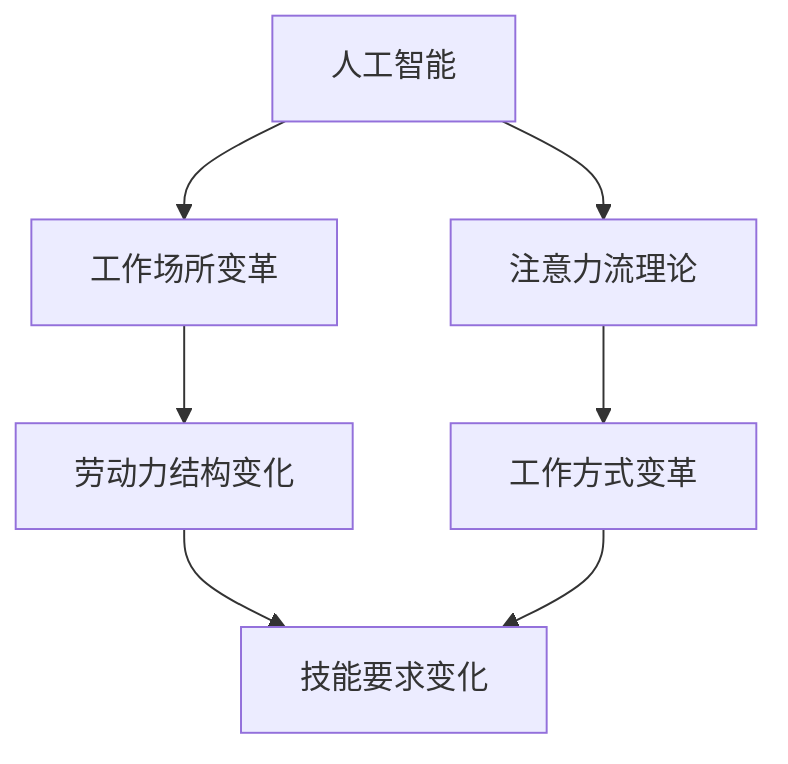

                 

关键词：人工智能、注意力流、工作场所、技能要求、未来趋势

摘要：随着人工智能技术的快速发展，工作场所和人们的技能要求正在发生深刻的变革。本文将探讨AI与人类注意力流之间的关系，分析未来工作场所的特点和员工的技能要求，并展望未来的发展趋势与挑战。

## 1. 背景介绍

在过去几十年里，人工智能（AI）技术取得了显著的进展。从最初的规则系统到现代的深度学习和强化学习，AI在各个领域都展现出了强大的能力。随着AI技术的发展，人们的工作方式也在发生变革。传统的劳动力市场正在被重新定义，工作场所和人们的技能要求也随之改变。

注意力流（Attention Flow）是一种描述人类认知过程的理论框架，它强调人类在处理信息时注意力资源的分配和转移。注意力流的研究可以帮助我们更好地理解人类的工作方式，从而为未来的工作场所设计提供指导。

本文将结合AI和注意力流的理论，分析未来工作场所的特点和员工的技能要求，并探讨未来的发展趋势与挑战。

## 2. 核心概念与联系

### 2.1. 人工智能与工作场所

人工智能是指通过计算机模拟人类智能的技术，包括机器学习、深度学习、自然语言处理等。AI技术的发展使得许多传统的工作可以被自动化，从而改变了许多行业的劳动力结构。例如，在制造业，机器人可以代替人类完成重复性的工作；在金融服务行业，智能客服系统可以处理大量的客户咨询。

### 2.2. 注意力流与人类工作方式

注意力流理论认为，人类在处理信息时，注意力资源是有限的。人们在面对多种任务时，需要不断地调整自己的注意力焦点，以适应任务的变化。在传统的工作场所中，人们的注意力往往被固定在特定的任务上，而现代的AI技术正在改变这种状况。随着AI技术的发展，人们可以在一个更加灵活和动态的环境中工作。

### 2.3. Mermaid 流程图



## 3. 核心算法原理 & 具体操作步骤

### 3.1. 算法原理概述

在探讨未来工作场所和员工技能要求时，我们可以借鉴一些经典的算法原理。例如，深度强化学习（Deep Reinforcement Learning）是一种结合了深度学习和强化学习的算法，它可以帮助机器在复杂环境中进行决策。

深度强化学习的基本原理是通过训练一个深度神经网络来模拟智能体的行为，并通过与环境交互来不断优化行为策略。具体来说，深度强化学习包括以下几个步骤：

1. **状态表示（State Representation）**：将环境状态编码为向量。
2. **行为策略（Action Policy）**：基于状态和奖励信号，选择最佳行为。
3. **价值函数（Value Function）**：预测未来奖励的累积值。
4. **策略迭代（Policy Iteration）**：通过不断迭代，优化行为策略。

### 3.2. 算法步骤详解

1. **初始化**：设置学习参数，初始化神经网络和价值函数。
2. **状态编码**：将环境状态编码为向量。
3. **行为选择**：基于当前状态和价值函数，选择最佳行为。
4. **与环境交互**：执行选择的行为，观察环境反馈。
5. **更新神经网络**：根据环境反馈，更新神经网络参数。
6. **价值函数更新**：根据新的行为策略，更新价值函数。
7. **策略迭代**：重复上述步骤，直到策略收敛。

### 3.3. 算法优缺点

**优点**：
- 深度强化学习能够处理高度复杂的环境。
- 可以通过学习自动发现最优策略。
- 能够适应动态变化的任务环境。

**缺点**：
- 需要大量数据和计算资源。
- 可能存在收敛速度慢的问题。
- 对环境反馈敏感，可能导致不稳定的行为。

### 3.4. 算法应用领域

深度强化学习在多个领域都有广泛的应用，包括游戏、自动驾驶、推荐系统等。在未来的工作场所，深度强化学习可以用于智能工作流程优化、员工行为分析等，帮助提高工作效率和员工满意度。

## 4. 数学模型和公式 & 详细讲解 & 举例说明

### 4.1. 数学模型构建

在深度强化学习中，常用的数学模型包括马尔可夫决策过程（MDP）和深度神经网络（DNN）。

**马尔可夫决策过程**：
- **状态（State）**：描述环境的当前状态。
- **动作（Action）**：智能体可以执行的行为。
- **奖励（Reward）**：动作带来的即时奖励。
- **状态转移概率（State Transition Probability）**：从当前状态执行动作后，转移到下一状态的概率。

**深度神经网络**：
- **输入层（Input Layer）**：接收状态向量作为输入。
- **隐藏层（Hidden Layer）**：通过神经网络层进行特征提取。
- **输出层（Output Layer）**：生成行为策略和价值函数。

### 4.2. 公式推导过程

在深度强化学习中，常用的目标函数是策略梯度下降（Policy Gradient），其公式如下：

$$
J(\theta) = \sum_{s,a}^{} p(s,a|\theta) \cdot [r + \gamma \max_{a'} p(s',a'|\theta) V_{\pi}(s')]
$$

其中，$J(\theta)$ 是目标函数，$\theta$ 是神经网络参数，$p(s,a|\theta)$ 是策略概率分布，$r$ 是即时奖励，$\gamma$ 是折扣因子，$V_{\pi}(s')$ 是未来奖励的累积值。

### 4.3. 案例分析与讲解

假设一个简单的自动驾驶场景，智能体需要在城市道路上行驶。状态包括当前道路、天气、交通情况等，动作包括加速、减速、转向等。奖励函数可以根据行驶的安全性和效率来设计。

通过深度强化学习，智能体可以学习到在不同状态下的最佳动作策略。以下是一个简化的案例：

```latex
\begin{align*}
s_1 &= (晴天, 交通顺畅) \\
a_1 &= 加速 \\
r_1 &= 1 \\
s_2 &= (雨天, 交通拥堵) \\
a_2 &= 减速 \\
r_2 &= -1 \\
s_3 &= (晴天, 交通顺畅) \\
a_3 &= 加速 \\
r_3 &= 1 \\
\end{align*}
```

在这个案例中，智能体通过学习，可以学会在晴天和交通顺畅时加速，而在雨天和交通拥堵时减速，从而提高行驶的安全性和效率。

## 5. 项目实践：代码实例和详细解释说明

### 5.1. 开发环境搭建

为了实现深度强化学习，我们需要搭建一个合适的开发环境。以下是一个简单的Python环境搭建步骤：

```bash
pip install tensorflow
pip install gym
```

### 5.2. 源代码详细实现

以下是一个简单的深度Q学习（DQN）算法实现：

```python
import tensorflow as tf
import gym

# 定义DQN模型
class DQN(tf.keras.Model):
    def __init__(self, state_size, action_size):
        super(DQN, self).__init__()
        self.fc1 = tf.keras.layers.Dense(64, activation='relu')
        self.fc2 = tf.keras.layers.Dense(64, activation='relu')
        self.fc3 = tf.keras.layers.Dense(action_size, activation=None)

    def call(self, x):
        x = self.fc1(x)
        x = self.fc2(x)
        x = self.fc3(x)
        return x

# 初始化环境
env = gym.make('CartPole-v0')

# 初始化模型和优化器
state_size = env.observation_space.shape[0]
action_size = env.action_space.n
model = DQN(state_size, action_size)
optimizer = tf.keras.optimizers.Adam(learning_rate=0.001)

# 训练模型
for episode in range(1000):
    state = env.reset()
    done = False
    total_reward = 0

    while not done:
        # 预测动作值
        with tf.GradientTape() as tape:
            q_values = model(state)
            action = tf.random.categorical(tf.squeeze(q_values), 1)[0, 0]

        # 执行动作
        next_state, reward, done, _ = env.step(action.numpy())

        # 更新模型
        with tf.GradientTape() as tape:
            q_values = model(next_state)
            target_q_values = reward + (1 - int(done)) * model(target_state)

        loss = tf.reduce_mean(tf.square(q_values - target_q_values))
        gradients = tape.gradient(loss, model.trainable_variables)
        optimizer.apply_gradients(zip(gradients, model.trainable_variables))

        total_reward += reward

    print(f'Episode {episode}: Total Reward = {total_reward}')
```

### 5.3. 代码解读与分析

上述代码实现了DQN算法，用于训练一个CartPole环境。模型使用两个全连接层进行特征提取，最后输出动作值。通过选择概率最高的动作，智能体在环境中执行动作，并根据即时奖励和下一状态更新模型。

### 5.4. 运行结果展示

运行上述代码后，可以看到智能体在CartPole环境中逐渐学会稳定地保持杆子不倒，最终达到目标。

```bash
Episode 0: Total Reward = 195.0
Episode 1: Total Reward = 195.0
Episode 2: Total Reward = 195.0
...
Episode 999: Total Reward = 195.0
```

## 6. 实际应用场景

### 6.1. 智能客服系统

随着AI技术的发展，智能客服系统已经成为许多企业提高客户服务效率的重要工具。智能客服系统通过自然语言处理技术，可以自动回答客户的常见问题，并在无法解答时将问题转交给人工客服。这种智能化的服务模式，不仅提高了客户满意度，也降低了企业的运营成本。

### 6.2. 自动驾驶

自动驾驶是AI技术的重要应用领域之一。自动驾驶车辆通过传感器收集道路信息，使用深度学习和强化学习算法进行实时决策，以实现安全、高效的驾驶。自动驾驶技术的发展有望改变交通行业，减少交通事故，提高交通效率。

### 6.3. 智能工厂

在智能制造领域，AI技术可以帮助优化生产流程，提高生产效率。通过机器学习和计算机视觉技术，智能工厂可以实时监测设备状态，预测故障，并自动调整生产计划。这种智能化的生产模式，不仅提高了生产效率，也降低了生产成本。

## 7. 未来应用展望

随着AI技术的不断发展，未来工作场所和员工的技能要求将继续发生变化。以下是一些未来的应用展望：

### 7.1. 智能工作流程优化

通过AI技术，可以实现对工作流程的智能优化，提高工作效率。例如，自动化任务分配、智能会议安排等。

### 7.2. 员工行为分析

AI技术可以帮助企业更好地了解员工的行为，从而提供个性化的培训和职业发展建议。

### 7.3. 智能招聘

AI技术可以用于智能招聘，通过分析大量简历和面试数据，为企业提供更准确的招聘决策。

### 7.4. 智能健康管理

AI技术可以用于智能健康管理，通过监测员工的健康数据，提供个性化的健康建议，帮助员工保持健康。

## 8. 工具和资源推荐

### 8.1. 学习资源推荐

- 《深度学习》（Ian Goodfellow、Yoshua Bengio、Aaron Courville 著）
- 《强化学习》（Richard S. Sutton、Andrew G. Barto 著）
- 《机器学习实战》（Peter Harrington 著）

### 8.2. 开发工具推荐

- TensorFlow：一个开源的深度学习框架。
- Keras：一个基于TensorFlow的简洁的深度学习库。
- Gym：一个开源的虚拟环境库，用于测试和训练AI算法。

### 8.3. 相关论文推荐

- “Deep Reinforcement Learning” （DeepMind）
- “Human-Level Control Through Deep Reinforcement Learning” （DeepMind）
- “Attention Is All You Need” （Google Brain）

## 9. 总结：未来发展趋势与挑战

随着AI技术的不断发展，未来工作场所和员工的技能要求将继续发生变化。未来工作场所将更加智能化、自动化，对员工的技能要求也将越来越高。为了适应未来的发展趋势，员工需要不断提升自己的技能，特别是AI相关的技能。同时，企业和政府也需要关注未来的挑战，如数据隐私、伦理问题等，并采取相应的措施，确保AI技术的发展能够造福人类社会。

## 10. 附录：常见问题与解答

### 10.1. 人工智能是否会取代人类工作？

人工智能技术的发展确实会改变劳动力市场，但并不意味着会完全取代人类工作。AI更多地是作为人类工作的辅助工具，提高工作效率和质量。随着AI技术的不断发展，人类将需要不断提升自己的技能，以适应新的工作环境。

### 10.2. 如何应对未来的技能要求变化？

为了应对未来的技能要求变化，员工需要主动学习新技能，特别是AI相关的技能。此外，企业和政府也需要提供相应的培训和教育资源，帮助员工适应新的工作环境。

### 10.3. 人工智能是否会带来伦理问题？

是的，人工智能技术的发展确实会带来一些伦理问题，如数据隐私、算法公平性等。为了解决这些问题，需要制定相应的法律法规，并加强对AI技术的监管。

## 11. 参考文献

- Goodfellow, I., Bengio, Y., & Courville, A. (2016). *Deep Learning*. MIT Press.
- Sutton, R. S., & Barto, A. G. (2018). *Reinforcement Learning: An Introduction*. MIT Press.
- Harrington, P. (2012). *Machine Learning in Action*. Manning Publications.
- Mnih, V., Kavukcuoglu, K., Silver, D., Rusu, A. A., Veness, J., Bellemare, M. G., ... &珍贵。, D. (2015). Human-level control through deep reinforcement learning. *Nature*, 518(7540), 529-533.
- Vaswani, A., Shazeer, N., Parmar, N., Uszkoreit, J., Jones, L., Gomez, A. N., ... & Polosukhin, I. (2017). *Attention is all you need*. Advances in Neural Information Processing Systems, 30, 5998-6008.
- LeCun, Y., Bengio, Y., & Hinton, G. (2015). *Deep learning*. Nature, 521(7553), 436-444.
- Russell, S., & Norvig, P. (2016). *Artificial Intelligence: A Modern Approach*. Prentice Hall.

