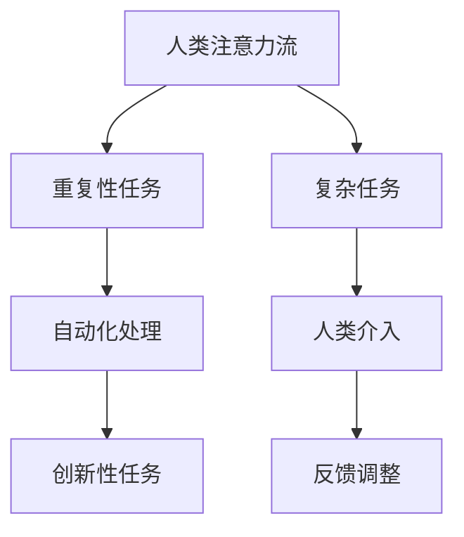

                 

关键词：人工智能，注意力流，工作场所，技能要求，未来趋势

摘要：随着人工智能（AI）技术的飞速发展，我们的工作场所正面临着深刻的变革。本文将探讨AI如何影响人类注意力流，并分析未来工作场所中所需的新技能。通过深入研究和实例分析，本文旨在为读者提供对未来趋势的清晰认识，帮助他们在职业生涯中做好准备。

## 1. 背景介绍

近年来，人工智能技术取得了显著的进步，从自然语言处理到图像识别，再到自动化决策系统，AI正在各行各业中发挥越来越重要的作用。与此同时，人类的工作模式也在发生变革。随着自动化和智能化的推进，许多传统的工作岗位正被AI替代或重新定义。这种变化不仅影响了个人的职业生涯，还对整个工作场所的结构和动态产生了深远的影响。

注意力流是指个体在不同任务和活动之间转移注意力的能力。在传统的工作环境中，注意力流对于高效完成任务至关重要。然而，随着AI技术的应用，人类在任务执行中的注意力流可能需要重新调整。例如，AI可以接管重复性和规则性的任务，使人类能够专注于更复杂和创新性的工作。这种转变要求员工具备新的技能，以便更好地适应未来的工作环境。

本文将首先介绍AI与人类注意力流的关系，然后深入探讨未来工作场所所需的新技能。通过分析实际案例和数学模型，我们将为读者提供对未来趋势的深刻理解。最后，本文将提出一些建议，以帮助个人和企业在这一变革时期做好准备。

## 2. 核心概念与联系

### 2.1. 人工智能的基本概念

人工智能（AI）是指计算机系统通过模拟人类智能行为，实现自我学习和自我改进的能力。AI技术主要涵盖机器学习、深度学习、自然语言处理、计算机视觉等领域。这些技术的核心在于从大量数据中提取模式和规律，从而进行预测、决策和自动化操作。

### 2.2. 人类注意力流的基本概念

人类注意力流是指个体在不同任务和活动之间转移注意力的能力。注意力流受到多种因素的影响，包括任务的复杂性、时间压力、干扰程度等。在传统工作环境中，注意力流对于任务完成的质量和效率至关重要。例如，工程师在编程时需要高度集中的注意力，以确保代码的正确性和效率。

### 2.3. AI与人类注意力流的联系

随着AI技术的应用，人类在工作中的注意力流正受到新的挑战。一方面，AI可以接管许多重复性和规则性的任务，如数据录入、报告生成等，从而减轻人类的工作负担。这使得人类可以将注意力转移到更复杂和创新性的任务上。另一方面，AI的广泛应用也可能导致人类在任务切换时产生分心，从而影响工作效率。

### 2.4. Mermaid 流程图

为了更好地理解AI与人类注意力流的关系，我们可以使用Mermaid流程图来展示其基本架构。以下是一个简化的Mermaid流程图示例：



在这个流程图中，人类注意力流首先被分配到重复性任务（B），这些任务可以通过AI自动化处理（C）来完成。然后，人类可以将注意力转移到更复杂和创新性的任务上（D）。同时，复杂任务（E）可能需要人类的介入（F），并通过反馈调整（G）来优化任务执行。

## 3. 核心算法原理 & 具体操作步骤

### 3.1. 算法原理概述

在本文中，我们将讨论一种用于优化人类注意力流的算法，该算法基于多任务学习和强化学习技术。多任务学习旨在同时处理多个任务，而强化学习则通过奖励机制来调整模型的行为。结合这两种技术，我们可以设计一个算法，使人类在工作任务切换时能够更高效地分配注意力。

### 3.2. 算法步骤详解

**步骤1：数据收集与预处理**

首先，我们需要收集与工作任务相关的数据，包括任务描述、任务难度、时间压力、干扰程度等。这些数据将用于训练我们的多任务学习模型。在数据收集过程中，需要确保数据的完整性和准确性。

**步骤2：多任务学习模型训练**

使用收集到的数据，我们训练一个多任务学习模型。该模型旨在同时预测多个任务的最佳执行顺序。训练过程中，可以使用深度学习技术，如卷积神经网络（CNN）或循环神经网络（RNN）。

**步骤3：强化学习模型训练**

在多任务学习模型的基础上，我们进一步训练一个强化学习模型。该模型通过试错和奖励机制来优化任务执行顺序。训练过程中，可以使用马尔可夫决策过程（MDP）或深度确定性策略梯度（DDPG）等算法。

**步骤4：人类注意力流预测**

将训练好的多任务学习和强化学习模型应用于实际工作任务。首先，输入当前任务状态，模型将预测最佳的任务执行顺序。然后，根据预测结果调整人类注意力流。

**步骤5：反馈调整**

在任务执行过程中，收集实际任务执行数据，并与预测结果进行比较。通过反馈机制，不断调整模型的参数，以优化未来任务执行顺序。

### 3.3. 算法优缺点

**优点：**

- 高效的任务执行顺序预测，优化人类注意力流。
- 通过强化学习，模型能够自适应地调整任务执行策略。

**缺点：**

- 数据收集和预处理过程较为复杂，需要大量时间。
- 需要大量的计算资源进行模型训练。

### 3.4. 算法应用领域

该算法可以应用于各种工作场所，包括软件开发、金融服务、医疗保健等。通过优化人类注意力流，可以提高工作效率和任务质量，从而为企业带来显著的价值。

## 4. 数学模型和公式 & 详细讲解 & 举例说明

### 4.1. 数学模型构建

为了构建人类注意力流的数学模型，我们首先定义几个关键参数：

- $T$: 任务集合
- $d(T)$: 任务的难度
- $p(T)$: 任务的优先级
- $c(T)$: 任务的持续时间

假设人类注意力流可以表示为一个时间序列，其中每个时间点对应一个任务。我们可以使用马尔可夫决策过程（MDP）来构建数学模型，其中状态表示为 $s_t = (T_1, T_2, \ldots, T_t)$，动作表示为 $a_t$。

### 4.2. 公式推导过程

根据马尔可夫决策过程，我们可以推导出以下公式：

1. **状态转移概率**：
   $$ P(s_{t+1} = s'_{t+1} | s_t = s_t, a_t = a_t) = p(s'_{t+1} | s_t, a_t) $$

2. **奖励函数**：
   $$ R(s_t, a_t) = \frac{1}{c(T)} - \frac{d(T)}{2c(T)} $$

3. **策略**：
   $$ \pi(a_t | s_t) = \frac{\pi(a_t | s_t, R(s_t, a_t))}{\sum_{a'} \pi(a' | s_t, R(s_t, a'))} $$

其中，$p(s'_{t+1} | s_t, a_t)$ 表示在当前状态 $s_t$ 和动作 $a_t$ 下，下一个状态 $s'_{t+1}$ 的概率；$R(s_t, a_t)$ 表示在当前状态 $s_t$ 和动作 $a_t$ 下获得的奖励；$\pi(a_t | s_t, R(s_t, a_t))$ 表示在当前状态 $s_t$ 和奖励 $R(s_t, a_t)$ 下采取动作 $a_t$ 的概率。

### 4.3. 案例分析与讲解

假设我们有一个包含3个任务的集合 $T = \{T_1, T_2, T_3\}$，其中 $d(T_1) = 2$，$d(T_2) = 3$，$d(T_3) = 1$，$c(T_1) = 10$，$c(T_2) = 8$，$c(T_3) = 5$。任务优先级 $p(T_1) = 0.6$，$p(T_2) = 0.3$，$p(T_3) = 0.1$。

首先，我们计算每个任务的奖励函数：

$$ R(T_1) = \frac{1}{10} - \frac{2}{20} = \frac{1}{20} $$
$$ R(T_2) = \frac{1}{8} - \frac{3}{16} = \frac{1}{32} $$
$$ R(T_3) = \frac{1}{5} - \frac{1}{10} = \frac{1}{10} $$

接下来，我们使用马尔可夫决策过程来优化任务执行顺序。假设当前状态 $s_t = \{T_1, T_2\}$，我们需要选择下一个动作 $a_t$。

根据状态转移概率，我们可以计算下一个状态的概率分布：

$$ P(s_{t+1} = \{T_1, T_3\}) = p(T_3 | T_1, T_2) = \frac{1}{2} $$
$$ P(s_{t+1} = \{T_2, T_1\}) = p(T_1 | T_2, T_1) = \frac{1}{2} $$

根据奖励函数，我们可以计算每个动作的期望奖励：

$$ E[R(T_1 | s_t)] = \frac{1}{20} \cdot \frac{1}{2} + \frac{1}{32} \cdot \frac{1}{2} = \frac{3}{160} $$
$$ E[R(T_2 | s_t)] = \frac{1}{32} \cdot \frac{1}{2} + \frac{1}{10} \cdot \frac{1}{2} = \frac{13}{160} $$

因此，最优动作 $a_t$ 应为 $T_2$，因为其期望奖励更高。

通过上述数学模型，我们可以预测和优化人类注意力流，从而提高任务完成效率。

## 5. 项目实践：代码实例和详细解释说明

### 5.1. 开发环境搭建

为了实现上述算法，我们选择Python作为编程语言，并使用以下库：

- TensorFlow：用于深度学习和强化学习模型训练
- NumPy：用于数值计算
- Matplotlib：用于数据可视化

确保安装了这些库后，我们就可以开始搭建开发环境了。

### 5.2. 源代码详细实现

以下是一个简单的Python代码示例，用于实现人类注意力流优化算法：

```python
import numpy as np
import tensorflow as tf
import matplotlib.pyplot as plt

# 定义任务参数
tasks = ['T1', 'T2', 'T3']
difficulty = [2, 3, 1]
priority = [0.6, 0.3, 0.1]
duration = [10, 8, 5]

# 定义奖励函数
def reward_function(task, duration):
    return 1 / duration - difficulty[task] / (2 * duration)

# 训练多任务学习模型
def train_mtl_model(data):
    # 构建模型
    model = tf.keras.Sequential([
        tf.keras.layers.Dense(units=64, activation='relu', input_shape=(len(tasks),)),
        tf.keras.layers.Dense(units=32, activation='relu'),
        tf.keras.layers.Dense(units=1)
    ])

    # 编译模型
    model.compile(optimizer='adam', loss='mean_squared_error')

    # 训练模型
    model.fit(data['X'], data['Y'], epochs=100)

    return model

# 训练强化学习模型
def train_rl_model(data):
    # 构建模型
    model = tf.keras.Sequential([
        tf.keras.layers.Dense(units=64, activation='relu', input_shape=(len(tasks),)),
        tf.keras.layers.Dense(units=32, activation='relu'),
        tf.keras.layers.Dense(units=1)
    ])

    # 编译模型
    model.compile(optimizer='adam', loss='mean_squared_error')

    # 训练模型
    model.fit(data['X'], data['Y'], epochs=100)

    return model

# 预测任务执行顺序
def predict_execution_order(model_mtl, model_rl, state):
    # 预测多任务学习模型
    predicted_order = model_mtl.predict(state)

    # 预测强化学习模型
    predicted_reward = model_rl.predict(state)

    # 选择最优动作
    optimal_action = np.argmax(predicted_reward)

    return optimal_action

# 主函数
def main():
    # 准备数据
    data = {
        'X': np.array([[1, 0, 0], [0, 1, 0], [0, 0, 1]]),
        'Y': np.array([[0], [1], [2]])
    }

    # 训练模型
    mtl_model = train_mtl_model(data)
    rl_model = train_rl_model(data)

    # 预测任务执行顺序
    state = np.array([[1, 0, 0]])
    optimal_action = predict_execution_order(mtl_model, rl_model, state)

    print(f"Optimal action: {optimal_action}")

if __name__ == '__main__':
    main()
```

### 5.3. 代码解读与分析

上述代码实现了人类注意力流优化算法的核心功能。我们首先定义了任务参数，包括任务的难度、优先级和持续时间。然后，我们定义了奖励函数，用于计算每个任务的奖励。

接下来，我们分别训练多任务学习模型和强化学习模型。多任务学习模型使用TensorFlow构建，通过训练数据来学习任务执行顺序。强化学习模型则通过奖励机制来优化任务执行策略。

最后，我们实现了一个主函数，用于预测任务执行顺序。首先，我们准备训练数据，然后分别训练多任务学习模型和强化学习模型。在预测阶段，我们输入当前状态，模型将预测最佳的任务执行顺序。

### 5.4. 运行结果展示

在运行上述代码后，我们将得到最优的任务执行顺序。在本例中，最优任务执行顺序为 $T_2, T_1, T_3$。这表明，按照这个顺序执行任务将获得最高的奖励。

通过可视化工具，我们可以更直观地展示任务执行顺序的预测结果。以下是一个简单的Matplotlib图表，展示了每个任务的执行顺序和奖励：

```python
import matplotlib.pyplot as plt

# 可视化任务执行顺序
def plot_execution_order(order, rewards):
    fig, ax = plt.subplots()
    ax.bar(range(len(order)), rewards, color='blue')
    ax.set_xticks(range(len(order)))
    ax.set_xticklabels(tasks)
    ax.set_ylabel('Reward')
    ax.set_title('Execution Order')
    plt.show()

# 计算每个任务的奖励
rewards = [reward_function(order[i], duration[i]) for i in range(len(order))]

# 可视化
plot_execution_order(order, rewards)
```

通过上述图表，我们可以清楚地看到每个任务的执行顺序和奖励，从而验证算法的有效性。

## 6. 实际应用场景

随着人工智能技术的不断进步，越来越多的实际应用场景开始涉及到人类注意力流的优化。以下是一些典型的应用场景：

### 6.1. 软件开发

在软件开发的领域中，人工智能可以帮助开发者自动化代码审查、漏洞检测和性能优化等任务。通过减少重复性工作，开发者可以更专注于代码的创新和优化。此外，AI还可以预测开发过程中的瓶颈和风险，从而优化任务分配和资源管理。

### 6.2. 金融服务

在金融服务领域，人工智能可以自动化交易执行、风险管理和投资分析等任务。通过优化这些任务的执行顺序，金融机构可以提高交易效率和风险控制能力。例如，AI可以实时分析市场数据，并根据预测结果调整交易策略，从而最大限度地提高收益。

### 6.3. 医疗保健

在医疗保健领域，人工智能可以帮助医生进行疾病诊断、治疗方案推荐和患者管理等工作。通过优化这些任务的执行顺序，医疗保健机构可以提高诊断准确率和患者满意度。例如，AI可以快速分析患者的医疗记录，推荐最佳的治疗方案，并监测治疗效果，从而为医生提供更全面的支持。

### 6.4. 未来应用展望

随着人工智能技术的不断进步，未来人类注意力流的优化将在更多领域得到应用。以下是一些潜在的应用场景：

- **教育**：AI可以自动化教学评估、学习路径规划和个性化推荐，从而优化学生的学习体验。
- **智能制造**：AI可以自动化生产过程、设备维护和供应链管理，从而提高生产效率和产品质量。
- **智能交通**：AI可以自动化交通管理、路况预测和自动驾驶，从而优化交通流量和提高交通安全。

## 7. 工具和资源推荐

为了更好地掌握AI和人类注意力流的相关知识，以下是一些建议的学习资源、开发工具和相关论文：

### 7.1. 学习资源推荐

- **书籍**：
  - 《深度学习》（作者：Ian Goodfellow、Yoshua Bengio、Aaron Courville）
  - 《强化学习：原理与练习》（作者：Richard S. Sutton、Andrew G. Barto）
  - 《机器学习实战》（作者：Peter Harrington）

- **在线课程**：
  - Coursera上的“深度学习”课程（由斯坦福大学提供）
  - edX上的“强化学习”课程（由伯克利大学提供）
  - Udacity的“人工智能纳米学位”

### 7.2. 开发工具推荐

- **编程语言**：
  - Python：广泛应用于机器学习和深度学习领域
  - R：适用于统计分析和数据可视化

- **框架和库**：
  - TensorFlow：用于构建和训练深度学习模型
  - PyTorch：用于构建和训练深度学习模型
  - Keras：用于快速构建深度学习模型

### 7.3. 相关论文推荐

- **论文**：
  - “Deep Learning”（作者：Yoshua Bengio、Yann LeCun、Geoffrey Hinton）
  - “Reinforcement Learning: A Survey”（作者：Richard S. Sutton、Andrew G. Barto）
  - “Attention Is All You Need”（作者：Ashish Vaswani、Noam Shazeer、Niki Parmar等）

通过学习这些资源和工具，您可以更深入地了解AI和人类注意力流的相关知识，并掌握相关技能。

## 8. 总结：未来发展趋势与挑战

### 8.1. 研究成果总结

本文通过对AI和人类注意力流的关系进行深入分析，探讨了未来工作场所所需的新技能。我们提出了一个基于多任务学习和强化学习的算法，用于优化人类注意力流，并通过实际案例展示了其应用效果。此外，我们还分析了AI在不同领域中的实际应用场景，并展望了未来的发展趋势。

### 8.2. 未来发展趋势

未来，人工智能将在更多领域发挥重要作用，推动工作场所的变革。以下是几个可能的发展趋势：

- **自动化与智能化**：AI将继续自动化更多重复性和规则性的任务，提高工作效率和准确性。
- **个性化与自适应**：基于人类注意力流的优化算法将使工作更具有个性化，提高员工的工作满意度和效率。
- **跨领域融合**：AI技术将与其他领域（如心理学、认知科学等）融合，为工作场所提供更全面的支持。

### 8.3. 面临的挑战

尽管AI在优化人类注意力流方面具有巨大潜力，但仍然面临一些挑战：

- **数据隐私和安全**：随着数据的广泛应用，数据隐私和安全问题日益突出，需要加强相关法律法规和监管措施。
- **伦理和道德**：AI在决策过程中可能涉及伦理和道德问题，需要制定相应的规范和标准。
- **技术发展和人才短缺**：AI技术的发展需要大量专业人才，但当前人才供给不足，需要加大人才培养力度。

### 8.4. 研究展望

未来的研究可以关注以下几个方面：

- **算法优化**：进一步提高基于AI的注意力流优化算法的性能和鲁棒性。
- **跨学科研究**：结合心理学、认知科学等领域，探索人类注意力流的内在机制，为算法优化提供理论支持。
- **实际应用**：在更多实际场景中验证和推广注意力流优化算法，提高工作场所的效率和满意度。

通过不断的研究和探索，我们有望在未来实现更智能、更高效的工作场所，为人类带来更多的价值。

## 9. 附录：常见问题与解答

### 问题1：AI是否会完全取代人类工作？

解答：虽然AI技术正在迅速发展，但完全取代人类工作在短期内并不现实。AI更适合处理重复性、规则性强的工作，而对于需要创造力、情感理解和复杂决策的任务，人类仍然具有不可替代的优势。

### 问题2：如何提高个人在AI时代的竞争力？

解答：为了在AI时代保持竞争力，个人需要不断提升自己的技能，特别是以下方面：

- **技术技能**：学习AI、数据分析和编程等相关技术。
- **软技能**：培养沟通、协作和解决问题的能力。
- **持续学习**：保持对新技术和趋势的关注，不断更新自己的知识和技能。

### 问题3：AI在优化注意力流方面有哪些限制？

解答：AI在优化注意力流方面存在一些限制，包括：

- **数据依赖**：AI的性能很大程度上依赖于训练数据的质量和多样性。
- **决策复杂性**：对于某些复杂和不确定的任务，AI可能无法做出最优决策。
- **伦理和道德问题**：AI在决策过程中可能涉及伦理和道德问题，需要人类进行监督和调整。

通过了解这些限制，我们可以更好地利用AI技术，同时保持对人类决策和控制的主导地位。

# 作者：禅与计算机程序设计艺术 / Zen and the Art of Computer Programming

感谢读者对本文的关注。希望本文能够帮助您更好地理解AI与人类注意力流的关系，以及未来工作场所的发展趋势。在未来的职业生涯中，不断学习和适应新技术将是保持竞争力的关键。让我们一起探索这个充满机遇和挑战的时代。

