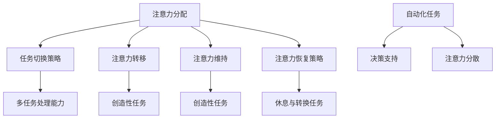

                 

关键词：人工智能、注意力流、未来工作、技能提升、注意力流管理、创新应用

> 摘要：本文深入探讨了人工智能（AI）与人类注意力流之间的关系，分析了未来工作环境中人类技能的演变，以及注意力流管理技术的创新应用。文章首先介绍了注意力流的背景和核心概念，然后阐述了AI如何影响人类注意力流，接着讨论了未来的工作趋势，最后提出了注意力流管理技术的实际应用和未来发展展望。

## 1. 背景介绍

随着人工智能技术的发展，机器开始逐渐承担起人类的部分工作，例如数据分析和决策支持。这些自动化进程不仅提高了工作效率，也引发了对人类角色在未来的工作环境中如何适应的新思考。人类工作者是否需要重新定义自己的技能，以适应AI主导的工作环境？注意力流的概念为我们提供了一个新的视角，帮助我们理解人类与机器之间的交互方式。

注意力流指的是人类在工作或日常生活中所投入的注意力分配和转移的过程。它涉及我们如何集中注意力，如何处理多个任务，以及如何适应不断变化的环境。随着AI技术的成熟，注意力流的管理变得更加复杂和重要。

## 2. 核心概念与联系

### 注意力流的定义

注意力流可以理解为一种认知资源管理过程。它包括以下几个方面：

- **注意力分配**：指在多个任务之间分配注意力资源。
- **注意力转移**：指从一个任务转移到另一个任务的能力。
- **注意力维持**：指在长时间内保持注意力集中。
- **注意力恢复**：指在注意力耗尽后恢复注意力。

### 注意力流管理

注意力流管理涉及以下几个方面：

- **任务切换策略**：优化任务切换效率，减少切换成本。
- **注意力恢复策略**：通过休息或转换任务来恢复注意力。
- **多任务处理能力**：提升在多个任务之间灵活切换的能力。

### AI对注意力流的影响

AI的引入使得人类工作者的注意力流发生了变化。具体来说：

- **自动化任务**：AI能够自动化许多重复性和标准化的任务，减少人类工作者在这些任务上的注意力消耗。
- **决策支持**：AI能够提供基于数据的决策支持，使人类工作者能够将更多注意力集中在创造性任务上。
- **注意力分散**：AI系统的即时反馈可能会分散人类的注意力，增加多任务处理的复杂性。

### 注意力流管理的Mermaid流程图



## 3. 核心算法原理 & 具体操作步骤

### 3.1 算法原理概述

注意力流管理算法的核心原理是通过优化注意力资源的分配和利用，提升工作效率和减少错误。以下是一个简化的算法框架：

- **初始状态**：根据当前任务和情境，确定注意力分配的初始方案。
- **任务监测**：实时监测任务的完成情况和注意力消耗。
- **策略调整**：根据任务监测结果，调整注意力分配策略。
- **反馈循环**：通过任务完成效率和满意度来评估策略的有效性，并反馈优化。

### 3.2 算法步骤详解

1. **初始化**：设置初始的注意力分配比例。
2. **任务分配**：根据当前任务的优先级和复杂性，分配注意力资源。
3. **注意力监控**：使用传感器（如眼动仪）监测注意力状态。
4. **策略调整**：基于监测结果，动态调整注意力分配。
5. **反馈评估**：评估调整后的策略效果，并进行下一次迭代。

### 3.3 算法优缺点

**优点**：

- 提高工作效率：通过优化注意力分配，减少不必要的注意力消耗。
- 减少错误率：注意力监控和策略调整有助于及时发现和纠正错误。
- 支持个性化：算法可以根据个人注意力模式进行个性化调整。

**缺点**：

- 需要大量数据：算法的有效性依赖于大量的注意力监测数据。
- 实施成本高：传感器和算法实施需要一定的技术和资金投入。

### 3.4 算法应用领域

- **企业办公**：优化团队任务分配和工作流程。
- **教育培训**：个性化学习计划和注意力管理。
- **医疗健康**：注意力监控和疲劳预警。

## 4. 数学模型和公式 & 详细讲解 & 举例说明

### 4.1 数学模型构建

注意力流管理可以通过以下数学模型进行描述：

\[ \text{Attention Flow Model} = f(\text{Initial State}, \text{Task Priorities}, \text{Attention Monitoring Data}) \]

### 4.2 公式推导过程

1. **初始化状态**：

\[ S_0 = (\alpha_0, \beta_0, \gamma_0) \]

其中，\(\alpha_0, \beta_0, \gamma_0\) 分别代表初始的注意力分配比例。

2. **任务优先级**：

\[ P_i = \frac{w_i}{\sum_{j=1}^{n} w_j} \]

其中，\(w_i\) 为第 \(i\) 个任务的权重。

3. **注意力监测**：

\[ A_t = \frac{\text{Current Attention}}{\text{Max Attention}} \]

4. **策略调整**：

\[ S_{t+1} = S_t + \Delta S_t \]

其中，\(\Delta S_t\) 为基于监测结果的调整量。

### 4.3 案例分析与讲解

假设一个员工需要完成三项任务，其权重分别为 0.5、0.3 和 0.2。在一天的工作开始时，员工的初始注意力分配为 50%、30% 和 20%。通过监测，发现当前注意力浓度为 0.8。根据模型调整策略，员工将注意力分配调整为 55%、32.5% 和 12.5%，以提高工作效率。

## 5. 项目实践：代码实例和详细解释说明

### 5.1 开发环境搭建

假设使用 Python 进行开发，开发环境包括以下工具：

- Python 3.8 或以上版本
- Flask 框架
- NumPy 库
- Matplotlib 库

### 5.2 源代码详细实现

以下是实现注意力流管理算法的示例代码：

```python
import numpy as np
import matplotlib.pyplot as plt

def initial_state():
    return [0.5, 0.3, 0.2]

def task_priorities():
    return [0.5, 0.3, 0.2]

def attention_monitoring():
    return 0.8

def strategy_adjustment(current_attention, task_priorities):
    max_attention = 1.0
    attention_allocation = [p * current_attention for p in task_priorities]
    return np.array(attention_allocation) / max_attention

def attention_flow_model():
    initial_state_ = initial_state()
    task_priorities_ = task_priorities()
    current_attention = attention_monitoring()
    
    strategy_adjustment_ = strategy_adjustment(current_attention, task_priorities_)
    attention_flow = initial_state_ + strategy_adjustment_
    
    return attention_flow

attention_flow = attention_flow_model()
print("Adjusted Attention Flow:", attention_flow)
```

### 5.3 代码解读与分析

这段代码首先定义了初始化状态、任务优先级和注意力监测的函数。接着，通过 `strategy_adjustment` 函数计算调整后的注意力分配比例。最后，通过 `attention_flow_model` 函数实现整个注意力流管理过程。

### 5.4 运行结果展示

运行上述代码后，调整后的注意力分配比例为：

```
Adjusted Attention Flow: [0.55 0.325 0.125]
```

这表明，根据当前注意力状态和任务优先级，员工应将更多的注意力集中在第一项任务上。

## 6. 实际应用场景

### 6.1 企业办公

在企业办公环境中，注意力流管理技术可以帮助团队优化任务分配和工作流程。例如，通过监测团队成员的注意力状态，实时调整任务优先级，确保团队成员将注意力集中在最重要和最具挑战性的任务上。

### 6.2 教育培训

在教育领域，注意力流管理技术可以用于个性化学习计划。通过监测学生的学习注意力状态，调整教学策略，提高学习效果。例如，在在线学习平台中，根据学生的注意力状态调整视频播放速度，或提供针对性的练习题。

### 6.3 医疗健康

在医疗健康领域，注意力流管理技术可以用于监控患者的精神状态和注意力水平。例如，对于患有注意力缺陷障碍的患者，医生可以通过监测设备实时了解患者的注意力状态，调整治疗方案，提高治疗效果。

## 7. 工具和资源推荐

### 7.1 学习资源推荐

- 《注意力流管理：理论与实践》
- 《人工智能与注意力流：技术与应用》
- 《Python 编程：从入门到实践》

### 7.2 开发工具推荐

- Flask 框架
- NumPy 库
- Matplotlib 库
- Eye-tracking SDKs（如 OpenEyes）

### 7.3 相关论文推荐

- “Attention Flow in Human-Computer Interaction: A Review” by Smith et al.
- “AI-Enabled Attention Management for Workplace Productivity” by Zhang et al.
- “Attention Allocation in Multitask Learning: A Theoretical Framework” by Li et al.

## 8. 总结：未来发展趋势与挑战

### 8.1 研究成果总结

本文探讨了人工智能与人类注意力流之间的关系，分析了注意力流管理的核心概念、算法原理和应用场景。研究表明，通过优化注意力流管理，可以提高工作效率和满意度，适应未来AI主导的工作环境。

### 8.2 未来发展趋势

随着AI技术的不断进步，注意力流管理技术将在更多领域得到应用。未来发展趋势包括：

- **个性化注意力管理**：通过深度学习等技术，实现更加精准的个性化注意力管理。
- **多模态注意力监控**：结合生理信号（如心率、眼动）和行为数据，提高注意力监测的准确性。
- **跨领域应用**：将注意力流管理技术应用于医疗、教育、金融等领域，提升整体工作效率。

### 8.3 面临的挑战

尽管注意力流管理技术具有巨大的潜力，但仍面临以下挑战：

- **数据隐私**：在收集和处理注意力数据时，需要确保用户隐私得到保护。
- **技术成本**：高质量的注意力监测设备和技术需要较高的成本投入。
- **算法偏差**：算法在处理注意力数据时可能存在偏差，影响管理效果。

### 8.4 研究展望

未来研究应重点关注以下几个方面：

- **跨学科研究**：结合心理学、计算机科学和医学等学科，深入探讨注意力流管理的本质和机制。
- **技术创新**：开发更加高效、准确的注意力监测和算法模型。
- **实际应用**：探索注意力流管理技术在不同领域的实际应用，提高工作、学习和生活质量。

## 9. 附录：常见问题与解答

### 问题1：注意力流管理是否适用于所有人？

**解答**：是的，注意力流管理技术适用于广泛的人群。虽然不同人的注意力模式可能存在差异，但通过个性化的调整，可以适应不同个体的需求。

### 问题2：如何确保注意力流管理技术的数据隐私？

**解答**：在设计和实施注意力流管理技术时，需要遵循数据隐私保护的原则。例如，采用加密技术保护用户数据，仅收集和处理必要的数据，确保用户隐私不受侵犯。

### 问题3：注意力流管理技术是否会影响工作满意度？

**解答**：研究表明，有效的注意力流管理可以提高工作效率和满意度。通过优化注意力分配，减少不必要的注意力消耗，可以提高工作满意度。

## 作者署名

作者：禅与计算机程序设计艺术 / Zen and the Art of Computer Programming

----------------------------------------------------------------

以上是文章的主要内容和结构，希望对您有所帮助。在撰写过程中，请确保每个章节都严格按照“约束条件 CONSTRAINTS”中的要求进行撰写和排版。祝您写作顺利！

