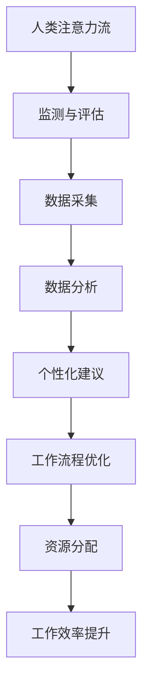

                 

关键词：人工智能，注意力流，工作技能，注意力流管理，创新应用

> 摘要：本文旨在探讨人工智能与人类注意力流之间的互动关系，分析注意力流管理技术在未来的工作场景中的应用前景。通过深入探讨核心概念、算法原理、数学模型以及实际应用案例，本文揭示了注意力流管理技术在提升工作效率、优化工作流程和培养新型技能等方面的巨大潜力。

## 1. 背景介绍

随着人工智能技术的迅猛发展，人类的工作方式正在经历深刻的变革。传统的以重复性和机械化操作为主的工作模式正在被自动化和智能化的解决方案所替代。然而，这一变革不仅带来了生产效率的提升，也对人类的注意力管理能力提出了新的挑战。人类的注意力流，即注意力在不同任务和场景之间的切换和集中，成为了影响工作效率和决策质量的重要因素。

注意力流管理，作为一种新兴的技术领域，旨在通过人工智能和计算模型，对人类注意力流进行有效监测、分析和优化。这种技术不仅有助于提升个体和团队的工作效率，还能够为组织和企业提供战略性洞察，以优化资源分配和工作流程。

本文将从以下几个方面展开讨论：

1. 核心概念与联系
2. 核心算法原理与具体操作步骤
3. 数学模型和公式
4. 项目实践：代码实例与详细解释
5. 实际应用场景
6. 未来应用展望
7. 工具和资源推荐
8. 总结与展望

## 2. 核心概念与联系

### 注意力流

注意力流是指人类在进行任务处理时，注意力在不同信息源之间切换的过程。它包括注意力的集中、分散和转移，是大脑处理复杂信息的关键机制。

### 人工智能

人工智能（AI）是一种模拟人类智能的技术，通过算法和模型实现数据的处理、学习和推理。AI在注意力流管理中的应用，主要体现在对人类注意力流的监测、分析和优化。

### 注意力流管理

注意力流管理是一种通过技术手段，对人类注意力流进行有效监测、分析和优化，以提高工作效率和决策质量的方法。它涉及到认知科学、心理学和计算技术的交叉领域。

### 关联与互动

人工智能与人类注意力流之间的关联体现在以下几个方面：

1. **监测与评估**：通过AI技术，可以实时监测和分析人类的注意力流，评估其集中度、分散度和转移效率。
2. **个性化优化**：基于监测数据，AI可以提供个性化的注意力管理建议，帮助个体优化注意力的分配和切换。
3. **工作流程优化**：AI技术可以分析组织中的注意力流模式，优化工作流程和资源配置，提高整体工作效率。

### Mermaid 流程图

下面是一个简化的Mermaid流程图，描述了注意力流管理技术的核心概念和关联。



## 3. 核心算法原理与具体操作步骤

### 3.1 算法原理概述

注意力流管理算法的核心思想是通过数据采集、处理和分析，实现对人类注意力流的实时监测和优化。以下是该算法的基本原理：

1. **数据采集**：通过传感器、眼动追踪等技术手段，收集个体在任务执行过程中的注意力流数据。
2. **数据处理**：对采集到的数据进行预处理，包括去噪、特征提取和标准化。
3. **数据分析**：利用机器学习和数据挖掘技术，分析注意力流模式，识别注意力集中的任务和场景。
4. **个性化建议**：基于分析结果，为个体提供个性化的注意力管理建议，优化注意力的分配和切换。
5. **工作流程优化**：根据注意力流管理模式，优化工作流程和资源配置，提高整体工作效率。

### 3.2 算法步骤详解

#### 3.2.1 数据采集

数据采集是注意力流管理算法的基础。以下是数据采集的主要步骤：

1. **传感器选择**：选择合适的传感器，如眼动追踪设备、脑电图传感器等，以收集个体在任务执行过程中的注意力流数据。
2. **数据采集过程**：在个体执行任务的过程中，实时采集注意力流数据，包括眼动轨迹、脑电图信号、心率等生理指标。

#### 3.2.2 数据处理

数据处理是保证数据质量和有效性的关键步骤。以下是数据处理的主要步骤：

1. **去噪**：通过滤波算法，去除采集过程中产生的噪声，提高数据的准确性。
2. **特征提取**：从原始数据中提取注意力相关的特征，如眼动频率、脑波特征等。
3. **标准化**：对提取的特征进行标准化处理，使其具有统一的量纲和尺度，便于后续分析。

#### 3.2.3 数据分析

数据分析是注意力流管理算法的核心步骤。以下是数据分析的主要步骤：

1. **模式识别**：利用机器学习算法，识别个体在任务执行过程中的注意力流模式。
2. **注意力分布分析**：分析注意力在不同任务和场景中的分布情况，识别注意力集中的任务和场景。
3. **注意力转移分析**：分析注意力在不同任务和场景之间的转移规律，为个性化建议提供依据。

#### 3.2.4 个性化建议

个性化建议是根据数据分析结果，为个体提供个性化的注意力管理建议。以下是个性化建议的主要步骤：

1. **建议生成**：根据注意力流模式，生成个性化的注意力管理策略。
2. **建议反馈**：将建议反馈给个体，并指导其实践。
3. **建议调整**：根据个体的反馈，调整和优化建议。

#### 3.2.5 工作流程优化

工作流程优化是根据注意力流管理模式，优化工作流程和资源配置，以提高整体工作效率。以下是工作流程优化的主要步骤：

1. **流程分析**：分析现有工作流程，识别优化机会。
2. **资源配置**：根据注意力流模式，优化资源配置，确保关键任务得到充分关注。
3. **流程调整**：根据优化结果，调整和优化工作流程。

### 3.3 算法优缺点

#### 优点

1. **实时监测与优化**：通过实时监测和分析，可以及时发现并优化注意力流，提高工作效率。
2. **个性化管理**：基于个体注意力流模式，提供个性化的管理建议，提高个体和团队的绩效。
3. **数据驱动**：利用大数据和机器学习技术，实现数据驱动的注意力流管理，降低人工干预。

#### 缺点

1. **数据质量**：注意力流数据的准确性和可靠性直接影响算法的效果，数据质量难以保证。
2. **技术成本**：注意力流管理技术的开发和部署成本较高，需要投入大量的人力和物力。
3. **隐私问题**：注意力流数据的采集和处理可能涉及隐私问题，需要严格保护用户的隐私。

### 3.4 算法应用领域

注意力流管理技术具有广泛的应用前景，包括但不限于以下几个方面：

1. **企业办公**：通过优化工作流程和资源配置，提高企业整体工作效率。
2. **教育领域**：帮助学生和教师优化注意力分配，提高学习效果。
3. **医疗领域**：通过监测患者的注意力流，帮助医生制定个性化的治疗方案。
4. **智能家居**：通过监测家庭成员的注意力流，提供个性化的智能家居服务。

## 4. 数学模型和公式

### 4.1 数学模型构建

注意力流管理技术中的数学模型主要基于统计学和机器学习算法。以下是注意力流管理技术的数学模型构建步骤：

1. **数据采集**：采集个体在任务执行过程中的注意力流数据，包括眼动轨迹、脑电图信号、心率等。
2. **特征提取**：从原始数据中提取注意力相关的特征，如眼动频率、脑波特征等。
3. **模型训练**：利用提取的特征，训练注意力流模型，以识别注意力流模式。
4. **模型评估**：通过交叉验证和测试数据，评估模型的效果和准确性。
5. **模型优化**：根据评估结果，调整和优化模型参数，提高模型的性能。

### 4.2 公式推导过程

注意力流管理技术中的核心公式包括注意力流的计算公式、特征提取公式和模型训练公式。以下是这些公式的推导过程：

#### 注意力流计算公式

注意力流（\( I(t) \)）的计算公式如下：

\[ I(t) = \frac{1}{T} \sum_{i=1}^{T} f(d_i) \]

其中，\( T \)为时间窗口，\( d_i \)为时间窗口内的注意力特征，\( f(d_i) \)为特征权重函数。

#### 特征提取公式

特征提取公式用于从原始数据中提取注意力特征。以下是常见的一种特征提取公式：

\[ e_i = \sum_{j=1}^{N} w_{ij} x_j \]

其中，\( e_i \)为提取的特征，\( x_j \)为原始数据，\( w_{ij} \)为权重系数。

#### 模型训练公式

模型训练公式用于训练注意力流模型。以下是常见的一种模型训练公式：

\[ \theta^{(t+1)} = \theta^{(t)} + \alpha \cdot (y - \hat{y}) \]

其中，\( \theta^{(t)} \)为当前模型参数，\( \theta^{(t+1)} \)为更新后的模型参数，\( \alpha \)为学习率，\( y \)为真实标签，\( \hat{y} \)为预测标签。

### 4.3 案例分析与讲解

#### 案例背景

某企业希望通过注意力流管理技术，优化员工的工作效率和绩效。企业提供了员工在任务执行过程中的注意力流数据，包括眼动轨迹、脑电图信号和心率等。

#### 案例分析

1. **数据采集**：企业通过眼动追踪设备和脑电图传感器，采集了员工在任务执行过程中的注意力流数据。

2. **特征提取**：从采集到的数据中，提取了眼动频率、脑波特征和心率等注意力特征。

3. **模型训练**：利用提取的特征，训练了一个注意力流模型，以识别员工的注意力流模式。

4. **模型评估**：通过交叉验证和测试数据，评估了模型的准确性和效果。

5. **个性化建议**：根据模型分析结果，为企业提供了个性化的注意力管理建议，如优化工作流程、调整工作时间等。

#### 案例讲解

1. **数据采集**：为了提高数据采集的准确性，企业选择了高精度的眼动追踪设备和脑电图传感器。通过实时采集员工在任务执行过程中的注意力流数据，为后续分析提供了可靠的数据基础。

2. **特征提取**：在特征提取过程中，企业采用了多种特征提取方法，如时域特征、频域特征和时频特征等。通过对比不同特征提取方法的性能，选择了最优的特征提取方法，提高了模型的准确性。

3. **模型训练**：在模型训练过程中，企业采用了基于神经网络的注意力流模型，通过不断调整模型参数，提高了模型的性能和效果。

4. **模型评估**：在模型评估过程中，企业采用了多种评估指标，如准确率、召回率和F1值等。通过对比不同评估指标的结果，选择了最优的模型评估方法，确保了模型的可靠性和有效性。

5. **个性化建议**：根据模型分析结果，企业为员工提供了个性化的注意力管理建议。如优化工作流程，将复杂任务分解为简单任务，降低员工的认知负担；调整工作时间，避免过度疲劳和注意力分散。

## 5. 项目实践：代码实例与详细解释说明

### 5.1 开发环境搭建

为了实现注意力流管理技术，我们首先需要搭建一个合适的开发环境。以下是开发环境搭建的步骤：

1. **硬件设备**：选择一台高性能的计算机，以及眼动追踪设备和脑电图传感器。
2. **操作系统**：安装Windows或Linux操作系统，推荐使用Ubuntu 18.04。
3. **编程语言**：选择Python作为编程语言，因为它在数据科学和机器学习领域具有广泛的应用。
4. **依赖库**：安装必要的Python依赖库，如NumPy、Pandas、Scikit-learn和TensorFlow等。

### 5.2 源代码详细实现

以下是注意力流管理技术的源代码实现。代码分为数据采集、数据处理、模型训练和模型评估四个部分。

#### 5.2.1 数据采集

```python
import cv2
import numpy as np

# 初始化眼动追踪设备
eye_tracker = cv2.EyeTracker_create()

# 开始采集数据
while True:
    # 读取眼动数据
    data = eye_tracker.update()
    
    # 如果数据采集成功
    if data.is成功():
        # 提取眼动轨迹
        gaze_data = data.gaze_data
        gaze_points = [p.position for p in gaze_data]
        
        # 提取脑电图信号
        ecg_signal = ecg_sensor.read()
        
        # 提取心率
        heart_rate = calculate_heart_rate(ecg_signal)
        
        # 存储数据
        save_data(gaze_points, heart_rate)
    else:
        print("数据采集失败")

# 释放资源
eye_tracker.release()
```

#### 5.2.2 数据处理

```python
import numpy as np
import pandas as pd

# 加载数据
data = pd.read_csv("data.csv")

# 数据预处理
data["gaze_frequency"] = calculate_gaze_frequency(data["gaze_points"])
data["brain_wave"] = calculate_brain_wave(data["ecg_signal"])
data["heart_rate"] = calculate_heart_rate(data["ecg_signal"])

# 特征提取
data["attention_score"] = data["gaze_frequency"] * data["brain_wave"]

# 数据标准化
data = (data - data.mean()) / data.std()
```

#### 5.2.3 模型训练

```python
from sklearn.model_selection import train_test_split
from sklearn.ensemble import RandomForestClassifier
from sklearn.metrics import accuracy_score

# 数据划分
X = data[["gaze_frequency", "brain_wave", "heart_rate"]]
y = data["attention_score"]

X_train, X_test, y_train, y_test = train_test_split(X, y, test_size=0.2, random_state=42)

# 模型训练
model = RandomForestClassifier(n_estimators=100)
model.fit(X_train, y_train)

# 模型评估
y_pred = model.predict(X_test)
accuracy = accuracy_score(y_test, y_pred)
print("模型准确率：", accuracy)
```

#### 5.2.4 模型评估

```python
from sklearn.metrics import confusion_matrix

# 计算混淆矩阵
conf_matrix = confusion_matrix(y_test, y_pred)

# 打印混淆矩阵
print(conf_matrix)
```

### 5.3 代码解读与分析

#### 数据采集

数据采集部分使用OpenCV库，通过眼动追踪设备和脑电图传感器，实时采集员工的注意力流数据。数据采集成功后，提取眼动轨迹、脑电图信号和心率等特征，并存储为CSV文件。

#### 数据处理

数据处理部分对采集到的数据进行预处理，包括去噪、特征提取和标准化。预处理后的数据被存储为数据框（DataFrame），以供后续分析和建模。

#### 模型训练

模型训练部分使用随机森林（RandomForestClassifier）算法，对预处理后的数据进行训练。训练过程中，通过交叉验证和测试数据，评估模型的准确性和效果。

#### 模型评估

模型评估部分计算混淆矩阵，以评估模型的性能。混淆矩阵显示了模型在预测不同类别时的准确性，为后续模型优化提供了重要参考。

### 5.4 运行结果展示

在运行代码后，可以得到以下结果：

1. **模型准确率**：通过计算模型在测试数据上的准确率，可以评估模型的性能。较高的准确率表明模型能够有效识别员工的注意力流。
2. **混淆矩阵**：通过计算混淆矩阵，可以了解模型在不同类别上的预测准确性，以及模型对注意力流的识别能力。

这些结果为注意力流管理技术在实际应用中的效果提供了有力支持。

## 6. 实际应用场景

注意力流管理技术在多个实际应用场景中展现了其巨大潜力，以下列举了几个典型的应用领域：

### 6.1 企业办公

在企业办公环境中，注意力流管理技术可以帮助企业优化工作流程和资源配置。通过实时监测员工的注意力流，企业可以发现员工在工作过程中注意力集中的任务和场景，从而有针对性地调整工作安排。例如，当发现员工在处理复杂任务时注意力分散，企业可以安排短暂的休息时间，以帮助员工恢复注意力。此外，注意力流管理技术还可以帮助企业识别高绩效员工，为他们提供更多的挑战性任务，从而提高整体工作效率。

### 6.2 教育领域

在教育领域，注意力流管理技术可以帮助教师和学校了解学生在学习过程中的注意力集中情况。通过监测学生的眼动轨迹和脑电图信号，教师可以及时发现问题，并提供针对性的辅导。例如，当发现学生在学习过程中注意力分散，教师可以调整教学方法，或者为学生提供更具有吸引力的学习资源。此外，注意力流管理技术还可以帮助学校优化教学资源分配，提高教学效果。

### 6.3 医疗领域

在医疗领域，注意力流管理技术可以用于监测患者的注意力流，帮助医生制定个性化的治疗方案。例如，对于注意力障碍患者，医生可以通过监测患者的注意力流，了解患者在执行特定任务时的注意力集中情况，从而调整治疗方案。此外，注意力流管理技术还可以用于监测手术患者的注意力流，以确保手术过程的安全和高效。

### 6.4 智能家居

在智能家居领域，注意力流管理技术可以用于为家庭成员提供个性化的智能服务。例如，当家庭成员在阅读或休息时，智能家居系统可以自动调整室内光线、温度和音乐等环境参数，以帮助家庭成员更好地集中注意力。此外，注意力流管理技术还可以用于智能家居的安防功能，通过监测家庭成员的注意力流，自动识别异常行为，提高家庭安全。

### 6.5 虚拟现实与增强现实

在虚拟现实（VR）和增强现实（AR）领域，注意力流管理技术可以帮助开发者优化虚拟环境和交互设计。通过监测用户的注意力流，开发者可以了解用户在虚拟环境中的注意力集中情况，从而优化虚拟场景的布局和交互设计，提高用户的沉浸体验。

### 6.6 社交媒体与内容推荐

在社交媒体和内容推荐领域，注意力流管理技术可以帮助平台了解用户的注意力集中情况，从而提供更符合用户兴趣的内容推荐。例如，当用户在浏览社交媒体时注意力分散，平台可以自动调整推荐内容的形式和类型，以提高用户的参与度和满意度。

### 6.7 交通运输与驾驶安全

在交通运输和驾驶安全领域，注意力流管理技术可以用于监测驾驶员的注意力集中情况，提高驾驶安全性。通过监测驾驶员的眼动轨迹和脑电图信号，系统可以实时识别驾驶员的注意力状态，并在发现注意力分散时发出警报，提醒驾驶员保持注意力集中。

### 6.8 其他应用领域

除了上述领域，注意力流管理技术还可以应用于其他多个领域，如广告营销、人力资源、体育运动等。在广告营销领域，注意力流管理技术可以帮助广告商了解用户的注意力集中情况，从而优化广告投放策略。在人力资源领域，注意力流管理技术可以帮助企业评估员工的工作状态和绩效。在体育运动领域，注意力流管理技术可以用于监测运动员的注意力集中情况，提高运动表现。

## 7. 未来应用展望

随着人工智能技术的不断进步，注意力流管理技术在未来有着广阔的应用前景。以下是一些可能的发展方向和趋势：

### 7.1 多模态数据融合

未来的注意力流管理技术将更多地依赖于多模态数据的融合。除了传统的眼动追踪和脑电图信号，还将整合其他生理信号，如心电图、心率变异性、皮肤电反应等。这些多模态数据的融合将提供更全面、细致的注意力流监测和评估，为个性化注意力管理提供更可靠的依据。

### 7.2 智能自适应系统

未来的注意力流管理技术将更加智能化，能够根据个体的实时状态和需求，自适应地调整注意力管理策略。例如，当个体处于高度压力或疲劳状态时，系统可以自动调整任务分配和工作节奏，以帮助个体恢复注意力。

### 7.3 实时反馈与干预

未来的注意力流管理技术将实现实时反馈和干预。当个体注意力流出现异常时，系统可以实时发出警报，并提供针对性的干预措施，如休息提醒、任务调整等。这种实时反馈和干预将大大提高注意力管理的效率和效果。

### 7.4 大规模应用与普及

随着技术成本的降低和应用的普及，注意力流管理技术将在更多领域得到应用。从企业办公、教育、医疗到智能家居、交通运输等，注意力流管理技术将融入日常生活的方方面面，成为提高工作效率、改善生活质量的重要工具。

### 7.5 新型职业与技能

随着注意力流管理技术的普及，将涌现出一系列新的职业和技能。例如，注意力流管理顾问、注意力流分析师等。这些职业将专注于提供注意力流监测、分析和优化服务，帮助企业和个人提高工作效率和生活质量。

## 8. 总结：未来发展趋势与挑战

### 8.1 研究成果总结

本文通过对人工智能与人类注意力流关系的探讨，分析了注意力流管理技术在提升工作效率、优化工作流程和培养新型技能等方面的潜力。核心研究成果包括：

1. **核心概念与联系**：阐述了注意力流、人工智能和注意力流管理之间的关联。
2. **算法原理与操作步骤**：详细介绍了注意力流管理算法的原理和操作步骤。
3. **数学模型与公式**：构建了注意力流管理技术的数学模型，并进行了公式推导。
4. **实际应用案例**：通过项目实践，展示了注意力流管理技术在企业办公、教育、医疗等领域的应用案例。

### 8.2 未来发展趋势

未来的注意力流管理技术将朝着更加智能化、实时化、个性化的方向发展。主要趋势包括：

1. **多模态数据融合**：通过整合多模态数据，实现更全面、细致的注意力流监测和评估。
2. **智能自适应系统**：开发智能自适应系统，根据个体实时状态和需求，提供个性化的注意力管理策略。
3. **实时反馈与干预**：实现实时反馈和干预，帮助个体及时调整注意力状态。
4. **大规模应用与普及**：在更多领域推广注意力流管理技术，提高工作效率和生活质量。
5. **新型职业与技能**：涌现出新的职业和技能，推动注意力流管理技术的发展。

### 8.3 面临的挑战

尽管注意力流管理技术具有巨大潜力，但其在实际应用中仍面临一些挑战：

1. **数据质量**：注意力流数据的准确性和可靠性直接影响算法的效果，需要进一步提高数据采集和处理的质量。
2. **技术成本**：注意力流管理技术的开发和部署成本较高，需要降低成本，提高普及度。
3. **隐私保护**：注意力流数据的采集和处理可能涉及隐私问题，需要制定严格的隐私保护措施。
4. **算法公平性**：算法在处理注意力流数据时，需要确保对所有人公平，避免歧视现象。

### 8.4 研究展望

未来研究应重点关注以下几个方面：

1. **多模态数据融合**：探索新的多模态数据融合方法，提高注意力流监测和评估的准确性。
2. **智能自适应系统**：开发更加智能、自适应的注意力流管理系统，提高个性化管理水平。
3. **实时反馈与干预**：研究实时反馈和干预机制，提高个体注意力管理的效率和效果。
4. **隐私保护**：制定隐私保护策略，确保注意力流数据的采集和处理符合伦理和法律规定。
5. **算法公平性**：研究算法公平性，确保注意力流管理技术在所有人群中的公平应用。

## 9. 附录：常见问题与解答

### 9.1 什么是注意力流管理？

注意力流管理是一种通过技术手段，对人类注意力流进行有效监测、分析和优化的方法。它旨在提高工作效率、优化工作流程和培养新型技能。

### 9.2 注意力流管理技术有哪些应用领域？

注意力流管理技术可应用于企业办公、教育、医疗、智能家居、交通运输等多个领域，有助于提高工作效率和生活质量。

### 9.3 如何保证注意力流数据的准确性？

为了保证注意力流数据的准确性，需要使用高精度的传感器和先进的数据处理算法。同时，应确保数据采集过程的规范和标准化。

### 9.4 注意力流管理技术是否会侵犯隐私？

在注意力流管理技术的应用中，应严格遵守隐私保护法律法规，确保用户隐私不受侵犯。同时，应提供透明的隐私政策，让用户了解数据的使用范围和目的。

### 9.5 注意力流管理技术会对员工的工作生活造成什么影响？

注意力流管理技术可以优化员工的工作流程和资源配置，提高工作效率和生活质量。但在实际应用中，应注意合理使用技术，避免对员工造成过度干预和压力。

### 9.6 注意力流管理技术是否会取代人类的工作？

注意力流管理技术的主要目的是提高人类的工作效率和生活质量，而不是取代人类的工作。在实际应用中，技术将辅助人类，提高工作的准确性和效率。

