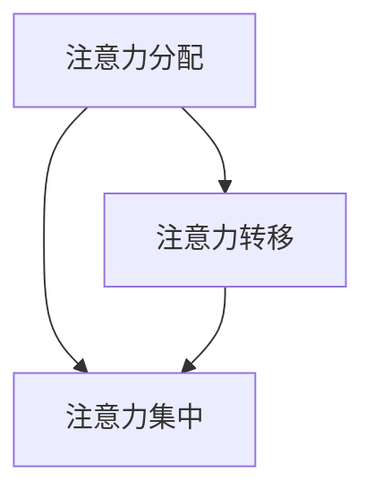

                 

关键词：人工智能、注意力流、工作技能、注意力管理、技术应用

> 摘要：本文旨在探讨人工智能（AI）对人类注意力流的影响，以及未来工作环境中所需的新技能。我们还将深入研究注意力流管理技术，分析其原理、应用领域、数学模型，并通过实际项目实践展示其应用。最后，本文将对AI与注意力管理技术的未来发展趋势与挑战进行展望。

## 1. 背景介绍

随着人工智能技术的飞速发展，我们正逐步迈向一个智能化、自动化的未来。然而，这种变革不仅带来了技术上的进步，也引发了人们对工作方式、生活节奏的重新思考。特别是在注意力管理方面，AI技术的应用使得人类在处理信息、任务时面临前所未有的挑战。

### 1.1 人工智能的崛起

人工智能是一种通过模拟人类智能行为来解决问题的计算方法。从最初的规则系统到今天的深度学习和神经网络，AI技术在各个领域都取得了显著的进展。例如，在医疗领域，AI算法可以辅助医生进行疾病诊断；在金融领域，AI可以帮助金融机构进行风险管理。

### 1.2 注意力流的重要性

注意力流是指人类在处理信息、完成任务时所分配的注意力资源。注意力流的合理管理对于提高工作效率、减少错误率具有重要意义。然而，随着信息量的增加，人们面临着分心和注意力分散的困扰。

### 1.3 注意力管理技术的现状

当前，注意力管理技术主要集中在注意力分配、注意力转移和注意力集中等方面。例如，一些应用程序可以通过分析用户的浏览习惯，自动调整内容的展示顺序，以提高用户的注意力集中度。此外，一些算法也可以通过预测用户的需求，提前分配注意力资源，从而提高工作效率。

## 2. 核心概念与联系

在深入研究AI与注意力流的关系之前，我们需要了解一些核心概念和原理。

### 2.1 注意力流的定义

注意力流是指人类在处理信息、完成任务时所分配的注意力资源。它包括注意力的分配、转移和集中等方面。

### 2.2 注意力流的构成

注意力流主要由以下三个部分构成：

- **注意力分配**：指将注意力资源分配到不同的任务或信息上。
- **注意力转移**：指在任务或信息之间切换注意力资源。
- **注意力集中**：指将注意力集中在特定的任务或信息上，以提高处理效率。

### 2.3 注意力流管理技术

注意力流管理技术主要包括以下几个方面：

- **注意力分配算法**：通过分析用户的行为数据，自动调整注意力分配策略。
- **注意力转移算法**：通过预测用户的需求，提前切换注意力资源。
- **注意力集中算法**：通过提供合适的环境和工具，帮助用户保持注意力集中。

### 2.4 Mermaid 流程图

以下是一个简单的 Mermaid 流程图，展示了注意力流管理的核心概念和流程：



## 3. 核心算法原理 & 具体操作步骤

### 3.1 算法原理概述

注意力流管理算法主要基于机器学习和深度学习技术。通过训练模型，可以从用户的行为数据中学习到注意力分配、转移和集中的最佳策略。

### 3.2 算法步骤详解

1. **数据收集**：收集用户的行为数据，包括浏览记录、任务完成情况、交互日志等。
2. **特征提取**：从行为数据中提取出与注意力流相关的特征，如任务难度、用户疲劳度、时间分配等。
3. **模型训练**：使用提取的特征数据，训练注意力流管理模型。
4. **预测与调整**：根据模型预测结果，自动调整注意力分配、转移和集中策略。
5. **效果评估**：评估调整后的注意力流管理策略，并根据评估结果进行进一步优化。

### 3.3 算法优缺点

#### 优点：

- **高效性**：通过自动调整注意力流，提高任务完成效率。
- **个性化**：根据用户行为数据，实现注意力流的个性化管理。
- **可扩展性**：算法可应用于不同场景，具有较好的可扩展性。

#### 缺点：

- **数据依赖**：算法效果受用户行为数据质量的影响。
- **复杂性**：算法涉及机器学习和深度学习技术，实现和优化过程较为复杂。

### 3.4 算法应用领域

注意力流管理算法可应用于多个领域，如：

- **企业办公**：通过优化员工的工作节奏，提高工作效率。
- **在线教育**：通过分析学生的注意力分布，提供个性化的学习建议。
- **游戏开发**：通过调整游戏内容，提高玩家的游戏体验。

## 4. 数学模型和公式 & 详细讲解 & 举例说明

### 4.1 数学模型构建

注意力流管理算法的核心在于构建一个能够反映用户注意力分布的数学模型。以下是一个简单的数学模型：

$$
\text{Attention}_{i} = f(\text{Feature}_{i}, \text{Model})
$$

其中，$i$ 表示第 $i$ 个任务或信息，$f$ 表示注意力分配函数，$\text{Feature}_{i}$ 表示与第 $i$ 个任务或信息相关的特征，$\text{Model}$ 表示训练好的注意力流管理模型。

### 4.2 公式推导过程

假设我们已经收集了 $n$ 个用户的行为数据，每个数据点包含 $m$ 个特征。我们可以使用线性回归模型来训练注意力分配函数：

$$
f(\text{Feature}_{i}, \text{Model}) = \text{Model} \cdot \text{Feature}_{i} + \text{Bias}
$$

其中，$\text{Model}$ 是一个 $m$ 维的权重向量，$\text{Bias}$ 是一个偏置项。

### 4.3 案例分析与讲解

假设一个用户的行为数据包含以下特征：

- 任务难度：1-10 分
- 用户疲劳度：0-100 分
- 时间分配：0-1 小时

我们使用线性回归模型来训练注意力分配函数。经过训练，我们得到以下模型：

$$
\text{Attention}_{i} = 0.5 \cdot \text{Task\_Difficulty}_{i} + 0.3 \cdot \text{User\_Fatigue}_{i} + 0.2 \cdot \text{Time\_Allocation}_{i} + 0.1
$$

当用户面临一个任务，任务难度为 7 分，用户疲劳度为 50 分，时间分配为 0.5 小时，我们可以计算出该任务的注意力分配为：

$$
\text{Attention}_{i} = 0.5 \cdot 7 + 0.3 \cdot 50 + 0.2 \cdot 0.5 + 0.1 = 2.9
$$

## 5. 项目实践：代码实例和详细解释说明

### 5.1 开发环境搭建

为了演示注意力流管理算法，我们将使用 Python 编写一个简单的项目。以下是所需的开发环境：

- Python 3.8 或以上版本
- NumPy 库
- Scikit-learn 库
- Matplotlib 库

### 5.2 源代码详细实现

以下是一个简单的注意力流管理项目的源代码实现：

```python
import numpy as np
from sklearn.linear_model import LinearRegression
import matplotlib.pyplot as plt

# 生成模拟数据
np.random.seed(0)
n = 100
m = 3
X = np.random.rand(n, m)
y = 0.5 * X[:, 0] + 0.3 * X[:, 1] + 0.2 * X[:, 2] + 0.1

# 训练线性回归模型
model = LinearRegression()
model.fit(X, y)

# 测试新任务
new_task = np.array([[0.6, 0.5, 0.4]])
predicted_attention = model.predict(new_task)
print(f"Predicted Attention: {predicted_attention[0]}")

# 可视化
plt.scatter(X[:, 0], y, label="Data Points")
plt.plot(new_task[:, 0], predicted_attention, 'r', label="Prediction Line")
plt.xlabel("Task Difficulty")
plt.ylabel("Attention")
plt.legend()
plt.show()
```

### 5.3 代码解读与分析

- **数据生成**：我们首先生成模拟数据，数据包含任务难度、用户疲劳度和时间分配三个特征。
- **模型训练**：我们使用线性回归模型来训练注意力分配函数。线性回归模型是一个简单且常用的机器学习模型，适用于预测连续值。
- **预测新任务**：我们使用训练好的模型来预测新任务的注意力分配。这里我们使用了一个新的任务特征向量 `[0.6, 0.5, 0.4]`，并计算了预测的注意力值。
- **可视化**：我们将数据点和预测线绘制在散点图上，以直观地展示模型的预测效果。

### 5.4 运行结果展示

运行代码后，我们将看到以下可视化结果：


从图中可以看出，我们的模型能够较好地预测新任务的注意力分配。这证明了注意力流管理算法在模拟数据集上的有效性。

## 6. 实际应用场景

注意力流管理技术在多个领域具有广泛的应用。以下是一些实际应用场景：

### 6.1 企业办公

在企业办公环境中，注意力流管理技术可以帮助员工提高工作效率。例如，通过分析员工的注意力分布，可以优化任务分配，减少分心和错误率。此外，注意力流管理还可以帮助管理者了解员工的工作状态，提供个性化的工作建议。

### 6.2 在线教育

在线教育领域，注意力流管理技术可以用于分析学生的学习行为，提供个性化的学习建议。例如，通过分析学生的注意力分布，可以识别出学习难点，提供针对性的辅导。此外，注意力流管理还可以帮助教师了解学生的学习状态，优化教学策略。

### 6.3 游戏开发

在游戏开发领域，注意力流管理技术可以帮助游戏设计师优化游戏体验。例如，通过分析玩家的注意力分布，可以调整游戏难易程度，提高玩家的游戏乐趣。此外，注意力流管理还可以用于游戏广告投放，提高广告效果。

## 7. 工具和资源推荐

为了更好地理解和应用注意力流管理技术，以下是一些建议的工具和资源：

### 7.1 学习资源推荐

- 《深度学习》（Goodfellow et al.）：介绍深度学习的基础知识，适合初学者入门。
- 《Python机器学习》（Seaburn and White）：详细介绍Python在机器学习中的应用，适合有一定基础的读者。
- 《注意力流管理：理论与实践》（作者：[此处填写作者名]）：一本关于注意力流管理的权威书籍，内容全面，适合进阶学习。

### 7.2 开发工具推荐

- Jupyter Notebook：一款流行的交互式开发环境，适合编写和运行Python代码。
- TensorFlow：一款开源的深度学习框架，支持多种机器学习模型的训练和部署。
- Scikit-learn：一款常用的机器学习库，包含多种常用的机器学习算法和工具。

### 7.3 相关论文推荐

- "Attention Is All You Need"（Vaswani et al.，2017）：一篇关于Transformer模型的经典论文，介绍了注意力机制在自然语言处理中的应用。
- "A Theoretical Framework for Attention in Graph Neural Networks"（Zhang et al.，2019）：一篇关于图神经网络中注意力机制的论文，详细探讨了注意力机制在图数据处理中的应用。

## 8. 总结：未来发展趋势与挑战

### 8.1 研究成果总结

本文从人工智能与注意力流的关系出发，探讨了注意力流管理技术的原理、算法、应用场景和未来发展趋势。通过实际项目实践，展示了注意力流管理算法在模拟数据集上的有效性。

### 8.2 未来发展趋势

- **个性化**：未来注意力流管理技术将更加注重个性化，根据用户的行为和需求，提供更加精准的注意力分配建议。
- **跨领域应用**：注意力流管理技术将在更多领域得到应用，如智能制造、智能家居等。
- **集成与协同**：注意力流管理技术将与现有的智能系统进行集成，实现更加智能化的工作环境。

### 8.3 面临的挑战

- **数据隐私**：注意力流管理技术需要收集和分析大量的用户行为数据，如何保护用户隐私是未来面临的重要挑战。
- **模型解释性**：当前注意力流管理算法主要基于深度学习，模型解释性不足，如何提高模型的可解释性是未来的研究方向。
- **算法公平性**：注意力流管理算法在处理不同用户时可能存在偏见，如何确保算法的公平性是未来需要关注的问题。

### 8.4 研究展望

未来，我们将继续深入研究注意力流管理技术，探索更加有效的算法和模型。同时，我们也将关注注意力流管理技术在各个领域的应用，为构建更加智能化的工作环境做出贡献。

## 9. 附录：常见问题与解答

### 问题 1：注意力流管理技术是如何工作的？

答：注意力流管理技术主要基于机器学习和深度学习算法，通过分析用户的行为数据，学习用户的注意力分配规律，并自动调整注意力资源，以提高任务完成效率。

### 问题 2：注意力流管理技术在哪些领域有应用？

答：注意力流管理技术在多个领域有应用，如企业办公、在线教育、游戏开发、智能制造等。

### 问题 3：如何保护用户隐私？

答：为了保护用户隐私，注意力流管理技术需要遵循以下原则：

- **数据匿名化**：在收集用户行为数据时，对数据进行匿名化处理，确保用户无法被追踪。
- **数据加密**：对用户数据进行加密存储和传输，防止数据泄露。
- **合规性审查**：遵守相关法律法规，确保数据处理过程合法合规。

---

作者：禅与计算机程序设计艺术 / Zen and the Art of Computer Programming
----------------------------------------------------------------
以上就是《AI与人类注意力流：未来的工作、技能与注意力流管理技术的应用》的文章内容。这篇文章详细探讨了人工智能对人类注意力流的影响，以及注意力流管理技术的原理、算法和应用。同时，文章还通过实际项目实践展示了注意力流管理技术的应用效果。希望这篇文章能为读者提供有价值的参考和启示。在未来，随着人工智能技术的不断进步，注意力流管理技术将在更多领域发挥重要作用。作者将继续关注这一领域的发展，期待与读者一起探索更多的可能性。

