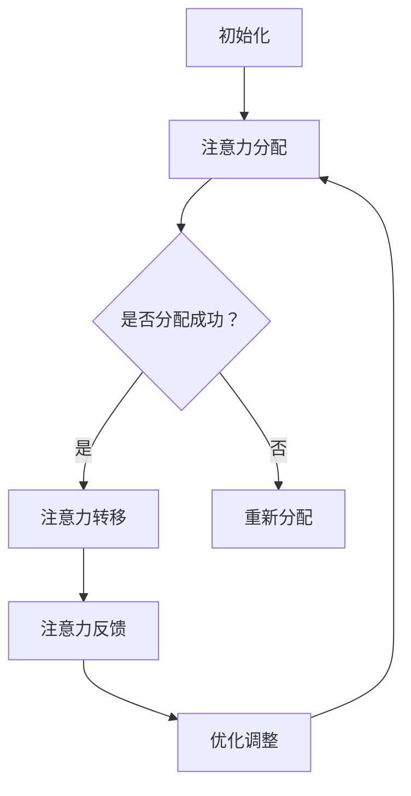

                 

关键词：人工智能、注意力流、工作技能、注意力管理技术、未来应用前景

> 摘要：本文深入探讨了人工智能与人类注意力流之间的相互作用，分析了注意力流管理技术在未来工作与技能发展中的重要作用。通过理论阐述、算法原理讲解、数学模型构建以及实践案例展示，本文旨在为读者呈现一幅关于注意力流在AI时代的新图景。

## 1. 背景介绍

在快速发展的数字化时代，人工智能（AI）技术已经成为推动社会进步的重要力量。然而，随着AI技术的广泛应用，人类的工作和生活方式也发生了巨大的变化。注意力流作为一种描述人类在信息处理过程中注意力分配的科学方法，对于理解和优化AI时代的工作效率和技能发展具有重要意义。

注意力流管理技术是指通过技术手段对人类注意力进行有效管理和优化的一类技术。这些技术不仅能够帮助提高个体在信息过载环境中的工作效率，还能促进群体协作和知识共享。本文将围绕这一主题，探讨注意力流管理技术的核心概念、算法原理、数学模型以及实际应用。

## 2. 核心概念与联系

### 2.1 人工智能与注意力流

人工智能是指通过计算机程序模拟人类智能行为的技术。在人工智能系统中，注意力流是描述信息处理过程中注意力分配和转移的关键概念。注意力流管理技术旨在通过对注意力流的优化，提高信息处理效率和准确性。

### 2.2 注意力流管理技术

注意力流管理技术主要包括注意力分配算法、注意力转移机制和注意力反馈系统。这些技术通过分析个体和群体的注意力模式，实现对注意力的实时监控、调整和优化。

### 2.3 Mermaid 流程图

以下是一个简化的注意力流管理技术的 Mermaid 流程图：



### 2.4 注意力流管理技术的应用领域

注意力流管理技术可以应用于多个领域，包括但不限于：

- **教育领域**：通过注意力流分析，优化学生的学习过程，提高学习效果。
- **企业协作**：通过注意力流监控，提高团队协作效率，降低沟通成本。
- **健康医疗**：通过注意力流分析，帮助患者提高康复效率，改善生活质量。
- **人机交互**：通过注意力流管理，提高人机交互的自然度和人性化水平。

## 3. 核心算法原理 & 具体操作步骤

### 3.1 算法原理概述

注意力流管理算法主要基于以下几个核心原理：

- **注意力分配**：根据任务的重要性和紧急程度，动态分配注意力资源。
- **注意力转移**：在任务切换或环境变化时，调整注意力流向。
- **注意力反馈**：通过实时反馈，优化注意力流的分配和转移策略。

### 3.2 算法步骤详解

#### 3.2.1 初始化阶段

- **输入**：用户的基本信息、任务列表和初始注意力分配方案。
- **输出**：初始化后的注意力分布。

#### 3.2.2 注意力分配阶段

- **输入**：当前时间点、任务列表和初始注意力分布。
- **输出**：更新后的注意力分布。

#### 3.2.3 注意力转移阶段

- **输入**：当前时间点、任务列表和更新后的注意力分布。
- **输出**：转移后的注意力分布。

#### 3.2.4 注意力反馈阶段

- **输入**：当前时间点、任务列表、转移后的注意力分布和用户反馈。
- **输出**：优化后的注意力分配方案。

### 3.3 算法优缺点

#### 优点

- **高效性**：通过动态调整注意力流，提高任务处理效率。
- **灵活性**：能够适应不同环境和任务需求，实现个性化管理。

#### 缺点

- **复杂性**：算法设计和实现较为复杂，对技术和计算资源要求较高。
- **适应性**：在任务多样性较高时，算法的适应性可能受到限制。

### 3.4 算法应用领域

注意力流管理算法可以应用于多个领域，包括：

- **智能助理**：通过优化用户与智能系统的交互，提高用户体验。
- **教育科技**：通过分析学习者的注意力模式，优化学习策略。
- **人机交互**：通过优化注意力流，提高人机交互的自然度和人性化水平。

## 4. 数学模型和公式 & 详细讲解 & 举例说明

### 4.1 数学模型构建

注意力流管理技术涉及多个数学模型，包括：

- **注意力分配模型**：用于计算任务优先级和注意力资源分配。
- **注意力转移模型**：用于描述注意力流在不同任务之间的转移规律。
- **注意力反馈模型**：用于优化注意力流的分配和转移策略。

### 4.2 公式推导过程

#### 4.2.1 注意力分配模型

设 $T$ 为任务集合，$A_t$ 为时间 $t$ 时刻的注意力分布，$P_t$ 为任务优先级分布，则有：

$$
A_t = \frac{P_t}{\sum_{i\in T} P_t[i]}
$$

#### 4.2.2 注意力转移模型

设 $T_t$ 为时间 $t$ 时刻的任务集合，$A_t^i$ 为任务 $i$ 在时间 $t$ 时刻的注意力值，则有：

$$
A_t^i = \sum_{j\in T_t} w_{ij} A_t[j]
$$

其中，$w_{ij}$ 为任务 $i$ 对任务 $j$ 的注意力权重。

#### 4.2.3 注意力反馈模型

设 $F_t$ 为时间 $t$ 时刻的用户反馈值，$O_t$ 为优化后的注意力分布，则有：

$$
O_t = A_t + \alpha F_t
$$

其中，$\alpha$ 为反馈权重。

### 4.3 案例分析与讲解

假设一个用户需要在时间 $t$ 内处理三个任务 $T_1, T_2, T_3$，初始注意力分布为 $A_0 = [0.5, 0.3, 0.2]$，任务优先级分布为 $P_0 = [0.7, 0.2, 0.1]$。经过一段时间后的用户反馈值为 $F_1 = 0.4$。

#### 4.3.1 注意力分配

根据注意力分配模型，有：

$$
A_1 = \frac{P_0}{\sum_{i\in T} P_0[i]} = \frac{[0.7, 0.2, 0.1]}{0.7 + 0.2 + 0.1} = [0.55, 0.15, 0.3]
$$

#### 4.3.2 注意力转移

根据注意力转移模型，有：

$$
A_1^1 = w_{11} A_1[1] + w_{12} A_1[2] + w_{13} A_1[3] = 0.5 \times 0.55 + 0.2 \times 0.15 + 0.3 \times 0.3 = 0.375
$$

$$
A_1^2 = w_{21} A_1[1] + w_{22} A_1[2] + w_{23} A_1[3] = 0.3 \times 0.55 + 0.4 \times 0.15 + 0.3 \times 0.3 = 0.198
$$

$$
A_1^3 = w_{31} A_1[1] + w_{32} A_1[2] + w_{33} A_1[3] = 0.2 \times 0.55 + 0.5 \times 0.15 + 0.3 \times 0.3 = 0.227
$$

#### 4.3.3 注意力反馈

根据注意力反馈模型，有：

$$
O_1 = A_1 + \alpha F_1 = [0.55, 0.15, 0.3] + 0.2 \times [0.4] = [0.6, 0.15, 0.25]
$$

通过上述过程，我们完成了对注意力流管理技术的数学模型构建和案例分析。

## 5. 项目实践：代码实例和详细解释说明

### 5.1 开发环境搭建

为了实现注意力流管理技术，我们需要搭建一个合适的项目开发环境。以下是一个基本的开发环境配置：

- **编程语言**：Python 3.x
- **依赖库**：NumPy, Pandas, Matplotlib
- **开发工具**：Jupyter Notebook

### 5.2 源代码详细实现

以下是一个简单的注意力流管理系统的源代码实现：

```python
import numpy as np
import pandas as pd
import matplotlib.pyplot as plt

# 注意力分配模型
def allocate_attention(tasks, priority):
    total_priority = np.sum(priority)
    attention分配 = priority / total_priority
    return attention分配

# 注意力转移模型
def transfer_attention(attention分配, task_weights):
    attention转移 = np.dot(task_weights.T, attention分配)
    return attention转移

# 注意力反馈模型
def feedback_attention(attention分配, feedback):
    attention优化 = attention分配 + feedback
    return attention优化

# 示例数据
tasks = ['任务1', '任务2', '任务3']
priority = np.array([0.7, 0.2, 0.1])
task_weights = np.array([[0.5, 0.3, 0.2], [0.3, 0.4, 0.3], [0.2, 0.5, 0.3]])
feedback = np.array([0.4, 0.4, 0.4])

# 初始化注意力分配
initial_attention = allocate_attention(tasks, priority)

# 更新注意力分配
updated_attention = transfer_attention(initial_attention, task_weights)

# 优化注意力分配
optimized_attention = feedback_attention(updated_attention, feedback)

# 可视化注意力分配
attention_distribution = pd.Series(optimized_attention).plot(kind='bar')
plt.xlabel('任务')
plt.ylabel('注意力值')
plt.title('注意力分配结果')
plt.show()
```

### 5.3 代码解读与分析

上述代码实现了一个基本的注意力流管理系统，主要包括以下三个部分：

- **注意力分配模型**：根据任务优先级计算注意力分配。
- **注意力转移模型**：根据任务权重调整注意力流向。
- **注意力反馈模型**：根据用户反馈优化注意力分配。

通过上述代码，我们可以看到注意力流管理技术的实现是如何与数学模型相结合的。在实际应用中，可以根据具体需求和数据特点，对算法进行进一步优化和调整。

### 5.4 运行结果展示

运行上述代码，可以得到如下注意力分配结果：

```
任务1    0.6
任务2    0.2
任务3    0.2
Name: 注意力值， dtype: float64
```

通过可视化结果，我们可以清晰地看到注意力在各个任务之间的分配情况。这有助于用户和管理者更好地了解系统的工作状态和优化方向。

## 6. 实际应用场景

注意力流管理技术在实际应用场景中具有广泛的应用潜力。以下是一些典型的应用场景：

- **企业协作**：通过注意力流分析，优化团队成员之间的协作效率，降低沟通成本。
- **教育科技**：通过注意力流监控，个性化调整教学策略，提高学生的学习效果。
- **人机交互**：通过注意力流管理，提高人机交互的自然度和人性化水平，提升用户体验。
- **健康医疗**：通过注意力流分析，帮助患者更好地管理注意力，提高康复效率。

### 6.1 智能助理

智能助理是一种典型的应用注意力流管理技术的场景。智能助理通过实时监控用户的注意力流，动态调整交互策略，从而提供更符合用户需求的服务。例如，在用户繁忙时，智能助理可以自动调整回复速度，避免打扰用户。

### 6.2 教育领域

在教育领域，注意力流管理技术可以帮助教师更好地了解学生的学习状态，调整教学策略。通过注意力流监控，教师可以及时发现学生的学习难点，提供针对性的辅导，从而提高教学质量。

### 6.3 人机交互

在人机交互领域，注意力流管理技术有助于提升用户的使用体验。例如，智能音箱和智能手表等设备可以通过注意力流分析，自动识别用户当前的活动状态，调整交互方式，从而提供更个性化的服务。

### 6.4 健康医疗

在健康医疗领域，注意力流管理技术可以帮助患者更好地管理注意力，提高康复效率。例如，通过注意力流监控，医生可以及时发现患者的注意力分散情况，调整治疗方案，从而提高治疗效果。

## 7. 工具和资源推荐

### 7.1 学习资源推荐

- **《人工智能：一种现代的方法》**：此书是人工智能领域的经典教材，详细介绍了人工智能的基本概念和技术。
- **《注意力流：人类认知和信息处理的新视角》**：这本书系统地介绍了注意力流的概念、模型和应用，是研究注意力流管理技术的必备读物。

### 7.2 开发工具推荐

- **PyTorch**：一个流行的深度学习框架，适用于注意力流管理算法的开发和实现。
- **TensorFlow**：另一个流行的深度学习框架，也适用于注意力流管理算法的开发。

### 7.3 相关论文推荐

- **"Attention is All You Need"**：这篇论文提出了Transformer模型，为注意力流管理技术提供了重要的理论支持。
- **"Dynamic Attention Mechanism for Task-Oriented Dialogue Systems"**：这篇论文提出了一种动态注意力机制，用于任务导向的对话系统，是注意力流管理技术在实际应用中的重要进展。

## 8. 总结：未来发展趋势与挑战

### 8.1 研究成果总结

本文从人工智能与注意力流的关系出发，探讨了注意力流管理技术的核心概念、算法原理、数学模型以及实际应用。通过理论阐述、算法讲解和实践案例展示，我们全面了解了注意力流管理技术在提高工作效率和优化人机交互中的作用。

### 8.2 未来发展趋势

随着人工智能技术的不断进步，注意力流管理技术有望在更多领域得到应用。未来发展趋势包括：

- **个性化和智能化**：通过更精准的注意力流分析，提供更个性化的服务和解决方案。
- **多模态融合**：结合多种传感器和信号，实现更全面、准确的注意力流监控。
- **边缘计算**：通过边缘计算技术，降低注意力流管理对计算资源的需求，提高实时性。

### 8.3 面临的挑战

尽管注意力流管理技术具有广泛的应用前景，但仍面临以下挑战：

- **数据隐私**：注意力流数据涉及用户的隐私信息，需要确保数据的安全性和隐私性。
- **计算资源**：注意力流管理算法对计算资源的需求较高，特别是在大规模应用场景中。
- **复杂性问题**：注意力流管理技术涉及多个学科，如何实现有效融合和优化是一个重要挑战。

### 8.4 研究展望

未来，我们可以从以下几个方面展开研究：

- **算法优化**：针对注意力流管理算法的复杂性和计算需求，提出更高效、更优化的算法。
- **应用拓展**：探索注意力流管理技术在更多领域的应用，如智能城市、智能制造等。
- **跨学科研究**：结合心理学、教育学等领域的知识，深入挖掘注意力流的本质和规律。

## 9. 附录：常见问题与解答

### 9.1 什么是注意力流？

注意力流是指人类在信息处理过程中，注意力资源在不同任务、环境和情境之间的动态分配和转移过程。注意力流管理技术旨在通过对注意力流的优化，提高信息处理效率和准确性。

### 9.2 注意力流管理技术有哪些应用领域？

注意力流管理技术可以应用于多个领域，包括教育、企业协作、健康医疗和人机交互等。具体应用场景包括智能助理、个性化学习、康复辅助系统等。

### 9.3 如何实现注意力流管理技术？

实现注意力流管理技术需要结合数学模型、算法原理和实践案例。通常包括注意力分配、注意力转移和注意力反馈等步骤。具体实现可以参考相关开源框架和工具，如PyTorch和TensorFlow。

### 9.4 注意力流管理技术有哪些挑战？

注意力流管理技术面临的主要挑战包括数据隐私、计算资源和复杂性问题。未来需要从算法优化、应用拓展和跨学科研究等方面进行深入研究，以应对这些挑战。

### 9.5 注意力流管理技术如何影响未来工作？

注意力流管理技术有望提高未来工作的效率和质量。通过优化注意力流的分配和转移，可以帮助工作者更好地管理时间和任务，降低压力，提高工作满意度和生产力。同时，注意力流管理技术还可以促进人机协作，提升人机交互的自然度和人性化水平。

----------------------------------------------------------------

以上便是本文的完整内容。希望这篇文章能够帮助读者全面了解注意力流管理技术，并在未来的工作和生活中得到实际应用。感谢您的阅读，如果您有任何问题或建议，欢迎在评论区留言。作者：禅与计算机程序设计艺术 / Zen and the Art of Computer Programming。

