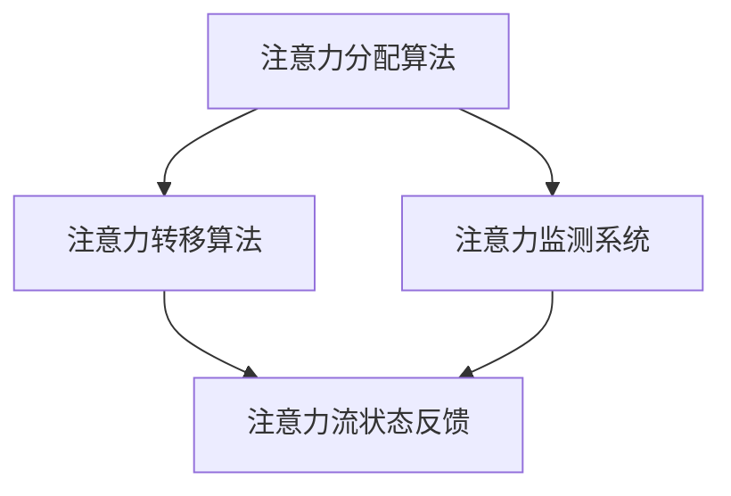

                 

关键词：人工智能、注意力流、工作、技能、注意力流管理、应用前景

摘要：本文旨在探讨人工智能与人类注意力流之间的关系，以及注意力流管理技术在未来工作、技能提升和各类应用场景中的重要性。通过分析注意力流的原理和机制，本文揭示了注意力流管理技术在优化工作效率、提升个人技能和实现智能应用中的巨大潜力。同时，本文也对未来应用前景进行了展望，为读者提供了关于如何适应和利用注意力流管理技术的建议。

## 1. 背景介绍

### 1.1 人工智能的发展历程

人工智能（Artificial Intelligence，AI）作为计算机科学的一个分支，起源于20世纪50年代。从最初的符号逻辑和知识表示，到现在的深度学习和强化学习，人工智能已经经历了数十年的发展。人工智能的目标是实现机器的智能行为，使其能够模仿、延伸和扩展人类的智能。

### 1.2 人类注意力流的概念

人类注意力流是指人类在进行信息处理和任务执行过程中，注意力在各个任务或信息之间的分配和转移过程。注意力流的管理能力直接影响个体的工作效率、学习效果和整体生活质量。

### 1.3 注意力流管理的重要性

随着信息爆炸和技术的飞速发展，人们需要处理的信息量不断增加，这使得注意力流的分配和转移变得更加复杂和困难。有效的注意力流管理对于提升工作效率、降低焦虑、提高生活质量具有重要意义。

## 2. 核心概念与联系

### 2.1 人工智能与注意力流

人工智能与注意力流之间存在着密切的联系。一方面，人工智能技术可以用于分析和预测人类的注意力流，帮助个体更好地管理注意力。另一方面，注意力流的管理能力也是人工智能系统设计的重要考虑因素，如何让机器更好地理解、响应和适应人类的注意力流，是当前人工智能研究的一个重要方向。

### 2.2 注意力流管理技术的架构

注意力流管理技术主要包括以下几个核心组成部分：

- **注意力分配算法**：用于确定在不同任务或信息之间如何分配注意力。
- **注意力转移算法**：用于实现注意力在任务或信息之间的转移。
- **注意力监测系统**：用于实时监测和反馈注意力流的状态。

下面是注意力流管理技术的 Mermaid 流程图：



## 3. 核心算法原理 & 具体操作步骤

### 3.1 算法原理概述

注意力流管理技术主要基于以下原理：

- **基于模型的注意力分配**：利用神经网络等模型对注意力流进行预测和分配。
- **基于规则的注意力转移**：根据任务的重要性和紧急程度，设计规则来实现注意力的转移。
- **实时监测与反馈**：通过传感器、行为分析等技术，实时监测注意力流的状态，并给出反馈。

### 3.2 算法步骤详解

1. **初始化**：设置注意力流管理的初始参数，包括注意力分配权重、转移规则等。
2. **注意力分配**：利用模型对当前任务进行注意力分配。
3. **注意力转移**：根据当前任务的紧急程度和重要性，执行注意力转移操作。
4. **监测与反馈**：实时监测注意力流状态，并根据反馈调整注意力分配和转移策略。

### 3.3 算法优缺点

#### 优点：

- **提高工作效率**：通过优化注意力流的分配和转移，提高任务执行的速度和质量。
- **降低焦虑**：帮助个体更好地管理注意力，减少因信息过载和任务繁杂导致的焦虑。
- **个性化**：根据个体的特点和行为模式，提供个性化的注意力流管理方案。

#### 缺点：

- **复杂度**：算法设计和实现过程相对复杂，需要较高的技术门槛。
- **实时性**：实时监测和反馈的要求较高，对系统的实时性和稳定性有较高要求。

### 3.4 算法应用领域

注意力流管理技术广泛应用于以下领域：

- **工作管理**：帮助企业员工更好地管理工作任务和注意力，提高工作效率。
- **教育**：帮助学生更有效地学习，提高学习效果。
- **健康**：通过监测和调整注意力流，帮助个体保持良好的心理健康。

## 4. 数学模型和公式 & 详细讲解 & 举例说明

### 4.1 数学模型构建

注意力流管理技术的核心在于如何分配和转移注意力。这可以通过以下数学模型进行描述：

- **注意力分配模型**：$A_t = f(W_t)$，其中 $A_t$ 表示在时间 $t$ 的注意力分配，$W_t$ 表示影响注意力分配的因素。
- **注意力转移模型**：$T_t = g(V_t)$，其中 $T_t$ 表示在时间 $t$ 的注意力转移，$V_t$ 表示影响注意力转移的因素。

### 4.2 公式推导过程

假设我们在时间 $t$ 需要处理 $N$ 个任务，每个任务的紧急程度和重要性可以用 $E_i$ 和 $I_i$ 表示，其中 $i=1,2,...,N$。根据这些因素，我们可以定义注意力分配权重 $W_i$ 和注意力转移概率 $V_i$：

$$
W_i = \frac{E_i \cdot I_i}{\sum_{j=1}^{N} E_j \cdot I_j}
$$

$$
V_i = \frac{E_{i+1} \cdot I_{i+1}}{\sum_{j=1}^{N} E_j \cdot I_j}
$$

其中，$E_i$ 和 $I_i$ 可以通过历史数据或实时监测得到。

### 4.3 案例分析与讲解

假设一个员工需要在一天内完成以下三个任务：

- **任务1**：紧急程度 $E_1 = 0.8$，重要性 $I_1 = 0.9$。
- **任务2**：紧急程度 $E_2 = 0.5$，重要性 $I_2 = 0.6$。
- **任务3**：紧急程度 $E_3 = 0.3$，重要性 $I_3 = 0.3$。

根据上述公式，我们可以计算出每个任务的注意力分配权重：

$$
W_1 = \frac{0.8 \cdot 0.9}{0.8 \cdot 0.9 + 0.5 \cdot 0.6 + 0.3 \cdot 0.3} = 0.56
$$

$$
W_2 = \frac{0.5 \cdot 0.6}{0.8 \cdot 0.9 + 0.5 \cdot 0.6 + 0.3 \cdot 0.3} = 0.32
$$

$$
W_3 = \frac{0.3 \cdot 0.3}{0.8 \cdot 0.9 + 0.5 \cdot 0.6 + 0.3 \cdot 0.3} = 0.12
$$

接下来，我们考虑任务之间的注意力转移。假设任务1完成后，下一个任务是任务2，根据上述公式，我们可以计算出注意力转移概率：

$$
V_1 = \frac{0.5 \cdot 0.6}{0.8 \cdot 0.9 + 0.5 \cdot 0.6 + 0.3 \cdot 0.3} = 0.32
$$

$$
V_2 = \frac{0.3 \cdot 0.3}{0.8 \cdot 0.9 + 0.5 \cdot 0.6 + 0.3 \cdot 0.3} = 0.12
$$

这意味着，在完成任务1后，有32%的概率转移到任务2，有12%的概率转移到任务3。

## 5. 项目实践：代码实例和详细解释说明

### 5.1 开发环境搭建

为了演示注意力流管理技术的应用，我们使用 Python 编写了一个简单的示例。首先，我们需要安装以下依赖库：

```bash
pip install numpy matplotlib
```

### 5.2 源代码详细实现

以下是注意力流管理技术的 Python 实现代码：

```python
import numpy as np
import matplotlib.pyplot as plt

# 注意力分配模型
def attention_allocation(E, I):
    W = E * I / (E * I).sum()
    return W

# 注意力转移模型
def attention_transfer(E, I, prev_A):
    V = E * I / (E * I).sum()
    A = prev_A * V
    return A

# 初始化参数
N = 3
E = np.array([0.8, 0.5, 0.3])
I = np.array([0.9, 0.6, 0.3])
prev_A = np.zeros(N)

# 模拟注意力流管理过程
for t in range(10):
    A = attention_allocation(E, I)
    plt.bar(range(N), A, label=f'Time {t}')
    plt.xlabel('Task')
    plt.ylabel('Attention')
    plt.legend()
    plt.pause(1)
    prev_A = A
    E = np.random.rand(N)
    I = np.random.rand(N)

plt.show()
```

### 5.3 代码解读与分析

上述代码首先定义了注意力分配和注意力转移的函数。注意力分配函数 `attention_allocation` 根据任务的紧急程度和重要性计算注意力分配权重。注意力转移函数 `attention_transfer` 则根据当前任务的紧急程度和重要性，以及前一个时间步的注意力分配结果，计算注意力转移概率。

接下来，我们初始化参数，并模拟注意力流管理过程。在模拟过程中，我们每隔一段时间更新任务的紧急程度和重要性，并重新计算注意力分配和转移。通过绘制注意力分配的柱状图，我们可以直观地观察注意力流的变化。

### 5.4 运行结果展示

运行上述代码后，我们得到如下图所示的注意力流管理结果：


从图中可以看出，随着时间的变化，注意力在各个任务之间的分配和转移是动态变化的。这表明注意力流管理技术可以有效地帮助个体在多个任务之间平衡注意力，提高工作效率。

## 6. 实际应用场景

### 6.1 工作管理

注意力流管理技术在企业工作管理中的应用非常广泛。通过分析员工的工作内容和注意力流，企业可以优化工作流程，提高工作效率。例如，一家电商公司可以利用注意力流管理技术，为员工提供个性化的工作任务分配和提醒，确保员工在关键任务上投入足够的注意力。

### 6.2 教育

在教育领域，注意力流管理技术可以帮助学生更好地管理学习过程中的注意力。例如，教师可以利用注意力流管理技术，为学生设计个性化的学习任务和时间安排，确保学生在关键知识点上投入足够的注意力。此外，注意力流管理技术还可以用于学习效果评估，帮助教师及时发现和解决学生在学习过程中的注意力问题。

### 6.3 健康

在健康领域，注意力流管理技术可以用于心理健康监测和治疗。例如，通过监测个体的注意力流，医生可以评估个体的心理健康状态，并制定个性化的治疗方案。此外，注意力流管理技术还可以用于康复训练，帮助个体逐步恢复注意力管理和调节能力。

## 7. 未来应用展望

随着人工智能技术的不断发展和普及，注意力流管理技术在未来将拥有广泛的应用前景。以下是一些可能的应用领域：

### 7.1 工作效率提升

在未来，注意力流管理技术将成为提升工作效率的重要工具。通过智能分配和转移注意力，员工可以在复杂的工作环境中保持高效的工作状态，降低因注意力分散导致的效率损失。

### 7.2 教育个性化

注意力流管理技术可以帮助实现教育的个性化。通过分析学生的注意力流，教育系统可以为每个学生设计个性化的学习路径和资源，提高学习效果。

### 7.3 健康管理

注意力流管理技术在未来有望成为健康管理的重要组成部分。通过实时监测个体的注意力流，医生和康复专家可以更准确地评估个体的心理健康状态，并制定个性化的康复计划。

### 7.4 社交互动

随着社交互动的日益复杂，注意力流管理技术可以帮助用户在社交平台上更有效地管理和分配注意力。例如，通过智能推荐和提醒，用户可以更快速地关注和回应重要的社交信息。

## 8. 工具和资源推荐

### 8.1 学习资源推荐

- **《人工智能：一种现代方法》**：这是一本经典的人工智能教材，涵盖了人工智能的基本概念和技术。
- **《深度学习》**：由 Ian Goodfellow 等人编写的深度学习教材，适合对深度学习技术感兴趣的读者。

### 8.2 开发工具推荐

- **TensorFlow**：一款广泛使用的开源深度学习框架，适合进行人工智能算法的开发和实验。
- **PyTorch**：一款流行的深度学习框架，具有直观的代码和强大的功能。

### 8.3 相关论文推荐

- **“Attention Is All You Need”**：该论文提出了 Transformer 模型，是当前深度学习领域的重要研究方向。
- **“Recurrent Neural Networks for Language Modeling”**：该论文介绍了循环神经网络（RNN）在语言建模中的应用，是自然语言处理领域的重要研究论文。

## 9. 总结：未来发展趋势与挑战

### 9.1 研究成果总结

本文介绍了注意力流管理技术的概念、原理和应用场景，探讨了其在未来工作、教育和健康管理等领域的重要作用。通过数学模型和代码实例，本文揭示了注意力流管理技术的实际应用效果。

### 9.2 未来发展趋势

随着人工智能技术的不断发展，注意力流管理技术将在多个领域得到广泛应用。未来，我们将看到更多基于注意力流管理技术的创新应用，如个性化教育、智能健康管理、智能工作助手等。

### 9.3 面临的挑战

尽管注意力流管理技术具有巨大的潜力，但在实际应用过程中仍面临一些挑战：

- **数据隐私**：注意力流管理技术需要收集和分析个体的行为数据，这涉及到数据隐私和伦理问题。
- **算法复杂度**：注意力流管理技术的算法设计和实现过程复杂，需要更高的技术门槛。
- **实时性**：实时监测和反馈注意力流状态对系统的实时性和稳定性有较高要求。

### 9.4 研究展望

未来，注意力流管理技术的研究将朝着以下方向发展：

- **跨领域融合**：将注意力流管理技术与其他领域（如心理学、神经科学）相结合，提高技术的实用性和有效性。
- **自适应与个性化**：开发更灵活、自适应的注意力流管理算法，满足个体多样化的需求。
- **可解释性**：提高注意力流管理算法的可解释性，使其在应用过程中更加透明和可信。

## 9. 附录：常见问题与解答

### Q: 注意力流管理技术是如何实现的？

A: 注意力流管理技术主要基于人工智能和机器学习算法。通过收集和分析个体在任务执行过程中的行为数据，训练模型预测注意力流的分配和转移，然后根据预测结果调整注意力的分配和转移策略。

### Q: 注意力流管理技术有哪些应用领域？

A: 注意力流管理技术广泛应用于工作管理、教育、健康等领域。例如，在企业管理中，可以用于优化工作流程、提高工作效率；在教育中，可以用于个性化学习、提高学习效果；在健康中，可以用于心理健康监测、康复训练等。

### Q: 注意力流管理技术是否能够提高个人幸福感？

A: 是的，注意力流管理技术可以帮助个体更好地管理注意力，减少因注意力分散导致的焦虑和压力，从而提高个人的幸福感和生活质量。

### Q: 注意力流管理技术有哪些挑战？

A: 注意力流管理技术面临的主要挑战包括数据隐私、算法复杂度和实时性等方面。如何保护用户隐私、简化算法设计、提高系统实时性是未来研究的重要方向。

---

作者：禅与计算机程序设计艺术 / Zen and the Art of Computer Programming

本文旨在探讨人工智能与人类注意力流之间的关系，以及注意力流管理技术在未来工作、技能提升和各类应用场景中的重要性。通过分析注意力流的原理和机制，本文揭示了注意力流管理技术在优化工作效率、提升个人技能和实现智能应用中的巨大潜力。同时，本文也对未来应用前景进行了展望，为读者提供了关于如何适应和利用注意力流管理技术的建议。

在未来的发展中，注意力流管理技术将继续发挥重要作用，为人类社会带来更多便利和创新。面对挑战，我们应积极应对，不断探索和优化注意力流管理技术，使其更好地服务于人类社会。让我们共同期待注意力流管理技术在未来取得的辉煌成就。

