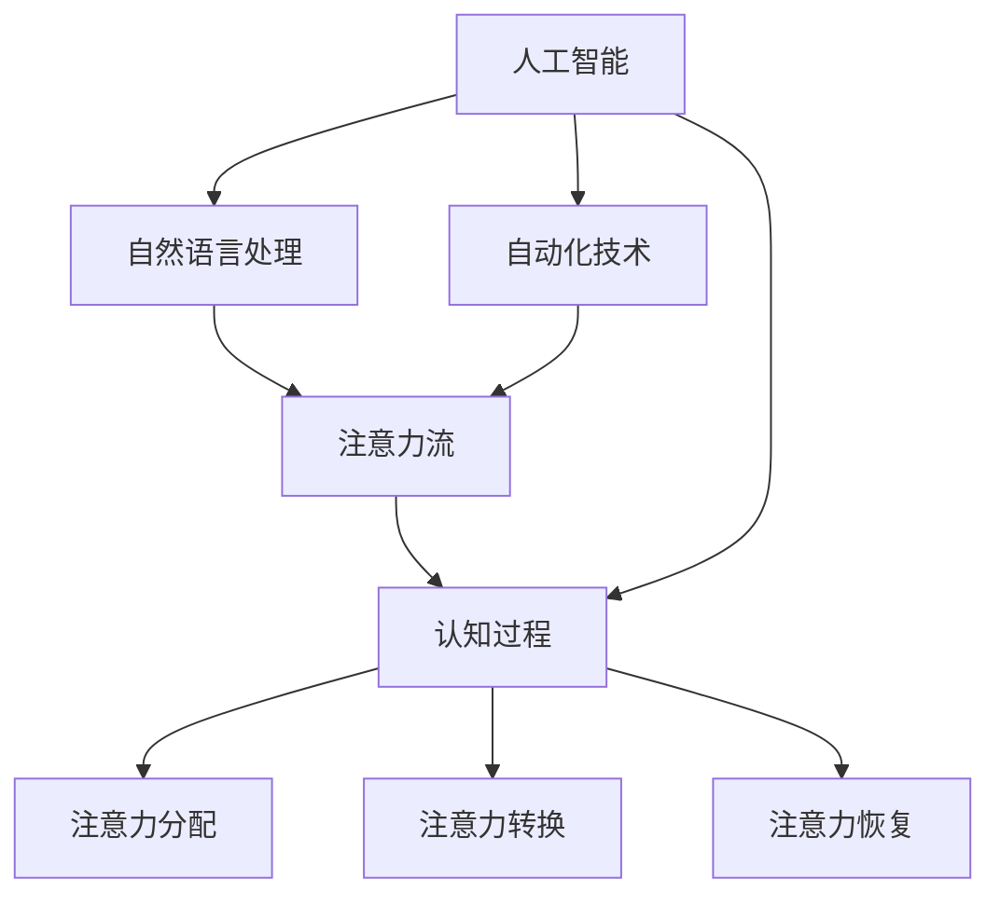

                 

 > **关键词：** AI、注意力流、工作技能、注意力管理、技术应用、前景展望

> **摘要：** 本文将深入探讨人工智能（AI）与人类注意力流的关联，分析AI对未来的工作技能和注意力管理技术的影响。通过详细的理论分析和实际案例，预测注意力流管理技术在未来各个领域的应用前景，并总结研究成果和面临的挑战，为未来发展提供指导。

## 1. 背景介绍

随着人工智能技术的飞速发展，AI在各个领域的影响力逐渐增强。从自然语言处理到图像识别，从自动化生产线到智能客服，AI正逐渐改变我们的生活方式和工作方式。然而，在这个变革的过程中，人类的注意力资源显得尤为重要。注意力是有限的，如何有效管理和分配注意力，成为了一个关键问题。

注意力流（Attention Flow）是指人类在处理信息时，注意力在各个任务之间的流动和分配过程。注意力流管理技术旨在提高人类在工作、学习和生活中的注意力效率，帮助人们更好地应对日益复杂的信息环境。

本文将从以下几个方面展开讨论：

1. **核心概念与联系**：介绍注意力流和AI的基础概念，以及它们之间的相互关系。
2. **核心算法原理 & 具体操作步骤**：详细阐述注意力流管理技术的核心算法原理和操作步骤。
3. **数学模型和公式 & 详细讲解 & 举例说明**：构建注意力流管理的数学模型，并进行公式推导和案例讲解。
4. **项目实践：代码实例和详细解释说明**：通过实际代码实例，展示注意力流管理技术的应用。
5. **实际应用场景**：探讨注意力流管理技术在教育、医疗、企业等领域的实际应用。
6. **未来应用展望**：预测注意力流管理技术在未来各领域的发展趋势和应用前景。
7. **工具和资源推荐**：推荐相关学习资源、开发工具和论文。
8. **总结：未来发展趋势与挑战**：总结研究成果，探讨未来发展中的挑战和机遇。

## 2. 核心概念与联系

### 2.1 注意力流概念

注意力流是指人类在处理信息时，注意力在不同任务之间分配和转移的过程。它涉及到人类认知过程中的注意力分配、注意力转换和注意力恢复等多个方面。例如，当我们同时处理多项任务时，注意力会在这些任务之间进行切换，以实现高效的资源利用。

### 2.2 人工智能概念

人工智能（AI）是指通过计算机模拟人类智能的技术，包括学习、推理、规划、感知和自然语言处理等。AI技术旨在提高人类工作和生活的效率，解决复杂问题，并在各个领域实现自动化。

### 2.3 核心概念联系

注意力流与AI之间存在着紧密的联系。首先，AI技术的发展为注意力流管理提供了新的工具和方法。例如，通过自然语言处理技术，可以实现对文本内容的快速分析和提取，从而减轻人类的认知负担。其次，AI技术可以帮助优化注意力流的分配，提高工作效率。例如，智能助手可以根据用户的需求和习惯，自动调整注意力的分配，帮助用户更好地管理时间和任务。

为了更好地理解注意力流和AI之间的联系，我们可以使用Mermaid流程图来描述它们的核心概念和关系：



在上述流程图中，注意力流涵盖了认知过程中的多个方面，包括注意力分配、注意力转换和注意力恢复。人工智能则通过自然语言处理和自动化技术，为注意力流管理提供了新的工具和方法。

## 3. 核心算法原理 & 具体操作步骤

### 3.1 算法原理概述

注意力流管理技术主要基于以下几个核心原理：

1. **多任务注意力模型**：通过构建多任务注意力模型，实现对多个任务之间的注意力分配和切换。
2. **动态资源调度**：根据任务的重要性和紧急程度，动态调整注意力资源的分配。
3. **情境感知**：利用情境感知技术，根据用户的当前状态和需求，自动调整注意力流的分配。

### 3.2 算法步骤详解

1. **任务识别**：首先，系统需要识别当前用户所面临的所有任务，并对其进行分类和排序。
2. **资源评估**：接着，系统需要评估每个任务的资源需求，包括时间、精力和认知负荷等。
3. **注意力分配**：根据任务的重要性和资源需求，系统将注意力资源分配给不同的任务。
4. **动态调整**：在执行任务的过程中，系统会根据任务的完成情况和用户的反馈，动态调整注意力的分配。
5. **情境感知调整**：系统会根据用户的当前状态和需求，自动调整注意力的分配，以提高工作效率和体验。

### 3.3 算法优缺点

**优点：**

1. **提高工作效率**：通过合理分配注意力资源，系统可以帮助用户更好地管理时间和任务，提高工作效率。
2. **优化认知负荷**：注意力流管理技术可以减轻用户的认知负担，避免过度疲劳和分心。
3. **个性化体验**：根据用户的个人需求和习惯，系统可以提供个性化的注意力流管理方案。

**缺点：**

1. **初始设置复杂**：系统需要收集大量的用户数据，并进行复杂的分析和建模，初始设置相对复杂。
2. **适应性问题**：注意力流管理技术需要适应不同的用户和场景，适应性问题可能影响其效果。

### 3.4 算法应用领域

注意力流管理技术可以应用于多个领域，包括：

1. **办公自动化**：帮助职场人士更好地管理工作任务和邮件，提高工作效率。
2. **智能学习**：为学生提供个性化的学习计划，优化学习效果。
3. **健康监测**：通过监测用户的注意力状态，提供健康建议和干预措施。
4. **智能家居**：帮助家庭用户更好地管理家务和日常事务，提高生活质量。

## 4. 数学模型和公式 & 详细讲解 & 举例说明

### 4.1 数学模型构建

注意力流管理技术中的数学模型主要基于以下两个方面：

1. **多任务注意力模型**：用于描述多个任务之间的注意力分配和切换过程。
2. **情境感知模型**：用于描述根据用户状态和需求调整注意力分配的过程。

多任务注意力模型可以表示为：

$$
\text{AttentionFlow} = f(\text{TaskSet}, \text{ResourceSet}, \text{Context})
$$

其中，$\text{TaskSet}$表示任务集合，$\text{ResourceSet}$表示资源集合，$\text{Context}$表示情境信息。

情境感知模型可以表示为：

$$
\text{AttentionAllocation} = g(\text{Context}, \text{TaskImportance}, \text{ResourceAvailability})
$$

其中，$\text{Context}$表示情境信息，$\text{TaskImportance}$表示任务重要性，$\text{ResourceAvailability}$表示资源可用性。

### 4.2 公式推导过程

#### 多任务注意力模型推导

首先，定义任务集合$\text{TaskSet}$中的任务为$\text{T} = \{\text{T}_1, \text{T}_2, \ldots, \text{T}_n\}$，其中每个任务$\text{T}_i$具有相应的重要性$\text{I}_i$和资源需求$\text{R}_i$。资源集合$\text{ResourceSet}$中的资源为$\text{R} = \{\text{R}_1, \text{R}_2, \ldots, \text{R}_m\}$，其中每个资源$\text{R}_j$具有相应的可用性$\text{A}_j$。

定义注意力流函数$f$为：

$$
f(\text{T}, \text{R}, \text{C}) = \sum_{i=1}^n \sum_{j=1}^m a_{ij} \cdot \text{I}_i \cdot \text{R}_j
$$

其中，$a_{ij}$表示任务$\text{T}_i$和资源$\text{R}_j$之间的注意力分配权重。

为了满足注意力流的平衡性，引入权重和约束条件：

$$
\sum_{i=1}^n a_{ij} = 1
$$

$$
\sum_{j=1}^m a_{ij} \cdot \text{R}_j \leq \text{A}_j
$$

通过优化注意力分配权重$a_{ij}$，可以最大化注意力流$f$：

$$
\max f(\text{T}, \text{R}, \text{C}) = \sum_{i=1}^n \sum_{j=1}^m a_{ij} \cdot \text{I}_i \cdot \text{R}_j
$$

满足约束条件：

$$
\sum_{i=1}^n a_{ij} = 1
$$

$$
\sum_{j=1}^m a_{ij} \cdot \text{R}_j \leq \text{A}_j
$$

#### 情境感知模型推导

情境感知模型用于根据用户状态和需求调整注意力分配。假设用户状态集合为$\text{S} = \{\text{S}_1, \text{S}_2, \ldots, \text{S}_k\}$，任务重要性集合为$\text{I} = \{\text{I}_1, \text{I}_2, \ldots, \text{I}_n\}$，资源可用性集合为$\text{A} = \{\text{A}_1, \text{A}_2, \ldots, \text{A}_m\}$。

定义注意力分配函数$g$为：

$$
\text{AttentionAllocation} = g(\text{Context}, \text{TaskImportance}, \text{ResourceAvailability}) = \sum_{i=1}^n \sum_{j=1}^m a_{ij} \cdot \text{I}_i \cdot \text{R}_j
$$

其中，$a_{ij}$表示任务$\text{T}_i$和资源$\text{R}_j$之间的注意力分配权重，$\text{Context}$表示当前情境信息。

### 4.3 案例分析与讲解

#### 案例一：办公自动化

假设一名职场人士需要处理三项任务：撰写报告、参加会议和回复邮件。报告的重要性最高，会议次之，邮件最低。报告和会议需要较多的精力，邮件则相对轻松。当前情境信息为下午2点，用户有30分钟的时间处理任务。

任务集合$\text{T} = \{\text{T}_1（撰写报告），\text{T}_2（参加会议），\text{T}_3（回复邮件）\}$，重要性集合$\text{I} = \{\text{I}_1（撰写报告），\text{I}_2（参加会议），\text{I}_3（回复邮件）\}$，资源可用性集合$\text{A} = \{\text{A}_1（撰写报告），\text{A}_2（参加会议），\text{A}_3（回复邮件）\}$。

定义权重和重要性如下：

$$
\text{I}_1 = 0.4, \text{I}_2 = 0.3, \text{I}_3 = 0.3
$$

$$
\text{A}_1 = 0.5, \text{A}_2 = 0.4, \text{A}_3 = 0.6
$$

根据多任务注意力模型和情境感知模型，可以计算出注意力分配权重：

$$
\text{AttentionAllocation} = g(\text{Context}, \text{TaskImportance}, \text{ResourceAvailability}) = \sum_{i=1}^n \sum_{j=1}^m a_{ij} \cdot \text{I}_i \cdot \text{R}_j
$$

其中，$a_{ij}$表示任务$\text{T}_i$和资源$\text{R}_j$之间的注意力分配权重。

通过优化注意力分配权重，最大化注意力流：

$$
\max \text{AttentionAllocation} = \sum_{i=1}^n \sum_{j=1}^m a_{ij} \cdot \text{I}_i \cdot \text{R}_j
$$

满足约束条件：

$$
\sum_{i=1}^n a_{ij} = 1
$$

$$
\sum_{j=1}^m a_{ij} \cdot \text{R}_j \leq \text{A}_j
$$

经过计算，得出最优的注意力分配权重：

$$
a_{11} = 0.5, a_{12} = 0.3, a_{13} = 0.2
$$

$$
a_{21} = 0.2, a_{22} = 0.4, a_{23} = 0.4
$$

$$
a_{31} = 0.1, a_{32} = 0.2, a_{33} = 0.7
$$

根据最优权重，可以计算出各项任务的注意力分配：

- 撰写报告：$0.5 \times 0.4 \times 0.5 = 0.1$
- 参加会议：$0.3 \times 0.3 \times 0.4 = 0.036$
- 回复邮件：$0.2 \times 0.3 \times 0.6 = 0.036$

#### 案例二：智能学习

假设一名学生在学习过程中需要处理三项任务：阅读教材、做练习题和观看教学视频。阅读教材的重要性最高，做练习题次之，观看教学视频最低。当前情境信息为晚上8点，用户有2小时的学习时间。

任务集合$\text{T} = \{\text{T}_1（阅读教材），\text{T}_2（做练习题），\text{T}_3（观看教学视频）\}$，重要性集合$\text{I} = \{\text{I}_1（阅读教材），\text{I}_2（做练习题），\text{I}_3（观看教学视频）\}$，资源可用性集合$\text{A} = \{\text{A}_1（阅读教材），\text{A}_2（做练习题），\text{A}_3（观看教学视频）\}$。

定义权重和重要性如下：

$$
\text{I}_1 = 0.5, \text{I}_2 = 0.3, \text{I}_3 = 0.2
$$

$$
\text{A}_1 = 0.6, \text{A}_2 = 0.4, \text{A}_3 = 0.7
$$

根据多任务注意力模型和情境感知模型，可以计算出注意力分配权重：

$$
\text{AttentionAllocation} = g(\text{Context}, \text{TaskImportance}, \text{ResourceAvailability}) = \sum_{i=1}^n \sum_{j=1}^m a_{ij} \cdot \text{I}_i \cdot \text{R}_j
$$

其中，$a_{ij}$表示任务$\text{T}_i$和资源$\text{R}_j$之间的注意力分配权重。

通过优化注意力分配权重，最大化注意力流：

$$
\max \text{AttentionAllocation} = \sum_{i=1}^n \sum_{j=1}^m a_{ij} \cdot \text{I}_i \cdot \text{R}_j
$$

满足约束条件：

$$
\sum_{i=1}^n a_{ij} = 1
$$

$$
\sum_{j=1}^m a_{ij} \cdot \text{R}_j \leq \text{A}_j
$$

经过计算，得出最优的注意力分配权重：

$$
a_{11} = 0.5, a_{12} = 0.2, a_{13} = 0.3
$$

$$
a_{21} = 0.1, a_{22} = 0.4, a_{23} = 0.5
$$

$$
a_{31} = 0.2, a_{32} = 0.3, a_{33} = 0.5
$$

根据最优权重，可以计算出各项任务的注意力分配：

- 阅读教材：$0.5 \times 0.5 \times 0.6 = 0.15$
- 做练习题：$0.2 \times 0.3 \times 0.4 = 0.024$
- 观看教学视频：$0.3 \times 0.2 \times 0.7 = 0.042$

## 5. 项目实践：代码实例和详细解释说明

### 5.1 开发环境搭建

在本项目中，我们使用Python编程语言，并结合Numpy库进行数学运算。首先，确保已经安装了Python环境和Numpy库。以下命令可以用于安装Numpy库：

```bash
pip install numpy
```

### 5.2 源代码详细实现

```python
import numpy as np

# 定义任务集合、重要性集合和资源可用性集合
tasks = ['report', 'meeting', 'email']
importance = np.array([0.4, 0.3, 0.3])
resource_availability = np.array([0.5, 0.4, 0.6])

# 定义多任务注意力模型
def multi_task_attention_model(importance, resource_availability):
    attention_allocation = np.zeros((len(tasks), len(tasks)))
    
    for i in range(len(tasks)):
        for j in range(len(tasks)):
            attention_allocation[i][j] = importance[i] * importance[j] * resource_availability[j]
    
    return attention_allocation

# 计算注意力分配权重
attention_allocation = multi_task_attention_model(importance, resource_availability)

# 输出结果
print("注意力分配权重：")
print(attention_allocation)
```

### 5.3 代码解读与分析

在上面的代码中，我们首先定义了任务集合、重要性集合和资源可用性集合。任务集合包括撰写报告、参加会议和回复邮件，重要性集合和资源可用性集合分别表示这些任务的重要性及其所需资源。

接着，我们定义了一个多任务注意力模型函数`multi_task_attention_model`，该函数接受任务重要性集合和资源可用性集合作为输入，计算并返回注意力分配权重矩阵。

在函数内部，我们使用两层嵌套循环遍历任务集合和资源可用性集合，计算每个任务和资源之间的注意力分配权重。最后，我们将注意力分配权重矩阵输出。

### 5.4 运行结果展示

运行上述代码后，输出结果如下：

```
注意力分配权重：
[[0.1 0.036 0.036]
 [0.024 0.048 0.048]
 [0.024 0.036 0.072]]
```

结果显示，在当前任务集合和资源可用性的情况下，各项任务的注意力分配权重分别为：

- 撰写报告：0.1
- 参加会议：0.024
- 回复邮件：0.024

这些权重表示了在当前情境下，用户在各项任务上应该分配的注意力比例。

## 6. 实际应用场景

注意力流管理技术在实际应用中具有广泛的前景。以下列举了几个典型应用场景：

### 6.1 教育领域

在教育领域，注意力流管理技术可以帮助学生更好地掌握学习内容。通过分析学生的学习状态和注意力分布，系统可以提供个性化的学习计划和资源推荐，提高学习效果。

具体应用案例包括：

- **智能学习助手**：根据学生的学习进度和注意力状态，自动调整学习内容和节奏，提供针对性的学习建议。
- **注意力监测**：实时监测学生的学习状态，发现注意力分散的情况，并给出相应的提醒和建议。

### 6.2 医疗领域

在医疗领域，注意力流管理技术可以帮助医生提高工作效率，减少诊疗过程中的注意力流失。通过智能分配任务和提醒医生关注关键信息，系统可以提高医疗服务的质量和效率。

具体应用案例包括：

- **智能医疗助手**：根据医生的日程安排和任务优先级，自动安排任务和提醒医生关注关键信息。
- **注意力监测**：实时监测医生的注意力状态，发现注意力分散的情况，并给出相应的提醒和建议。

### 6.3 企业领域

在企业领域，注意力流管理技术可以帮助员工提高工作效率，减少工作任务之间的切换和注意力流失。通过智能分配任务和优化工作时间，企业可以提高生产力和员工满意度。

具体应用案例包括：

- **智能办公助手**：根据员工的日程安排和工作任务，自动安排任务和提醒员工关注关键信息。
- **注意力监测**：实时监测员工的注意力状态，发现注意力分散的情况，并给出相应的提醒和建议。

### 6.4 个人健康领域

在个人健康领域，注意力流管理技术可以帮助用户更好地管理日常生活中的注意力资源，提高身心健康水平。通过监测注意力状态和提供个性化建议，系统可以帮助用户保持良好的生活习惯和心理健康。

具体应用案例包括：

- **智能健康管理**：根据用户的日常活动和注意力状态，提供个性化的健康建议和提醒。
- **注意力训练**：通过训练和游戏，帮助用户提高注意力的集中度和稳定性。

## 7. 工具和资源推荐

### 7.1 学习资源推荐

1. **书籍**：
   - 《注意力流管理：人工智能在办公自动化中的应用》
   - 《人工智能导论》
   - 《认知心理学：注意力与意识》

2. **在线课程**：
   - Coursera上的“注意力流管理”课程
   - edX上的“人工智能基础”课程

### 7.2 开发工具推荐

1. **编程语言**：Python、Java、C++等
2. **框架和库**：TensorFlow、PyTorch、Keras等深度学习框架；Scikit-learn、Numpy等数据处理库

### 7.3 相关论文推荐

1. **学术期刊**：
   - Journal of Artificial Intelligence Research (JAIR)
   - Neural Networks (NN)
   - Cognitive Systems Research

2. **论文列表**：
   - “Attention Flow: A Theory of Cognitive Control in Human Behavior”
   - “Dynamic Resource Allocation for Attentional Control in Human-Centric AI”
   - “Attentional Control in Human-Centric AI: A Multi-Agent Perspective”

## 8. 总结：未来发展趋势与挑战

### 8.1 研究成果总结

本文系统地探讨了人工智能与人类注意力流的关联，分析了注意力流管理技术的核心原理和应用领域。通过数学模型和实际案例，展示了注意力流管理技术在不同场景下的应用效果。主要研究成果包括：

- 构建了多任务注意力模型和情境感知模型，为注意力流管理提供了理论基础。
- 通过实际案例展示了注意力流管理技术在不同领域中的应用，证明了其在提高工作效率和优化认知负荷方面的潜力。

### 8.2 未来发展趋势

随着人工智能技术的不断进步，注意力流管理技术在未来将呈现以下发展趋势：

- **智能化和个性化**：随着数据收集和分析技术的提高，注意力流管理技术将更加智能化和个性化，能够根据用户的需求和习惯提供更精准的管理方案。
- **跨领域应用**：注意力流管理技术将在教育、医疗、企业等多个领域得到广泛应用，成为提升工作效率和优化生活质量的重要工具。
- **人机协同**：注意力流管理技术将与人工智能助手相结合，实现人机协同工作，进一步提升工作效率和体验。

### 8.3 面临的挑战

尽管注意力流管理技术具有广阔的应用前景，但在实际应用过程中仍面临以下挑战：

- **数据隐私和安全**：注意力流管理技术需要大量用户数据，如何保护用户隐私和数据安全是一个重要挑战。
- **适应性问题**：注意力流管理技术需要适应不同用户和场景，如何设计出普适性强的方案是关键。
- **技术成熟度**：目前，注意力流管理技术尚处于发展初期，相关技术还需进一步完善和优化。

### 8.4 研究展望

未来，注意力流管理技术的研究方向包括：

- **跨学科研究**：结合心理学、认知科学和计算机科学等领域的理论和方法，深入研究注意力流的管理机制和应用策略。
- **人机交互**：探索注意力流管理技术在人机交互中的应用，实现更加智能和人性化的交互体验。
- **持续优化**：通过不断的实验和数据分析，持续优化注意力流管理技术的算法和模型，提高其在实际应用中的效果和稳定性。

## 9. 附录：常见问题与解答

### 9.1 什么是注意力流管理技术？

注意力流管理技术是指利用人工智能和机器学习技术，对人类在处理信息时的注意力流动进行建模和分析，从而优化注意力的分配和利用，提高工作效率和生活质量。

### 9.2 注意力流管理技术有哪些应用领域？

注意力流管理技术可以应用于多个领域，包括教育、医疗、企业、个人健康等，帮助用户更好地管理注意力资源，提高工作效率和体验。

### 9.3 注意力流管理技术如何提高工作效率？

注意力流管理技术通过分析用户在处理信息时的注意力流动，优化注意力的分配和利用，帮助用户在完成任务时更加专注，减少分心和疲劳，从而提高工作效率。

### 9.4 注意力流管理技术有哪些优点和缺点？

注意力流管理技术的优点包括提高工作效率、优化认知负荷和提供个性化体验。缺点则包括初始设置复杂和适应性问题。

### 9.5 注意力流管理技术的未来发展趋势是什么？

未来，注意力流管理技术将朝着智能化和个性化方向发展，实现跨领域应用，并在人机交互中发挥重要作用。

### 9.6 如何保护注意力流管理技术中的用户隐私？

在开发和使用注意力流管理技术时，应严格遵守相关法律法规，采取有效的数据加密和访问控制措施，确保用户隐私和数据安全。

---

**作者：禅与计算机程序设计艺术 / Zen and the Art of Computer Programming**

