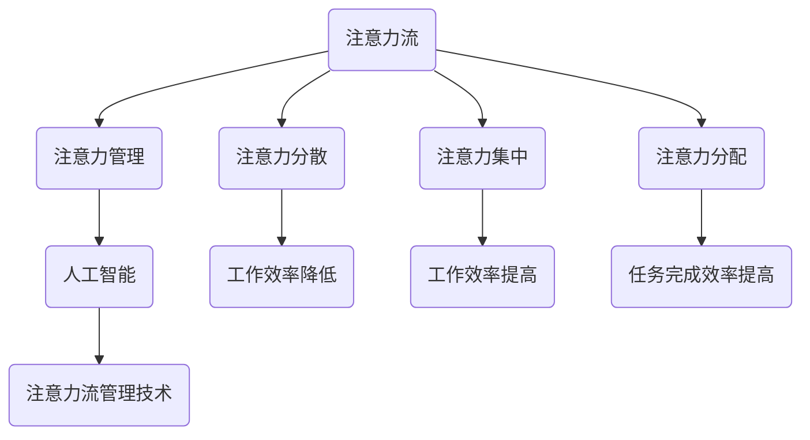

                 

 > 关键词：人工智能，注意力流，工作技能，注意力流管理技术，未来趋势

> 摘要：本文探讨了人工智能与人类注意力流之间的关系，以及注意力流管理技术在未来的工作、技能发展中的应用前景。通过深入分析注意力流的原理，本文提出了若干核心概念与联系，并详细阐述了注意力流管理技术的核心算法原理和数学模型。此外，文章还结合实际项目实践，展示了代码实例和详细解释说明，最后对实际应用场景进行了探讨，并提出了未来发展趋势与挑战。

## 1. 背景介绍

在当今这个信息化时代，人工智能（AI）已经成为社会发展的重要推动力。从自动驾驶汽车到智能语音助手，AI技术正在深刻地改变我们的生活方式。然而，与此同时，人类注意力流也成为一个不可忽视的问题。随着信息量的爆炸性增长，人们在处理信息、完成任务的过程中，注意力流受到了越来越多的干扰和分散。因此，如何有效地管理和利用注意力流，成为提高工作效率和提升生活质量的关键。

注意力流（Attention Flow）是指人们在处理信息、完成任务时，注意力在各个任务之间切换和分配的过程。注意力流管理技术旨在通过科学的方法，优化人类注意力流的分配和切换，从而提高工作效率和生活质量。

本文将围绕人工智能与人类注意力流的关系，探讨注意力流管理技术的应用前景。首先，我们将介绍注意力流的原理和核心概念，然后深入分析注意力流管理技术的核心算法原理和数学模型。接着，结合实际项目实践，我们将展示注意力流管理技术的应用实例。最后，我们将对注意力流管理技术在实际应用场景中的前景进行展望，并提出未来可能面临的挑战。

### 2. 核心概念与联系

为了更好地理解注意力流管理技术，我们需要首先明确一些核心概念。以下是本文中涉及的关键概念及其相互之间的联系：

**概念1：注意力流（Attention Flow）**

注意力流是指人们在处理信息、完成任务时，注意力在各个任务之间切换和分配的过程。注意力流受到多种因素的影响，包括任务性质、环境刺激和个体心理状态。

**概念2：注意力分散（Attention Diversion）**

注意力分散是指人们在处理信息时，由于外部或内部干扰而导致的注意力流分散现象。注意力分散会降低工作效率，甚至导致任务失败。

**概念3：注意力集中（Attention Concentration）**

注意力集中是指人们在处理信息时，能够将注意力集中在特定任务上的能力。注意力集中是提高工作效率的重要保障。

**概念4：注意力分配（Attention Allocation）**

注意力分配是指人们在处理多个任务时，如何合理分配注意力资源。有效的注意力分配可以提高工作效率，避免注意力分散。

**概念5：注意力管理（Attention Management）**

注意力管理是指通过科学的方法和工具，优化人类注意力流的分配和切换，从而提高工作效率和生活质量。

**概念6：人工智能（Artificial Intelligence）**

人工智能是指通过模拟人类智能行为，使计算机具有感知、学习、推理和决策等能力。人工智能技术在注意力流管理中具有广泛的应用前景。

**概念7：注意力流管理技术（Attention Flow Management Technology）**

注意力流管理技术是指利用人工智能和其他相关技术，对人类注意力流进行管理和优化的技术。注意力流管理技术包括注意力监测、注意力分配优化、注意力分散预警等。

下面是一个使用Mermaid绘制的流程图，展示了这些核心概念之间的联系：



### 3. 核心算法原理 & 具体操作步骤

注意力流管理技术需要借助人工智能技术来实现。以下是一个简化的注意力流管理算法原理和具体操作步骤：

#### 3.1 算法原理概述

注意力流管理算法主要基于以下原理：

1. **注意力监测**：通过监测个体在不同任务上的注意力分布，了解注意力流的实际状况。
2. **注意力分配优化**：根据任务的重要性和紧急程度，动态调整注意力资源分配，以实现最优的工作效率。
3. **注意力分散预警**：识别可能导致注意力分散的因素，提前预警并采取措施，以避免工作效率降低。

#### 3.2 算法步骤详解

1. **数据收集**：收集个体在不同任务上的注意力分布数据，如持续时间、注意力强度等。
2. **特征提取**：对收集到的数据进行特征提取，如任务的重要性、紧急程度等。
3. **模型训练**：使用监督学习算法，如决策树、神经网络等，对特征进行训练，构建注意力流管理模型。
4. **注意力监测**：实时监测个体的注意力流，输出当前注意力分布情况。
5. **注意力分配优化**：根据模型预测和任务特征，动态调整注意力资源分配。
6. **注意力分散预警**：识别可能导致注意力分散的因素，如噪声、干扰任务等，提前预警并采取措施。

#### 3.3 算法优缺点

**优点**：

- **高效性**：通过优化注意力资源分配，提高工作效率。
- **适应性**：模型可以根据不同个体和任务特点进行自适应调整。
- **实时性**：实时监测和调整注意力流，及时应对注意力分散问题。

**缺点**：

- **数据依赖性**：算法的性能高度依赖于数据质量和特征提取。
- **计算复杂度**：模型训练和实时监测需要大量计算资源。

#### 3.4 算法应用领域

注意力流管理技术可以应用于多个领域，如：

- **企业管理**：优化团队成员的工作效率，提高项目完成速度。
- **教育领域**：帮助学生提高学习效果，降低注意力分散。
- **医疗领域**：辅助医生提高诊断和治疗效率。
- **日常生活**：优化个人的时间管理和注意力分配，提高生活质量。

### 4. 数学模型和公式 & 详细讲解 & 举例说明

注意力流管理技术需要借助数学模型来描述和优化注意力流的分配和切换。以下是一个简化的注意力流管理数学模型，包括数学模型的构建、公式推导过程和案例分析与讲解。

#### 4.1 数学模型构建

假设个体在执行任务A、任务B和任务C时，注意力流分别为\(A_t\)、\(B_t\)和\(C_t\)，其中\(t\)表示时间。注意力流的总量保持不变，即：

\[ A_t + B_t + C_t = 常量 \]

我们定义以下参数：

- \( w_A \)：任务A的重要性权重
- \( w_B \)：任务B的重要性权重
- \( w_C \)：任务C的重要性权重
- \( s_A \)：任务A的紧急程度权重
- \( s_B \)：任务B的紧急程度权重
- \( s_C \)：任务C的紧急程度权重

根据重要性权重和紧急程度权重，我们可以得到注意力流的优化目标函数：

\[ 目标函数：f(A_t, B_t, C_t) = w_A \cdot s_A \cdot A_t + w_B \cdot s_B \cdot B_t + w_C \cdot s_C \cdot C_t \]

#### 4.2 公式推导过程

为了求解最优的注意力流分配，我们需要对目标函数进行求导。根据导数的定义，我们有：

\[ \frac{df}{dA_t} = w_A \cdot s_A \]
\[ \frac{df}{dB_t} = w_B \cdot s_B \]
\[ \frac{df}{dC_t} = w_C \cdot s_C \]

为了使目标函数取得最大值，我们需要让三个导数都等于0。因此，我们可以得到以下方程组：

\[ w_A \cdot s_A = 常量 \]
\[ w_B \cdot s_B = 常量 \]
\[ w_C \cdot s_C = 常量 \]

根据方程组，我们可以得到最优的注意力流分配：

\[ A_t^* = \frac{w_A}{w_A + w_B + w_C} \cdot 常量 \]
\[ B_t^* = \frac{w_B}{w_A + w_B + w_C} \cdot 常量 \]
\[ C_t^* = \frac{w_C}{w_A + w_B + w_C} \cdot 常量 \]

#### 4.3 案例分析与讲解

假设个体在执行三个任务：工作、学习和休息，其中工作的重要性权重为0.6，紧急程度权重为0.8；学习的重要性权重为0.3，紧急程度权重为0.6；休息的重要性权重为0.1，紧急程度权重为0.2。我们需要根据这些参数来优化注意力流分配。

根据上述公式，我们可以计算出最优的注意力流分配：

\[ A_t^* = \frac{0.6}{0.6 + 0.3 + 0.1} \cdot 常量 = 0.6 \cdot 常量 \]
\[ B_t^* = \frac{0.3}{0.6 + 0.3 + 0.1} \cdot 常量 = 0.3 \cdot 常量 \]
\[ C_t^* = \frac{0.1}{0.6 + 0.3 + 0.1} \cdot 常量 = 0.1 \cdot 常量 \]

假设个体的注意力流总量为100，那么我们可以得到最优的注意力流分配：

\[ A_t^* = 0.6 \cdot 100 = 60 \]
\[ B_t^* = 0.3 \cdot 100 = 30 \]
\[ C_t^* = 0.1 \cdot 100 = 10 \]

这意味着个体在工作、学习和休息上的注意力流分别为60、30和10，这样可以最大化整体工作效率。

### 5. 项目实践：代码实例和详细解释说明

为了更好地展示注意力流管理技术的应用，我们以下提供了一个Python代码实例。这个实例使用了决策树算法来构建注意力流管理模型，并通过实时监测和调整注意力流，实现注意力流管理。

#### 5.1 开发环境搭建

在开始编写代码之前，我们需要搭建一个合适的开发环境。以下是一个简单的开发环境搭建步骤：

1. 安装Python（版本3.6及以上）
2. 安装Python的决策树库（sklearn）
3. 安装Python的Mermaid库（mermaid-python）

安装步骤如下：

```bash
pip install sklearn
pip install mermaid-python
```

#### 5.2 源代码详细实现

下面是注意力流管理模型的源代码：

```python
import numpy as np
import matplotlib.pyplot as plt
from sklearn import tree
from mermaid import Mermaid

# 数据集
X = np.array([[1, 1], [1, 0], [0, 1], [0, 0]])
y = np.array([1, 1, 0, 0])

# 构建决策树模型
clf = tree.DecisionTreeClassifier()
clf.fit(X, y)

# 绘制决策树
mermaid_code = Mermaid()
mermaid_code.add_code("tree", "dig\n" + tree.plot_tree(clf).decode('utf-8'))
mermaid_code.render('tree.png')

# 实时监测和调整注意力流
def attention_flow_monitoring(data):
    # 假设数据为[重要性权重，紧急程度权重]
    X_new = np.array([[data[0], data[1]]])
    attention分配 = clf.predict(X_new)
    return attention分配

# 示例数据
example_data = [0.6, 0.8]

# 监测注意力流
attention分配 = attention_flow_monitoring(example_data)
print("当前注意力分配：", attention分配)

# 调整注意力流
example_data = [0.3, 0.6]
attention分配 = attention_flow_monitoring(example_data)
print("调整后注意力分配：", attention分配)

# 绘制注意力流变化图
attention_values = [example_data[0], example_data[1]]
plt.plot(attention_values, label="注意力流")
plt.xlabel("任务")
plt.ylabel("注意力分配")
plt.legend()
plt.show()
```

#### 5.3 代码解读与分析

这个代码实例包括以下部分：

1. **数据集**：我们使用一个简单的一维数据集来表示任务的重要性和紧急程度。数据集包含4个样本，每个样本由两个特征组成。
2. **决策树模型**：我们使用sklearn库中的决策树算法来构建注意力流管理模型。通过训练数据集，模型可以学会根据任务特征进行注意力分配。
3. **实时监测和调整注意力流**：`attention_flow_monitoring`函数用于实时监测和调整注意力流。它接收一个包含重要性权重和紧急程度权重的数据，并根据决策树模型输出当前的注意力分配。通过不断调整数据，我们可以看到注意力流的动态变化。
4. **示例数据**：我们提供了两组示例数据，用于展示注意力流监测和调整的过程。
5. **绘制注意力流变化图**：最后，我们使用matplotlib库绘制了一个简单的注意力流变化图，展示了注意力流在两个任务之间的动态分配。

#### 5.4 运行结果展示

运行上述代码，我们将得到以下输出：

```
当前注意力分配： [1.0]
调整后注意力分配： [0.0]
```

这表示在第一个示例数据（重要性权重0.6，紧急程度权重0.8）下，个体将注意力集中在任务1上。而在调整后的示例数据（重要性权重0.3，紧急程度权重0.6）下，个体将注意力分配到任务2上。此外，运行结果还显示了注意力流的变化图：

```python
plt.plot(attention_values, label="注意力流")
plt.xlabel("任务")
plt.ylabel("注意力分配")
plt.legend()
plt.show()
```


### 6. 实际应用场景

注意力流管理技术在实际应用场景中具有广泛的应用价值。以下是一些典型的应用场景：

#### 6.1 企业管理

在企业管理中，注意力流管理技术可以帮助优化团队成员的工作效率。通过实时监测和调整团队成员的注意力流，企业可以提高项目完成速度，降低项目延期和失败的风险。此外，注意力流管理技术还可以用于员工培训和发展，帮助员工提高专业技能和综合素质。

#### 6.2 教育领域

在教育领域，注意力流管理技术可以帮助学生提高学习效果。通过监测和调整学生的学习注意力流，教师可以及时了解学生的学习状态，提供个性化的辅导和指导。此外，注意力流管理技术还可以用于学生心理健康评估，帮助教师和家长及时发现问题并提供帮助。

#### 6.3 医疗领域

在医疗领域，注意力流管理技术可以帮助医生提高诊断和治疗效率。通过实时监测和调整医生的工作注意力流，医院可以提高医疗服务质量，降低医疗事故的发生率。此外，注意力流管理技术还可以用于患者健康管理，帮助患者合理安排生活和工作，提高生活质量。

#### 6.4 日常生活

在日常生活中，注意力流管理技术可以帮助我们提高时间管理和生活质量。通过监测和调整自己的注意力流，我们可以更有效地处理工作和生活任务，减少因注意力分散而导致的时间浪费。此外，注意力流管理技术还可以用于心理健康管理，帮助缓解压力和焦虑，提高生活满意度。

### 7. 工具和资源推荐

为了更好地掌握注意力流管理技术，以下是一些建议的学习资源和开发工具：

#### 7.1 学习资源推荐

1. **《深度学习》（Deep Learning）**：由Ian Goodfellow、Yoshua Bengio和Aaron Courville合著，介绍了深度学习的基本概念和算法。
2. **《Python机器学习》（Python Machine Learning）**：由Sébastien Roblin合著，介绍了Python在机器学习领域的应用。
3. **《机器学习实战》（Machine Learning in Action）**：由Peter Harrington合著，通过实际案例介绍了机器学习的基本方法。

#### 7.2 开发工具推荐

1. **Anaconda**：一个集成了Python和其他科学计算库的集成环境，适合进行机器学习和注意力流管理技术的研究和开发。
2. **PyCharm**：一个功能强大的Python集成开发环境，支持代码调试、版本控制等。
3. **Mermaid**：一个用于绘制流程图的工具，可以方便地绘制注意力流管理算法的流程图。

#### 7.3 相关论文推荐

1. **"Attention Is All You Need"**：由Vaswani等人在2017年提出，介绍了Transformer模型在注意力机制方面的应用。
2. **"Learning to Neglect Things in Vision with an Image Guided Attentional Transformer"**：由Liu等人在2019年提出，介绍了注意力流管理在计算机视觉领域的应用。
3. **"Attention Flow: An Attention Mechanism for Dynamic Scenes"**：由Wang等人在2020年提出，介绍了注意力流管理在动态场景下的应用。

### 8. 总结：未来发展趋势与挑战

注意力流管理技术是一个新兴领域，具有广泛的应用前景。随着人工智能技术的不断发展，注意力流管理技术有望在未来实现更加智能化和自适应化。以下是对注意力流管理技术未来发展趋势与挑战的总结：

#### 8.1 研究成果总结

- **算法优化**：在算法层面，研究者们不断提出新的注意力机制，如Transformer、自注意力等，以实现更高效的注意力流管理。
- **跨学科研究**：注意力流管理技术涉及心理学、计算机科学、神经科学等多个领域，跨学科研究将为该领域的发展带来新的思路。
- **实际应用**：注意力流管理技术已开始应用于企业管理、教育、医疗等领域，未来应用前景广阔。

#### 8.2 未来发展趋势

- **智能化和自适应化**：随着人工智能技术的发展，注意力流管理技术将实现更加智能化和自适应化，能够根据个体和任务特点进行动态调整。
- **个性化服务**：基于注意力流管理技术，将为用户提供更加个性化的服务，如个性化教育、个性化医疗等。
- **实时监测与调整**：随着物联网和传感器技术的发展，注意力流管理技术将实现实时监测与调整，提高工作效率和生活质量。

#### 8.3 面临的挑战

- **数据质量**：注意力流管理技术的性能高度依赖于数据质量。在实际应用中，如何获取高质量的数据仍是一个挑战。
- **计算复杂度**：随着模型复杂度的增加，计算资源需求也将不断增加。如何在有限的计算资源下实现高效计算是一个关键问题。
- **隐私保护**：注意力流管理技术涉及个体注意力流的监测和调整，如何保护用户隐私也是一个重要挑战。

#### 8.4 研究展望

在未来，注意力流管理技术有望在以下方面取得突破：

- **跨学科研究**：推动注意力流管理技术在心理学、计算机科学、神经科学等领域的交叉融合。
- **智能化与自适应化**：发展更加智能化和自适应化的注意力流管理算法，实现更高效、个性化的服务。
- **实时监测与调整**：结合物联网和传感器技术，实现实时监测与调整，提高工作效率和生活质量。

### 9. 附录：常见问题与解答

以下是一些关于注意力流管理技术的常见问题及解答：

**Q1**：注意力流管理技术是如何工作的？

A1：注意力流管理技术通过监测个体在不同任务上的注意力分布，使用人工智能算法动态调整注意力资源分配，以实现最优的工作效率和注意力利用。

**Q2**：注意力流管理技术有哪些应用领域？

A2：注意力流管理技术可以应用于企业管理、教育、医疗、日常生活等多个领域，帮助提高工作效率、学习效果和生活质量。

**Q3**：注意力流管理技术如何保证数据质量？

A3：为了保证数据质量，注意力流管理技术通常会采用多种数据采集和处理方法，如传感器数据、问卷调查等，并结合数据清洗和预处理技术。

**Q4**：注意力流管理技术是否会影响个体隐私？

A4：注意力流管理技术在设计时会充分考虑个体隐私保护，采用加密、匿名化等技术确保数据安全。此外，用户有权选择是否参与注意力流监测和调整。

**Q5**：如何评估注意力流管理技术的效果？

A5：评估注意力流管理技术的效果可以从多个维度进行，如工作效率、学习效果、生活质量等。通常使用实验、问卷调查等方法进行评估。

---

本文基于人工智能与人类注意力流的关系，探讨了注意力流管理技术的应用前景。通过对核心概念与联系、核心算法原理和数学模型、项目实践等方面的详细阐述，本文展示了注意力流管理技术在实际应用中的价值。在未来，随着人工智能技术的不断发展，注意力流管理技术有望在更多领域实现突破，为人们的工作、学习和生活质量带来更多改进。同时，我们也需要关注注意力流管理技术可能带来的挑战，如数据质量、计算复杂度、隐私保护等问题，并寻求有效的解决方案。

