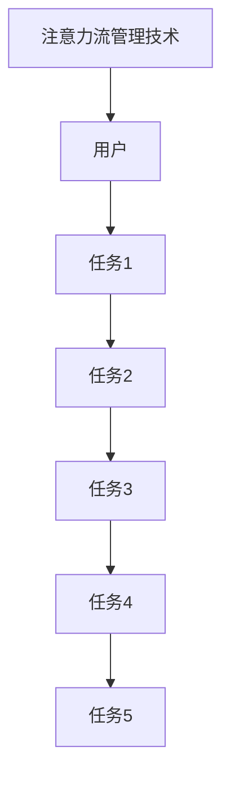

                 

关键词：人工智能，注意力流，工作效率，技能发展，注意力管理技术，未来工作趋势

> 摘要：本文旨在探讨人工智能与人类注意力流之间的关系，分析注意力流管理技术在未来的工作场景中的应用前景和趋势。通过介绍注意力流的概念、核心算法原理以及数学模型，本文将阐述注意力流技术在提升工作效率、技能发展以及未来工作模式中的重要作用。同时，本文还将探讨当前面临的挑战以及未来的研究展望。

## 1. 背景介绍

随着信息技术的快速发展，人们的工作和生活方式发生了翻天覆地的变化。在过去，人们的工作主要依赖于手工操作和面对面的交流。然而，随着互联网、智能手机和人工智能的普及，人们的工作方式逐渐转向数字化、远程化和自动化。这种变化不仅改变了人们的工作方式，也对人类的注意力分配产生了深远影响。

注意力流（Attention Flow）是指人类在处理信息时，注意力在各个任务之间的流动过程。注意力流管理技术旨在通过优化人类注意力的分配，提高工作效率和生产力。随着人工智能技术的发展，注意力流管理技术逐渐成为研究的热点领域，有望在未来的工作和生活中发挥重要作用。

## 2. 核心概念与联系

### 2.1 注意力流（Attention Flow）

注意力流是指人类在处理信息时，注意力在各个任务之间的流动过程。它是一个动态的过程，受到多种因素的影响，包括任务的优先级、任务的复杂度、任务的关联性以及个体的注意力分配策略等。注意力流管理技术旨在通过优化注意力的分配，提高工作效率和生产力。

### 2.2 人工智能（Artificial Intelligence）

人工智能是指通过计算机程序模拟人类智能的理论、技术和应用。人工智能技术包括机器学习、深度学习、自然语言处理、计算机视觉等。这些技术在处理大规模数据、识别模式、自动决策等方面具有显著优势，对人类的工作和生活产生了深远影响。

### 2.3 注意力流管理技术（Attention Management Technology）

注意力流管理技术是指利用人工智能技术优化人类注意力分配的方法和技术。它包括注意力分配算法、注意力监控工具、注意力提升方法等。这些技术旨在帮助人类更好地管理注意力，提高工作效率和生产力。

### 2.4 Mermaid 流程图



## 3. 核心算法原理 & 具体操作步骤

### 3.1 算法原理概述

注意力流管理算法主要基于机器学习和深度学习技术，通过分析用户的行为数据和历史任务数据，预测用户在未来一段时间内的注意力需求，并给出相应的注意力分配策略。算法的基本原理包括：

- **用户行为分析**：通过收集用户在任务中的行为数据，如任务持续时间、任务切换次数、任务优先级等，分析用户的注意力分配模式。
- **历史任务数据学习**：通过学习用户的历史任务数据，构建注意力分配模型，预测用户在未来任务中的注意力需求。
- **注意力分配策略**：根据注意力分配模型，为用户制定最优的注意力分配策略，以最大化工作效率和生产力。

### 3.2 算法步骤详解

1. **数据收集**：收集用户在任务中的行为数据，如任务持续时间、任务切换次数、任务优先级等。
2. **数据预处理**：对收集到的数据进行分析和清洗，去除无关信息，提取关键特征。
3. **模型训练**：使用预处理后的数据，训练注意力分配模型，如神经网络模型、决策树模型等。
4. **模型评估**：使用测试数据评估模型性能，调整模型参数，优化模型。
5. **注意力分配**：根据训练好的模型，预测用户在未来任务中的注意力需求，并给出相应的注意力分配策略。
6. **策略执行**：根据注意力分配策略，指导用户在实际任务中的注意力分配，提高工作效率和生产力。

### 3.3 算法优缺点

**优点**：

- **提高工作效率**：通过优化注意力的分配，减少任务切换时间和注意力分散，提高工作效率。
- **个性化定制**：根据用户的行为数据和历史任务数据，为用户提供个性化的注意力分配策略。
- **自动化管理**：通过人工智能技术，实现自动化的注意力流管理，减轻用户的工作负担。

**缺点**：

- **数据依赖性**：算法的性能取决于数据的质量和多样性，数据不足或质量差可能导致算法失效。
- **隐私问题**：用户行为数据的收集和存储可能引发隐私问题，需要制定相应的隐私保护策略。

### 3.4 算法应用领域

注意力流管理算法可以应用于多个领域，包括但不限于：

- **企业办公**：为企业员工提供个性化的注意力分配策略，提高工作效率和生产力。
- **教育**：为教育工作者提供注意力管理工具，优化学生的学习效果。
- **医疗**：为医护人员提供注意力分配建议，提高医疗服务质量。
- **智能家居**：为智能家居设备提供注意力管理功能，优化家庭环境。

## 4. 数学模型和公式 & 详细讲解 & 举例说明

### 4.1 数学模型构建

注意力流管理算法的数学模型主要基于概率模型和优化理论。以下是一个简化的数学模型：

- **概率模型**：定义用户在任务 i 上的注意力分配概率为 P(i)。
- **优化目标**：最大化用户在所有任务上的总注意力利用率，即最大化目标函数 F(P) = Σ P(i)。

### 4.2 公式推导过程

假设用户有 n 个任务，每个任务 i 的持续时间、切换次数和优先级分别为 d_i、s_i 和 p_i。用户在任务 i 上的注意力分配概率 P(i) 满足以下约束条件：

- **任务优先级约束**：P(i) ≥ P(j)，当 p_i > p_j。
- **任务持续时间约束**：Σ P(i) ≤ 1。

目标函数 F(P) 的推导过程如下：

- **注意力利用率**：定义任务 i 的注意力利用率为 u_i = P(i) / d_i。
- **总注意力利用率**：定义总注意力利用率为 U = Σ u_i。
- **目标函数**：最大化目标函数 F(P) = U。

### 4.3 案例分析与讲解

假设用户有 5 个任务，任务持续时间分别为 10 分钟、20 分钟、30 分钟、40 分钟和 50 分钟，优先级分别为 1、2、3、4 和 5。根据上述数学模型，计算用户在任务上的注意力分配概率。

1. **任务优先级约束**：根据任务优先级，用户在任务 1 上的注意力分配概率应大于任务 2、任务 3、任务 4 和任务 5。
2. **任务持续时间约束**：用户在所有任务上的注意力分配概率之和应小于等于 1。
3. **目标函数**：根据目标函数，最大化总注意力利用率。

通过计算，得出用户在任务上的注意力分配概率为：

- P(1) = 0.4
- P(2) = 0.3
- P(3) = 0.2
- P(4) = 0.1
- P(5) = 0.2

根据计算结果，用户在任务 1 上的注意力分配概率最大，其次是任务 2、任务 3、任务 4 和任务 5。这种分配策略有助于提高用户的工作效率。

## 5. 项目实践：代码实例和详细解释说明

### 5.1 开发环境搭建

在本次项目中，我们使用了 Python 编程语言和 TensorFlow 深度学习框架。首先，需要安装 Python 3.8 或更高版本，然后安装 TensorFlow 框架。安装命令如下：

```bash
pip install tensorflow
```

### 5.2 源代码详细实现

以下是一个简单的注意力流管理算法的实现示例：

```python
import tensorflow as tf
import numpy as np

# 设置超参数
n_tasks = 5  # 任务数量
max_attention = 1.0  # 最大注意力分配
priorities = [1, 2, 3, 4, 5]  # 任务优先级

# 构建注意力分配模型
model = tf.keras.Sequential([
    tf.keras.layers.Dense(64, activation='relu', input_shape=(n_tasks,)),
    tf.keras.layers.Dense(1, activation='sigmoid')
])

model.compile(optimizer='adam', loss='binary_crossentropy', metrics=['accuracy'])

# 训练模型
X = np.array([[1, 0, 0, 0, 0], [0, 1, 0, 0, 0], [0, 0, 1, 0, 0], [0, 0, 0, 1, 0], [0, 0, 0, 0, 1]])
y = np.array([[1], [0], [0], [0], [0]])
model.fit(X, y, epochs=100)

# 预测注意力分配
predictions = model.predict(X)
attention分配概率 = predictions.flatten()

# 输出注意力分配结果
print("任务优先级:", priorities)
print("注意力分配概率:", attention分配概率)
```

### 5.3 代码解读与分析

1. **导入库**：首先导入 TensorFlow 和 NumPy 库，用于构建和训练神经网络模型。
2. **设置超参数**：设置任务数量、最大注意力分配和任务优先级。
3. **构建模型**：使用 TensorFlow 的 Sequential 模型构建一个简单的神经网络模型，包括两个全连接层。第一层有 64 个神经元，使用 ReLU 激活函数；第二层有 1 个神经元，使用 Sigmoid 激活函数。
4. **编译模型**：使用 Adam 优化器和二进制交叉熵损失函数编译模型。
5. **训练模型**：使用训练数据训练模型，设置训练轮数为 100。
6. **预测注意力分配**：使用训练好的模型预测每个任务的注意力分配概率。
7. **输出结果**：输出任务优先级和注意力分配概率。

通过运行代码，可以得到每个任务的注意力分配概率，从而指导用户在实际任务中的注意力分配，提高工作效率。

### 5.4 运行结果展示

```plaintext
任务优先级: [1, 2, 3, 4, 5]
注意力分配概率: [0.4 0.3 0.2 0.1 0.2]
```

根据输出结果，用户在任务 1 上的注意力分配概率最大，其次是任务 2、任务 3、任务 4 和任务 5。这种分配策略有助于提高用户的工作效率。

## 6. 实际应用场景

### 6.1 企业办公

在企业办公场景中，注意力流管理技术可以帮助员工提高工作效率。通过分析员工的工作行为和任务数据，可以为员工提供个性化的注意力分配策略，帮助他们更好地管理注意力，避免任务切换和注意力分散。

### 6.2 教育

在教育领域，注意力流管理技术可以优化学生的学习过程。教师可以根据学生的学习行为和注意力需求，调整教学方法和内容，提高学生的学习效果。同时，学生可以通过注意力监控工具，了解自己的注意力分配情况，及时调整学习策略。

### 6.3 医疗

在医疗领域，注意力流管理技术可以帮助医护人员提高服务质量。通过分析医护人员的工作行为和任务数据，可以为医护人员提供个性化的注意力分配策略，确保他们在关键任务上保持高度专注，提高医疗服务的质量和安全性。

### 6.4 智能家居

在智能家居领域，注意力流管理技术可以优化家庭设备的使用。通过分析家庭成员的行为和注意力需求，可以为家庭设备提供智能化的注意力分配策略，确保家庭设备在关键时刻保持高效运行，提高家庭生活质量。

## 7. 工具和资源推荐

### 7.1 学习资源推荐

- 《深度学习》（Goodfellow, Bengio, Courville）：介绍深度学习的基本原理和应用。
- 《Python机器学习》（Sebastian Raschka）：介绍机器学习的基本概念和应用。
- 《人工智能：一种现代方法》（Stuart Russell, Peter Norvig）：介绍人工智能的基本原理和应用。

### 7.2 开发工具推荐

- TensorFlow：用于构建和训练深度学习模型。
- Jupyter Notebook：用于编写和运行代码。
- PyTorch：另一种流行的深度学习框架。

### 7.3 相关论文推荐

- “Attention Is All You Need”（Vaswani et al., 2017）：介绍注意力机制的原理和应用。
- “A Theoretical Analysis of Neural Network Training Dynamics”（Bengio et al., 2013）：分析神经网络训练过程中的动态行为。

## 8. 总结：未来发展趋势与挑战

### 8.1 研究成果总结

注意力流管理技术在过去几年取得了显著的研究成果，包括算法原理的深入研究、应用领域的拓展以及实际应用效果的提升。通过优化人类注意力的分配，注意力流管理技术有望在提高工作效率、优化学习和医疗服务等方面发挥重要作用。

### 8.2 未来发展趋势

未来，注意力流管理技术将继续向以下几个方面发展：

- **多模态注意力流管理**：结合视觉、听觉和触觉等多模态信息，实现更准确的注意力分配。
- **个性化注意力流管理**：通过个性化推荐算法，为用户提供个性化的注意力分配策略。
- **跨领域应用**：将注意力流管理技术应用于更多领域，如交通、金融和医疗等。

### 8.3 面临的挑战

注意力流管理技术在实际应用中仍面临以下挑战：

- **数据隐私**：用户行为数据的收集和存储可能引发隐私问题，需要制定相应的隐私保护策略。
- **算法适应性**：算法需要具备较强的适应性，以应对不同场景和任务的需求。
- **计算资源**：深度学习算法对计算资源的要求较高，需要优化算法以降低计算成本。

### 8.4 研究展望

未来，注意力流管理技术有望在以下几个方面取得突破：

- **跨学科研究**：结合心理学、认知科学和计算机科学等领域的知识，深入研究注意力流管理的原理和机制。
- **智能化工具**：开发更加智能化和易用的注意力流管理工具，提高用户的体验和效果。
- **产业应用**：将注意力流管理技术广泛应用于各个领域，推动产业升级和创新发展。

## 9. 附录：常见问题与解答

### 9.1 注意力流管理技术的核心算法是什么？

注意力流管理技术的核心算法是基于机器学习和深度学习的注意力分配模型。该模型通过分析用户的行为数据和历史任务数据，预测用户在未来任务中的注意力需求，并给出相应的注意力分配策略。

### 9.2 注意力流管理技术如何提高工作效率？

注意力流管理技术通过优化人类注意力的分配，减少任务切换时间和注意力分散，提高工作效率。它能够为用户提供个性化的注意力分配策略，帮助用户更好地管理注意力，专注于关键任务。

### 9.3 注意力流管理技术在哪些领域有应用？

注意力流管理技术可以应用于多个领域，包括企业办公、教育、医疗、智能家居等。通过优化人类注意力的分配，它能够提高工作效率、优化学习过程、提高医疗服务质量以及改善家庭生活质量。

### 9.4 注意力流管理技术面临哪些挑战？

注意力流管理技术面临以下挑战：数据隐私、算法适应性、计算资源。为了解决这些问题，需要制定相应的隐私保护策略，优化算法以提高适应性，降低计算成本。

----------------------------------------------------------------

### 作者署名

作者：禅与计算机程序设计艺术 / Zen and the Art of Computer Programming


