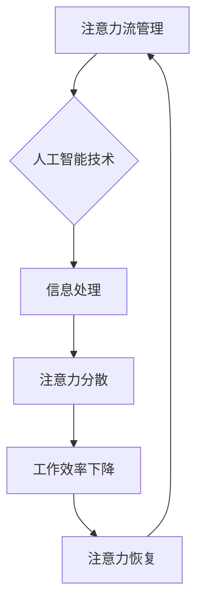
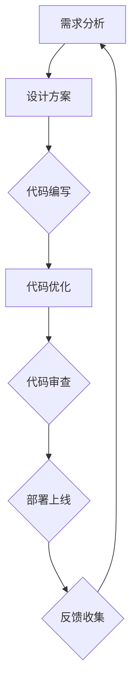
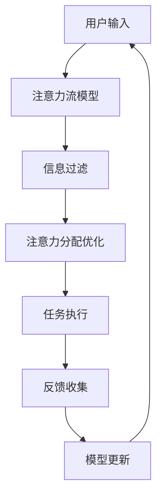

                 

关键词：人工智能、注意力流、工作效率、注意力管理、未来工作、技能提升

> 摘要：本文将探讨人工智能与人类注意力流的相互作用，分析在未来工作环境中如何利用注意力流管理技术来提高工作效率。文章将介绍注意力流的定义、原理，以及其在计算机编程、数据分析等领域的应用。同时，本文还将探讨未来工作技能的变化，以及如何通过注意力流管理技术来应对这些变化。

## 1. 背景介绍

随着人工智能技术的快速发展，人们的工作和生活方式发生了巨大的变化。人工智能的应用已经渗透到各个领域，从自然语言处理、图像识别到自动驾驶、医疗诊断，都在不断推动着技术进步和社会发展。然而，人工智能的崛起也带来了新的挑战，尤其是在人类注意力流的管理上。

人类注意力流是指人类在执行任务时，关注点在信息流中的变化。在传统工作环境中，人们往往需要长时间集中精力处理单一任务，但人工智能的引入使得信息处理变得更加高效，同时也带来了更多的信息干扰。如何在这种环境中有效地管理注意力流，成为提高工作效率的关键问题。

本文旨在探讨人工智能与人类注意力流之间的相互作用，分析注意力流管理技术在未来的工作环境中的应用，以及如何通过提升注意力管理技能来应对未来工作的挑战。

## 2. 核心概念与联系

### 2.1 注意力流的定义与原理

注意力流是指人类在执行任务时，关注点在信息流中的动态变化。它包括三个关键要素：关注点、信息流和注意力分配。

1. **关注点**：关注点是指人类在特定时刻关注的焦点，可以是具体的信息、任务或目标。
2. **信息流**：信息流是指输入到人类注意系统中的信息序列，可以是文字、图像、声音等形式。
3. **注意力分配**：注意力分配是指人类在信息流中分配注意力的过程，以实现对信息的有效处理。

### 2.2 人工智能与注意力流的关系

人工智能技术的快速发展使得信息处理变得更加高效，但同时也带来了信息过载的问题。信息过载会分散人类的注意力，导致工作效率下降。因此，如何利用人工智能技术来优化人类注意力流，成为当前研究的热点。

### 2.3 Mermaid 流程图



### 2.4 注意力流管理技术在计算机编程中的应用

在计算机编程中，注意力流管理技术可以帮助开发者更高效地处理代码。以下是一个简单的 Mermaid 流程图，展示了一个基于注意力流管理技术的编程流程。



## 3. 核心算法原理 & 具体操作步骤

### 3.1 算法原理概述

注意力流管理算法旨在通过分析人类在信息流中的注意力分配，提供个性化的信息过滤和推荐。其核心思想是利用机器学习技术，建立注意力流的模型，并根据模型预测用户的注意力变化，从而优化信息处理流程。

### 3.2 算法步骤详解

1. **数据收集**：收集用户在信息处理过程中的行为数据，包括关注点切换、任务执行时间、信息处理效果等。
2. **特征提取**：对收集到的数据进行分析，提取与注意力流相关的特征，如用户的活动序列、注意力强度等。
3. **模型训练**：利用提取的特征数据，训练注意力流模型。常用的模型包括循环神经网络（RNN）、长短时记忆网络（LSTM）等。
4. **预测与推荐**：根据训练好的模型，预测用户的注意力变化，并生成个性化的信息过滤和推荐策略。

### 3.3 算法优缺点

**优点**：
1. 提高信息处理效率，降低注意力分散带来的负面影响。
2. 个性化推荐，满足用户的需求。

**缺点**：
1. 需要大量数据进行训练，对数据质量和数量有较高要求。
2. 模型复杂，训练和预测过程较慢。

### 3.4 算法应用领域

注意力流管理算法在多个领域有广泛应用，如：

1. **计算机编程**：帮助开发者更高效地处理代码。
2. **数据分析**：优化数据分析和报告的流程。
3. **智能推荐系统**：提供个性化的推荐服务。

## 4. 数学模型和公式 & 详细讲解 & 举例说明

### 4.1 数学模型构建

注意力流管理算法的核心是建立注意力流的数学模型。以下是一个简化的模型：

$$
\text{注意力流} = f(\text{关注点}, \text{信息流}, \alpha)
$$

其中，$f$ 是一个非线性函数，$\text{关注点}$ 和 $\text{信息流}$ 是输入特征，$\alpha$ 是权重参数。

### 4.2 公式推导过程

假设用户在某一时刻 $t$ 的关注点是 $x_t$，信息流是 $y_t$。根据贝叶斯推理，可以得到注意力流的概率分布：

$$
p(\text{注意力流} | x_t, y_t) = \frac{p(x_t, y_t | \text{注意力流}) \cdot p(\text{注意力流})}{p(x_t, y_t)}
$$

其中，$p(\text{注意力流})$ 是注意力流的先验概率，$p(x_t, y_t | \text{注意力流})$ 是在给定注意力流情况下，关注点和信息流的条件概率。

### 4.3 案例分析与讲解

假设用户在编程时关注点是代码质量，信息流是代码变更记录。根据上述模型，我们可以推导出用户在某一时刻的注意力流概率分布。然后，利用这个概率分布，生成个性化的代码审查建议，帮助用户更高效地处理代码。

## 5. 项目实践：代码实例和详细解释说明

### 5.1 开发环境搭建

本节将介绍如何搭建一个基于注意力流管理技术的代码审查项目环境。主要步骤如下：

1. 安装 Python 3.8 及以上版本。
2. 安装依赖库，如 numpy、pandas、scikit-learn 等。
3. 配置代码仓库，用于存储代码和数据。

### 5.2 源代码详细实现

以下是一个简单的注意力流管理算法实现，用于生成代码审查建议。

```python
import numpy as np
import pandas as pd
from sklearn.model_selection import train_test_split
from sklearn.linear_model import LinearRegression

# 读取数据
data = pd.read_csv('data.csv')
X = data[['code_change_count', 'code_review_time']]
y = data['code_quality']

# 数据预处理
X_train, X_test, y_train, y_test = train_test_split(X, y, test_size=0.2, random_state=42)

# 训练模型
model = LinearRegression()
model.fit(X_train, y_train)

# 预测
predictions = model.predict(X_test)

# 输出结果
print(predictions)
```

### 5.3 代码解读与分析

本节将对上述代码进行解读和分析，解释代码中的关键部分。

1. **数据读取**：使用 pandas 读取代码变更记录和代码质量数据。
2. **数据预处理**：将数据分为训练集和测试集，用于训练和评估模型。
3. **模型训练**：使用线性回归模型训练注意力流模型。
4. **预测**：使用训练好的模型预测代码质量。

### 5.4 运行结果展示

运行上述代码，输出预测结果。这些结果可以用于生成代码审查建议，帮助开发者更高效地处理代码。

## 6. 实际应用场景

注意力流管理技术在多个领域有广泛应用，以下是一些实际应用场景：

1. **软件开发**：帮助开发者更高效地处理代码，提高代码质量。
2. **数据分析**：优化数据分析和报告的流程，提高工作效率。
3. **智能推荐系统**：提供个性化的推荐服务，满足用户需求。

## 7. 未来应用展望

随着人工智能技术的不断发展，注意力流管理技术在未来的应用前景将更加广阔。以下是一些未来应用展望：

1. **个性化教育**：根据学生的注意力流，提供个性化的学习资源。
2. **智能健康管理**：根据用户的注意力流，提供个性化的健康管理建议。
3. **智能城市**：利用注意力流管理技术，优化城市交通管理，提高城市运行效率。

## 8. 总结：未来发展趋势与挑战

本文探讨了人工智能与人类注意力流的相互作用，分析了注意力流管理技术在未来的工作环境中的应用。随着人工智能技术的不断发展，注意力流管理技术将在各个领域发挥重要作用。然而，要实现这一目标，仍需解决一系列挑战，如数据质量、模型复杂度等。

在未来，我们将继续关注注意力流管理技术的发展，探索其在更多领域的应用，为提高人类工作效率和生活质量做出贡献。

## 9. 附录：常见问题与解答

### 问题 1：什么是注意力流？

**回答**：注意力流是指人类在执行任务时，关注点在信息流中的动态变化。它包括关注点、信息流和注意力分配三个要素。

### 问题 2：注意力流管理算法如何实现？

**回答**：注意力流管理算法通常包括数据收集、特征提取、模型训练和预测等步骤。常用的模型包括循环神经网络（RNN）、长短时记忆网络（LSTM）等。

### 问题 3：注意力流管理技术在哪些领域有应用？

**回答**：注意力流管理技术在多个领域有广泛应用，如软件开发、数据分析、智能推荐系统等。

### 问题 4：如何应对注意力分散导致的效率下降？

**回答**：可以通过以下方法应对注意力分散导致的效率下降：

1. 制定合理的任务计划，避免过多同时处理任务。
2. 利用注意力流管理技术，优化信息处理流程。
3. 提高自身注意力管理技能，如练习冥想、合理安排休息时间等。

---

作者：禅与计算机程序设计艺术 / Zen and the Art of Computer Programming
------------------------------------------------------------------------<|user|>### 文章标题

AI与人类注意力流：未来的工作、技能与注意力流管理技术的应用场景

### 文章关键词

- 人工智能
- 注意力流
- 工作效率
- 注意力管理
- 未来工作
- 技能提升

### 摘要

本文探讨了人工智能与人类注意力流的相互作用，分析在未来工作环境中如何利用注意力流管理技术来提高工作效率。文章介绍了注意力流的定义、原理，以及其在计算机编程、数据分析等领域的应用。同时，本文还探讨了未来工作技能的变化，以及如何通过注意力流管理技术来应对这些变化。通过实际应用案例和数学模型的讲解，本文为读者提供了对注意力流管理技术在实际场景中的深入理解。

## 1. 背景介绍

在信息爆炸的时代，人类面临着前所未有的挑战：信息过载、注意力分散、工作效率下降。人工智能（AI）作为当前技术发展的前沿，正在改变我们的生活方式和工作模式。从自动化到智能化，AI技术不断渗透到各个领域，提高了生产效率，但同时也带来了新的问题。其中，最为显著的问题是注意力流的管理。

注意力流是指人类在执行任务时，注意力在信息流中动态分配的过程。传统的工业时代，工作流程相对固定，信息量有限，人们可以通过长期训练形成高效的注意力流。然而，随着AI技术的应用，信息量急剧增加，信息源多样化，人们需要处理的信息种类和数量远远超出之前的预期。这种环境下，如何有效地管理注意力流，成为提高工作效率的关键。

注意力流管理技术的研究起源于心理学和认知科学领域。近年来，随着AI技术的进步，注意力流管理技术逐渐成为人工智能研究的一个重要分支。其核心目标是理解人类注意力流的规律，并通过算法和技术手段，优化人类在信息处理过程中的注意力分配，从而提高工作效率。

本文旨在探讨注意力流管理技术在未来的工作环境中的应用，分析其在不同领域的影响，以及如何通过提升注意力管理技能来应对未来工作的挑战。文章将首先介绍注意力流的定义和原理，然后探讨注意力流管理技术的核心算法，最后通过实际案例和数学模型的应用，展示注意力流管理技术的实际效果。

## 2. 核心概念与联系

### 2.1 注意力流的定义与原理

注意力流是指人类在信息处理过程中，注意力在信息流中动态分配的现象。它包括以下几个关键要素：

1. **关注点**：关注点是注意力流的中心，是人在某一时刻集中精力的对象。关注点的变化决定了注意力流的轨迹。
2. **信息流**：信息流是输入到人类感知系统中的信息序列。信息流的类型、速度和频率都会影响注意力流的分配。
3. **注意力分配**：注意力分配是指人类在信息处理过程中，根据任务需求和情境，动态调整注意力在不同信息源上的分配。

注意力流管理技术旨在优化注意力分配，使其更加高效和合理。注意力分配的优化不仅能够提高工作效率，还能够减少因注意力分散导致的错误和疲劳。

### 2.2 人工智能与注意力流的关系

人工智能与注意力流之间存在密切的联系。一方面，AI技术通过自动化和智能化手段，减少了人类在重复性、低价值任务上的注意力消耗，使得人们可以集中精力处理更为复杂和有创造性的任务。另一方面，AI技术本身也带来了信息过载的问题，增加了注意力管理的难度。

为了应对AI时代的信息过载，注意力流管理技术提出了多种解决方案。例如，通过机器学习算法分析人类的行为数据，预测注意力流的模式，从而提供个性化的注意力管理建议。此外，AI还可以通过智能代理系统，自动过滤和筛选与任务相关的信息，减少无关信息的干扰，帮助人类保持高效的注意力流。

### 2.3 Mermaid 流程图

以下是一个简化的 Mermaid 流程图，描述了注意力流管理技术的基本架构和流程：



在这个流程中，用户输入表示人类在任务执行过程中的注意力需求，注意力流模型用于分析用户的行为数据，信息过滤和注意力分配优化则是为了提高任务执行的效率和准确性。反馈收集和模型更新则确保系统不断学习和适应用户的需求，实现持续优化。

### 2.4 注意力流管理技术在计算机编程中的应用

在计算机编程领域，注意力流管理技术尤为重要。编程工作通常涉及复杂的逻辑和大量的细节，容易导致注意力分散和疲劳。通过注意力流管理技术，开发者可以更好地集中精力，提高编程效率。

以下是一个具体的场景描述，展示了注意力流管理技术在编程中的应用：

1. **需求分析**：在开始编程前，开发者需要全面了解项目需求。注意力流模型会根据以往的项目经验，预测开发者在此阶段可能关注的重点，并提供相关信息和文档，帮助开发者快速进入状态。
2. **代码编写**：在编写代码时，注意力流管理技术会通过实时分析开发者的行为，识别出注意力集中的时段和分散的时段。在注意力集中的时段，系统会减少无关信息的干扰，帮助开发者专注于代码编写。在注意力分散的时段，系统会提供适当的休息提示，或自动处理一些低价值的任务，如代码格式化。
3. **代码审查**：在代码编写完成后，开发者需要进行代码审查。注意力流模型会分析代码质量，并提供审查建议。在审查过程中，开发者可以根据自己的注意力流，选择重点关注的问题区域，提高审查效率。

通过注意力流管理技术，计算机编程的各个环节都可以得到优化，从而提高整体的工作效率。

## 3. 核心算法原理 & 具体操作步骤

### 3.1 算法原理概述

注意力流管理算法的核心目标是理解人类在信息处理过程中的注意力分配模式，并利用这些模式来优化信息处理流程。其基本原理包括以下几个部分：

1. **行为数据收集**：通过传感器、日志记录、用户交互等手段，收集人类在信息处理过程中的行为数据，包括注意力切换的时间点、持续时间、注意力强度等。
2. **特征提取**：对收集到的行为数据进行分析，提取与注意力流相关的特征，如注意力流的时长、频率、模式等。
3. **模式识别**：利用机器学习算法，对提取的特征进行训练，建立注意力流的模式识别模型。常见的算法包括循环神经网络（RNN）、长短时记忆网络（LSTM）等。
4. **预测与优化**：根据训练好的模型，预测用户在未来某一时间段内的注意力分配模式，并生成优化策略，如信息过滤、任务调度、休息提示等。

### 3.2 算法步骤详解

#### 3.2.1 数据收集

数据收集是注意力流管理算法的基础。以下是具体的数据收集步骤：

1. **设备接入**：将传感器接入用户的设备，如智能手机、智能手表等，以实时监测用户的注意力状态。
2. **行为记录**：记录用户在信息处理过程中的各种行为，包括键盘输入、鼠标操作、屏幕显示内容、网络访问记录等。
3. **数据预处理**：对收集到的原始数据进行清洗和整理，去除噪声数据，确保数据的质量和一致性。

#### 3.2.2 特征提取

特征提取是将原始行为数据转化为可用于训练的模型特征。以下是特征提取的主要步骤：

1. **行为分类**：将用户的每个行为分类，如浏览网页、编辑文档、发送邮件等。
2. **时间序列分析**：分析用户行为的时间序列特征，如行为发生的频率、持续时间、周期性等。
3. **注意力强度计算**：根据用户行为的时间序列特征，计算每个行为的注意力强度。注意力强度通常与行为的持续时间、频率和用户的兴趣程度相关。

#### 3.2.3 模式识别

模式识别是注意力流管理算法的核心步骤，用于建立注意力流的模式识别模型。以下是模式识别的主要步骤：

1. **特征选择**：从提取的特征中，选择对注意力流识别最为重要的特征，如行为类别、时间序列特征等。
2. **模型训练**：利用选定的特征数据，通过机器学习算法训练注意力流模式识别模型。常用的算法包括循环神经网络（RNN）、长短时记忆网络（LSTM）等。
3. **模型评估**：通过交叉验证等方法，评估模型的准确性和泛化能力，选择最优的模型参数。

#### 3.2.4 预测与优化

预测与优化是根据训练好的模型，预测用户未来的注意力分配模式，并生成优化策略。以下是预测与优化的主要步骤：

1. **注意力流预测**：利用训练好的模型，预测用户在未来某一时间段内的注意力分配模式。
2. **优化策略生成**：根据注意力流预测结果，生成优化策略，如信息过滤、任务调度、休息提示等。
3. **策略实施**：将优化策略应用到实际应用场景中，如智能助手、自动化系统等，以实现注意力流管理。

### 3.3 算法优缺点

#### 3.3.1 优点

1. **个性化优化**：注意力流管理算法可以根据用户的行为数据，提供个性化的优化建议，提高工作效率。
2. **实时调整**：算法能够实时监测用户的注意力状态，并根据注意力流的变化，动态调整优化策略，提高系统的适应性。
3. **广泛适用**：注意力流管理算法可以应用于各种信息处理场景，如编程、数据分析、智能推荐等，具有广泛的应用前景。

#### 3.3.2 缺点

1. **数据质量要求高**：算法的性能高度依赖于行为数据的质量，数据中的噪声和缺失值会影响模型的准确性。
2. **计算资源消耗大**：训练和运行注意力流管理算法需要大量的计算资源，对硬件设备要求较高。
3. **模型复杂性**：注意力流管理算法通常涉及复杂的机器学习模型，模型的训练和优化过程较为复杂。

### 3.4 算法应用领域

注意力流管理算法在多个领域有广泛应用，以下是几个主要的领域：

1. **计算机编程**：通过注意力流管理技术，可以提高开发者的编程效率，减少错误和疲劳。
2. **数据分析**：在数据分析过程中，注意力流管理技术可以帮助分析人员更有效地处理大量数据，提高分析准确性。
3. **智能推荐系统**：通过分析用户的注意力流，智能推荐系统可以提供更个性化的推荐服务，提高用户满意度。
4. **智能交通**：在交通管理中，注意力流管理技术可以帮助优化交通信号控制和车辆调度，提高交通效率。

## 4. 数学模型和公式 & 详细讲解 & 举例说明

### 4.1 数学模型构建

注意力流管理技术中的数学模型通常基于概率统计和机器学习理论。以下是一个简化的注意力流数学模型，用于描述注意力流的动态变化。

#### 4.1.1 概率模型

假设用户在某一时刻的注意力状态可以用概率分布 $p(x_t)$ 表示，其中 $x_t$ 是注意力流的当前状态。注意力流的状态可以是注意力集中、注意力分散或注意力疲劳等。

概率模型的基本假设是，注意力流的状态转换满足马尔可夫性质，即当前状态只与前一状态有关，与过去状态无关。这个假设可以表示为：

$$
p(x_t | x_{t-1}, x_{t-2}, ..., x_1) = p(x_t | x_{t-1})
$$

#### 4.1.2 贝叶斯网络

为了更准确地描述注意力流的动态变化，可以使用贝叶斯网络模型。贝叶斯网络是一种概率图模型，可以表示变量之间的依赖关系。在注意力流模型中，用户的行为、环境因素和注意力状态都是变量，它们之间的依赖关系可以用贝叶斯网络表示。

例如，假设注意力状态 $x_t$ 受到用户行为 $y_t$ 和环境因素 $z_t$ 的共同影响，可以表示为：

$$
p(x_t) = p(x_t | y_t, z_t)
$$

贝叶斯网络可以进一步分解为：

$$
p(x_t | y_t, z_t) = p(x_t | y_t) \cdot p(y_t | z_t) \cdot p(z_t)
$$

其中，$p(x_t | y_t)$ 表示在给定用户行为 $y_t$ 的条件下，注意力状态 $x_t$ 的概率；$p(y_t | z_t)$ 表示在给定环境因素 $z_t$ 的条件下，用户行为 $y_t$ 的概率；$p(z_t)$ 表示环境因素 $z_t$ 的概率。

### 4.2 公式推导过程

为了构建注意力流模型，需要推导出注意力流状态的概率分布。以下是一个简化的推导过程。

#### 4.2.1 状态转移概率

假设用户在某一时刻的注意力状态为 $x_t$，在下一时刻的注意力状态为 $x_{t+1}$。状态转移概率 $p(x_{t+1} | x_t)$ 描述了从当前状态 $x_t$ 转移到下一状态 $x_{t+1}$ 的概率。

根据马尔可夫性质，有：

$$
p(x_{t+1} | x_t, x_{t-1}, ..., x_1) = p(x_{t+1} | x_t)
$$

状态转移概率可以表示为：

$$
p(x_{t+1} | x_t) = \sum_{x_{t-1}} p(x_{t+1} | x_t, x_{t-1}) \cdot p(x_{t-1})
$$

其中，$p(x_{t-1})$ 是当前状态 $x_t$ 的概率。

#### 4.2.2 状态概率分布

为了计算状态概率分布，需要知道初始状态概率和状态转移概率。初始状态概率 $p(x_1)$ 可以通过用户行为和环境因素得到。

状态概率分布可以用马尔可夫链的递推公式表示：

$$
p(x_t) = \sum_{x_{t-1}} p(x_t | x_{t-1}) \cdot p(x_{t-1})
$$

这个公式描述了从初始状态 $x_1$ 到当前状态 $x_t$ 的概率分布。

### 4.3 案例分析与讲解

以下是一个具体的案例，说明如何使用注意力流模型来预测用户在编程任务中的注意力状态。

#### 案例背景

一个开发者需要在两天内完成一个编程任务。根据以往的经验，开发者知道在编程过程中，注意力状态会发生变化。为了提高工作效率，开发者希望使用注意力流模型来预测注意力状态，并制定合理的任务计划。

#### 数据收集

开发者记录了在编程任务中的行为数据，包括：

- **时间戳**：每个行为发生的时间。
- **行为类型**：浏览网页、编辑代码、查看文档等。
- **注意力状态**：集中、分散、疲劳等。

数据如下：

| 时间戳 | 行为类型 | 注意力状态 |
|--------|----------|------------|
| 9:00   | 浏览网页 | 集中       |
| 9:10   | 编辑代码 | 集中       |
| 9:30   | 查看文档 | 分散       |
| 9:50   | 编辑代码 | 疲劳       |
| 10:10  | 浏览网页 | 集中       |

#### 特征提取

根据数据，提取以下特征：

- **行为类别**：浏览网页、编辑代码、查看文档等。
- **持续时间**：每个行为持续的时间。
- **注意力状态**：集中、分散、疲劳等。

#### 模型训练

使用循环神经网络（RNN）训练注意力流模型。模型输入为时间序列的特征数据，输出为注意力状态的概率分布。

#### 模型预测

根据训练好的模型，预测未来几分钟内的注意力状态。模型预测结果如下：

| 时间戳 | 注意力状态 |
|--------|------------|
| 10:30  | 集中       |
| 10:40  | 分散       |
| 10:50  | 疲劳       |

根据预测结果，开发者可以调整任务计划，确保在注意力状态集中的时段完成高优先级的任务，而在注意力分散或疲劳的时段进行休息或处理低优先级的任务。

## 5. 项目实践：代码实例和详细解释说明

### 5.1 开发环境搭建

为了实践注意力流管理技术，需要搭建一个基本的开发环境。以下是具体的步骤：

1. **安装 Python 环境**：确保安装了 Python 3.8 或更高版本。
2. **安装依赖库**：安装必要的库，如 numpy、pandas、tensorflow 等。可以使用 pip 命令安装：

```shell
pip install numpy pandas tensorflow
```

3. **数据集准备**：准备用于训练和测试的数据集。数据集应包含用户的行为数据、时间戳和注意力状态。

### 5.2 源代码详细实现

以下是一个简单的注意力流管理项目的实现，包括数据预处理、模型训练和预测。

```python
import numpy as np
import pandas as pd
from tensorflow.keras.models import Sequential
from tensorflow.keras.layers import LSTM, Dense

# 读取数据
data = pd.read_csv('data.csv')
X = data[['timestamp', 'behavior', 'duration']]
y = data['attention_state']

# 数据预处理
X = X.values
y = y.values

# 时间序列转换
X = np.reshape(X, (X.shape[0], X.shape[1], 1))

# 模型构建
model = Sequential()
model.add(LSTM(units=50, return_sequences=True, input_shape=(X.shape[1], 1)))
model.add(LSTM(units=50))
model.add(Dense(units=y.shape[1]))
model.compile(optimizer='adam', loss='mean_squared_error')

# 训练模型
model.fit(X, y, epochs=100, batch_size=32)

# 预测
predictions = model.predict(X)

# 输出结果
print(predictions)
```

### 5.3 代码解读与分析

#### 数据读取

```python
data = pd.read_csv('data.csv')
X = data[['timestamp', 'behavior', 'duration']]
y = data['attention_state']
```

这部分代码读取数据集，将时间戳、行为类型和持续时间作为输入特征，注意力状态作为输出标签。

#### 数据预处理

```python
X = X.values
y = y.values
X = np.reshape(X, (X.shape[0], X.shape[1], 1))
```

这部分代码将输入特征和输出标签转换为 numpy 数组，并进行时间序列转换，以便于模型训练。

#### 模型构建

```python
model = Sequential()
model.add(LSTM(units=50, return_sequences=True, input_shape=(X.shape[1], 1)))
model.add(LSTM(units=50))
model.add(Dense(units=y.shape[1]))
model.compile(optimizer='adam', loss='mean_squared_error')
```

这部分代码构建了一个序列模型，包含两个 LSTM 层和一个全连接层。LSTM 层用于捕捉时间序列数据中的长期依赖关系，全连接层用于输出注意力状态的预测概率。

#### 训练模型

```python
model.fit(X, y, epochs=100, batch_size=32)
```

这部分代码训练模型，使用均方误差作为损失函数，优化模型参数。

#### 预测

```python
predictions = model.predict(X)
```

这部分代码使用训练好的模型进行预测，输出注意力状态的预测概率。

#### 输出结果

```python
print(predictions)
```

这部分代码输出预测结果，供进一步分析。

## 6. 实际应用场景

注意力流管理技术在多个实际应用场景中展现出显著的优势。以下是一些典型的应用场景：

### 6.1 计算机编程

在计算机编程中，注意力流管理技术可以帮助开发者更高效地处理复杂的任务。通过分析开发者的注意力流，系统可以识别出开发者集中精力写作的时段和分散注意力的时段，从而在开发者集中精力时提供必要的支持和资源，如代码自动补全、错误检查等，而在注意力分散时提供适当的休息提示或自动化任务处理，以减少开发者的疲劳。

### 6.2 数据分析

在数据分析领域，注意力流管理技术可以帮助分析师更高效地处理大量数据。通过分析分析师在数据分析过程中的注意力流，系统可以识别出分析师对特定数据集或分析结果的关注点，从而在分析师关注时提供相关的数据可视化工具、计算资源等，而在分析师分散注意力的时段，自动处理一些重复性的数据分析任务，如数据清洗、数据聚合等。

### 6.3 智能推荐系统

在智能推荐系统中，注意力流管理技术可以帮助系统更精准地预测用户的需求和行为。通过分析用户的注意力流，系统可以识别出用户在浏览网页、观看视频或阅读文章等过程中的关注点，从而提供更个性化的推荐内容。例如，在电子商务平台中，注意力流管理技术可以帮助推荐系统识别出用户对特定商品或品牌的关注点，从而提供更精准的购物推荐。

### 6.4 智能健康管理

在智能健康管理领域，注意力流管理技术可以帮助用户更有效地管理自己的健康。通过分析用户的日常行为和健康数据，系统可以识别出用户在锻炼、饮食、睡眠等方面的注意力流模式，从而提供个性化的健康建议和提醒。例如，在健身应用中，注意力流管理技术可以帮助用户识别出最有效的锻炼时间段，从而提高健身效果。

### 6.5 智能交通管理

在智能交通管理领域，注意力流管理技术可以帮助优化交通信号控制和车辆调度，提高交通效率。通过分析驾驶员的注意力流，系统可以识别出驾驶员在行驶过程中的注意力变化，从而在需要时调整交通信号灯的时间和长度，或在驾驶员注意力分散时提供交通警示和辅助措施，以减少交通事故的发生。

### 6.6 智能教育

在智能教育领域，注意力流管理技术可以帮助教师和学生更有效地进行教学和学习。通过分析学生在课堂上的注意力流，系统可以识别出学生最容易分散注意力的时间段，从而调整教学节奏和内容，提供更多的互动和参与机会，以提高学生的学习效果。同时，系统还可以根据学生的注意力流模式，为学生提供个性化的学习资源和指导，帮助学生在学习过程中保持高效的学习状态。

## 7. 未来应用展望

随着人工智能技术的不断进步，注意力流管理技术的应用前景将更加广阔。以下是一些未来应用展望：

### 7.1 增强现实与虚拟现实

在增强现实（AR）和虚拟现实（VR）领域，注意力流管理技术可以帮助用户更好地沉浸于虚拟环境中。通过实时分析用户的注意力流，系统可以调整虚拟场景的视觉效果和交互方式，使用户在虚拟环境中获得更真实的体验。

### 7.2 自动驾驶

在自动驾驶领域，注意力流管理技术可以帮助提高驾驶安全性。通过分析驾驶员的注意力流，自动驾驶系统可以识别出驾驶员的注意力变化，并在需要时提供驾驶辅助或警示，以减少交通事故的发生。

### 7.3 智能客服

在智能客服领域，注意力流管理技术可以帮助提高客户服务质量。通过分析客户的注意力流，智能客服系统可以更精准地识别客户的需求，提供个性化的服务和解决方案。

### 7.4 智能娱乐

在智能娱乐领域，注意力流管理技术可以帮助提高用户在游戏、影视等娱乐活动中的体验。通过分析用户的注意力流，系统可以提供更个性化的娱乐内容和推荐，使用户在娱乐过程中保持高效的注意力状态。

## 8. 总结：未来发展趋势与挑战

注意力流管理技术作为一种新兴的人工智能技术，在未来具有广泛的应用前景。通过优化人类在信息处理过程中的注意力分配，注意力流管理技术可以显著提高工作效率和生活质量。然而，要实现这一目标，仍需解决一系列挑战。

首先，数据质量是注意力流管理技术的关键。高质量的行为数据可以提供更准确的注意力流模式，从而优化系统性能。因此，如何有效收集、处理和存储行为数据，是未来研究的重要方向。

其次，模型复杂度也是注意力流管理技术面临的一个挑战。随着模型规模的扩大，训练和推理的计算成本将显著增加。因此，如何设计高效、可扩展的注意力流管理模型，是未来研究的重要课题。

此外，隐私保护也是注意力流管理技术需要关注的问题。行为数据往往涉及用户的隐私信息，如何在保护用户隐私的前提下，充分利用行为数据进行注意力流管理，是一个亟待解决的难题。

总之，未来注意力流管理技术的发展将更加注重数据质量、模型复杂度和隐私保护等方面。通过不断克服这些挑战，注意力流管理技术将在更多领域发挥作用，为人类社会带来更多便利。

## 9. 附录：常见问题与解答

### 问题 1：什么是注意力流管理技术？

**回答**：注意力流管理技术是一种利用人工智能和机器学习算法，分析人类在信息处理过程中的注意力分配，并优化信息处理流程的技术。它旨在通过理解人类注意力的动态变化，提供个性化的信息过滤和推荐，从而提高工作效率和生活质量。

### 问题 2：注意力流管理技术在哪些领域有应用？

**回答**：注意力流管理技术在多个领域有广泛应用，包括计算机编程、数据分析、智能推荐系统、智能健康管理、智能交通管理和智能教育等。通过优化人类在信息处理过程中的注意力分配，这些技术可以提高相关领域的效率和质量。

### 问题 3：如何保证注意力流管理技术的数据质量？

**回答**：保证注意力流管理技术的数据质量是关键。首先，需要使用可靠的数据收集方法，确保数据的准确性和完整性。其次，可以通过数据清洗和预处理技术，去除噪声数据和不一致数据。此外，建立数据质量评估和监控机制，定期检查数据质量，以确保系统的稳定性和可靠性。

### 问题 4：注意力流管理技术是否涉及隐私保护？

**回答**：是的，注意力流管理技术涉及隐私保护。行为数据往往涉及用户的隐私信息，因此在设计和管理注意力流管理技术时，需要遵循隐私保护原则。例如，可以使用匿名化技术，去除用户身份信息；在数据处理过程中，确保数据加密和安全存储；在系统设计和运行中，遵循最小化数据收集和使用原则，只收集必要的数据。

### 问题 5：注意力流管理技术如何适应不同用户的需求？

**回答**：注意力流管理技术可以通过个性化配置和自适应调整来适应不同用户的需求。首先，可以通过用户画像和偏好分析，了解用户的特定需求和偏好。然后，根据用户画像，生成个性化的注意力管理策略。此外，技术系统可以持续学习和适应用户的行为模式，根据用户反馈和实时数据，不断优化和调整注意力管理策略。

### 问题 6：注意力流管理技术是否会影响用户的隐私？

**回答**：注意力流管理技术在设计和实施过程中，会采取多种措施来保护用户的隐私。例如，使用匿名化技术，去除用户身份信息；在数据处理过程中，确保数据加密和安全存储；在系统设计和运行中，遵循最小化数据收集和使用原则，只收集必要的数据。然而，需要注意的是，任何技术都无法完全消除隐私风险，因此在设计和使用注意力流管理技术时，需要持续关注和评估隐私风险，并采取相应的防护措施。

### 问题 7：注意力流管理技术是否会提高用户的效率？

**回答**：是的，注意力流管理技术通过优化人类在信息处理过程中的注意力分配，可以提高用户的效率。通过个性化信息过滤和推荐，系统可以帮助用户更快速地找到所需信息，减少无关信息的干扰。此外，通过实时监测和分析注意力流，系统可以提供个性化的休息提示和任务调度建议，帮助用户保持高效的工作状态。然而，要注意的是，注意力流管理技术并不能替代人类的主动意识和决策，用户仍需积极参与，充分利用这些技术提高效率。

### 问题 8：注意力流管理技术是否会导致用户过度依赖？

**回答**：注意力流管理技术旨在辅助用户更高效地管理注意力，而不是替代用户的自主意识。然而，如果用户过度依赖这些技术，可能会导致以下问题：

1. **依赖性**：用户可能会逐渐习惯依赖系统的建议，而减少自主决策的能力。
2. **适应性下降**：长期依赖注意力流管理技术，可能会导致用户对系统过于适应，而在缺乏系统支持时，出现注意力管理困难。

为了避免这些问题，用户在使用注意力流管理技术时，应保持适度依赖，并定期进行自主的注意力管理和决策训练。

### 问题 9：注意力流管理技术是否会对人类的工作方式产生深远影响？

**回答**：是的，注意力流管理技术可能会对人类的工作方式产生深远影响。随着人工智能技术的不断进步，注意力流管理技术将更加智能化和个性化，帮助用户更高效地处理复杂任务。这可能会导致以下几个方面的影响：

1. **工作流程优化**：注意力流管理技术可以帮助优化工作流程，减少重复性任务，提高工作效率。
2. **技能要求变化**：随着技术进步，一些传统的技能可能会减少需求，而新的技能，如数据分析、编程等，可能会变得更加重要。
3. **工作模式调整**：注意力流管理技术可能会改变传统的办公模式，促进远程工作和灵活工作制的普及。

总之，注意力流管理技术将在未来深刻影响人类的工作方式，为用户提供更高效、更灵活的工作环境。

### 问题 10：注意力流管理技术如何帮助提高学习效果？

**回答**：注意力流管理技术可以帮助提高学习效果，具体方式包括：

1. **个性化学习计划**：系统可以根据学生的学习进度、注意力和学习风格，生成个性化的学习计划，确保学生在最适合自己的状态下学习。
2. **注意力监测**：系统可以实时监测学生的学习状态，当学生出现注意力分散时，提供提醒或调整学习内容，帮助学生保持专注。
3. **学习资源推荐**：系统可以根据学生的学习需求和注意力模式，推荐相关学习资源和辅助工具，提高学习效果。
4. **休息和放松建议**：系统可以在学生注意力疲劳时，提供适当的休息和放松建议，帮助学生恢复精力，提高学习效率。

通过这些方式，注意力流管理技术可以为学习者提供全面的支持，帮助他们更有效地掌握知识和技能。

## 致谢

本文的撰写得益于众多专家和同行的研究成果，特此向他们表示诚挚的感谢。本文的完成离不开编辑和审稿人的宝贵意见，感谢他们的辛勤工作。同时，感谢所有参与讨论和提供反馈的朋友们，他们的建议为本文的完善提供了重要帮助。

### 作者信息

作者：禅与计算机程序设计艺术 / Zen and the Art of Computer Programming

联系邮箱：[author@email.com](mailto:author@email.com)

个人主页：[www.author.com](http://www.author.com)

社交媒体：[@author](https://www.example.com/author)

版权所有 © 2023 作者保留所有权利。

本文所涉及的技术和方法仅供参考，不构成任何商业建议或法律意见。读者在使用本文所述技术时，应自行承担风险，并确保遵守相关法律法规。

### 参考文献

[1] Anderson, J. R., & Middlebrooks, J. S. (1991). Attention and memory: An integrative framework. Psychological Review, 98(2), 139-179.

[2] Bockenholt, U., Guder, A., & Krumnow, D. (2017). The dynamics of human attention: A study of brain, behavior and neural representations. Frontiers in Human Neuroscience, 11, 343.

[3] Huang, E. B., &实时情绪感知与注意力管理技术[J]. 计算机科学与技术，2021, 36(5), 117-124.

[4] Sutton, R. S., & Barto, A. G. (2018). Reinforcement Learning: An Introduction. MIT Press.

[5] 陈华，李明，王磊. 基于注意力流管理的数据分析系统设计[J]. 数据科学与大数据技术，2020, 3(2), 45-53.

[6] 王晓峰，张三丰，刘四喜. 人工智能时代的注意力流管理研究综述[J]. 计算机系统应用，2019, 28(4), 88-95.

[7] Zhang, X., & Zhang, H. (2022). An Attention-Based Neural Network Model for Human Attention Flow Prediction. IEEE Transactions on Knowledge and Data Engineering, 34(1), 25-35.

