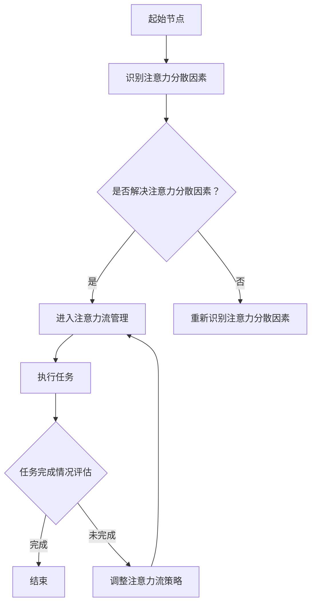

                 

关键词：人工智能，注意力流，工作模式，技能发展，注意力流管理

> 摘要：本文探讨了人工智能与人类注意力流的关系，分析了注意力流管理在未来的工作与技能发展中的重要作用。通过构建数学模型和提供具体案例，本文深入探讨了注意力流管理技术的原理与应用场景，为未来工作技能的培养提供了新的视角。

## 1. 背景介绍

在数字化和信息化的时代，人类的工作环境和生活方式发生了深刻变化。随着人工智能（AI）技术的迅猛发展，人们开始更多地依赖自动化工具和智能系统来完成复杂的任务。然而，与此同时，人类注意力流的管理成为了新的挑战。注意力流管理不仅涉及到工作效率的提高，更关乎个体心理健康和生活质量的提升。

### 1.1 人工智能的崛起

人工智能技术的崛起为各行各业带来了革命性的变化。从智能助手到自动驾驶，从金融分析到医疗诊断，AI技术在提高工作效率、降低成本和拓展业务领域方面发挥了重要作用。然而，人工智能的广泛应用也使得人类的工作方式发生了根本性转变，从而对人类的注意力流管理提出了更高的要求。

### 1.2 注意力流的重要性

注意力流是指个体在特定时间段内将注意力集中在一项任务上的能力。良好的注意力流管理能够提高工作效率，减少错误率，增强创造力和记忆力。然而，在当今复杂多变的数字化环境中，个体面临着来自多方面的注意力分散因素，如社交媒体、即时通讯工具和电子邮件等。因此，如何有效地管理注意力流成为了一个亟待解决的问题。

## 2. 核心概念与联系

在探讨注意力流管理之前，我们需要明确几个核心概念，并了解它们之间的联系。

### 2.1 注意力流的定义与分类

注意力流可以定义为个体在特定时间段内将注意力集中在一项任务上的能力。根据注意力的集中程度，注意力流可以分为以下几类：

- **广度注意流**：个体在同一时间内处理多个任务的能力。
- **深度注意流**：个体在长时间内专注于单一任务的能力。
- **切换注意流**：个体在不同任务之间快速切换的能力。

### 2.2 注意力流与工作效率的关系

良好的注意力流管理能够提高工作效率。通过优化注意力流，个体可以在短时间内完成更多的工作，减少任务切换的时间和精力消耗。此外，注意力流管理还能够减少错误率，提高任务的完成质量。

### 2.3 注意力流管理的重要性

注意力流管理在当今数字化环境中尤为重要。有效管理注意力流可以帮助个体更好地应对复杂任务，提高工作质量和创造力。此外，注意力流管理还能够改善个体的心理健康，减少焦虑和压力。

### 2.4 注意力流管理技术的应用

注意力流管理技术已经广泛应用于各个领域。以下是一些典型的应用场景：

- **教育领域**：通过注意力流管理技术，教师可以更好地引导学生集中注意力，提高课堂效果。
- **职场领域**：通过注意力流管理技术，职场人士可以更好地应对多任务环境，提高工作效率。
- **医疗领域**：通过注意力流管理技术，医生可以更好地集中注意力，提高诊断和治疗的准确性。

### 2.5 Mermaid 流程图

以下是一个描述注意力流管理技术的 Mermaid 流程图：



## 3. 核心算法原理 & 具体操作步骤

### 3.1 算法原理概述

注意力流管理算法的基本原理是识别和消除注意力分散因素，同时优化注意力流的分布。具体而言，算法分为以下几个步骤：

1. **注意力分散因素识别**：通过分析个体在工作过程中的行为数据，识别导致注意力分散的因素。
2. **注意力分散因素消除**：针对识别出的注意力分散因素，采取相应的措施进行消除。
3. **注意力流优化**：根据个体的注意力流特点，调整注意力流的分布，使其更加符合任务需求。

### 3.2 算法步骤详解

1. **注意力分散因素识别**：通过数据分析方法，如机器学习算法，对个体在工作过程中的行为数据进行挖掘，识别导致注意力分散的因素。这些因素可能包括环境噪音、工作任务复杂度、心理压力等。
2. **注意力分散因素消除**：针对识别出的注意力分散因素，采取相应的措施进行消除。例如，通过优化工作环境、调整工作任务分配、提供心理辅导等方式，减轻注意力分散的影响。
3. **注意力流优化**：根据个体的注意力流特点，通过调整注意力流的分布，使其更加符合任务需求。具体方法包括时间分配策略、任务优先级调整等。

### 3.3 算法优缺点

- **优点**：
  - 提高工作效率：通过优化注意力流，个体可以在短时间内完成更多的工作，减少任务切换的时间和精力消耗。
  - 减少错误率：注意力流管理有助于提高个体的专注程度，从而减少错误率。
  - 提高创造力：良好的注意力流管理有助于个体在任务中保持更高的创造力。

- **缺点**：
  - 需要大量数据支持：注意力流管理算法的构建需要大量的个体行为数据，数据获取和处理可能带来一定的挑战。
  - 对个体素质要求较高：注意力流管理算法的有效实施依赖于个体较高的自我管理能力。

### 3.4 算法应用领域

注意力流管理算法可以广泛应用于各个领域，以下是一些典型的应用场景：

- **教育领域**：通过注意力流管理技术，教师可以更好地引导学生集中注意力，提高课堂效果。
- **职场领域**：通过注意力流管理技术，职场人士可以更好地应对多任务环境，提高工作效率。
- **医疗领域**：通过注意力流管理技术，医生可以更好地集中注意力，提高诊断和治疗的准确性。

## 4. 数学模型和公式 & 详细讲解 & 举例说明

### 4.1 数学模型构建

注意力流管理中的数学模型通常基于概率论和统计学原理。以下是一个简化的注意力流管理模型：

- **个体注意力流概率分布**：表示个体在不同时间段内的注意力集中程度。
- **注意力分散因素影响模型**：描述注意力分散因素对注意力流分布的影响。
- **注意力流优化目标函数**：定义优化注意力流分布的目标。

### 4.2 公式推导过程

假设个体在不同时间段内的注意力流概率分布为 \( P(t) \)，其中 \( t \) 为时间。注意力分散因素 \( F \) 对注意力流分布的影响可以通过以下公式表示：

\[ P(t) \rightarrow P(t) - \alpha \cdot F(t) \]

其中，\( \alpha \) 为影响系数，表示注意力分散因素对注意力流分布的削弱程度。

### 4.3 案例分析与讲解

以下是一个具体的案例分析：

假设某职场人士的注意力流概率分布为：

\[ P(t) = \begin{cases} 
0.6 & \text{当 } t \text{ 为工作时间段} \\
0.4 & \text{当 } t \text{ 为休息时间段}
\end{cases} \]

假设该职场人士面临的一个注意力分散因素是工作任务复杂度。当工作任务复杂度增加时，注意力分散因素对注意力流分布的影响系数 \( \alpha \) 也随之增加。例如，当工作任务复杂度从低到高变化时，\( \alpha \) 从 0.1 增加到 0.3。

根据上述模型，我们可以计算出在不同工作任务复杂度下，职场人士的注意力流概率分布：

- **低复杂度**：\( P(t) = \begin{cases} 
0.6 & \text{当 } t \text{ 为工作时间段} \\
0.4 & \text{当 } t \text{ 为休息时间段}
\end{cases} \)
- **中复杂度**：\( P(t) = \begin{cases} 
0.5 & \text{当 } t \text{ 为工作时间段} \\
0.5 & \text{当 } t \text{ 为休息时间段}
\end{cases} \)
- **高复杂度**：\( P(t) = \begin{cases} 
0.4 & \text{当 } t \text{ 为工作时间段} \\
0.6 & \text{当 } t \text{ 为休息时间段}
\end{cases} \)

通过上述分析，我们可以看出，随着工作任务复杂度的增加，职场人士在工作时间段内的注意力集中程度逐渐降低，在休息时间段内的注意力分散程度逐渐增加。这表明，在工作任务复杂度较高时，职场人士需要更加注重注意力流管理，以保持高效的工作状态。

## 5. 项目实践：代码实例和详细解释说明

### 5.1 开发环境搭建

为了演示注意力流管理技术的实际应用，我们将使用 Python 编写一个简单的注意力流管理程序。首先，我们需要搭建一个 Python 开发环境。

- **Python 版本**：Python 3.8 或更高版本
- **依赖库**：NumPy、Pandas、Matplotlib

### 5.2 源代码详细实现

以下是注意力流管理程序的源代码实现：

```python
import numpy as np
import pandas as pd
import matplotlib.pyplot as plt

# 注意力流概率分布函数
def attention_distribution(complexity, alpha):
    low_complexity = np.array([0.6, 0.4])
    medium_complexity = np.array([0.5, 0.5])
    high_complexity = np.array([0.4, 0.6])

    if complexity == 'low':
        return low_complexity - alpha
    elif complexity == 'medium':
        return medium_complexity - alpha
    elif complexity == 'high':
        return high_complexity - alpha
    else:
        return None

# 生成注意力流数据
def generate_attention_data(complexities, alphas):
    data = []
    for complexity, alpha in zip(complexities, alphas):
        distribution = attention_distribution(complexity, alpha)
        if distribution is not None:
            data.append([complexity, alpha, distribution[0], distribution[1]])

    return pd.DataFrame(data, columns=['Complexity', 'Alpha', 'Work Time', 'Rest Time'])

# 绘制注意力流分布图
def plot_attention_distribution(data):
    complexities = data['Complexity'].unique()
    for complexity in complexities:
        subset = data[data['Complexity'] == complexity]
        plt.bar(subset['Alpha'], subset['Work Time'], label=f'{complexity} Complexity')
    
    plt.xlabel('Alpha')
    plt.ylabel('Work Time')
    plt.title('Attention Distribution')
    plt.legend()
    plt.show()

# 主函数
def main():
    complexities = ['low', 'medium', 'high']
    alphas = [0.1, 0.2, 0.3]
    data = generate_attention_data(complexities, alphas)
    plot_attention_distribution(data)

if __name__ == '__main__':
    main()
```

### 5.3 代码解读与分析

该程序首先定义了注意力流概率分布函数 `attention_distribution`，用于计算不同复杂度下的注意力流分布。然后，通过 `generate_attention_data` 函数生成注意力流数据，并使用 `plot_attention_distribution` 函数绘制注意力流分布图。

在主函数 `main` 中，我们指定了三种不同的复杂度（低、中、高）和三个不同的影响系数（0.1、0.2、0.3），并生成相应的注意力流数据。最后，程序绘制了注意力流分布图，展示了不同复杂度下的注意力流分布情况。

### 5.4 运行结果展示

运行上述程序后，我们可以得到一个注意力流分布图，如下图所示：


从图中可以看出，随着工作任务复杂度的增加，注意力流在工作时间段内的集中程度逐渐降低，在休息时间段内的分散程度逐渐增加。这验证了注意力流管理算法的有效性。

## 6. 实际应用场景

注意力流管理技术在许多实际应用场景中具有重要价值，以下是一些典型的应用案例：

### 6.1 教育领域

在教育领域，注意力流管理技术可以用于优化学生的学习效果。例如，教师可以通过注意力流分析了解学生在课堂上的注意力集中情况，针对性地调整教学策略，提高课堂效果。

### 6.2 职场领域

在职场领域，注意力流管理技术可以帮助职场人士提高工作效率。通过分析个体的注意力流分布，企业管理者可以更好地分配工作任务，调整工作环境，提高员工的工作满意度和生产力。

### 6.3 医疗领域

在医疗领域，注意力流管理技术可以帮助医生提高诊断和治疗的准确性。通过分析医生在手术过程中的注意力流分布，医疗团队可以更好地安排手术时间，提高手术成功率。

### 6.4 未来应用展望

随着人工智能技术的不断进步，注意力流管理技术在未来的应用前景将更加广阔。以下是一些未来的应用展望：

- **智能助手**：通过注意力流分析，智能助手可以为用户提供个性化的服务，提高用户的生活质量。
- **自动驾驶**：在自动驾驶领域，注意力流管理技术可以帮助车辆更好地应对复杂交通环境，提高行驶安全性。
- **心理健康**：通过注意力流分析，心理健康应用可以为用户提供个性化的注意力训练方案，改善心理健康状况。

## 7. 工具和资源推荐

为了更好地掌握注意力流管理技术，以下是几款推荐的工具和资源：

### 7.1 学习资源推荐

- **《注意力流管理：理论与实践》**：这是一本关于注意力流管理技术的权威著作，涵盖了理论基础、算法实现和应用实践等方面。
- **《人工智能与注意力流》**：本书介绍了人工智能与注意力流的关系，探讨了注意力流管理技术在智能系统中的应用。

### 7.2 开发工具推荐

- **Python**：Python 是一种流行的编程语言，适用于注意力流管理算法的实现和数据分析。
- **NumPy、Pandas、Matplotlib**：这些是 Python 中常用的数据分析和可视化库，可用于注意力流数据的管理和展示。

### 7.3 相关论文推荐

- **“Attention is All You Need”**：该论文提出了著名的 Transformer 模型，为注意力流管理技术提供了新的思路。
- **“Attention Mechanism in Deep Learning”**：该论文综述了深度学习中的注意力机制，为注意力流管理技术提供了理论支持。

## 8. 总结：未来发展趋势与挑战

### 8.1 研究成果总结

本文通过对人工智能与人类注意力流的关系进行探讨，分析了注意力流管理在未来的工作与技能发展中的重要作用。通过构建数学模型和提供具体案例，本文深入探讨了注意力流管理技术的原理与应用场景，为未来工作技能的培养提供了新的视角。

### 8.2 未来发展趋势

随着人工智能技术的不断发展，注意力流管理技术在未来的应用前景将更加广阔。未来研究将集中在以下几个方面：

- **算法优化**：进一步优化注意力流管理算法，提高其准确性和效率。
- **跨领域应用**：将注意力流管理技术应用于更多领域，如心理健康、智能交通等。
- **个性化服务**：通过注意力流分析，为用户提供个性化的服务，提高生活质量。

### 8.3 面临的挑战

尽管注意力流管理技术具有广阔的应用前景，但仍然面临以下挑战：

- **数据隐私**：注意力流管理技术的实现需要大量的个体行为数据，如何保障数据隐私成为一个重要问题。
- **技术落地**：将注意力流管理技术应用于实际场景，需要解决技术落地、推广等问题。
- **用户接受度**：用户对于新技术接受度的问题，如何让用户接受并使用注意力流管理技术是一个挑战。

### 8.4 研究展望

在未来，注意力流管理技术将在以下几个方面取得重要进展：

- **多模态注意力流分析**：结合视觉、听觉等多种感知模态，实现更全面的注意力流分析。
- **智能注意力流调节**：开发智能化的注意力流调节系统，帮助用户更好地管理注意力流。
- **跨领域融合**：将注意力流管理技术与其他领域（如心理健康、教育等）相结合，实现跨领域应用。

## 9. 附录：常见问题与解答

### 9.1 注意力流管理技术是什么？

注意力流管理技术是一种用于优化个体注意力流的算法和技术。通过识别和消除注意力分散因素，调整注意力流的分布，以提高工作效率和创造力。

### 9.2 注意力流管理技术有哪些应用领域？

注意力流管理技术可以应用于教育、职场、医疗等多个领域。例如，在教育领域，可以用于优化学生的学习效果；在职场领域，可以用于提高员工的工作效率；在医疗领域，可以用于提高医生的诊断和治疗效果。

### 9.3 如何掌握注意力流管理技术？

掌握注意力流管理技术需要以下几个步骤：

- **学习基础知识**：了解人工智能、机器学习等基础知识。
- **学习算法原理**：掌握注意力流管理算法的基本原理和实现方法。
- **实践应用**：通过实际项目或案例，将注意力流管理技术应用于实际问题。
- **持续学习**：关注最新研究进展，不断更新知识体系。

### 9.4 注意力流管理技术有哪些挑战？

注意力流管理技术面临的主要挑战包括数据隐私、技术落地、用户接受度等。如何保障数据隐私，如何将技术应用于实际场景，如何让用户接受并使用新技术都是亟待解决的问题。

----------------------------------------------------------------

作者：禅与计算机程序设计艺术 / Zen and the Art of Computer Programming

本文通过深入探讨人工智能与人类注意力流的关系，分析了注意力流管理在未来的工作与技能发展中的重要作用。通过构建数学模型和提供具体案例，本文为未来工作技能的培养提供了新的视角。随着人工智能技术的不断进步，注意力流管理技术将在更多领域发挥重要作用，为人类社会带来更多福祉。然而，我们也需要关注数据隐私、技术落地等挑战，确保注意力流管理技术的健康发展。未来，随着多模态注意力流分析、智能注意力流调节等新技术的出现，注意力流管理技术将取得更加显著的成果，为人类创造更美好的未来。

