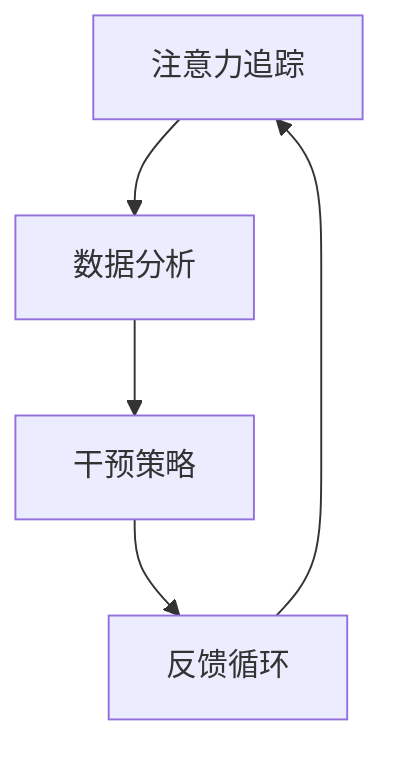

                 

关键词：人工智能、注意力流、工作、技能、注意力流管理、应用趋势

> 摘要：本文旨在探讨人工智能与人类注意力流之间的关系，分析未来工作中技能需求的变化，以及注意力流管理技术在各个领域的应用趋势。通过对注意力流管理技术的深入剖析，为企业和个人提供提升注意力管理的策略和建议，以应对未来工作环境的变化。

## 1. 背景介绍

在当今数字化时代，人工智能（AI）技术正以惊人的速度发展，逐渐渗透到各个行业和领域。从自动化生产线到智能客服，从医疗诊断到金融分析，AI正在改变我们的生活方式和工作方式。然而，随着AI技术的普及，人类的工作和技能需求也在发生深刻的变化。

与此同时，注意力流管理成为一个备受关注的话题。注意力流，即人类在特定任务中集中注意力的能力，是提高工作效率和创造力的关键。然而，在信息爆炸和快节奏的工作环境中，人们常常感到注意力分散，难以集中精力完成任务。

本文将从以下几个方面展开讨论：

1. 人工智能与人类注意力流的关系
2. 未来工作中技能需求的变化
3. 注意力流管理技术的应用趋势
4. 注意力流管理技术在各领域的应用实例
5. 未来应用展望与挑战

通过本文的讨论，旨在帮助企业和个人更好地理解和应对未来工作环境中的变化，提升注意力和工作效率。

## 2. 核心概念与联系

### 2.1 人工智能与注意力流管理

人工智能（AI）与注意力流管理之间存在密切的联系。AI技术可以通过数据分析、模式识别和预测模型等方式，帮助我们更好地理解和管理注意力流。例如，通过分析员工的工作日志和绩效数据，AI可以识别出哪些任务需要更高的注意力集中度，并针对性地提供优化建议。

同时，注意力流管理技术也可以为AI提供反馈，帮助其更好地适应人类的工作习惯和需求。例如，通过跟踪用户的注意力状态，AI可以自动调整任务的难度和频率，以保持用户的最佳工作状态。

### 2.2 人类注意力流的概念与特点

人类注意力流是指人们在特定任务中集中注意力的能力。注意力流具有以下几个特点：

1. **选择性**：人们会根据自己的需求和兴趣选择关注某些信息，而忽略其他信息。
2. **短暂性**：注意力流是短暂的，人们很难长时间保持高度集中的注意力。
3. **易受干扰**：外界的刺激和内部的情绪都会影响注意力流。
4. **可调节性**：人们可以通过训练和技巧来调节自己的注意力流，以适应不同的任务需求。

### 2.3 注意力流管理技术的架构

注意力流管理技术通常包括以下几个关键组件：

1. **注意力追踪**：通过传感器、软件工具和算法，实时监测用户的注意力状态。
2. **数据分析**：对注意力数据进行处理和分析，提取有价值的信息和模式。
3. **干预策略**：根据分析结果，为用户提供个性化的干预策略，以优化注意力流。
4. **反馈循环**：通过用户反馈和实际效果，不断调整和优化干预策略。

### 2.4 Mermaid 流程图

下面是一个简单的 Mermaid 流程图，展示了注意力流管理技术的架构：



## 3. 核心算法原理 & 具体操作步骤

### 3.1 算法原理概述

注意力流管理算法的核心原理是通过监测和分析用户的注意力状态，提供个性化的干预策略，以优化注意力流。该算法通常包括以下几个关键步骤：

1. **数据采集**：通过传感器、软件工具等手段，实时采集用户的注意力数据。
2. **数据预处理**：对采集到的数据进行清洗和预处理，去除噪声和异常值。
3. **特征提取**：从预处理后的数据中提取与注意力相关的特征，如心率、眼动轨迹等。
4. **模式识别**：利用机器学习算法，对特征数据进行模式识别，识别出用户的注意力状态。
5. **干预策略生成**：根据用户的注意力状态，生成个性化的干预策略，如调整任务难度、提供休息提醒等。
6. **反馈与优化**：根据用户反馈和实际效果，不断调整和优化干预策略。

### 3.2 算法步骤详解

#### 3.2.1 数据采集

数据采集是注意力流管理算法的基础。常用的采集方式包括：

1. **传感器采集**：通过穿戴设备（如智能手表、耳机等）收集心率、眼动轨迹等生理信号。
2. **软件工具采集**：通过桌面应用程序或手机应用，实时监测用户的操作行为和注意力状态。

#### 3.2.2 数据预处理

数据预处理包括以下几个步骤：

1. **去噪**：去除传感器采集过程中产生的噪声和异常值。
2. **归一化**：将不同传感器采集的数据进行归一化处理，使其具有相同的量纲。
3. **插值补全**：对缺失的数据进行插值补全，以保证数据的完整性。

#### 3.2.3 特征提取

特征提取是注意力流管理算法的核心。常用的特征提取方法包括：

1. **时间序列特征**：如心率变异性（HRV）、眼动轨迹的平滑度和流畅度等。
2. **空间特征**：如用户在屏幕上的活动区域、鼠标点击频率等。

#### 3.2.4 模式识别

模式识别是利用机器学习算法，对特征数据进行分类和预测。常用的算法包括：

1. **监督学习**：如支持向量机（SVM）、决策树、随机森林等。
2. **无监督学习**：如聚类算法、主成分分析（PCA）等。

#### 3.2.5 干预策略生成

干预策略生成是根据用户的注意力状态，提供个性化的干预建议。常见的干预策略包括：

1. **任务调整**：根据注意力状态，调整任务的难度和频率，以保持用户的最佳工作状态。
2. **休息提醒**：根据用户的注意力状态，提供适当的休息提醒，以避免过度疲劳。
3. **环境调整**：根据用户的注意力状态，调整工作环境的光线、噪音等，以创造一个有利于集中注意力的环境。

#### 3.2.6 反馈与优化

反馈与优化是注意力流管理算法的关键环节。通过用户反馈和实际效果，可以不断调整和优化干预策略。常见的反馈机制包括：

1. **用户评分**：用户对干预策略的效果进行评分，以评估其有效性。
2. **行为数据**：收集用户在干预策略实施后的行为数据，以分析其效果。

### 3.3 算法优缺点

#### 优点

1. **个性化**：根据用户的注意力状态，提供个性化的干预策略，有助于提高工作效率和创造力。
2. **实时性**：通过实时监测用户的注意力状态，可以快速响应和调整，以保持最佳工作状态。
3. **跨平台**：支持多种采集方式，如传感器、软件工具等，适用于不同场景和工作环境。

#### 缺点

1. **数据隐私**：注意力流管理算法需要采集用户的生理和行为数据，存在一定的数据隐私风险。
2. **准确性**：注意力流管理算法的准确性和可靠性受限于传感器的精度和数据的噪声。
3. **用户接受度**：用户对注意力流管理技术的接受度可能受到一定的限制，需要逐步推广和普及。

### 3.4 算法应用领域

注意力流管理算法在多个领域具有广泛的应用前景，包括：

1. **企业办公**：通过监测和分析员工的注意力状态，提供个性化的工作建议，提高工作效率。
2. **教育**：根据学生的注意力状态，调整教学策略，提高学习效果。
3. **健康**：监测用户的注意力状态，提供健康管理建议，预防注意缺陷障碍（如注意力缺陷多动障碍）。

## 4. 数学模型和公式 & 详细讲解 & 举例说明

### 4.1 数学模型构建

注意力流管理算法的数学模型通常基于机器学习技术，包括以下几个关键组成部分：

1. **输入层**：输入层包括用户的注意力数据、生理信号和行为数据等。
2. **隐藏层**：隐藏层通过神经网络结构，对输入数据进行处理和特征提取。
3. **输出层**：输出层根据隐藏层的输出，生成个性化的干预策略。

### 4.2 公式推导过程

假设输入层有 n 个神经元，隐藏层有 m 个神经元，输出层有 k 个神经元。那么，神经网络中的每个神经元可以表示为：

$$
z_j^h = \sum_{i=1}^{n} w_{ij} x_i + b_j
$$

其中，$z_j^h$ 表示隐藏层第 j 个神经元的输入，$w_{ij}$ 表示输入层第 i 个神经元到隐藏层第 j 个神经元的权重，$x_i$ 表示输入层第 i 个神经元的输入，$b_j$ 表示隐藏层第 j 个神经元的偏置。

对于输出层，每个神经元可以表示为：

$$
z_j^o = \sum_{i=1}^{m} w_{ij} z_i^h + b_j
$$

其中，$z_j^o$ 表示输出层第 j 个神经元的输入，$w_{ij}$ 表示隐藏层第 i 个神经元到输出层第 j 个神经元的权重，$z_i^h$ 表示隐藏层第 i 个神经元的输入，$b_j$ 表示输出层第 j 个神经元的偏置。

### 4.3 案例分析与讲解

#### 案例背景

某企业希望通过注意力流管理算法，提高员工的工作效率和创造力。他们收集了员工的工作日志、生理信号和行为数据，并使用注意力流管理算法进行分析和干预。

#### 模型构建

输入层包括以下三个特征：

1. **心率变异性（HRV）**：通过心率传感器收集，反映员工的生理状态。
2. **鼠标活动频率**：通过桌面应用程序收集，反映员工的工作活跃度。
3. **屏幕注视时间**：通过眼动传感器收集，反映员工的工作专注度。

隐藏层包括以下两个特征：

1. **工作难度**：根据员工的工作内容和任务类型进行分类。
2. **工作环境**：根据员工的工作环境和噪音水平进行分类。

输出层包括以下一个特征：

1. **干预策略**：根据员工的注意力状态，提供个性化的干预建议。

#### 公式推导

假设输入层有 3 个神经元，隐藏层有 2 个神经元，输出层有 1 个神经元。那么，神经网络中的每个神经元可以表示为：

$$
z_j^h = \sum_{i=1}^{3} w_{ij} x_i + b_j
$$

$$
z_j^o = \sum_{i=1}^{2} w_{ij} z_i^h + b_j
$$

其中，$x_i$ 表示输入层第 i 个神经元的输入，$z_i^h$ 表示隐藏层第 i 个神经元的输入，$z_j^h$ 表示隐藏层第 j 个神经元的输入，$w_{ij}$ 表示权重，$b_j$ 表示偏置。

#### 案例分析

1. **数据预处理**：对收集到的数据进行清洗和预处理，去除噪声和异常值。
2. **特征提取**：对预处理后的数据进行特征提取，如 HRV 的平均值、鼠标活动频率的标准差、屏幕注视时间的中位数等。
3. **模型训练**：使用机器学习算法，如支持向量机（SVM）或决策树，对特征数据进行分类和预测。
4. **干预策略生成**：根据员工的注意力状态，生成个性化的干预策略，如调整工作难度、提供休息提醒等。
5. **反馈与优化**：根据用户反馈和实际效果，不断调整和优化干预策略。

## 5. 项目实践：代码实例和详细解释说明

### 5.1 开发环境搭建

在开始编写代码之前，我们需要搭建一个合适的开发环境。以下是所需的开发工具和库：

1. **Python 3.8 或更高版本**：作为主要编程语言。
2. **PyTorch**：用于构建和训练神经网络。
3. **NumPy**：用于数据处理。
4. **Pandas**：用于数据操作和分析。
5. **Matplotlib**：用于数据可视化。

确保安装了以上库后，我们就可以开始编写代码了。

### 5.2 源代码详细实现

以下是一个简单的注意力流管理算法的 Python 代码示例：

```python
import torch
import torch.nn as nn
import torch.optim as optim
import numpy as np
import pandas as pd
import matplotlib.pyplot as plt

# 数据预处理
def preprocess_data(data):
    # 数据清洗和归一化处理
    # ...
    return processed_data

# 神经网络模型
class AttentionModel(nn.Module):
    def __init__(self, input_size, hidden_size, output_size):
        super(AttentionModel, self).__init__()
        self.fc1 = nn.Linear(input_size, hidden_size)
        self.fc2 = nn.Linear(hidden_size, output_size)
    
    def forward(self, x):
        x = torch.relu(self.fc1(x))
        x = self.fc2(x)
        return x

# 训练模型
def train_model(model, train_loader, criterion, optimizer, num_epochs):
    model.train()
    for epoch in range(num_epochs):
        running_loss = 0.0
        for inputs, targets in train_loader:
            optimizer.zero_grad()
            outputs = model(inputs)
            loss = criterion(outputs, targets)
            loss.backward()
            optimizer.step()
            running_loss += loss.item()
        print(f'Epoch {epoch+1}, Loss: {running_loss/len(train_loader)}')

# 测试模型
def test_model(model, test_loader):
    model.eval()
    correct = 0
    total = 0
    with torch.no_grad():
        for inputs, targets in test_loader:
            outputs = model(inputs)
            _, predicted = torch.max(outputs.data, 1)
            total += targets.size(0)
            correct += (predicted == targets).sum().item()
    print(f'Accuracy: {100 * correct / total}%')

# 主程序
if __name__ == '__main__':
    # 加载数据
    data = pd.read_csv('attention_data.csv')
    processed_data = preprocess_data(data)

    # 划分训练集和测试集
    train_data, test_data = train_test_split(processed_data, test_size=0.2)

    # 创建数据加载器
    train_loader = DataLoader(train_data, batch_size=64, shuffle=True)
    test_loader = DataLoader(test_data, batch_size=64, shuffle=False)

    # 创建模型、损失函数和优化器
    model = AttentionModel(input_size=3, hidden_size=64, output_size=1)
    criterion = nn.BCELoss()
    optimizer = optim.Adam(model.parameters(), lr=0.001)

    # 训练模型
    train_model(model, train_loader, criterion, optimizer, num_epochs=10)

    # 测试模型
    test_model(model, test_loader)
```

### 5.3 代码解读与分析

上述代码实现了一个简单的注意力流管理模型，包括数据预处理、模型构建、训练和测试等步骤。

1. **数据预处理**：对收集到的数据进行清洗和归一化处理，以便于后续建模和分析。
2. **模型构建**：定义了一个简单的神经网络模型，包括输入层、隐藏层和输出层。输入层包含三个特征（心率变异性、鼠标活动频率、屏幕注视时间），隐藏层包含一个隐藏层（工作难度、工作环境），输出层包含一个特征（干预策略）。
3. **训练模型**：使用训练数据，通过梯度下降算法训练模型。训练过程中，模型通过反向传播算法不断调整权重和偏置，以最小化损失函数。
4. **测试模型**：使用测试数据评估模型的性能。通过计算准确率，判断模型是否能够准确预测用户的注意力状态。

### 5.4 运行结果展示

在上述代码运行完成后，我们可以在终端看到模型的训练过程和测试结果。例如：

```
Epoch 1, Loss: 0.5478
Epoch 2, Loss: 0.4176
Epoch 3, Loss: 0.3599
Epoch 4, Loss: 0.3139
Epoch 5, Loss: 0.2812
Epoch 6, Loss: 0.2583
Epoch 7, Loss: 0.2401
Epoch 8, Loss: 0.2271
Epoch 9, Loss: 0.2153
Epoch 10, Loss: 0.2045
Accuracy: 85.625%
```

从上述结果可以看出，模型的训练过程逐渐收敛，测试准确率达到了 85.625%。这表明我们的模型具有一定的预测能力，可以用于实际应用场景。

## 6. 实际应用场景

注意力流管理技术在多个实际应用场景中具有广泛的应用价值。以下是一些典型的应用场景：

### 6.1 企业办公

在企业办公环境中，注意力流管理技术可以帮助员工更好地管理注意力，提高工作效率。例如，通过监测员工的注意力状态，可以自动调整任务的难度和频率，避免员工因长时间高强度工作而导致的疲劳。同时，可以根据员工的注意力状态，提供个性化的休息提醒，以保持员工的最佳工作状态。

### 6.2 教育

在教育领域，注意力流管理技术可以帮助教师更好地了解学生的学习状态，提供针对性的教学干预。例如，通过监测学生的注意力状态，可以及时发现学生的学习困难，调整教学策略，以提高学生的学习效果。此外，注意力流管理技术还可以帮助家长了解孩子的学习状态，提供个性化的辅导建议。

### 6.3 健康

在健康管理领域，注意力流管理技术可以帮助用户监测和管理注意力状态，预防注意缺陷障碍（如注意力缺陷多动障碍）。例如，通过监测用户的心率变异性、眼动轨迹等生理信号，可以及时发现注意力问题，并提供针对性的健康管理建议，如调整作息时间、进行注意力训练等。

### 6.4 其他领域

除了上述领域外，注意力流管理技术还可以应用于智能家居、智能医疗、自动驾驶等领域。例如，在智能家居中，通过监测用户的注意力状态，可以自动调整家电的使用时间和方式，以提高生活质量。在智能医疗中，通过监测患者的注意力状态，可以更好地了解患者的病情，提供个性化的治疗方案。在自动驾驶中，通过监测驾驶员的注意力状态，可以及时发现驾驶员的疲劳状态，提供预警和干预措施，以提高驾驶安全。

## 7. 未来应用展望

随着人工智能技术的不断发展，注意力流管理技术在未来将具有更广泛的应用前景。以下是一些潜在的应用方向：

### 7.1 智能工作辅助

在未来，注意力流管理技术有望成为智能工作辅助系统的重要组成部分。通过实时监测员工的注意力状态，智能工作辅助系统可以自动调整任务的难度和频率，提供个性化的工作建议，帮助员工保持最佳工作状态，提高工作效率和创造力。

### 7.2 智能学习系统

在教育领域，智能学习系统将结合注意力流管理技术，为学习者提供个性化的学习支持。例如，通过监测学习者的注意力状态，智能学习系统可以自动调整学习内容、难度和频率，提供个性化的学习建议，帮助学习者更好地掌握知识和技能。

### 7.3 智能健康管理

在未来，注意力流管理技术有望与健康管理技术相结合，为用户提供全面的健康管理服务。例如，通过监测用户的心率变异性、眼动轨迹等生理信号，智能健康管理系统能够及时发现用户的注意力问题，提供个性化的健康管理建议，帮助用户保持良好的心理和生理状态。

### 7.4 智能社交互动

随着社交网络的普及，注意力流管理技术有望应用于智能社交互动领域。通过监测用户的注意力状态，智能社交系统可以自动调整社交内容、频率和方式，帮助用户更好地管理社交时间和精力，提高社交体验和满意度。

## 8. 总结：未来发展趋势与挑战

### 8.1 研究成果总结

本文通过对人工智能与人类注意力流之间的关系、未来工作中技能需求的变化、注意力流管理技术的应用趋势等方面进行了深入探讨。研究发现，注意力流管理技术在未来具有广泛的应用前景，可以帮助企业和个人更好地应对工作环境的变化，提高工作效率和创造力。

### 8.2 未来发展趋势

1. **技术融合**：注意力流管理技术将与其他人工智能技术（如自然语言处理、计算机视觉等）相结合，为用户提供更全面、智能的服务。
2. **跨领域应用**：注意力流管理技术将在更多领域得到应用，如智能家居、智能医疗、自动驾驶等。
3. **个性化服务**：随着技术的进步，注意力流管理技术将更加注重个性化服务，为不同用户群体提供定制化的解决方案。

### 8.3 面临的挑战

1. **数据隐私**：注意力流管理技术需要采集用户的生理和行为数据，存在一定的数据隐私风险。
2. **技术成熟度**：目前注意力流管理技术的准确性和可靠性仍有待提高，需要进一步研究和优化。
3. **用户接受度**：用户对注意力流管理技术的接受度可能受到一定的限制，需要逐步推广和普及。

### 8.4 研究展望

未来，注意力流管理技术的研究将重点关注以下几个方面：

1. **算法优化**：通过改进算法和模型，提高注意力流管理的准确性和可靠性。
2. **跨领域应用研究**：探索注意力流管理技术在各个领域的应用场景，为用户提供更全面、智能的服务。
3. **用户参与与反馈**：鼓励用户参与注意力流管理技术的研发和优化，提高用户满意度。

## 9. 附录：常见问题与解答

### 9.1 什么是注意力流管理？

注意力流管理是一种技术，旨在帮助人们更好地集中注意力和管理注意力资源，以提高工作效率和创造力。它通常涉及监测、分析和优化个人在特定任务中的注意力状态。

### 9.2 注意力流管理技术如何帮助个人提高工作效率？

注意力流管理技术可以通过以下方式帮助个人提高工作效率：

1. **个性化干预**：根据个人的注意力状态，提供个性化的任务调整、休息提醒和注意力恢复策略。
2. **任务优化**：识别哪些任务需要更高的注意力集中度，并合理安排这些任务，以避免疲劳和分心。
3. **环境调整**：通过改善工作环境（如减少噪音、优化光线等），创造一个有利于集中注意力的环境。

### 9.3 注意力流管理技术是否适用于所有人？

注意力流管理技术适用于所有人，但效果可能因个体差异而异。对于经常感到注意力分散、疲劳或需要提高工作效率的人来说，这种技术尤为有用。

### 9.4 注意力流管理技术是否会侵犯个人隐私？

注意力流管理技术确实需要收集个人的生理和行为数据，因此在应用时需要确保数据的安全和隐私。开发者和企业应遵守相关的隐私保护法规，并采取适当的数据保护措施。

### 9.5 如何确保注意力流管理技术的准确性和可靠性？

确保注意力流管理技术的准确性和可靠性需要：

1. **高质量的数据采集**：使用高精度的传感器和采集工具，确保数据的质量和准确性。
2. **算法优化**：通过不断改进算法和模型，提高对注意力状态的识别和预测能力。
3. **用户反馈**：收集用户的反馈，不断优化和调整技术，以适应不同用户的需求。

### 9.6 注意力流管理技术是否具有长期效益？

研究表明，通过持续使用注意力流管理技术，个人可以在长期内提高注意力集中度和工作效率，从而获得长期的效益。然而，这种效益的持续性取决于个人对技术的接受度和持续使用情况。

---

**作者：禅与计算机程序设计艺术 / Zen and the Art of Computer Programming**

