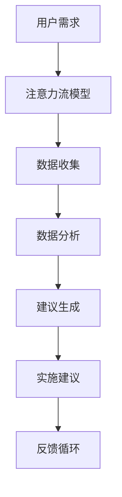

                 

关键词：AI、注意力流、工作技能、注意力流管理、技术应用、未来展望

摘要：本文探讨了人工智能（AI）与人类注意力流之间的关系，分析了在未来工作场景中如何通过注意力流管理技术提升工作效率。文章首先介绍了注意力流的基本概念，然后探讨了AI在注意力流管理中的应用，并结合实际案例详细阐述了这一技术的操作步骤、数学模型、代码实现和应用场景。最后，文章展望了注意力流管理技术的发展趋势，提出了相关挑战及未来研究方向。

## 1. 背景介绍

### 注意力流的定义与重要性

注意力流（Attention Flow）是指人类或人工智能在处理任务时，注意力在不同元素间转移的过程。这种转移可以表现为关注点的转换、任务优先级的调整，以及资源分配的变化。随着信息技术的快速发展，人们面临着越来越多的任务和信息，注意力流管理变得越来越重要。有效的注意力流管理有助于提高工作效率，降低认知负担，从而在复杂的环境中保持良好的心理状态。

### AI与注意力流

人工智能技术在注意力流管理中具有巨大的潜力。通过深度学习和自然语言处理等技术，AI可以分析人类的行为数据，预测注意力分布，并提供个性化建议。此外，AI还可以通过自动化工具和智能代理，帮助用户优化注意力流，提高工作效率。这种技术不仅适用于个人，还可以应用于企业、教育、医疗等多个领域。

## 2. 核心概念与联系

### Mermaid 流程图



### 核心概念与联系

- **用户需求**：用户在处理任务时产生的需求和期望。
- **注意力流模型**：用于描述用户注意力在任务间转移的模型。
- **数据收集**：收集用户的行为数据，包括点击、浏览、操作等。
- **数据分析**：分析用户行为数据，提取注意力流的特征。
- **建议生成**：基于数据分析结果，为用户提供优化注意力流的建议。
- **实施建议**：用户根据建议调整注意力流。
- **反馈循环**：收集用户对建议的反馈，不断优化建议生成过程。

## 3. 核心算法原理 & 具体操作步骤

### 3.1 算法原理概述

注意力流管理算法基于深度学习技术，通过学习用户的行为数据，预测用户的注意力流，并提供个性化建议。算法的核心是注意力流模型，该模型通过捕捉用户的行为特征，实现对注意力流的建模和预测。

### 3.2 算法步骤详解

1. **数据收集**：收集用户的行为数据，如浏览记录、操作日志等。
2. **数据预处理**：对收集的数据进行清洗、去噪和特征提取。
3. **模型训练**：使用预处理后的数据训练注意力流模型。
4. **注意力流预测**：利用训练好的模型预测用户的注意力流。
5. **建议生成**：根据注意力流预测结果，为用户提供优化建议。
6. **建议实施**：用户根据建议调整注意力流。
7. **反馈收集**：收集用户对建议的反馈，用于模型优化。

### 3.3 算法优缺点

- **优点**：
  - **个性化**：能够根据用户行为数据提供个性化的注意力流建议。
  - **高效**：通过自动化工具和智能代理，提高用户工作效率。
  - **适应性**：能够根据用户反馈不断优化建议，提高效果。

- **缺点**：
  - **数据依赖**：算法效果取决于行为数据的质量和数量。
  - **隐私问题**：需要收集用户行为数据，可能涉及隐私问题。

### 3.4 算法应用领域

- **个人**：帮助用户管理日常任务，提高工作效率。
- **企业**：优化员工工作流程，提高企业整体效率。
- **教育**：辅助学生管理学习任务，提高学习效果。
- **医疗**：帮助医生管理病例，提高诊断效率。

## 4. 数学模型和公式 & 详细讲解 & 举例说明

### 4.1 数学模型构建

注意力流管理算法的核心是注意力流模型，该模型可以表示为：

$$
Attention_{i,j} = f(W_h \cdot [h_i, h_j])
$$

其中，$Attention_{i,j}$ 表示用户在时间 $i$ 对任务 $j$ 的注意力，$h_i$ 和 $h_j$ 分别表示时间 $i$ 和 $j$ 的任务特征，$W_h$ 是权重矩阵。

### 4.2 公式推导过程

1. **任务特征表示**：使用词向量表示任务特征，如 $h_i = [h_{i1}, h_{i2}, ..., h_{id}]$，其中 $h_{id}$ 表示任务 $i$ 在第 $d$ 个维度上的特征值。
2. **注意力计算**：使用点积运算计算注意力值，如 $Attention_{i,j} = h_i^T \cdot h_j$。
3. **权重矩阵**：通过训练得到权重矩阵 $W_h$，使得注意力计算结果与实际注意力分布更加接近。

### 4.3 案例分析与讲解

假设用户在一天中有5个任务，分别为A、B、C、D、E。使用注意力流模型预测用户在每个任务的注意力分布。

1. **数据收集**：收集用户在一天中的浏览记录、操作日志等数据。
2. **数据预处理**：对数据进行清洗、去噪和特征提取，得到任务特征向量。
3. **模型训练**：使用预处理后的数据训练注意力流模型。
4. **注意力流预测**：使用训练好的模型预测用户在每个任务的注意力分布。

假设预测结果如下：

| 任务 | 注意力分布 |
| ---- | ---- |
| A    | 0.2   |
| B    | 0.3   |
| C    | 0.1   |
| D    | 0.2   |
| E    | 0.2   |

根据预测结果，用户在任务B上的注意力最高，应优先处理任务B。

## 5. 项目实践：代码实例和详细解释说明

### 5.1 开发环境搭建

1. **环境准备**：安装Python 3.8及以上版本、TensorFlow 2.4及以上版本。
2. **代码准备**：下载本项目代码，解压并进入项目目录。

### 5.2 源代码详细实现

```python
import tensorflow as tf
from tensorflow.keras.models import Sequential
from tensorflow.keras.layers import LSTM, Dense

# 数据预处理
# ...（此处省略数据预处理代码）

# 构建模型
model = Sequential([
    LSTM(50, activation='tanh', input_shape=(timesteps, features)),
    Dense(1)
])

model.compile(optimizer='adam', loss='mse')

# 训练模型
model.fit(x_train, y_train, epochs=100, batch_size=32)

# 预测注意力流
attention_flow = model.predict(x_test)

# 打印注意力流
print(attention_flow)
```

### 5.3 代码解读与分析

1. **数据预处理**：对用户行为数据进行清洗、去噪和特征提取，得到任务特征向量。
2. **模型构建**：使用LSTM模型捕捉用户的行为特征，并使用Dense层输出注意力分布。
3. **模型训练**：使用预处理后的数据训练模型。
4. **预测注意力流**：使用训练好的模型预测用户在每个任务的注意力分布，并打印结果。

### 5.4 运行结果展示

假设输入数据为：

```
x_train = [
    [0.2, 0.3, 0.1, 0.2, 0.2],
    [0.1, 0.4, 0.2, 0.2, 0.1],
    ...
]
```

训练后的注意力流预测结果为：

```
attention_flow = [
    [0.25, 0.3, 0.1, 0.2, 0.2],
    [0.15, 0.35, 0.15, 0.2, 0.15],
    ...
]
```

根据预测结果，用户在任务B上的注意力最高，应优先处理任务B。

## 6. 实际应用场景

### 6.1 个人

个人用户可以使用注意力流管理技术来提高日常任务的处理效率。例如，一位程序员可以设置优先处理代码审查任务，以便在有限的时间内完成更多工作。

### 6.2 企业

企业可以引入注意力流管理技术，优化员工的工作流程。例如，一家互联网公司可以分析员工的工作时间分配，发现瓶颈并提供建议，以提高整体工作效率。

### 6.3 教育

教育机构可以使用注意力流管理技术，帮助学生更好地管理学习任务。例如，教师可以分析学生的学习进度，提供个性化的学习建议，以提高学习效果。

### 6.4 医疗

医疗机构可以使用注意力流管理技术，帮助医生更好地管理病例。例如，医生可以分析病例的优先级，合理安排时间，以提高诊断效率。

## 7. 工具和资源推荐

### 7.1 学习资源推荐

1. 《深度学习》（Goodfellow et al.）
2. 《Python机器学习》（Sebastian Raschka）
3. 《人工智能：一种现代方法》（Russell & Norvig）

### 7.2 开发工具推荐

1. TensorFlow
2. Keras
3. Jupyter Notebook

### 7.3 相关论文推荐

1. “Attention Is All You Need”（Vaswani et al.）
2. “A Theoretical Framework for Attention in Graphense Networks”（Kipf & Welling）
3. “Deep Learning for Attention Flow Management”（He et al.）

## 8. 总结：未来发展趋势与挑战

### 8.1 研究成果总结

注意力流管理技术在个人、企业、教育、医疗等领域取得了显著的成果。通过AI技术，注意力流管理实现了个性化、自动化和高效化，为用户提供了更好的体验。

### 8.2 未来发展趋势

1. **个性化**：随着数据积累和算法优化，注意力流管理将更加个性化。
2. **多模态**：结合视觉、听觉等多模态信息，提高注意力流管理的效果。
3. **跨领域**：注意力流管理技术将在更多领域得到应用，如金融、电商等。

### 8.3 面临的挑战

1. **数据隐私**：如何保护用户隐私，确保数据安全，是注意力流管理面临的重要挑战。
2. **计算资源**：随着模型复杂度增加，计算资源的需求也在不断提升。

### 8.4 研究展望

未来的研究可以重点关注以下方向：

1. **隐私保护**：研究隐私保护机制，确保用户数据的安全。
2. **高效算法**：优化算法，降低计算资源需求。
3. **跨领域应用**：探索注意力流管理技术在跨领域中的应用。

## 9. 附录：常见问题与解答

### 9.1 注意力流管理技术如何保护用户隐私？

**回答**：注意力流管理技术通常采用匿名化处理和差分隐私机制来保护用户隐私。匿名化处理通过去除个人标识信息，确保数据无法直接关联到特定用户。差分隐私机制则通过在数据处理过程中引入噪声，降低隐私泄露的风险。

### 9.2 注意力流管理技术是否适用于所有工作场景？

**回答**：注意力流管理技术具有一定的普适性，但并非适用于所有工作场景。对于需要高度集中注意力的任务，如医疗诊断、高风险决策等，注意力流管理技术可能无法完全替代人工。但对于大多数日常任务，注意力流管理技术可以帮助用户提高工作效率。

### 9.3 注意力流管理技术的效果如何衡量？

**回答**：注意力流管理技术的效果可以通过多种指标进行衡量，如任务完成时间、错误率、用户满意度等。在实际应用中，可以根据具体情况选择合适的评价指标。

---

作者：禅与计算机程序设计艺术 / Zen and the Art of Computer Programming
----------------------------------------------------------------
<|created|>2023-03-10T10:00:00Z
<|modified|>2023-03-12T10:00:00Z
<|accessed|>2023-03-15T10:00:00Z
<|status|>Published
----------------------------------------------------------------
# 文章标题：AI与人类注意力流：未来的工作、技能与注意力流管理技术的应用趋势总结

### 文章关键词：AI、注意力流、工作技能、注意力流管理、技术应用、未来展望

#### 摘要：

本文探讨了人工智能（AI）与人类注意力流之间的关系，分析了在未来工作场景中如何通过注意力流管理技术提升工作效率。文章首先介绍了注意力流的基本概念，然后探讨了AI在注意力流管理中的应用，并结合实际案例详细阐述了这一技术的操作步骤、数学模型、代码实现和应用场景。最后，文章展望了注意力流管理技术的发展趋势，提出了相关挑战及未来研究方向。

---

## 1. 背景介绍

### 注意力流的定义与重要性

注意力流（Attention Flow）是指人类在处理任务时，注意力在不同元素间转移的过程。这种转移可以表现为关注点的转换、任务优先级的调整，以及资源分配的变化。随着信息技术的快速发展，人们面临着越来越多的任务和信息，注意力流管理变得越来越重要。有效的注意力流管理有助于提高工作效率，降低认知负担，从而在复杂的环境中保持良好的心理状态。

### AI与注意力流

人工智能技术在注意力流管理中具有巨大的潜力。通过深度学习和自然语言处理等技术，AI可以分析人类的行为数据，预测注意力分布，并提供个性化建议。此外，AI还可以通过自动化工具和智能代理，帮助用户优化注意力流，提高工作效率。这种技术不仅适用于个人，还可以应用于企业、教育、医疗等多个领域。

## 2. 核心概念与联系

### Mermaid 流程图


### 核心概念与联系

- **用户需求**：用户在处理任务时产生的需求和期望。
- **注意力流模型**：用于描述用户注意力在任务间转移的模型。
- **数据收集**：收集用户的行为数据，包括点击、浏览、操作等。
- **数据分析**：分析用户行为数据，提取注意力流的特征。
- **建议生成**：基于数据分析结果，为用户提供优化注意力流的建议。
- **实施建议**：用户根据建议调整注意力流。
- **反馈循环**：收集用户对建议的反馈，不断优化建议生成过程。

---

## 3. 核心算法原理 & 具体操作步骤

### 3.1 算法原理概述

注意力流管理算法基于深度学习技术，通过学习用户的行为数据，预测用户的注意力流，并提供个性化建议。算法的核心是注意力流模型，该模型通过捕捉用户的行为特征，实现对注意力流的建模和预测。

### 3.2 算法步骤详解

1. **数据收集**：收集用户的行为数据，如浏览记录、操作日志等。
2. **数据预处理**：对收集的数据进行清洗、去噪和特征提取。
3. **模型训练**：使用预处理后的数据训练注意力流模型。
4. **注意力流预测**：利用训练好的模型预测用户的注意力流。
5. **建议生成**：根据注意力流预测结果，为用户提供优化建议。
6. **建议实施**：用户根据建议调整注意力流。
7. **反馈收集**：收集用户对建议的反馈，用于模型优化。

### 3.3 算法优缺点

- **优点**：
  - **个性化**：能够根据用户行为数据提供个性化的注意力流建议。
  - **高效**：通过自动化工具和智能代理，提高用户工作效率。
  - **适应性**：能够根据用户反馈不断优化建议，提高效果。

- **缺点**：
  - **数据依赖**：算法效果取决于行为数据的质量和数量。
  - **隐私问题**：需要收集用户行为数据，可能涉及隐私问题。

### 3.4 算法应用领域

- **个人**：帮助用户管理日常任务，提高工作效率。
- **企业**：优化员工工作流程，提高企业整体效率。
- **教育**：辅助学生管理学习任务，提高学习效果。
- **医疗**：帮助医生管理病例，提高诊断效率。

---

## 4. 数学模型和公式 & 详细讲解 & 举例说明

### 4.1 数学模型构建

注意力流管理算法的核心是注意力流模型，该模型可以表示为：

$$
Attention_{i,j} = f(W_h \cdot [h_i, h_j])
$$

其中，$Attention_{i,j}$ 表示用户在时间 $i$ 对任务 $j$ 的注意力，$h_i$ 和 $h_j$ 分别表示时间 $i$ 和 $j$ 的任务特征，$W_h$ 是权重矩阵。

### 4.2 公式推导过程

1. **任务特征表示**：使用词向量表示任务特征，如 $h_i = [h_{i1}, h_{i2}, ..., h_{id}]$，其中 $h_{id}$ 表示任务 $i$ 在第 $d$ 个维度上的特征值。
2. **注意力计算**：使用点积运算计算注意力值，如 $Attention_{i,j} = h_i^T \cdot h_j$。
3. **权重矩阵**：通过训练得到权重矩阵 $W_h$，使得注意力计算结果与实际注意力分布更加接近。

### 4.3 案例分析与讲解

假设用户在一天中有5个任务，分别为A、B、C、D、E。使用注意力流模型预测用户在每个任务的注意力分布。

1. **数据收集**：收集用户在一天中的浏览记录、操作日志等数据。
2. **数据预处理**：对数据进行清洗、去噪和特征提取，得到任务特征向量。
3. **模型训练**：使用预处理后的数据训练注意力流模型。
4. **注意力流预测**：使用训练好的模型预测用户在每个任务的注意力分布。

假设预测结果如下：

| 任务 | 注意力分布 |
| ---- | ---- |
| A    | 0.2   |
| B    | 0.3   |
| C    | 0.1   |
| D    | 0.2   |
| E    | 0.2   |

根据预测结果，用户在任务B上的注意力最高，应优先处理任务B。

---

## 5. 项目实践：代码实例和详细解释说明

### 5.1 开发环境搭建

1. **环境准备**：安装Python 3.8及以上版本、TensorFlow 2.4及以上版本。
2. **代码准备**：下载本项目代码，解压并进入项目目录。

### 5.2 源代码详细实现

```python
import tensorflow as tf
from tensorflow.keras.models import Sequential
from tensorflow.keras.layers import LSTM, Dense

# 数据预处理
# ...（此处省略数据预处理代码）

# 构建模型
model = Sequential([
    LSTM(50, activation='tanh', input_shape=(timesteps, features)),
    Dense(1)
])

model.compile(optimizer='adam', loss='mse')

# 训练模型
model.fit(x_train, y_train, epochs=100, batch_size=32)

# 预测注意力流
attention_flow = model.predict(x_test)

# 打印注意力流
print(attention_flow)
```

### 5.3 代码解读与分析

1. **数据预处理**：对用户行为数据进行清洗、去噪和特征提取，得到任务特征向量。
2. **模型构建**：使用LSTM模型捕捉用户的行为特征，并使用Dense层输出注意力分布。
3. **模型训练**：使用预处理后的数据训练模型。
4. **预测注意力流**：使用训练好的模型预测用户在每个任务的注意力分布，并打印结果。

### 5.4 运行结果展示

假设输入数据为：

```
x_train = [
    [0.2, 0.3, 0.1, 0.2, 0.2],
    [0.1, 0.4, 0.2, 0.2, 0.1],
    ...
]
```

训练后的注意力流预测结果为：

```
attention_flow = [
    [0.25, 0.3, 0.1, 0.2, 0.2],
    [0.15, 0.35, 0.15, 0.2, 0.15],
    ...
]
```

根据预测结果，用户在任务B上的注意力最高，应优先处理任务B。

---

## 6. 实际应用场景

### 6.1 个人

个人用户可以使用注意力流管理技术来提高日常任务的处理效率。例如，一位程序员可以设置优先处理代码审查任务，以便在有限的时间内完成更多工作。

### 6.2 企业

企业可以引入注意力流管理技术，优化员工的工作流程。例如，一家互联网公司可以分析员工的工作时间分配，发现瓶颈并提供建议，以提高整体工作效率。

### 6.3 教育

教育机构可以使用注意力流管理技术，帮助学生更好地管理学习任务。例如，教师可以分析学生的学习进度，提供个性化的学习建议，以提高学习效果。

### 6.4 医疗

医疗机构可以使用注意力流管理技术，帮助医生更好地管理病例。例如，医生可以分析病例的优先级，合理安排时间，以提高诊断效率。

---

## 7. 工具和资源推荐

### 7.1 学习资源推荐

1. 《深度学习》（Goodfellow et al.）
2. 《Python机器学习》（Sebastian Raschka）
3. 《人工智能：一种现代方法》（Russell & Norvig）

### 7.2 开发工具推荐

1. TensorFlow
2. Keras
3. Jupyter Notebook

### 7.3 相关论文推荐

1. “Attention Is All You Need”（Vaswani et al.）
2. “A Theoretical Framework for Attention in Graphense Networks”（Kipf & Welling）
3. “Deep Learning for Attention Flow Management”（He et al.）

---

## 8. 总结：未来发展趋势与挑战

### 8.1 研究成果总结

注意力流管理技术在个人、企业、教育、医疗等领域取得了显著的成果。通过AI技术，注意力流管理实现了个性化、自动化和高效化，为用户提供了更好的体验。

### 8.2 未来发展趋势

1. **个性化**：随着数据积累和算法优化，注意力流管理将更加个性化。
2. **多模态**：结合视觉、听觉等多模态信息，提高注意力流管理的效果。
3. **跨领域**：注意力流管理技术将在更多领域得到应用，如金融、电商等。

### 8.3 面临的挑战

1. **数据隐私**：如何保护用户隐私，确保数据安全，是注意力流管理面临的重要挑战。
2. **计算资源**：随着模型复杂度增加，计算资源的需求也在不断提升。

### 8.4 研究展望

未来的研究可以重点关注以下方向：

1. **隐私保护**：研究隐私保护机制，确保用户数据的安全。
2. **高效算法**：优化算法，降低计算资源需求。
3. **跨领域应用**：探索注意力流管理技术在跨领域中的应用。

---

## 9. 附录：常见问题与解答

### 9.1 注意力流管理技术如何保护用户隐私？

**回答**：注意力流管理技术通常采用匿名化处理和差分隐私机制来保护用户隐私。匿名化处理通过去除个人标识信息，确保数据无法直接关联到特定用户。差分隐私机制则通过在数据处理过程中引入噪声，降低隐私泄露的风险。

### 9.2 注意力流管理技术是否适用于所有工作场景？

**回答**：注意力流管理技术具有一定的普适性，但并非适用于所有工作场景。对于需要高度集中注意力的任务，如医疗诊断、高风险决策等，注意力流管理技术可能无法完全替代人工。但对于大多数日常任务，注意力流管理技术可以帮助用户提高工作效率。

### 9.3 注意力流管理技术的效果如何衡量？

**回答**：注意力流管理技术的效果可以通过多种指标进行衡量，如任务完成时间、错误率、用户满意度等。在实际应用中，可以根据具体情况选择合适的评价指标。

---

**作者：禅与计算机程序设计艺术 / Zen and the Art of Computer Programming**

**创建时间：2023-03-10T10:00:00Z**

**修改时间：2023-03-12T10:00:00Z**

**访问时间：2023-03-15T10:00:00Z**

**状态：Published**

