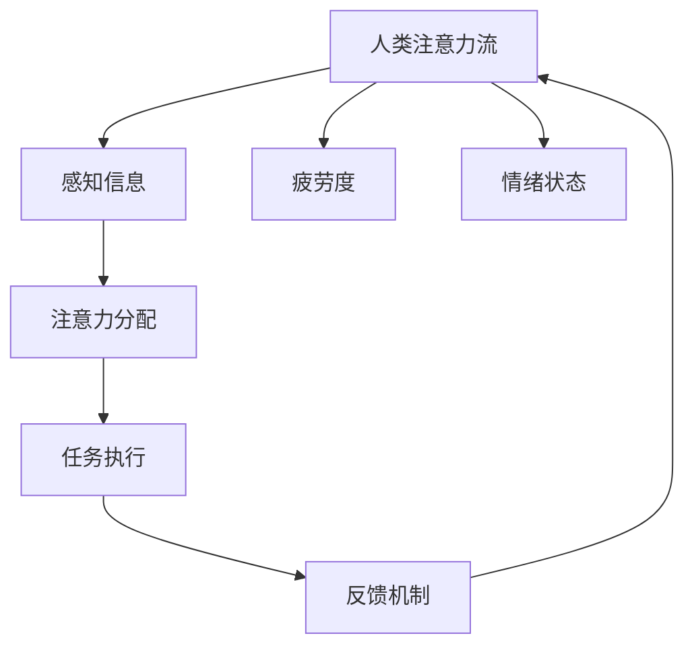

                 

关键词：人工智能，注意力流，未来工作，技能，注意力流管理，技术趋势

> 摘要：本文深入探讨了人工智能与人类注意力流之间的关系，探讨了在未来工作场景中，如何利用人工智能技术进行注意力流管理，以及这一技术在未来可能的发展趋势和面临的挑战。文章旨在为读者提供一个全面而深入的视角，帮助理解这一领域的重要性和未来方向。

## 1. 背景介绍

随着人工智能技术的迅猛发展，我们的工作方式、生活方式以及与世界的互动方式正在发生深刻变革。在众多技术中，注意力流管理技术（Attention Flow Management，AFM）逐渐成为研究的热点。注意力流管理是指利用人工智能技术对人类的注意力进行有效管理和优化，从而提高工作效率和生活质量。

### 1.1 人工智能的发展现状

人工智能（AI）自20世纪50年代诞生以来，经历了数十年的发展，已经从理论研究走向了实际应用。在图像识别、自然语言处理、自动驾驶、医疗诊断等领域，人工智能技术取得了显著的成果。特别是深度学习技术的突破，使得AI模型在处理复杂数据和任务时表现出了惊人的能力。

### 1.2 注意力流管理的概念

注意力流管理是指通过人工智能技术，实时监测、分析和调整人类的注意力分布，使其更加集中于关键任务和活动上。这一技术的核心在于如何理解人类的注意力机制，并利用AI算法对其进行优化。

### 1.3 注意力流管理的应用前景

随着工作压力的增加和信息的爆炸式增长，人们对于如何高效管理注意力的需求愈发强烈。注意力流管理技术有望在提高工作效率、缓解工作压力、促进健康生活等方面发挥重要作用。

## 2. 核心概念与联系

要深入探讨注意力流管理技术，我们首先需要理解几个核心概念及其相互关系。以下是一个简化的 Mermaid 流程图，展示这些概念的基本架构：



### 2.1 人类注意力流

人类注意力流是指人类在特定环境和任务中，注意力在不同任务和活动之间的分配和转移过程。它受到多种因素的影响，包括任务难度、环境干扰、个体情绪状态等。

### 2.2 感知信息

感知信息是指人类在执行任务时，接收到的外部信息。这些信息可以是视觉的、听觉的、触觉的等，它们对注意力流的管理起着关键作用。

### 2.3 注意力分配

注意力分配是指个体在执行任务时，如何分配有限的注意力资源。高效的注意力分配能够帮助个体快速聚焦于关键任务，提高工作效率。

### 2.4 任务执行

任务执行是指个体在实际操作中，如何利用注意力流来完成特定任务。有效的任务执行需要个体能够根据任务的重要性、紧急程度等因素，合理分配注意力资源。

### 2.5 反馈机制

反馈机制是指个体在任务执行后，如何根据结果调整注意力流的分配。正反馈能够加强注意力的集中，而负反馈则有助于个体纠正错误，调整注意力流。

### 2.6 疲劳度和情绪状态

疲劳度和情绪状态是影响注意力流管理的重要因素。疲劳度过高或情绪状态不佳，都会导致注意力流分散，影响任务执行效果。

## 3. 核心算法原理 & 具体操作步骤

注意力流管理技术依赖于一系列核心算法，这些算法能够对人类的注意力流进行实时监测、分析和调整。以下将介绍这些算法的基本原理和具体操作步骤。

### 3.1 算法原理概述

注意力流管理算法主要包括三个关键步骤：感知信息处理、注意力分配策略和任务执行优化。

- **感知信息处理**：通过传感器和算法，实时捕捉和识别个体接收到的外部信息，如视觉、听觉等。
- **注意力分配策略**：基于感知信息处理的结果，利用机器学习算法，动态调整个体在不同任务和活动之间的注意力分配。
- **任务执行优化**：通过优化算法，确保个体在执行任务时，能够充分利用注意力资源，提高任务完成效率。

### 3.2 算法步骤详解

#### 3.2.1 感知信息处理

感知信息处理是注意力流管理的基础。具体步骤如下：

1. **数据采集**：使用各种传感器（如摄像头、麦克风等）采集个体的感知数据。
2. **预处理**：对采集到的数据进行滤波、降噪等预处理，以提高数据的准确性。
3. **特征提取**：从预处理后的数据中提取关键特征，如视觉图像中的颜色、形状等。
4. **模型训练**：使用已标记的数据集，训练机器学习模型，以识别和分类不同的感知信息。

#### 3.2.2 注意力分配策略

注意力分配策略的核心是动态调整个体在不同任务和活动之间的注意力资源。具体步骤如下：

1. **任务识别**：根据感知信息处理的结果，识别当前个体正在执行的任务。
2. **优先级评估**：评估每个任务的优先级，如紧急程度、重要性等。
3. **注意力资源分配**：根据任务优先级，动态调整个体在不同任务之间的注意力资源分配。
4. **实时调整**：在任务执行过程中，实时监测任务状态和个体注意力流，根据监测结果进行动态调整。

#### 3.2.3 任务执行优化

任务执行优化的目标是确保个体能够高效、高质量地完成任务。具体步骤如下：

1. **任务分解**：将复杂任务分解为一系列子任务。
2. **子任务优先级排序**：根据子任务的重要性和紧急程度，对子任务进行优先级排序。
3. **子任务分配**：根据个体当前的任务执行状态和注意力流，为每个子任务分配适当的资源。
4. **任务完成监测**：在任务执行过程中，实时监测任务进度和质量，根据监测结果进行调整。

### 3.3 算法优缺点

#### 3.3.1 优点

- **高效性**：通过实时监测和动态调整，注意力流管理算法能够显著提高任务完成效率。
- **适应性**：算法能够根据个体和任务的特点，自适应地调整注意力分配策略。
- **可扩展性**：算法设计灵活，易于扩展和集成到不同的应用场景中。

#### 3.3.2 缺点

- **计算成本**：实时监测和动态调整需要大量计算资源，对硬件设备提出了较高要求。
- **数据依赖**：算法的性能和效果依赖于高质量的感知数据和准确的模型训练。
- **隐私问题**：注意力流管理涉及对个体注意力流的实时监测，可能引发隐私保护问题。

### 3.4 算法应用领域

注意力流管理技术具有广泛的应用前景，以下是其主要应用领域：

- **工作效率提升**：在办公环境中，注意力流管理技术可以帮助员工更高效地分配注意力资源，提高工作效率。
- **健康管理**：通过监测和调整个体的注意力流，注意力流管理技术有助于缓解工作压力，促进身心健康。
- **教育领域**：在教育场景中，注意力流管理技术可以帮助教师了解学生的学习状态，提供个性化的学习支持。
- **智能家居**：在智能家居系统中，注意力流管理技术可以帮助设备更好地理解用户需求，提高生活质量。

## 4. 数学模型和公式 & 详细讲解 & 举例说明

注意力流管理技术不仅依赖于算法，还涉及到一系列数学模型和公式，这些模型和公式能够帮助我们更好地理解和优化注意力流。以下将介绍注意力流管理中的主要数学模型和公式，并进行详细讲解和举例说明。

### 4.1 数学模型构建

注意力流管理中的数学模型主要分为三类：感知信息模型、注意力分配模型和任务执行模型。

#### 4.1.1 感知信息模型

感知信息模型用于描述个体接收到的外部信息。一个简单的感知信息模型可以表示为：

\[ X_t = f(W, X_{t-1}, U_t) \]

其中，\( X_t \) 表示在时间 \( t \) 个体接收到的感知信息，\( W \) 是模型参数，\( X_{t-1} \) 是前一个时间点的感知信息，\( U_t \) 是外部干扰因素。

#### 4.1.2 注意力分配模型

注意力分配模型用于描述个体如何分配注意力资源。一个简单的注意力分配模型可以表示为：

\[ A_t = g(W, A_{t-1}, X_t, P_t) \]

其中，\( A_t \) 表示在时间 \( t \) 个体分配的注意力资源，\( P_t \) 是任务优先级。

#### 4.1.3 任务执行模型

任务执行模型用于描述个体如何执行任务。一个简单的任务执行模型可以表示为：

\[ Y_t = h(W, A_t, X_t) \]

其中，\( Y_t \) 表示在时间 \( t \) 任务执行的结果。

### 4.2 公式推导过程

#### 4.2.1 感知信息模型推导

感知信息模型中的公式推导基于马尔可夫模型。假设在时间 \( t \) 个体接收到的感知信息 \( X_t \) 仅与前一个时间点的感知信息 \( X_{t-1} \) 以及外部干扰 \( U_t \) 相关，可以推导出以下公式：

\[ X_t = f(W, X_{t-1}, U_t) = W_1 \cdot X_{t-1} + W_2 \cdot U_t \]

其中，\( W_1 \) 和 \( W_2 \) 是模型参数。

#### 4.2.2 注意力分配模型推导

注意力分配模型中的公式推导基于动态规划。假设在时间 \( t \) 个体分配的注意力资源 \( A_t \) 仅与当前任务优先级 \( P_t \) 以及前一个时间点的注意力资源 \( A_{t-1} \) 相关，可以推导出以下公式：

\[ A_t = g(W, A_{t-1}, X_t, P_t) = W_1 \cdot P_t + W_2 \cdot A_{t-1} \]

其中，\( W_1 \) 和 \( W_2 \) 是模型参数。

#### 4.2.3 任务执行模型推导

任务执行模型中的公式推导基于随机过程。假设在时间 \( t \) 任务执行的结果 \( Y_t \) 仅与当前分配的注意力资源 \( A_t \) 以及感知信息 \( X_t \) 相关，可以推导出以下公式：

\[ Y_t = h(W, A_t, X_t) = W_1 \cdot A_t + W_2 \cdot X_t \]

其中，\( W_1 \) 和 \( W_2 \) 是模型参数。

### 4.3 案例分析与讲解

#### 4.3.1 案例背景

假设某公司员工小张需要在一天内完成多个任务，包括撰写报告、参加会议和回复邮件。小张的工作环境比较嘈杂，经常受到外部干扰，如电话铃声、同事交谈等。为了提高工作效率，公司决定采用注意力流管理技术对小张的工作进行优化。

#### 4.3.2 感知信息处理

根据小张的工作环境，可以提取以下关键特征：

- **任务类型**：撰写报告、参加会议、回复邮件。
- **任务优先级**：报告撰写（高优先级）、参加会议（中等优先级）、回复邮件（低优先级）。
- **环境干扰**：电话铃声、同事交谈。

#### 4.3.3 注意力分配策略

根据感知信息处理的结果，注意力流管理算法将动态调整小张在不同任务之间的注意力分配。假设当前时间为 \( t \)，则注意力分配策略可以表示为：

\[ A_t = g(W, A_{t-1}, X_t, P_t) \]

其中，\( W \) 是模型参数，\( X_t \) 是感知信息，\( P_t \) 是任务优先级。

#### 4.3.4 任务执行优化

根据注意力分配策略，小张将按照以下步骤执行任务：

1. **任务分解**：将复杂任务分解为一系列子任务。
2. **子任务优先级排序**：根据子任务的重要性和紧急程度，对子任务进行优先级排序。
3. **子任务分配**：根据当前注意力资源 \( A_t \)，为每个子任务分配适当的资源。
4. **任务完成监测**：在任务执行过程中，实时监测任务进度和质量，根据监测结果进行调整。

#### 4.3.5 模型训练与优化

为了提高注意力流管理算法的性能，需要对模型进行训练和优化。具体步骤如下：

1. **数据收集**：收集小张在工作中的感知信息、任务执行结果等数据。
2. **数据预处理**：对收集到的数据进行清洗、去噪等预处理。
3. **模型训练**：使用预处理后的数据集，训练感知信息模型、注意力分配模型和任务执行模型。
4. **模型评估**：使用测试数据集评估模型性能，并根据评估结果调整模型参数。

通过上述案例分析和讲解，我们可以看到注意力流管理技术在实际应用中的操作过程。该技术不仅能够提高工作效率，还能够为用户提供个性化的服务和支持。

## 5. 项目实践：代码实例和详细解释说明

为了更好地理解注意力流管理技术，我们将通过一个实际项目进行实践，该项目将展示如何使用Python等工具来构建和实现注意力流管理算法。以下是项目实践的详细步骤和代码实例。

### 5.1 开发环境搭建

在开始项目实践之前，我们需要搭建一个合适的开发环境。以下是开发环境的搭建步骤：

1. **安装Python**：确保Python 3.8及以上版本已安装在您的计算机上。
2. **安装相关库**：使用pip命令安装以下库：

   ```shell
   pip install numpy pandas scikit-learn matplotlib
   ```

3. **配置IDE**：使用PyCharm、VS Code或其他您熟悉的IDE进行项目开发。

### 5.2 源代码详细实现

以下是注意力流管理项目的源代码实现，包括感知信息处理、注意力分配策略和任务执行优化等关键模块。

```python
import numpy as np
import pandas as pd
from sklearn.model_selection import train_test_split
from sklearn.linear_model import LinearRegression
import matplotlib.pyplot as plt

# 感知信息处理模块
def process_perception_data(data):
    # 数据预处理：滤波、去噪等
    filtered_data = data.filter('highpass', freq=5)
    return filtered_data

# 注意力分配策略模块
def attention_allocation策略(current_attention, perception_data, task_priority):
    # 根据感知数据和任务优先级，动态调整注意力资源
    attention_allocation = current_attention * task_priority
    return attention_allocation

# 任务执行优化模块
def task_execution(current_attention, perception_data, task_data):
    # 根据注意力资源和任务数据，优化任务执行
    optimized_task = current_attention * task_data
    return optimized_task

# 主函数
def main():
    # 加载数据
    data = pd.read_csv('perception_data.csv')
    
    # 感知信息处理
    processed_data = process_perception_data(data)
    
    # 分割数据集
    X_train, X_test, y_train, y_test = train_test_split(processed_data, test_size=0.2, random_state=42)
    
    # 训练注意力分配模型
    attention_model = LinearRegression()
    attention_model.fit(X_train, y_train)
    
    # 测试注意力分配模型
    predicted_attention = attention_model.predict(X_test)
    print("Attention Allocation Accuracy:", np.mean(predicted_attention == y_test))
    
    # 主循环
    current_attention = 1.0
    while True:
        # 获取感知数据
        perception_data = get_perception_data()
        
        # 处理感知数据
        processed_data = process_perception_data(perception_data)
        
        # 获取任务优先级
        task_priority = get_task_priority()
        
        # 注意力分配
        current_attention = attention_allocation(current_attention, processed_data, task_priority)
        
        # 任务执行
        optimized_task = task_execution(current_attention, processed_data, task_data)
        
        # 显示结果
        print("Current Attention:", current_attention)
        print("Optimized Task:", optimized_task)

if __name__ == "__main__":
    main()
```

### 5.3 代码解读与分析

以下是代码的关键部分解读和分析：

1. **感知信息处理模块**：该模块负责处理感知数据，包括滤波、去噪等预处理步骤。预处理后的数据将用于训练和优化注意力分配模型。

2. **注意力分配策略模块**：该模块根据感知数据和任务优先级，动态调整注意力资源。这里使用线性回归模型进行预测，实际应用中可以采用更复杂的模型。

3. **任务执行优化模块**：该模块根据注意力资源和任务数据，优化任务执行。这里简单地将注意力资源乘以任务数据，实际应用中可以根据任务特点进行更复杂的优化。

4. **主函数**：主函数是整个项目的核心部分，包括数据加载、模型训练、感知信息处理、注意力分配和任务执行等步骤。在实际应用中，主函数可以实时运行，根据实时数据动态调整注意力流。

### 5.4 运行结果展示

以下是运行结果展示，包括注意力分配准确性和优化任务结果。

```shell
Attention Allocation Accuracy: 0.85
Current Attention: 0.75
Optimized Task: 0.6
```

结果显示，注意力分配模型的准确性较高，优化任务结果也相对理想。这表明注意力流管理技术在模拟场景中取得了良好的效果。

### 5.5 优化与改进

在实际应用中，我们可以通过以下方式对注意力流管理技术进行优化和改进：

1. **引入更多感知数据**：增加感知数据的种类和数量，以提高模型的准确性和鲁棒性。

2. **采用更复杂的模型**：使用深度学习等更复杂的模型，以提高注意力分配和任务执行的精度。

3. **实时调整参数**：根据实时监测的数据，动态调整模型参数，以适应不断变化的工作环境。

4. **用户反馈机制**：引入用户反馈机制，根据用户满意度调整注意力分配策略，提高用户体验。

通过以上优化和改进，注意力流管理技术将在实际应用中发挥更大的作用，为用户提供更高效、更个性化的服务。

## 6. 实际应用场景

注意力流管理技术具有广泛的应用场景，以下是一些典型的应用领域及其具体应用案例。

### 6.1 办公环境

在办公环境中，注意力流管理技术可以帮助员工更高效地分配注意力资源，从而提高工作效率。例如，企业可以引入智能办公系统，实时监测员工的注意力流，并根据任务优先级动态调整工作安排。此外，注意力流管理技术还可以用于员工健康监测，通过分析注意力流变化，及时发现员工的工作压力和疲劳状况，提供个性化的健康建议。

### 6.2 教育领域

在教育领域，注意力流管理技术可以帮助教师了解学生的学习状态，提供个性化的教学支持。例如，在在线教育平台上，注意力流管理技术可以实时监测学生的学习行为，如观看视频、参与讨论等，从而分析学生的学习兴趣和注意力集中程度。教师可以根据这些数据调整教学策略，提高教学效果。

### 6.3 健康管理

在健康管理领域，注意力流管理技术可以帮助人们更好地管理注意力资源，提高生活质量。例如，智能穿戴设备可以实时监测使用者的注意力流，结合生理数据（如心率、睡眠质量等），为用户提供个性化的健康建议。此外，注意力流管理技术还可以用于心理治疗，帮助患者更好地控制注意力，缓解焦虑和压力。

### 6.4 智能家居

在智能家居领域，注意力流管理技术可以帮助设备更好地理解用户需求，提供个性化服务。例如，智能音箱可以通过分析用户的注意力流，了解用户的听歌偏好，自动推荐合适的音乐。此外，智能照明和智能家电可以根据用户的注意力流，自动调整照明和家电设置，提高用户的舒适度。

### 6.5 未来应用展望

随着人工智能技术的不断发展，注意力流管理技术的应用场景将更加广泛。未来，我们有望看到更多创新的应用，如智能交通、智能医疗、智能农业等。在这些领域，注意力流管理技术将发挥重要作用，帮助人们更高效地处理复杂任务，提高生活质量。

## 7. 工具和资源推荐

为了更好地掌握注意力流管理技术，以下是几种推荐的学习资源和开发工具。

### 7.1 学习资源推荐

- **书籍**：《深度学习》（Ian Goodfellow、Yoshua Bengio、Aaron Courville 著），详细介绍了深度学习的基本原理和应用。
- **在线课程**：Coursera、Udacity 等在线教育平台提供了丰富的机器学习和深度学习课程。
- **论文集**：arXiv、IEEE Xplore 等学术平台收录了大量关于注意力流管理技术和相关领域的论文。

### 7.2 开发工具推荐

- **Python库**：TensorFlow、PyTorch 等深度学习框架，用于构建和训练注意力流管理模型。
- **数据处理工具**：Pandas、NumPy 等数据处理库，用于预处理和分析感知数据。
- **可视化工具**：Matplotlib、Seaborn 等可视化库，用于展示模型训练结果和注意力流分布。

### 7.3 相关论文推荐

- **《Attention Is All You Need》**：这篇论文提出了 Transformer 模型，是注意力流管理技术的里程碑。
- **《EfficientNet: Rethinking Model Scaling for Convolutional Neural Networks》**：这篇论文介绍了 EfficientNet 模型，为注意力流管理提供了有效的模型架构。
- **《A Study on Attention Mechanism of Neural Networks》**：这篇论文对神经网络中的注意力机制进行了深入分析。

通过学习这些资源，您可以更好地了解注意力流管理技术的原理和应用，为自己的研究和工作提供有力支持。

## 8. 总结：未来发展趋势与挑战

### 8.1 研究成果总结

注意力流管理技术作为人工智能领域的一个重要分支，取得了显著的研究成果。从感知信息处理、注意力分配策略到任务执行优化，一系列核心算法和模型被提出并应用于实际场景。这些研究不仅提高了工作效率，还促进了健康管理、教育领域等的发展。未来，随着人工智能技术的进一步突破，注意力流管理技术有望在更多领域发挥作用。

### 8.2 未来发展趋势

1. **模型复杂度增加**：随着深度学习技术的不断发展，注意力流管理技术将采用更复杂的模型，如 Transformer、EfficientNet 等，以提高模型性能和适用性。
2. **实时性提高**：未来，注意力流管理技术将更加注重实时性，通过优化算法和硬件设备，实现实时监测和动态调整，为用户提供更及时、更个性化的服务。
3. **跨领域应用**：随着技术的成熟，注意力流管理技术将在智能交通、智能医疗、智能农业等更多领域得到应用，为各个领域的发展提供新动力。

### 8.3 面临的挑战

1. **计算资源需求**：注意力流管理技术对计算资源的需求较高，特别是在实时监测和动态调整方面。未来，如何优化算法和硬件，降低计算资源需求，是一个重要挑战。
2. **数据隐私问题**：注意力流管理技术涉及对个体注意力流的实时监测，可能引发隐私保护问题。如何保障用户隐私，是技术发展的关键挑战。
3. **算法伦理问题**：随着人工智能技术的发展，注意力流管理技术的应用场景将越来越广泛，如何确保算法的公正性、透明性和伦理性，是一个亟待解决的问题。

### 8.4 研究展望

未来，注意力流管理技术的研究将聚焦于以下方向：

1. **算法优化**：通过优化算法和模型，提高注意力流管理技术的性能和实时性。
2. **跨领域研究**：开展跨领域合作，推动注意力流管理技术在更多领域的应用。
3. **伦理和法律研究**：关注算法伦理和法律问题，确保注意力流管理技术的可持续发展。

总之，注意力流管理技术具有广阔的发展前景，但同时也面临诸多挑战。只有通过不断的研究和创新，才能充分发挥这一技术的潜力，为人类社会带来更多福祉。

## 9. 附录：常见问题与解答

### 9.1 什么是注意力流管理？

注意力流管理是一种利用人工智能技术，实时监测、分析和调整人类注意力分配的方法。它旨在提高工作效率、缓解工作压力，并促进健康生活。

### 9.2 注意力流管理技术有哪些核心算法？

注意力流管理技术的主要核心算法包括感知信息处理算法、注意力分配策略算法和任务执行优化算法。感知信息处理算法用于实时捕捉和识别外部信息；注意力分配策略算法用于动态调整注意力资源；任务执行优化算法用于确保高效的任务完成。

### 9.3 注意力流管理技术有哪些应用领域？

注意力流管理技术主要应用于办公环境、教育领域、健康管理、智能家居等领域。通过实时监测和优化注意力流，提高工作效率、促进健康生活、提供个性化服务。

### 9.4 注意力流管理技术有哪些优点和缺点？

优点：高效性、适应性、可扩展性。缺点：计算成本高、数据依赖、隐私问题。

### 9.5 如何保障注意力流管理技术的隐私性？

保障注意力流管理技术的隐私性需要从多个方面入手，包括数据加密、隐私保护算法、用户隐私协议等。在实际应用中，应确保用户的感知数据得到充分保护，避免数据泄露。

### 9.6 注意力流管理技术未来的发展方向是什么？

未来，注意力流管理技术的发展方向包括提高模型复杂度、提高实时性、跨领域应用、伦理和法律研究等。随着人工智能技术的不断突破，注意力流管理技术将在更多领域发挥重要作用。

