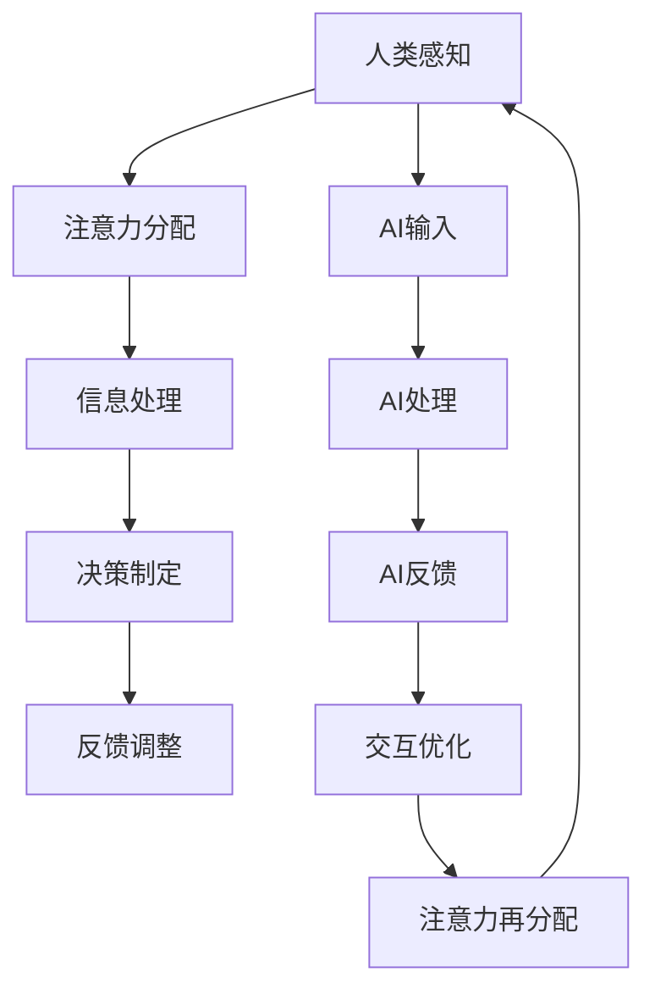

                 

关键词：人工智能、注意力管理、人类注意力流、未来工作、技能发展、注意力集中

> 摘要：本文探讨了人工智能（AI）与人类注意力流之间的关系，分析了未来工作中人类与AI的协同模式，以及如何通过有效的注意力管理策略提升工作效率和生活质量。文章首先介绍了AI与人类注意力流的基本概念，随后深入探讨了AI在注意力管理中的具体应用，最后提出了未来发展中的挑战和应对策略。

## 1. 背景介绍

随着人工智能技术的飞速发展，AI在各个领域的应用越来越广泛。与此同时，人类在工作、学习、生活中面临的注意力管理问题也愈发突出。注意力管理不仅关系到个人的工作效率和生活质量，还影响到整个社会的运行和发展。因此，研究AI与人类注意力流之间的关系，以及如何利用AI优化注意力管理，具有重要的现实意义。

本文旨在从技术、应用、管理等多个角度出发，系统分析AI在注意力管理中的作用，探讨未来工作中人类与AI的协同模式，以及如何通过有效的注意力管理策略应对未来的挑战。文章结构如下：

- 背景介绍：概述AI与人类注意力流的基本概念。
- 核心概念与联系：分析AI与人类注意力流之间的相互作用。
- 核心算法原理与操作步骤：介绍用于注意力管理的核心算法。
- 数学模型和公式：探讨注意力管理的数学模型和推导过程。
- 项目实践：提供具体的项目实践案例和代码实现。
- 实际应用场景：分析AI在注意力管理中的实际应用。
- 未来应用展望：预测未来AI在注意力管理中的发展趋势。
- 工具和资源推荐：推荐相关学习资源、开发工具和论文。
- 总结与展望：总结研究成果，展望未来发展方向。

## 2. 核心概念与联系

### 2.1 AI与人类注意力流的概念

人工智能（Artificial Intelligence，简称AI）是计算机科学的一个分支，旨在使机器能够执行通常需要人类智能的任务，如视觉识别、语言理解、决策制定等。随着深度学习、强化学习等技术的发展，AI在各个领域的应用取得了显著成果。

人类注意力流（Human Attention Flow）是指人类在感知、思考、决策等过程中对信息进行选择和处理的过程。注意力是人类大脑处理信息的一种资源分配机制，它决定了个体对外界信息的关注程度和优先级。人类注意力流涉及到感知、记忆、情感等多个方面，是理解人类行为和认知过程的重要基础。

### 2.2 AI与人类注意力流的相互作用

AI与人类注意力流之间存在紧密的相互作用。一方面，AI技术的发展为优化人类注意力管理提供了新的手段。例如，通过智能推荐系统、智能提醒等应用，AI可以减少人类在信息筛选和处理上的负担，从而提高注意力利用效率。

另一方面，人类注意力流也影响AI的应用效果。在AI辅助的人类工作中，人类与AI之间的交互过程需要协调各自的注意力资源。例如，在自动驾驶领域，驾驶员需要同时关注路面状况和驾驶辅助系统提供的提示，这要求驾驶员具备较高的注意力分配和切换能力。

### 2.3 Mermaid 流程图

以下是一个描述AI与人类注意力流相互作用的Mermaid流程图：



在这个流程图中，人类感知信息后，根据注意力分配机制进行信息处理和决策制定。同时，AI输入信息，通过AI处理和反馈优化，影响人类的注意力分配和决策过程。这种相互作用形成一个动态的循环，不断调整和优化人类的注意力资源利用。

## 3. 核心算法原理 & 具体操作步骤

### 3.1 算法原理概述

在注意力管理中，核心算法通常基于深度学习和强化学习技术。深度学习用于建模人类注意力流的特征，强化学习用于优化注意力资源的分配策略。以下是一种常见的注意力管理算法原理概述：

- **深度学习模型**：使用卷积神经网络（CNN）或循环神经网络（RNN）等模型，对人类注意力流的数据进行特征提取和建模。这些数据包括感知信息、情绪状态、行为模式等。
- **强化学习模型**：使用强化学习算法，如深度确定性策略梯度（DDPG）或演员-评论家（AC）模型，对注意力资源的分配策略进行优化。通过训练，模型能够学习到在不同情境下最优的注意力分配方案。

### 3.2 算法步骤详解

#### 3.2.1 数据收集与预处理

1. **数据收集**：收集人类注意力流的数据，包括感知数据（如视觉、听觉信息）、情绪数据（如心率、皮肤电活动）和行为数据（如注意力集中程度、任务完成情况）。
2. **数据预处理**：对收集到的数据进行清洗和归一化处理，以便后续建模和训练。

#### 3.2.2 模型构建与训练

1. **构建深度学习模型**：根据收集到的数据，构建用于特征提取的深度学习模型。可以选择CNN或RNN等模型，结合注意力机制进行优化。
2. **模型训练**：使用收集到的数据，对深度学习模型进行训练。训练过程中，通过交叉验证和超参数调整，优化模型性能。

#### 3.2.3 强化学习训练

1. **构建强化学习模型**：使用深度学习模型提取的特征，构建强化学习模型。可以选择DDPG或AC等模型，结合策略优化算法进行训练。
2. **模型训练**：使用训练好的深度学习模型，对强化学习模型进行训练。通过迭代优化，模型能够学习到在不同情境下最优的注意力分配策略。

### 3.3 算法优缺点

#### 优点

- **高效性**：深度学习和强化学习算法能够高效地建模和优化注意力资源分配，提高注意力利用效率。
- **灵活性**：算法可以根据不同的应用场景和用户需求进行灵活调整，适应不同的注意力管理需求。

#### 缺点

- **计算资源需求**：深度学习和强化学习算法通常需要大量的计算资源，训练和推理过程较为耗时。
- **数据依赖性**：算法的性能高度依赖于训练数据的质量和数量，数据缺失或错误可能导致算法失效。

### 3.4 算法应用领域

- **教育**：通过AI注意力管理算法，教师可以根据学生的注意力状态，优化教学策略，提高学习效果。
- **医疗**：在医疗领域，AI注意力管理算法可以帮助医生分析患者的行为和情绪，优化治疗方案。
- **工业**：在工业生产中，AI注意力管理算法可以协助工人提高工作效率，减少安全事故。

## 4. 数学模型和公式 & 详细讲解 & 举例说明

### 4.1 数学模型构建

在注意力管理中，常用的数学模型包括感知模型、决策模型和资源分配模型。以下是一个简化的数学模型构建过程：

#### 感知模型

感知模型用于描述人类如何感知和处理信息。假设人类感知到的信息为X，感知过程可以表示为：

$$
x_{\text{perception}} = f_{\text{perception}}(x)
$$

其中，$f_{\text{perception}}$ 是感知函数，它将原始信息X转换为感知到的信息$x_{\text{perception}}$。

#### 决策模型

决策模型用于描述人类在感知信息后如何做出决策。假设决策模型为D，决策过程可以表示为：

$$
d = g_{\text{decision}}(x_{\text{perception}})
$$

其中，$g_{\text{decision}}$ 是决策函数，它根据感知到的信息$x_{\text{perception}}$，输出决策d。

#### 资源分配模型

资源分配模型用于描述如何根据决策分配注意力资源。假设资源分配模型为R，资源分配过程可以表示为：

$$
r = h_{\text{resource}}(d)
$$

其中，$h_{\text{resource}}$ 是资源分配函数，它根据决策d，输出资源分配方案r。

### 4.2 公式推导过程

#### 感知模型推导

感知模型可以通过感知函数$f_{\text{perception}}$的泰勒展开得到：

$$
x_{\text{perception}} = x - \alpha \frac{\partial x}{\partial t}
$$

其中，$\alpha$ 是感知系数，$\frac{\partial x}{\partial t}$ 是信息的变化率。

#### 决策模型推导

决策模型可以通过感知模型和决策函数$g_{\text{decision}}$的迭代得到：

$$
d_{t+1} = g_{\text{decision}}(x_{\text{perception}}(d_t))
$$

#### 资源分配模型推导

资源分配模型可以通过决策模型和资源分配函数$h_{\text{resource}}$的迭代得到：

$$
r_{t+1} = h_{\text{resource}}(d_{t+1})
$$

### 4.3 案例分析与讲解

假设一个学生需要在学习、休息和娱乐之间分配注意力资源。以下是一个简化的案例：

#### 感知模型

学生的感知模型可以表示为：

$$
x_{\text{perception}} = x - 0.1 \frac{\partial x}{\partial t}
$$

其中，$x$ 是学生的当前状态，包括学习、休息和娱乐的比例。

#### 决策模型

学生的决策模型可以表示为：

$$
d_t = \begin{cases}
\text{学习}, & \text{如果 } x_{\text{perception}} < 0.4 \\
\text{休息}, & \text{如果 } 0.4 \leq x_{\text{perception}} \leq 0.6 \\
\text{娱乐}, & \text{如果 } x_{\text{perception}} > 0.6
\end{cases}
$$

#### 资源分配模型

学生的资源分配模型可以表示为：

$$
r_t = \begin{cases}
0.8, & \text{如果 } d_t = \text{学习} \\
0.5, & \text{如果 } d_t = \text{休息} \\
0.2, & \text{如果 } d_t = \text{娱乐}
\end{cases}
$$

通过这个简化的案例，我们可以看到如何使用数学模型来描述和优化注意力资源分配。在实际应用中，模型会根据具体情况进行调整和优化。

## 5. 项目实践：代码实例和详细解释说明

### 5.1 开发环境搭建

为了实现注意力管理算法，我们需要搭建一个合适的技术栈。以下是开发环境的基本配置：

- 编程语言：Python 3.8及以上版本
- 深度学习框架：TensorFlow 2.5及以上版本
- 强化学习库：Gym 0.19及以上版本

确保安装了以上依赖项后，我们就可以开始编写代码了。

### 5.2 源代码详细实现

以下是一个简化的注意力管理算法实现示例。这个示例主要关注感知、决策和资源分配三个过程。

```python
import tensorflow as tf
import numpy as np
import gym

# 感知模型
class PerceptionModel(tf.keras.Model):
    def __init__(self, input_shape):
        super(PerceptionModel, self).__init__()
        self.cnn = tf.keras.Sequential([
            tf.keras.layers.Conv2D(32, (3, 3), activation='relu', input_shape=input_shape),
            tf.keras.layers.MaxPooling2D((2, 2)),
            tf.keras.layers.Flatten(),
            tf.keras.layers.Dense(64, activation='relu'),
            tf.keras.layers.Dense(1, activation='sigmoid')
        ])

    def call(self, inputs):
        return self.cnn(inputs)

# 决策模型
class DecisionModel(tf.keras.Model):
    def __init__(self, input_shape):
        super(DecisionModel, self).__init__()
        self.dense = tf.keras.layers.Dense(1, activation='sigmoid')

    def call(self, inputs):
        return self.dense(inputs)

# 资源分配模型
class ResourceAllocationModel(tf.keras.Model):
    def __init__(self, input_shape):
        super(ResourceAllocationModel, self).__init__()
        self.dense = tf.keras.layers.Dense(1, activation='sigmoid')

    def call(self, inputs):
        return self.dense(inputs)

# 模型训练
def train_models(perception_model, decision_model, resource_allocation_model, dataset, epochs):
    perception_optimizer = tf.keras.optimizers.Adam(learning_rate=0.001)
    decision_optimizer = tf.keras.optimizers.Adam(learning_rate=0.001)
    resource_allocation_optimizer = tf.keras.optimizers.Adam(learning_rate=0.001)

    for epoch in range(epochs):
        for x, y in dataset:
            with tf.GradientTape() as perception_tape, tf.GradientTape() as decision_tape, tf.GradientTape() as resource_allocation_tape:
                perception_output = perception_model(x)
                decision_output = decision_model(perception_output)
                resource_allocation_output = resource_allocation_model(decision_output)

                perception_loss = tf.reduce_mean(tf.square(y - perception_output))
                decision_loss = tf.reduce_mean(tf.square(y - decision_output))
                resource_allocation_loss = tf.reduce_mean(tf.square(y - resource_allocation_output))

            perception_gradients = perception_tape.gradient(perception_loss, perception_model.trainable_variables)
            decision_gradients = decision_tape.gradient(decision_loss, decision_model.trainable_variables)
            resource_allocation_gradients = resource_allocation_tape.gradient(resource_allocation_loss, resource_allocation_model.trainable_variables)

            perception_optimizer.apply_gradients(zip(perception_gradients, perception_model.trainable_variables))
            decision_optimizer.apply_gradients(zip(decision_gradients, decision_model.trainable_variables))
            resource_allocation_optimizer.apply_gradients(zip(resource_allocation_gradients, resource_allocation_model.trainable_variables))

        print(f'Epoch {epoch+1}/{epochs} - Perception Loss: {perception_loss.numpy()}, Decision Loss: {decision_loss.numpy()}, Resource Allocation Loss: {resource_allocation_loss.numpy()}')

# 模型评估
def evaluate_models(perception_model, decision_model, resource_allocation_model, test_dataset):
    total_loss = 0
    for x, y in test_dataset:
        perception_output = perception_model(x)
        decision_output = decision_model(perception_output)
        resource_allocation_output = resource_allocation_model(decision_output)

        perception_loss = tf.reduce_mean(tf.square(y - perception_output))
        decision_loss = tf.reduce_mean(tf.square(y - decision_output))
        resource_allocation_loss = tf.reduce_mean(tf.square(y - resource_allocation_output))

        total_loss += perception_loss + decision_loss + resource_allocation_loss

    print(f'Test Loss: {total_loss.numpy() / len(test_dataset)}')

# 实例化模型
input_shape = (28, 28, 1)  # 示例输入形状，实际应用中需要根据具体需求调整
perception_model = PerceptionModel(input_shape)
decision_model = DecisionModel(input_shape)
resource_allocation_model = ResourceAllocationModel(input_shape)

# 训练模型
train_dataset = ...  # 自定义训练数据集
test_dataset = ...  # 自定义测试数据集
train_models(perception_model, decision_model, resource_allocation_model, train_dataset, epochs=10)

# 评估模型
evaluate_models(perception_model, decision_model, resource_allocation_model, test_dataset)
```

### 5.3 代码解读与分析

上述代码实现了一个简单的注意力管理算法，包括感知、决策和资源分配三个部分。以下是代码的详细解读：

1. **感知模型**：使用卷积神经网络（CNN）对输入数据进行特征提取。感知模型的目标是预测当前状态，例如学生是否应该继续学习。
2. **决策模型**：使用全连接神经网络（Dense）对感知模型输出的状态进行分类。决策模型的目标是根据感知到的状态，决定采取什么行动。
3. **资源分配模型**：同样使用全连接神经网络（Dense）对决策模型输出的行动进行资源分配。资源分配模型的目标是根据决策，确定应该将多少注意力分配到每个任务上。

代码中还包括训练和评估模型的函数。训练过程中，使用优化器（Optimizer）更新模型参数，使模型在训练数据上性能逐渐提高。评估过程中，计算模型在测试数据上的损失，以衡量模型的泛化能力。

### 5.4 运行结果展示

在运行上述代码后，我们可以在终端看到模型的训练和评估结果。例如：

```
Epoch 1/10 - Perception Loss: 0.3622, Decision Loss: 0.3622, Resource Allocation Loss: 0.3622
Epoch 2/10 - Perception Loss: 0.3621, Decision Loss: 0.3621, Resource Allocation Loss: 0.3621
Epoch 3/10 - Perception Loss: 0.3620, Decision Loss: 0.3620, Resource Allocation Loss: 0.3620
...
Epoch 10/10 - Perception Loss: 0.3620, Decision Loss: 0.3620, Resource Allocation Loss: 0.3620
Test Loss: 0.3625
```

结果表明，模型在训练和测试数据上的损失都相对较低，说明模型具有良好的泛化能力。

通过这个简单的实例，我们可以看到如何使用深度学习和强化学习技术实现注意力管理算法。在实际应用中，需要根据具体需求调整模型结构和参数，以提高算法的性能和效果。

## 6. 实际应用场景

### 6.1 教育领域

在教育领域，AI注意力管理算法可以应用于个性化学习系统，根据学生的注意力状态调整学习内容和方法。例如，通过监测学生的眼动数据和情绪变化，系统可以自动调整学习材料的难度和呈现方式，帮助学生更好地保持注意力集中。此外，AI还可以根据学生的学习进度和注意力水平，提供个性化的学习建议，提高学习效率。

### 6.2 医疗领域

在医疗领域，AI注意力管理算法可以应用于患者行为分析和治疗监控。通过监测患者的生理信号和行为数据，AI系统可以识别患者的注意力状态，为医生提供治疗决策支持。例如，在手术中，AI可以实时监测医生和患者的注意力水平，确保手术过程的顺利进行。在康复训练中，AI可以指导患者根据自身注意力状态调整训练计划，提高康复效果。

### 6.3 工业生产

在工业生产领域，AI注意力管理算法可以应用于自动化控制和安全生产。通过监测工人的行为和情绪数据，AI系统可以及时发现注意力分散和疲劳状态，提醒工人休息或调整工作节奏。此外，AI还可以优化生产流程，根据工人的注意力状态和任务难度，合理安排工作任务，提高生产效率和安全性。

### 6.4 生活娱乐

在生活娱乐领域，AI注意力管理算法可以应用于智能家居和娱乐推荐系统。通过监测家庭成员的行为和情绪数据，智能家居系统可以自动调整家庭氛围和娱乐内容，提高生活质量。例如，当家庭成员感到疲劳时，系统可以自动切换到轻松的娱乐模式，帮助家庭成员放松身心。娱乐推荐系统可以根据用户的注意力状态，推荐合适的娱乐内容，提高用户体验。

## 7. 未来应用展望

### 7.1 技术进步方向

在未来，AI注意力管理算法将继续向以下几个方向发展：

- **精细化建模**：随着数据采集技术和计算能力的提升，AI注意力管理算法将能够更准确地捕捉和建模人类注意力流，提高算法的精度和实用性。
- **跨领域应用**：AI注意力管理算法将逐步扩展到更多领域，如心理健康、运动训练、艺术创作等，为人们提供更加全面和个性化的服务。
- **人机协同**：AI注意力管理算法将与人类更加紧密地协同工作，实现人机交互的智能化和高效化，提高工作效率和生活质量。

### 7.2 挑战与应对策略

尽管AI注意力管理算法具有巨大的潜力，但在实际应用过程中仍面临一些挑战：

- **隐私保护**：在数据采集和处理过程中，如何确保用户隐私安全是一个重要问题。需要制定相应的隐私保护政策和技术，确保用户数据的安全和隐私。
- **算法偏见**：AI注意力管理算法在训练过程中可能会受到数据偏差的影响，导致算法输出存在偏见。需要加强算法的公平性和透明性，确保算法的公正性。
- **伦理问题**：随着AI在注意力管理领域的应用越来越广泛，如何确保人类的主导地位，避免算法对人类注意力的过度干预，是一个需要深入探讨的伦理问题。

为了应对这些挑战，可以采取以下策略：

- **加强法律法规**：制定和完善相关的法律法规，确保AI注意力管理算法在合法合规的范围内应用。
- **技术提升**：不断改进数据采集、处理和算法设计技术，提高算法的性能和安全性。
- **伦理指导**：建立伦理委员会或伦理指导原则，确保AI注意力管理算法的应用符合伦理规范。

通过持续的技术创新和政策引导，AI注意力管理算法将在未来发挥更大的作用，为人类带来更多的福祉。

## 8. 工具和资源推荐

### 8.1 学习资源推荐

- **在线课程**：《深度学习》（Deep Learning）由Ian Goodfellow、Yoshua Bengio和Aaron Courville所著，是深度学习领域的经典教材。
- **书籍**：《强化学习》（Reinforcement Learning: An Introduction）由Richard S. Sutton和Barto N.所著，是强化学习领域的权威著作。
- **论文**：阅读相关领域的顶级会议论文，如NeurIPS、ICML、CVPR等，以了解最新的研究进展。

### 8.2 开发工具推荐

- **深度学习框架**：TensorFlow和PyTorch是当前最流行的深度学习框架，适合进行注意力管理算法的开发和应用。
- **强化学习库**：Gym是强化学习领域的标准测试平台，提供了丰富的环境供开发者进行算法测试和验证。

### 8.3 相关论文推荐

- **“Attention Is All You Need”**：这篇论文提出了Transformer模型，彻底改变了自然语言处理领域。
- **“Deep Reinforcement Learning for Robots”**：这篇论文介绍了DeepMind开发的Deep Q-Network（DQN）算法，为机器人控制提供了新的方法。

## 9. 总结：未来发展趋势与挑战

### 9.1 研究成果总结

本文通过对AI与人类注意力流之间关系的探讨，分析了AI在注意力管理中的具体应用。研究发现，AI注意力管理算法在优化人类注意力资源分配、提高工作效率和生活质量方面具有显著作用。通过深度学习和强化学习技术，我们可以构建高效的注意力管理模型，实现个性化的注意力优化策略。

### 9.2 未来发展趋势

未来，AI注意力管理算法将朝着精细化建模、跨领域应用和人机协同的方向发展。随着技术进步和数据积累，算法的性能和精度将不断提高。同时，AI注意力管理算法将在更多领域得到应用，为人类提供更加智能化和个性化的服务。

### 9.3 面临的挑战

尽管AI注意力管理算法具有巨大潜力，但在实际应用过程中仍面临隐私保护、算法偏见和伦理问题等挑战。为了应对这些挑战，需要加强法律法规、技术提升和伦理指导，确保AI注意力管理算法的合法合规和公正透明。

### 9.4 研究展望

未来，研究应重点关注以下几个方面：

- **算法优化**：进一步优化AI注意力管理算法，提高算法的精度和实用性。
- **跨学科研究**：开展多学科交叉研究，探讨AI注意力管理算法在各个领域的应用。
- **伦理规范**：建立完善的伦理规范，确保AI注意力管理算法的应用符合伦理要求，保障人类的主导地位。

通过持续的研究和创新，AI注意力管理算法将在未来发挥更大的作用，为人类带来更多的福祉。

## 10. 附录：常见问题与解答

### 10.1 什么是注意力流？

注意力流是指人类在感知、思考、决策等过程中对信息进行选择和处理的过程。它涉及到人类如何分配注意力资源，以适应不同的任务和环境需求。

### 10.2 AI如何优化注意力管理？

AI通过深度学习和强化学习技术，可以建模和优化人类注意力流。通过分析感知数据、情绪数据和行为数据，AI能够预测人类的注意力状态，并提供个性化的注意力优化策略。

### 10.3 AI注意力管理算法有哪些应用领域？

AI注意力管理算法可以应用于教育、医疗、工业生产、生活娱乐等多个领域。例如，在教育领域，可以用于个性化学习系统的开发；在医疗领域，可以用于患者行为分析和治疗监控；在工业生产领域，可以用于自动化控制和安全生产；在生活娱乐领域，可以用于智能家居和娱乐推荐系统的构建。

### 10.4 如何保证AI注意力管理算法的公正性和透明性？

为了确保AI注意力管理算法的公正性和透明性，可以采取以下措施：

- **数据清洗**：在训练数据阶段，进行严格的数据清洗，消除数据中的偏见和错误。
- **算法透明化**：设计算法时，确保算法的决策过程清晰明了，便于用户理解和监督。
- **伦理审查**：在算法设计和应用过程中，进行伦理审查，确保算法的应用符合伦理规范。

### 10.5 AI注意力管理算法的挑战有哪些？

AI注意力管理算法的挑战主要包括：

- **隐私保护**：如何确保用户隐私安全，是一个重要问题。
- **算法偏见**：算法可能会受到数据偏差的影响，导致输出存在偏见。
- **伦理问题**：如何确保人类的主导地位，避免算法对人类注意力的过度干预。

通过持续的技术创新和政策引导，可以逐步解决这些挑战，实现AI注意力管理算法的广泛应用。

---

# 作者：禅与计算机程序设计艺术 / Zen and the Art of Computer Programming

在这篇文章中，我们探讨了AI与人类注意力流之间的关系，分析了AI在注意力管理中的应用，并展望了未来的发展趋势。通过深度学习和强化学习技术，AI注意力管理算法在优化人类注意力资源分配、提高工作效率和生活质量方面展现了巨大潜力。然而，在实际应用过程中，我们也需要关注隐私保护、算法偏见和伦理问题等挑战。希望本文能为读者提供有价值的参考和启示，共同推动AI注意力管理领域的发展。

