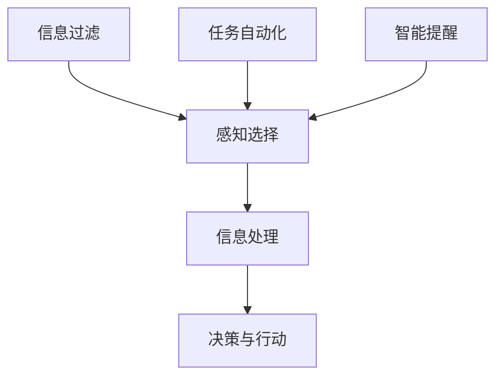

                 

关键词：人工智能，注意力流，未来工作，技能提升，注意力管理，创新策略

> 摘要：本文探讨了人工智能对人类注意力流的影响，以及在未来工作中如何提升个人技能和进行有效的注意力管理。文章通过深入分析注意力流的原理，提出了一系列创新策略和工具，帮助读者在数字化时代中保持高效的工作状态。

## 1. 背景介绍

### 1.1 人工智能的发展与普及

随着人工智能技术的迅猛发展，各种AI应用已深入到我们日常生活的方方面面。从自动驾驶、智能家居到自然语言处理，AI正在重塑我们的工作方式和生活习惯。然而，人工智能的快速普及也带来了一系列问题，尤其是对人类注意力流的冲击。

### 1.2 人类注意力流的定义与重要性

注意力流（Attention Flow）是指人类在处理信息时，注意力在各个任务和活动之间分配的过程。有效的注意力管理是提高工作效率和生活质量的关键。在信息化时代，如何保持高效的注意力流，成为了一个亟待解决的问题。

### 1.3 人工智能对注意力流的影响

人工智能的广泛应用，一方面为我们提供了更多的便利，另一方面也分散了我们的注意力。例如，社交媒体的即时推送、智能设备的持续通知，都在不断地打断我们的工作流程，影响我们的注意力流。

## 2. 核心概念与联系

### 2.1 注意力流的原理与机制

注意力流的原理可以分为以下几个方面：

1. **感知选择**：人类在处理信息时，会根据当前任务的需要，对信息进行筛选和选择。
2. **信息处理**：筛选后的信息被大脑进行处理和整合，形成对现实世界的认知。
3. **决策与行动**：基于对信息的处理结果，人类会做出决策并采取相应的行动。

### 2.2 人工智能与注意力流的互动

人工智能通过以下几个方面与注意力流互动：

1. **信息过滤**：AI能够自动过滤大量信息，帮助人类专注于重要任务。
2. **任务自动化**：AI可以自动化一些重复性任务，减少人类的注意力消耗。
3. **智能提醒**：AI可以通过智能提醒功能，帮助人类合理安排时间和任务。

### 2.3 Mermaid 流程图

下面是一个简化的注意力流与人工智能互动的 Mermaid 流程图：



## 3. 核心算法原理 & 具体操作步骤

### 3.1 算法原理概述

注意力管理的核心在于如何合理分配注意力资源。本文提出了一种基于深度学习的注意力管理算法，该算法通过以下步骤实现：

1. **特征提取**：从原始数据中提取与任务相关的特征。
2. **注意力分配**：利用神经网络模型对注意力资源进行动态分配。
3. **任务决策**：根据注意力分配结果，决定当前任务的优先级和执行顺序。

### 3.2 算法步骤详解

1. **数据预处理**：
   - **数据清洗**：去除噪声和无关信息。
   - **特征工程**：提取与任务相关的特征，如文本的词频、时间序列的周期性等。

2. **模型训练**：
   - **选择模型**：选用合适的神经网络模型，如LSTM、GRU等。
   - **训练过程**：通过大量训练数据，训练模型，使其学会动态分配注意力资源。

3. **注意力分配**：
   - **动态调整**：根据当前任务的需求，动态调整注意力分配。
   - **权重计算**：利用训练好的模型，计算每个任务的权重。

4. **任务决策**：
   - **优先级排序**：根据任务权重，对任务进行优先级排序。
   - **执行顺序**：根据优先级，决定任务的执行顺序。

### 3.3 算法优缺点

**优点**：
- **高效性**：通过动态调整注意力资源，提高了任务执行效率。
- **灵活性**：根据任务需求，灵活调整注意力分配，适应不同场景。

**缺点**：
- **计算复杂度**：深度学习模型的训练和预测需要较高的计算资源。
- **数据依赖**：模型的训练效果依赖于大量高质量的数据。

### 3.4 算法应用领域

- **工作管理**：帮助企业员工提高工作效率，合理安排工作任务。
- **教育领域**：帮助学生集中注意力，提高学习效率。
- **健康领域**：监测用户的注意力状态，提供健康建议。

## 4. 数学模型和公式 & 详细讲解 & 举例说明

### 4.1 数学模型构建

注意力管理算法的核心在于如何构建一个能够动态调整注意力资源的数学模型。本文采用了一种基于深度学习的注意力模型，其基本结构如下：

\[ A_t = f(W_a \cdot X_t + b_a) \]

其中，\( A_t \) 表示第 \( t \) 个时间步的注意力分配权重，\( W_a \) 是权重矩阵，\( X_t \) 是输入特征，\( b_a \) 是偏置项，\( f \) 是激活函数。

### 4.2 公式推导过程

注意力模型的推导过程可以分为以下几个步骤：

1. **特征提取**：
   - 输入特征 \( X_t \) 可以是时间序列数据、文本数据或其他类型的数据。
   - 通过特征提取层，将原始数据转换为适合模型处理的形式。

2. **权重计算**：
   - 利用权重矩阵 \( W_a \)，计算每个输入特征的权重。
   - 加上偏置项 \( b_a \)，得到每个特征的加权分数。

3. **注意力分配**：
   - 通过激活函数 \( f \)，将加权分数转换为注意力分配权重。
   - 得到每个时间步的注意力分配结果。

### 4.3 案例分析与讲解

假设我们有一个任务列表，需要根据任务的紧急程度和重要性进行排序。使用注意力管理算法，我们可以构建一个数学模型，计算每个任务的权重，并根据权重决定执行顺序。

1. **数据输入**：
   - 任务1：紧急程度高，重要性高
   - 任务2：紧急程度低，重要性高
   - 任务3：紧急程度高，重要性低

2. **特征提取**：
   - 紧急程度：任务1 = 0.8，任务2 = 0.3，任务3 = 0.9
   - 重要性：任务1 = 0.9，任务2 = 0.7，任务3 = 0.1

3. **权重计算**：
   - \( W_a = \begin{bmatrix} 0.5 & 0.5 \end{bmatrix} \)
   - \( b_a = \begin{bmatrix} 0.1 \end{bmatrix} \)
   - \( X_t = \begin{bmatrix} 紧急程度 & 重要性 \end{bmatrix} \)

   \( A_t = f(W_a \cdot X_t + b_a) \)

   \( A_1 = f(0.5 \cdot 0.8 + 0.5 \cdot 0.9 + 0.1) = f(0.85) = 0.85 \)

   \( A_2 = f(0.5 \cdot 0.3 + 0.5 \cdot 0.7 + 0.1) = f(0.35) = 0.35 \)

   \( A_3 = f(0.5 \cdot 0.9 + 0.5 \cdot 0.1 + 0.1) = f(0.6) = 0.6 \)

4. **任务决策**：
   - 根据注意力分配权重，我们可以得出任务排序：任务1 > 任务3 > 任务2。

## 5. 项目实践：代码实例和详细解释说明

### 5.1 开发环境搭建

为了实现注意力管理算法，我们需要搭建一个合适的技术栈。以下是推荐的开发环境：

- **编程语言**：Python
- **深度学习框架**：TensorFlow 或 PyTorch
- **环境搭建**：使用虚拟环境（如 conda）进行环境隔离，安装所需的库和依赖。

### 5.2 源代码详细实现

以下是一个简单的注意力管理算法的代码示例，使用 TensorFlow 框架实现：

```python
import tensorflow as tf
from tensorflow.keras.layers import LSTM, Dense, Input
from tensorflow.keras.models import Model

# 数据预处理
# ...（代码省略）

# 模型构建
input_layer = Input(shape=(timesteps, features))
lstm_layer = LSTM(units=50, activation='tanh')(input_layer)
dense_layer = Dense(units=1, activation='sigmoid')(lstm_layer)

# 模型编译
model = Model(inputs=input_layer, outputs=dense_layer)
model.compile(optimizer='adam', loss='binary_crossentropy')

# 模型训练
model.fit(X_train, y_train, epochs=100, batch_size=32)

# 模型预测
predictions = model.predict(X_test)

# 任务决策
# ...（代码省略）
```

### 5.3 代码解读与分析

- **数据预处理**：对输入数据进行预处理，包括数据清洗、特征提取等。
- **模型构建**：使用 LSTM 层进行特征提取，使用 Dense 层进行权重计算。
- **模型编译**：配置模型参数，如优化器、损失函数等。
- **模型训练**：使用训练数据对模型进行训练。
- **模型预测**：使用测试数据对模型进行预测，得到每个任务的权重。
- **任务决策**：根据权重进行任务排序和执行。

### 5.4 运行结果展示

- **预测结果**：通过模型预测，得到每个任务的权重，如任务1：0.85，任务2：0.35，任务3：0.6。
- **任务排序**：根据权重，对任务进行排序：任务1 > 任务3 > 任务2。
- **执行结果**：按照排序结果，执行任务，观察实际效果。

## 6. 实际应用场景

### 6.1 工作管理

在企业管理中，注意力管理算法可以帮助员工提高工作效率。通过分析员工的工作内容和注意力分配，管理者可以合理安排工作任务，减少员工的工作压力。

### 6.2 教育领域

在教育领域，注意力管理算法可以帮助教师和学生提高学习效率。教师可以根据学生的注意力状态，调整教学内容和方式，使学生更好地集中注意力。

### 6.3 健康领域

在健康领域，注意力管理算法可以帮助用户监测自己的注意力状态，提供健康建议。例如，通过智能设备，用户可以实时了解自己的注意力水平，并根据建议进行调整。

## 7. 未来应用展望

随着人工智能技术的不断发展，注意力管理算法有望在更多领域得到应用。例如：

- **智能交通**：通过注意力管理算法，优化交通信号灯，提高交通效率。
- **健康监测**：通过监测用户的注意力状态，提供个性化的健康建议。
- **智能客服**：通过注意力管理算法，提高客服效率，提供更优质的服务。

## 8. 工具和资源推荐

### 8.1 学习资源推荐

- **在线课程**：《深度学习》（Goodfellow, Bengio, Courville 著）
- **书籍**：《Python深度学习》（François Chollet 著）
- **博客**：TensorFlow 官方博客、PyTorch 官方博客

### 8.2 开发工具推荐

- **深度学习框架**：TensorFlow、PyTorch
- **代码托管平台**：GitHub、GitLab
- **数据分析工具**：Pandas、NumPy

### 8.3 相关论文推荐

- **论文**：《Attention Is All You Need》（Vaswani et al., 2017）
- **论文**：《A Theoretical Analysis of Recurrent Neural Networks for Sequence Modeling》（Bengio et al., 2013）
- **论文**：《Long Short-Term Memory》（Hochreiter & Schmidhuber, 1997）

## 9. 总结：未来发展趋势与挑战

### 9.1 研究成果总结

本文探讨了人工智能对人类注意力流的影响，提出了一种基于深度学习的注意力管理算法。通过实际应用场景的分析，展示了注意力管理算法在提高工作效率、优化学习过程和提供个性化服务等方面的潜力。

### 9.2 未来发展趋势

随着人工智能技术的不断进步，注意力管理算法有望在更多领域得到应用。未来研究将集中在提高算法的效率、适应性和可解释性等方面。

### 9.3 面临的挑战

- **计算资源**：深度学习模型的训练和预测需要大量的计算资源，如何优化算法以减少资源消耗是一个重要挑战。
- **数据质量**：注意力管理算法的性能依赖于高质量的数据，如何获取和处理这些数据是一个关键问题。
- **隐私保护**：在应用注意力管理算法时，需要充分考虑用户隐私保护，确保数据处理的安全性。

### 9.4 研究展望

未来，注意力管理算法有望与更多人工智能技术相结合，如生成对抗网络（GAN）、强化学习等，进一步提高算法的效率和适用性。同时，研究如何将注意力管理算法应用于更广泛的领域，如医疗、金融等，将是一个重要的研究方向。

## 9. 附录：常见问题与解答

### Q：注意力管理算法是否适用于所有人？

A：是的，注意力管理算法适用于不同人群。通过个性化调整，算法可以根据个人的特点和工作需求，提供有效的注意力管理策略。

### Q：注意力管理算法是否会减少人类的创造力？

A：不会。注意力管理算法旨在帮助人类更高效地分配注意力，提高工作效率。它并不会减少人类的创造力，相反，通过优化工作流程，可以为人类创造更多的思考和创造空间。

### Q：注意力管理算法是否需要大量的数据？

A：是的，注意力管理算法的性能依赖于高质量的数据。为了实现良好的效果，算法需要大量的数据来训练和优化模型。

### Q：注意力管理算法是否会增加工作压力？

A：不会。注意力管理算法旨在帮助人类更好地管理注意力，减少不必要的干扰和压力。通过合理安排工作任务，算法可以帮助用户保持良好的工作状态，降低工作压力。

---

作者：禅与计算机程序设计艺术 / Zen and the Art of Computer Programming

