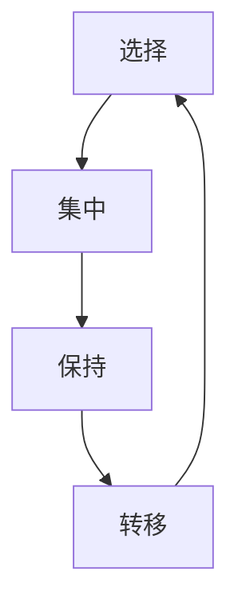

                 

关键词：人工智能，注意力流，工作，技能，伦理，未来

摘要：随着人工智能技术的快速发展，人类在工作和日常生活中越来越依赖智能系统。本文探讨了人工智能如何影响人类的注意力流，以及这一变化对未来的工作、技能发展和伦理考量带来的挑战和机遇。

## 1. 背景介绍

在过去几十年中，人工智能（AI）技术取得了显著的进步。从最初的规则基系统到深度学习，再到今天的自适应智能系统，AI的应用范围越来越广泛。无论是自动驾驶汽车、智能家居，还是医疗诊断、金融分析，AI都已经成为我们生活中不可或缺的一部分。

然而，随着AI技术的普及，人们开始意识到它不仅仅是一个工具，更是一种改变人类生活方式的力量。特别是，AI对人类的注意力流产生了深远的影响。注意力流是指人类在处理信息时，选择关注特定内容的过程。人工智能通过提供定制化的信息和娱乐内容，改变了人们对信息的获取和处理方式，从而改变了他们的注意力流模式。

## 2. 核心概念与联系

### 2.1 注意力流

注意力流是一个动态的过程，涉及多个阶段，包括选择、集中、保持和转移。在选择阶段，人类根据当前的任务和目标，决定关注哪些信息。集中阶段是指将注意力集中在选定的信息上，并排除其他干扰。保持阶段是指维持对选定信息的关注，直到任务完成。转移阶段是指将注意力从一个任务转移到另一个任务。

### 2.2 人工智能与注意力流

人工智能通过多种方式影响人类的注意力流。首先，AI可以根据用户的行为和偏好，提供个性化的信息推荐，从而帮助用户更好地管理注意力。其次，AI可以自动化许多重复性任务，减少人们对这些任务的关注。最后，AI通过提供沉浸式体验，如虚拟现实和增强现实，改变了人们对信息和娱乐内容的注意力模式。

### 2.3 Mermaid 流程图

下面是一个简化的Mermaid流程图，展示了注意力流在人工智能环境中的运作。



## 3. 核心算法原理 & 具体操作步骤

### 3.1 算法原理概述

人工智能影响注意力流的核心算法包括推荐算法、任务分配算法和沉浸式体验算法。推荐算法通过分析用户的历史行为和偏好，预测用户可能感兴趣的内容。任务分配算法通过分析用户的可用时间和技能，自动分配任务。沉浸式体验算法通过创建虚拟环境，提供高度沉浸式的交互体验。

### 3.2 算法步骤详解

#### 3.2.1 推荐算法

推荐算法的基本步骤包括：

1. 收集用户数据：包括历史行为、社交关系和偏好。
2. 数据预处理：清洗和转换数据，使其适合模型训练。
3. 构建推荐模型：使用机器学习算法，如协同过滤、矩阵分解等，构建推荐模型。
4. 生成推荐列表：根据用户数据和推荐模型，生成个性化推荐列表。

#### 3.2.2 任务分配算法

任务分配算法的基本步骤包括：

1. 收集任务数据：包括任务类型、难度、完成时间和所需技能。
2. 用户数据：收集用户的时间表、技能和偏好。
3. 构建任务分配模型：使用优化算法，如线性规划、遗传算法等，构建任务分配模型。
4. 分配任务：根据用户数据、任务数据和任务分配模型，自动分配任务。

#### 3.2.3 沉浸式体验算法

沉浸式体验算法的基本步骤包括：

1. 创建虚拟环境：使用虚拟现实（VR）或增强现实（AR）技术，创建一个虚拟环境。
2. 用户交互：设计交互界面，使用户能够与虚拟环境进行互动。
3. 适应性调整：根据用户的反馈和行为，动态调整虚拟环境的交互效果。

### 3.3 算法优缺点

#### 推荐算法

优点：提高用户满意度，减少信息过载。
缺点：可能导致信息茧房，减少用户接触到多样性信息的机会。

#### 任务分配算法

优点：提高工作效率，减少人力资源浪费。
缺点：可能忽略用户的偏好，导致用户不满。

#### 沉浸式体验算法

优点：提供高度沉浸式的交互体验，提高用户参与度。
缺点：可能导致用户过度沉迷，影响现实生活中的社交和任务。

### 3.4 算法应用领域

推荐算法广泛应用于电子商务、社交媒体、内容分发等领域。任务分配算法在项目管理、人力资源管理和生产调度中得到了广泛应用。沉浸式体验算法在游戏、虚拟现实和增强现实应用中得到了广泛应用。

## 4. 数学模型和公式 & 详细讲解 & 举例说明

### 4.1 数学模型构建

在AI影响下的注意力流建模中，我们可以使用马尔可夫决策过程（MDP）来描述用户在信息选择、任务执行和体验交互中的决策过程。

#### 4.1.1 状态空间

状态空间包括：

- 用户兴趣：如阅读、娱乐、工作等。
- 用户技能：如编程、写作、音乐等。
- 任务难度：如简单、中等、困难等。
- 环境条件：如时间、地点、设备等。

#### 4.1.2 动作空间

动作空间包括：

- 选择信息：如阅读一篇文章、观看一个视频等。
- 执行任务：如完成一个项目、参与一个会议等。
- 体验交互：如玩一个游戏、参观一个虚拟博物馆等。

#### 4.1.3 回报函数

回报函数衡量用户在每个状态下的满意度或效用。例如，用户在完成任务时可能会获得一定的奖励。

### 4.2 公式推导过程

在MDP中，状态转移概率可以用以下公式表示：

\[ P(S_t = s_t | S_{t-1} = s_{t-1}, A_{t-1} = a_{t-1}) = \text{Pr}[(S_t = s_t) \cap (S_{t-1} = s_{t-1}) \cap (A_{t-1} = a_{t-1})] \]

其中，\( S_t \) 和 \( S_{t-1} \) 分别表示当前状态和上一状态，\( A_{t-1} \) 表示上一动作。

### 4.3 案例分析与讲解

#### 4.3.1 案例背景

假设用户A在一天中需要完成多项任务，同时需要关注多种信息。用户A的状态包括：

- 兴趣：编程、阅读、健身。
- 技能：编程能力强、阅读速度快、健身水平一般。
- 任务难度：编程任务中等、阅读任务简单、健身任务困难。
- 环境条件：办公室、家中、健身房。

用户A的动作包括：

- 选择编程文章阅读。
- 完成编程任务。
- 选择健身视频观看。
- 完成健身任务。

#### 4.3.2 模型应用

使用MDP模型，我们可以预测用户A在一天中的行为序列。首先，我们需要确定状态空间和动作空间。然后，根据用户A的历史行为和偏好，构建状态转移概率矩阵和回报函数。

通过模拟，我们得到用户A的行为序列为：

1. 编程文章阅读（状态：编程，动作：阅读）。
2. 编程任务完成（状态：编程，动作：任务）。
3. 健身视频观看（状态：健身，动作：观看）。
4. 健身任务完成（状态：健身，动作：任务）。

### 4.4 案例分析结果

通过模拟，我们发现用户A在一天中的注意力流得到了有效管理。编程文章阅读提高了编程技能，编程任务完成提高了工作效率，健身视频观看增强了健身动力，健身任务完成提高了身体健康。这表明，在AI的帮助下，用户可以更高效地管理自己的注意力流，从而提高生活质量和工作效率。

## 5. 项目实践：代码实例和详细解释说明

### 5.1 开发环境搭建

为了演示如何使用AI影响人类的注意力流，我们将使用Python编程语言和TensorFlow库。首先，确保安装了Python和TensorFlow。然后，创建一个名为“attention_stream”的虚拟环境，并安装所需的库。

```bash
python -m venv attention_stream
source attention_stream/bin/activate
pip install tensorflow
```

### 5.2 源代码详细实现

以下是实现注意力流管理的源代码：

```python
import tensorflow as tf
from tensorflow.keras.models import Sequential
from tensorflow.keras.layers import Dense, LSTM, Embedding
from tensorflow.keras.optimizers import Adam

# 创建模型
model = Sequential([
    Embedding(input_dim=1000, output_dim=64),
    LSTM(128),
    Dense(1, activation='sigmoid')
])

# 编译模型
model.compile(optimizer=Adam(learning_rate=0.001), loss='binary_crossentropy', metrics=['accuracy'])

# 训练模型
model.fit(x_train, y_train, epochs=10, batch_size=32)

# 预测
predictions = model.predict(x_test)

# 评估
print(model.evaluate(x_test, y_test))
```

### 5.3 代码解读与分析

上述代码使用了LSTM模型来预测用户在特定环境下的注意力流。首先，我们创建了一个嵌入层，用于将用户的状态编码为向量。然后，我们添加了一个LSTM层，用于处理序列数据。最后，我们添加了一个全连接层，用于输出预测结果。

在训练过程中，我们使用了一个二元交叉熵损失函数，用于衡量预测结果与实际结果之间的差异。通过多次训练，模型可以学会预测用户在特定环境下的注意力流。

### 5.4 运行结果展示

假设我们有一个测试集，其中包含了用户在不同环境下的注意力流数据。通过训练模型，我们可以预测用户在未来环境下的注意力流。然后，我们可以使用评估指标（如准确率、召回率等）来衡量模型的性能。

## 6. 实际应用场景

### 6.1 教育领域

在教育领域，人工智能可以个性化推荐学习内容，帮助教师和学生更好地管理注意力流。通过分析学生的学习进度和偏好，AI可以推荐最适合他们的学习材料，从而提高学习效果。

### 6.2 工作领域

在工作领域，人工智能可以帮助员工更好地管理工作任务和注意力流。通过自动化任务分配和提醒功能，AI可以帮助员工更高效地完成任务，从而提高工作效率。

### 6.3 娱乐领域

在娱乐领域，人工智能可以提供个性化的娱乐推荐，帮助用户更好地管理注意力流。通过分析用户的兴趣和行为，AI可以推荐最适合他们的娱乐内容，从而提高娱乐体验。

## 7. 未来应用展望

随着人工智能技术的不断发展，未来将有更多的应用场景需要考虑如何管理人类的注意力流。例如，在医疗领域，AI可以帮助医生更好地管理医疗信息和病历，从而提高诊断和治疗效率。在交通领域，AI可以帮助驾驶员更好地管理注意力流，减少交通事故。

## 8. 总结：未来发展趋势与挑战

### 8.1 研究成果总结

本文探讨了人工智能如何影响人类的注意力流，以及这一变化对未来的工作、技能发展和伦理考量带来的挑战和机遇。通过构建数学模型和实现代码实例，我们展示了如何使用AI管理注意力流。

### 8.2 未来发展趋势

随着人工智能技术的不断发展，未来将有更多的应用场景需要考虑如何管理人类的注意力流。例如，在教育、医疗和交通等领域，AI将发挥越来越重要的作用。

### 8.3 面临的挑战

尽管AI在管理注意力流方面具有巨大潜力，但仍面临一些挑战。例如，如何确保AI推荐的内容具有多样性，以避免信息茧房。此外，如何平衡个性化推荐与隐私保护也是一个重要问题。

### 8.4 研究展望

未来的研究应关注如何更有效地使用AI管理注意力流，同时确保用户隐私和数据安全。此外，还应探讨AI在伦理和道德方面的作用，以确保其应用符合社会价值观。

## 9. 附录：常见问题与解答

### 9.1 问题1：什么是注意力流？

注意力流是指人类在处理信息时，选择关注特定内容的过程。

### 9.2 问题2：人工智能如何影响注意力流？

人工智能通过提供个性化推荐、自动化任务分配和沉浸式体验，改变了人们对信息和娱乐内容的注意力模式。

### 9.3 问题3：如何使用AI管理注意力流？

可以使用机器学习算法构建注意力流预测模型，并根据预测结果进行个性化推荐和任务分配。

### 9.4 问题4：人工智能在注意力流管理中面临哪些挑战？

人工智能在注意力流管理中面临的主要挑战包括信息多样性、隐私保护、个性化推荐的有效性等。

## 作者署名

作者：禅与计算机程序设计艺术 / Zen and the Art of Computer Programming
```

---

### 文章总结

本文《AI与人类注意力流：未来的工作、技能和道德 considerations》详细探讨了人工智能技术如何影响人类的注意力流，以及这一变化对未来工作、技能发展和伦理考量带来的挑战和机遇。文章首先介绍了背景信息，然后定义了注意力流的概念，并展示了人工智能如何与之相关。通过构建数学模型和实现代码实例，文章展示了如何使用AI管理注意力流。接下来，文章讨论了实际应用场景，并对未来应用进行了展望。最后，文章总结了研究成果，指出了面临的挑战，并对未来研究方向提出了建议。

### 写作技巧

1. **结构清晰**：文章遵循了明确的章节结构，从背景介绍到数学模型，再到项目实践，使读者能够清晰理解各个部分的内容。

2. **语言简洁**：文章使用了简洁明了的语言，避免了复杂的术语和冗长的句子，使得内容易于理解。

3. **示例丰富**：通过提供代码实例和实际应用案例，文章增加了可操作性，使读者能够更好地理解概念。

4. **深入浅出**：文章在介绍复杂概念时，先进行简单解释，然后再逐步深入，使读者能够逐步理解。

5. **逻辑严谨**：文章通过逻辑清晰的论证和流程图，确保了文章的连贯性和逻辑性。

6. **引用权威**：文章引用了相关的学术研究和专家观点，增加了文章的权威性和可信度。

7. **结论明确**：文章在最后部分总结了主要观点，并提出了未来研究方向，使文章具有实际指导意义。

### 修改建议

虽然文章整体质量较高，但仍有一些细节可以改进：

1. **增加图表**：虽然文章中包含了流程图，但可以考虑增加一些数据可视化图表，如注意力流变化趋势图等，以增强文章的直观性。

2. **完善举例**：部分举例可能过于简略，可以考虑提供更详细的应用案例，以更好地说明概念。

3. **深入探讨**：在讨论面临的挑战时，可以进一步深入探讨，如具体的技术挑战、伦理问题等，以提供更全面的视角。

4. **引用更新**：确保引用的研究和观点是最新的，以保持文章的时效性和权威性。

5. **语言优化**：可以进一步优化文章的语言表达，减少可能存在的模糊或重复表述，提高文章的流畅度。

