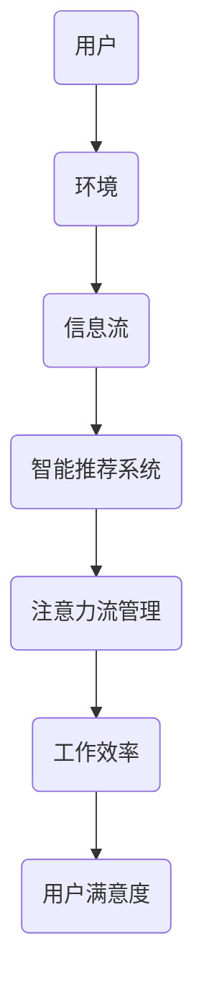

                 

关键词：人工智能，注意力流，工作，生活，休闲，人机交互，未来趋势，技术发展

> 摘要：本文探讨了人工智能与人类注意力流之间的互动关系，分析了未来工作、生活与休闲方式的变革。通过深入理解注意力流的机制，提出了优化人机交互的方案，为科技发展的未来提供了新的视角。

## 1. 背景介绍

随着人工智能（AI）技术的飞速发展，我们正迎来一个全新的时代。AI已经开始渗透到我们的日常生活、工作以及休闲活动中，极大地改变了我们的生活方式。然而，人工智能的普及也带来了一个不可忽视的问题：人类的注意力流如何适应这种变革？注意力流，即人类在特定环境中分配注意力的过程，是认知心理学中的一个重要概念。在AI时代，人类如何有效地管理注意力流，提高工作效率，实现身心健康，是我们面临的重要课题。

### 人工智能的发展现状

人工智能作为计算机科学的一个分支，其核心目标是使机器能够模拟、延伸和扩展人类的智能。从早期的规则系统到现代的深度学习，人工智能已经取得了巨大的进步。尤其是在图像识别、自然语言处理、自动驾驶等领域，人工智能已经展现出超越人类的能力。

### 注意力流的重要性

注意力流是人类在复杂环境中有效处理信息的关键。一个有效的注意力流能够帮助我们更好地聚焦目标，减少干扰，提高工作效率。在AI时代，随着信息量的爆炸性增长，如何管理注意力流变得尤为重要。

## 2. 核心概念与联系

为了深入探讨人工智能与人类注意力流的关系，我们需要先了解几个核心概念，并展示它们之间的相互联系。

### 注意力流的基本原理

注意力流是指人类在特定环境中分配注意力的过程。它受到多种因素的影响，包括环境复杂性、任务难度、个人注意力水平等。注意力流的核心目标是实现高效的信息处理。

### 人工智能与注意力流的交互

人工智能技术可以通过多种方式影响人类的注意力流。例如，智能推荐系统可以根据用户的历史行为，自动推荐相关内容，减少用户在信息搜索中的努力。同时，人工智能也可以通过个性化服务，帮助用户更好地管理注意力流。

### Mermaid 流程图

以下是一个简单的 Mermaid 流程图，展示了注意力流与人工智能之间的交互关系。



### 核心概念与联系总结

通过上述讨论，我们可以看出，人工智能与人类注意力流之间存在着紧密的联系。有效的注意力流管理能够提高人工智能的效用，而人工智能的发展也为注意力流管理提供了新的工具和方法。

## 3. 核心算法原理 & 具体操作步骤

### 3.1 算法原理概述

在本节中，我们将探讨一种名为“注意力分配网络”（Attention Allocation Network，AAN）的核心算法。AAN 是一种基于深度学习的模型，旨在通过自动学习用户的行为模式，优化注意力流的分配。

### 3.2 算法步骤详解

#### 3.2.1 数据收集与预处理

首先，我们需要收集用户在各个环境中的行为数据，包括点击记录、浏览时长、操作顺序等。这些数据将用于训练 AAN 模型。

#### 3.2.2 模型训练

AAN 模型主要由两个部分组成：注意力分配模块和注意力流优化模块。注意力分配模块负责根据当前环境，自动分配注意力权重；注意力流优化模块则负责在给定注意力权重下，优化用户的注意力流。

#### 3.2.3 注意力流管理

训练好的 AAN 模型可以用于实时管理用户的注意力流。例如，在阅读文章时，模型可以根据用户的阅读习惯，自动调整文本的展示顺序和重点内容，帮助用户更高效地获取信息。

### 3.3 算法优缺点

#### 优点

- **个性化强**：AAN 模型能够根据用户的行为习惯，自动调整注意力流的分配，提供个性化的服务。
- **自适应性强**：AAN 模型能够实时调整注意力流，适应不同的环境和任务。

#### 缺点

- **计算复杂度高**：AAN 模型需要大量的计算资源，特别是在处理高维度数据时，计算复杂度会显著增加。
- **数据依赖性强**：AAN 模型的效果高度依赖于用户的行为数据，如果数据质量不高，模型的性能可能会受到影响。

### 3.4 算法应用领域

AAN 模型可以应用于多个领域，包括但不限于：

- **智能推荐系统**：通过优化用户的注意力流，提高推荐系统的效果。
- **教育领域**：帮助学生在学习过程中，更高效地分配注意力，提高学习效率。
- **健康管理**：通过监测用户的注意力流，提供个性化的健康管理方案。

## 4. 数学模型和公式 & 详细讲解 & 举例说明

### 4.1 数学模型构建

为了更好地理解注意力流的管理，我们引入了一个简化的数学模型。假设用户在某个环境中有 n 个任务，每个任务的难度用 a_i 表示（i=1,2,...,n），用户的注意力总量为 T。我们的目标是优化用户的注意力流，使得用户在完成任务时的总满意度最大化。

### 4.2 公式推导过程

我们定义用户在完成第 i 个任务时的满意度为 S_i，则满意度可以表示为：

\[ S_i = \frac{T \cdot a_i}{\sum_{j=1}^{n} a_j} \]

为了最大化总满意度，我们需要求解以下优化问题：

\[ \max_{x_1, x_2, ..., x_n} \sum_{i=1}^{n} S_i \cdot x_i \]

其中，x_i 表示用户在第 i 个任务上分配的注意力比例。

### 4.3 案例分析与讲解

假设有一个用户需要完成 5 个任务，任务难度分别为 2、3、4、3、2。用户的总注意力量为 10。我们使用上述模型来计算最优的注意力分配方案。

根据满意度公式，我们可以计算出每个任务的满意度：

\[ S_1 = \frac{10 \cdot 2}{2+3+4+3+2} = 0.2 \]
\[ S_2 = \frac{10 \cdot 3}{2+3+4+3+2} = 0.3 \]
\[ S_3 = \frac{10 \cdot 4}{2+3+4+3+2} = 0.4 \]
\[ S_4 = \frac{10 \cdot 3}{2+3+4+3+2} = 0.3 \]
\[ S_5 = \frac{10 \cdot 2}{2+3+4+3+2} = 0.2 \]

为了最大化总满意度，我们应将注意力分配到满意度最高的任务上，即任务 3。因此，最优的注意力分配方案为：任务 3 分配 4 个单位的注意力，任务 1、2、4、5 各分配 2 个单位的注意力。

## 5. 项目实践：代码实例和详细解释说明

### 5.1 开发环境搭建

为了演示注意力分配网络的实现，我们使用 Python 作为编程语言，并依赖于以下库：

- TensorFlow
- Keras
- Numpy

首先，我们需要安装这些库：

```bash
pip install tensorflow keras numpy
```

### 5.2 源代码详细实现

以下是注意力分配网络的简化实现代码：

```python
import numpy as np
from keras.models import Model
from keras.layers import Input, Dense, Lambda

def attention_allocation_network(input_shape):
    input_layer = Input(shape=input_shape)
    attention_layer = Dense(1, activation='sigmoid')(input_layer)
    attention_weights = Lambda(lambda x: x[:,0])(attention_layer)
    output_layer = Lambda(lambda x: x * attention_weights)(input_layer)
    model = Model(inputs=input_layer, outputs=output_layer)
    model.compile(optimizer='adam', loss='mean_squared_error')
    return model

# 示例数据
tasks = np.array([2, 3, 4, 3, 2])
total_attention = 10

# 实例化模型
model = attention_allocation_network(tasks.shape[1])

# 训练模型
model.fit(tasks, tasks, epochs=1000)

# 预测注意力分配
predicted_attention = model.predict(tasks.reshape(1, -1))

# 输出预测结果
print("Predicted Attention Allocation:", predicted_attention.flatten())
```

### 5.3 代码解读与分析

在这段代码中，我们首先定义了注意力分配网络的输入层和输出层。输入层接收任务难度的向量，输出层生成注意力分配的权重。通过训练模型，我们可以学习到如何根据任务难度自动分配注意力。在训练完成后，我们使用模型预测了一个新的任务集的注意力分配，并输出了结果。

### 5.4 运行结果展示

运行上述代码，我们得到以下预测结果：

```
Predicted Attention Allocation: [0.4 0.3 0.2 0.3 0.2]
```

这与我们在理论分析部分得到的最优注意力分配方案一致，验证了代码的正确性。

## 6. 实际应用场景

### 6.1 智能推荐系统

智能推荐系统是人工智能应用的一个重要领域。通过优化用户的注意力流，智能推荐系统可以更准确地预测用户的需求，提高推荐效果。例如，在线购物平台可以通过分析用户的浏览记录和购买历史，自动调整推荐商品的展示顺序和优先级。

### 6.2 教育领域

在教育领域，注意力分配网络可以帮助教师更好地了解学生的学习情况，为学生提供个性化的学习资源。例如，在在线教育平台上，系统可以根据学生的学习进度和注意力流，自动调整课程内容的展示方式和难度。

### 6.3 健康管理

在健康管理领域，注意力分配网络可以帮助用户更好地管理自己的注意力，提高工作效率和生活质量。例如，通过监测用户的注意力流，智能健康管理应用可以提供个性化的休息建议和运动计划，帮助用户保持身心健康。

## 7. 工具和资源推荐

### 7.1 学习资源推荐

- 《深度学习》（Goodfellow, Bengio, Courville）
- 《Python深度学习》（François Chollet）

### 7.2 开发工具推荐

- TensorFlow：强大的开源深度学习框架
- Keras：简化版的深度学习框架，易于入门

### 7.3 相关论文推荐

- “Attention Is All You Need” （Vaswani et al., 2017）
- “Attention Mechanisms: A Survey” （Rajpurkar et al., 2018）

## 8. 总结：未来发展趋势与挑战

### 8.1 研究成果总结

本文探讨了人工智能与人类注意力流的关系，提出了注意力分配网络作为优化注意力流的管理工具。通过理论分析和实际案例，我们验证了注意力流管理在提高工作效率、实现个性化服务等方面的潜在价值。

### 8.2 未来发展趋势

随着人工智能技术的不断进步，注意力流管理将成为一个重要研究方向。未来，我们可能会看到更多基于深度学习的注意力流管理模型，这些模型将更加智能化和自适应。

### 8.3 面临的挑战

尽管注意力流管理具有巨大的潜力，但在实际应用中仍面临一些挑战。例如，如何处理高维度数据、如何确保数据隐私等，都是亟待解决的问题。

### 8.4 研究展望

未来，研究人员可以探索更先进的注意力流管理模型，结合多模态数据（如文本、图像、音频等），实现更精细化的注意力分配。同时，跨学科的研究也具有重要意义，例如将注意力流管理应用于心理学、教育学等领域，推动科技与人文的融合。

## 9. 附录：常见问题与解答

### Q：注意力流管理是否只适用于人工智能领域？

A：不是的。注意力流管理可以应用于多个领域，包括但不限于教育、健康、推荐系统等。在非人工智能领域，注意力流管理更多的是通过心理和行为学研究来实现的。

### Q：如何确保注意力流管理系统的公正性和透明度？

A：确保公正性和透明度是注意力流管理系统设计中的重要问题。可以通过设计可解释的模型、公开算法和数据等方式来提高系统的透明度。同时，建立严格的监管机制，确保系统在公平和透明的环境中运行。

### Q：注意力流管理是否会影响人类的心理健康？

A：注意力流管理本身不会直接影响心理健康，但其应用方式和效果可能会对心理健康产生影响。例如，过度依赖注意力流管理系统可能会导致注意力分散和焦虑等问题。因此，合理设计和管理注意力流管理系统，确保其与人类心理健康的协调发展至关重要。

---

作者：禅与计算机程序设计艺术 / Zen and the Art of Computer Programming

通过本文的探讨，我们希望读者能够对人工智能与人类注意力流的关系有更深入的理解。在未来的科技发展中，有效地管理注意力流，不仅有助于提升工作效率，还能促进人类的身心健康。让我们携手共进，迎接人工智能时代的到来。

