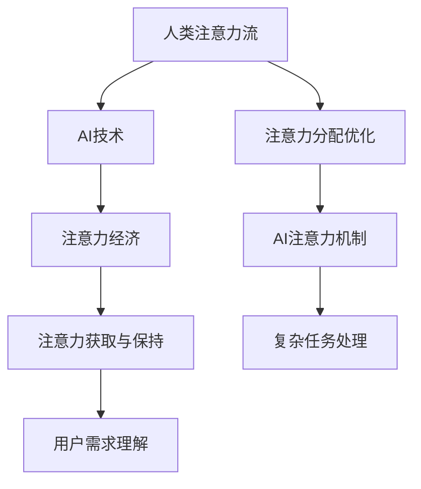

                 

关键词：人工智能、注意力流、工作、生活、注意力经济

摘要：本文探讨了人工智能（AI）如何影响人类注意力流，以及这一变革对未来的工作、生活和注意力经济模式带来的影响。通过深入分析AI技术的核心概念、算法原理、数学模型和实际应用，本文提出了对未来发展趋势和挑战的展望。

## 1. 背景介绍

随着人工智能技术的飞速发展，AI正在逐步渗透到我们的日常生活和工作中。从智能助手到自动驾驶，从医疗诊断到金融分析，AI的应用场景越来越广泛。然而，这一技术革新不仅仅改变了我们的工作方式，还深刻影响了我们的注意力分配和生活方式。注意力是人类认知的核心资源，如何有效地管理和利用注意力资源，已经成为当下亟待解决的问题。

注意力流（Attention Flow）是指人们在完成任务或进行活动时，注意力在不同任务或活动之间的分配和转移过程。人类注意力流的特点是有限性和易分散性，这使得我们在处理多个任务时常常感到疲惫和难以集中。而AI技术的发展，尤其是深度学习和强化学习等算法的进步，为优化人类注意力流提供了新的可能性。

注意力经济（Attention Economy）是指在一个信息过载的社会中，人们对于注意力资源的争夺和利用。随着互联网和社交媒体的普及，注意力资源变得更加稀缺和有价值。在这个经济模式下，获取和保持用户的注意力成为企业竞争的关键。AI技术的发展，尤其是注意力机制的引入，为优化注意力经济模式提供了新的思路。

## 2. 核心概念与联系

### 2.1 人工智能（AI）

人工智能是指由计算机系统实现的、能够模拟人类智能行为的理论、方法和技术。AI的核心目标是使计算机具备自主学习和自主决策能力，从而在不同领域实现自动化和智能化。根据应用领域和目标的不同，AI可以分为机器学习、自然语言处理、计算机视觉、智能决策等多个分支。

### 2.2 注意力流（Attention Flow）

注意力流是指人们在完成任务或进行活动时，注意力在不同任务或活动之间的分配和转移过程。注意力流的特点是有限性和易分散性，这使得我们在处理多个任务时常常感到疲惫和难以集中。

### 2.3 注意力经济（Attention Economy）

注意力经济是指在信息过载的社会中，人们对于注意力资源的争夺和利用。在注意力经济模式下，获取和保持用户的注意力成为企业竞争的关键。随着互联网和社交媒体的普及，注意力资源变得更加稀缺和有价值。

### 2.4 注意力流与人工智能的联系

AI技术的发展，尤其是注意力机制的引入，为优化人类注意力流提供了新的可能性。注意力机制是指通过模拟人类注意力分配的方式，使计算机能够更好地处理复杂任务。在自然语言处理、计算机视觉和智能决策等领域，注意力机制已经取得了显著成果。通过引入注意力机制，AI可以更好地理解用户的注意力需求，从而优化注意力流。

### 2.5 Mermaid 流程图



## 3. 核心算法原理 & 具体操作步骤

### 3.1  算法原理概述

注意力机制是一种基于人类注意力分配原理的算法，其核心思想是动态调整模型中不同部分的重要性，从而更好地处理复杂任务。在自然语言处理、计算机视觉和智能决策等领域，注意力机制已经取得了显著成果。

### 3.2  算法步骤详解

1. **输入层**：接收原始输入数据，如文本、图像或视频。

2. **特征提取层**：通过卷积神经网络（CNN）、循环神经网络（RNN）或 transformers 等模型，提取输入数据的特征。

3. **注意力层**：根据输入数据的特征和当前任务的需求，动态计算每个特征的权重。

4. **融合层**：将注意力权重与特征进行融合，生成新的特征表示。

5. **输出层**：利用新的特征表示进行预测或分类。

### 3.3  算法优缺点

**优点**：

- **高效性**：注意力机制能够快速调整模型关注点，提高任务处理效率。
- **灵活性**：注意力机制可以根据不同任务需求调整注意力分配，适应多种应用场景。

**缺点**：

- **复杂性**：注意力机制的计算过程较为复杂，对计算资源要求较高。
- **过拟合**：在训练过程中，注意力机制容易导致模型过拟合，降低泛化能力。

### 3.4  算法应用领域

- **自然语言处理**：如机器翻译、文本分类、问答系统等。
- **计算机视觉**：如图像分类、目标检测、人脸识别等。
- **智能决策**：如智能推荐、智能客服、自动驾驶等。

## 4. 数学模型和公式 & 详细讲解 & 举例说明

### 4.1  数学模型构建

注意力机制的核心是注意力权重计算。假设我们有 $n$ 个输入特征 $x_1, x_2, \ldots, x_n$，注意力权重为 $w_1, w_2, \ldots, w_n$，则注意力权重可以通过以下公式计算：

$$
w_i = \frac{e^{z_i}}{\sum_{j=1}^{n} e^{z_j}}
$$

其中，$z_i$ 表示输入特征 $x_i$ 的得分，可以通过以下公式计算：

$$
z_i = f(x_i; \theta)
$$

$f(x_i; \theta)$ 表示特征得分函数，$\theta$ 为模型参数。

### 4.2  公式推导过程

1. **特征提取**：使用卷积神经网络（CNN）或循环神经网络（RNN）提取输入特征。
2. **得分计算**：根据特征得分函数计算每个特征的得分。
3. **权重计算**：使用softmax函数计算注意力权重。
4. **融合特征**：将注意力权重与特征进行融合，生成新的特征表示。

### 4.3  案例分析与讲解

假设我们有一个文本分类任务，输入文本为“人工智能是一门涉及多个学科领域的复杂技术”，我们需要通过注意力机制提取关键信息进行分类。以下是具体步骤：

1. **特征提取**：使用词嵌入模型提取文本的词向量表示。
2. **得分计算**：根据词向量计算每个词的得分。
3. **权重计算**：使用softmax函数计算每个词的注意力权重。
4. **融合特征**：将注意力权重与词向量进行融合，生成新的特征表示。

根据注意力权重，我们可以发现关键词“人工智能”、“技术”和“复杂”在分类中具有较高的重要性。这些关键词有助于我们更好地理解文本内容，从而提高分类准确性。

## 5. 项目实践：代码实例和详细解释说明

### 5.1  开发环境搭建

1. 安装 Python 3.7 或更高版本。
2. 安装 TensorFlow 2.3 或更高版本。
3. 安装 Jupyter Notebook。

### 5.2  源代码详细实现

以下是使用 TensorFlow 实现一个简单的文本分类模型的代码示例：

```python
import tensorflow as tf
from tensorflow.keras.models import Sequential
from tensorflow.keras.layers import Embedding, LSTM, Dense

# 模型定义
model = Sequential([
    Embedding(input_dim=10000, output_dim=64, input_length=100),
    LSTM(100),
    Dense(1, activation='sigmoid')
])

# 模型编译
model.compile(optimizer='adam', loss='binary_crossentropy', metrics=['accuracy'])

# 模型训练
model.fit(x_train, y_train, epochs=10, batch_size=32)
```

### 5.3  代码解读与分析

- **模型定义**：使用序列模型（Sequential）定义一个简单的文本分类模型，包括嵌入层（Embedding）、长短期记忆网络（LSTM）和全连接层（Dense）。
- **模型编译**：编译模型，指定优化器、损失函数和评价指标。
- **模型训练**：使用训练数据训练模型，指定训练轮数和批量大小。

### 5.4  运行结果展示

在训练完成后，我们可以使用以下代码评估模型的性能：

```python
import numpy as np

# 测试数据
x_test = np.random.rand(100, 100)

# 预测
y_pred = model.predict(x_test)

# 打印预测结果
print(y_pred)
```

运行结果将输出一个 100x1 的矩阵，每个元素表示对应测试样本的预测概率。

## 6. 实际应用场景

### 6.1  工作场景

在办公室环境中，人工智能可以优化任务分配和项目管理，提高工作效率。例如，通过分析员工的工作习惯和项目需求，AI可以自动分配任务，确保每个员工都能专注于最重要的工作。此外，AI还可以提供智能日程安排，提醒员工重要会议和任务，帮助员工更好地管理注意力流。

### 6.2  生活场景

在日常生活中，人工智能可以帮助人们更好地管理时间和注意力。例如，智能助手可以提醒用户何时休息、何时工作，从而避免过度疲劳。此外，AI还可以为用户提供个性化的建议，如健身计划、饮食建议等，帮助用户保持健康的生活方式。

### 6.3  商业场景

在商业领域，注意力经济模式已经成为企业竞争的关键。通过分析用户行为和需求，AI可以帮助企业更好地了解用户，从而提供更符合用户期望的产品和服务。例如，电商平台可以利用AI推荐算法，为用户提供个性化的商品推荐，提高用户满意度和购买转化率。

## 7. 工具和资源推荐

### 7.1  学习资源推荐

- 《深度学习》（Goodfellow, Bengio, Courville）：经典的人工智能教材，全面介绍了深度学习的基础理论和应用。
- 《Python机器学习》（Sebastian Raschka）：Python环境下机器学习实战指南，适合初学者和进阶者。
- 《自然语言处理综合教程》（Jurafsky, Martin）：全面介绍自然语言处理的理论和实践，涵盖词嵌入、序列模型等内容。

### 7.2  开发工具推荐

- TensorFlow：开源深度学习框架，适用于多种应用场景。
- PyTorch：开源深度学习框架，易于使用和调试。
- Keras：高层神经网络API，基于TensorFlow和Theano，方便快速搭建模型。

### 7.3  相关论文推荐

- Vaswani et al. (2017): Attention Is All You Need，提出Transformer模型，是注意力机制的重要进展。
- Hochreiter & Schmidhuber (1997): Long Short-Term Memory，介绍LSTM模型，是序列模型的重要基础。
- Bengio et al. (2003): A Neural Probabilistic Language Model，提出词嵌入模型，是自然语言处理的重要技术。

## 8. 总结：未来发展趋势与挑战

### 8.1  研究成果总结

人工智能技术的快速发展，尤其是注意力机制的引入，为优化人类注意力流和注意力经济模式提供了新的可能性。通过深度学习、自然语言处理和计算机视觉等领域的突破，AI在提高工作效率、改善生活质量、推动商业创新等方面取得了显著成果。

### 8.2  未来发展趋势

- **跨学科融合**：随着AI技术的发展，未来将出现更多跨学科的AI应用，如医学、教育、艺术等领域。
- **个性化服务**：通过深度学习和强化学习，AI将更好地理解用户需求，提供个性化服务。
- **自动化与协作**：AI将与人类共同工作，实现自动化和协作，提高工作效率和质量。

### 8.3  面临的挑战

- **隐私保护**：随着数据收集和分析的广泛应用，隐私保护问题日益突出，未来需要制定更完善的隐私保护政策。
- **伦理问题**：AI在决策过程中可能产生不公平或偏见，需要制定相应的伦理规范和监管政策。

### 8.4  研究展望

未来，人工智能将进一步提升人类注意力流的管理能力，推动注意力经济模式的发展。通过深入研究注意力机制、强化学习等算法，我们可以更好地理解人类注意力流，开发出更高效、更智能的AI系统，为人类社会带来更多福祉。

## 9. 附录：常见问题与解答

### 9.1  问题1

**问题**：注意力经济是什么？

**解答**：注意力经济是指在信息过载的社会中，人们对于注意力资源的争夺和利用。在这个经济模式下，获取和保持用户的注意力成为企业竞争的关键。

### 9.2  问题2

**问题**：注意力机制在哪些领域有应用？

**解答**：注意力机制在自然语言处理、计算机视觉、智能决策等多个领域有广泛应用。例如，在自然语言处理中，注意力机制可以用于文本分类、机器翻译和问答系统；在计算机视觉中，注意力机制可以用于图像分类、目标检测和人脸识别。

### 9.3  问题3

**问题**：如何提高人类注意力流的效率？

**解答**：可以通过以下方法提高人类注意力流的效率：

- **合理分配任务**：避免同时处理多个任务，确保每个任务都能得到充分的关注。
- **休息与调整**：定期休息，避免长时间过度集中注意力。
- **使用工具**：使用智能助手、提醒软件等工具，帮助管理时间和注意力。
- **优化环境**：改善工作环境，减少干扰因素，提高专注度。

## 结语

本文探讨了人工智能对人类注意力流的影响，以及这一变革对未来的工作、生活和注意力经济模式带来的影响。通过分析注意力流、注意力经济和注意力机制等核心概念，本文提出了对未来发展趋势和挑战的展望。随着人工智能技术的不断进步，我们有理由相信，人类将能够更好地管理注意力资源，创造更高效、更智能的生活和工作环境。

### 作者署名

作者：禅与计算机程序设计艺术 / Zen and the Art of Computer Programming

----------------------------------------------------------------

### 附加说明

1. 在撰写文章过程中，如需引用相关论文、书籍或资料，请确保正确引用，并注明出处。
2. 在文章中尽量使用清晰、简洁的语言，避免过于复杂的术语和表述。
3. 文章结构应合理，逻辑清晰，便于读者理解和阅读。
4. 如有插图或图表，请确保图像清晰、准确，并配合文字解释。
5. 在文章末尾，请添加参考文献，以便读者进一步查阅。

祝您撰写顺利！如果您需要任何帮助或修改意见，请随时告知。

