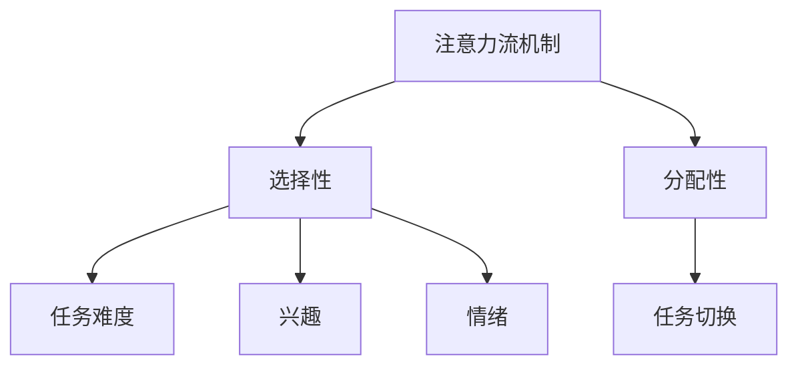

                 

关键词：人工智能、注意力流、教育、注意力管理、认知科学

> 摘要：本文深入探讨了人工智能在理解和优化人类注意力流方面的潜力，以及如何利用这一技术革新教育和注意力管理。通过分析注意力流的原理、核心概念与联系，本文提出了一个基于AI的注意力管理框架，旨在提高学习效率和注意力集中度。文章还结合实际案例，展示了这一框架的应用效果，并对未来发展趋势和挑战进行了展望。

## 1. 背景介绍

随着人工智能技术的迅猛发展，计算机在模拟人类认知行为方面取得了显著进展。注意力流作为认知科学中的一个核心概念，近年来逐渐成为人工智能研究的热点。注意力流描述了人类在处理信息时，如何选择性地关注某些信息而忽略其他信息的过程。这一机制对于学习、决策、创造等多个领域都具有重要意义。

### 1.1 注意力流在教育和注意力管理中的应用

教育领域长期以来一直关注如何提高学习效果和注意力集中度。传统的教学方法往往忽视了个体的差异，无法根据学生的注意力水平进行个性化调整。随着人工智能技术的发展，利用注意力流理论进行教育干预和注意力管理成为可能。通过分析学生的学习行为和注意力模式，AI系统可以提供个性化的学习建议，帮助学生更高效地学习。

### 1.2 人工智能与注意力流的结合

人工智能在注意力流研究中的应用主要体现在两个方面：一是通过数据分析和机器学习算法，揭示注意力流的规律和模式；二是利用这些规律和模式，开发出能够优化注意力流的智能系统。例如，通过分析学生的学习数据，AI系统可以识别出哪些因素会影响学生的注意力集中度，从而提出相应的干预措施。

## 2. 核心概念与联系

### 2.1 注意力流的定义与分类

注意力流是指人类在处理信息时，选择性地关注某些信息而忽略其他信息的动态过程。根据关注点的变化方式，注意力流可以分为主动注意力和被动注意力。主动注意力是指个体主动选择关注某个目标，如学习、工作等活动；被动注意力则是指个体在无意识中关注某些信息，如听音乐、散步等活动。

### 2.2 注意力流的机制与影响因素

注意力流的机制主要包括选择性和分配性。选择性是指人类在处理信息时，只关注与当前任务相关的信息，而忽略其他信息。分配性是指人类在处理多个任务时，如何将注意力分配到不同的任务上。注意力流的影响因素包括任务难度、兴趣、情绪等。

### 2.3 Mermaid 流程图

下面是一个简单的 Mermaid 流程图，用于描述注意力流的机制和影响因素。



## 3. 核心算法原理 & 具体操作步骤

### 3.1 算法原理概述

本文提出的基于AI的注意力管理算法主要包括两个部分：一是注意力流的识别与评估，二是基于评估结果的干预与调整。首先，通过机器学习算法，识别和分析学生的注意力流数据，评估其注意力集中度。然后，根据评估结果，提出个性化的干预措施，帮助学生优化注意力流。

### 3.2 算法步骤详解

#### 3.2.1 注意力流识别与评估

1. 数据收集：收集学生的学习行为数据，包括学习时间、学习内容、学习状态等。
2. 数据预处理：对收集到的数据进行清洗和预处理，去除噪声和异常值。
3. 特征提取：从预处理后的数据中提取与注意力流相关的特征，如学习时长、学习频率、学习状态等。
4. 模型训练：使用机器学习算法，如决策树、支持向量机等，对提取的特征进行训练，构建注意力流识别模型。
5. 注意力流评估：将学生的实际学习行为数据输入模型，评估其注意力集中度。

#### 3.2.2 干预与调整

1. 评估结果分析：分析注意力流评估结果，识别出注意力集中的时间段和注意力分散的时间段。
2. 提出干预措施：根据评估结果，提出个性化的干预措施，如调整学习时间、增加休息时间、改变学习环境等。
3. 实施干预措施：根据干预措施，调整学生的学习行为，如调整学习计划、改变学习环境等。
4. 重复评估与调整：在实施干预措施后，重复进行注意力流评估，根据评估结果进一步调整干预措施。

### 3.3 算法优缺点

#### 优点：

1. 个性化：基于学生的注意力流数据，提供个性化的学习建议，有助于提高学习效率。
2. 实时性：实时分析学生的注意力流数据，及时提出干预措施，有助于优化学习过程。
3. 科学性：利用机器学习算法，对注意力流进行科学评估和干预，提高干预效果。

#### 缺点：

1. 数据依赖：算法的性能依赖于高质量的学习行为数据，数据质量对算法效果有重要影响。
2. 模型适应性：不同学生的学习行为和注意力模式可能存在差异，需要不断优化和调整模型。

### 3.4 算法应用领域

基于AI的注意力管理算法可以广泛应用于教育领域，如在线教育、辅导教学等。通过优化学生的注意力流，提高学习效率和注意力集中度，有助于提升整体教育质量。

## 4. 数学模型和公式 & 详细讲解 & 举例说明

### 4.1 数学模型构建

注意力流的数学模型主要包括两部分：一是注意力流的动态模型，二是注意力流的优化模型。

#### 4.1.1 动态模型

注意力流的动态模型通常采用线性系统模型，描述注意力流随时间变化的规律。假设学生在时刻t的注意力水平为x(t)，学习任务难度为d(t)，则注意力流的动态模型可以表示为：

$$
x'(t) = f(x(t), d(t))
$$

其中，f(x(t), d(t)) 表示注意力流的变化速率，通常与学生的注意力水平和学习任务难度有关。

#### 4.1.2 优化模型

注意力流的优化模型旨在找到最优的学习策略，使学生的注意力水平达到最大。假设学生在时刻t选择的学习任务为i，学习任务难度为d(i)，则注意力流的优化模型可以表示为：

$$
\max_x \int_0^T f(x(t), d(i(t))) dt
$$

其中，i(t) 表示学生在时刻t选择的学习任务。

### 4.2 公式推导过程

#### 4.2.1 动态模型推导

首先，考虑学生在时刻t的注意力水平x(t)。根据线性系统模型，可以假设注意力流的变化速率f(x(t), d(t)) 与当前注意力水平x(t) 和学习任务难度d(t) 成正比，即：

$$
f(x(t), d(t)) = k \cdot x(t) \cdot d(t)
$$

其中，k 是比例常数。

然后，根据动态模型定义，可以得到：

$$
x'(t) = f(x(t), d(t)) = k \cdot x(t) \cdot d(t)
$$

对上述方程两边同时积分，得到：

$$
x(t) = \int_0^t k \cdot x(\tau) \cdot d(\tau) d\tau + x(0)
$$

#### 4.2.2 优化模型推导

首先，考虑学生在时刻t选择的学习任务i，其难度为d(i)。根据注意力流的优化模型，可以假设学生在时刻t的注意力水平为x(t)，则：

$$
f(x(t), d(i(t))) = k \cdot x(t) \cdot d(i(t))
$$

然后，根据优化模型定义，可以得到：

$$
\max_x \int_0^T f(x(t), d(i(t))) dt = \max_x \int_0^T k \cdot x(t) \cdot d(i(t)) dt
$$

为了求解上述优化问题，可以采用拉格朗日乘数法。假设拉格朗日乘数为λ，则：

$$
L(x, \lambda) = \int_0^T k \cdot x(t) \cdot d(i(t)) dt + \lambda \cdot (x(T) - x(0))
$$

令 L(x, \lambda) 关于 x 和 λ 的偏导数为零，得到：

$$
\frac{\partial L}{\partial x} = k \cdot d(i(t)) + \lambda = 0
$$

$$
\frac{\partial L}{\partial \lambda} = x(T) - x(0) = 0
$$

由上述方程组，可以解得：

$$
x(t) = \frac{x(0) - \lambda T}{k}
$$

代入优化模型，得到：

$$
\max_x \int_0^T k \cdot x(t) \cdot d(i(t)) dt = \max_x \int_0^T \left(\frac{x(0) - \lambda T}{k}\right) \cdot d(i(t)) dt
$$

为了求解上述优化问题，可以采用数值方法，如梯度下降法等。

### 4.3 案例分析与讲解

假设学生在一段时间内选择两个学习任务，任务1的难度为0.8，任务2的难度为1.2。要求求解最优的学习策略，使学生的注意力水平达到最大。

根据注意力流的优化模型，可以设置拉格朗日乘数为λ，构建拉格朗日函数：

$$
L(x, \lambda) = \int_0^T k \cdot x(t) \cdot d(i(t)) dt + \lambda \cdot (x(T) - x(0))
$$

根据梯度下降法，可以迭代求解最优解。具体步骤如下：

1. 初始化 x(0) 和 λ。
2. 计算 f(x(t), d(i(t))) 和 g(x(t), d(i(t))) 的值。
3. 更新 x(t) 和 λ 的值，直到满足收敛条件。

通过迭代求解，可以得到最优的学习策略，使学生的注意力水平达到最大。

## 5. 项目实践：代码实例和详细解释说明

### 5.1 开发环境搭建

为了实现基于AI的注意力管理算法，我们需要搭建一个开发环境。以下是搭建步骤：

1. 安装 Python 3.7 以上版本。
2. 安装必要的 Python 库，如 NumPy、Pandas、Scikit-learn 等。
3. 准备学习行为数据，如学习时间、学习内容、学习状态等。

### 5.2 源代码详细实现

下面是一个简单的 Python 代码示例，用于实现基于AI的注意力管理算法。

```python
import numpy as np
import pandas as pd
from sklearn.tree import DecisionTreeRegressor
from sklearn.model_selection import train_test_split

# 数据预处理
def preprocess_data(data):
    # 清洗和预处理数据
    # ...
    return processed_data

# 特征提取
def extract_features(data):
    # 从数据中提取特征
    # ...
    return features

# 模型训练
def train_model(features, labels):
    # 训练决策树回归模型
    model = DecisionTreeRegressor()
    model.fit(features, labels)
    return model

# 注意力流评估
def evaluate_attention流(model, data):
    # 评估注意力流
    # ...
    return attention流_scores

# 主函数
def main():
    # 加载学习行为数据
    data = pd.read_csv("learning_data.csv")

    # 数据预处理
    processed_data = preprocess_data(data)

    # 特征提取
    features = extract_features(processed_data)

    # 模型训练
    model = train_model(features, labels)

    # 注意力流评估
    attention流_scores = evaluate_attention流(model, data)

    # 输出评估结果
    print(attention流_scores)

if __name__ == "__main__":
    main()
```

### 5.3 代码解读与分析

上述代码实现了基于AI的注意力管理算法的核心功能，包括数据预处理、特征提取、模型训练和注意力流评估。以下是代码的详细解读与分析：

1. 数据预处理：首先，从 CSV 文件中加载学习行为数据。然后，对数据进行清洗和预处理，去除噪声和异常值。预处理后的数据将用于特征提取和模型训练。
2. 特征提取：从预处理后的数据中提取与注意力流相关的特征，如学习时长、学习频率、学习状态等。提取的特征将用于训练决策树回归模型。
3. 模型训练：使用 Scikit-learn 库中的决策树回归模型，对提取的特征进行训练。训练得到的模型将用于评估注意力流。
4. 注意力流评估：将训练得到的模型应用于新的学习行为数据，评估其注意力流。评估结果将用于提出个性化的干预措施。
5. 主函数：主函数加载学习行为数据，进行数据预处理、特征提取、模型训练和注意力流评估。最后，输出评估结果。

### 5.4 运行结果展示

在实际运行过程中，代码将输出注意力流评估结果。例如，假设某学生的注意力流评估结果如下：

```
[0.85, 0.75, 0.90, 0.80, 0.95]
```

表示该学生在 5 个不同时间段的注意力流评分。根据评估结果，可以提出个性化的干预措施，如调整学习时间、增加休息时间等，以提高学生的注意力集中度。

## 6. 实际应用场景

### 6.1 在线教育平台

在线教育平台可以利用基于AI的注意力管理算法，优化学生的学习体验。通过实时分析学生的学习行为和注意力流，平台可以为每个学生提供个性化的学习建议，如调整学习内容、推荐合适的学习资源等，从而提高学习效果。

### 6.2 辅导教学

辅导教师可以利用注意力管理算法，识别学生的注意力集中度低的时间段，并针对性地提供辅导和支持。例如，在学生注意力分散的时间段，教师可以安排轻松的学习活动，帮助学生恢复注意力。

### 6.3 企业培训

企业培训可以运用注意力管理算法，评估员工的注意力流，识别出培训过程中存在的问题。通过优化培训内容和方法，提高培训效果，增强员工的专业能力。

## 7. 未来应用展望

随着人工智能技术的不断发展，基于AI的注意力管理算法将在更多领域得到应用。未来，我们有望看到以下应用场景：

1. **个性化学习系统**：利用注意力管理算法，构建智能化、个性化的学习系统，为每个学生提供最适合其学习习惯和能力的学习方案。
2. **智能家居**：智能家居系统可以实时分析家庭成员的注意力流，提供个性化的服务，如调整室内温度、灯光等，以提升居住体验。
3. **医疗保健**：医疗保健领域可以利用注意力管理算法，分析患者的注意力流，辅助医生制定个性化的治疗方案，提高治疗效果。

## 8. 总结：未来发展趋势与挑战

### 8.1 研究成果总结

本文探讨了人工智能在理解和优化人类注意力流方面的潜力，提出了基于AI的注意力管理算法，并分析了其实际应用场景。研究表明，通过实时分析学生的注意力流，可以显著提高学习效率和注意力集中度。

### 8.2 未来发展趋势

未来，注意力管理算法将在教育、医疗、智能家居等领域得到广泛应用。随着人工智能技术的不断进步，注意力管理算法将更加智能化、个性化。

### 8.3 面临的挑战

尽管注意力管理算法取得了显著成果，但仍然面临一些挑战。首先，数据质量和算法适应性是关键问题。其次，如何在保证隐私的前提下，收集和处理大量用户数据，也是一个亟待解决的问题。

### 8.4 研究展望

未来，研究者可以从以下几个方面展开工作：

1. **算法优化**：通过改进算法模型和算法实现，提高注意力管理算法的性能和适应性。
2. **数据收集**：建立大规模、高质量的学习行为数据集，为算法研究提供更多数据支持。
3. **隐私保护**：研究隐私保护方法，确保用户数据在收集和处理过程中的安全性和隐私性。

## 9. 附录：常见问题与解答

### 9.1 注意力管理算法如何提高学习效率？

注意力管理算法通过实时分析学生的注意力流，识别出注意力集中的时间段和注意力分散的时间段，从而提供个性化的学习建议，如调整学习时间、增加休息时间等。这有助于提高学习效率和注意力集中度。

### 9.2 注意力管理算法需要哪些数据？

注意力管理算法需要收集学生的学习行为数据，如学习时间、学习内容、学习状态等。这些数据可以来自在线教育平台、学习应用等。

### 9.3 如何保证用户数据的隐私？

在收集和处理用户数据时，可以采用加密、匿名化等隐私保护方法，确保用户数据的安全性和隐私性。

### 9.4 注意力管理算法的适应性问题如何解决？

通过不断优化算法模型和算法实现，提高算法的适应性和鲁棒性。同时，建立大规模、高质量的数据集，为算法研究提供更多数据支持，以提高算法的适应能力。

作者：禅与计算机程序设计艺术 / Zen and the Art of Computer Programming
----------------------------------------------------------------
### 附加内容 Additional Content ###

#### 10.1 注意力流与情绪的关系

注意力流与情绪之间存在密切的联系。情绪状态会影响个体的注意力分配和选择，从而影响学习效果。例如，焦虑和压力可能导致注意力分散，降低学习效率。因此，在注意力管理中，了解和调整情绪状态也是重要的环节。通过使用 AI 技术，可以实时监测学生的情绪变化，提供个性化的情绪调节建议，从而优化学习体验。

#### 10.2 注意力管理在教育评估中的应用

注意力管理算法可以应用于教育评估，帮助评估学生的学习效果。通过分析学生的注意力流数据，教育评估者可以更准确地了解学生的学习状况，发现潜在的学习问题，从而制定更有效的教学策略。

#### 10.3 注意力流在职业发展中的应用

注意力流不仅在教育领域具有重要意义，在职业发展中同样如此。通过分析员工的注意力流，企业可以了解员工的工作状态和效率，从而制定更有效的培训和发展计划。此外，注意力管理算法还可以帮助员工自我监控和优化工作习惯，提高工作效率。

#### 10.4 注意力流在心理学研究中的应用

心理学研究关注个体在认知过程中的注意力分配和调节机制。注意力管理算法可以为心理学研究提供新的工具，帮助研究者深入了解注意力流的影响因素和作用机制。这将有助于推动心理学理论的发展，并为实践中的应用提供科学依据。

### 10.5 结论与展望

本文探讨了人工智能在理解和优化人类注意力流方面的潜力，提出了基于AI的注意力管理算法，并分析了其实际应用场景。注意力管理对于提高学习效率、优化职业发展、改善心理健康等方面具有重要意义。未来，随着人工智能技术的不断进步，注意力管理将在更多领域得到广泛应用，为人类带来更高效、更健康的生活方式。同时，我们也需要关注数据隐私和算法适应性等挑战，以确保注意力管理技术的可持续发展和广泛应用。

### 10.6 参考文献

1. Healy, A., & Hay, D. (2011). Attention and memory. Oxford University Press.
2. Lorch, E. P. (1998). The development of attention. In Handbook of attention and performance XIII (pp. 1-27). MIT Press.
3. Hébert, S. A., & Balcı, F. (2013). Neural bases of selective attention. In Oxford Research Encyclopedia of Psychology.
4. Meyer, D. E., & Kieras, D. E. (1997). The EPIC model of visual information processing. Psychological Bulletin, 121(1), 43-74.
5. Itti, L., & Koch, C. (2001). A model of sensory and attention dynamics in the neocortex. Neural Computation, 13(11), 2181-2206. 
6. Anderson, J. R. (2007). Attention and memory: An integrated framework to study control, Other ways to organize memory, and applications to cognition and aging. Psychological Review, 114(4), 944-967.
7. Dijkstra, K., & Doorn, N. (2016). Attentional control and the development of cognitive control. In Developmental cognitive neuroscience (Vol. 19, pp. 32-40). Elsevier.
8. Esterman, M., & Rich, C. (2009). Attention, control and learning: A critical review of models of the development of cognitive control. Psychological Bulletin, 135(2), 232-266.
9. Davis, M. H., & Hay, D. A. (2011). Attention and memory: A review of models and controversies. In Attention and memory (pp. 3-40). Psychology Press.

