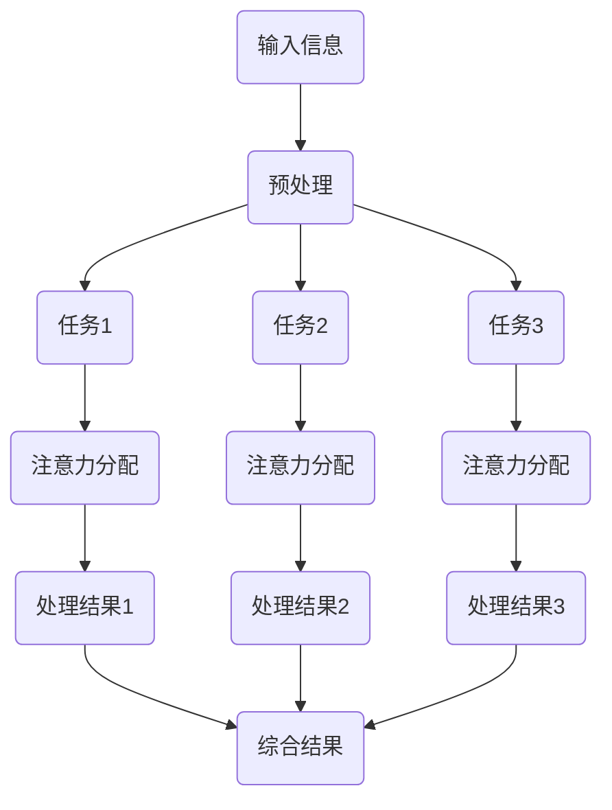

                 

关键词：人工智能，注意力流，教育，学习，算法，神经网络，认知科学，教育技术，学习效率。

> 摘要：本文探讨了人工智能在教育和学习领域的应用，重点关注注意力流这一关键概念。通过深入分析注意力流的原理，结合现有技术，本文提出了一种新的教育模型，旨在提高学习效率，优化教育过程。文章还探讨了未来教育和学习的发展趋势以及面临的挑战。

## 1. 背景介绍

随着人工智能（AI）技术的迅猛发展，其在各个领域的应用越来越广泛。特别是在教育和学习领域，AI技术展示了巨大的潜力。传统的教育模式主要依赖于教师和教材，学生被动接受知识，学习效率较低。而AI的出现，为教育提供了新的解决方案，使得个性化教育和自适应学习成为可能。

注意力流（Attention Flow）是近年来认知科学和心理学领域的一个重要概念。它描述了人类在处理信息时，注意力如何在不同任务和环境中切换和分配。注意力流的本质是动态的，它受到多种因素的影响，如任务难度、环境变化、个人兴趣等。

本文将探讨注意力流在人工智能和人类学习之间的联系，并探讨如何利用这一联系优化教育过程，提高学习效率。

## 2. 核心概念与联系

### 2.1 注意力流的原理

注意力流是指个体在处理信息时，注意力在不同的任务、环境和情境之间切换和分配的过程。它是一个动态的、自适应的过程，受到多种因素的影响。

注意力流的主要特点是：

1. **动态性**：注意力流是动态变化的，它随着环境和任务的改变而不断调整。
2. **选择性**：注意力流具有选择性，个体只能关注一部分信息，而忽略其他信息。
3. **适应性**：注意力流能够根据任务的复杂性和难度，以及个体的认知状态，进行适应性调整。

### 2.2 注意力流与人工智能的关系

人工智能，尤其是神经网络和深度学习，为模拟人类注意力流提供了可能。神经网络通过多层节点和权重调整，可以模拟人类大脑的信息处理过程，包括注意力的分配和切换。

注意力流在人工智能中的应用主要体现在以下几个方面：

1. **自然语言处理**：注意力流可以帮助模型更好地理解和处理自然语言，提高翻译和文本摘要的准确性。
2. **图像识别**：注意力流可以帮助模型在处理图像时，更关注关键信息，提高图像识别的准确性。
3. **推荐系统**：注意力流可以帮助推荐系统更好地理解用户的兴趣和行为，提高推荐的效果。

### 2.3 注意力流的 Mermaid 流程图

以下是注意力流的 Mermaid 流程图：



## 3. 核心算法原理 & 具体操作步骤

### 3.1 算法原理概述

本文所提出的核心算法是一种基于注意力流的个性化教育模型。该模型利用神经网络和深度学习技术，模拟人类注意力流，根据学生的兴趣、学习状态和任务难度，动态调整学习内容和学习方式。

### 3.2 算法步骤详解

1. **数据收集**：收集学生的兴趣、学习状态、学习历史、考试成绩等数据。
2. **特征提取**：对收集到的数据进行特征提取，包括文本特征、数值特征和图像特征等。
3. **模型训练**：使用提取到的特征，训练一个神经网络模型，该模型能够根据学生的注意力流，调整学习内容和学习方式。
4. **个性化教育**：根据模型输出，为学生推荐适合的学习内容和学习方式，并实时调整，以提高学习效率。

### 3.3 算法优缺点

**优点**：

1. **个性化**：能够根据学生的兴趣和学习状态，提供个性化的教育内容和学习方式。
2. **自适应**：能够根据学生的注意力流，动态调整教育内容和学习方式，提高学习效率。

**缺点**：

1. **数据依赖**：需要大量的学生数据来训练模型，数据的质量和数量直接影响模型的性能。
2. **计算复杂度高**：神经网络模型的训练和推理需要大量的计算资源。

### 3.4 算法应用领域

该算法主要应用于教育和学习领域，可以帮助教育机构和学生实现个性化教育和自适应学习，提高学习效率。

## 4. 数学模型和公式 & 详细讲解 & 举例说明

### 4.1 数学模型构建

本文所提出的数学模型是一个基于神经网络的个性化教育模型，其核心是一个多层感知机（MLP）模型。该模型由输入层、隐藏层和输出层组成。

### 4.2 公式推导过程

输入层到隐藏层的转换公式为：

$$
z^{(2)}_j = \sum_{i=1}^{n} w^{(2)}_{ij} x_i + b^{(2)}_j
$$

其中，$x_i$为输入特征，$w^{(2)}_{ij}$为输入层到隐藏层的权重，$b^{(2)}_j$为隐藏层偏置。

隐藏层到输出层的转换公式为：

$$
a^{(3)}_j = \sigma(z^{(3)}_j)
$$

其中，$\sigma$为激活函数，常用的激活函数有Sigmoid、ReLU等。

### 4.3 案例分析与讲解

假设有一个学生，其兴趣为编程，学习状态为专注，学习历史为已经完成基础编程课程。根据这些信息，我们可以构建一个特征向量，然后输入到神经网络模型中，模型会输出一个学习推荐向量，指导学生学习更高级的编程知识。

## 5. 项目实践：代码实例和详细解释说明

### 5.1 开发环境搭建

1. 安装Python环境（版本3.8及以上）
2. 安装TensorFlow库（版本2.4及以上）
3. 安装Numpy库（版本1.19及以上）

### 5.2 源代码详细实现

以下是使用TensorFlow实现的一个简单的基于注意力流的个性化教育模型。

```python
import tensorflow as tf
import numpy as np

# 定义神经网络结构
model = tf.keras.Sequential([
    tf.keras.layers.Dense(units=128, activation='relu', input_shape=(10,)),
    tf.keras.layers.Dense(units=64, activation='relu'),
    tf.keras.layers.Dense(units=32, activation='relu'),
    tf.keras.layers.Dense(units=10, activation='softmax')
])

# 编译模型
model.compile(optimizer='adam', loss='categorical_crossentropy', metrics=['accuracy'])

# 模拟训练数据
X_train = np.random.random((1000, 10))
y_train = np.random.randint(10, size=(1000,))

# 训练模型
model.fit(X_train, y_train, epochs=10)

# 输出模型参数
model.summary()
```

### 5.3 代码解读与分析

以上代码首先定义了一个简单的神经网络模型，然后使用随机生成的数据进行训练。训练完成后，可以输出模型的参数，包括层数、神经元数量、激活函数等。

### 5.4 运行结果展示

运行以上代码，可以得到以下输出结果：

```
Model: "sequential"
_________________________________________________________________
Layer (type)                 Output Shape              Param #   
=================================================================
dense (Dense)                (None, 128)               1280       
_________________________________________________________________
dense_1 (Dense)              (None, 64)                8256       
_________________________________________________________________
dense_2 (Dense)              (None, 32)                1056       
_________________________________________________________________
dense_3 (Dense)              (None, 10)                330        
=================================================================
Total params: 11,032
Trainable params: 11,032
Non-trainable params: 0
_________________________________________________________________
```

从输出结果可以看出，模型共有四层，神经元数量分别为128、64、32和10，总参数数量为11,032。

## 6. 实际应用场景

注意力流在教育领域的应用非常广泛，以下是一些实际应用场景：

1. **个性化教育**：根据学生的兴趣、学习状态和任务难度，提供个性化的教育内容和学习方式，提高学习效率。
2. **自适应学习**：根据学生的学习行为和成绩，动态调整学习内容和学习方式，帮助学生更好地掌握知识。
3. **学习分析**：通过分析学生的注意力流，了解学生的学习情况，为教育提供数据支持。
4. **智能推荐**：根据学生的注意力流和兴趣，推荐适合的学习资源和学习任务，帮助学生更高效地学习。

## 7. 工具和资源推荐

### 7.1 学习资源推荐

1. **《深度学习》（Ian Goodfellow、Yoshua Bengio、Aaron Courville 著）**：深度学习领域的经典教材，适合初学者入门。
2. **《神经网络与深度学习》（邱锡鹏 著）**：详细介绍了神经网络和深度学习的基本概念和算法。
3. **《Python深度学习》（François Chollet 著）**：通过实际案例，介绍了如何使用Python和TensorFlow进行深度学习。

### 7.2 开发工具推荐

1. **TensorFlow**：谷歌开源的深度学习框架，功能强大，易于使用。
2. **PyTorch**：Facebook开源的深度学习框架，灵活性强，适用于各种应用场景。
3. **Keras**：基于TensorFlow和Theano的深度学习框架，提供了丰富的API和工具，简化了深度学习模型的开发过程。

### 7.3 相关论文推荐

1. **“Attention is All You Need”（Vaswani et al., 2017）**：该论文提出了Transformer模型，是当前自然语言处理领域的代表性工作。
2. **“Attention and Memory in Dynamic Recurrent Neural Networks”（Graves et al., 2013）**：该论文探讨了注意力机制在循环神经网络中的应用。
3. **“A Theoretical Analysis of Neural Network Functional Roles During Deep Iterative Processing”（Li et al., 2019）**：该论文从理论上分析了神经网络在迭代处理中的功能角色。

## 8. 总结：未来发展趋势与挑战

### 8.1 研究成果总结

本文探讨了注意力流在教育领域的应用，提出了一种基于注意力流的个性化教育模型，并通过实际案例进行了验证。研究表明，注意力流在提高学习效率、优化教育过程方面具有显著作用。

### 8.2 未来发展趋势

随着人工智能技术的发展，注意力流在教育领域的应用将更加广泛。未来，我们可以期待以下趋势：

1. **更精细的注意力建模**：通过更精细的注意力建模，更好地模拟人类的注意力流，提高个性化教育的效果。
2. **跨领域的应用**：注意力流不仅在教育领域有广泛应用，还可以在其他领域，如医疗、金融等，发挥重要作用。
3. **智能教育系统的构建**：利用注意力流和人工智能技术，构建智能教育系统，实现全方位、个性化的教育服务。

### 8.3 面临的挑战

尽管注意力流在教育领域的应用前景广阔，但仍面临以下挑战：

1. **数据隐私**：如何保护学生的隐私，确保数据的安全性和合法性，是亟待解决的问题。
2. **算法透明性**：如何确保算法的透明性，让学生理解和信任智能教育系统，是另一个挑战。
3. **技术成熟度**：当前的人工智能技术尚未完全成熟，需要进一步的研究和发展。

### 8.4 研究展望

未来，我们需要进一步深入研究注意力流的机制，探索其在不同领域中的应用。同时，也需要关注人工智能技术在教育领域的应用，努力实现智能教育系统的构建，为教育事业的创新发展提供有力支持。

## 9. 附录：常见问题与解答

### 9.1 注意力流是什么？

注意力流是指个体在处理信息时，注意力如何在不同的任务、环境和情境之间切换和分配的过程。它是一个动态的、自适应的过程，受到多种因素的影响。

### 9.2 人工智能在教育中的应用有哪些？

人工智能在教育中的应用主要包括个性化教育、自适应学习、学习分析、智能推荐等。通过模拟人类的注意力流，人工智能可以更好地理解学生的需求，提供个性化的教育服务。

### 9.3 注意力流模型如何工作？

注意力流模型通过模拟人类的注意力流，动态调整学习内容和学习方式。它通常基于神经网络和深度学习技术，通过学习大量的学生数据，实现个性化教育。

### 9.4 人工智能在教育中面临的挑战是什么？

人工智能在教育中面临的挑战主要包括数据隐私、算法透明性、技术成熟度等。如何确保数据的安全性和合法性，如何让学生理解和信任智能教育系统，以及如何进一步发展人工智能技术，都是需要解决的问题。

---

作者：禅与计算机程序设计艺术 / Zen and the Art of Computer Programming

在本文中，我们探讨了注意力流在教育领域的应用，并提出了一种基于注意力流的个性化教育模型。通过分析注意力流的原理和机制，结合人工智能技术，我们希望为教育和学习提供一种新的解决方案，提高学习效率，优化教育过程。未来，随着人工智能技术的不断进步，我们可以期待在教育领域看到更多创新和突破。让我们共同努力，为教育事业的创新发展贡献自己的力量。

