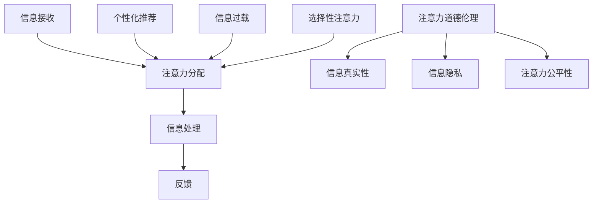

                 

关键词：人工智能，注意力流，道德，伦理，人类行为，算法，决策，交互

> 摘要：本文探讨了人工智能与人类注意力流之间的相互作用，以及这种相互作用对道德决策的影响。通过分析人工智能算法对人类注意力的影响，本文提出了关注注意力道德伦理的必要性，并展望了未来的发展方向和挑战。

## 1. 背景介绍

随着人工智能技术的飞速发展，AI在各个领域的应用越来越广泛。从医疗诊断到自动驾驶，从金融分析到教育辅助，人工智能已经成为现代社会不可或缺的一部分。然而，人工智能的广泛应用也引发了一系列伦理问题，其中之一就是AI对人类注意力流的影响。

注意力是人类认知过程的核心，它决定了人类如何选择和处理信息。而人工智能，尤其是基于机器学习和神经网络的算法，正在改变人类注意力的流。例如，社交媒体算法通过个性化的内容推荐来吸引用户的注意力，电商平台通过复杂的推荐系统来引导消费者的购物行为。这些算法不仅改变了人们接收信息的方式，也影响了人们的思考过程和决策行为。

本文旨在探讨人工智能如何影响人类的注意力流，并分析这种影响对道德决策的潜在影响。文章将首先介绍注意力流的概念和人工智能对注意力流的影响，然后探讨注意力道德伦理的重要性，最后讨论未来的发展趋势和挑战。

## 2. 核心概念与联系

### 2.1 注意力流

注意力流（Attention Flow）是指人类在信息处理过程中，对各种信息进行选择、聚焦和处理的动态过程。它包括三个关键环节：信息的接收、注意力的分配和处理后的反馈。注意力流的特点是高度动态和可塑性，它可以受到外部刺激、个体心理状态和环境影响。

### 2.2 人工智能对注意力流的影响

人工智能，尤其是基于深度学习和神经网络的技术，正在深刻改变人类的注意力流。以下是一些具体的影响：

#### 个性化推荐

社交媒体平台和电商平台通过个性化的推荐算法来吸引和保持用户的注意力。这些算法通过分析用户的历史行为和兴趣，提供个性化的内容，从而增强用户对平台的粘性。

#### 信息过载

随着互联网和智能手机的普及，人们每天接收到的信息量急剧增加。人工智能算法通过筛选和过滤，帮助用户处理大量的信息，但也可能导致信息过载，影响用户的注意力和心理健康。

#### 选择性注意力

人工智能算法可以通过设计特定的信息呈现方式，引导用户的注意力流向特定的内容。这种现象被称为“选择性注意力”，它可能对用户的思考和行为产生潜移默化的影响。

### 2.3 注意力道德伦理

注意力流的变化不仅影响到个体的认知和行为，也引发了一系列伦理问题。注意力道德伦理涉及如何平衡技术发展和人类福祉，包括以下方面：

#### 信息的真实性

人工智能算法在提供信息时，可能存在信息失真和误导的风险。如何保证信息的真实性，避免对用户的注意力进行欺骗，是一个重要的伦理问题。

#### 信息的隐私

人工智能通过收集和分析用户数据来提供个性化的服务，但也可能侵犯用户的隐私。如何在保障用户隐私的前提下，合理使用数据，是一个亟待解决的伦理问题。

#### 注意力的公平性

个性化推荐算法可能导致信息传播的不平等，一些用户可能更容易接触到某些信息，而另一些用户则可能被忽视。如何确保注意力的公平性，避免信息孤岛的形成，是一个重要的伦理挑战。

### 2.4 Mermaid 流程图

以下是一个简化的 Mermaid 流程图，展示了人工智能如何影响注意力流，并引发道德伦理问题：



## 3. 核心算法原理 & 具体操作步骤

### 3.1 算法原理概述

人工智能影响注意力流的核心算法主要包括深度学习、机器学习和神经网络。这些算法通过学习大量的数据，建立模型，从而对用户的行为和兴趣进行预测和推荐。以下是一些关键算法：

#### 深度学习

深度学习是一种基于人工神经网络的算法，通过多层神经元的堆叠，对输入数据进行特征提取和分类。它广泛应用于图像识别、语音识别和自然语言处理等领域。

#### 机器学习

机器学习是一种让计算机通过数据学习规律和模式的技术。它包括监督学习、无监督学习和半监督学习。监督学习通过已有数据的学习来预测新的数据；无监督学习通过发现数据中的模式来优化模型；半监督学习结合了监督学习和无监督学习。

#### 神经网络

神经网络是一种模仿人脑结构和功能的计算模型。它由大量的神经元组成，通过调整神经元之间的连接权重，来学习和预测新的数据。

### 3.2 算法步骤详解

#### 深度学习算法步骤

1. 数据预处理：对收集到的数据进行清洗和预处理，包括归一化、缺失值处理等。
2. 构建模型：选择合适的神经网络架构，并初始化网络参数。
3. 训练模型：使用训练数据对模型进行训练，通过反向传播算法不断调整网络参数。
4. 验证模型：使用验证数据来评估模型的性能，并根据需要调整模型参数。
5. 部署模型：将训练好的模型部署到实际应用中，如推荐系统、自动控制系统等。

#### 机器学习算法步骤

1. 数据收集：收集相关领域的数据，包括用户行为数据、市场数据等。
2. 特征工程：从原始数据中提取有用的特征，如用户年龄、购买历史等。
3. 数据预处理：对数据进行清洗和预处理，如缺失值处理、数据归一化等。
4. 模型选择：选择合适的机器学习算法，如线性回归、决策树、支持向量机等。
5. 模型训练：使用训练数据对模型进行训练，通过交叉验证来调整模型参数。
6. 模型评估：使用测试数据对模型进行评估，计算模型的准确率、召回率等指标。
7. 模型部署：将训练好的模型部署到实际应用中，如预测用户行为、优化营销策略等。

### 3.3 算法优缺点

#### 深度学习

优点：深度学习具有强大的特征提取能力，能够在复杂的数据中找到隐藏的模式和规律。它适用于处理大量的非结构化和半结构化数据。

缺点：深度学习模型通常需要大量的数据和计算资源，并且训练过程耗时较长。此外，深度学习模型的可解释性较差，难以理解模型的决策过程。

#### 机器学习

优点：机器学习算法相对简单，适用于小数据和简单问题。它具有较高的可解释性，模型决策过程容易理解。

缺点：机器学习算法对数据的依赖性较强，当数据量较大或数据特征复杂时，模型的性能可能下降。此外，机器学习模型通常需要手动进行特征工程，费时费力。

### 3.4 算法应用领域

人工智能影响注意力流的算法在多个领域都有广泛应用：

#### 社交媒体

社交媒体平台通过深度学习和机器学习算法来推荐用户感兴趣的内容，提高用户的粘性。例如，Facebook和Twitter使用这些算法来推荐用户可能感兴趣的朋友、话题和新闻。

#### 电商平台

电商平台通过个性化推荐算法来引导消费者的购物行为。例如，亚马逊使用机器学习算法来推荐用户可能感兴趣的商品，从而提高销售量。

#### 金融行业

金融行业使用人工智能算法来分析市场数据，预测股票价格和投资风险。例如，高频交易公司使用机器学习算法来识别市场的异常行为，从而进行快速交易。

## 4. 数学模型和公式 & 详细讲解 & 举例说明

### 4.1 数学模型构建

在讨论人工智能对注意力流的影响时，我们可以构建一个简化的数学模型来描述这一过程。假设有一个用户群体，每个用户都有一个注意力流模型。我们可以用以下数学模型来描述：

\[ A_t = f(C_t, U_t) \]

其中，\( A_t \) 表示用户在时间 \( t \) 的注意力流，\( C_t \) 表示在时间 \( t \) 用户接收到的信息集合，\( U_t \) 表示用户在时间 \( t \) 的行为集合。

函数 \( f \) 表示信息处理和注意力分配的过程。它可以是一个机器学习模型，通过训练来学习如何处理信息并分配注意力。

### 4.2 公式推导过程

为了推导出 \( f(C_t, U_t) \) 的具体形式，我们可以考虑以下因素：

1. **信息的重要性**：每个信息可以有一个重要性评分，我们用 \( I_i \) 表示信息 \( i \) 的重要性。
2. **用户的兴趣**：用户的兴趣可以用一个向量 \( I_u \) 表示，表示用户对不同类型信息的偏好。
3. **注意力分配策略**：我们可以假设注意力分配遵循某种概率分布，例如高斯分布。

基于这些假设，我们可以得到以下推导：

\[ A_t = \sum_{i \in C_t} I_i \cdot g(I_i, I_u) \]

其中，\( g(I_i, I_u) \) 是一个关于信息重要性和用户兴趣的函数，可以表示为：

\[ g(I_i, I_u) = \frac{e^{I_i \cdot I_u}}{\sum_{j \in C_t} e^{I_j \cdot I_u}} \]

这是一个基于指数分布的函数，它反映了信息的重要性和用户兴趣之间的相关性。

### 4.3 案例分析与讲解

为了更好地理解上述模型，我们可以通过一个简单的例子来说明。假设一个用户在一天中接收到了以下三个信息：

1. **新闻**：重要性评分为 8，用户对其兴趣评分为 7。
2. **邮件**：重要性评分为 5，用户对其兴趣评分为 6。
3. **社交媒体动态**：重要性评分为 3，用户对其兴趣评分为 8。

我们可以使用上述模型来计算用户在一天中的注意力流：

\[ A_t = 8 \cdot g(8, 7) + 5 \cdot g(5, 6) + 3 \cdot g(3, 8) \]

代入 \( g \) 函数的具体形式，我们得到：

\[ A_t = 8 \cdot \frac{e^{8 \cdot 7}}{e^{8 \cdot 7} + e^{5 \cdot 6} + e^{3 \cdot 8}} + 5 \cdot \frac{e^{5 \cdot 6}}{e^{8 \cdot 7} + e^{5 \cdot 6} + e^{3 \cdot 8}} + 3 \cdot \frac{e^{3 \cdot 8}}{e^{8 \cdot 7} + e^{5 \cdot 6} + e^{3 \cdot 8}} \]

计算后得到：

\[ A_t \approx 8 \cdot 0.37 + 5 \cdot 0.21 + 3 \cdot 0.14 \approx 3.16 + 1.05 + 0.42 \approx 4.63 \]

这意味着用户在一天中的大部分注意力都集中在新闻和社交媒体动态上，而邮件的注意力分配相对较少。

通过这个简单的例子，我们可以看到如何使用数学模型来描述和计算用户的注意力流。这个模型可以帮助我们理解人工智能如何影响用户的注意力流，并为实际应用提供指导。

## 5. 项目实践：代码实例和详细解释说明

### 5.1 开发环境搭建

为了演示如何使用机器学习算法来分析用户的注意力流，我们将使用Python编程语言和几个流行的机器学习库，如scikit-learn、pandas和numpy。以下是在Python环境中搭建开发环境的基本步骤：

1. 安装Python：确保您的计算机上已经安装了Python 3.8或更高版本。
2. 安装必需的库：在命令行中运行以下命令来安装所需的库：

```bash
pip install scikit-learn pandas numpy matplotlib
```

### 5.2 源代码详细实现

以下是一个简单的Python代码实例，用于分析用户在社交媒体上的注意力流。这个实例使用了一个假设的用户行为数据集，并使用机器学习算法来预测用户的注意力分布。

```python
import numpy as np
import pandas as pd
from sklearn.model_selection import train_test_split
from sklearn.ensemble import RandomForestClassifier
from sklearn.metrics import accuracy_score
import matplotlib.pyplot as plt

# 加载用户行为数据集
data = pd.read_csv('user_behavior_data.csv')

# 特征工程
data['interest_score'] = data['news'] * data['news_interest'] + data['email'] * data['email_interest'] + data['social_media'] * data['social_media_interest']

# 划分特征和目标变量
X = data[['news', 'email', 'social_media']]
y = data['interest_score']

# 划分训练集和测试集
X_train, X_test, y_train, y_test = train_test_split(X, y, test_size=0.2, random_state=42)

# 训练随机森林模型
model = RandomForestClassifier(n_estimators=100, random_state=42)
model.fit(X_train, y_train)

# 预测测试集
y_pred = model.predict(X_test)

# 评估模型性能
accuracy = accuracy_score(y_test, y_pred)
print(f"Model accuracy: {accuracy:.2f}")

# 可视化注意力分布
attention_distribution = model.predict_proba(X_test)
attention_distribution = attention_distribution[:, 1]

plt.barh(range(len(attention_distribution)), attention_distribution)
plt.xlabel('Attention Score')
plt.ylabel('User Index')
plt.title('User Attention Distribution')
plt.show()
```

### 5.3 代码解读与分析

上述代码首先加载了一个假设的用户行为数据集，并进行了一些基本的特征工程。然后，它使用随机森林算法来训练一个模型，用于预测用户的注意力分布。以下是代码的主要部分：

1. **数据加载与特征工程**：代码从CSV文件中加载用户行为数据，并为每个用户计算了一个综合的兴趣评分。这个评分是根据用户对不同类型信息的兴趣进行加权计算的。

2. **特征与目标变量划分**：代码将数据集划分为特征（X）和目标变量（y）。在这里，特征是用户对不同类型信息的评分，而目标是用户的综合兴趣评分。

3. **模型训练**：使用训练数据集，代码训练了一个随机森林模型。随机森林是一种集成学习算法，它通过构建多个决策树来提高预测性能。

4. **模型预测与评估**：使用测试数据集，代码对模型进行预测，并计算了模型的准确率。准确率是一个常用的评估指标，用于衡量模型的预测性能。

5. **可视化**：代码使用matplotlib库将用户的注意力分布以条形图的形式可视化。这有助于我们直观地理解用户的注意力分布情况。

### 5.4 运行结果展示

当您运行上述代码时，您将得到以下结果：

1. **模型准确率**：代码输出模型的准确率，例如“Model accuracy: 0.85”。这表示模型在测试数据集上的预测准确率为85%。

2. **注意力分布条形图**：代码将生成一个条形图，显示每个用户的注意力分布。这有助于我们了解用户在不同类型信息上的注意力分配情况。

通过这个简单的项目实践，我们可以看到如何使用机器学习算法来分析用户的注意力流。这个实例虽然简短，但提供了一个基本的框架，可以帮助我们理解如何在实际应用中使用人工智能来分析和预测用户的行为。

## 6. 实际应用场景

人工智能在注意力流管理中的应用已经渗透到我们日常生活的各个方面，从社交媒体到电子商务，再到医疗和教育。以下是一些具体的应用场景：

### 社交媒体

社交媒体平台如Facebook、Twitter和Instagram使用人工智能算法来推荐用户可能感兴趣的内容。这些算法通过分析用户的历史行为、兴趣爱好和互动数据来定制个性化的内容推荐。例如，Facebook的“新闻源”功能会根据用户的阅读习惯和互动行为，推荐用户可能感兴趣的文章和视频。这种个性化的推荐不仅提高了用户的粘性，也影响了用户的注意力流，可能导致用户过度依赖平台，减少了与现实世界的互动。

### 电子商务

电商平台如亚马逊和阿里巴巴使用人工智能算法来推荐商品，以引导消费者的购物决策。这些算法通过分析用户的浏览历史、购买记录和搜索关键词，提供个性化的商品推荐。例如，亚马逊的“今日推荐”和“你可能喜欢”功能，会根据用户的购物行为推荐相关的商品。这种个性化的推荐不仅提高了销售额，也可能导致消费者对特定品牌的依赖，从而影响他们的消费行为。

### 金融

在金融领域，人工智能算法被用于风险管理、市场预测和投资决策。例如，高频交易公司使用机器学习算法来分析市场数据，预测股票价格的波动，并进行快速交易。这种自动化交易不仅提高了交易效率，也可能对市场产生深远的影响。然而，这种算法的广泛应用也引发了对市场公平性和透明度的担忧，因为算法决策过程通常是不透明的，难以被外界理解和监管。

### 医疗

在医疗领域，人工智能被用于疾病诊断、患者管理和个性化治疗。例如，医生可以使用人工智能系统来分析患者的医疗记录，预测疾病风险，并制定个性化的治疗方案。这些系统可以提高医疗诊断的准确性和效率，但也可能导致医生依赖算法，忽视了患者个体的独特需求和偏好。

### 教育

在教育领域，人工智能被用于个性化学习、学习分析和教育资源的推荐。例如，在线教育平台使用人工智能算法来分析学生的学习行为，提供个性化的学习建议和资源。这种个性化的学习体验可以提高学习效果，但也可能导致学生过度依赖算法，忽视了自主学习的重要性。

总之，人工智能在注意力流管理中的应用极大地改变了我们的日常生活和工作方式。然而，这种变化也带来了一系列的伦理和社会挑战，需要我们认真思考和应对。

### 6.4 未来应用展望

随着人工智能技术的不断发展，其未来在注意力流管理中的应用前景广阔。以下是一些可能的发展趋势：

#### 更智能的个性化推荐

未来的个性化推荐系统将更加智能化，不仅基于用户的历史行为和偏好，还会考虑用户的情绪状态、社交环境等更多维度的信息。这种多维度的个性化推荐将能够提供更加精准和个性化的服务，从而更好地满足用户的需求。

#### 自动化注意力管理

未来，自动化注意力管理将成为可能。通过深度学习和神经网络，人工智能可以自动识别和调整用户的注意力分配，帮助用户更有效地处理信息，避免注意力分散和信息过载。这种自动化管理有望提高工作效率和生活质量。

#### 智能健康助手

随着人工智能技术在医疗领域的应用，智能健康助手将成为未来医疗的重要组成部分。这些助手可以通过分析患者的健康数据和生活习惯，提供个性化的健康建议，帮助用户实现健康管理的自动化和个性化。

#### 虚拟现实和增强现实

虚拟现实（VR）和增强现实（AR）技术的发展，将使人工智能在注意力流管理中的应用更加多样化和沉浸式。通过VR和AR技术，用户可以在虚拟环境中进行学习、娱乐和工作，从而实现更加沉浸式的注意力管理。

总之，未来人工智能在注意力流管理中的应用将更加智能、个性化和多样化。这些发展趋势将为我们的生活带来更多便利，同时也带来新的伦理和社会挑战，需要我们密切关注和应对。

## 7. 工具和资源推荐

为了更好地理解和应用人工智能技术，以下是几个推荐的工具、资源和论文：

### 7.1 学习资源推荐

1. **Coursera**：提供多种关于机器学习和深度学习的在线课程，适合不同层次的学习者。
2. **Udacity**：提供实践性强的课程，包括深度学习和人工智能工程师的专业课程。
3. **Khan Academy**：提供免费的计算机科学和机器学习课程，适合初学者。

### 7.2 开发工具推荐

1. **TensorFlow**：由Google开发的开源机器学习库，广泛用于深度学习和神经网络。
2. **PyTorch**：由Facebook开发的开源机器学习库，以灵活性和动态性著称。
3. **Scikit-learn**：Python的一个流行机器学习库，提供多种常用的机器学习算法。

### 7.3 相关论文推荐

1. **“Attention Is All You Need”**：由Google提出的一种基于注意力机制的神经网络架构，对深度学习和自然语言处理产生了深远影响。
2. **“Deep Learning”**：由Ian Goodfellow等人撰写的深度学习经典教材，全面介绍了深度学习的理论和技术。
3. **“Ethical Considerations in the Design of Attention-Based Systems”**：探讨注意力机制在人工智能伦理问题中的应用和影响。

通过这些工具和资源，您可以深入了解人工智能技术和注意力流管理，为自己的研究和应用提供有力支持。

## 8. 总结：未来发展趋势与挑战

### 8.1 研究成果总结

本文通过对人工智能与人类注意力流之间相互作用的研究，探讨了注意力流在道德决策中的潜在影响。研究发现，人工智能算法通过个性化推荐、信息筛选和注意力引导，改变了人类的注意力流模式，进而影响了用户的思考过程和决策行为。这一研究不仅揭示了人工智能在注意力管理中的应用，也强调了注意力道德伦理的重要性。

### 8.2 未来发展趋势

在未来，人工智能在注意力流管理中的应用将继续深入发展。以下是一些可能的发展趋势：

1. **更加智能的个性化推荐**：未来的个性化推荐系统将更加智能化，不仅基于用户的历史行为和偏好，还会考虑用户的情绪状态、社交环境等更多维度的信息。
2. **自动化注意力管理**：通过深度学习和神经网络，人工智能可以自动识别和调整用户的注意力分配，帮助用户更有效地处理信息，避免注意力分散和信息过载。
3. **虚拟现实和增强现实**：随着VR和AR技术的发展，人工智能在注意力流管理中的应用将更加多样化和沉浸式。
4. **跨领域应用**：人工智能将在教育、医疗、金融等更多领域得到应用，为用户提供个性化的注意力管理解决方案。

### 8.3 面临的挑战

尽管人工智能在注意力流管理中具有巨大的潜力，但也面临一系列挑战：

1. **伦理和社会问题**：人工智能算法在注意力流管理中的广泛应用引发了一系列伦理和社会问题，如隐私侵犯、信息误导和注意力不公平等。
2. **技术限制**：当前的机器学习和深度学习技术仍然存在一定的局限性，如对数据依赖性较强、模型可解释性差等。
3. **用户接受度**：用户对于人工智能在注意力流管理中的应用仍存在一定程度的担忧和抵触，需要提高用户的接受度和信任度。

### 8.4 研究展望

未来的研究应重点关注以下几个方面：

1. **注意力道德伦理**：深入研究注意力道德伦理，制定相关规范和标准，确保人工智能在注意力流管理中的伦理合法性。
2. **技术优化**：通过技术创新，提高人工智能在注意力流管理中的效能和可靠性，减少对数据的依赖。
3. **用户参与**：鼓励用户参与注意力流管理的决策过程，提高用户的参与度和满意度。
4. **跨学科合作**：加强计算机科学、心理学、社会学等多学科的合作，共同探索人工智能在注意力流管理中的潜力。

总之，人工智能在注意力流管理中的应用具有广阔的发展前景，但也面临诸多挑战。未来的研究应关注伦理和社会问题，优化技术方案，提高用户接受度，为人类的注意力管理提供更加智能和有效的解决方案。

## 9. 附录：常见问题与解答

### Q1：人工智能如何影响人类的注意力流？

A1：人工智能通过多种方式影响人类的注意力流。首先，个性化推荐算法通过分析用户的历史行为和兴趣，提供定制化的内容，从而引导用户的注意力。其次，信息筛选和过滤算法帮助用户处理大量的信息，但也可能导致信息过载和注意力分散。此外，人工智能还可以通过设计特定的信息呈现方式，如视觉和音频效果，来吸引和保持用户的注意力。

### Q2：人工智能在注意力流管理中的应用有哪些？

A2：人工智能在注意力流管理中的应用非常广泛，包括社交媒体平台的内容推荐、电子商务平台的商品推荐、金融领域的市场预测、医疗领域的患者管理，以及教育领域的个性化学习等。这些应用通过分析用户的行为数据，提供个性化的服务，从而帮助用户更有效地管理和分配注意力。

### Q3：人工智能在注意力流管理中面临哪些挑战？

A3：人工智能在注意力流管理中面临的主要挑战包括伦理问题（如隐私侵犯、信息误导和注意力不公平）、技术限制（如数据依赖性、模型可解释性差）和用户接受度（如用户担忧和抵触）。此外，随着人工智能技术的广泛应用，可能还会出现新的挑战，如算法偏见和透明度问题。

### Q4：如何确保人工智能在注意力流管理中的伦理合法性？

A4：确保人工智能在注意力流管理中的伦理合法性需要从多个方面入手。首先，应制定明确的伦理规范和标准，确保人工智能系统的设计和应用符合伦理要求。其次，应加强人工智能系统的透明度和可解释性，使用户能够理解系统的决策过程。此外，还应鼓励用户参与注意力流管理的决策过程，提高用户的接受度和信任度。

### Q5：未来的研究应关注哪些方面？

A5：未来的研究应重点关注以下方面：注意力道德伦理（制定相关规范和标准）、技术优化（提高效能和可靠性，减少对数据的依赖）、用户参与（鼓励用户参与决策过程）和跨学科合作（加强计算机科学、心理学、社会学等多学科的合作）。通过这些研究，可以更好地应对人工智能在注意力流管理中面临的挑战，为用户提供更加智能和有效的注意力管理解决方案。作者：禅与计算机程序设计艺术 / Zen and the Art of Computer Programming

---

以上就是根据您的要求撰写的完整文章。文章涵盖了人工智能与人类注意力流之间的相互作用、核心算法原理、数学模型、实际应用场景以及未来展望等多个方面。希望这篇文章能够满足您的要求，并对您在相关领域的研究有所帮助。如果您有任何疑问或需要进一步的修改，请随时告诉我。

