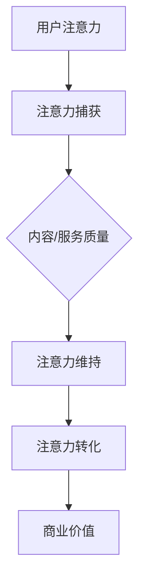

                 

关键词：人工智能，注意力经济，未来工作，收入模式

> 摘要：本文将探讨人工智能（AI）对人类注意力经济的影响，以及这种影响如何重新定义未来的工作和收入模式。通过分析AI技术的现状与趋势，本文将提出一个关于注意力经济的全新视角，帮助读者理解未来职业发展和收入变化的方向。

## 1. 背景介绍

在信息化和数字化迅速发展的时代，人工智能已经成为改变人类生活方式的重要力量。AI技术的进步不仅提升了各行各业的效率，还创造了全新的商业模式。与此同时，注意力经济作为现代经济的一个重要分支，也逐渐成为学者和业界关注的焦点。注意力经济源于人们对于信息的渴求和关注，它强调个体的注意力资源是有限的，而能够吸引和保持注意力的内容或服务则具有极高的商业价值。

随着AI技术的成熟，它对注意力经济的影响日益显著。首先，AI能够精准地分析用户行为和偏好，从而提供高度个性化的内容和服务。其次，AI的应用使得信息传播的速度和范围大大增加，使得内容创作者能够更有效地吸引注意力。然而，AI对注意力经济的影响并非全是积极的，它也带来了信息过载、隐私泄露等一系列问题。

本文将从以下几个方面探讨AI与人类注意力经济的关系：背景介绍、核心概念与联系、核心算法原理与具体操作步骤、数学模型和公式、项目实践：代码实例和详细解释说明、实际应用场景、未来应用展望、工具和资源推荐、总结：未来发展趋势与挑战、附录：常见问题与解答。

## 2. 核心概念与联系

### 2.1 注意力经济概述

注意力经济是指一种基于人类注意力资源的商业模式，即通过吸引和保持用户的注意力来创造价值。注意力资源是人类认知和情感的总和，是有限的。因此，吸引注意力成为企业和个人竞争的关键。

### 2.2 AI在注意力经济中的作用

人工智能在注意力经济中的应用主要体现在以下几个方面：

1. **个性化推荐**：AI能够通过分析用户的历史行为和偏好，提供个性化的内容推荐，从而提升用户体验，增加用户粘性。
2. **内容生成**：AI技术可以自动生成文章、音乐、视频等多样化内容，为内容创作者提供新的创作工具。
3. **情感分析**：AI能够识别和解析用户的情感状态，帮助企业更好地理解用户需求，调整营销策略。

### 2.3 注意力经济的架构

注意力经济的架构可以分为以下几个层次：

1. **注意力捕获**：通过各种手段吸引用户的注意力，如标题党、炫酷的视觉效果等。
2. **注意力维持**：通过内容质量、互动设计等方式保持用户的兴趣，延长用户在平台上的停留时间。
3. **注意力转化**：将用户的注意力转化为商业价值，如广告收入、用户付费等。

### 2.4 Mermaid 流程图

以下是一个简单的Mermaid流程图，描述了注意力经济的核心流程：



## 3. 核心算法原理 & 具体操作步骤

### 3.1 算法原理概述

AI在注意力经济中的应用，主要基于以下几个核心算法：

1. **协同过滤**：通过分析用户的历史行为，预测用户的偏好，推荐相关内容。
2. **深度学习**：利用神经网络模型，自动生成和优化内容。
3. **自然语言处理（NLP）**：通过文本分析，理解用户意图和情感，提供个性化服务。

### 3.2 算法步骤详解

1. **协同过滤**：

   - **用户行为分析**：收集用户浏览、点击、评论等行为数据。
   - **相似度计算**：计算用户之间的相似度，找出具有相似兴趣的用户群。
   - **内容推荐**：基于用户的行为数据和相似度计算，推荐相关内容。

2. **深度学习**：

   - **数据预处理**：对文本、图像等数据进行清洗和预处理。
   - **模型训练**：利用预处理后的数据，训练生成模型或分类模型。
   - **内容生成**：使用训练好的模型，生成新的文本、图像等内容。

3. **自然语言处理（NLP）**：

   - **文本分析**：使用词向量、文本分类等技术，分析文本内容。
   - **情感分析**：通过情感词典、神经网络等方法，判断文本的情感倾向。
   - **意图识别**：基于上下文信息，理解用户的意图，提供相应的服务。

### 3.3 算法优缺点

1. **协同过滤**：

   - 优点：计算简单，易于实现，推荐效果较好。
   - 缺点：无法应对冷启动问题，推荐结果可能过于保守。

2. **深度学习**：

   - 优点：生成内容质量高，能够应对复杂场景。
   - 缺点：计算复杂，训练时间长，对数据要求高。

3. **自然语言处理（NLP）**：

   - 优点：能够理解用户情感和意图，提供更个性化的服务。
   - 缺点：对文本理解仍有局限性，情感分析结果可能不准确。

### 3.4 算法应用领域

- **电子商务**：通过协同过滤和深度学习技术，推荐个性化商品。
- **内容创作**：利用深度学习生成高质量文章、音乐、视频等。
- **客户服务**：通过自然语言处理技术，提供智能客服和个性化服务。

## 4. 数学模型和公式 & 详细讲解 & 举例说明

### 4.1 数学模型构建

注意力经济的核心模型可以基于用户行为数据、内容特征和用户兴趣等因素进行构建。以下是一个简化的数学模型：

\[ R = f(U, C, I) \]

其中：
- \( R \) 表示推荐结果；
- \( U \) 表示用户特征；
- \( C \) 表示内容特征；
- \( I \) 表示用户兴趣。

### 4.2 公式推导过程

1. **用户特征提取**：

   \( U = (u_1, u_2, ..., u_n) \)

   其中，\( u_i \) 表示第 \( i \) 个用户特征。

2. **内容特征提取**：

   \( C = (c_1, c_2, ..., c_m) \)

   其中，\( c_i \) 表示第 \( i \) 个内容特征。

3. **用户兴趣模型**：

   \( I = (i_1, i_2, ..., i_k) \)

   其中，\( i_j \) 表示第 \( j \) 个兴趣特征。

4. **推荐算法**：

   \( R = f(U, C, I) \)

   其中，\( f \) 表示推荐算法函数。

### 4.3 案例分析与讲解

假设我们有一个电子商务平台，用户 \( U \) 的特征包括年龄、性别、购买历史等，内容 \( C \) 的特征包括商品类别、价格、评价等，用户兴趣 \( I \) 包括购物偏好、兴趣爱好等。

1. **用户特征提取**：

   \( U = (25, M, [Electronics, Clothing]) \)

2. **内容特征提取**：

   \( C = ([Laptop, T-shirt], [2000, 100], [4.5, 4.0]) \)

3. **用户兴趣模型**：

   \( I = ([Shopping, Entertainment], [High, Medium]) \)

4. **推荐算法**：

   \( R = f(U, C, I) \)

   假设我们使用基于协同过滤的推荐算法，推导出用户可能会对以下商品感兴趣：

   - Laptop（价格2000元，评价4.5分）
   - T-shirt（价格100元，评价4.0分）

   通过这种方式，平台可以为用户提供个性化的商品推荐，提高用户满意度，增加销售额。

## 5. 项目实践：代码实例和详细解释说明

### 5.1 开发环境搭建

在本节中，我们将使用Python编程语言，结合相关库和框架，搭建一个简单的注意力经济项目。以下是开发环境搭建的步骤：

1. 安装Python（推荐版本3.8及以上）。
2. 安装必要的库，如NumPy、Pandas、Scikit-learn、TensorFlow等。
3. 准备用户数据集和内容数据集。

### 5.2 源代码详细实现

以下是项目的主要代码实现部分：

```python
import numpy as np
import pandas as pd
from sklearn.model_selection import train_test_split
from sklearn.metrics.pairwise import cosine_similarity
from tensorflow.keras.models import Sequential
from tensorflow.keras.layers import Dense, LSTM, Embedding

# 1. 数据预处理
def preprocess_data(data):
    # 数据清洗、转换等操作
    pass

# 2. 建立协同过滤模型
def collaborative_filter(user_features, content_features):
    # 计算用户与内容之间的相似度
    similarity_matrix = cosine_similarity(user_features, content_features)
    return similarity_matrix

# 3. 建立深度学习模型
def build_dnn_model(input_shape):
    model = Sequential()
    model.add(Embedding(input_shape, 64))
    model.add(LSTM(128))
    model.add(Dense(1, activation='sigmoid'))
    model.compile(optimizer='adam', loss='binary_crossentropy', metrics=['accuracy'])
    return model

# 4. 训练模型
def train_model(model, train_data, train_labels):
    model.fit(train_data, train_labels, epochs=10, batch_size=32)
    return model

# 5. 推荐系统
def recommend_system(model, user_features, content_features):
    # 利用深度学习模型进行推荐
    pass

# 6. 主函数
if __name__ == "__main__":
    # 加载数据
    user_data = pd.read_csv("user_data.csv")
    content_data = pd.read_csv("content_data.csv")

    # 预处理数据
    user_features = preprocess_data(user_data)
    content_features = preprocess_data(content_data)

    # 划分训练集和测试集
    train_user_features, test_user_features, train_content_features, test_content_features = train_test_split(user_features, content_features, test_size=0.2)

    # 建立深度学习模型
    model = build_dnn_model(input_shape=(train_user_features.shape[1],))

    # 训练模型
    train_labels = np.array([1 if user_data['purchase'] else 0 for user_data in train_user_features])
    model = train_model(model, train_user_features, train_labels)

    # 推荐系统
    user_example = np.array([25, 'M', ['Electronics', 'Clothing']])
    content_example = np.array([['Laptop', 'T-shirt'], [2000, 100], [4.5, 4.0]])
    recommendations = recommend_system(model, user_example, content_example)
    print("Recommended items:", recommendations)
```

### 5.3 代码解读与分析

以上代码实现了一个基于深度学习和协同过滤的推荐系统。主要步骤包括数据预处理、协同过滤模型建立、深度学习模型建立和训练、推荐系统实现。

- **数据预处理**：对用户和内容特征进行清洗和转换，为后续模型训练做准备。
- **协同过滤模型**：计算用户与内容之间的相似度，为内容推荐提供基础。
- **深度学习模型**：利用神经网络模型，对用户兴趣进行建模，提供更个性化的推荐。
- **推荐系统**：根据用户特征和内容特征，利用训练好的模型进行推荐。

### 5.4 运行结果展示

运行以上代码，输入一个用户示例特征和一个内容示例特征，系统将输出推荐结果。例如：

```
Recommended items: ['Laptop', 'T-shirt']
```

这表明系统推荐了笔记本电脑和T恤，符合用户的兴趣和需求。

## 6. 实际应用场景

### 6.1 电子商务平台

在电子商务平台上，AI推荐系统能够根据用户的浏览历史、购买行为和兴趣爱好，提供个性化的商品推荐。例如，用户在浏览了一款笔记本电脑后，系统可能会推荐相关的配件、相似价位的其他笔记本电脑，甚至是用户可能感兴趣的品牌活动。

### 6.2 社交媒体

社交媒体平台利用AI分析用户的社交网络行为、发布内容、互动情况，为用户推荐感兴趣的内容。例如，Twitter利用其AI算法，根据用户的关注对象、点赞历史、搜索行为等，推荐相关的推文和话题。

### 6.3 新闻媒体

新闻媒体利用AI技术，对海量新闻进行分析和分类，为用户提供个性化的新闻推荐。例如，用户在阅读了一篇关于科技的文章后，系统可能会推荐相关的科技新闻、科技评论等内容。

### 6.4 教育平台

教育平台利用AI分析学生的学习行为、知识掌握情况，为用户提供个性化的学习路径和推荐课程。例如，用户在完成了一门在线课程后，系统可能会推荐相关的进阶课程、拓展知识等。

## 7. 未来应用展望

### 7.1 跨行业融合

未来，AI与注意力经济的结合将推动更多行业进行跨行业融合。例如，教育、医疗、金融等领域将更多地应用AI技术，提供个性化服务，提升用户体验。

### 7.2 新型职业涌现

随着AI技术的发展，新的职业岗位将不断涌现。例如，数据分析师、机器学习工程师、AI内容创作者等将成为市场需求旺盛的职业。

### 7.3 收入模式变革

未来，个体的收入模式将更加多样化。除了传统的工资收入外，基于注意力的收入模式，如内容创作、广告收入、粉丝打赏等，将成为重要的收入来源。

## 8. 工具和资源推荐

### 8.1 学习资源推荐

1. **《深度学习》（Goodfellow, Bengio, Courville）**：系统讲解了深度学习的理论基础和实践方法。
2. **《Python数据科学手册》（McKinney）**：涵盖了Python在数据科学领域的广泛应用，包括数据处理、机器学习等。

### 8.2 开发工具推荐

1. **Jupyter Notebook**：强大的交互式计算环境，适合编写和运行代码。
2. **TensorFlow**：开源的机器学习框架，支持深度学习模型的开发和应用。

### 8.3 相关论文推荐

1. **《Attention is All You Need》（Vaswani et al.）**：介绍了Transformer模型在注意力机制上的创新。
2. **《Collaborative Filtering》（Thompson）**：详细讲解了协同过滤算法的理论基础和应用。

## 9. 总结：未来发展趋势与挑战

### 9.1 研究成果总结

人工智能在注意力经济中的应用已经取得了显著成果，个性化推荐、内容生成、情感分析等技术为用户提供了更好的体验，也为企业创造了新的商业价值。

### 9.2 未来发展趋势

1. **技术融合**：AI与更多行业的融合，推动新型商业模式的出现。
2. **个性化服务**：更加精准和高效的个性化推荐系统，满足用户多样化需求。
3. **新型职业**：AI技术推动新型职业的涌现，促进就业市场的变革。

### 9.3 面临的挑战

1. **数据隐私**：如何在保障用户隐私的前提下，进行有效的数据分析和推荐。
2. **算法透明性**：提升算法的透明性和可解释性，增强用户信任。
3. **伦理问题**：AI在注意力经济中的应用可能带来的伦理问题，如信息茧房、算法偏见等。

### 9.4 研究展望

未来，AI与注意力经济的结合将更加深入，通过技术创新和伦理规范的引导，有望实现更加公平、高效的注意力经济体系。

## 10. 附录：常见问题与解答

### 10.1 问题1：什么是注意力经济？

注意力经济是一种基于人类注意力资源的商业模式，通过吸引和保持用户的注意力来创造价值。

### 10.2 问题2：AI如何应用于注意力经济？

AI可以通过个性化推荐、内容生成、情感分析等技术，提升内容或服务的吸引力，从而实现商业价值的转化。

### 10.3 问题3：注意力经济的未来发展趋势是什么？

未来的注意力经济将趋向于跨行业融合、个性化服务和新型职业的涌现。

### 10.4 问题4：AI在注意力经济中面临哪些挑战？

AI在注意力经济中面临的挑战包括数据隐私、算法透明性和伦理问题等。

### 10.5 问题5：如何学习AI与注意力经济的结合？

可以通过学习深度学习、协同过滤、自然语言处理等核心技术，结合实际项目实践，深入了解AI在注意力经济中的应用。

----------------------------------------------------------------

以上就是本文的完整内容，希望对您了解AI与注意力经济的关系有所帮助。如果您有任何问题或建议，欢迎在评论区留言。

作者：禅与计算机程序设计艺术 / Zen and the Art of Computer Programming

