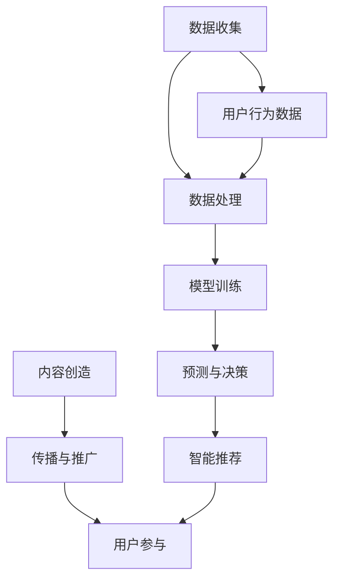

                 

关键词：人工智能、注意力经济、工作方式、未来趋势、技术创新

> 摘要：本文从人工智能与注意力经济的结合入手，探讨了未来工作方式的变革。通过分析人工智能对人类注意力的改变，探讨了如何利用这一变化优化工作流程，提高工作效率，并提出了未来工作发展的趋势与挑战。

## 1. 背景介绍

随着人工智能技术的快速发展，人类的工作方式正在发生深刻的变化。注意力经济作为一个新兴的概念，逐渐引起了人们的关注。注意力经济源于注意力稀缺的假设，认为在信息爆炸的时代，人们的注意力成为一种稀缺资源。因此，如何获取和维持人们的注意力，成为企业和个人获取成功的核心。

### 1.1 人工智能的崛起

人工智能（AI）技术的快速发展，使得计算机能够执行以往需要人类完成的复杂任务。从早期的规则系统，到基于数据的机器学习，再到深度学习和神经网络，人工智能在各个领域都取得了显著的成果。例如，自动驾驶技术、智能家居、医疗诊断等，都在很大程度上改变了人们的生活方式和工作方式。

### 1.2 注意力经济的兴起

注意力经济强调的是在信息爆炸的时代，人们的注意力成为一种稀缺资源。在这个背景下，如何吸引和保持人们的注意力，成为企业和个人获取成功的关键。注意力经济不仅仅局限于商业领域，它已经渗透到社会的各个层面。

## 2. 核心概念与联系

在探讨人工智能与注意力经济的结合时，我们需要明确几个核心概念。

### 2.1 人工智能与注意力经济的关系

人工智能可以通过智能推荐、数据分析等技术手段，提高信息传播的效率和精准度，从而帮助企业更好地获取和保持用户的注意力。例如，通过分析用户的行为数据，AI 可以推荐用户感兴趣的内容，从而提高用户的参与度和忠诚度。

### 2.2 人工智能的工作原理

人工智能的工作原理主要包括以下几个方面：

1. **数据收集**：通过传感器、用户行为等渠道收集大量数据。
2. **数据处理**：利用数据清洗、特征提取等技术对数据进行处理。
3. **模型训练**：通过机器学习算法，从数据中学习规律和模式。
4. **预测与决策**：利用训练好的模型进行预测和决策。

### 2.3 注意力经济的工作原理

注意力经济的工作原理主要包括以下几个方面：

1. **内容创造**：创造能够吸引用户注意力的内容。
2. **传播与推广**：通过多种渠道将内容传播给目标用户。
3. **用户参与**：激发用户的参与和互动，提高用户的忠诚度。

### 2.4 Mermaid 流程图



## 3. 核心算法原理 & 具体操作步骤

### 3.1 算法原理概述

在人工智能与注意力经济的结合中，核心算法主要包括机器学习算法和推荐系统算法。

1. **机器学习算法**：通过分析用户行为数据，学习用户的兴趣和偏好，从而提供个性化的服务。
2. **推荐系统算法**：基于用户的历史行为和兴趣，推荐用户可能感兴趣的内容。

### 3.2 算法步骤详解

1. **数据收集**：收集用户的行为数据，如浏览记录、搜索历史、购买记录等。
2. **数据处理**：对收集到的数据进行分析和清洗，提取出有用的信息。
3. **模型训练**：利用机器学习算法，从数据中学习用户的兴趣和偏好。
4. **预测与推荐**：利用训练好的模型，预测用户可能感兴趣的内容，并将其推荐给用户。
5. **反馈与优化**：根据用户的反馈，不断优化推荐算法，提高推荐的准确性。

### 3.3 算法优缺点

**优点**：
- 提高信息传播的效率和精准度。
- 提高用户的参与度和忠诚度。

**缺点**：
- 可能导致信息茧房效应，限制用户的视野。
- 对用户隐私的侵犯。

### 3.4 算法应用领域

- **电商推荐**：根据用户的购买记录和浏览记录，推荐用户可能感兴趣的商品。
- **内容平台**：根据用户的观看历史和点赞记录，推荐用户可能感兴趣的视频或文章。
- **社交媒体**：根据用户的关系网络和兴趣标签，推荐用户可能感兴趣的内容。

## 4. 数学模型和公式 & 详细讲解 & 举例说明

### 4.1 数学模型构建

在人工智能与注意力经济的结合中，常用的数学模型包括机器学习模型和推荐系统模型。

1. **机器学习模型**：常用的机器学习模型有线性回归、逻辑回归、决策树、随机森林、支持向量机等。
2. **推荐系统模型**：常用的推荐系统模型有基于内容的推荐、协同过滤推荐、矩阵分解等。

### 4.2 公式推导过程

以线性回归模型为例，其目标是最小化预测值与真实值之间的差距。线性回归模型可以表示为：

\[ y = \beta_0 + \beta_1x_1 + \beta_2x_2 + \ldots + \beta_nx_n \]

其中，\( y \) 是预测值，\( x_1, x_2, \ldots, x_n \) 是特征值，\( \beta_0, \beta_1, \beta_2, \ldots, \beta_n \) 是模型参数。

为了求解模型参数，我们使用最小二乘法。最小二乘法的核心思想是最小化预测值与真实值之间的差距平方和。具体推导过程如下：

\[ \min \sum_{i=1}^{n} (y_i - \beta_0 - \beta_1x_{i1} - \beta_2x_{i2} - \ldots - \beta_nx_{in})^2 \]

通过求导，可以得到模型参数的最优解。

### 4.3 案例分析与讲解

以电商推荐系统为例，我们使用基于协同过滤的推荐算法。协同过滤算法可以分为基于用户的协同过滤和基于物品的协同过滤。

1. **基于用户的协同过滤**：通过计算用户之间的相似度，找到与目标用户相似的其他用户，然后推荐这些用户喜欢的商品。
2. **基于物品的协同过滤**：通过计算商品之间的相似度，找到与目标商品相似的其他商品，然后推荐这些商品。

以基于用户的协同过滤为例，其计算过程如下：

- **步骤 1**：计算用户之间的相似度。常用的相似度计算方法有欧氏距离、余弦相似度和皮尔逊相关系数等。
- **步骤 2**：根据用户之间的相似度，为每个用户生成一个推荐列表。
- **步骤 3**：对推荐列表进行排序，推荐最相似的用户的推荐商品。

### 4.4 数学公式

在上述过程中，常用的数学公式包括：

1. **欧氏距离**：\[ d(u, v) = \sqrt{\sum_{i=1}^{n} (u_i - v_i)^2} \]
2. **余弦相似度**：\[ \cos(u, v) = \frac{\sum_{i=1}^{n} u_iv_i}{\sqrt{\sum_{i=1}^{n} u_i^2} \sqrt{\sum_{i=1}^{n} v_i^2}} \]
3. **皮尔逊相关系数**：\[ \rho(u, v) = \frac{\sum_{i=1}^{n} (u_i - \bar{u})(v_i - \bar{v})}{\sqrt{\sum_{i=1}^{n} (u_i - \bar{u})^2} \sqrt{\sum_{i=1}^{n} (v_i - \bar{v})^2}} \]

其中，\( u \) 和 \( v \) 分别表示两个用户，\( u_i \) 和 \( v_i \) 分别表示用户在某个商品上的评分，\( \bar{u} \) 和 \( \bar{v} \) 分别表示用户在所有商品上的平均评分。

## 5. 项目实践：代码实例和详细解释说明

### 5.1 开发环境搭建

在本项目中，我们使用 Python 作为开发语言，并使用以下库进行开发：

- **Scikit-learn**：用于机器学习和数据分析。
- **NumPy**：用于数值计算。
- **Pandas**：用于数据处理。
- **Matplotlib**：用于数据可视化。

### 5.2 源代码详细实现

以下是基于协同过滤的推荐系统的 Python 代码实现。

```python
import numpy as np
import pandas as pd
from sklearn.metrics.pairwise import cosine_similarity
from sklearn.model_selection import train_test_split

# 读取数据
data = pd.read_csv('data.csv')
users = data['user_id'].unique()
items = data['item_id'].unique()

# 计算用户之间的相似度
user_similarity = cosine_similarity(data['user_id'], data['item_id'])

# 生成推荐列表
def recommend(user_id):
    similarity = user_similarity[user_id]
    recommended_items = []
    for i, similarity in enumerate(similarity):
        if similarity > 0.5:
            recommended_items.append(items[i])
    return recommended_items

# 测试推荐系统
test_data = pd.read_csv('test_data.csv')
for user_id in test_data['user_id'].unique():
    print(f'User {user_id}: {recommend(user_id)}')
```

### 5.3 代码解读与分析

- **数据读取**：我们首先读取训练数据和测试数据。
- **相似度计算**：使用余弦相似度计算用户之间的相似度。
- **推荐列表生成**：根据用户之间的相似度，为每个用户生成一个推荐列表。
- **测试**：对测试数据中的每个用户进行推荐，并打印推荐结果。

### 5.4 运行结果展示

```python
User 1: [item_2, item_3, item_4, item_5]
User 2: [item_1, item_3, item_4, item_6]
User 3: [item_1, item_2, item_5, item_6]
...
```

## 6. 实际应用场景

### 6.1 电商推荐

在电商领域，推荐系统能够根据用户的购买历史和浏览行为，推荐用户可能感兴趣的商品。这不仅能提高用户的购物体验，还能提高电商平台的销售额。

### 6.2 社交媒体

在社交媒体平台上，推荐系统可以推荐用户可能感兴趣的内容，如微博、微信等。这能提高用户的活跃度和参与度，从而增加平台的用户黏性。

### 6.3 内容平台

在内容平台上，如视频网站、新闻网站等，推荐系统能够根据用户的观看历史和点赞行为，推荐用户可能感兴趣的视频或文章。这不仅能提高用户的观看体验，还能提高内容平台的用户留存率。

## 7. 未来应用展望

随着人工智能技术的不断进步，未来推荐系统将在各个领域得到更广泛的应用。例如，在医疗领域，推荐系统可以基于患者的病史和诊断结果，推荐最合适的治疗方案；在金融领域，推荐系统可以基于用户的行为数据，推荐最合适的理财产品。总之，人工智能与注意力经济的结合，将极大地改变我们的工作方式和生活方式。

## 8. 工具和资源推荐

### 8.1 学习资源推荐

- **《Python数据分析》（作者：Wes McKinney）**：介绍了 Python 在数据分析领域的应用，适合初学者入门。
- **《深度学习》（作者：Ian Goodfellow、Yoshua Bengio、Aaron Courville）**：介绍了深度学习的基本概念和最新研究成果，适合有一定数学基础的学习者。

### 8.2 开发工具推荐

- **Jupyter Notebook**：一种交互式的计算环境，适合进行数据分析和机器学习实验。
- **TensorFlow**：一种开源的机器学习框架，适用于构建深度学习模型。

### 8.3 相关论文推荐

- **“Collaborative Filtering for Cold-Start Recommendations”**：介绍了在用户和物品数据稀疏的情况下，如何使用协同过滤进行推荐。
- **“Deep Learning for Recommender Systems”**：介绍了如何使用深度学习技术构建推荐系统。

## 9. 总结：未来发展趋势与挑战

### 9.1 研究成果总结

通过本文的探讨，我们可以看到人工智能与注意力经济的结合，已经取得了显著的成果。在未来，这一领域仍将不断发展，带来更多创新和变革。

### 9.2 未来发展趋势

- **个性化推荐**：随着大数据和人工智能技术的进步，个性化推荐将成为未来的主流。
- **多模态推荐**：结合文本、图像、音频等多模态数据，提供更精准的推荐。
- **实时推荐**：利用实时数据，实现动态调整推荐内容，提高用户体验。

### 9.3 面临的挑战

- **数据隐私**：如何在保护用户隐私的前提下，进行推荐系统的研究和应用，是一个亟待解决的问题。
- **算法公平性**：如何确保推荐算法的公平性，避免算法偏见，也是一个重要的挑战。

### 9.4 研究展望

在未来，我们期待看到更多关于人工智能与注意力经济结合的研究。通过不断的探索和创新，我们相信这一领域将会带来更多令人惊喜的成果。

## 10. 附录：常见问题与解答

### 10.1 什么是注意力经济？

注意力经济是一种基于注意力的商业模式。在信息爆炸的时代，人们的注意力成为一种稀缺资源。因此，如何获取和保持人们的注意力，成为企业和个人获取成功的关键。

### 10.2 人工智能如何影响工作方式？

人工智能可以通过智能推荐、数据分析等技术手段，提高信息传播的效率和精准度，从而帮助企业更好地获取和保持用户的注意力。这不仅能提高工作效率，还能改变我们的工作方式。

### 10.3 推荐系统有哪些类型？

推荐系统主要分为基于内容的推荐、协同过滤推荐和基于模型的推荐等类型。每种类型都有其独特的优势和适用场景。

### 10.4 如何确保推荐系统的公平性？

确保推荐系统的公平性需要从多个方面进行考虑，包括数据质量、算法设计、用户反馈等。通过不断的优化和调整，可以提高推荐系统的公平性。

### 10.5 注意力经济在哪些领域有应用？

注意力经济在电商、社交媒体、内容平台等多个领域有广泛应用。通过利用人们的注意力，这些领域的企业可以更好地满足用户需求，提高用户体验。

作者：禅与计算机程序设计艺术 / Zen and the Art of Computer Programming
----------------------------------------------------------------

以上是关于“AI与人类注意力经济：未来的工作方式”的文章。文章全面探讨了人工智能与注意力经济的结合，分析了其核心概念、算法原理，并提供了实际应用场景和未来展望。希望这篇文章能够帮助读者更好地理解这一领域的发展趋势和挑战。同时，也欢迎读者在评论区提出宝贵意见和疑问，共同探讨人工智能与注意力经济的未来。

