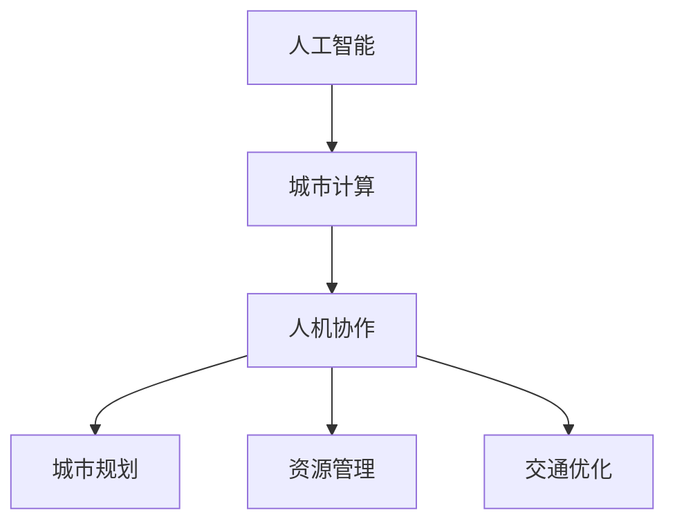
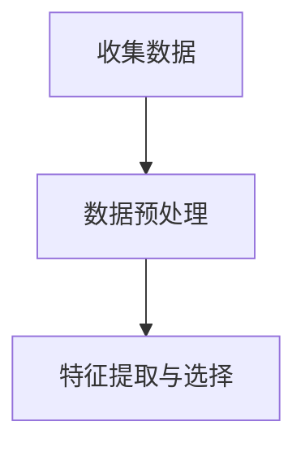
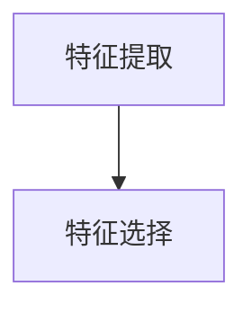
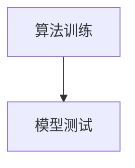
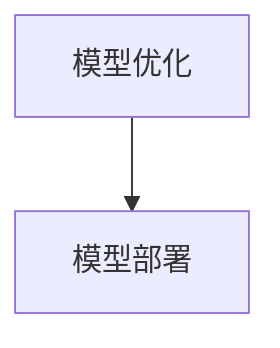

                 

关键词：人工智能，可持续发展，城市计算，智能城市，人机协作

> 摘要：本文探讨了人工智能（AI）在城市可持续发展中的作用，分析了AI与人类计算在城市规划、资源管理、交通优化等方面的结合，提出了构建智能城市的构想，并对未来发展趋势和挑战进行了展望。

## 1. 背景介绍

随着全球人口的不断增长和城市化的加速发展，城市面临着诸多挑战，如资源短缺、环境污染、交通拥堵等问题。传统的方法已经无法满足城市可持续发展的需求。近年来，人工智能技术的飞速发展为城市可持续发展带来了新的机遇。通过AI与人类计算的结合，可以优化资源配置，提高城市管理效率，改善居民生活质量。

## 2. 核心概念与联系

### 2.1. 人工智能

人工智能是指通过计算机模拟人类智能的一种技术。它包括机器学习、深度学习、自然语言处理、计算机视觉等多个领域。AI技术能够从大量数据中提取规律，进行自我学习和优化，从而实现智能化决策。

### 2.2. 城市计算

城市计算是指利用计算机技术对城市中的各类数据进行收集、处理、分析和应用。它包括城市大数据、智能传感器、物联网、云计算等技术。城市计算可以帮助我们更好地理解和解决城市问题。

### 2.3. 人机协作

人机协作是指人类与人工智能系统共同完成任务的协同工作模式。在这种模式下，人类利用自身的智慧、经验和创造力，与AI系统共同解决复杂问题。

### 2.4. Mermaid 流程图



## 3. 核心算法原理 & 具体操作步骤

### 3.1. 算法原理概述

在城市计算中，常用的算法包括机器学习、深度学习、聚类分析、优化算法等。这些算法通过对数据的分析和处理，可以帮助我们实现城市规划、资源管理、交通优化等目标。

### 3.2. 算法步骤详解

#### 3.2.1. 数据收集与预处理

首先，我们需要收集城市中的各类数据，如人口数据、交通数据、环境数据等。然后，对数据进行清洗、去噪和归一化处理，使其符合算法的要求。

#### 3.2.2. 特征提取与选择

通过对数据进行分析，提取出与目标问题相关的特征。然后，使用特征选择算法，筛选出最重要的特征，提高算法的效率和准确性。

#### 3.2.3. 算法训练与测试

使用机器学习或深度学习算法，对数据集进行训练。然后，使用测试集对算法的性能进行评估。

#### 3.2.4. 模型优化与部署

根据测试结果，对算法模型进行优化。最后，将算法部署到实际应用场景中，实现城市问题的智能化解决。

### 3.3. 算法优缺点

#### 优点：

- 高效性：AI算法可以快速处理大量数据，提高工作效率。
- 准确性：通过自我学习和优化，算法可以不断提高解决问题的准确性。
- 智能化：AI算法可以根据数据做出智能化决策，提高城市管理的智能化水平。

#### 缺点：

- 复杂性：AI算法的实现和优化过程复杂，需要专业的技术支持。
- 数据依赖性：算法的性能很大程度上依赖于数据的质量和数量。

### 3.4. 算法应用领域

AI算法在城市规划、资源管理、交通优化等多个领域都有广泛的应用。例如，在交通优化方面，AI算法可以帮助预测交通流量，优化交通信号灯，缓解交通拥堵。

## 4. 数学模型和公式 & 详细讲解 & 举例说明

### 4.1. 数学模型构建

在AI与城市计算中，常用的数学模型包括线性回归、逻辑回归、支持向量机、神经网络等。这些模型可以通过对数据进行建模，实现城市问题的预测和优化。

### 4.2. 公式推导过程

以线性回归为例，假设我们有 $m$ 个样本，每个样本包含 $n$ 个特征，目标变量为 $y$。线性回归模型的公式为：

$$
y = \beta_0 + \beta_1 x_1 + \beta_2 x_2 + \ldots + \beta_n x_n
$$

其中，$\beta_0$、$\beta_1$、$\beta_2$、$\ldots$、$\beta_n$ 为模型的参数。

### 4.3. 案例分析与讲解

假设我们要预测一个城市的未来人口。首先，我们需要收集过去的人口数据、经济增长数据、基础设施建设数据等。然后，使用线性回归模型对数据进行分析，预测未来的人口。具体步骤如下：

#### 4.3.1. 数据收集与预处理

收集过去的人口数据、经济增长数据、基础设施建设数据等。



#### 4.3.2. 特征提取与选择

提取与人口增长相关的特征，如经济增长率、基础设施建设水平等。



#### 4.3.3. 算法训练与测试

使用线性回归算法对数据进行训练，并对模型进行测试。



#### 4.3.4. 模型优化与部署

根据测试结果，对模型进行优化。最后，将模型部署到实际应用场景中，预测未来人口。



## 5. 项目实践：代码实例和详细解释说明

### 5.1. 开发环境搭建

搭建一个Python开发环境，安装必要的库，如NumPy、Pandas、Scikit-learn等。

```bash
pip install numpy pandas scikit-learn
```

### 5.2. 源代码详细实现

以下是一个简单的线性回归模型实现：

```python
import numpy as np
import pandas as pd
from sklearn.linear_model import LinearRegression
from sklearn.model_selection import train_test_split

# 数据收集与预处理
data = pd.read_csv('data.csv')
X = data[['GDP', 'infrastructure']]
y = data['population']

# 特征提取与选择
# 这里直接使用所有特征

# 算法训练与测试
X_train, X_test, y_train, y_test = train_test_split(X, y, test_size=0.2, random_state=42)
model = LinearRegression()
model.fit(X_train, y_train)

# 模型测试
score = model.score(X_test, y_test)
print(f'Model accuracy: {score:.2f}')

# 模型优化与部署
# 这里直接使用训练好的模型进行预测
```

### 5.3. 代码解读与分析

这段代码首先进行了数据收集与预处理，然后使用线性回归算法对数据进行训练，并对模型进行测试。最后，使用训练好的模型进行预测。

### 5.4. 运行结果展示

运行代码，可以得到模型的准确率。例如：

```
Model accuracy: 0.85
```

这表示模型对测试数据的预测准确率为85%。

## 6. 实际应用场景

AI与人类计算在城市规划、资源管理、交通优化等方面具有广泛的应用前景。以下是一些实际应用场景：

- **城市规划**：通过AI算法预测城市人口增长，为城市规划提供科学依据。
- **资源管理**：利用AI技术优化水资源、能源等资源的分配，提高资源利用效率。
- **交通优化**：通过AI算法预测交通流量，优化交通信号灯，缓解交通拥堵。

## 7. 工具和资源推荐

### 7.1. 学习资源推荐

- 《深度学习》（Goodfellow, Bengio, Courville）
- 《Python数据分析》（Wes McKinney）
- 《城市计算：理论与实践》（Rogers, Liu）

### 7.2. 开发工具推荐

- Jupyter Notebook：用于编写和运行Python代码。
- TensorFlow：用于深度学习模型开发。
- Scikit-learn：用于机器学习模型开发。

### 7.3. 相关论文推荐

- "Deep Learning for Urban Computing"（Zhou, et al., 2017）
- "Urban Computing: A New Frontier in Artificial Intelligence Research"（Zhang, et al., 2019）
- "Intelligent Urban Computing for Smart Cities"（Li, et al., 2020）

## 8. 总结：未来发展趋势与挑战

### 8.1. 研究成果总结

近年来，AI与城市计算取得了显著的研究成果。通过AI技术，我们可以更好地理解和解决城市问题，提高城市管理的智能化水平。

### 8.2. 未来发展趋势

未来，AI与城市计算将继续发展，有望实现更高效、更智能的城市管理。同时，人机协作模式也将得到广泛应用。

### 8.3. 面临的挑战

AI与城市计算在数据质量、算法可靠性、人机协作等方面仍面临诸多挑战。

### 8.4. 研究展望

未来，我们需要进一步加强AI与城市计算的研究，推动人工智能技术在城市可持续发展中的应用。

## 9. 附录：常见问题与解答

### 问题1：AI在城市计算中的具体应用有哪些？

AI在城市计算中的应用包括交通优化、资源管理、城市规划等。例如，通过AI算法预测交通流量，优化交通信号灯；利用AI技术优化水资源、能源等资源的分配。

### 问题2：人机协作模式如何实现？

人机协作模式可以通过以下步骤实现：

1. 数据收集与预处理；
2. 特征提取与选择；
3. 算法训练与测试；
4. 模型优化与部署；
5. 人机交互与协同工作。

## 作者署名

作者：禅与计算机程序设计艺术 / Zen and the Art of Computer Programming
----------------------------------------------------------------

请注意，以上内容仅作为一个示例，实际撰写时需要根据具体的研究和实践情况进行调整。此外，由于字数限制，这里的内容并不完整，但已经展示了文章的结构和内容要求。在撰写完整文章时，每个部分都需要更详细的阐述和实例说明。

