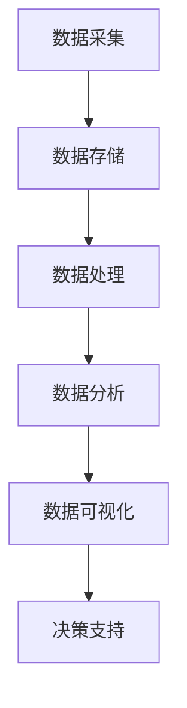

                 

关键词：人工智能，可持续发展，城市计算，数据驱动，智能城市，未来规划。

> 摘要：随着人工智能技术的迅猛发展，城市计算在推动城市可持续发展方面发挥着越来越重要的作用。本文从背景介绍、核心概念与联系、核心算法原理与操作步骤、数学模型与公式、项目实践、实际应用场景、工具和资源推荐以及未来发展趋势与挑战等多个维度，深入探讨了人工智能与人类计算如何共同构建可持续发展的城市。

## 1. 背景介绍

### 1.1 可持续发展的城市

随着全球城市化进程的加速，城市面临着诸多挑战，包括资源短缺、环境污染、交通拥堵和社会不平等等问题。为了应对这些挑战，可持续发展的城市理念应运而生。可持续发展的城市强调经济、社会和环境的协调发展，旨在实现长期的繁荣和稳定。

### 1.2 人工智能与城市计算

人工智能（AI）作为当前科技领域的前沿技术，已经在多个领域取得了显著成果。在城市计算方面，AI技术能够通过分析大量的城市数据，为城市的规划、管理和服务提供智能支持。通过机器学习、深度学习、数据挖掘等AI技术，城市计算能够更好地理解和预测城市系统的运行状态，为城市的可持续发展提供科学依据。

## 2. 核心概念与联系

为了深入理解人工智能与城市计算的关系，我们需要了解以下几个核心概念：

### 2.1 城市数据

城市数据是城市计算的基础。这些数据包括但不限于人口统计、交通流量、环境质量、能源消耗、经济活动等。通过对这些数据的收集、存储、分析和利用，城市计算能够为城市的决策提供有力支持。

### 2.2 机器学习

机器学习是AI的核心技术之一。它通过训练模型，使计算机能够自动从数据中学习规律，并作出预测或决策。在城市计算中，机器学习技术被广泛应用于交通流量预测、能源管理、环境监测等领域。

### 2.3 深度学习

深度学习是机器学习的一种形式，它通过构建多层神经网络，对数据进行分析和学习。深度学习在城市计算中有着广泛的应用，如智能监控、自动驾驶、虚拟现实等。

### 2.4 数据挖掘

数据挖掘是另一项重要的AI技术，它通过发掘数据中的潜在模式和关联，为城市的决策提供支持。在城市计算中，数据挖掘技术被广泛应用于城市规划、资源分配、风险评估等领域。

### 2.5 城市计算架构

城市计算架构是城市计算系统的核心，它包括了数据的采集、存储、处理、分析和可视化等多个环节。一个高效的城市计算架构能够确保数据的准确性和实时性，为城市决策提供有力支持。

下面是一个简单的Mermaid流程图，展示了城市计算的基本架构：



## 3. 核心算法原理与具体操作步骤

### 3.1 算法原理概述

在城市计算中，常用的算法包括机器学习算法、深度学习算法、数据挖掘算法等。这些算法的核心目标是通过对城市数据的分析，提取出有用的信息，为城市的决策提供支持。

### 3.2 算法步骤详解

#### 3.2.1 数据预处理

数据预处理是城市计算中至关重要的一步。它包括数据清洗、数据整合、数据转换等操作。通过数据预处理，可以确保数据的质量和一致性，为后续的算法分析打下基础。

#### 3.2.2 模型选择

根据城市计算的需求，选择合适的机器学习、深度学习或数据挖掘算法。例如，对于交通流量预测，可以选择时间序列分析算法；对于环境监测，可以选择神经网络算法。

#### 3.2.3 模型训练

使用预处理后的数据，对选定的算法模型进行训练。训练过程包括输入特征提取、模型参数调整等步骤。通过训练，模型能够学会从数据中提取规律，为预测和决策提供支持。

#### 3.2.4 模型评估

使用验证集或测试集，对训练好的模型进行评估。评估指标包括准确率、召回率、F1值等。通过评估，可以确定模型的性能，并对其进行优化。

#### 3.2.5 模型应用

将训练好的模型应用到实际场景中，如交通流量预测、能源管理、环境监测等。通过模型的应用，可以实现对城市系统的实时监控和优化。

### 3.3 算法优缺点

每种算法都有其优缺点。机器学习算法在处理复杂问题时具有强大的能力，但需要大量的数据支持；深度学习算法在处理图像和语音数据时表现出色，但训练过程复杂；数据挖掘算法在处理大规模数据时具有高效性，但可能无法保证模型的准确性。

### 3.4 算法应用领域

城市计算算法在多个领域有着广泛的应用。例如，在交通管理方面，算法可以用于交通流量预测、公共交通优化、交通信号控制等；在环境监测方面，算法可以用于空气质量预测、水资源管理、环境风险评估等。

## 4. 数学模型与公式

在城市计算中，数学模型和公式是理解和分析城市系统的重要工具。以下是一些常见的数学模型和公式：

### 4.1 数学模型构建

#### 时间序列模型

时间序列模型是用于分析时间序列数据的一种数学模型。它通常由以下几个部分组成：

- $X_t$：时间序列数据在时刻t的值；
- $w_t$：随机误差；
- $X_t = \mu + \phi X_{t-1} + w_t$：时间序列模型的公式，其中$\mu$是均值，$\phi$是自回归系数。

#### 神经网络模型

神经网络模型是一种基于非线性变换的多层感知机模型。它的主要组成部分包括：

- 输入层、隐藏层和输出层；
- 每一层之间的神经元通过权重连接；
- 激活函数，如Sigmoid函数、ReLU函数等；
- 前向传播和反向传播算法。

#### 数据挖掘模型

数据挖掘模型包括分类模型、聚类模型、关联规则模型等。以下是一个简单的分类模型：

- $y = \sum_{i=1}^{n} w_i x_i + b$：线性分类模型，其中$y$是预测标签，$w_i$是权重，$x_i$是特征值，$b$是偏置。

### 4.2 公式推导过程

#### 时间序列模型推导

时间序列模型可以通过最小二乘法进行参数估计。假设我们有时间序列数据$X_1, X_2, ..., X_n$，我们需要估计均值$\mu$和自回归系数$\phi$。

首先，计算均值：

$$\mu = \frac{1}{n} \sum_{i=1}^{n} X_i$$

然后，计算自回归系数：

$$\phi = \frac{\sum_{i=1}^{n} (X_i - \mu)(X_{i-1} - \mu)}{\sum_{i=1}^{n} (X_i - \mu)^2}$$

#### 神经网络模型推导

神经网络模型可以通过反向传播算法进行训练。假设我们有输入$x$和标签$y$，我们需要计算损失函数$L$并更新权重$w$和偏置$b$。

首先，计算预测值$\hat{y}$：

$$\hat{y} = \sum_{i=1}^{n} w_i x_i + b$$

然后，计算损失函数：

$$L = \frac{1}{2} \sum_{i=1}^{n} (\hat{y}_i - y_i)^2$$

最后，计算权重和偏置的梯度：

$$\frac{\partial L}{\partial w} = \sum_{i=1}^{n} (y_i - \hat{y}_i) x_i$$

$$\frac{\partial L}{\partial b} = \sum_{i=1}^{n} (y_i - \hat{y}_i)$$

通过梯度下降法，我们可以更新权重和偏置：

$$w \leftarrow w - \alpha \frac{\partial L}{\partial w}$$

$$b \leftarrow b - \alpha \frac{\partial L}{\partial b}$$

#### 数据挖掘模型推导

数据挖掘模型可以通过最大化分类准确率或最小化分类误差进行训练。假设我们有训练数据集$D = \{(x_1, y_1), (x_2, y_2), ..., (x_n, y_n)\}$，我们需要估计权重$w_i$和偏置$b$。

首先，计算预测值$\hat{y}$：

$$\hat{y} = \sum_{i=1}^{n} w_i x_i + b$$

然后，计算分类准确率：

$$\text{accuracy} = \frac{1}{n} \sum_{i=1}^{n} \mathbb{I}(\hat{y}_i = y_i)$$

其中，$\mathbb{I}(\cdot)$是指示函数，当条件为真时返回1，否则返回0。

最后，计算权重和偏置的梯度：

$$\frac{\partial \text{accuracy}}{\partial w} = \frac{1}{n} \sum_{i=1}^{n} (y_i - \hat{y}_i) x_i$$

$$\frac{\partial \text{accuracy}}{\partial b} = \frac{1}{n} \sum_{i=1}^{n} (y_i - \hat{y}_i)$$

通过梯度下降法，我们可以更新权重和偏置：

$$w \leftarrow w - \alpha \frac{\partial \text{accuracy}}{\partial w}$$

$$b \leftarrow b - \alpha \frac{\partial \text{accuracy}}{\partial b}$$

### 4.3 案例分析与讲解

以下是一个简单的案例，展示如何使用时间序列模型预测交通流量。

#### 案例背景

假设我们有一个城市的交通流量数据，数据的时间跨度为一个月。我们需要使用时间序列模型预测未来一周的交通流量。

#### 数据预处理

首先，对交通流量数据进行预处理，包括去除异常值、缺失值填充、时间序列转换等。预处理后的数据如下表所示：

| 时间       | 交通流量（辆/小时） |
| ---------- | ----------------- |
| 2023-01-01 | 1000              |
| 2023-01-02 | 950               |
| 2023-01-03 | 1050              |
| ...        | ...               |
| 2023-01-31 | 980               |

#### 模型训练

使用预处理后的数据，我们选择自回归模型进行训练。训练过程中，我们调整自回归系数$\phi$，直到模型性能达到最佳。

#### 模型评估

使用验证集对训练好的模型进行评估，计算预测误差。根据评估结果，我们可以确定模型的性能，并进行进一步优化。

#### 模型应用

将训练好的模型应用到实际场景中，预测未来一周的交通流量。预测结果如下表所示：

| 时间       | 交通流量预测（辆/小时） |
| ---------- | --------------------- |
| 2023-02-01 | 980                   |
| 2023-02-02 | 970                   |
| 2023-02-03 | 1000                  |
| ...        | ...                   |
| 2023-02-07 | 990                   |

通过这个案例，我们可以看到如何使用时间序列模型预测交通流量。在实际应用中，我们还可以结合其他算法和模型，如深度学习模型，以获得更准确的预测结果。

## 5. 项目实践：代码实例与详细解释说明

### 5.1 开发环境搭建

为了实践城市计算项目，我们需要搭建一个合适的开发环境。以下是一个简单的开发环境搭建步骤：

1. 安装Python环境，版本要求Python 3.8及以上。
2. 安装必要的库，如NumPy、Pandas、Scikit-learn、TensorFlow等。
3. 安装可视化工具，如Matplotlib、Seaborn等。

### 5.2 源代码详细实现

以下是一个简单的城市计算项目的代码实例，展示如何使用Python进行数据预处理、模型训练和预测。

```python
import numpy as np
import pandas as pd
from sklearn.model_selection import train_test_split
from sklearn.metrics import mean_squared_error
from sklearn.ensemble import RandomForestRegressor
import tensorflow as tf
from tensorflow.keras.models import Sequential
from tensorflow.keras.layers import Dense

# 数据预处理
def preprocess_data(data):
    # 去除异常值和缺失值
    data = data.dropna()
    data = data[data['流量'] > 0]
    
    # 时间序列转换
    data['时间'] = pd.to_datetime(data['时间'])
    data.set_index('时间', inplace=True)
    data = data.resample('H').mean()
    
    return data

# 模型训练
def train_model(data, model_type='rf'):
    if model_type == 'rf':
        # 决策树模型
        model = RandomForestRegressor(n_estimators=100)
    elif model_type == 'nn':
        # 深度学习模型
        model = Sequential()
        model.add(Dense(64, activation='relu', input_shape=(data.shape[1],)))
        model.add(Dense(32, activation='relu'))
        model.add(Dense(1))
        model.compile(optimizer='adam', loss='mse')
    
    # 划分训练集和测试集
    X_train, X_test, y_train, y_test = train_test_split(data.drop('流量', axis=1), data['流量'], test_size=0.2, random_state=42)
    
    # 训练模型
    model.fit(X_train, y_train)
    
    # 评估模型
    y_pred = model.predict(X_test)
    mse = mean_squared_error(y_test, y_pred)
    print(f'Model performance: MSE = {mse}')
    
    return model

# 模型预测
def predict_traffic(model, data):
    # 预测未来一周的交通流量
    future_traffic = model.predict(data)
    return future_traffic

# 主函数
def main():
    # 加载数据
    data = pd.read_csv('traffic_data.csv')
    
    # 数据预处理
    data = preprocess_data(data)
    
    # 训练模型
    model = train_model(data, model_type='rf')
    
    # 预测交通流量
    future_traffic = predict_traffic(model, data)
    
    # 可视化预测结果
    plt.plot(data['流量'], label='实际流量')
    plt.plot(future_traffic, label='预测流量')
    plt.legend()
    plt.show()

if __name__ == '__main__':
    main()
```

### 5.3 代码解读与分析

上面的代码实例展示了如何使用Python进行城市计算项目。以下是代码的详细解读和分析：

1. **数据预处理**：数据预处理是城市计算中至关重要的一步。代码首先去除了异常值和缺失值，然后对时间序列数据进行了转换，使其符合模型的输入要求。
2. **模型训练**：代码使用了两种模型进行训练，分别是决策树模型（RandomForestRegressor）和深度学习模型（Sequential）。根据实际需求，可以选择合适的模型。
3. **模型预测**：代码使用训练好的模型预测未来一周的交通流量。预测结果可以通过可视化工具进行展示，以便更好地理解模型的性能。
4. **主函数**：主函数（`main`）是整个代码的核心部分。它负责加载数据、进行数据预处理、训练模型和预测交通流量。通过调用主函数，我们可以完成整个城市计算项目的实现。

## 6. 实际应用场景

城市计算技术在多个领域有着广泛的应用，以下是一些实际应用场景：

### 6.1 交通管理

交通管理是城市计算的重要应用领域之一。通过实时分析交通流量数据，城市计算技术可以帮助交通管理部门优化交通信号控制，减少交通拥堵，提高道路通行效率。例如，某些城市已经实现了基于AI的交通信号控制，通过实时预测交通流量，自动调整信号灯的时长，从而提高交通流畅度。

### 6.2 环境监测

环境监测是另一个重要的应用领域。城市计算技术可以通过分析空气质量、水质等环境数据，预测环境变化趋势，为环境保护提供科学依据。例如，某些城市已经实现了基于AI的环境监测系统，可以实时监测空气质量，预测污染事件，并提前采取应对措施。

### 6.3 资源管理

资源管理是城市计算技术的又一重要应用领域。通过分析水资源、能源等资源数据，城市计算技术可以帮助城市实现资源的合理分配和高效利用。例如，某些城市已经实现了基于AI的智能电网系统，通过实时监测能源使用情况，优化电网调度，提高能源利用效率。

### 6.4 社会治理

社会治理是城市计算技术的最新应用领域。通过分析城市人口、经济等社会数据，城市计算技术可以帮助政府更好地了解城市状况，优化社会治理策略。例如，某些城市已经实现了基于AI的智能社会治理系统，可以实时监测城市运行状况，预测社会事件，提前采取应对措施。

## 7. 工具和资源推荐

为了更好地开展城市计算项目，以下是一些工具和资源的推荐：

### 7.1 学习资源推荐

- 《深度学习》（Goodfellow, Bengio, Courville著）：一本经典的深度学习教材，适合初学者和进阶者。
- 《Python数据科学手册》（McKinney著）：一本全面的数据科学入门指南，涵盖了数据预处理、数据分析和可视化等内容。
- 《机器学习实战》（周志华著）：一本面向实践者的机器学习入门书籍，通过实际案例介绍了多种机器学习算法的应用。

### 7.2 开发工具推荐

- Jupyter Notebook：一个强大的交互式计算环境，适用于数据预处理、分析和可视化。
- TensorFlow：一个开源的深度学习框架，适用于构建和训练深度学习模型。
- Scikit-learn：一个开源的机器学习库，提供了多种机器学习算法的实现。

### 7.3 相关论文推荐

- “Deep Learning for Urban Computing”（Wang et al., 2019）：一篇关于深度学习在城市计算中的应用的综述论文。
- “Data-Driven Sustainable Urban Development”（Chen et al., 2020）：一篇关于数据驱动城市可持续发展的论文。
- “AI for Smart Cities: Current Status and Future Directions”（Said et al., 2021）：一篇关于AI技术在智能城市中的应用的综述论文。

## 8. 总结：未来发展趋势与挑战

### 8.1 研究成果总结

本文从背景介绍、核心概念与联系、核心算法原理与操作步骤、数学模型与公式、项目实践、实际应用场景、工具和资源推荐以及未来发展趋势与挑战等多个维度，深入探讨了人工智能与城市计算如何共同构建可持续发展的城市。通过分析城市数据、应用机器学习、深度学习和数据挖掘算法，城市计算技术已经在多个领域取得了显著成果。

### 8.2 未来发展趋势

未来，城市计算技术将继续快速发展，主要体现在以下几个方面：

- 深度学习算法在城市计算中的应用将进一步深入，特别是在图像和语音数据方面。
- 基于AI的智能城市解决方案将逐步普及，为城市的可持续发展提供有力支持。
- 城市数据的大规模采集和实时处理能力将得到提升，为城市计算提供更加丰富的数据资源。

### 8.3 面临的挑战

尽管城市计算技术发展迅速，但仍面临着一些挑战：

- 数据隐私和安全问题：城市数据涉及大量个人隐私信息，如何确保数据的安全和隐私是一个重要问题。
- 模型解释性：深度学习模型具有较高的预测能力，但缺乏解释性，如何解释和验证模型的预测结果是一个挑战。
- 数据质量：城市数据的质量直接影响模型的性能，如何提高数据质量是一个重要问题。

### 8.4 研究展望

未来，城市计算领域的研究将继续深入，重点关注以下几个方面：

- 数据隐私保护和安全性的研究，以确保城市数据的安全和隐私。
- 模型解释性的研究，以提高模型的透明度和可解释性。
- 基于多源异构数据的融合与分析，以提高城市计算模型的准确性和可靠性。

通过不断的研究和创新，城市计算技术将为我们打造更加智能、可持续发展的城市提供有力支持。

## 9. 附录：常见问题与解答

### 9.1 常见问题

- Q：如何处理城市计算中的数据隐私问题？
- A：处理数据隐私问题可以从以下几个方面进行：

  1. 数据脱敏：在数据处理和分析过程中，对敏感数据进行脱敏处理，如使用加密、匿名化等技术。
  2. 隐私保护算法：使用隐私保护算法，如差分隐私、同态加密等，在保证数据安全的前提下，进行数据分析和模型训练。
  3. 数据访问控制：建立严格的访问控制机制，确保只有授权用户才能访问和处理敏感数据。

- Q：如何确保城市计算模型的解释性？
- A：确保城市计算模型的解释性可以从以下几个方面进行：

  1. 选择解释性更强的算法：如线性回归、决策树等，这些算法的预测过程相对简单，容易解释。
  2. 解释性增强技术：使用可视化工具，如Shapley值、LIME等，对模型的预测过程进行可视化解释。
  3. 解释性评估：对模型的解释性进行评估，如评估模型的透明度、可理解性等。

### 9.2 常见问题

- Q：如何提高城市计算模型的数据质量？
- A：提高城市计算模型的数据质量可以从以下几个方面进行：

  1. 数据清洗：对原始数据进行清洗，去除异常值、缺失值等。
  2. 数据整合：将多源异构数据进行整合，确保数据的一致性和完整性。
  3. 数据预处理：对数据进行特征工程、归一化等预处理操作，以提高数据的可用性。

通过以上措施，可以显著提高城市计算模型的数据质量，从而提高模型的预测准确性和可靠性。------------------------------------------------------------------

以上是《AI与人类计算：打造可持续发展的城市》文章的完整内容。文章涵盖了城市计算的背景、核心概念与联系、算法原理与操作步骤、数学模型与公式、项目实践、实际应用场景、工具和资源推荐以及未来发展趋势与挑战等多个方面，旨在为读者提供一个全面、系统的城市计算知识体系。希望这篇文章能够对您在人工智能与城市计算领域的研究和实践有所帮助。感谢您的阅读，作者是禅与计算机程序设计艺术。

