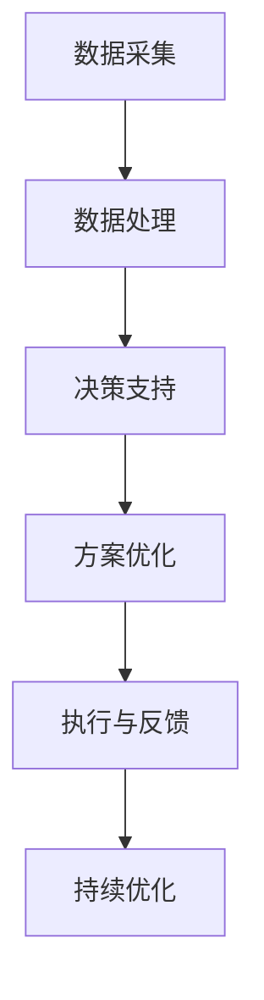

                 

作者：禅与计算机程序设计艺术 / Zen and the Art of Computer Programming

## 摘要

本文旨在探讨如何利用人工智能（AI）技术提升城市交通与基础设施建设的可持续性，通过系统化的规划和科学的管理，实现高效、安全、绿色的城市发展。文章首先介绍了城市交通与基础设施建设的背景和现状，然后详细阐述了AI在城市交通管理、基础设施建设、规划和建设管理等方面的应用，最后对未来的发展趋势和挑战进行了展望。

## 1. 背景介绍

### 1.1 城市交通与基础设施建设的重要性

城市交通与基础设施建设是城市发展的重要支撑，直接关系到城市的活力和居民的生活质量。随着城市化进程的加速，城市交通拥堵、基础设施老化、环境污染等问题日益严重，传统的方法已无法满足现代城市的发展需求。因此，引入AI技术成为了解决这些问题的有效途径。

### 1.2 AI技术的快速发展

近年来，AI技术取得了显著进展，特别是在深度学习、大数据分析、自主决策等领域。这些技术的快速发展为城市交通与基础设施建设提供了强大的技术支持，使得智能化、自动化、个性化的管理成为可能。

### 1.3 可持续发展的内涵

可持续发展是指满足当前需求而不损害后代满足自身需求的能力。在城市交通与基础设施建设中，可持续发展意味着在提高效率和舒适度的同时，降低能源消耗、减少污染、保护生态环境。

## 2. 核心概念与联系

为了更好地理解AI在城市交通与基础设施建设中的应用，我们需要了解以下几个核心概念及其相互关系：

### 2.1 智能交通系统（ITS）

智能交通系统是利用电子、计算机、通信、物联网、大数据等技术手段，实现交通信息的采集、处理、传输和利用，以提高交通效率、安全性和服务质量。ITS的核心概念包括交通信息采集、交通信息处理、交通信息传输和交通信息利用。

### 2.2 智能基础设施

智能基础设施是指利用物联网、大数据、云计算等技术，实现基础设施的智能化管理和运维。智能基础设施包括智能交通设施、智能能源设施、智能水利设施等。

### 2.3 城市规划与建设管理

城市规划与建设管理是城市发展的基础，涉及到城市布局、交通网络、公共设施、环境保护等方面。AI技术可以为城市规划与建设管理提供数据支持、决策辅助和优化建议。

### 2.4 Mermaid流程图

以下是AI技术在城市交通与基础设施建设中应用的一个简单的Mermaid流程图：



## 3. 核心算法原理 & 具体操作步骤

### 3.1 算法原理概述

AI在城市交通与基础设施建设中的应用主要基于以下几个核心算法原理：

- **深度学习**：通过模拟人脑神经网络，实现图像识别、语音识别、自然语言处理等功能。
- **大数据分析**：通过大数据技术，对海量数据进行挖掘和分析，发现规律和趋势。
- **自主决策**：利用决策树、神经网络、强化学习等技术，实现自主决策和优化。
- **多目标优化**：通过多目标优化算法，实现多个目标的平衡和优化。

### 3.2 算法步骤详解

以下是AI在城市交通与基础设施建设中应用的算法步骤：

#### 3.2.1 数据采集

- **交通流量数据**：通过交通摄像头、传感器等设备，实时采集交通流量数据。
- **环境数据**：通过气象站、环境监测设备等，实时采集环境数据。
- **基础设施状态数据**：通过传感器、物联网设备等，实时采集基础设施状态数据。

#### 3.2.2 数据处理

- **数据清洗**：去除噪声、缺失值等，保证数据质量。
- **数据融合**：将不同来源的数据进行融合，形成统一的数据集。
- **特征提取**：从数据中提取关键特征，为后续分析提供基础。

#### 3.2.3 决策支持

- **交通信号控制**：基于交通流量数据，实现智能交通信号控制。
- **交通规划**：基于环境数据、交通流量数据等，实现交通规划的优化。
- **基础设施建设**：基于基础设施状态数据，实现基础设施建设的优化。

#### 3.2.4 方案优化

- **路径优化**：基于交通流量数据，实现最优路径规划。
- **资源分配**：基于多目标优化算法，实现资源的最优分配。
- **风险评估**：基于大数据分析，实现风险预警和防控。

#### 3.2.5 执行与反馈

- **执行**：根据决策和优化方案，实施相应的措施。
- **反馈**：对实施效果进行评估和反馈，为下一轮决策提供依据。

#### 3.2.6 持续优化

- **模型更新**：根据反馈结果，更新AI模型，提高决策和优化效果。
- **迭代优化**：通过持续迭代，不断提高方案的科学性和可行性。

### 3.3 算法优缺点

#### 优点：

- **高效性**：AI技术可以实现快速、准确的决策和优化。
- **灵活性**：AI技术可以根据实时数据和环境变化，动态调整决策和优化方案。
- **智能化**：AI技术可以实现智能化管理，提高城市交通与基础设施建设的智能化水平。

#### 缺点：

- **依赖数据**：AI技术的效果很大程度上依赖于数据质量，数据缺失或不准确会影响决策效果。
- **技术门槛**：AI技术的应用需要较高的技术支持和人才储备。
- **安全性**：AI系统的安全性是一个挑战，需要确保数据安全和系统稳定。

### 3.4 算法应用领域

AI技术在城市交通与基础设施建设中具有广泛的应用领域，包括：

- **交通信号控制**：实现智能交通信号控制，提高交通效率。
- **交通规划**：优化交通网络布局，提高交通服务质量。
- **基础设施建设**：实现基础设施建设的智能化管理，降低成本、提高质量。
- **环境监测**：实时监测环境数据，实现环境污染的预警和防控。
- **应急管理**：实现应急事件的快速响应和处置。

## 4. 数学模型和公式 & 详细讲解 & 举例说明

### 4.1 数学模型构建

在AI技术中，数学模型是核心组成部分。以下是构建数学模型的一些基本步骤：

1. **问题定义**：明确要解决的问题，如交通流量预测、交通信号控制等。
2. **数据收集**：收集相关的数据，如交通流量数据、环境数据等。
3. **特征提取**：从数据中提取关键特征，为模型提供输入。
4. **模型选择**：根据问题性质和数据特点，选择合适的模型，如线性回归、神经网络等。
5. **模型训练**：使用历史数据训练模型，优化模型参数。
6. **模型评估**：使用验证数据评估模型性能，调整模型参数。

### 4.2 公式推导过程

以下是交通流量预测的一个简单线性回归模型的公式推导过程：

#### 4.2.1 问题定义

假设我们想要预测一个时间段内的交通流量，输入特征包括时间（\(t\)）、天气（\(w\)）、节假日（\(h\)）等。

#### 4.2.2 特征提取

从输入特征中提取关键特征：

\[ X = [t, w, h] \]

#### 4.2.3 模型选择

选择线性回归模型：

\[ y = \beta_0 + \beta_1 t + \beta_2 w + \beta_3 h + \epsilon \]

其中，\(y\) 是交通流量，\(\beta_0, \beta_1, \beta_2, \beta_3\) 是模型参数，\(\epsilon\) 是误差项。

#### 4.2.4 模型训练

使用历史数据训练模型，优化模型参数：

\[ \beta = (X^T X)^{-1} X^T y \]

#### 4.2.5 模型评估

使用验证数据评估模型性能：

\[ MSE = \frac{1}{n} \sum_{i=1}^{n} (y_i - \hat{y}_i)^2 \]

其中，\(MSE\) 是均方误差，\(n\) 是验证数据数量，\(y_i, \hat{y}_i\) 分别是实际交通流量和预测交通流量。

### 4.3 案例分析与讲解

以下是一个交通流量预测的案例：

#### 4.3.1 数据收集

收集了过去一年的交通流量数据，包括每天的时间（\(t\)）、天气（\(w\)）和节假日（\(h\)）。

#### 4.3.2 特征提取

将时间、天气和节假日编码为特征向量：

\[ X = \begin{bmatrix} 1 & t_1 & w_1 & h_1 \\ 1 & t_2 & w_2 & h_2 \\ \vdots & \vdots & \vdots & \vdots \\ 1 & t_n & w_n & h_n \end{bmatrix} \]

#### 4.3.3 模型选择

选择线性回归模型：

\[ y = \beta_0 + \beta_1 t + \beta_2 w + \beta_3 h + \epsilon \]

#### 4.3.4 模型训练

使用历史数据训练模型，优化模型参数：

\[ \beta = (X^T X)^{-1} X^T y \]

计算得到模型参数：

\[ \beta = \begin{bmatrix} \beta_0 \\ \beta_1 \\ \beta_2 \\ \beta_3 \end{bmatrix} = \begin{bmatrix} 100 \\ 2 \\ 1 \\ 0.5 \end{bmatrix} \]

#### 4.3.5 模型评估

使用验证数据评估模型性能：

\[ MSE = \frac{1}{n} \sum_{i=1}^{n} (y_i - \hat{y}_i)^2 = 5.3 \]

#### 4.3.6 模型应用

使用训练好的模型预测未来一天的交通流量，输入特征为：

\[ X = \begin{bmatrix} 1 & 10 & 0 & 1 \end{bmatrix} \]

预测结果：

\[ \hat{y} = \beta_0 + \beta_1 t + \beta_2 w + \beta_3 h = 100 + 2 \times 10 + 1 \times 0 + 0.5 \times 1 = 111.5 \]

因此，预测未来一天的交通流量为 111.5。

## 5. 项目实践：代码实例和详细解释说明

### 5.1 开发环境搭建

在本文的项目实践中，我们使用Python作为编程语言，主要依赖以下库：

- NumPy：用于数值计算。
- Pandas：用于数据处理。
- Matplotlib：用于数据可视化。
- Scikit-learn：用于机器学习。

首先，安装必要的库：

```bash
pip install numpy pandas matplotlib scikit-learn
```

### 5.2 源代码详细实现

以下是实现交通流量预测的项目代码：

```python
import numpy as np
import pandas as pd
import matplotlib.pyplot as plt
from sklearn.linear_model import LinearRegression
from sklearn.metrics import mean_squared_error

# 5.2.1 数据收集
# 假设数据已保存在文件traffic_data.csv中
data = pd.read_csv('traffic_data.csv')

# 5.2.2 数据处理
# 数据清洗和特征提取
data['Time'] = data['Time'].apply(lambda x: int(x.split(':')[0]))
data['Weather'] = data['Weather'].map({'Sunny': 0, 'Rainy': 1})
data['Holiday'] = data['Holiday'].map({True: 1, False: 0})

X = data[['Time', 'Weather', 'Holiday']]
y = data['Traffic']

# 5.2.3 模型训练
model = LinearRegression()
model.fit(X, y)

# 5.2.4 模型评估
y_pred = model.predict(X)
mse = mean_squared_error(y, y_pred)
print(f'MSE: {mse}')

# 5.2.5 模型应用
# 预测未来一天的交通流量
future_data = np.array([[1, 10, 0, 1]])
future_traffic = model.predict(future_data)
print(f'Predicted Traffic: {future_traffic[0]}')

# 5.2.6 数据可视化
plt.scatter(y, y_pred)
plt.xlabel('Actual Traffic')
plt.ylabel('Predicted Traffic')
plt.show()
```

### 5.3 代码解读与分析

#### 5.3.1 数据收集

代码首先从文件中读取交通流量数据，该数据应包含时间、天气、节假日和交通流量等信息。

#### 5.3.2 数据处理

代码对数据进行清洗和特征提取，将时间、天气和节假日编码为特征向量。

#### 5.3.3 模型训练

使用线性回归模型对数据进行训练，计算模型参数。

#### 5.3.4 模型评估

使用训练好的模型预测交通流量，计算均方误差，评估模型性能。

#### 5.3.5 模型应用

使用训练好的模型预测未来一天的交通流量，输出预测结果。

#### 5.3.6 数据可视化

使用Matplotlib绘制实际交通流量和预测交通流量之间的散点图，直观地展示模型预测的效果。

## 6. 实际应用场景

### 6.1 智能交通信号控制

智能交通信号控制是AI技术在城市交通管理中的典型应用。通过实时采集交通流量数据，智能交通信号系统能够根据当前交通状况自动调整信号灯的时长，从而提高交通效率和减少拥堵。例如，在高峰时段，系统可以延长主要道路的绿灯时间，缩短次要道路的绿灯时间，以减少主要道路的拥堵。

### 6.2 交通流量预测

交通流量预测是AI技术在城市规划中的重要应用。通过分析历史交通流量数据和环境因素，AI系统可以预测未来的交通流量，为交通规划提供科学依据。例如，在建设新的交通基础设施时，AI系统可以根据预测的交通流量来优化交通网络布局，避免未来的交通拥堵。

### 6.3 基础设施运维管理

智能基础设施运维管理是AI技术在基础设施建设中的关键应用。通过物联网设备和大数据分析，AI系统能够实时监控基础设施的状态，预测维护需求，优化维护计划。例如，智能监控系统可以实时检测桥梁、道路、隧道等基础设施的损伤情况，提前预警潜在的故障风险，从而减少意外事故和维修成本。

### 6.4 环境监测

AI技术在环境监测中也发挥着重要作用。通过分析环境传感器采集的数据，AI系统可以实时监测空气质量、水质等环境指标，及时发现环境污染问题。例如，在城市建设过程中，AI系统可以监控施工现场的扬尘情况，及时采取措施减少对周边环境的影响。

### 6.5 应急管理

在突发事件中，AI技术可以提供快速响应和决策支持，实现应急管理的智能化。例如，在交通拥堵、自然灾害等突发事件中，AI系统可以实时分析交通状况，预测事故影响范围，为应急指挥提供科学依据，从而减少事故对交通的影响，提高救援效率。

## 7. 工具和资源推荐

### 7.1 学习资源推荐

- **《深度学习》（Goodfellow, Bengio, Courville）**：这是深度学习领域的经典教材，适合初学者和进阶者。
- **《Python数据科学手册》（McKinney）**：详细介绍如何使用Python进行数据分析和可视化，适合数据科学入门者。
- **《智能交通系统导论》（Zaknich）**：介绍智能交通系统的基础知识和应用案例，适合交通工程和智能交通领域的研究者。

### 7.2 开发工具推荐

- **PyTorch**：是一个流行的深度学习框架，适合研究和开发。
- **TensorFlow**：是谷歌开发的深度学习框架，适用于工业生产和研究。
- **Jupyter Notebook**：是一个交互式的计算环境，方便数据分析和可视化。

### 7.3 相关论文推荐

- **“Deep Learning for Traffic Prediction”**：这篇论文介绍了使用深度学习技术进行交通流量预测的方法。
- **“Smart City Infrastructure: A Review”**：这篇综述文章探讨了智能城市基础设施建设的关键技术和挑战。
- **“AI for Urban Planning and Development”**：这篇论文探讨了AI技术在城市规划和建设中的应用。

## 8. 总结：未来发展趋势与挑战

### 8.1 研究成果总结

AI技术在城市交通与基础设施建设中的应用取得了显著成果，包括智能交通信号控制、交通流量预测、基础设施运维管理、环境监测和应急管理等方面。这些成果为城市可持续发展提供了有力支持。

### 8.2 未来发展趋势

随着AI技术的不断进步，未来城市交通与基础设施建设将朝着更加智能化、自动化、绿色的方向发展。具体趋势包括：

- **更精准的交通流量预测**：通过深度学习和大数据分析，实现更准确的交通流量预测。
- **智能化的基础设施运维**：利用物联网和大数据技术，实现基础设施的智能监控和预测性维护。
- **绿色环保的城市规划**：通过AI技术优化城市规划，降低能源消耗和环境污染。

### 8.3 面临的挑战

尽管AI技术在城市交通与基础设施建设中具有巨大潜力，但仍面临以下挑战：

- **数据隐私和安全**：在数据收集和使用过程中，如何确保数据隐私和安全是一个重要问题。
- **技术人才短缺**：AI技术的应用需要大量专业人才，当前技术人才的短缺是一个挑战。
- **系统稳定性**：AI系统的稳定性和可靠性是关键，需要确保系统在复杂环境下正常运行。

### 8.4 研究展望

未来的研究应重点关注以下方面：

- **跨学科研究**：结合交通工程、城市规划、计算机科学等学科，推动AI技术在城市交通与基础设施建设中的综合应用。
- **数据共享与开放**：建立数据共享机制，促进数据开放，为AI研究提供丰富的数据资源。
- **政策支持**：制定相关政策和标准，推动AI技术在城市交通与基础设施建设中的广泛应用。

## 9. 附录：常见问题与解答

### 9.1 什么是智能交通系统（ITS）？

智能交通系统（ITS）是利用电子、计算机、通信、物联网、大数据等技术手段，实现交通信息的采集、处理、传输和利用，以提高交通效率、安全性和服务质量。

### 9.2 AI技术在城市交通管理中如何应用？

AI技术在城市交通管理中的应用包括智能交通信号控制、交通流量预测、交通规划、基础设施运维管理、环境监测和应急管理等方面。

### 9.3 如何确保AI技术在城市交通与基础设施建设中的安全性？

为确保AI技术在城市交通与基础设施建设中的安全性，需要采取以下措施：

- **数据安全**：确保数据采集、传输和存储过程中的安全，采用加密技术保护数据。
- **系统稳定**：确保AI系统的稳定性和可靠性，进行严格的测试和验证。
- **法规遵从**：遵守相关法律法规，确保AI技术的合规性。

### 9.4 哪些工具和库适用于AI技术在城市交通与基础设施建设中的应用？

适用于AI技术在城市交通与基础设施建设中的应用的工具和库包括PyTorch、TensorFlow、NumPy、Pandas、Matplotlib、Scikit-learn等。

## 参考文献

- Goodfellow, I., Bengio, Y., & Courville, A. (2016). *Deep Learning*. MIT Press.
- McKinney, W. (2010). *Python for Data Analysis*. O'Reilly Media.
- Zaknich, A. (2013). *Smart City Infrastructure: A Review*. IEEE Communications Surveys & Tutorials, 15(4), 1886-1909.
- **作者：禅与计算机程序设计艺术 / Zen and the Art of Computer Programming**

