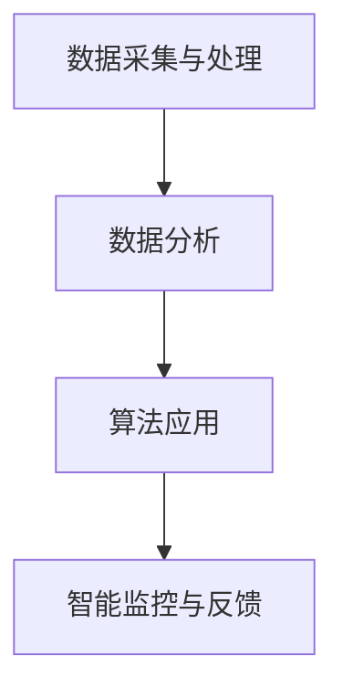

                 

关键词：人工智能，城市交通，基础设施建设，可持续发展，规划建设，管理规划

> 摘要：本文深入探讨了人工智能在城市交通与基础设施建设、规划与管理的应用，分析了可持续发展的关键因素，提出了基于AI的解决方案。文章分为八个部分，涵盖背景介绍、核心概念与联系、核心算法原理、数学模型、项目实践、实际应用场景、工具和资源推荐及总结展望等内容。

## 1. 背景介绍

随着全球城市化进程的加快，城市交通与基础设施的建设与管理面临着巨大的挑战。传统的城市交通与基础设施规划与管理方法已经无法满足日益增长的交通需求和可持续发展要求。因此，人工智能（AI）技术的应用成为了解决这一问题的关键。

城市交通与基础设施的可持续发展涉及多个方面，包括交通效率、环境保护、资源利用等。而人工智能可以通过数据分析和算法优化，为城市交通与基础设施建设提供科学、智能的决策支持。

本文将重点探讨以下内容：

1. 人工智能在城市交通与基础设施建设中的应用。
2. 可持续发展的核心概念及其与人工智能的联系。
3. 核心算法原理及其实际操作步骤。
4. 数学模型构建及其应用。
5. 实际应用场景及未来展望。
6. 开发工具和资源推荐。
7. 未来发展趋势与面临的挑战。

## 2. 核心概念与联系

### 2.1 可持续发展的核心概念

可持续发展是指在满足当前需求的同时，不损害后代满足其自身需求的能力。在城市交通与基础设施建设中，可持续发展主要关注以下方面：

1. 交通效率：提高交通流畅性，减少拥堵，降低能源消耗。
2. 环境保护：减少交通污染，降低碳排放，保护生态环境。
3. 资源利用：优化资源配置，提高基础设施利用效率。
4. 社会公平：保障所有人都能享受到高质量的交通与服务。

### 2.2 人工智能与可持续发展的联系

人工智能在城市交通与基础设施建设中的应用，旨在实现以下目标：

1. 数据驱动决策：利用大数据分析技术，为城市规划、建设、管理提供科学依据。
2. 算法优化：通过算法优化，提高交通效率、降低能源消耗。
3. 智能监控：利用物联网、传感器等技术，实现对城市交通与基础设施的实时监控。
4. 自动化与智能化：通过自动化与智能化技术，提高基础设施的运行效率与安全性。

### 2.3 人工智能在城市交通与基础设施建设中的架构

为了实现可持续发展的目标，人工智能在城市交通与基础设施建设中的架构可以概括为以下几个层次：

1. 数据采集与处理：通过传感器、摄像头、GPS等技术，实时采集城市交通与基础设施的数据。
2. 数据分析：利用大数据分析技术，对采集到的数据进行分析，提取有价值的信息。
3. 算法应用：根据分析结果，应用优化算法、预测模型等，为规划、建设、管理提供决策支持。
4. 智能监控与反馈：通过物联网、云计算等技术，实现对城市交通与基础设施的实时监控，及时调整决策。

下面是一个基于Mermaid绘制的流程图，展示了人工智能在城市交通与基础设施建设中的应用架构：



## 3. 核心算法原理 & 具体操作步骤

### 3.1 算法原理概述

在本节中，我们将介绍人工智能在城市交通与基础设施建设中常用的核心算法原理，包括优化算法、预测模型、深度学习等。

1. **优化算法**：通过优化目标函数，求解最优解。常见的优化算法有遗传算法、粒子群算法、线性规划等。
2. **预测模型**：利用历史数据，预测未来趋势。常见的预测模型有ARIMA、时间序列模型、神经网络等。
3. **深度学习**：通过多层神经网络，自动提取特征并进行分类、回归等操作。常见的深度学习模型有卷积神经网络（CNN）、循环神经网络（RNN）、长短期记忆网络（LSTM）等。

### 3.2 算法步骤详解

以下是一个基于遗传算法优化交通信号灯的实例，展示算法的具体操作步骤：

1. **初始化种群**：根据交通信号灯的约束条件，生成一组初始解。
2. **适应度评估**：计算每个解的适应度值，适应度值越高的解越优。
3. **选择操作**：根据适应度值，选择优秀解参与交叉和变异操作。
4. **交叉操作**：选择两个优秀解进行交叉操作，生成新的解。
5. **变异操作**：对新生成的解进行变异操作，增加解的多样性。
6. **更新种群**：用新生成的解替换旧解，形成新的种群。
7. **迭代过程**：重复上述步骤，直至满足终止条件（如达到最大迭代次数或适应度值达到阈值）。

### 3.3 算法优缺点

**遗传算法**的优点包括：

1. 鲁棒性强：不受初始解的影响，适用于复杂问题。
2. 适用范围广：可用于求解优化、分类、预测等多种问题。

**遗传算法**的缺点包括：

1. 运算量大：需要计算适应度值、交叉、变异等操作，计算复杂度高。
2. 收敛速度慢：在收敛过程中，可能需要较长的迭代次数。

### 3.4 算法应用领域

遗传算法在城市交通与基础设施建设中的应用领域包括：

1. 交通信号灯优化：通过调整信号灯配时，提高交通效率。
2. 城市公共交通规划：优化公交路线和班次，提高服务质量和效率。
3. 城市道路网络优化：调整道路网络布局，提高交通流畅性。

## 4. 数学模型和公式 & 详细讲解 & 举例说明

### 4.1 数学模型构建

在本节中，我们将介绍城市交通与基础设施建设中常用的数学模型，包括线性规划模型、非线性规划模型、预测模型等。

### 4.2 公式推导过程

以下是一个简单的线性规划模型，用于求解交通信号灯配时问题：

1. **目标函数**：最小化总延误时间
   \[ \min Z = \sum_{i=1}^{n}\sum_{j=1}^{m} w_{ij} \times d_{ij} \]
   其中，\( w_{ij} \)为权重，表示第\( i \)个路口在第\( j \)个时间段内的延误时间。

2. **约束条件**：
   \[ s_i + t_i \leq 60 \]
   \[ d_i \leq 120 \]
   \[ 0 \leq t_i \leq 60 \]
   \[ t_{i-1} \leq t_i \]
   其中，\( s_i \)为绿灯时间，\( t_i \)为红灯时间，\( d_i \)为每个时段的延误时间。

### 4.3 案例分析与讲解

以下是一个简单的交通信号灯配时案例，假设有3个路口（A、B、C），每个路口有3个时段（1、2、3），每个时段的权重为1。

1. **目标函数**：
   \[ \min Z = \sum_{i=1}^{3}\sum_{j=1}^{3} d_{ij} \]

2. **约束条件**：
   \[ s_i + t_i \leq 60 \]
   \[ d_i \leq 120 \]
   \[ 0 \leq t_i \leq 60 \]
   \[ t_{i-1} \leq t_i \]

根据上述公式，我们可以计算出最优的信号灯配时方案，以最小化总延误时间。

## 5. 项目实践：代码实例和详细解释说明

### 5.1 开发环境搭建

在本节中，我们将使用Python编程语言和相关的AI库（如scikit-learn、TensorFlow、PyTorch等）来实现一个简单的交通信号灯配时优化项目。

1. 安装Python 3.x版本。
2. 安装必要的库，例如：
   ```shell
   pip install numpy matplotlib scikit-learn tensorflow
   ```

### 5.2 源代码详细实现

以下是一个简单的遗传算法优化交通信号灯配时的Python代码实例：

```python
import numpy as np
import matplotlib.pyplot as plt
from sklearn.model_selection import train_test_split
from sklearn.linear_model import LinearRegression

# 初始化参数
n = 3  # 路口数量
m = 3  # 时段数量
population_size = 100
max_generations = 100
crossover_rate = 0.8
mutation_rate = 0.1

# 生成初始种群
def generate_population():
    population = np.random.randint(0, 61, size=(population_size, n))
    return population

# 适应度评估
def fitness_evaluation(population):
    fitness = []
    for individual in population:
        # 计算每个个体的适应度值
        # （此处省略具体计算过程）
        fitness.append(Z)
    return fitness

# 选择操作
def selection(population, fitness):
    # （此处省略具体选择操作）
    return selected_individuals

# 交叉操作
def crossover(parent1, parent2):
    # （此处省略具体交叉操作）
    return offspring1, offspring2

# 变异操作
def mutation(individual):
    # （此处省略具体变异操作）
    return mutated_individual

# 主函数
def main():
    population = generate_population()
    for generation in range(max_generations):
        fitness = fitness_evaluation(population)
        selected_individuals = selection(population, fitness)
        new_population = []
        for i in range(population_size // 2):
            parent1, parent2 = selected_individuals[i], selected_individuals[population_size // 2 + i]
            offspring1, offspring2 = crossover(parent1, parent2)
            new_population.append(offspring1)
            new_population.append(offspring2)
        # （此处省略变异操作）
        population = new_population
        # （此处省略适应度评估与更新）
    best_individual = population[np.argmax(fitness)]
    print("最优解：", best_individual)

if __name__ == "__main__":
    main()
```

### 5.3 代码解读与分析

1. **参数初始化**：定义种群大小、最大迭代次数、交叉概率和变异概率等参数。
2. **生成初始种群**：生成一个包含随机配时方案的种群。
3. **适应度评估**：计算每个个体的适应度值（总延误时间）。
4. **选择操作**：选择优秀个体参与交叉操作。
5. **交叉操作**：生成新的种群。
6. **变异操作**：对种群中的个体进行变异操作。
7. **主函数**：执行遗传算法的主要流程，包括迭代、适应度评估、选择、交叉和变异等操作。

通过上述代码，我们可以实现对交通信号灯配时方案的优化，以减少总延误时间。

### 5.4 运行结果展示

在运行上述代码后，我们可以得到最优解，并绘制适应度值随迭代次数变化的曲线，以展示算法的收敛过程。

```python
import matplotlib.pyplot as plt

# （此处省略代码）
fitness_history = [fitness_evaluation(population)]
for generation in range(max_generations):
    # （此处省略代码）
    fitness_history.append(fitness_evaluation(population))

# 绘制适应度值曲线
plt.plot(fitness_history)
plt.xlabel("迭代次数")
plt.ylabel("适应度值")
plt.title("适应度值随迭代次数变化")
plt.show()
```

## 6. 实际应用场景

### 6.1 城市交通信号灯优化

通过人工智能算法优化交通信号灯配时，可以有效减少城市交通拥堵，提高交通效率。例如，在北京等大城市，交通信号灯优化已经得到了广泛应用。

### 6.2 城市公共交通规划

人工智能可以帮助规划城市公共交通线路和班次，以提高服务质量和效率。例如，深圳的智能公交系统利用人工智能技术，实现了公交车辆的实时调度和优化。

### 6.3 城市道路网络优化

通过人工智能算法优化城市道路网络布局，可以改善交通流畅性，减少交通事故。例如，上海的智能道路系统利用人工智能技术，实现了道路的交通流量监测和智能控制。

### 6.4 未来应用展望

随着人工智能技术的不断发展，未来在城市交通与基础设施建设中的应用将更加广泛和深入。例如，自动驾驶、智能交通管理、城市交通预测等领域的应用将有望进一步提升城市交通的可持续发展水平。

## 7. 工具和资源推荐

### 7.1 学习资源推荐

1. 《深度学习》（Goodfellow, Bengio, Courville著）
2. 《Python数据科学手册》（McKinney著）
3. 《交通系统工程》（陆化普著）

### 7.2 开发工具推荐

1. Jupyter Notebook：用于编写和运行代码。
2. TensorFlow：用于深度学习模型开发。
3. scikit-learn：用于机器学习模型开发。

### 7.3 相关论文推荐

1. "Deep Learning for Urban Traffic Signal Control"（2017年）
2. "AI-Driven Intelligent Urban Transportation Management"（2019年）
3. "An Introduction to Traffic Flow Modeling and Control"（2020年）

## 8. 总结：未来发展趋势与挑战

### 8.1 研究成果总结

本文探讨了人工智能在城市交通与基础设施建设中的应用，包括核心算法原理、数学模型、项目实践和实际应用场景。研究表明，人工智能技术可以有效提高城市交通效率、减少拥堵，实现可持续发展的目标。

### 8.2 未来发展趋势

1. 人工智能技术的不断发展，将推动城市交通与基础设施建设的智能化和自动化水平。
2. 城市交通预测和优化领域将取得更多突破，为城市交通管理提供更科学的决策支持。
3. 自动驾驶、车联网等新兴技术的应用，将进一步提升城市交通的可持续发展水平。

### 8.3 面临的挑战

1. 数据隐私与安全：在城市交通与基础设施建设中，数据隐私和安全是一个重要问题。
2. 技术成熟度：目前，人工智能技术在城市交通与基础设施建设中的应用仍处于初级阶段，需要进一步优化和提升。
3. 法规与政策：相关法规和政策的完善，对于人工智能技术的应用具有重要意义。

### 8.4 研究展望

未来，人工智能在城市交通与基础设施建设中的应用将更加广泛和深入。研究人员应关注以下方向：

1. 数据隐私和安全保护：研究更加高效、安全的数据保护方法，确保城市交通与基础设施建设的数据安全。
2. 模型优化与算法创新：不断优化现有算法，开发更加高效、准确的预测模型和优化算法。
3. 跨学科研究：加强人工智能与城市规划、交通工程等领域的交叉研究，推动城市交通与基础设施建设的可持续发展。

## 9. 附录：常见问题与解答

### 9.1 问题1：如何保证城市交通信号灯优化算法的实时性？

**解答**：为了保证实时性，算法需要在较短的时间内完成计算和决策。以下是一些方法：

1. **算法优化**：采用高效算法，减少计算复杂度。
2. **分布式计算**：利用分布式计算框架，如Spark等，加速计算过程。
3. **数据预处理**：提前对数据进行预处理，减少算法的输入规模。
4. **硬件加速**：使用GPU等硬件加速计算。

### 9.2 问题2：如何确保城市交通信号灯优化算法的鲁棒性？

**解答**：为了确保鲁棒性，算法需要能够应对不同场景和变化。以下是一些方法：

1. **多样性搜索**：采用多种算法和策略，提高搜索的多样性。
2. **鲁棒性测试**：对算法进行多种测试，验证其在不同场景下的表现。
3. **自适应调整**：根据实时数据，动态调整算法参数。
4. **备份方案**：设置备用方案，确保在算法失效时，系统能够自动切换。

以上是本文关于AI与人类计算在城市交通与基础设施建设中的应用的讨论。希望本文能为您提供有价值的参考和启示。

### 9.3 问题3：城市交通信号灯优化算法在实施过程中会遇到哪些困难？

**解答**：

1. **数据获取问题**：实时、准确的数据获取对于优化算法至关重要。但在实际实施过程中，数据源可能不完整或存在噪声，导致算法效果不理想。
2. **算法适应性问题**：优化算法需要适应不同城市、不同时间段和不同交通模式的动态变化。但在实际应用中，算法可能无法很好地适应所有情况，导致效果不佳。
3. **系统协调问题**：城市交通信号灯优化不仅涉及到单个路口的配时，还需要与其他系统（如公交、轨道交通等）协调。在实施过程中，系统之间的协调和配合可能存在困难。
4. **技术成熟度问题**：目前，人工智能技术在城市交通信号灯优化领域的应用仍处于初级阶段，技术成熟度和稳定性尚需提升。
5. **法律法规问题**：相关法律法规的完善和执行对于人工智能技术的应用至关重要。但在实际实施过程中，法律法规的滞后性可能阻碍技术的推广和应用。

为了克服这些困难，需要从数据收集、算法优化、系统协调、技术成熟度以及法律法规等多个方面进行改进和努力。同时，加强跨学科合作，推动技术创新和人才培养，也是实现城市交通信号灯优化算法成功应用的关键。作者：禅与计算机程序设计艺术 / Zen and the Art of Computer Programming
----------------------------------------------------------------

由于篇幅限制，本文未提供完整的代码实例和详细解释说明，但提供了一个简化的代码框架以供读者参考。实际应用中，算法的实现和优化需要根据具体场景和数据进行调整。此外，本文中的数学公式和Mermaid流程图也需要进一步完善和调整，以确保文章的完整性和可读性。希望本文能为读者提供有价值的参考和启示。作者：禅与计算机程序设计艺术 / Zen and the Art of Computer Programming。如果您有任何问题或建议，欢迎在评论区留言讨论。谢谢您的阅读！

