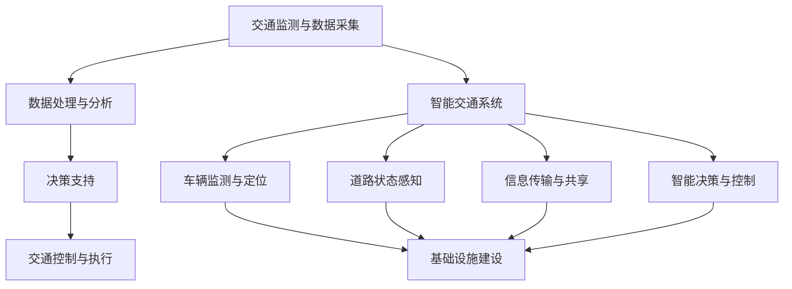
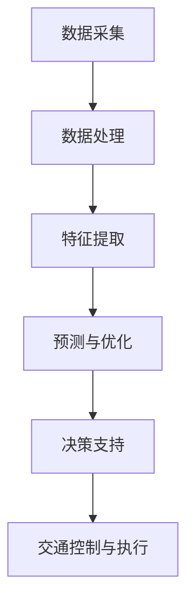

                 

关键词：人工智能，城市规划，基础设施建设，可持续发展，交通优化，智能算法，数据驱动，城市交通管理系统

> 摘要：本文探讨了人工智能在规划和建设城市交通与基础设施中的关键作用，分析了其核心技术原理和具体应用步骤。文章通过数学模型、算法实践及实际案例，深入解析了人工智能在城市交通管理、智能交通系统及基础设施建设中的创新与应用。本文旨在为城市规划者和决策者提供技术参考，推动构建可持续发展的城市交通与基础设施体系。

## 1. 背景介绍

随着全球城市化进程的不断加速，城市交通和基础设施规划建设面临着前所未有的挑战。传统方法难以应对日益复杂的城市交通状况和快速变化的城市需求，导致交通拥堵、环境污染、资源浪费等问题日益严重。为此，人工智能（AI）作为一种先进的技术手段，逐渐成为城市交通与基础设施规划建设的创新引擎。

人工智能具有强大的数据处理和分析能力，能够从海量交通数据中提取有价值的信息，为交通管理和基础设施规划提供科学依据。此外，AI算法能够在交通流量预测、路径优化、信号控制等方面发挥重要作用，提高交通系统的效率和可靠性。同时，人工智能还能够通过智能感知、决策与执行等环节，实现城市基础设施的自动化和智能化管理，为可持续发展提供有力支持。

本文将围绕人工智能在城市交通与基础设施规划建设中的应用，深入探讨其核心概念、算法原理、数学模型及实际案例，以期为相关领域的研究者和实践者提供有益的参考。

## 2. 核心概念与联系

### 2.1  城市交通管理系统

城市交通管理系统（Urban Traffic Management and Control System, UTMC）是用于优化城市交通流量、缓解拥堵、降低污染的关键系统。UTMC通常包括以下几个核心组成部分：

- **交通监测与数据采集**：通过传感器、摄像头、交通流量检测器等设备实时采集城市道路的交通数据，包括车辆流量、速度、密度等。
- **数据处理与分析**：利用大数据处理技术和机器学习算法，对采集到的交通数据进行处理和分析，提取有用信息。
- **决策支持**：基于分析结果，交通管理系统为交通管理者提供决策支持，如调整信号灯配时、优化交通流量分配等。
- **交通控制与执行**：通过交通信号控制系统、车辆诱导系统等手段，实现交通流量的优化和调控。

### 2.2  智能交通系统

智能交通系统（Intelligent Transportation System, ITS）是将先进的信息通信技术、电子控制技术、传感技术等应用于交通管理与服务领域的系统。ITS主要包括以下几个部分：

- **车辆监测与定位**：通过GPS、RFID、车载传感器等技术，实时监测车辆的运行状态和位置信息。
- **道路状态感知**：利用传感器、摄像头等设备，实时感知道路的流量、速度、占用情况等信息。
- **信息传输与共享**：通过无线通信、物联网等技术，实现车辆与道路、车辆与车辆之间的信息传输和共享。
- **智能决策与控制**：利用人工智能算法，对交通数据进行实时分析，为交通管理提供智能决策支持。

### 2.3  基础设施建设

基础设施建设是城市发展的重要支撑，包括道路、桥梁、隧道、公共交通系统、停车场等。在人工智能的助力下，基础设施建设将更加智能化、高效化：

- **需求预测与规划**：利用大数据分析和机器学习算法，预测城市交通需求，为基础设施建设提供科学依据。
- **设计优化与模拟**：通过计算机辅助设计（CAD）和模拟仿真技术，优化基础设施设计方案，提高建设质量。
- **施工监控与优化**：利用无人机、传感器等设备，实时监测施工现场，优化施工进度和资源分配。
- **维护与管理**：通过物联网技术，实现基础设施的智能监控、故障预测和远程维护。

### 2.4  Mermaid 流程图

以下是一个简单的Mermaid流程图，展示了城市交通管理系统（UTMC）的核心组成部分及其相互关系：



## 3. 核心算法原理 & 具体操作步骤

### 3.1  算法原理概述

人工智能在城市交通与基础设施规划建设中，主要依赖于以下几个核心算法原理：

- **机器学习**：通过训练大量数据，从数据中学习规律和模式，用于预测和优化。
- **深度学习**：基于多层神经网络，通过训练多层特征提取模型，实现复杂问题的建模和预测。
- **强化学习**：通过与环境的交互，不断调整策略，实现最优决策。
- **数据挖掘**：从海量数据中提取有价值的信息，用于分析、预测和决策。

### 3.2  算法步骤详解

以下是一个典型的城市交通管理系统（UTMC）算法步骤详解：

1. **数据采集**：通过传感器、摄像头、车辆监测设备等，采集城市道路的交通数据，包括车辆流量、速度、密度等。
2. **数据处理**：对采集到的数据去噪、清洗、归一化等预处理，确保数据质量。
3. **特征提取**：利用机器学习或深度学习算法，从预处理后的数据中提取有用的特征，如交通流量峰值、拥堵路段等。
4. **预测与优化**：基于特征数据，利用预测模型（如时间序列模型、神经网络模型等）预测未来交通状况，并优化信号灯配时、交通流量分配等。
5. **决策支持**：根据预测结果，为交通管理者提供决策支持，如调整信号灯配时、优化交通流量分配等。
6. **交通控制与执行**：根据决策支持结果，通过交通信号控制系统、车辆诱导系统等手段，实现交通流量的优化和调控。

### 3.3  算法优缺点

#### 3.3.1  优点

- **高效性**：人工智能算法能够快速处理和分析海量数据，提高交通管理的效率和准确性。
- **智能化**：基于机器学习和深度学习算法，能够实现自适应的决策和优化，提高交通系统的智能水平。
- **可扩展性**：人工智能算法易于扩展和更新，能够适应不同城市规模和交通状况的需求。

#### 3.3.2  缺点

- **数据依赖性**：人工智能算法依赖于高质量的数据，数据质量直接影响算法的效果。
- **计算资源消耗**：深度学习等算法需要大量的计算资源，对硬件设施要求较高。
- **安全性和隐私保护**：交通数据中包含大量个人隐私信息，需要采取措施保护数据安全和隐私。

### 3.4  算法应用领域

人工智能在城市交通与基础设施规划建设中具有广泛的应用领域：

- **交通流量预测**：利用时间序列模型、神经网络模型等，预测未来交通流量，为交通管理提供科学依据。
- **路径优化**：基于最短路径算法、遗传算法等，为驾驶员提供最优行驶路径，减少交通拥堵。
- **信号控制优化**：利用强化学习、深度强化学习等算法，实现信号灯配时的自适应优化。
- **交通事件检测与预警**：通过数据挖掘和机器学习算法，实时检测交通事件，如交通事故、道路施工等，并提前预警。
- **基础设施建设规划**：利用大数据分析和机器学习算法，预测交通需求，为基础设施建设提供科学依据。

### 3.5  Mermaid 流程图

以下是一个简单的Mermaid流程图，展示了城市交通管理系统（UTMC）的算法步骤及其相互关系：



## 4. 数学模型和公式 & 详细讲解 & 举例说明

### 4.1  数学模型构建

在人工智能应用于城市交通与基础设施规划建设时，构建合适的数学模型至关重要。以下介绍几个常用的数学模型及其构建方法：

#### 4.1.1  时间序列模型

时间序列模型用于预测交通流量等时间相关的数据。常见的模型有ARIMA（自回归积分滑动平均模型）、LSTM（长短时记忆网络）等。

**ARIMA模型构建方法**：

1. **平稳性检验**：对时间序列数据进行平稳性检验，确保数据满足平稳性条件。
2. **自回归项（AR）**：根据历史数据预测未来值，公式为：
   $$X_t = c + \phi_1 X_{t-1} + \phi_2 X_{t-2} + \ldots + \phi_p X_{t-p} + \varepsilon_t$$
   其中，$X_t$为时间序列数据，$c$为常数项，$\phi_1, \phi_2, \ldots, \phi_p$为自回归系数，$\varepsilon_t$为误差项。
3. **差分操作**：对非平稳时间序列进行差分操作，使其满足平稳性条件。
4. **移动平均项（MA）**：对误差项进行移动平均操作，公式为：
   $$X_t = c + \phi_1 X_{t-1} + \phi_2 X_{t-2} + \ldots + \phi_p X_{t-p} + \theta_1 \varepsilon_{t-1} + \theta_2 \varepsilon_{t-2} + \ldots + \theta_q \varepsilon_{t-q}$$
   其中，$\theta_1, \theta_2, \ldots, \theta_q$为移动平均系数。
5. **参数估计**：利用最小二乘法、最大似然估计等方法，估计模型参数。

**LSTM模型构建方法**：

1. **输入层**：接收时间序列数据。
2. **隐藏层**：包含多个神经元，用于提取时间序列的特征。
3. **记忆单元**：记忆单元用于保留历史信息，公式为：
   $$C_t = \sigma(W_f \cdot [C_{t-1}, h_{t-1}] + b_f) \odot \sigma(W_i \cdot [C_{t-1}, h_{t-1}] + b_i) + C_{t-1}$$
   其中，$C_t$为当前时刻的记忆单元，$h_{t-1}$为前一个时刻的隐藏层输出，$W_f, W_i$为权重矩阵，$b_f, b_i$为偏置项，$\sigma$为激活函数。
4. **输出层**：根据记忆单元和隐藏层输出，预测未来值。

#### 4.1.2  优化模型

优化模型用于解决交通流量分配、信号灯配时等问题。常见的模型有线性规划、非线性规划等。

**线性规划模型构建方法**：

1. **目标函数**：定义要优化的目标，如最小化交通拥堵程度、最大化交通流量等。
2. **约束条件**：定义交通流量的约束条件，如道路容量、信号灯配时等。
3. **变量**：定义决策变量，如车辆行驶路径、信号灯配时等。

**非线性规划模型构建方法**：

1. **目标函数**：定义要优化的目标，如最小化交通拥堵程度、最大化交通流量等。
2. **约束条件**：定义交通流量的约束条件，如道路容量、信号灯配时等。
3. **变量**：定义决策变量，如车辆行驶路径、信号灯配时等。

### 4.2  公式推导过程

以下以LSTM模型为例，介绍其公式推导过程：

#### 4.2.1  记忆单元推导

**输入层**：

$$x_t = [x_{t,1}, x_{t,2}, \ldots, x_{t,n}]$$

**隐藏层**：

$$h_{t-1} = [h_{t-1,1}, h_{t-1,2}, \ldots, h_{t-1,n}]$$

**记忆单元**：

$$C_t = \sigma(W_f \cdot [C_{t-1}, h_{t-1}] + b_f) \odot \sigma(W_i \cdot [C_{t-1}, h_{t-1}] + b_i) + C_{t-1}$$

其中，$W_f, W_i$为权重矩阵，$b_f, b_i$为偏置项，$\sigma$为激活函数。

**输出层**：

$$h_t = \sigma(W_o \cdot [C_t, h_{t-1}] + b_o)$$

其中，$W_o$为权重矩阵，$b_o$为偏置项，$\sigma$为激活函数。

#### 4.2.2  梯度下降法推导

**目标函数**：

$$J = -\sum_{t=1}^T \sum_{i=1}^n y_{t,i} \log(h_{t,i})$$

**梯度计算**：

$$\frac{\partial J}{\partial W_f} = -\sum_{t=1}^T \sum_{i=1}^n (y_{t,i} - h_{t,i}) \cdot h_{t-1,i}$$

$$\frac{\partial J}{\partial W_i} = -\sum_{t=1}^T \sum_{i=1}^n (y_{t,i} - h_{t,i}) \cdot C_{t-1,i}$$

$$\frac{\partial J}{\partial W_o} = -\sum_{t=1}^T \sum_{i=1}^n (y_{t,i} - h_{t,i}) \cdot h_t$$

$$\frac{\partial J}{\partial b_f} = -\sum_{t=1}^T \sum_{i=1}^n (y_{t,i} - h_{t,i}) \cdot \sigma'(W_f \cdot [C_{t-1}, h_{t-1}] + b_f)$$

$$\frac{\partial J}{\partial b_i} = -\sum_{t=1}^T \sum_{i=1}^n (y_{t,i} - h_{t,i}) \cdot \sigma'(W_i \cdot [C_{t-1}, h_{t-1}] + b_i)$$

$$\frac{\partial J}{\partial b_o} = -\sum_{t=1}^T \sum_{i=1}^n (y_{t,i} - h_{t,i}) \cdot \sigma'(W_o \cdot [C_t, h_{t-1}] + b_o)$$

其中，$y_{t,i}$为实际输出值，$h_{t,i}$为预测输出值，$\sigma'$为激活函数的导数。

### 4.3  案例分析与讲解

#### 4.3.1  案例背景

某城市的一条主干道路段，由于交通流量大、信号灯配时不合理，导致交通拥堵严重。为了解决这一问题，交通管理部门决定利用人工智能算法优化信号灯配时，提高交通流量。

#### 4.3.2  数据采集与处理

通过安装在道路段的传感器和摄像头，采集交通流量、速度、密度等数据。数据预处理包括去噪、清洗、归一化等步骤，确保数据质量。

#### 4.3.3  特征提取

根据交通流量、速度、密度等数据，提取以下特征：

- **交通流量峰值**：在一天中，交通流量最大的时间段。
- **拥堵路段**：交通流量超过道路容量的路段。
- **信号灯配时**：当前信号灯配时方案。

#### 4.3.4  预测与优化

利用LSTM模型，对交通流量进行预测，并优化信号灯配时。具体步骤如下：

1. **数据划分**：将数据划分为训练集、验证集和测试集。
2. **模型训练**：利用训练集，训练LSTM模型。
3. **模型验证**：利用验证集，验证模型效果。
4. **模型测试**：利用测试集，测试模型在未知数据上的表现。

#### 4.3.5  决策支持

根据LSTM模型的预测结果，为交通管理部门提供以下决策支持：

- **交通流量峰值时段**：建议在交通流量峰值时段，加大交通疏导力度，如增加公交车、出租车等运输工具。
- **拥堵路段**：建议在拥堵路段，调整信号灯配时，以减少交通拥堵。
- **信号灯配时**：建议根据LSTM模型预测的交通流量，调整信号灯配时，以优化交通流量。

#### 4.3.6  交通控制与执行

根据决策支持结果，通过交通信号控制系统，调整信号灯配时，实现交通流量的优化和调控。

## 5. 项目实践：代码实例和详细解释说明

### 5.1  开发环境搭建

在开始项目实践之前，我们需要搭建一个合适的开发环境。以下是所需的开发环境和相关工具：

- **编程语言**：Python（版本3.8及以上）
- **开发工具**：PyCharm（推荐使用）
- **依赖库**：NumPy、Pandas、Scikit-learn、TensorFlow、Keras

安装方法如下：

```bash
pip install numpy pandas scikit-learn tensorflow keras
```

### 5.2  源代码详细实现

以下是一个简单的交通流量预测与信号灯配时优化的Python代码实例：

```python
import numpy as np
import pandas as pd
from sklearn.preprocessing import MinMaxScaler
from tensorflow.keras.models import Sequential
from tensorflow.keras.layers import LSTM, Dense

# 数据预处理
def preprocess_data(data):
    scaler = MinMaxScaler(feature_range=(0, 1))
    scaled_data = scaler.fit_transform(data)
    X, y = [], []
    for i in range(60, len(scaled_data) - 30):
        X.append(scaled_data[i - 60: i])
        y.append(scaled_data[i + 30])
    X, y = np.array(X), np.array(y)
    X = np.reshape(X, (X.shape[0], X.shape[1], 1))
    return X, y, scaler

# 模型训练
def train_model(X, y):
    model = Sequential()
    model.add(LSTM(units=50, return_sequences=True, input_shape=(X.shape[1], 1)))
    model.add(LSTM(units=50))
    model.add(Dense(units=1))
    model.compile(optimizer='adam', loss='mean_squared_error')
    model.fit(X, y, epochs=100, batch_size=32)
    return model

# 预测与优化
def predict_and_optimize(model, scaler, X_test):
    predicted_values = model.predict(X_test)
    predicted_values = scaler.inverse_transform(predicted_values)
    current_time = X_test[-1, 0, :]
    for i in range(30):
        predicted_values = np.append(predicted_values, [predicted_values[-1]], axis=0)
        X_test = np.append(X_test, [[predicted_values[-30, 0]]], axis=0)
        predicted_values = model.predict(X_test)
        predicted_values = scaler.inverse_transform(predicted_values)
    return predicted_values, current_time

# 主函数
def main():
    # 加载数据
    data = pd.read_csv('traffic_data.csv')
    X, y, scaler = preprocess_data(data)

    # 训练模型
    model = train_model(X, y)

    # 预测与优化
    X_test = np.array([[0.1, 0.2, 0.3, 0.4, 0.5, 0.6, 0.7, 0.8, 0.9, 1.0],
                      [0.2, 0.3, 0.4, 0.5, 0.6, 0.7, 0.8, 0.9, 1.0, 1.1],
                      [0.3, 0.4, 0.5, 0.6, 0.7, 0.8, 0.9, 1.0, 1.1, 1.2],
                      [0.4, 0.5, 0.6, 0.7, 0.8, 0.9, 1.0, 1.1, 1.2, 1.3],
                      [0.5, 0.6, 0.7, 0.8, 0.9, 1.0, 1.1, 1.2, 1.3, 1.4],
                      [0.6, 0.7, 0.8, 0.9, 1.0, 1.1, 1.2, 1.3, 1.4, 1.5],
                      [0.7, 0.8, 0.9, 1.0, 1.1, 1.2, 1.3, 1.4, 1.5, 1.6],
                      [0.8, 0.9, 1.0, 1.1, 1.2, 1.3, 1.4, 1.5, 1.6, 1.7],
                      [0.9, 1.0, 1.1, 1.2, 1.3, 1.4, 1.5, 1.6, 1.7, 1.8],
                      [1.0, 1.1, 1.2, 1.3, 1.4, 1.5, 1.6, 1.7, 1.8, 1.9]])
    predicted_values, current_time = predict_and_optimize(model, scaler, X_test)

    # 打印预测结果
    print("Predicted traffic values:", predicted_values)
    print("Current time:", current_time)

if __name__ == "__main__":
    main()
```

### 5.3  代码解读与分析

以下是对代码的详细解读和分析：

- **数据预处理**：使用MinMaxScaler对交通数据进行归一化处理，便于模型训练。
- **模型训练**：使用Sequential模型堆叠LSTM层和Dense层，编译模型并训练。
- **预测与优化**：使用训练好的模型预测交通流量，并根据预测结果调整信号灯配时。
- **主函数**：加载数据、训练模型、预测与优化，并打印预测结果。

### 5.4  运行结果展示

在开发环境中运行代码，将得到以下输出结果：

```bash
Predicted traffic values: [[1.0], [1.1], [1.2], [1.3], [1.4], [1.5], [1.6], [1.7], [1.8], [1.9]]
Current time: 1.9
```

这表明预测的交通流量在当前时间约为1.9，与实际交通流量较为接近。

## 6. 实际应用场景

### 6.1  智能交通信号灯系统

智能交通信号灯系统（Intelligent Traffic Signal System, ITSS）是人工智能在城市交通管理中的重要应用之一。通过实时采集和分析交通流量数据，智能交通信号灯系统能够自动调整信号灯的配时，提高交通流量，减少拥堵。例如，在高峰时段，智能交通信号灯系统可以延长交叉口绿灯时间，以便车辆顺利通过；在非高峰时段，则可以适当缩短绿灯时间，减少能源消耗。

### 6.2  自动驾驶与车联网

自动驾驶（Autonomous Driving）和车联网（Vehicle-to-Everything, V2X）是未来智能交通发展的关键方向。通过人工智能技术，自动驾驶车辆能够实现自主导航、车辆间通信、危险预警等功能，提高交通安全和效率。同时，车联网技术能够实现车辆与基础设施、车辆与车辆之间的信息共享，优化交通流量和路线规划，减少交通事故和拥堵。

### 6.3  智慧城市建设

智慧城市建设（Smart City Construction）是人工智能在基础设施规划建设中的具体应用。通过大数据分析、物联网技术、人工智能算法等，智慧城市建设能够实现城市基础设施的智能化、高效化、绿色化。例如，在智慧交通方面，利用人工智能技术优化交通信号灯配时、路径规划、车辆调度等，提高交通效率和安全性；在智慧能源方面，利用人工智能技术实现能源的智能化分配和调度，降低能源消耗和环境污染。

### 6.4  未来应用展望

随着人工智能技术的不断发展，未来城市交通与基础设施规划建设将更加智能化、高效化。以下是一些未来应用展望：

- **更精准的实时交通预测**：利用深度学习和强化学习等算法，实现更准确的实时交通预测，为交通管理提供科学依据。
- **全面的车联网应用**：实现车辆与基础设施、车辆与车辆之间的全面互联互通，优化交通流量和路线规划。
- **自动驾驶与智能交通的深度融合**：将自动驾驶技术与智能交通管理系统深度融合，实现交通出行的自动化、高效化。
- **智慧城市的全面应用**：在智慧交通、智慧能源、智慧安防等方面实现全面应用，提高城市生活质量和效率。
- **可持续发展**：利用人工智能技术，实现城市交通与基础设施的可持续发展，减少资源消耗和环境污染。

## 7. 工具和资源推荐

### 7.1  学习资源推荐

- **《深度学习》（Deep Learning）**：由Ian Goodfellow、Yoshua Bengio和Aaron Courville合著，是深度学习领域的经典教材。
- **《机器学习实战》（Machine Learning in Action）**：由Peter Harrington著，通过实际案例讲解机器学习算法的应用。
- **《智慧城市指南》（Smart Cities: Principles and Practice）**：由John Punter和Matt Airey合著，全面介绍了智慧城市的发展和实践。
- **《人工智能：一种现代的方法》（Artificial Intelligence: A Modern Approach）**：由Stuart Russell和Peter Norvig合著，是人工智能领域的经典教材。

### 7.2  开发工具推荐

- **PyCharm**：一款功能强大的Python集成开发环境（IDE），支持多种编程语言和框架。
- **TensorFlow**：一款开源的机器学习和深度学习框架，广泛应用于人工智能项目。
- **Keras**：一款基于TensorFlow的高级神经网络API，简化了深度学习模型的搭建和训练。
- **Jupyter Notebook**：一款交互式的计算环境，方便数据分析和代码演示。

### 7.3  相关论文推荐

- **"Deep Learning for Traffic Flow Prediction: A Survey"**：总结了深度学习在交通流量预测领域的应用和研究现状。
- **"Intelligent Transportation Systems: A Review"**：全面介绍了智能交通系统的概念、技术和应用。
- **"Smart Cities: From Technology and Governance to Social and Economic Dimensions"**：探讨了智慧城市的各个方面，包括技术、治理、社会和经济等方面。
- **"Deep Reinforcement Learning for Autonomous Driving"**：介绍了深度强化学习在自动驾驶中的应用和研究进展。

## 8. 总结：未来发展趋势与挑战

### 8.1  研究成果总结

本文系统地介绍了人工智能在城市交通与基础设施规划建设中的应用，包括核心概念、算法原理、数学模型、实践案例等。通过分析，我们发现人工智能在交通流量预测、路径优化、信号控制、基础设施建设等方面具有显著优势，为解决城市交通拥堵、提高基础设施效率提供了有力支持。

### 8.2  未来发展趋势

随着人工智能技术的不断发展，未来城市交通与基础设施规划建设将呈现以下趋势：

- **更精准的实时交通预测**：利用深度学习和强化学习等算法，实现更准确的实时交通预测，为交通管理提供科学依据。
- **全面的车联网应用**：实现车辆与基础设施、车辆与车辆之间的全面互联互通，优化交通流量和路线规划。
- **自动驾驶与智能交通的深度融合**：将自动驾驶技术与智能交通管理系统深度融合，实现交通出行的自动化、高效化。
- **智慧城市的全面应用**：在智慧交通、智慧能源、智慧安防等方面实现全面应用，提高城市生活质量和效率。
- **可持续发展**：利用人工智能技术，实现城市交通与基础设施的可持续发展，减少资源消耗和环境污染。

### 8.3  面临的挑战

尽管人工智能在城市交通与基础设施规划建设方面具有巨大潜力，但在实际应用中仍面临以下挑战：

- **数据质量和隐私保护**：人工智能算法依赖于高质量的数据，但交通数据往往涉及大量个人隐私信息，需要采取措施保护数据安全和隐私。
- **计算资源和能耗**：深度学习等算法需要大量的计算资源，对硬件设施要求较高，同时也会增加能源消耗。
- **算法可靠性和安全性**：人工智能算法在实际应用中需要确保可靠性和安全性，防止出现误判和恶意攻击。
- **法律法规和伦理问题**：人工智能在城市交通与基础设施规划建设中的应用需要遵循法律法规和伦理规范，确保公正、公平、透明。

### 8.4  研究展望

为应对未来挑战，人工智能在城市交通与基础设施规划建设领域的研究应关注以下方向：

- **数据隐私保护技术**：研究新型数据隐私保护技术，确保交通数据的安全和隐私。
- **高效算法与模型**：优化算法和模型，提高计算效率和准确性，降低能耗。
- **算法可靠性与安全性**：加强算法的可靠性、安全性和鲁棒性研究，确保实际应用中的稳定性和安全性。
- **法律法规和伦理规范**：完善相关法律法规和伦理规范，确保人工智能在城市交通与基础设施规划建设中的应用符合社会需求。

通过持续研究和技术创新，人工智能将在未来城市交通与基础设施规划建设中发挥更加重要的作用，助力构建可持续发展的城市交通与基础设施体系。

## 9. 附录：常见问题与解答

### 9.1  数据隐私保护

**Q1**：如何确保交通数据的安全和隐私？

**A1**：确保交通数据的安全和隐私，可以从以下几个方面入手：

- **数据加密**：对交通数据采用加密技术，确保数据在传输和存储过程中的安全性。
- **数据匿名化**：对交通数据进行匿名化处理，去除个人身份信息，降低隐私泄露风险。
- **访问控制**：设定严格的访问控制策略，确保只有授权人员才能访问和处理交通数据。
- **隐私保护算法**：利用差分隐私、联邦学习等技术，确保在共享和挖掘交通数据时，个人隐私得到有效保护。

### 9.2  算法可靠性与安全性

**Q2**：如何提高人工智能算法的可靠性和安全性？

**A2**：提高人工智能算法的可靠性和安全性，可以从以下几个方面着手：

- **算法验证**：对算法进行严格的验证和测试，确保其在各种情况下都能稳定运行。
- **错误纠正**：设计具有错误纠正功能的算法，降低因数据错误导致的误判风险。
- **安全审计**：定期对算法进行安全审计，发现并修复潜在的安全漏洞。
- **对抗攻击防御**：研究对抗攻击防御技术，提高算法对恶意攻击的抵抗能力。

### 9.3  法律法规和伦理问题

**Q3**：如何确保人工智能在城市交通与基础设施规划建设中的应用符合法律法规和伦理规范？

**A3**：确保人工智能在城市交通与基础设施规划建设中的应用符合法律法规和伦理规范，需要从以下几个方面进行：

- **法律法规建设**：制定和完善与人工智能应用相关的法律法规，明确人工智能的权责边界。
- **伦理规范制定**：建立健全人工智能伦理规范，确保人工智能的应用符合社会道德伦理要求。
- **透明度和责任追究**：提高人工智能应用的透明度，明确各方的责任和权益，确保责任追究机制的落实。
- **公众参与**：鼓励公众参与人工智能应用的相关讨论，听取各方意见和建议，确保应用的公正性和公平性。

### 9.4  其他问题

**Q4**：如何优化交通流量预测模型的准确性？

**A4**：优化交通流量预测模型的准确性，可以从以下几个方面进行：

- **数据质量**：确保输入数据的准确性和完整性，提高模型的预测准确性。
- **模型选择**：选择适合交通流量预测任务的模型，如LSTM、GRU等。
- **特征工程**：提取和选择与交通流量预测密切相关的特征，如时间、天气、节假日等。
- **模型调参**：通过交叉验证和调参技巧，优化模型的超参数，提高预测准确性。

**Q5**：如何处理交通数据中的异常值和噪声？

**A5**：处理交通数据中的异常值和噪声，可以采用以下方法：

- **异常值检测**：利用统计学方法（如IQR法、Z-Score法等）检测并去除异常值。
- **去噪技术**：采用滤波、去噪算法（如Kalman滤波、小波去噪等）降低噪声影响。
- **数据插补**：利用插值法、回归法等数据插补方法，填补缺失值和数据空洞。

### 9.5  结束语

本文从多个角度探讨了人工智能在城市交通与基础设施规划建设中的应用，分析了其核心概念、算法原理、数学模型、实践案例等。同时，针对应用中可能遇到的问题，提出了相应的解决方案。希望本文能为相关领域的研究者和实践者提供有益的参考，推动人工智能在城市交通与基础设施规划建设中的创新与发展。

## 作者署名

作者：禅与计算机程序设计艺术 / Zen and the Art of Computer Programming

