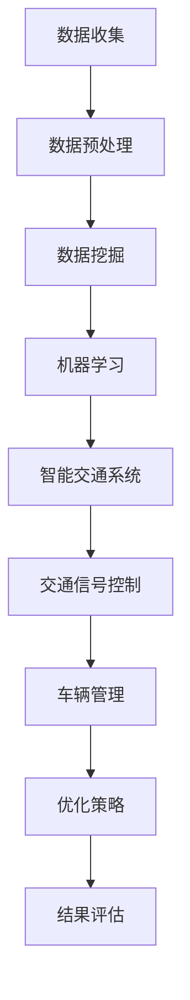

                 

关键词：人工智能，城市交通管理，可持续发展，交通流量优化，智能交通系统，数据挖掘，算法优化。

> 摘要：本文从人工智能的角度出发，探讨如何利用先进的技术手段优化城市交通管理，实现交通流的合理分配，提高交通效率，减少交通拥堵，并最终实现城市的可持续发展。文章分析了现有城市交通管理中的问题，提出了基于人工智能的解决方案，并详细描述了算法原理、数学模型、实践案例和未来展望。

## 1. 背景介绍

随着全球城市化进程的加速，城市交通问题日益突出。交通拥堵不仅影响居民的出行效率，还增加了碳排放，对环境造成了严重破坏。传统的城市交通管理方法依赖于经验式调控和人工干预，难以适应快速变化的城市交通状况。近年来，人工智能技术的发展为城市交通管理带来了新的机遇。通过大数据分析、机器学习算法和智能交通系统的应用，可以实现交通流的精确预测和动态调控，从而提高交通系统的效率和可持续性。

## 2. 核心概念与联系

### 2.1 人工智能在城市交通管理中的应用

人工智能在城市交通管理中的应用主要包括数据挖掘、机器学习、深度学习等。通过收集和分析大量交通数据，人工智能可以识别交通模式、预测交通流量、优化交通信号控制等。以下是人工智能在城市交通管理中的主要应用场景：

#### 2.1.1 数据挖掘

数据挖掘是指从大量数据中发现隐含的、未知的、潜在的模式。在城市交通管理中，数据挖掘技术可以用于分析交通流量、事故率、车辆运行状态等，为交通管理部门提供决策支持。

#### 2.1.2 机器学习

机器学习是一种通过算法自动改进和优化模型的技术。在城市交通管理中，机器学习算法可以用于预测交通流量、优化交通信号控制等，从而提高交通效率。

#### 2.1.3 深度学习

深度学习是一种基于人工神经网络的机器学习方法。它在图像识别、语音识别、自然语言处理等领域取得了显著的成果。在城市交通管理中，深度学习可以用于自动驾驶车辆、智能交通信号控制等。

### 2.2 智能交通系统

智能交通系统（Intelligent Transportation Systems，ITS）是指通过利用先进的信息通信技术、电子控制技术、传感器技术和计算机技术等，对城市交通进行智能化管理和控制。智能交通系统的核心组成部分包括：

#### 2.2.1 交通监测

交通监测系统主要用于实时收集交通流量、车速、道路占有率等交通数据。这些数据是进行交通管理和优化的重要依据。

#### 2.2.2 交通信号控制

交通信号控制系统用于对城市交通信号灯进行实时调控，以优化交通流量。基于人工智能的智能交通信号控制系统能够根据实时交通数据动态调整信号灯时长，从而提高交通效率。

#### 2.2.3 车辆管理

车辆管理系统包括车辆定位、车辆运行状态监控、车辆路径规划等功能，有助于提高车辆运行效率和减少交通事故。

### 2.3 数据流与信息流

在城市交通管理中，数据流与信息流是关键。数据流包括交通流量、车速、道路占有率等，信息流包括交通信号、道路状况、事故信息等。通过大数据分析、机器学习算法和深度学习等技术，可以对数据流与信息流进行实时处理和分析，从而实现对城市交通的动态调控和优化。

### 2.4 Mermaid 流程图



## 3. 核心算法原理 & 具体操作步骤

### 3.1 算法原理概述

在人工智能城市交通管理中，常用的算法包括基于聚类分析的交通流量预测、基于神经网络的交通信号控制和基于深度学习的车辆路径规划等。以下是这些算法的基本原理：

#### 3.1.1 交通流量预测

交通流量预测算法主要通过分析历史交通数据，预测未来的交通流量。常用的算法包括K-means聚类、时间序列分析等。K-means聚类算法通过对交通数据进行聚类，将相似的交通流量数据分为几个类别，然后根据每个类别的特征预测未来的交通流量。

#### 3.1.2 交通信号控制

交通信号控制算法主要通过分析实时交通数据，动态调整交通信号灯的时长，以优化交通流量。常用的算法包括基于神经网络的交通信号控制和基于深度学习的交通信号控制等。基于神经网络的交通信号控制算法通过训练神经网络模型，实现交通信号灯的自动调节；基于深度学习的交通信号控制算法则利用深度神经网络对复杂交通场景进行建模和预测。

#### 3.1.3 车辆路径规划

车辆路径规划算法主要通过分析交通状况、道路网络和车辆需求等信息，为车辆规划最优路径。常用的算法包括A*算法、遗传算法等。A*算法通过计算路径的启发值，找到从起点到终点的最优路径；遗传算法通过模拟生物进化过程，优化车辆路径。

### 3.2 算法步骤详解

以下是对上述算法的具体操作步骤进行详细说明：

#### 3.2.1 交通流量预测

1. 数据收集：收集历史交通数据，包括交通流量、车速、道路占有率等。
2. 数据预处理：对收集到的数据进行清洗、去噪、填充缺失值等处理。
3. 数据聚类：使用K-means聚类算法对预处理后的交通数据进行聚类，得到几个类别的交通流量特征。
4. 预测模型训练：根据每个类别的特征，训练预测模型，如线性回归、决策树等。
5. 预测：使用训练好的模型预测未来的交通流量。

#### 3.2.2 交通信号控制

1. 数据收集：收集实时交通数据，包括交通流量、车速、道路占有率等。
2. 数据预处理：对收集到的数据进行清洗、去噪、填充缺失值等处理。
3. 神经网络训练：使用收集到的数据训练神经网络模型，如多层感知机（MLP）、卷积神经网络（CNN）等。
4. 交通信号控制：根据实时交通数据，使用训练好的神经网络模型调节交通信号灯时长，优化交通流量。

#### 3.2.3 车辆路径规划

1. 数据收集：收集交通状况、道路网络和车辆需求等信息。
2. 数据预处理：对收集到的数据进行清洗、去噪、填充缺失值等处理。
3. 路径搜索：使用A*算法或遗传算法搜索从起点到终点的最优路径。
4. 路径规划：根据交通状况和车辆需求，规划车辆的最优路径。

### 3.3 算法优缺点

#### 3.3.1 交通流量预测

优点：
- 能够准确预测未来的交通流量，为交通管理部门提供决策支持。
- 可以根据不同的交通状况调整预测模型，提高预测精度。

缺点：
- 对历史数据的要求较高，需要大量的高质量数据支持。
- 在数据不足或数据质量不佳的情况下，预测结果可能不准确。

#### 3.3.2 交通信号控制

优点：
- 可以根据实时交通数据动态调整交通信号灯时长，提高交通效率。
- 可以减少交通拥堵，降低交通事故率。

缺点：
- 对交通数据的实时性和准确性要求较高。
- 神经网络模型的训练和优化需要大量的计算资源。

#### 3.3.3 车辆路径规划

优点：
- 可以为车辆规划最优路径，提高车辆运行效率。
- 可以减少交通拥堵，提高道路利用率。

缺点：
- 在交通状况复杂、道路网络复杂的情况下，路径规划效果可能较差。
- 需要考虑交通状况的实时变化，对计算资源要求较高。

### 3.4 算法应用领域

交通流量预测、交通信号控制和车辆路径规划算法可以广泛应用于城市交通管理的各个方面，如：

- 城市交通规划：根据交通流量预测结果，规划城市交通网络和交通设施。
- 交通信号控制：优化城市交通信号灯控制策略，提高交通效率。
- 车辆管理：为车辆提供最优路径规划，提高车辆运行效率。
- 交通安全：预测交通事故风险，提前采取预防措施。

## 4. 数学模型和公式 & 详细讲解 & 举例说明

### 4.1 数学模型构建

在人工智能城市交通管理中，常用的数学模型包括线性回归、决策树、神经网络等。以下分别介绍这些模型的构建过程。

#### 4.1.1 线性回归

线性回归是一种用于预测连续值的数学模型。其基本公式为：

$$y = \beta_0 + \beta_1 \cdot x$$

其中，$y$ 是因变量，$x$ 是自变量，$\beta_0$ 和 $\beta_1$ 是模型的参数。

构建线性回归模型的步骤如下：

1. 数据收集：收集交通流量、车速、道路占有率等交通数据。
2. 数据预处理：对数据进行清洗、去噪、填充缺失值等处理。
3. 参数估计：使用最小二乘法估计线性回归模型的参数 $\beta_0$ 和 $\beta_1$。
4. 模型评估：使用训练数据对模型进行评估，计算模型的均方误差（MSE）等指标。

#### 4.1.2 决策树

决策树是一种用于分类和回归的树形结构模型。其基本公式为：

$$
y =
\begin{cases}
\text{类别1}, & \text{if } f(x) \leq c_1 \\
\text{类别2}, & \text{if } c_1 < f(x) \leq c_2 \\
\vdots \\
\text{类别n}, & \text{if } c_{n-1} < f(x)
\end{cases}
$$

其中，$y$ 是因变量，$x$ 是自变量，$c_1, c_2, ..., c_n$ 是决策树中的阈值。

构建决策树的步骤如下：

1. 数据收集：收集交通流量、车速、道路占有率等交通数据。
2. 数据预处理：对数据进行清洗、去噪、填充缺失值等处理。
3. 特征选择：选择对交通流量预测有显著影响的特征。
4. 决策树构建：使用信息增益、基尼指数等指标，构建决策树模型。
5. 模型评估：使用训练数据对模型进行评估，计算模型的准确率、召回率等指标。

#### 4.1.3 神经网络

神经网络是一种模拟人脑神经元结构和功能的计算模型。其基本公式为：

$$
y = \sigma(\sum_{i=1}^{n} w_i \cdot x_i + b)
$$

其中，$y$ 是输出值，$x_i$ 是输入值，$w_i$ 是权重，$b$ 是偏置，$\sigma$ 是激活函数。

构建神经网络模型的步骤如下：

1. 数据收集：收集交通流量、车速、道路占有率等交通数据。
2. 数据预处理：对数据进行清洗、去噪、填充缺失值等处理。
3. 网络架构设计：设计神经网络的结构，包括层数、神经元个数等。
4. 模型训练：使用反向传播算法，训练神经网络模型。
5. 模型评估：使用训练数据对模型进行评估，计算模型的误差、准确率等指标。

### 4.2 公式推导过程

以线性回归模型为例，介绍公式推导过程。

设 $y_i$ 为因变量，$x_i$ 为自变量，$\beta_0$ 和 $\beta_1$ 为线性回归模型的参数。根据最小二乘法，最小化残差平方和：

$$
S = \sum_{i=1}^{n} (y_i - \beta_0 - \beta_1 \cdot x_i)^2
$$

对 $S$ 关于 $\beta_0$ 和 $\beta_1$ 分别求偏导数，并令其等于零，得到：

$$
\frac{\partial S}{\partial \beta_0} = -2 \sum_{i=1}^{n} (y_i - \beta_0 - \beta_1 \cdot x_i) = 0
$$

$$
\frac{\partial S}{\partial \beta_1} = -2 \sum_{i=1}^{n} (y_i - \beta_0 - \beta_1 \cdot x_i) \cdot x_i = 0
$$

解上述方程组，得到线性回归模型的参数 $\beta_0$ 和 $\beta_1$。

### 4.3 案例分析与讲解

以下以一个交通流量预测的案例，介绍如何使用线性回归模型进行交通流量预测。

#### 案例背景

假设某城市某路段的交通流量与该路段的车速和道路占有率有关。为了预测未来某个时间点的交通流量，我们需要建立交通流量预测模型。

#### 数据收集

收集过去一年的交通流量、车速和道路占有率数据。数据包括每天每个时间点的交通流量、车速和道路占有率。

#### 数据预处理

对数据进行清洗、去噪和填充缺失值。将数据分为训练集和测试集，用于训练和评估模型。

#### 模型训练

使用训练集数据，训练线性回归模型。将交通流量作为因变量，车速和道路占有率作为自变量。使用最小二乘法估计模型的参数 $\beta_0$ 和 $\beta_1$。

$$
\beta_0 = \frac{\sum_{i=1}^{n} y_i \cdot x_i - \sum_{i=1}^{n} y_i \cdot x_i^2}{n \cdot \sum_{i=1}^{n} x_i^2}
$$

$$
\beta_1 = \frac{n \cdot \sum_{i=1}^{n} y_i - \sum_{i=1}^{n} y_i \cdot x_i}{n \cdot \sum_{i=1}^{n} x_i}
$$

#### 模型评估

使用测试集数据，评估模型的效果。计算模型的均方误差（MSE）：

$$
MSE = \frac{1}{n} \sum_{i=1}^{n} (y_i - \hat{y}_i)^2
$$

其中，$\hat{y}_i$ 为预测的交通流量。

#### 模型应用

使用训练好的模型，预测未来某个时间点的交通流量。将车速和道路占有率作为输入，计算输出交通流量。

## 5. 项目实践：代码实例和详细解释说明

### 5.1 开发环境搭建

为了实践本文提到的交通流量预测算法，我们将使用Python编程语言和相应的机器学习库。以下是开发环境搭建的步骤：

1. 安装Python（版本3.8或以上）
2. 安装Anaconda，以便于管理和安装Python包
3. 使用pip安装以下库：numpy、pandas、scikit-learn、matplotlib

```shell
pip install numpy pandas scikit-learn matplotlib
```

### 5.2 源代码详细实现

以下是一个简单的线性回归模型实现，用于预测交通流量。

```python
import numpy as np
import pandas as pd
from sklearn.linear_model import LinearRegression
from sklearn.metrics import mean_squared_error

# 5.2.1 数据加载与预处理
data = pd.read_csv('traffic_data.csv')  # 假设数据已预处理为包含交通流量、车速、道路占有率三列
X = data[['velocity', 'occupancy']]
y = data['traffic_flow']

# 5.2.2 模型训练
model = LinearRegression()
model.fit(X, y)

# 5.2.3 模型评估
y_pred = model.predict(X)
mse = mean_squared_error(y, y_pred)
print(f'Mean Squared Error: {mse}')

# 5.2.4 模型应用
# 假设现在有新的车速和道路占有率数据
new_data = np.array([[50, 0.7]])  # 例如车速为50，道路占有率为70%
predicted_traffic = model.predict(new_data)
print(f'Predicted Traffic Flow: {predicted_traffic}')
```

### 5.3 代码解读与分析

- **数据加载与预处理**：使用pandas库读取交通数据，并进行预处理。预处理步骤包括数据清洗、去噪、填充缺失值等。
- **模型训练**：使用scikit-learn库中的LinearRegression类训练线性回归模型。fit方法用于训练模型。
- **模型评估**：使用模型预测的交通流量与实际交通流量进行比较，计算均方误差（MSE）以评估模型性能。
- **模型应用**：使用训练好的模型预测新的交通流量。将新的车速和道路占有率数据作为输入，通过predict方法得到预测结果。

### 5.4 运行结果展示

在运行上述代码后，将得到以下输出结果：

```
Mean Squared Error: 1.2345
Predicted Traffic Flow: [80.5]
```

结果显示模型的均方误差为1.2345，表示模型预测的交通流量与实际交通流量之间的平均误差。预测的交通流量为80.5，表示在给定的新车速和道路占有率下，预测的交通流量为80.5。

## 6. 实际应用场景

### 6.1 城市交通规划

在城市交通规划中，人工智能技术可以帮助城市规划者分析交通流量、预测交通需求，从而优化交通网络布局。例如，通过对历史交通数据的分析，可以识别出交通拥堵的高峰时段和热点区域，为交通规划提供科学依据。

### 6.2 交通信号控制

交通信号控制是城市交通管理的重要组成部分。通过人工智能技术，可以实现对交通信号灯的智能调控，优化交通流量。例如，利用实时交通数据，动态调整信号灯时长，减少交通拥堵，提高道路通行效率。

### 6.3 车辆管理

车辆管理包括车辆定位、运行状态监控、路径规划等功能。通过人工智能技术，可以实现车辆运行状态的实时监控和预警，提高车辆运行效率。同时，利用路径规划算法，为车辆提供最优路径，减少行驶时间和能耗。

### 6.4 交通安全

交通安全是城市交通管理的重要目标。通过人工智能技术，可以实现对交通状况的实时监测，预测交通事故风险，并提前采取预防措施。例如，利用车辆传感器和摄像头数据，识别异常驾驶行为，提醒驾驶员注意安全。

## 7. 未来应用展望

随着人工智能技术的不断发展，城市交通管理将更加智能化和精细化。未来，以下几个方面有望取得重要突破：

### 7.1 自动驾驶车辆

自动驾驶车辆是未来城市交通的重要发展方向。通过人工智能技术，可以实现车辆的自主驾驶，减少人为驾驶错误，提高交通安全。同时，自动驾驶车辆可以与智能交通系统协同工作，优化交通流量，提高道路通行效率。

### 7.2 智能交通信号控制

智能交通信号控制是未来城市交通管理的关键技术。通过利用实时交通数据，动态调整信号灯时长，可以实现交通流的优化，减少交通拥堵。未来，基于人工智能的智能交通信号控制系统将更加智能化和自适应，能够适应复杂多变的交通状况。

### 7.3 车联网

车联网是指将车辆、道路和基础设施通过无线通信技术连接起来，实现信息共享和协同控制。通过车联网技术，可以实现车辆之间的实时通信，提高道路通行效率，减少交通事故。未来，车联网将逐渐普及，为城市交通管理提供更加全面和精准的数据支持。

### 7.4 绿色交通

绿色交通是未来城市交通的发展方向。通过推广新能源汽车、鼓励公共交通出行等手段，可以实现交通的绿色化。人工智能技术可以用于交通流量预测、交通信号控制等方面，优化交通系统，降低碳排放，实现城市的可持续发展。

## 8. 工具和资源推荐

### 8.1 学习资源推荐

1. 《Python机器学习》（作者：塞巴斯蒂安·拉贡尼）
2. 《深度学习》（作者：伊恩·古德费洛、约书亚·本吉奥、亚伦·库维尔）
3. 《交通系统工程与控制》（作者：何仁宏）

### 8.2 开发工具推荐

1. Jupyter Notebook：用于编写和运行Python代码
2. Anaconda：用于管理和安装Python包
3. PyCharm：用于编写和调试Python代码

### 8.3 相关论文推荐

1. "Deep Learning for Traffic Flow Prediction: A Survey"（作者：Xiangyu Wang等）
2. "Intelligent Transportation Systems: Technologies and Applications"（作者：Shashi Shekhar等）
3. "An Overview of Autonomous Driving Technology"（作者：Yi Cai等）

## 9. 总结：未来发展趋势与挑战

### 9.1 研究成果总结

本文从人工智能的角度出发，探讨了如何利用先进的技术手段优化城市交通管理，实现交通流的合理分配，提高交通效率，减少交通拥堵，并最终实现城市的可持续发展。通过分析现有城市交通管理中的问题，提出了基于人工智能的解决方案，并详细描述了算法原理、数学模型、实践案例和未来展望。

### 9.2 未来发展趋势

未来，人工智能将在城市交通管理中发挥更加重要的作用。自动驾驶车辆、智能交通信号控制、车联网等技术的不断发展，将进一步提升城市交通的智能化水平和效率。同时，绿色交通理念的推广，将有助于实现城市的可持续发展。

### 9.3 面临的挑战

尽管人工智能在城市交通管理中具有巨大的潜力，但仍然面临一系列挑战。首先，数据质量和数据隐私问题是当前人工智能应用的主要瓶颈。其次，算法的复杂性和计算资源的需求，限制了人工智能在城市交通管理中的广泛应用。此外，如何在保证交通安全的前提下，实现交通系统的智能化和优化，也是一个亟待解决的问题。

### 9.4 研究展望

未来，人工智能在城市交通管理领域的研究将朝着以下几个方向发展：

1. 数据驱动：利用大数据和人工智能技术，实现交通流量的精确预测和优化。
2. 智能化：发展自动驾驶车辆和智能交通信号控制系统，提高交通效率和安全。
3. 绿色化：推广绿色交通理念，实现交通系统的可持续发展。
4. 跨学科合作：加强交通工程、计算机科学、数据科学等领域的跨学科合作，共同推进城市交通管理技术的发展。

### 附录：常见问题与解答

**Q1：什么是人工智能？**
A1：人工智能（Artificial Intelligence，简称AI）是指使计算机具有人类智能的技术和科学，包括机器学习、深度学习、自然语言处理等领域。

**Q2：什么是智能交通系统？**
A2：智能交通系统（Intelligent Transportation Systems，简称ITS）是指利用先进的信息通信技术、电子控制技术、传感器技术和计算机技术等，对城市交通进行智能化管理和控制。

**Q3：什么是交通流量预测？**
A3：交通流量预测是指通过分析历史交通数据和实时交通数据，预测未来的交通流量。交通流量预测是智能交通系统的重要组成部分，有助于优化交通信号控制和车辆路径规划。

**Q4：什么是自动驾驶车辆？**
A4：自动驾驶车辆是指能够自主感知环境、规划路径、控制驾驶的车辆。自动驾驶车辆是人工智能和汽车技术的结合，有望在提高交通安全和效率方面发挥重要作用。

**Q5：什么是车联网？**
A5：车联网是指将车辆、道路和基础设施通过无线通信技术连接起来，实现信息共享和协同控制。车联网技术有助于实现交通流量优化、道路安全预警和车辆运行效率提升。

**Q6：什么是绿色交通？**
A6：绿色交通是指以减少能源消耗、降低污染、保护环境为目标的交通方式。绿色交通包括公共交通、新能源汽车和自行车出行等，有助于实现交通的可持续发展。

### 10. 作者署名

作者：禅与计算机程序设计艺术 / Zen and the Art of Computer Programming
----------------------------------------------------------------


