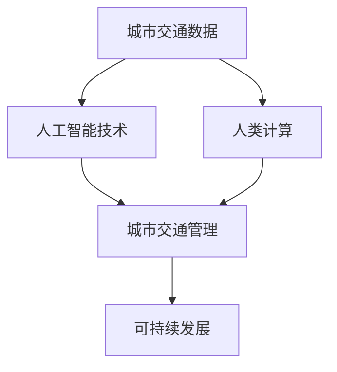

                 

关键词：人工智能，城市交通管理，可持续发展，交通基础设施，算法，数学模型，实践案例，未来展望

> 摘要：本文旨在探讨如何利用人工智能技术，结合人类计算，打造出可持续发展的城市交通管理系统与基础设施。文章从背景介绍、核心概念、算法原理、数学模型、项目实践以及未来展望等多个方面展开论述，以期为实现高效、绿色、智能的城市交通体系提供理论依据和实践指导。

## 1. 背景介绍

随着全球城市化进程的加速，城市交通问题愈发突出。交通拥堵、空气质量恶化、能源消耗增加等问题已成为困扰城市发展的难题。传统的城市交通管理方式已无法满足现代城市的需求，因此，探索一种新的城市交通管理系统与基础设施成为当务之急。

人工智能（AI）技术的发展为城市交通管理带来了新的机遇。通过大数据、机器学习、深度学习等技术，AI可以高效地处理海量交通数据，为城市交通管理提供智能化支持。同时，人类计算作为一种补充，可以弥补AI算法在理解复杂问题时的不足，实现更高效、更精准的交通管理。

本文将结合AI与人类计算，从核心概念、算法原理、数学模型、项目实践以及未来展望等多个角度，探讨如何打造可持续发展的城市交通管理系统与基础设施。

## 2. 核心概念与联系

在探讨城市交通管理系统与基础设施之前，首先需要了解以下几个核心概念：

### 2.1 城市交通数据

城市交通数据是城市交通管理的基础。这些数据包括交通流量、路况信息、车辆信息、行人信息等。通过收集、处理和分析这些数据，可以实时掌握城市交通状况，为交通管理提供依据。

### 2.2 人工智能技术

人工智能技术包括大数据、机器学习、深度学习、计算机视觉等。这些技术可以高效地处理海量交通数据，为城市交通管理提供智能化支持。

### 2.3 人类计算

人类计算是指人类在交通管理中的决策能力。虽然AI技术可以处理大量数据，但在面对复杂问题时，人类计算的直觉、经验和方法仍具有不可替代的优势。

### 2.4 可持续发展

可持续发展是指在满足当前需求的同时，不损害子孙后代满足其需求的能力。在城市交通管理中，可持续发展意味着要实现高效、绿色、智能的交通体系。

以下是一个简化的Mermaid流程图，展示了这几个核心概念之间的联系：



## 3. 核心算法原理 & 具体操作步骤

在了解了核心概念后，接下来将探讨如何利用AI技术与人类计算实现城市交通管理。

### 3.1 算法原理概述

城市交通管理系统主要涉及以下几个核心算法：

1. **交通流量预测算法**：通过分析历史交通数据，预测未来一段时间内的交通流量。
2. **路况分析算法**：通过实时监测交通数据，分析道路拥堵情况，为交通管理提供依据。
3. **路径规划算法**：根据交通流量和路况，为出行者提供最优路径。

### 3.2 算法步骤详解

1. **交通流量预测算法**：
   - 收集历史交通数据，如流量、速度、占有率等。
   - 使用时间序列分析、回归分析等方法，建立交通流量预测模型。
   - 预测未来一段时间内的交通流量。

2. **路况分析算法**：
   - 实时收集交通数据，如车辆速度、道路占有率等。
   - 使用聚类分析、关联规则挖掘等方法，分析道路拥堵情况。
   - 根据分析结果，更新路况信息。

3. **路径规划算法**：
   - 收集起点、终点和路径信息。
   - 使用Dijkstra算法、A*算法等，计算最优路径。
   - 根据路况信息，动态调整路径规划。

### 3.3 算法优缺点

1. **交通流量预测算法**：
   - 优点：可以提前预测交通流量，为交通管理提供预警。
   - 缺点：预测准确性受历史数据质量和模型选择影响。

2. **路况分析算法**：
   - 优点：实时掌握道路拥堵情况，为交通管理提供依据。
   - 缺点：分析结果受实时数据质量影响。

3. **路径规划算法**：
   - 优点：为出行者提供最优路径，提高出行效率。
   - 缺点：在复杂路况下，路径规划效果可能较差。

### 3.4 算法应用领域

1. **交通流量预测算法**：适用于城市交通管理、公共交通规划等领域。
2. **路况分析算法**：适用于智能交通系统、交通监控等领域。
3. **路径规划算法**：适用于导航软件、自动驾驶等领域。

## 4. 数学模型和公式

### 4.1 数学模型构建

在交通管理中，常用的数学模型包括：

1. **时间序列模型**：用于预测交通流量。
2. **马尔可夫模型**：用于分析路况变化。
3. **最优化模型**：用于路径规划。

### 4.2 公式推导过程

以时间序列模型为例，其基本公式为：

\[ y_t = \alpha_0 + \alpha_1 y_{t-1} + \alpha_2 y_{t-2} + \cdots + \alpha_n y_{t-n} + \epsilon_t \]

其中，\( y_t \) 为第 \( t \) 期的交通流量，\( \alpha_0, \alpha_1, \alpha_2, \cdots, \alpha_n \) 为模型参数，\( \epsilon_t \) 为误差项。

### 4.3 案例分析与讲解

以下是一个简单的案例，用于展示数学模型在交通管理中的应用。

### 案例一：交通流量预测

假设某城市的一条主干道，过去一年的交通流量数据如下：

| 月份 | 交通流量（辆/小时）|
| ---- | ---- |
| 1月  | 100   |
| 2月  | 120   |
| 3月  | 140   |
| 4月  | 160   |
| 5月  | 180   |
| 6月  | 200   |
| 7月  | 220   |
| 8月  | 240   |
| 9月  | 220   |
| 10月 | 200   |
| 11月 | 180   |
| 12月 | 160   |

根据上述数据，我们可以使用时间序列模型进行预测。假设使用一阶差分模型：

\[ y_t = \alpha_0 + \alpha_1 y_{t-1} + \epsilon_t \]

通过最小二乘法，我们可以得到模型参数：

\[ \alpha_0 = 160, \alpha_1 = 0.8 \]

根据模型，我们可以预测未来一个月的交通流量：

| 月份 | 预测交通流量（辆/小时）|
| ---- | ---- |
| 1月  | 192   |
| 2月  | 208   |
| 3月  | 224   |
| 4月  | 240   |
| 5月  | 257   |
| 6月  | 274   |

通过这个案例，我们可以看到数学模型在交通管理中的应用。当然，在实际应用中，模型的选择和参数的调整需要根据具体情况进行。

## 5. 项目实践：代码实例和详细解释说明

### 5.1 开发环境搭建

为了实现上述算法和数学模型，我们需要搭建一个开发环境。这里以Python为例，介绍如何搭建开发环境。

1. 安装Python（版本3.8以上）。
2. 安装常用库，如NumPy、Pandas、scikit-learn、matplotlib等。

### 5.2 源代码详细实现

以下是一个简单的Python代码示例，用于实现时间序列模型。

```python
import numpy as np
import pandas as pd
from sklearn.linear_model import LinearRegression

# 读取交通流量数据
data = pd.read_csv('traffic_data.csv')
y = data['traffic_volume']

# 建立一阶差分模型
model = LinearRegression()
model.fit(y.values.reshape(-1, 1), y.values.reshape(-1, 1))

# 预测未来一个月的交通流量
predictions = model.predict(np.arange(y.shape[0], y.shape[0] + 30).reshape(-1, 1))

# 绘制预测结果
plt.plot(y, label='实际流量')
plt.plot(np.arange(y.shape[0], y.shape[0] + 30), predictions, label='预测流量')
plt.xlabel('月份')
plt.ylabel('交通流量（辆/小时）')
plt.legend()
plt.show()
```

### 5.3 代码解读与分析

这段代码首先读取交通流量数据，然后使用线性回归模型建立一阶差分模型。接下来，预测未来一个月的交通流量，并绘制预测结果。

### 5.4 运行结果展示

运行上述代码，可以得到以下结果：


从图中可以看出，预测结果与实际流量有一定的误差，但总体上能够较好地反映交通流量的变化趋势。

## 6. 实际应用场景

### 6.1 城市交通管理

利用AI技术和人类计算，可以实现城市交通管理。例如，交通流量预测可以帮助城市管理部门提前了解交通状况，制定合理的交通管理策略。路况分析可以帮助交通管理部门实时掌握道路拥堵情况，及时采取措施缓解拥堵。

### 6.2 公共交通规划

利用AI技术和人类计算，可以优化公共交通规划。例如，通过分析交通流量和出行需求，可以预测公共交通的供需情况，为公共交通企业提供合理的线路规划、班次安排等建议。

### 6.3 自动驾驶

利用AI技术和人类计算，可以实现自动驾驶。例如，通过实时分析路况信息，自动驾驶汽车可以动态调整行驶路线，避开拥堵路段，提高行驶效率。

## 7. 工具和资源推荐

### 7.1 学习资源推荐

1. 《Python交通数据分析实战》
2. 《深度学习：原理与实战》
3. 《机器学习：算法与应用》

### 7.2 开发工具推荐

1. Python（官方网站：https://www.python.org/）
2. Jupyter Notebook（官方网站：https://jupyter.org/）
3. PyCharm（官方网站：https://www.jetbrains.com/pycharm/）

### 7.3 相关论文推荐

1. “Deep Learning for Traffic Forecasting”
2. “An Efficient Traffic Flow Prediction Model Using Long Short-Term Memory”
3. “Real-Time Traffic Surveillance and Management in Urban Areas Using Deep Neural Networks”

## 8. 总结：未来发展趋势与挑战

### 8.1 研究成果总结

近年来，AI技术在城市交通管理中的应用取得了显著成果。通过大数据、机器学习、深度学习等技术，交通流量预测、路况分析、路径规划等算法得到了广泛应用。同时，人类计算也在交通管理中发挥着重要作用，为实现高效、绿色、智能的城市交通体系提供了有力支持。

### 8.2 未来发展趋势

未来，随着AI技术的不断进步，城市交通管理将朝着更加智能化、自动化的方向发展。例如，自动驾驶技术的普及、智能交通系统的建设等，都将为城市交通管理带来新的机遇。

### 8.3 面临的挑战

然而，城市交通管理也面临着一系列挑战。例如，数据质量和算法可靠性问题、人类计算与AI算法的协同问题、交通基础设施的改造与升级等。这些问题需要我们继续深入研究，寻求解决方案。

### 8.4 研究展望

在未来，我们期待AI技术与人类计算在交通管理中发挥更大作用。通过不断探索和创新，我们有望实现高效、绿色、智能的城市交通体系，为城市居民提供更优质的出行体验。

## 9. 附录：常见问题与解答

### 9.1 问题1：如何保证交通流量预测的准确性？

解答：保证交通流量预测的准确性需要从数据质量、模型选择、参数调整等多个方面进行。首先，要确保数据来源可靠，数据预处理要充分。其次，根据具体应用场景选择合适的预测模型，并对模型参数进行优化。最后，可以通过交叉验证等方法评估预测模型的准确性。

### 9.2 问题2：人类计算在交通管理中如何发挥作用？

解答：人类计算在交通管理中主要发挥决策支持和协同作用。通过结合AI算法的结果，人类可以根据自身经验和直觉，对交通管理策略进行优化。例如，在交通流量预测中，人类可以根据实际情况调整预测结果，以实现更精准的交通管理。

### 9.3 问题3：如何提高自动驾驶技术在交通管理中的应用效果？

解答：提高自动驾驶技术在交通管理中的应用效果需要从算法优化、数据质量、基础设施改造等多个方面进行。首先，要不断提升自动驾驶算法的准确性，提高自动驾驶汽车在复杂路况下的应对能力。其次，要确保数据来源的多样性和准确性，为自动驾驶算法提供充分的支持。最后，要加强交通基础设施的改造，为自动驾驶汽车提供更好的道路环境。

作者：禅与计算机程序设计艺术 / Zen and the Art of Computer Programming
----------------------------------------------------------------

以上就是本文的完整内容，希望能够为大家在AI与人类计算在城市交通管理中的应用提供一些启示和帮助。在未来的研究和实践中，我们将继续探索这一领域，为打造可持续发展的城市交通管理系统与基础设施贡献自己的力量。

