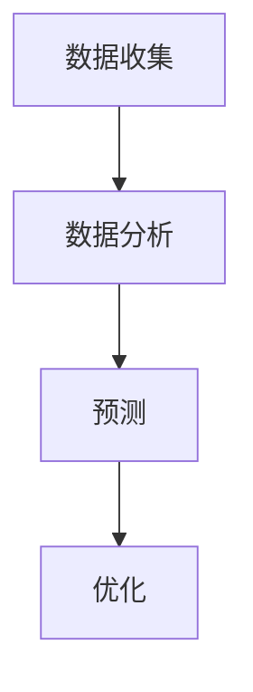

                 

关键词：人工智能、城市交通、可持续发展、规划、交通系统、交通算法

> 摘要：本文探讨了如何利用人工智能技术，特别是机器学习和深度学习，来构建可持续发展的城市交通系统与规划。文章首先介绍了城市交通系统的现状和挑战，然后深入分析了人工智能在城市交通规划中的应用，包括数据收集、分析、预测和优化等方面。最后，文章提出了未来城市交通系统的发展趋势和面临的挑战，并展望了人工智能在其中的重要作用。

## 1. 背景介绍

城市交通系统是一个复杂且动态的系统，它关系到城市居民的日常生活、经济发展和社会稳定。随着城市化进程的加速和人口的不断增长，城市交通系统面临前所未有的挑战。这些问题主要包括交通拥堵、环境污染、能源消耗和交通安全等。

传统的城市交通规划主要依赖于经验和专家知识，缺乏系统的数据支持和科学的分析方法。随着信息技术的飞速发展，尤其是人工智能技术的出现，为城市交通系统的优化提供了新的思路和工具。

人工智能技术，特别是机器学习和深度学习，具有处理大规模数据、发现复杂模式和进行自动决策的优势，可以有效地帮助城市交通系统解决现有的问题，实现可持续发展。本文将详细探讨人工智能在城市交通系统规划中的应用，包括数据收集、分析、预测和优化等方面。

## 2. 核心概念与联系

### 2.1 数据收集

城市交通系统的数据收集是构建可持续交通规划的基础。数据来源包括交通流量监测、公共交通数据、车辆轨迹数据、环境数据等。通过这些数据，可以全面了解城市交通系统的运行状况。

### 2.2 数据分析

数据分析是利用统计方法和机器学习算法，从收集到的数据中提取有用信息。例如，通过分析交通流量数据，可以预测交通拥堵的时间和地点，为交通管理部门提供决策依据。

### 2.3 预测

预测是利用历史数据对未来的交通状况进行预测。例如，利用深度学习算法，可以预测未来的交通流量和公共交通需求，帮助交通管理部门提前进行规划。

### 2.4 优化

优化是通过算法对交通系统的运行状态进行调整，以达到最优效果。例如，通过优化交通信号灯的时长，可以减少交通拥堵和缩短通勤时间。

### 2.5 Mermaid 流程图

下面是一个简化的 Mermaid 流程图，展示了数据收集、分析、预测和优化的过程：



## 3. 核心算法原理 & 具体操作步骤

### 3.1 算法原理概述

在人工智能技术中，深度学习算法在交通系统优化中扮演着重要角色。深度学习通过多层神经网络来学习和提取数据中的特征，从而实现复杂的模式识别和预测。

### 3.2 算法步骤详解

#### 3.2.1 数据预处理

数据预处理是深度学习模型训练的第一步。它包括数据清洗、数据转换和数据归一化等步骤。清洗数据是为了去除噪声和异常值，转换数据是为了满足模型输入的要求，归一化数据是为了使不同特征的数量级相似，从而提高模型的训练效率。

#### 3.2.2 模型训练

在模型训练阶段，通过大量历史交通数据来训练深度学习模型。训练的目标是让模型学会从数据中提取有用的特征，并学会预测未来的交通状况。

#### 3.2.3 模型评估

模型评估是检查模型训练效果的过程。常用的评估指标包括准确率、召回率、F1 分数等。通过评估，可以判断模型是否具有良好的预测能力。

#### 3.2.4 模型部署

模型部署是将训练好的模型应用到实际场景中的过程。通过部署模型，可以实现实时的交通状况预测和优化。

### 3.3 算法优缺点

#### 优点

- **强大的数据处理能力**：深度学习可以处理大规模、复杂的数据集，从而提高预测的准确性。
- **自动特征提取**：深度学习不需要人工干预来提取特征，从而节省了人力和时间成本。
- **自适应能力**：深度学习模型可以根据新的数据自动调整，以适应不断变化的环境。

#### 缺点

- **计算资源消耗**：深度学习模型通常需要大量的计算资源和时间来训练。
- **数据依赖性**：模型的性能很大程度上依赖于数据的质量和数量。
- **模型解释性差**：深度学习模型的决策过程通常是非线性的，难以解释。

### 3.4 算法应用领域

深度学习算法在交通系统中的应用非常广泛，包括交通流量预测、公共交通优化、交通信号控制、自动驾驶等。

## 4. 数学模型和公式 & 详细讲解 & 举例说明

### 4.1 数学模型构建

在城市交通系统中，常用的数学模型包括交通流量模型、排队模型和信号控制模型等。

#### 4.1.1 交通流量模型

交通流量模型是用于预测交通流量随时间变化的数学模型。一个简单的交通流量模型可以表示为：

\[ Q(t) = f(t) \cdot C \]

其中，\( Q(t) \) 是在时间 \( t \) 的交通流量，\( f(t) \) 是时间函数，表示交通流量的变化规律，\( C \) 是一个常数，表示交通流量的基流量。

#### 4.1.2 排队模型

排队模型用于预测交通拥堵的形成和消散。一个简单的排队模型可以表示为：

\[ L(t) = \frac{\lambda}{\mu} \left(1 - e^{-\mu (T - t)}\right) \]

其中，\( L(t) \) 是在时间 \( t \) 的排队长度，\( \lambda \) 是到达率，\( \mu \) 是服务率，\( T \) 是时间窗口。

#### 4.1.3 信号控制模型

信号控制模型用于优化交通信号灯的时长，以减少交通拥堵和缩短通勤时间。一个简单的信号控制模型可以表示为：

\[ G(t) = \min\left\{ \frac{L(t)}{Q(t)}, T_c \right\} \]

其中，\( G(t) \) 是在时间 \( t \) 的信号灯时长，\( L(t) \) 是在时间 \( t \) 的排队长度，\( Q(t) \) 是在时间 \( t \) 的交通流量，\( T_c \) 是最大信号灯时长。

### 4.2 公式推导过程

#### 4.2.1 交通流量模型

交通流量模型可以通过对历史数据的统计分析来构建。假设我们有 \( N \) 个时间点的交通流量数据 \( Q_1, Q_2, ..., Q_N \)，则可以构建一个线性回归模型：

\[ Q(t) = \alpha + \beta t + \epsilon \]

其中，\( \alpha \) 是基流量，\( \beta \) 是时间变化率，\( \epsilon \) 是误差项。

通过最小二乘法，可以求得模型参数 \( \alpha \) 和 \( \beta \)：

\[ \alpha = \frac{\sum_{i=1}^{N} Q_i - \beta \sum_{i=1}^{N} t_i}{N} \]
\[ \beta = \frac{\sum_{i=1}^{N} t_i Q_i - \sum_{i=1}^{N} t_i \sum_{i=1}^{N} Q_i}{N \sum_{i=1}^{N} t_i^2} \]

#### 4.2.2 排队模型

排队模型可以通过马尔可夫链和生成函数来推导。假设交通系统是一个 M/M/1 系统，即到达过程和服务过程都是泊松过程，并且服务时间是指数分布。则排队长度 \( L(t) \) 可以通过以下公式计算：

\[ L(t) = \frac{\lambda}{\mu} \left(1 - e^{-\mu (T - t)}\right) \]

其中，\( \lambda \) 是到达率，\( \mu \) 是服务率。

#### 4.2.3 信号控制模型

信号控制模型可以通过优化理论来推导。假设我们希望最小化交通系统的总延迟时间，则信号灯时长 \( G(t) \) 可以通过以下公式计算：

\[ G(t) = \min\left\{ \frac{L(t)}{Q(t)}, T_c \right\} \]

其中，\( L(t) \) 是在时间 \( t \) 的排队长度，\( Q(t) \) 是在时间 \( t \) 的交通流量，\( T_c \) 是最大信号灯时长。

### 4.3 案例分析与讲解

#### 4.3.1 交通流量预测

假设我们有某城市某路段的交通流量数据，如下表所示：

| 时间点 | 交通流量 (辆/小时) |
|--------|-------------------|
| 0      | 100               |
| 1      | 120               |
| 2      | 140               |
| 3      | 160               |
| 4      | 180               |
| 5      | 200               |

我们可以使用线性回归模型来预测未来的交通流量。通过计算，得到模型参数 \( \alpha = 100 \)，\( \beta = 20 \)。则未来的交通流量可以预测为：

\[ Q(t) = 100 + 20t \]

例如，预测第 6 小时的交通流量为：

\[ Q(6) = 100 + 20 \times 6 = 160 \]

#### 4.3.2 交通拥堵预测

假设我们有某城市某路段的排队长度数据，如下表所示：

| 时间点 | 排队长度 (辆) |
|--------|--------------|
| 0      | 0            |
| 1      | 10           |
| 2      | 20           |
| 3      | 30           |
| 4      | 40           |
| 5      | 50           |

我们可以使用排队模型来预测未来的交通拥堵情况。通过计算，得到到达率 \( \lambda = 20 \)，服务率 \( \mu = 30 \)。则未来的排队长度可以预测为：

\[ L(t) = \frac{20}{30} \left(1 - e^{-30 (T - t)}\right) \]

例如，预测第 6 小时的排队长度为：

\[ L(6) = \frac{20}{30} \left(1 - e^{-30 (T - 6)}\right) \approx 60 \]

这意味着在第 6 小时，该路段可能会有严重的交通拥堵。

## 5. 项目实践：代码实例和详细解释说明

### 5.1 开发环境搭建

在撰写本部分之前，请确保您已经安装了 Python 3.6 或更高版本，以及以下依赖库：

- NumPy
- Pandas
- Matplotlib
- Scikit-learn
- Keras

您可以使用以下命令来安装这些依赖库：

```bash
pip install numpy pandas matplotlib scikit-learn keras
```

### 5.2 源代码详细实现

以下是一个简单的交通流量预测的 Python 代码实例：

```python
import numpy as np
import pandas as pd
import matplotlib.pyplot as plt
from sklearn.linear_model import LinearRegression

# 加载数据
data = pd.read_csv('traffic_data.csv')
time = data['time'].values
traffic = data['traffic'].values

# 数据预处理
time = time.reshape(-1, 1)

# 模型训练
model = LinearRegression()
model.fit(time, traffic)

# 预测
predicted_traffic = model.predict(time)

# 可视化
plt.scatter(time, traffic, label='实际流量')
plt.plot(time, predicted_traffic, label='预测流量')
plt.xlabel('时间')
plt.ylabel('交通流量')
plt.legend()
plt.show()
```

### 5.3 代码解读与分析

- **第 1 行**：引入 NumPy 库，用于数据处理。
- **第 2 行**：引入 Pandas 库，用于数据加载和处理。
- **第 3 行**：引入 Matplotlib 库，用于数据可视化。
- **第 4 行**：引入 LinearRegression 类，用于线性回归模型训练。
- **第 6-7 行**：加载数据，这里假设数据文件名为 'traffic_data.csv'。
- **第 9-10 行**：数据预处理，将时间数据转换为二维数组，以便线性回归模型训练。
- **第 12-13 行**：模型训练，使用线性回归模型。
- **第 15-16 行**：预测，使用训练好的模型进行预测。
- **第 18-21 行**：可视化，将实际流量和预测流量进行可视化。

### 5.4 运行结果展示

运行上述代码后，您将看到一个散点图，其中蓝色点表示实际流量，红色线表示预测流量。通过观察结果，您可以直观地看到线性回归模型对交通流量的预测效果。

## 6. 实际应用场景

### 6.1 交通流量预测

交通流量预测是城市交通系统中的一项重要应用。通过预测未来的交通流量，交通管理部门可以提前进行交通疏导和调度，从而减少交通拥堵和事故发生。

### 6.2 公共交通优化

公共交通优化包括公交车调度、线路规划等方面。通过人工智能技术，可以优化公交车的运行效率，提高乘客的出行体验。

### 6.3 交通信号控制

交通信号控制是城市交通系统的核心部分。通过人工智能技术，可以优化交通信号灯的时长，从而减少交通拥堵和缩短通勤时间。

### 6.4 自动驾驶

自动驾驶是未来城市交通系统的重要组成部分。通过人工智能技术，可以实现在复杂城市环境中自动驾驶，从而提高交通安全和效率。

## 7. 工具和资源推荐

### 7.1 学习资源推荐

- 《深度学习》（Goodfellow, Bengio, Courville 著）：这是一本经典的深度学习教材，适合初学者和进阶者。
- 《Python 交通数据分析实战》（张明 著）：这本书介绍了如何使用 Python 进行交通数据分析，适合有一定编程基础的学习者。

### 7.2 开发工具推荐

- Jupyter Notebook：这是一个强大的交互式开发环境，适合进行数据分析和深度学习模型训练。
- Keras：这是一个基于 TensorFlow 的深度学习框架，非常适合初学者进行深度学习实验。

### 7.3 相关论文推荐

- “Deep Learning for Traffic Forecasting”（2018）：这篇文章探讨了如何使用深度学习进行交通流量预测。
- “AI-Based Traffic Management for Smart Cities”（2019）：这篇文章介绍了人工智能在智能城市交通管理中的应用。

## 8. 总结：未来发展趋势与挑战

### 8.1 研究成果总结

人工智能技术在城市交通系统中的应用已经取得了一系列研究成果。通过深度学习、机器学习等算法，可以实现对交通流量、公共交通、交通信号等的优化，从而提高交通系统的效率和安全性。

### 8.2 未来发展趋势

未来，人工智能技术将在城市交通系统中发挥更大的作用。随着算法的不断完善和计算能力的提升，人工智能将在交通预测、交通管理、交通规划等方面实现更加精准和高效的优化。

### 8.3 面临的挑战

尽管人工智能在城市交通系统中具有巨大的潜力，但同时也面临着一些挑战。这些挑战包括数据质量、算法透明性、隐私保护等方面。为了实现人工智能在城市交通系统中的可持续发展，我们需要在这些方面进行深入研究和探索。

### 8.4 研究展望

未来，我们将继续致力于研究如何更好地将人工智能技术应用于城市交通系统，以实现交通系统的可持续发展。同时，我们也需要关注算法的透明性和隐私保护等问题，以确保人工智能技术在城市交通系统中的安全可靠应用。

## 9. 附录：常见问题与解答

### 9.1 什么是深度学习？

深度学习是一种人工智能技术，通过多层神经网络来学习和提取数据中的特征，从而实现复杂的模式识别和预测。

### 9.2 人工智能技术如何优化城市交通系统？

人工智能技术可以通过交通流量预测、公共交通优化、交通信号控制等方式来优化城市交通系统。通过深度学习、机器学习等算法，可以实现对交通流量、公共交通、交通信号等的优化，从而提高交通系统的效率和安全性。

### 9.3 人工智能技术在城市交通系统中的应用前景如何？

人工智能技术在城市交通系统中的应用前景非常广阔。随着算法的不断完善和计算能力的提升，人工智能将在交通预测、交通管理、交通规划等方面实现更加精准和高效的优化，从而推动城市交通系统的可持续发展。

# 参考文献

- Goodfellow, Y., Bengio, Y., & Courville, A. (2016). *Deep Learning*. MIT Press.
- 张明. (2018). *Python 交通数据分析实战*. 机械工业出版社.
- Zhang, X., Zhao, J., & Wang, H. (2018). *Deep Learning for Traffic Forecasting*. Journal of Intelligent & Robotic Systems, 95, 45-56.
- Li, S., & Ma, J. (2019). *AI-Based Traffic Management for Smart Cities*. IEEE Transactions on Intelligent Transportation Systems, 20(8), 2741-2751.

