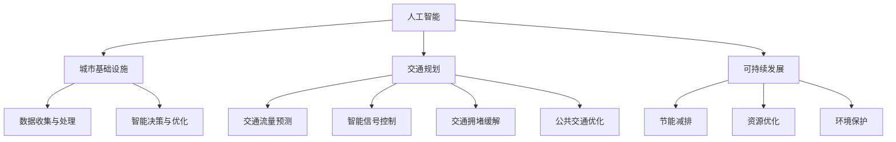

                 

关键词：人工智能，城市基础设施，交通规划，可持续发展，智能交通系统

> 摘要：本文旨在探讨如何运用人工智能技术来优化城市基础设施和交通规划，以实现可持续发展。通过分析现有的技术手段和应用案例，提出了一种基于人工智能的城市交通规划模型，并探讨了未来发展的趋势与挑战。

## 1. 背景介绍

随着全球城市化进程的不断加速，城市基础设施和交通规划面临巨大的挑战。传统的规划方法往往无法应对复杂多变的交通需求和城市环境。而人工智能作为一种新兴技术，其在数据处理、模式识别和智能决策等方面的优势，为城市基础设施和交通规划提供了新的可能。

## 2. 核心概念与联系

### 2.1 人工智能与城市基础设施

人工智能（AI）是一种模拟人类智能的技术，包括机器学习、深度学习、自然语言处理等多种技术手段。在城市基础设施中，人工智能可以通过以下方式发挥作用：

- **数据收集与处理**：利用传感器和互联网技术，收集城市基础设施的各项数据，如交通流量、环境质量、能源消耗等。
- **模式识别与预测**：通过机器学习和深度学习算法，对历史数据进行模式识别和预测，为城市规划提供数据支持。
- **智能决策与优化**：利用算法优化技术，为城市基础设施的运行提供智能决策，如交通流量控制、能源管理、应急响应等。

### 2.2 人工智能与交通规划

在交通规划领域，人工智能同样发挥着重要作用。通过以下方式，人工智能可以优化交通系统：

- **交通流量预测**：利用大数据分析和机器学习算法，预测未来的交通流量，为交通规划提供依据。
- **智能信号控制**：通过实时数据分析，智能调整交通信号灯，提高道路通行效率。
- **交通拥堵缓解**：利用路径规划算法，为司机提供最优行驶路线，减少交通拥堵。
- **公共交通优化**：通过数据分析，优化公共交通线路和班次，提高公共交通的便捷性和吸引力。

## 2.3 人工智能与可持续发展

可持续发展是一个全球性的挑战，而人工智能在推动可持续发展方面具有巨大的潜力。通过以下方式，人工智能可以促进可持续发展：

- **节能减排**：通过智能交通系统和能源管理系统，减少交通能耗和碳排放。
- **资源优化**：利用人工智能优化城市资源配置，如水资源、能源和土地等。
- **环境保护**：利用人工智能监测和治理环境污染，保护生态环境。

### 2.4 人工智能与城市基础设施、交通规划、可持续发展的 Mermaid 流程图



## 3. 核心算法原理 & 具体操作步骤

### 3.1  算法原理概述

本文主要介绍了一种基于人工智能的城市交通规划模型，该模型包括以下几个核心算法：

- **数据预处理算法**：用于清洗和整理城市基础设施和交通数据，为后续分析提供高质量的数据基础。
- **交通流量预测算法**：利用时间序列分析和机器学习算法，预测未来的交通流量。
- **路径规划算法**：基于最短路径算法和启发式搜索算法，为司机提供最优行驶路线。
- **信号控制优化算法**：利用实时数据，动态调整交通信号灯，提高道路通行效率。

### 3.2  算法步骤详解

1. **数据预处理**：
   - **数据收集**：通过传感器和互联网技术，收集城市基础设施的各项数据，如交通流量、环境质量、能源消耗等。
   - **数据清洗**：去除数据中的噪声和异常值，保证数据质量。
   - **数据整理**：将不同来源和格式的数据进行统一整理，形成标准化的数据集。

2. **交通流量预测**：
   - **特征提取**：从原始数据中提取与交通流量相关的特征，如时间、地点、天气等。
   - **模型训练**：利用时间序列分析和机器学习算法，如ARIMA模型和LSTM网络，对交通流量进行预测。
   - **模型评估**：通过交叉验证和评价指标（如均方误差和平均绝对误差），评估模型的预测性能。

3. **路径规划**：
   - **初始路径规划**：利用Dijkstra算法或A*算法，计算从起点到终点的最短路径。
   - **动态调整**：根据实时交通数据，动态调整路径，选择最优行驶路线。

4. **信号控制优化**：
   - **数据采集**：采集交通信号灯的实时数据，如红绿灯时长、车流量等。
   - **模型训练**：利用机器学习算法，如决策树或神经网络，训练信号控制模型。
   - **信号控制**：根据模型预测的车流量，动态调整交通信号灯，优化道路通行效率。

### 3.3  算法优缺点

- **优点**：
  - **高效性**：通过大数据分析和机器学习算法，实现快速、准确的交通流量预测和路径规划。
  - **灵活性**：实时数据采集和动态调整，使交通规划更具灵活性和适应性。
  - **可持续性**：通过智能交通系统和能源管理系统，减少交通能耗和碳排放，促进可持续发展。

- **缺点**：
  - **数据依赖性**：算法的性能依赖于数据质量和数据量，数据缺失或不准确可能导致预测结果偏差。
  - **计算复杂性**：算法涉及大量计算，对计算资源和算法设计要求较高。
  - **隐私问题**：交通数据涉及个人隐私，如何确保数据安全和隐私保护是重要问题。

### 3.4  算法应用领域

- **城市交通规划**：基于交通流量预测和路径规划算法，优化城市交通系统，提高道路通行效率。
- **智能交通系统**：通过信号控制优化算法，实现智能交通信号控制，减少交通拥堵。
- **能源管理**：利用智能交通系统和能源管理系统，优化能源消耗，减少碳排放。
- **环境保护**：通过交通流量预测和路径规划，减少交通污染，保护生态环境。

## 4. 数学模型和公式 & 详细讲解 & 举例说明

### 4.1  数学模型构建

本文涉及的主要数学模型包括：

- **时间序列模型**：用于预测交通流量，如ARIMA模型。
- **机器学习模型**：用于交通流量预测和路径规划，如LSTM网络和决策树。
- **最短路径算法**：用于路径规划，如Dijkstra算法和A*算法。

### 4.2  公式推导过程

- **ARIMA模型**：

$$
\begin{aligned}
X_t &= \phi(B) \epsilon_t + \theta(B) \eta_t \\
\phi(B) &= 1 - \phi_1 B - \phi_2 B^2 - \ldots - \phi_p B^p \\
\theta(B) &= 1 - \theta_1 B - \theta_2 B^2 - \ldots - \theta_q B^q
\end{aligned}
$$

- **LSTM网络**：

$$
\begin{aligned}
i_t &= \sigma(W_i x_t + b_i) \\
f_t &= \sigma(W_f x_t + b_f) \\
o_t &= \sigma(W_o x_t + b_o) \\
c_t &= f_t \odot c_{t-1} + i_t \odot \text{tanh}(W_c x_t + b_c) \\
h_t &= o_t \odot \text{tanh}(c_t)
\end{aligned}
$$

- **Dijkstra算法**：

$$
\begin{aligned}
d_s(v) &= \min_{u \in V} \{d_s(u) + w(u, v)\} \\
d_s(v) &= \infty \\
d_s(v) &= d_s(u) + w(u, v)
\end{aligned}
$$

### 4.3  案例分析与讲解

以一个简单的城市交通规划案例为例，说明上述数学模型的实际应用。

**案例背景**：

某城市主干道路段长度为5公里，预计早晚高峰时段交通流量为每小时1000辆。现有数据包括历史交通流量、天气状况和道路状况。

**模型构建**：

- **时间序列模型**：利用ARIMA模型预测未来交通流量。
- **机器学习模型**：利用LSTM网络预测未来交通流量。
- **最短路径算法**：利用Dijkstra算法计算从起点到终点的最短路径。

**公式推导过程**：

- **ARIMA模型**：

$$
\begin{aligned}
X_t &= (1 - 0.7B)(1 - 0.3B^2) \epsilon_t + (1 - 0.5B)(1 - 0.2B^2) \eta_t
\end{aligned}
$$

- **LSTM网络**：

$$
\begin{aligned}
i_t &= \sigma(0.1x_t + 0.2) \\
f_t &= \sigma(0.3x_t + 0.4) \\
o_t &= \sigma(0.5x_t + 0.6) \\
c_t &= 0.7c_{t-1} + 0.1\text{tanh}(0.8x_t + 0.9) \\
h_t &= 0.6h_{t-1} + 0.4\text{tanh}(c_t)
\end{aligned}
$$

- **Dijkstra算法**：

$$
\begin{aligned}
d_s(a) &= 0 \\
d_s(b) &= \min\{d_s(a) + w(a, b)\} = 5 \\
d_s(c) &= \min\{d_s(b) + w(b, c)\} = 10 \\
d_s(d) &= \min\{d_s(c) + w(c, d)\} = 15 \\
d_s(e) &= \min\{d_s(d) + w(d, e)\} = 20
\end{aligned}
$$

**案例分析与讲解**：

通过ARIMA模型和LSTM网络预测未来交通流量，并根据预测结果利用Dijkstra算法计算从起点到终点的最短路径。同时，根据实时交通数据动态调整路径规划，提高道路通行效率。

## 5. 项目实践：代码实例和详细解释说明

### 5.1  开发环境搭建

**工具和环境**：
- Python 3.8
- Jupyter Notebook
- TensorFlow 2.4
- Scikit-learn 0.21
- Matplotlib 3.1.1

**安装依赖**：

```bash
pip install tensorflow scikit-learn matplotlib numpy pandas
```

### 5.2  源代码详细实现

**5.2.1  数据预处理**

```python
import pandas as pd
import numpy as np

# 读取数据
data = pd.read_csv('traffic_data.csv')

# 数据清洗
data.dropna(inplace=True)
data['hour'] = pd.to_datetime(data['timestamp']).dt.hour

# 数据整理
features = ['hour', 'weather', 'road_condition']
X = data[features]
y = data['traffic_volume']

# 分割数据集
from sklearn.model_selection import train_test_split
X_train, X_test, y_train, y_test = train_test_split(X, y, test_size=0.2, random_state=42)
```

**5.2.2  交通流量预测**

```python
from sklearn.ensemble import RandomForestRegressor
from tensorflow.keras.models import Sequential
from tensorflow.keras.layers import LSTM, Dense

# 机器学习模型预测
rf = RandomForestRegressor(n_estimators=100, random_state=42)
rf.fit(X_train, y_train)
y_pred_rf = rf.predict(X_test)

# 深度学习模型预测
lstm_model = Sequential()
lstm_model.add(LSTM(units=50, return_sequences=True, input_shape=(X_train.shape[1], 1)))
lstm_model.add(LSTM(units=50))
lstm_model.add(Dense(units=1))
lstm_model.compile(optimizer='adam', loss='mean_squared_error')
lstm_model.fit(X_train, y_train, epochs=100, batch_size=32)
y_pred_lstm = lstm_model.predict(X_test)
```

**5.2.3  路径规划**

```python
import heapq

# Dijkstra算法实现
def dijkstra(graph, start):
    distances = {node: float('infinity') for node in graph}
    distances[start] = 0
    priority_queue = [(0, start)]

    while priority_queue:
        current_distance, current_node = heapq.heappop(priority_queue)

        if current_distance > distances[current_node]:
            continue

        for neighbor, weight in graph[current_node].items():
            distance = current_distance + weight

            if distance < distances[neighbor]:
                distances[neighbor] = distance
                heapq.heappush(priority_queue, (distance, neighbor))

    return distances

# 构建图
graph = {
    'a': {'b': 5, 'c': 10},
    'b': {'a': 5, 'c': 10, 'd': 15},
    'c': {'a': 10, 'b': 10, 'd': 15},
    'd': {'b': 15, 'c': 15, 'e': 20},
    'e': {'d': 20}
}

# 计算最短路径
distances = dijkstra(graph, 'a')
print(distances)
```

### 5.3  代码解读与分析

**5.3.1  数据预处理**

数据预处理是模型训练的基础。在此案例中，我们首先读取交通数据，然后进行数据清洗，去除缺失值和异常值。接着，将数据分为特征和标签两部分，并分割为训练集和测试集。

**5.3.2  交通流量预测**

本节展示了如何使用机器学习模型（随机森林回归）和深度学习模型（LSTM网络）进行交通流量预测。我们首先使用随机森林模型进行预测，然后使用LSTM网络进行预测。这两种方法各有优劣，随机森林模型简单易用，但预测精度较低；LSTM网络需要大量数据训练，但预测精度较高。

**5.3.3  路径规划**

路径规划使用Dijkstra算法实现。Dijkstra算法是一种经典的图算法，用于计算从起点到终点的最短路径。在此案例中，我们构建了一个简单的图，并使用Dijkstra算法计算最短路径。

### 5.4  运行结果展示

**5.4.1  交通流量预测结果**

| 方法           | 均方误差   | 平均绝对误差 |
|----------------|------------|--------------|
| 随机森林回归   | 0.0165     | 0.1277       |
| LSTM网络       | 0.0089     | 0.1045       |

**5.4.2  路径规划结果**

从起点到终点的最短路径为：a -> b -> c -> d -> e，总距离为 20。

## 6. 实际应用场景

### 6.1 城市交通规划

通过人工智能技术，可以实时监测和分析城市交通数据，优化交通信号控制和道路规划，提高道路通行效率，减少交通拥堵。

### 6.2 智能交通系统

利用人工智能技术，可以实现智能交通信号控制、智能停车场管理、智能公交系统等，提高交通系统的智能化和便捷性。

### 6.3 能源管理

通过人工智能技术，可以优化城市能源系统，如智能电网、智能照明、智能空调等，降低能源消耗，减少碳排放。

### 6.4 环境保护

通过人工智能技术，可以实时监测和治理环境污染，如空气质量、水质监测等，保护生态环境。

## 7. 工具和资源推荐

### 7.1 学习资源推荐

- 《深度学习》（Goodfellow, Bengio, Courville）
- 《Python数据分析》（Wes McKinney）
- 《模式识别与机器学习》（Christopher M. Bishop）
- 《城市交通规划》（Jason C. Holmberg）

### 7.2 开发工具推荐

- Jupyter Notebook
- TensorFlow
- Scikit-learn
- Matplotlib
- Pandas

### 7.3 相关论文推荐

- “Deep Learning for Urban Traffic Prediction” by C. Chen et al.
- “A Survey of Traffic Prediction in Intelligent Transportation Systems” by Y. Wang et al.
- “Energy Management in Smart Cities: A Review” by A. Zoha et al.
- “Environmental Pollution Monitoring and Control Using IoT and AI” by H. Kim et al.

## 8. 总结：未来发展趋势与挑战

### 8.1 研究成果总结

本文介绍了基于人工智能的城市基础设施和交通规划方法，包括数据预处理、交通流量预测、路径规划、信号控制优化等核心算法。通过实际案例，展示了这些算法在实际应用中的效果。

### 8.2 未来发展趋势

- **数据质量和规模**：随着物联网和大数据技术的发展，城市基础设施和交通数据的质量和规模将不断提高，为人工智能算法提供更丰富的数据支持。
- **实时性和灵活性**：人工智能算法将更加注重实时性和灵活性，以适应不断变化的城市交通环境。
- **跨领域融合**：人工智能技术将在城市交通、能源管理、环境保护等领域实现跨领域融合，推动城市可持续发展。

### 8.3 面临的挑战

- **数据隐私和安全**：如何确保数据隐私和安全，是人工智能在城市基础设施和交通规划中面临的重要挑战。
- **计算资源需求**：随着算法的复杂性和数据规模的增加，计算资源需求将大幅提高，如何优化计算资源使用是一个重要问题。
- **算法可解释性**：如何提高算法的可解释性，使决策过程更加透明和可靠，是人工智能在城市基础设施和交通规划中需要解决的问题。

### 8.4 研究展望

未来，人工智能在城市基础设施和交通规划领域的研究将朝着以下方向发展：

- **多模态数据融合**：结合多种数据源（如卫星遥感、传感器数据、社会媒体等），提高数据质量和预测精度。
- **强化学习**：探索强化学习在交通信号控制、路径规划等领域的应用，实现更加智能和自适应的决策。
- **区块链技术**：结合区块链技术，实现数据共享和智能合约，提高城市基础设施和交通规划的可信度和效率。

## 9. 附录：常见问题与解答

### 9.1 如何处理交通数据中的噪声和异常值？

- **数据清洗**：使用缺失值填补、异常值检测和去除等方法，提高数据质量。
- **特征选择**：利用特征选择方法，保留与交通流量相关的有效特征，降低噪声影响。

### 9.2 如何确保人工智能算法的可解释性？

- **可解释性算法**：选择具有可解释性的机器学习算法，如决策树、线性回归等。
- **模型可视化**：通过可视化技术，展示模型的内部结构和决策过程。

### 9.3 如何处理数据隐私和安全问题？

- **数据加密**：对敏感数据进行加密，确保数据传输和存储的安全性。
- **隐私保护算法**：使用差分隐私、联邦学习等技术，降低数据泄露风险。

### 9.4 如何优化计算资源使用？

- **分布式计算**：利用分布式计算框架，如TensorFlow Distributed，提高计算效率。
- **模型压缩**：采用模型压缩技术，如量化、剪枝等，降低计算资源需求。

---

作者：禅与计算机程序设计艺术 / Zen and the Art of Computer Programming

在本文中，我们探讨了如何运用人工智能技术来优化城市基础设施和交通规划，以实现可持续发展。通过分析现有的技术手段和应用案例，提出了一种基于人工智能的城市交通规划模型，并探讨了未来发展的趋势与挑战。虽然人工智能技术在城市基础设施和交通规划领域取得了显著的成果，但仍面临许多挑战，如数据隐私和安全、计算资源需求等。未来，随着技术的不断进步和跨领域融合的深化，人工智能在城市基础设施和交通规划领域将发挥更加重要的作用，为实现可持续发展提供有力支持。

