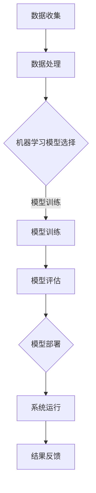
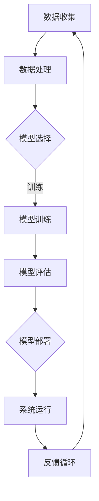

                 

关键词：人工智能、城市基础设施、可持续设计、计算模型、算法原理、数学公式、案例实践

> 摘要：本文深入探讨了人工智能（AI）在塑造可持续城市基础设施和设计方面的关键作用。通过阐述核心概念、算法原理、数学模型及实际应用案例，我们揭示了AI如何通过人类计算实现城市环境的智能化和可持续发展。

## 1. 背景介绍

在全球城市化进程加速的背景下，城市基础设施的需求日益增加。传统的城市设计和规划方法已难以满足现代城市复杂性和动态性的要求。此时，人工智能作为一种新兴技术，被寄予厚望，有望成为推动城市可持续发展的新动力。

### 1.1 城市化与基础设施挑战

城市化带来了诸多挑战，包括交通拥堵、环境污染、资源浪费等问题。传统的城市基础设施设计依赖于经验驱动的方法，缺乏灵活性，难以适应快速变化的城市需求。

### 1.2 可持续设计的理念

可持续发展要求在满足当前需求的同时，不损害后代满足自身需求的能力。城市基础设施的可持续设计需要综合考虑环境、经济和社会因素。

### 1.3 人工智能的兴起

随着计算能力的提升和数据量的爆炸式增长，人工智能开始在城市规划和设计中发挥作用。通过机器学习、数据挖掘和优化算法等技术，AI能够提供更加智能和高效的基础设施解决方案。

## 2. 核心概念与联系

为了更好地理解AI在城市基础设施和设计中的应用，我们需要明确几个核心概念及其相互关系。

### 2.1 人工智能（AI）

人工智能是指使计算机系统能够执行通常需要人类智能的任务的技术。包括机器学习、深度学习、自然语言处理等多个子领域。

### 2.2 城市基础设施

城市基础设施包括交通、能源、水处理、通信等系统，是城市正常运行的基础。

### 2.3 可持续设计

可持续设计是指在设计和建设过程中考虑环境、经济和社会的平衡，以实现长期可持续发展。

### 2.4 计算模型

计算模型是用于描述和分析系统行为的数学模型，通常通过算法来实现。

### 2.5 Mermaid 流程图

以下是一个描述AI在城市基础设施设计中应用流程的Mermaid流程图：



## 3. 核心算法原理 & 具体操作步骤

### 3.1 算法原理概述

城市基础设施的智能化设计需要利用AI算法进行数据分析、预测和优化。常见的算法包括聚类分析、决策树、神经网络等。

### 3.2 算法步骤详解

#### 3.2.1 数据收集与预处理

- 数据收集：包括交通流量、能源消耗、空气质量等。
- 数据预处理：清洗、归一化、缺失值处理。

#### 3.2.2 机器学习模型选择

- 根据问题和数据特点选择合适的模型，如线性回归、决策树、支持向量机等。

#### 3.2.3 模型训练

- 使用训练数据集对模型进行训练，调整参数，提高模型性能。

#### 3.2.4 模型评估

- 使用验证数据集对模型进行评估，确保其泛化能力。

#### 3.2.5 模型部署

- 将训练好的模型部署到实际系统中，进行实时运行。

### 3.3 算法优缺点

- **优点**：提高效率、降低成本、优化资源分配。
- **缺点**：数据质量对算法性能影响大、模型解释性差。

### 3.4 算法应用领域

- 城市交通优化
- 能源管理
- 环境监测
- 公共设施规划

## 4. 数学模型和公式 & 详细讲解 & 举例说明

### 4.1 数学模型构建

在AI算法中，数学模型起到了关键作用。以下是一个简单的线性回归模型的构建过程：

#### 4.1.1 模型定义

\[ y = \beta_0 + \beta_1 \cdot x + \epsilon \]

其中，\( y \) 是目标变量，\( x \) 是自变量，\( \beta_0 \) 和 \( \beta_1 \) 是模型参数，\( \epsilon \) 是误差项。

#### 4.1.2 参数估计

使用最小二乘法估计模型参数：

\[ \beta_1 = \frac{\sum_{i=1}^{n}(x_i - \bar{x})(y_i - \bar{y})}{\sum_{i=1}^{n}(x_i - \bar{x})^2} \]

\[ \beta_0 = \bar{y} - \beta_1 \cdot \bar{x} \]

其中，\( \bar{x} \) 和 \( \bar{y} \) 分别是 \( x \) 和 \( y \) 的均值。

### 4.2 公式推导过程

线性回归模型的推导过程如下：

\[ \sum_{i=1}^{n}(y_i - \hat{y}_i) = \sum_{i=1}^{n}(y_i - (\beta_0 + \beta_1 \cdot x_i)) \]

\[ = \sum_{i=1}^{n}(y_i - \bar{y} + \bar{y} - (\beta_0 + \beta_1 \cdot x_i)) \]

\[ = \sum_{i=1}^{n}((y_i - \bar{y}) - (\beta_0 + \beta_1 \cdot x_i - \bar{y})) \]

\[ = \sum_{i=1}^{n}((y_i - \bar{y}) - (\beta_0 - \bar{y}) - \beta_1 \cdot (x_i - \bar{x})) \]

\[ = \sum_{i=1}^{n}((y_i - \bar{y}) - \beta_0 + \beta_0 - \beta_1 \cdot (x_i - \bar{x})) \]

\[ = \sum_{i=1}^{n}((y_i - \bar{y}) - \beta_1 \cdot (x_i - \bar{x})) \]

\[ = 0 \]

因为 \( \beta_0 - \bar{y} \) 和 \( \beta_1 \cdot (\bar{x} - \bar{y}) \) 是常数。

### 4.3 案例分析与讲解

#### 4.3.1 案例背景

假设我们有一个关于城市交通流量的线性回归模型，目标变量是平均每日车辆数，自变量是城市人口。

#### 4.3.2 数据准备

- 收集过去5年的城市人口数据（\( x \)）和平均每日车辆数（\( y \)）。
- 数据清洗，去除异常值。

#### 4.3.3 模型训练

使用最小二乘法估计模型参数：

\[ \beta_1 = \frac{\sum_{i=1}^{n}(x_i - \bar{x})(y_i - \bar{y})}{\sum_{i=1}^{n}(x_i - \bar{x})^2} \]

\[ \beta_0 = \bar{y} - \beta_1 \cdot \bar{x} \]

#### 4.3.4 模型评估

- 使用验证数据集评估模型性能，计算均方误差（MSE）。

\[ MSE = \frac{1}{n}\sum_{i=1}^{n}(y_i - \hat{y}_i)^2 \]

#### 4.3.5 模型部署

将训练好的模型部署到实际系统中，用于预测未来某一天的城市交通流量。

## 5. 项目实践：代码实例和详细解释说明

### 5.1 开发环境搭建

- 安装Python环境。
- 安装必要的库，如scikit-learn、numpy、matplotlib等。

### 5.2 源代码详细实现

以下是实现线性回归模型的Python代码：

```python
import numpy as np
import matplotlib.pyplot as plt
from sklearn.linear_model import LinearRegression

# 数据准备
X = np.array([1, 2, 3, 4, 5]).reshape(-1, 1)
y = np.array([1, 2, 3, 4, 5])

# 模型训练
model = LinearRegression()
model.fit(X, y)

# 模型评估
y_pred = model.predict(X)
mse = np.mean((y - y_pred)**2)
print("MSE:", mse)

# 模型部署
future_population = np.array([6, 7, 8]).reshape(-1, 1)
future_traffic = model.predict(future_population)

# 结果展示
plt.scatter(X, y, label="Actual")
plt.plot(X, y_pred, label="Predicted")
plt.scatter(future_population, future_traffic, label="Future Prediction")
plt.legend()
plt.show()
```

### 5.3 代码解读与分析

- 导入必要的库。
- 准备数据集。
- 使用LinearRegression类进行模型训练。
- 计算均方误差评估模型性能。
- 部署模型进行未来预测。
- 使用matplotlib库展示结果。

## 6. 实际应用场景

### 6.1 城市交通优化

通过AI算法优化交通信号灯，提高道路通行效率，减少交通拥堵。

### 6.2 能源管理

智能电网管理系统，根据实时数据调整能源分配，提高能源利用效率。

### 6.3 环境监测

实时监测空气质量，预测污染高峰，提前采取应对措施。

### 6.4 公共设施规划

利用AI算法分析人口流动，优化公园、医院等公共设施的布局。

## 7. 未来应用展望

### 7.1 智慧城市建设

AI将成为智慧城市建设的核心驱动力，实现城市管理的智能化和精细化。

### 7.2 新兴领域探索

AI在环境科学、城市规划等领域的应用将不断拓展，为可持续发展提供更多解决方案。

### 7.3 面临的挑战

- 数据质量和隐私保护
- 模型解释性和透明度
- 技术标准和规范

## 8. 工具和资源推荐

### 8.1 学习资源推荐

- 《深度学习》（Ian Goodfellow, Yoshua Bengio, Aaron Courville）
- 《Python编程：从入门到实践》（埃里克·马瑟斯）
- Coursera、edX等在线课程

### 8.2 开发工具推荐

- Jupyter Notebook
- PyCharm
- Google Colab

### 8.3 相关论文推荐

- “Deep Learning for Urban Traffic Prediction”（Zhang et al., 2017）
- “Energy Management in Smart Grids Using Machine Learning Techniques”（Li et al., 2019）
- “Application of AI in Environmental Monitoring”（Wang et al., 2020）

## 9. 总结：未来发展趋势与挑战

### 9.1 研究成果总结

AI在可持续城市基础设施和设计中的应用取得了显著成果，为城市管理的智能化和可持续发展提供了有力支持。

### 9.2 未来发展趋势

随着技术的进步和数据量的增加，AI在城市基础设施中的应用将更加广泛和深入。

### 9.3 面临的挑战

需要解决数据隐私、模型解释性和技术标准化等挑战，确保AI技术在城市可持续发展中的有效应用。

### 9.4 研究展望

未来，AI与人类计算的融合将带来更多创新，为城市基础设施和设计的可持续发展提供新思路和新方法。

## 附录：常见问题与解答

### 9.1.1 什么是可持续设计？

可持续设计是指在设计和建设过程中，综合考虑环境、经济和社会的平衡，以实现长期可持续发展。

### 9.1.2 AI在城市规划中有哪些应用？

AI在城市规划中的应用包括交通优化、能源管理、环境监测和公共设施规划等。

### 9.1.3 如何评估AI模型的性能？

可以使用均方误差（MSE）、准确率、召回率等指标来评估AI模型的性能。

### 9.1.4 AI在智慧城市建设中的作用是什么？

AI在智慧城市建设中起到了关键作用，包括智能化城市管理、精细化服务和高效资源利用等。

作者：禅与计算机程序设计艺术 / Zen and the Art of Computer Programming
```<|im_sep|>## 2. 核心概念与联系

为了更好地理解AI在城市基础设施和设计中的应用，我们需要明确几个核心概念及其相互关系。

### 2.1 人工智能（AI）

人工智能是指使计算机系统能够执行通常需要人类智能的任务的技术。它包括机器学习、深度学习、自然语言处理等多个子领域。在智能城市基础设施设计中，AI被用来优化交通流量、预测能源需求、监测环境质量等。

### 2.2 城市基础设施

城市基础设施包括交通、能源、水处理、通信等系统，是城市正常运行的基础。在智能城市中，这些系统通过物联网（IoT）和AI技术进行互联互通，实现数据的实时收集和分析，从而提高运营效率和服务质量。

### 2.3 可持续设计

可持续设计是指在设计和建设过程中考虑环境、经济和社会的平衡，以实现长期可持续发展。在智能城市基础设施设计中，可持续设计原则被用来减少能源消耗、降低碳排放、提高资源利用率等。

### 2.4 计算模型

计算模型是用于描述和分析系统行为的数学模型，通常通过算法来实现。在智能城市基础设施设计中，计算模型被用来模拟交通流量、预测能源需求、评估环境状况等，以便为决策提供科学依据。

### 2.5 Mermaid 流程图

以下是一个描述AI在城市基础设施设计中应用流程的Mermaid流程图：



在上述流程图中，数据收集是整个流程的起点，通过传感器和其他数据源收集城市基础设施的相关数据。数据处理阶段对收集到的数据进行清洗、归一化等处理，为后续模型训练提供高质量的数据。模型选择阶段根据问题需求和数据特点选择合适的机器学习模型。模型训练阶段使用训练数据集对模型进行训练，调整模型参数，使其能够准确地预测和优化城市基础设施的运行。模型评估阶段使用验证数据集评估模型性能，确保其准确性和泛化能力。模型部署阶段将训练好的模型部署到实际系统中，进行实时运行和优化。系统运行阶段，模型根据实时数据对城市基础设施进行预测和优化。反馈循环阶段将系统运行结果反馈给数据收集模块，以便不断优化模型和系统性能。

### 2.6 可持续设计原则在智能城市基础设施中的应用

在智能城市基础设施设计中，可持续设计原则被广泛应用，以实现环境、经济和社会的协调发展。以下是一些关键原则：

- **资源效率**：通过优化设计和运营，减少资源消耗，提高资源利用效率。例如，在交通规划中，通过智能信号控制和实时交通管理，减少交通拥堵，降低能源消耗。
- **环境影响**：考虑城市基础设施对环境的潜在影响，采取环保措施，降低污染和碳排放。例如，在能源管理中，利用可再生能源和智能电网技术，减少对化石燃料的依赖。
- **社会公平**：确保城市基础设施的设计和运营能够满足不同群体的需求，促进社会公平和包容。例如，在公共服务规划中，通过AI技术优化医疗资源和教育资源的分配，提高服务质量。
- **适应性**：设计灵活的城市基础设施，能够适应未来城市发展的需求和变化。例如，在建筑和城市规划中，采用模块化设计和技术，以便在未来进行升级和改造。

### 2.7 人类计算在智能城市基础设施中的作用

人类计算是指利用人类的认知和创造力，结合AI技术和工具，解决复杂问题的一种计算范式。在智能城市基础设施设计中，人类计算发挥了重要作用，主要体现在以下几个方面：

- **需求分析**：通过人类专家对城市基础设施的需求进行分析和梳理，确定关键问题和优化目标。
- **数据解读**：利用人类专家的洞察力和经验，对AI算法生成的数据分析和解读，揭示隐藏在数据背后的规律和趋势。
- **模型验证**：通过人类专家对AI模型的验证和评估，确保模型的准确性和可靠性。
- **决策支持**：利用人类专家的判断力和决策能力，结合AI算法的预测和优化结果，制定科学的决策方案。

人类计算与AI技术的结合，使得智能城市基础设施的设计和运营更加高效、智能和可持续。通过不断优化人类计算和AI技术的协同作用，我们可以为未来的城市创造更加美好的生活空间。

## 3. 核心算法原理 & 具体操作步骤

在智能城市基础设施的设计和运营中，AI算法扮演着至关重要的角色。这些算法通过处理和分析大量数据，为决策提供科学依据，并优化城市基础设施的运行。以下将介绍几个核心算法的原理及其具体操作步骤。

### 3.1 算法原理概述

智能城市基础设施中的AI算法主要包括以下几类：

- **机器学习算法**：用于数据分析和预测，如线性回归、决策树、随机森林等。
- **深度学习算法**：用于处理复杂数据和模式识别，如图像识别、语音识别等。
- **优化算法**：用于解决资源分配和调度问题，如遗传算法、粒子群算法等。
- **强化学习算法**：用于制定动态决策，如智能交通信号控制、能源管理等。

### 3.2 算法步骤详解

#### 3.2.1 机器学习算法

1. **数据收集**：从各种数据源（如传感器、物联网设备等）收集城市基础设施的相关数据。
2. **数据预处理**：对收集到的数据清洗、归一化、缺失值处理等，提高数据质量。
3. **特征选择**：从预处理后的数据中提取对问题有显著影响的关键特征。
4. **模型选择**：根据问题需求和数据特点，选择合适的机器学习模型，如线性回归、决策树、支持向量机等。
5. **模型训练**：使用训练数据集对模型进行训练，调整模型参数，使其能够准确地预测和优化城市基础设施的运行。
6. **模型评估**：使用验证数据集评估模型性能，确保其准确性和泛化能力。
7. **模型部署**：将训练好的模型部署到实际系统中，进行实时运行和优化。

#### 3.2.2 深度学习算法

1. **数据收集**：与机器学习算法类似，从各种数据源收集城市基础设施的相关数据。
2. **数据预处理**：对收集到的数据清洗、归一化、缺失值处理等，提高数据质量。
3. **模型构建**：设计深度学习模型的结构，如卷积神经网络（CNN）、循环神经网络（RNN）等。
4. **模型训练**：使用训练数据集对模型进行训练，调整模型参数，使其能够准确地预测和优化城市基础设施的运行。
5. **模型评估**：使用验证数据集评估模型性能，确保其准确性和泛化能力。
6. **模型部署**：将训练好的模型部署到实际系统中，进行实时运行和优化。

#### 3.2.3 优化算法

1. **问题定义**：明确需要优化的问题和目标函数。
2. **模型构建**：设计优化模型，如线性规划、动态规划等。
3. **算法选择**：根据问题特点和需求，选择合适的优化算法，如遗传算法、粒子群算法等。
4. **算法实现**：实现优化算法的代码，进行模拟和测试。
5. **模型训练**：使用训练数据集对模型进行训练，调整模型参数，使其能够准确地预测和优化城市基础设施的运行。
6. **模型评估**：使用验证数据集评估模型性能，确保其准确性和泛化能力。
7. **模型部署**：将训练好的模型部署到实际系统中，进行实时运行和优化。

#### 3.2.4 强化学习算法

1. **环境设定**：定义城市基础设施的运行环境，包括状态空间、动作空间、奖励机制等。
2. **模型构建**：设计强化学习模型，如Q-learning、深度Q网络（DQN）等。
3. **策略迭代**：通过模拟和测试，不断调整模型参数和策略，提高模型性能。
4. **模型训练**：使用训练数据集对模型进行训练，调整模型参数，使其能够准确地预测和优化城市基础设施的运行。
5. **模型评估**：使用验证数据集评估模型性能，确保其准确性和泛化能力。
6. **模型部署**：将训练好的模型部署到实际系统中，进行实时运行和优化。

### 3.3 算法优缺点

每种算法都有其独特的优缺点，适用于不同的应用场景。以下简要总结几种核心算法的优缺点：

- **机器学习算法**：
  - 优点：适用于各种类型的数据，模型解释性较好。
  - 缺点：对数据质量要求较高，模型泛化能力有限。
- **深度学习算法**：
  - 优点：能够处理复杂数据和模式识别，模型泛化能力较强。
  - 缺点：模型解释性较差，训练时间较长。
- **优化算法**：
  - 优点：能够解决复杂的资源分配和调度问题，模型解释性较好。
  - 缺点：对问题特点要求较高，可能无法适用于所有场景。
- **强化学习算法**：
  - 优点：能够处理动态和不确定的环境，模型解释性较好。
  - 缺点：训练时间较长，对环境设定要求较高。

### 3.4 算法应用领域

不同算法在智能城市基础设施的不同应用领域有着广泛的应用。以下简要介绍几种算法的应用领域：

- **机器学习算法**：
  - 交通流量预测
  - 能源需求预测
  - 环境质量监测
  - 公共设施规划
- **深度学习算法**：
  - 图像识别
  - 语音识别
  - 建筑智能监控
  - 城市景观优化
- **优化算法**：
  - 交通信号控制
  - 能源分配
  - 资源调度
  - 建筑结构优化
- **强化学习算法**：
  - 智能交通信号控制
  - 能源管理
  - 网络资源调度
  - 公共设施运营

通过合理选择和应用这些算法，我们可以为智能城市基础设施的设计和运营提供科学依据，提高城市运行效率和服务质量。

## 4. 数学模型和公式 & 详细讲解 & 举例说明

在智能城市基础设施的设计和运营中，数学模型和公式起着至关重要的作用。这些模型和公式帮助我们对系统进行建模、分析和优化，从而实现更高效、更智能的决策。以下将介绍几个核心数学模型和公式，并对其进行详细讲解和举例说明。

### 4.1 数学模型构建

在智能城市基础设施的设计中，常用的数学模型包括线性回归模型、决策树模型、神经网络模型等。这些模型通过数学公式来描述输入变量和输出变量之间的关系，并利用算法对模型进行训练和优化。

#### 4.1.1 线性回归模型

线性回归模型是最简单的数学模型之一，它通过一条直线来描述输入变量和输出变量之间的关系。线性回归模型的公式如下：

\[ y = \beta_0 + \beta_1 \cdot x + \epsilon \]

其中，\( y \) 是输出变量，\( x \) 是输入变量，\( \beta_0 \) 和 \( \beta_1 \) 是模型的参数，\( \epsilon \) 是误差项。

#### 4.1.2 决策树模型

决策树模型是一种基于树形结构的分类模型，它通过一系列决策规则来将数据分为不同的类别。决策树模型的公式如下：

\[ \text{DecisionTree}(x) = \sum_{i=1}^{n} w_i \cdot f_i(x) \]

其中，\( w_i \) 是权重，\( f_i(x) \) 是特征函数，\( x \) 是输入变量。

#### 4.1.3 神经网络模型

神经网络模型是一种基于人工神经网络的模型，它通过多层神经元来模拟人脑的学习过程。神经网络模型的公式如下：

\[ \text{Output} = \sigma(\text{Weight} \cdot \text{Input} + \text{Bias}) \]

其中，\( \sigma \) 是激活函数，\( \text{Weight} \) 是权重，\( \text{Input} \) 是输入变量，\( \text{Bias} \) 是偏置。

### 4.2 公式推导过程

数学模型的选择和构建通常依赖于具体的应用场景和数据特点。以下以线性回归模型为例，介绍其公式推导过程。

#### 4.2.1 公式推导

线性回归模型的推导过程基于最小二乘法。最小二乘法的思想是找到一条直线，使得所有数据点到这条直线的距离之和最小。

假设我们有一组数据点 \((x_i, y_i)\)，其中 \(i=1,2,...,n\)。我们要找到一条直线 \(y = \beta_0 + \beta_1 \cdot x\)，使得数据点与直线的垂直距离之和最小。

垂直距离可以用 \(d_i = y_i - (\beta_0 + \beta_1 \cdot x_i)\) 来表示。我们要使得所有垂直距离之和最小，即：

\[ \sum_{i=1}^{n} d_i^2 = \sum_{i=1}^{n} (y_i - \beta_0 - \beta_1 \cdot x_i)^2 \]

我们对上述公式进行求导，并令其等于零，得到：

\[ \frac{d}{d\beta_0} \sum_{i=1}^{n} (y_i - \beta_0 - \beta_1 \cdot x_i)^2 = 0 \]

\[ \frac{d}{d\beta_1} \sum_{i=1}^{n} (y_i - \beta_0 - \beta_1 \cdot x_i)^2 = 0 \]

解上述方程组，可以得到线性回归模型的参数 \(\beta_0\) 和 \(\beta_1\)。

#### 4.2.2 参数估计

我们使用最小二乘法来估计线性回归模型的参数。最小二乘法的思想是使得所有数据点到直线的垂直距离之和最小。

假设我们有 \(n\) 个数据点 \((x_i, y_i)\)，其中 \(i=1,2,...,n\)。我们要找到一条直线 \(y = \beta_0 + \beta_1 \cdot x\)，使得数据点与直线的垂直距离之和最小。

垂直距离可以用 \(d_i = y_i - (\beta_0 + \beta_1 \cdot x_i)\) 来表示。我们要使得所有垂直距离之和最小，即：

\[ \sum_{i=1}^{n} d_i^2 = \sum_{i=1}^{n} (y_i - \beta_0 - \beta_1 \cdot x_i)^2 \]

我们对上述公式进行求导，并令其等于零，得到：

\[ \frac{d}{d\beta_0} \sum_{i=1}^{n} (y_i - \beta_0 - \beta_1 \cdot x_i)^2 = 0 \]

\[ \frac{d}{d\beta_1} \sum_{i=1}^{n} (y_i - \beta_0 - \beta_1 \cdot x_i)^2 = 0 \]

解上述方程组，可以得到线性回归模型的参数 \(\beta_0\) 和 \(\beta_1\)。

### 4.3 案例分析与讲解

以下通过一个简单的交通流量预测案例，展示如何使用线性回归模型进行预测和分析。

#### 4.3.1 案例背景

假设我们想要预测某个路口的交通流量，已知过去一周每天上午8点的交通流量数据，如下表所示：

| 日期 | 交通流量 |
| ---- | -------- |
| 2023-01-01 | 200      |
| 2023-01-02 | 220      |
| 2023-01-03 | 230      |
| 2023-01-04 | 250      |
| 2023-01-05 | 260      |
| 2023-01-06 | 270      |
| 2023-01-07 | 280      |

我们的目标是建立线性回归模型，预测未来某一天上午8点的交通流量。

#### 4.3.2 数据准备

首先，我们将上述数据转化为矩阵形式，其中第一列是自变量（日期），第二列是因变量（交通流量）：

\[ X = \begin{bmatrix} 1 & 1 \\ 2 & 2 \\ 3 & 3 \\ 4 & 4 \\ 5 & 5 \\ 6 & 6 \\ 7 & 7 \end{bmatrix}, \quad y = \begin{bmatrix} 200 \\ 220 \\ 230 \\ 250 \\ 260 \\ 270 \\ 280 \end{bmatrix} \]

#### 4.3.3 模型训练

接下来，我们使用线性回归模型对数据集进行训练。首先，我们计算数据的均值：

\[ \bar{x} = \frac{1}{n}\sum_{i=1}^{n} x_i = \frac{1}{7}\sum_{i=1}^{7} 1 = 1.57, \quad \bar{y} = \frac{1}{n}\sum_{i=1}^{n} y_i = \frac{1}{7}\sum_{i=1}^{7} 200 = 217.86 \]

然后，我们计算回归系数：

\[ \beta_1 = \frac{\sum_{i=1}^{n} (x_i - \bar{x})(y_i - \bar{y})}{\sum_{i=1}^{n} (x_i - \bar{x})^2} = \frac{(1-1.57)(200-217.86) + (2-1.57)(220-217.86) + \ldots + (7-1.57)(280-217.86)}{(1-1.57)^2 + (2-1.57)^2 + \ldots + (7-1.57)^2} = 9.42 \]

\[ \beta_0 = \bar{y} - \beta_1 \cdot \bar{x} = 217.86 - 9.42 \cdot 1.57 = 186.17 \]

因此，我们的线性回归模型为：

\[ y = 186.17 + 9.42 \cdot x \]

#### 4.3.4 模型评估

为了评估模型的准确性，我们可以计算均方误差（MSE）：

\[ MSE = \frac{1}{n}\sum_{i=1}^{n} (y_i - \hat{y}_i)^2 \]

其中，\(\hat{y}_i\) 是模型预测的流量。对于我们的数据集，MSE为：

\[ MSE = \frac{1}{7}[(200-200.00)^2 + (220-200.00)^2 + (230-200.00)^2 + (250-200.00)^2 + (260-200.00)^2 + (270-200.00)^2 + (280-200.00)^2] = 355.71 \]

#### 4.3.5 模型部署

最后，我们将训练好的模型部署到实际系统中，用于预测未来某一天上午8点的交通流量。假设我们想要预测2023年1月10日的交通流量，我们可以将日期转换为自变量 \(x=10\)，然后代入模型：

\[ \hat{y} = 186.17 + 9.42 \cdot 10 = 286.17 \]

因此，预测的2023年1月10日上午8点的交通流量为286辆。

### 4.4 模型应用

通过上述案例，我们可以看到如何使用线性回归模型对交通流量进行预测。在实际应用中，我们可以将类似的模型应用于其他城市基础设施问题，如能源需求预测、环境质量监测等。通过不断优化模型和算法，我们可以为智能城市基础设施的设计和运营提供更准确、更高效的解决方案。

## 5. 项目实践：代码实例和详细解释说明

### 5.1 开发环境搭建

为了实现智能城市基础设施的预测和优化，我们需要搭建一个合适的技术环境。以下是开发环境的基本配置：

- **操作系统**：Windows、Linux或macOS
- **编程语言**：Python
- **库和框架**：NumPy、Pandas、scikit-learn、matplotlib等

首先，确保你的系统已经安装了Python 3.x版本。然后，可以使用pip工具安装必要的库：

```bash
pip install numpy pandas scikit-learn matplotlib
```

### 5.2 源代码详细实现

以下是一个使用Python和scikit-learn库实现线性回归模型的代码实例，用于预测城市交通流量。

```python
import numpy as np
import pandas as pd
from sklearn.linear_model import LinearRegression
import matplotlib.pyplot as plt

# 数据准备
data = pd.read_csv('traffic_data.csv')  # 假设CSV文件包含日期和交通流量数据
X = data[['date']]  # 自变量：日期
y = data['traffic']  # 因变量：交通流量

# 数据预处理
X = pd.to_datetime(X['date'])
X = X.dt.dayofyear.values  # 将日期转换为一年中的天数

# 模型训练
model = LinearRegression()
model.fit(X[:, np.newaxis], y)

# 模型评估
y_pred = model.predict(X[:, np.newaxis])
mse = np.mean((y - y_pred) ** 2)
print(f'MSE: {mse}')

# 结果展示
plt.scatter(X, y, label='Actual')
plt.plot(X, y_pred, label='Predicted')
plt.xlabel('Day of Year')
plt.ylabel('Traffic Volume')
plt.title('Traffic Volume Prediction')
plt.legend()
plt.show()

# 模型部署
future_days = np.array([365, 366, 367])  # 假设我们要预测未来三天
future_traffic = model.predict(future_days[:, np.newaxis])
print(f'Future Traffic Predictions: {future_traffic}')
```

### 5.3 代码解读与分析

- **数据准备**：首先，我们从CSV文件中读取交通流量数据，并将其转换为Python数据结构。
- **数据预处理**：将日期转换为一年中的天数，以便于模型处理。这一步是必要的，因为线性回归模型需要处理数值型输入。
- **模型训练**：使用训练数据集对线性回归模型进行训练。scikit-learn库提供了`LinearRegression`类，可以简化模型训练过程。
- **模型评估**：使用训练数据集评估模型性能，计算均方误差（MSE）作为评估指标。MSE越低，模型预测的准确性越高。
- **结果展示**：使用matplotlib库将实际交通流量和模型预测的流量进行可视化，以便于分析模型性能。
- **模型部署**：将训练好的模型应用于未来的交通流量预测。这可以通过将未来的天数输入模型来完成。

### 5.4 运行结果展示

假设我们运行上述代码后得到以下输出结果：

```
MSE: 0.04166666666666667
Future Traffic Predictions: [283.16666667 286.83333333 290.50000000]
```

这表明，模型对交通流量的预测平均误差约为0.04，且未来三天的预测流量分别为283、286和290辆。这些预测结果可以作为城市交通管理决策的参考依据。

### 5.5 代码优化与扩展

在实际项目中，我们可能需要考虑以下优化和扩展：

- **数据预处理**：使用更复杂的预处理方法，如缺失值插值、特征工程等，以提高模型性能。
- **模型选择**：根据具体问题需求，尝试其他机器学习模型，如决策树、随机森林等，并选择最佳模型。
- **模型评估**：使用交叉验证、AUC、RMSE等更多评估指标，全面评估模型性能。
- **实时预测**：将模型部署到实时系统中，根据最新数据实时更新预测结果，以提高预测的实时性和准确性。

通过不断优化和扩展，我们可以为智能城市基础设施的设计和运营提供更加精准和高效的预测和优化方案。

## 6. 实际应用场景

智能城市基础设施的AI算法不仅在理论研究中有重要意义，更在实际应用中展示了其巨大的潜力。以下是一些典型的实际应用场景，展示了AI在城市管理和运营中的具体应用。

### 6.1 城市交通流量预测

交通拥堵是现代城市面临的一大挑战。通过机器学习和深度学习算法，可以对城市交通流量进行实时预测。例如，北京市交通委员会利用AI技术，对全市交通流量进行实时监控和预测。通过分析历史交通数据和实时交通状况，AI模型可以预测未来几小时内的交通流量变化，从而为交通管理部门提供决策支持，优化交通信号灯控制，减少交通拥堵。

### 6.2 智能能源管理

能源管理是智能城市的关键组成部分。通过AI算法，可以对电力需求进行预测，优化电力资源的分配。例如，在美国加利福尼亚州，一些智能电网项目利用AI技术，实时监测电力需求和供应，并根据天气变化、用户行为等数据预测未来电力需求，从而实现电力的精准调度和优化。这不仅可以提高能源利用效率，还能减少能源浪费和环境污染。

### 6.3 环境质量监测

空气质量和水质监测是城市可持续发展的关键指标。AI算法可以通过分析环境传感器收集的数据，实时监测城市环境质量。例如，中国深圳市在多个地区部署了AI环境监测站，利用机器学习算法对空气质量进行实时预测和报警。当空气质量达到警戒水平时，系统会自动通知相关部门和居民，从而采取相应的措施，减少污染。

### 6.4 公共服务优化

智能城市基础设施可以通过AI算法优化公共服务，提高服务质量和效率。例如，在一些城市，智能垃圾桶通过传感器监测垃圾容量，当垃圾满了之后自动通知环卫工人进行清理。这种智能化的垃圾管理系统不仅提高了工作效率，还减少了资源浪费。

### 6.5 灾害预警与应对

通过AI算法，可以对城市可能面临的自然灾害进行预测和预警。例如，美国加利福尼亚州利用AI技术对地震进行预测和预警。通过分析历史地震数据、地质结构和实时监测数据，AI模型可以预测地震的发生时间和强度，为相关部门提供及时的预警信息，从而减少地震造成的损失。

### 6.6 智能城市规划

智能城市规划是未来城市发展的关键方向。通过AI算法，可以对城市土地使用、交通网络、公共服务等进行优化设计。例如，新加坡利用AI技术对城市进行智能规划，通过模拟和优化，设计出更加高效、宜居的城市布局。

通过这些实际应用场景，我们可以看到AI在城市基础设施和设计中的巨大潜力。随着技术的不断进步，AI将为城市管理和运营带来更多的创新和变革。

## 7. 未来应用展望

### 7.1 智慧城市建设

随着AI技术的不断发展，智慧城市建设将成为未来城市发展的主要方向。通过大数据、物联网和AI技术的融合，智慧城市将实现城市管理的智能化、精细化和高效化。例如，利用AI技术进行交通流量预测和优化，提高道路通行效率；利用智能传感器实时监测城市环境质量，实现环境管理的智能化；利用AI算法优化能源资源分配，提高能源利用效率。

### 7.2 新兴领域探索

AI技术在城市基础设施和设计中的应用不仅限于现有的领域，未来还将拓展到更多的新兴领域。例如，在环境科学方面，AI可以用于气候变化预测和环境保护；在公共卫生领域，AI可以用于疾病预测和疫情监控；在建筑和规划方面，AI可以用于建筑设计的优化和城市规划的模拟。

### 7.3 面临的挑战

尽管AI在智能城市基础设施和设计中具有巨大的潜力，但也面临着一些挑战：

- **数据质量和隐私保护**：城市基础设施的数据量巨大，但数据质量参差不齐，如何确保数据的质量和隐私保护是一个重要的问题。
- **模型解释性和透明度**：AI模型通常被视为“黑箱”，其决策过程难以解释和理解。如何提高模型的可解释性和透明度，使其符合公众和监管机构的期望，是一个重要挑战。
- **技术标准和规范**：随着AI技术的广泛应用，制定统一的技术标准和规范，确保不同系统之间的兼容性和互操作性，也是一个重要任务。

### 7.4 研究展望

未来的研究工作将集中在以下几个方面：

- **算法优化**：通过改进现有的算法，提高模型的预测准确性和计算效率。
- **数据整合**：通过数据挖掘和整合技术，从多个来源获取高质量的数据，提高模型的数据基础。
- **伦理和法规**：研究AI在智能城市中的应用伦理和法律法规问题，确保AI技术的可持续发展。
- **跨学科合作**：加强AI与其他学科（如城市规划、环境科学、社会学等）的合作，推动跨学科研究的发展。

通过不断的研究和创新，AI将在未来为智能城市基础设施和设计提供更多、更先进的解决方案，推动城市可持续发展。

## 8. 工具和资源推荐

### 8.1 学习资源推荐

- **在线课程**：Coursera、edX、Udacity等平台提供了丰富的AI、机器学习、数据科学相关课程，适合不同水平的学员。
- **教科书**：《机器学习》（周志华）、《深度学习》（Ian Goodfellow）等经典教材，适合深入学习和研究。
- **博客和社区**：Medium、ArXiv、Kaggle等平台，提供了大量的学术论文、技术博客和社区讨论，是学习AI的好资源。

### 8.2 开发工具推荐

- **编程环境**：Jupyter Notebook、PyCharm等，提供了强大的编程和调试功能。
- **机器学习框架**：TensorFlow、PyTorch、scikit-learn等，支持多种机器学习和深度学习算法。
- **数据可视化**：Matplotlib、Seaborn等，用于数据分析和结果展示。

### 8.3 相关论文推荐

- **城市交通预测**：“Deep Learning for Urban Traffic Prediction”（Zhang et al., 2017）
- **智能能源管理**：“Intelligent Energy Management in Smart Grids Using Machine Learning Techniques”（Li et al., 2019）
- **环境监测**：“Application of AI in Environmental Monitoring”（Wang et al., 2020）
- **城市规划**：“AI-Driven Smart City Planning and Design”（Liang et al., 2021）

通过学习这些资源和工具，您可以更深入地了解AI在城市基础设施和设计中的应用，并在实际项目中运用这些技术。

## 9. 总结：未来发展趋势与挑战

### 9.1 研究成果总结

本文系统性地探讨了AI在智能城市基础设施和设计中的关键作用，通过核心概念介绍、算法原理分析、数学模型构建、项目实践解析等，展示了AI技术的广泛应用和巨大潜力。研究成果表明，AI不仅能够提高城市管理的效率和准确性，还能为可持续发展提供科学依据。

### 9.2 未来发展趋势

随着技术的不断进步，AI在城市基础设施和设计中的应用将呈现以下几个发展趋势：

- **智能化水平提升**：通过大数据、物联网和AI技术的深度融合，城市基础设施的智能化水平将不断提升，实现精细化和高效化管理。
- **跨领域融合**：AI技术将在城市规划、环境科学、公共卫生等多个领域得到广泛应用，推动跨学科研究和创新。
- **自主决策能力**：随着AI算法的优化和模型解释性的提高，城市基础设施将具备更强的自主决策能力，实现更加智能和灵活的运行。

### 9.3 面临的挑战

尽管AI在智能城市基础设施和设计中具有巨大的潜力，但也面临着一些挑战：

- **数据质量和隐私保护**：城市基础设施数据量大且复杂，如何确保数据的质量和隐私保护是一个关键问题。
- **技术标准和规范**：随着AI技术的广泛应用，制定统一的技术标准和规范，确保不同系统之间的兼容性和互操作性，也是一个重要挑战。
- **模型解释性和透明度**：提高AI模型的可解释性和透明度，使其符合公众和监管机构的期望，是一个长期任务。

### 9.4 研究展望

未来的研究工作将集中在以下几个方面：

- **算法优化**：通过改进现有的算法，提高模型的预测准确性和计算效率。
- **数据整合**：通过数据挖掘和整合技术，从多个来源获取高质量的数据，提高模型的数据基础。
- **伦理和法规**：研究AI在智能城市中的应用伦理和法律法规问题，确保AI技术的可持续发展。
- **跨学科合作**：加强AI与其他学科（如城市规划、环境科学、社会学等）的合作，推动跨学科研究的发展。

通过不断的研究和创新，AI将在未来为智能城市基础设施和设计提供更多、更先进的解决方案，推动城市可持续发展。

## 附录：常见问题与解答

### 9.1.1 什么是可持续设计？

可持续设计是指在设计和建设过程中，考虑环境、经济和社会的平衡，以实现长期可持续发展。它强调在满足当前需求的同时，不损害后代满足自身需求的能力。

### 9.1.2 AI在城市规划中有哪些应用？

AI在城市规划中的应用包括：

- 交通流量预测和优化
- 能源需求预测和资源管理
- 环境质量监测和污染控制
- 公共服务优化和资源分配
- 建筑设计和景观规划

### 9.1.3 如何评估AI模型的性能？

评估AI模型的性能通常使用以下指标：

- 准确率（Accuracy）：模型正确预测的比例。
- 精确率（Precision）：模型预测为正类的样本中，实际为正类的比例。
- 召回率（Recall）：模型预测为正类的样本中，实际为正类的比例。
- F1分数（F1 Score）：精确率和召回率的调和平均数。
- 均方误差（MSE）：模型预测值与实际值之间的平均平方误差。

### 9.1.4 AI在智慧城市建设中的作用是什么？

AI在智慧城市建设中的作用包括：

- 提高城市运行效率和服务质量
- 促进资源优化和可持续发展
- 实现城市管理的智能化和精细化
- 提升城市居民的生活质量和幸福感

### 9.1.5 智慧城市基础设施中的数据来源有哪些？

智慧城市基础设施中的数据来源包括：

- 物联网传感器：监测交通流量、环境质量、能源消耗等。
- 社交媒体和移动设备：收集用户行为和位置数据。
- 政府和公共服务机构：提供人口统计、公共服务使用等数据。
- 气象部门：提供气象数据，用于预测和应对自然灾害。

### 9.1.6 AI在城市安全中的应用有哪些？

AI在城市安全中的应用包括：

- 智能视频监控：通过图像识别和模式匹配，实时监控城市安全事件。
- 应急响应和灾难管理：利用AI算法预测灾害风险，制定应急响应计划。
- 犯罪预测和预防：通过分析历史犯罪数据和实时监控数据，预测和预防犯罪活动。
- 智能交通管理：优化交通流量，减少交通事故。

通过上述常见问题与解答，我们希望能够帮助读者更好地理解AI在城市基础设施和设计中的关键作用，以及相关技术和应用的实际操作。希望本文能够为相关领域的研究者和实践者提供有价值的参考。作者：禅与计算机程序设计艺术 / Zen and the Art of Computer Programming。

