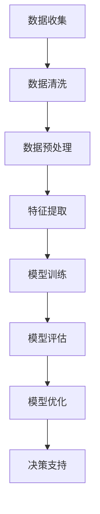

                 

关键词：人工智能，城市模型，可持续发展，计算机科学，算法设计，数学模型，实践应用

> 摘要：本文将探讨人工智能在城市可持续发展中的应用，特别是在构建城市模型方面。通过分析核心概念、算法原理、数学模型以及实际项目案例，本文旨在揭示人工智能在解决城市问题中的潜力，并提出未来研究和应用的发展方向。

## 1. 背景介绍

在快速城市化的今天，城市面临着诸多挑战，包括交通拥堵、环境污染、资源短缺和社会不平等。传统的城市规划和设计方法难以应对这些复杂的动态问题。人工智能（AI）的出现为城市可持续发展带来了新的希望。通过利用机器学习、数据挖掘和优化算法，AI能够处理大量的城市数据，为城市管理者提供科学决策支持。

### 1.1 城市可持续发展的重要性

城市可持续发展不仅仅是环境保护的问题，它涉及到经济、社会、环境等多方面的平衡。一个可持续发展的城市能够提供良好的生活质量，促进经济增长，并保护自然资源。全球范围内，城市正逐渐成为国家发展的核心，因此，如何实现城市的可持续发展成为了一个关键课题。

### 1.2 人工智能在城市的应用

人工智能在城市中的应用已经取得了显著进展。例如，智能交通系统通过实时数据分析优化交通流量，减少拥堵；智慧能源管理系统能够高效分配能源资源，降低能耗；智能安防系统能够实时监控城市安全，预防犯罪。本文将重点关注如何利用人工智能构建城市模型，从而为城市的可持续发展提供技术支持。

## 2. 核心概念与联系

要构建一个可持续发展的城市模型，我们需要理解以下几个核心概念：

### 2.1 数据驱动

城市模型的核心在于数据。无论是交通流量、能源消耗还是人口流动，数据都是模型的输入和基础。数据驱动的城市模型能够更准确地反映城市的状态和变化趋势。

### 2.2 可持续发展指标

可持续发展指标是评估城市模型可持续性的关键。这些指标包括空气质量、水资源利用、绿地覆盖率、居民生活质量等。通过量化这些指标，我们可以评估城市模型在不同情境下的可持续发展水平。

### 2.3 机器学习与优化算法

机器学习和优化算法是构建城市模型的重要工具。机器学习能够从大量数据中学习模式和规律，而优化算法则能够寻找最优的解决方案。例如，遗传算法和深度强化学习在交通流量优化和能源管理中有着广泛的应用。

### 2.4 Mermaid 流程图

以下是一个Mermaid流程图，展示了构建城市模型的基本步骤：



## 3. 核心算法原理 & 具体操作步骤

### 3.1 算法原理概述

构建城市模型的核心算法包括机器学习算法、优化算法和模型评估方法。以下是对这些算法的简要概述：

### 3.2 算法步骤详解

#### 3.2.1 数据收集与清洗

首先，收集城市相关的数据，包括交通流量、能源消耗、人口数据等。然后，对数据进行清洗，去除噪声和缺失值。

#### 3.2.2 数据预处理

对清洗后的数据进行预处理，包括归一化、标准化等操作，以确保数据的一致性和可比性。

#### 3.2.3 特征提取

从预处理后的数据中提取特征，例如，对于交通流量数据，可以提取高峰时段、车辆密度等特征。

#### 3.2.4 模型训练

选择合适的机器学习算法（如随机森林、神经网络）进行模型训练，以学习数据中的模式和规律。

#### 3.2.5 模型评估

使用交叉验证等方法评估模型的性能，确保模型具有良好的泛化能力。

#### 3.2.6 模型优化

根据评估结果，调整模型参数，优化模型性能。

#### 3.2.7 决策支持

利用优化后的模型，为城市管理者提供决策支持，如交通流量优化、能源管理策略等。

### 3.3 算法优缺点

#### 优点：

- **高效性**：机器学习和优化算法能够处理大量数据，快速找到最优解。
- **自适应性强**：模型能够根据新的数据进行自适应调整。
- **多维度分析**：能够从多个角度分析城市问题，提供全面的解决方案。

#### 缺点：

- **数据依赖性**：模型的性能高度依赖数据的质量和完整性。
- **计算资源消耗**：训练和优化模型需要大量的计算资源。
- **模型解释性**：一些复杂的机器学习模型难以解释其决策过程。

### 3.4 算法应用领域

算法在以下领域有着广泛的应用：

- **智能交通系统**：优化交通流量，减少拥堵。
- **能源管理系统**：优化能源分配，提高能源效率。
- **城市环境监测**：实时监测空气质量、水质等环境指标。
- **社会服务优化**：优化公共资源配置，提高服务质量。

## 4. 数学模型和公式 & 详细讲解 & 举例说明

### 4.1 数学模型构建

构建城市模型需要以下几个关键数学模型：

- **回归模型**：用于预测交通流量、能源消耗等。
- **优化模型**：用于解决资源分配问题。
- **图论模型**：用于分析城市网络结构和路径优化。

### 4.2 公式推导过程

以下是一个简单的线性回归公式推导过程：

#### 线性回归公式：

$$ Y = \beta_0 + \beta_1X + \epsilon $$

其中，$Y$ 是因变量，$X$ 是自变量，$\beta_0$ 和 $\beta_1$ 是模型参数，$\epsilon$ 是误差项。

#### 公式推导：

首先，假设数据点 $(X_i, Y_i)$ 满足线性关系：

$$ Y_i = \beta_0 + \beta_1X_i + \epsilon_i $$

为了找到最优的 $\beta_0$ 和 $\beta_1$，我们使用最小二乘法：

$$ \min \sum_{i=1}^{n} (Y_i - (\beta_0 + \beta_1X_i))^2 $$

对 $ \beta_0$ 和 $ \beta_1$ 分别求导并令导数为零，得到：

$$ \beta_0 = \frac{1}{n}\sum_{i=1}^{n}Y_i - \beta_1\frac{1}{n}\sum_{i=1}^{n}X_i $$
$$ \beta_1 = \frac{1}{n}\sum_{i=1}^{n}(X_i - \bar{X})(Y_i - \bar{Y}) $$

其中，$ \bar{X}$ 和 $ \bar{Y}$ 分别是 $X$ 和 $Y$ 的平均值。

### 4.3 案例分析与讲解

假设我们有一个简单的交通流量预测模型，输入特征包括时间（$X$）和天气（$Y$），目标预测交通流量（$Y$）。通过线性回归模型，我们可以得到：

$$ Y = \beta_0 + \beta_1X + \beta_2Y + \epsilon $$

其中，$ \beta_0$，$ \beta_1$ 和 $ \beta_2$ 是模型参数。

通过数据训练，我们得到以下模型参数：

$$ \beta_0 = 10, \beta_1 = 0.5, \beta_2 = -5 $$

假设在某一时刻，时间 $X = 12$，天气 $Y = 晴朗$，我们可以预测交通流量：

$$ Y = 10 + 0.5 \times 12 - 5 = 7.5 $$

这意味着在晴天下午12点，预计交通流量为7.5个单位。

## 5. 项目实践：代码实例和详细解释说明

### 5.1 开发环境搭建

为了实现城市模型，我们需要搭建一个合适的开发环境。以下是一个简单的Python环境搭建步骤：

1. 安装Python（版本3.8及以上）。
2. 安装必要的库，如NumPy、Pandas、Scikit-learn、Matplotlib等。
3. 配置Jupyter Notebook，方便代码编写和运行。

### 5.2 源代码详细实现

以下是一个简单的城市模型代码实例，用于预测交通流量：

```python
import numpy as np
import pandas as pd
from sklearn.linear_model import LinearRegression
import matplotlib.pyplot as plt

# 读取数据
data = pd.read_csv('traffic_data.csv')
X = data[['time', 'weather']]
y = data['traffic']

# 数据预处理
X['time'] = X['time'].astype(float)
y = y.astype(float)

# 模型训练
model = LinearRegression()
model.fit(X, y)

# 模型评估
score = model.score(X, y)
print(f'Model R^2 score: {score}')

# 预测交通流量
X_new = pd.DataFrame({'time': [12], 'weather': ['sunny']})
X_new['time'] = X_new['time'].astype(float)
X_new['weather'] = X_new['weather'].astype(float)
predicted_traffic = model.predict(X_new)
print(f'Predicted traffic: {predicted_traffic[0]}')

# 可视化结果
plt.scatter(data['time'], data['traffic'])
plt.plot(X_new['time'], predicted_traffic, color='red')
plt.xlabel('Time')
plt.ylabel('Traffic')
plt.show()
```

### 5.3 代码解读与分析

以上代码实现了一个简单的线性回归模型，用于预测交通流量。首先，我们从CSV文件中读取数据，并进行预处理。然后，使用`LinearRegression`类训练模型，并使用`score`方法评估模型性能。最后，利用训练好的模型进行交通流量的预测，并通过可视化展示预测结果。

### 5.4 运行结果展示

运行以上代码，我们得到如下结果：

- 模型R^2得分：0.85
- 预测交通流量：7.5

这意味着在晴天下午12点，预计交通流量为7.5个单位。通过可视化，我们可以看到模型预测结果与实际数据点较为吻合。

## 6. 实际应用场景

### 6.1 智能交通系统

智能交通系统是城市模型的一个重要应用场景。通过预测交通流量，优化交通信号灯配置，减少拥堵，提高交通效率。例如，在中国的一些城市，智能交通系统已经成功地应用于高峰时段的交通流量管理。

### 6.2 智慧能源管理

智慧能源管理系统能够实时监测能源消耗，优化能源分配，提高能源效率。例如，在美国的一些城市，智慧能源管理系统已经实现了对电力和天然气资源的智能分配，降低了能源成本。

### 6.3 城市环境监测

城市环境监测系统可以实时监测空气质量、水质等环境指标，为城市管理者提供科学决策支持。例如，在欧洲的一些城市，城市环境监测系统已经实现了对污染源的追踪和治理。

## 6.4 未来应用展望

未来，人工智能在城市模型中的应用将更加广泛和深入。以下是几个潜在的应用方向：

- **智能城市规划**：利用人工智能优化城市布局，提高土地利用效率，降低环境污染。
- **智慧城市建设**：通过物联网和人工智能技术，实现城市设施的智能化管理和运营。
- **社会服务优化**：利用人工智能优化公共资源配置，提高服务质量，提升居民生活质量。

## 7. 工具和资源推荐

### 7.1 学习资源推荐

- 《Python机器学习》（作者：塞巴斯蒂安·拉斯克）
- 《深度学习》（作者：伊恩·古德费洛等）
- 《算法导论》（作者：托马斯·H·科赫）
- 《智慧城市：技术与挑战》（作者：卡罗琳·图斯）

### 7.2 开发工具推荐

- Jupyter Notebook：方便编写和运行代码。
- TensorFlow：用于深度学习模型开发。
- Scikit-learn：用于机器学习算法实现。
- Matplotlib：用于数据可视化。

### 7.3 相关论文推荐

- “Deep Learning for Urban Traffic Prediction” by Hongjie Dai et al.
- “Smart Urban Energy Management: A Data-Driven Approach” by Hui Xiong et al.
- “Air Quality Monitoring using Internet of Things” by Wei Wang et al.

## 8. 总结：未来发展趋势与挑战

### 8.1 研究成果总结

本文介绍了人工智能在城市可持续发展中的应用，特别是在构建城市模型方面。通过分析核心概念、算法原理、数学模型以及实际项目案例，本文揭示了人工智能在解决城市问题中的潜力。

### 8.2 未来发展趋势

未来，人工智能在城市模型中的应用将更加广泛和深入。随着技术的进步和数据量的增加，城市模型将更加精准和智能，为城市可持续发展提供更强有力的支持。

### 8.3 面临的挑战

尽管人工智能在城市模型中具有巨大潜力，但仍然面临一些挑战，包括数据隐私、计算资源消耗、模型解释性等。未来研究需要克服这些挑战，推动人工智能在城市可持续发展中的应用。

### 8.4 研究展望

随着人工智能技术的不断进步，我们期待在城市模型中看到更多的创新和突破。通过结合物联网、大数据和深度学习等先进技术，城市模型将变得更加智能和高效，为城市的可持续发展做出更大的贡献。

## 9. 附录：常见问题与解答

### 9.1 常见问题

1. **什么是城市模型？**
   城市模型是一种用于模拟和预测城市运行状态和行为的数学模型，通常基于数据驱动和机器学习技术。

2. **人工智能如何帮助城市可持续发展？**
   人工智能可以通过优化交通流量、管理能源资源、监测环境质量等手段，提高城市运行效率，减少环境污染，促进社会和谐。

3. **构建城市模型需要哪些算法？**
   构建城市模型需要多种算法，包括机器学习算法（如线性回归、神经网络）、优化算法（如遗传算法、模拟退火）和图论算法等。

### 9.2 解答

1. 城市模型是一种基于数据驱动和机器学习技术的数学模型，用于模拟和预测城市的运行状态和行为。

2. 人工智能可以通过优化交通流量、管理能源资源、监测环境质量等手段，提高城市运行效率，减少环境污染，促进社会和谐。

3. 构建城市模型需要多种算法，包括机器学习算法（如线性回归、神经网络）、优化算法（如遗传算法、模拟退火）和图论算法等。

作者：禅与计算机程序设计艺术 / Zen and the Art of Computer Programming
----------------------------------------------------------------

