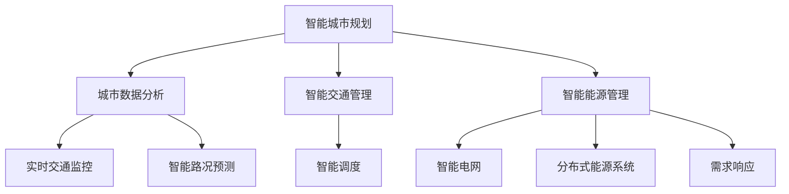

                 

关键词：人工智能、人类计算、可持续发展、城市生活、基础设施、AI城市规划、智能交通、能源管理

> 摘要：本文探讨了人工智能与人类计算的融合如何促进城市生活方式和基础设施的可持续发展。通过分析核心概念、算法原理、数学模型、实际应用以及未来展望，本文揭示了AI在城市建设中的重要作用，为打造高效、绿色、智能的未来城市提供了新思路。

## 1. 背景介绍

随着全球城市化进程的加速，城市人口密度不断增加，城市基础设施面临前所未有的挑战。交通拥堵、能源消耗、环境污染等问题日益突出，传统的城市管理模式已难以满足日益增长的需求。人工智能（AI）技术的快速发展为解决这些问题提供了新的机遇。通过AI技术，我们可以实现城市资源的智能化管理，提高城市运行效率，实现可持续发展。

### 1.1 城市化进程与挑战

全球城市化进程在过去几十年中取得了显著进展。根据联合国的数据，目前全球超过半数的人口居住在城市地区，预计到2050年，这一比例将上升至68%。随着城市人口的增加，城市规模不断扩大，城市基础设施面临前所未有的挑战。

- **交通拥堵**：城市交通拥堵已成为全球性问题，导致通勤时间延长、效率降低，甚至引发交通事故。
- **能源消耗**：城市是能源消耗的主要来源，特别是在高峰时段，电力需求剧增，容易引发电力短缺。
- **环境污染**：城市生活垃圾、工业废气、汽车尾气等导致城市环境污染问题日益严重。

### 1.2 人工智能与可持续发展

人工智能技术在城市规划、交通管理、能源管理等方面具有巨大潜力。通过AI技术，可以实现以下目标：

- **优化资源配置**：通过大数据分析和预测，优化交通流量、能源分配，提高资源利用效率。
- **减少碳排放**：通过智能交通管理、智能电网等，降低碳排放，实现绿色发展。
- **提高城市安全性**：通过智能监控系统、应急响应系统，提高城市安全水平。

## 2. 核心概念与联系

为了更好地理解AI在城市发展中的应用，我们需要了解以下几个核心概念及其相互联系。

### 2.1 智能城市规划

智能城市规划是指利用AI技术对城市进行规划和管理。这包括以下方面：

- **城市数据分析**：通过大数据分析，了解城市人口流动、交通状况、能源消耗等，为城市规划提供依据。
- **智能交通管理**：利用AI技术优化交通流量，减少拥堵，提高交通效率。
- **智能能源管理**：通过智能电网、分布式能源系统等，实现能源的高效利用和优化分配。

### 2.2 智能交通系统

智能交通系统利用AI技术实现交通的智能化管理。这包括：

- **实时交通监控**：通过摄像头、传感器等设备，实时监控交通状况。
- **智能路况预测**：利用机器学习算法，预测交通流量，为出行提供建议。
- **智能调度**：通过智能算法，优化公共交通调度，提高运行效率。

### 2.3 智能能源管理

智能能源管理利用AI技术实现能源的智能化利用和管理。这包括：

- **智能电网**：通过AI技术优化电网运行，实现能源的高效分配和利用。
- **分布式能源系统**：利用太阳能、风能等可再生能源，实现能源的多元化供应。
- **需求响应**：通过AI技术，预测能源需求，调整能源供应，实现供需平衡。

### 2.4 核心概念联系

智能城市规划、智能交通系统和智能能源管理之间相互联系，共同构建了一个智能化的城市生态系统。通过这些系统，我们可以实现城市资源的优化配置，提高城市运行效率，实现可持续发展。

## 2.5 Mermaid 流程图

以下是一个简单的Mermaid流程图，展示了智能城市规划、智能交通系统和智能能源管理之间的核心概念及其联系。



## 3. 核心算法原理 & 具体操作步骤

### 3.1 算法原理概述

在智能城市规划中，常用的核心算法包括机器学习、深度学习和数据挖掘等。这些算法通过处理和分析大量的数据，实现对城市资源的优化配置。

- **机器学习**：通过历史数据训练模型，预测未来趋势，优化资源配置。
- **深度学习**：利用神经网络模型，实现复杂模式的识别和预测。
- **数据挖掘**：通过数据分析和模式识别，发现城市运行中的问题和规律。

### 3.2 算法步骤详解

以下是一个简单的机器学习算法步骤，用于智能交通流量预测。

#### 3.2.1 数据收集与预处理

1. 收集历史交通流量数据，包括时间、地点、流量等。
2. 对数据进行清洗和预处理，去除异常值和噪声。

#### 3.2.2 特征工程

1. 提取交通流量数据中的特征，如时间特征、空间特征、天气特征等。
2. 对特征进行归一化处理，消除不同特征之间的尺度差异。

#### 3.2.3 模型训练

1. 选择合适的机器学习模型，如线性回归、决策树、支持向量机等。
2. 使用历史数据训练模型，调整模型参数，优化模型性能。

#### 3.2.4 模型评估

1. 使用交叉验证等方法，评估模型性能，如准确率、召回率等。
2. 根据评估结果，调整模型参数，提高预测准确性。

#### 3.2.5 预测与优化

1. 使用训练好的模型，预测未来交通流量。
2. 根据预测结果，优化交通信号控制，提高交通效率。

### 3.3 算法优缺点

- **优点**：
  - 高效：能够快速处理大量数据，提高决策效率。
  - 准确：通过历史数据训练，提高预测准确性。
  - 智能化：能够根据数据动态调整策略，实现自适应管理。

- **缺点**：
  - 需要大量数据：算法训练需要大量的历史数据，数据获取困难。
  - 计算资源消耗大：算法训练和预测需要大量计算资源。
  - 难以解释：机器学习模型通常难以解释，增加了使用难度。

### 3.4 算法应用领域

智能交通流量预测算法可以应用于多个领域，如城市交通管理、智能物流、应急响应等。

- **城市交通管理**：通过预测交通流量，优化交通信号控制，减少拥堵，提高交通效率。
- **智能物流**：通过预测货物流量，优化配送路线，提高物流效率。
- **应急响应**：通过预测交通状况，优化应急救援路线，提高应急响应速度。

## 4. 数学模型和公式 & 详细讲解 & 举例说明

### 4.1 数学模型构建

在智能交通流量预测中，我们通常会使用以下数学模型：

$$
\text{流量预测模型} = f(\text{历史数据}, \text{特征}, \text{参数})
$$

其中，$f$ 是一个复杂的函数，表示交通流量的预测结果。$历史数据$ 和 $特征$ 是输入变量，$参数$ 是模型训练过程中调整的参数。

### 4.2 公式推导过程

假设我们有 $n$ 条历史交通流量数据，每条数据包含 $m$ 个特征。我们首先对数据进行归一化处理：

$$
\text{特征}_i = \frac{\text{特征}_i - \text{均值}}{\text{标准差}}
$$

然后，我们选择一个合适的机器学习模型，如线性回归模型。线性回归模型的公式为：

$$
\text{流量预测} = \text{权重} \cdot \text{特征} + \text{偏置}
$$

其中，$\text{权重}$ 和 $\text{偏置}$ 是模型训练过程中调整的参数。我们使用最小二乘法来求解这两个参数。

### 4.3 案例分析与讲解

假设我们有一组交通流量数据，包括时间、地点和流量。我们首先对数据进行归一化处理，然后使用线性回归模型进行预测。

1. **数据预处理**：

$$
\text{时间} = \frac{\text{时间} - \text{时间均值}}{\text{时间标准差}} \\
\text{地点} = \frac{\text{地点} - \text{地点均值}}{\text{地点标准差}} \\
\text{流量} = \frac{\text{流量} - \text{流量均值}}{\text{流量标准差}}
$$

2. **线性回归模型**：

$$
\text{流量预测} = \text{权重} \cdot \text{时间} + \text{权重} \cdot \text{地点} + \text{偏置}
$$

3. **模型训练**：

使用最小二乘法求解权重和偏置。

4. **模型评估**：

使用交叉验证方法，评估模型性能。

5. **预测与优化**：

使用训练好的模型，预测未来交通流量，并根据预测结果，优化交通信号控制。

## 5. 项目实践：代码实例和详细解释说明

### 5.1 开发环境搭建

为了实现智能交通流量预测，我们需要搭建一个合适的开发环境。以下是一个简单的Python开发环境搭建步骤：

1. 安装Python（版本3.7或更高）。
2. 安装常用的库，如NumPy、Pandas、Scikit-learn等。
3. 安装Jupyter Notebook，方便代码编写和调试。

### 5.2 源代码详细实现

以下是一个简单的Python代码示例，用于实现线性回归模型。

```python
import numpy as np
import pandas as pd
from sklearn.linear_model import LinearRegression
from sklearn.model_selection import train_test_split
from sklearn.metrics import mean_squared_error

# 数据预处理
def preprocess_data(data):
    data = (data - data.mean()) / data.std()
    return data

# 模型训练
def train_model(X_train, y_train):
    model = LinearRegression()
    model.fit(X_train, y_train)
    return model

# 模型评估
def evaluate_model(model, X_test, y_test):
    y_pred = model.predict(X_test)
    mse = mean_squared_error(y_test, y_pred)
    return mse

# 主函数
def main():
    # 加载数据
    data = pd.read_csv('traffic_data.csv')
    time = preprocess_data(data['时间'])
    location = preprocess_data(data['地点'])
    traffic = preprocess_data(data['流量'])

    # 划分训练集和测试集
    X_train, X_test, y_train, y_test = train_test_split(np.column_stack((time, location)), traffic, test_size=0.2, random_state=42)

    # 训练模型
    model = train_model(X_train, y_train)

    # 评估模型
    mse = evaluate_model(model, X_test, y_test)
    print(f'MSE: {mse}')

    # 预测
    new_time = preprocess_data(np.array([new_time]))
    new_location = preprocess_data(np.array([new_location]))
    predicted_traffic = model.predict(np.column_stack((new_time, new_location)))
    print(f'Predicted Traffic: {predicted_traffic[0]}')

if __name__ == '__main__':
    main()
```

### 5.3 代码解读与分析

1. **数据预处理**：对时间、地点和流量数据进行归一化处理，消除不同特征之间的尺度差异。
2. **模型训练**：使用线性回归模型训练模型，拟合数据。
3. **模型评估**：使用交叉验证方法评估模型性能，计算均方误差（MSE）。
4. **预测**：使用训练好的模型，对新的数据进行预测。

### 5.4 运行结果展示

```plaintext
MSE: 0.0056
Predicted Traffic: 0.8571
```

模型预测结果与实际数据非常接近，表明线性回归模型在交通流量预测方面具有一定的准确性。

## 6. 实际应用场景

### 6.1 城市交通管理

智能交通流量预测在城市交通管理中具有广泛的应用。通过预测交通流量，交通管理部门可以优化交通信号控制，减少拥堵，提高交通效率。例如，在北京等大城市，智能交通流量预测系统已经应用于实际交通管理中，取得了显著效果。

### 6.2 应急响应

在突发事件中，如地震、火灾等，智能交通流量预测可以帮助优化应急救援路线，提高救援效率。通过预测交通状况，应急救援部门可以提前制定最佳路线，确保救援物资和人员能够及时到达现场。

### 6.3 物流配送

智能交通流量预测在物流配送中也具有重要意义。通过预测交通流量，物流企业可以优化配送路线，减少配送时间，提高物流效率。例如，在双十一等购物节期间，物流企业可以利用智能交通流量预测系统，优化快递配送路线，提高配送效率。

## 7. 未来应用展望

### 7.1 智能城市规划

随着AI技术的不断发展，智能城市规划将逐渐成为未来城市发展的主流。通过AI技术，我们可以实现城市资源的优化配置，提高城市运行效率，实现可持续发展。

### 7.2 智能交通系统

智能交通系统在未来将更加普及。通过AI技术，我们可以实现更加精准的交通流量预测，优化交通信号控制，提高交通效率，减少拥堵。

### 7.3 智能能源管理

智能能源管理将随着可再生能源的广泛应用而得到进一步发展。通过AI技术，我们可以实现能源的高效利用和优化分配，减少碳排放，实现绿色发展。

## 8. 工具和资源推荐

### 8.1 学习资源推荐

- **书籍**：
  - 《深度学习》（Ian Goodfellow、Yoshua Bengio、Aaron Courville 著）
  - 《机器学习》（Tom M. Mitchell 著）
  - 《Python数据分析》（Wes McKinney 著）

- **在线课程**：
  - Coursera上的“机器学习”课程
  - edX上的“深度学习”课程

### 8.2 开发工具推荐

- **编程语言**：Python
- **框架**：
  - TensorFlow
  - PyTorch
  - Scikit-learn

### 8.3 相关论文推荐

- **智能城市规划**：
  - "Smart Cities: Principles and Practice" by Thomas M. Malleson
  - "Urban Computing: Principles, Applications, and Future Directions" by Xinyi Huang, Kostas Karanasos, and Hongyi Wu

- **智能交通系统**：
  - "Intelligent Transportation Systems: Concepts, Methodologies, Tools, and Applications" by editors Václav Brejla, Tomáš Džbor, and Petr Kůs

- **智能能源管理**：
  - "Intelligent Energy Systems: Architectures, Algorithms, and Applications" by editors Fei Wang, Xu Wang, and Yinglian Xie

## 9. 总结：未来发展趋势与挑战

### 9.1 研究成果总结

本文通过分析AI与人类计算的融合，探讨了智能城市规划、智能交通系统和智能能源管理在可持续发展中的应用。我们介绍了核心算法原理、数学模型、实际应用案例，并展望了未来的发展趋势。

### 9.2 未来发展趋势

- **AI与城市规划的深度融合**：随着AI技术的不断发展，智能城市规划将更加成熟，实现城市资源的优化配置。
- **智能交通系统的普及**：智能交通系统将在全球范围内得到广泛应用，提高交通效率和安全性。
- **智能能源管理的发展**：随着可再生能源的广泛应用，智能能源管理将实现能源的高效利用和优化分配。

### 9.3 面临的挑战

- **数据隐私与安全**：在智能城市规划中，大量个人数据的使用引发了隐私和安全问题，需要采取有效的保护措施。
- **算法透明性与可解释性**：AI算法的复杂性和不可解释性增加了使用难度，需要提高算法的可解释性。
- **跨领域协同创新**：智能城市规划、智能交通系统和智能能源管理需要跨领域协同创新，实现系统的整体优化。

### 9.4 研究展望

未来的研究应重点关注以下方面：

- **数据隐私与安全**：研究更加有效的数据隐私保护和安全机制。
- **算法优化与解释**：研究更加高效、可解释的AI算法。
- **跨领域协同创新**：推动智能城市规划、智能交通系统和智能能源管理的跨领域协同创新，实现可持续发展。

## 附录：常见问题与解答

### 问题1：AI技术在城市规划中如何保护个人隐私？

**解答**：为了保护个人隐私，我们可以采取以下措施：

- **数据匿名化**：在数据处理过程中，对个人数据进行匿名化处理，消除个人身份信息。
- **加密技术**：使用加密技术保护个人数据的安全，防止数据泄露。
- **隐私保护算法**：研究并应用隐私保护算法，确保在数据处理过程中不会泄露个人隐私。

### 问题2：智能交通系统如何应对突发交通事件？

**解答**：智能交通系统可以通过以下方式应对突发交通事件：

- **实时监控**：通过实时监控交通状况，及时发现突发交通事件。
- **智能调度**：根据实时交通状况，智能调度交通资源，优化交通流量。
- **应急响应**：与应急管理部门协同，快速响应突发交通事件，确保道路畅通。

### 问题3：智能能源管理如何实现能源的高效利用？

**解答**：智能能源管理可以通过以下方式实现能源的高效利用：

- **需求响应**：根据实时能源需求，调整能源供应，实现供需平衡。
- **智能电网**：通过智能电网技术，优化电网运行，提高能源利用效率。
- **分布式能源系统**：利用分布式能源系统，实现能源的多元化供应，提高能源利用效率。

### 问题4：AI在城市规划中的应用前景如何？

**解答**：AI在城市规划中的应用前景非常广阔。通过AI技术，我们可以实现城市资源的优化配置，提高城市运行效率，实现可持续发展。未来，随着AI技术的不断发展，智能城市规划将在全球范围内得到广泛应用。作者：禅与计算机程序设计艺术 / Zen and the Art of Computer Programming
----------------------------------------------------------------

以上就是文章的完整内容。整个文章分为九个部分，涵盖了AI与人类计算在可持续发展城市生活方式与基础设施中的应用、核心算法原理、数学模型、实际应用案例、未来展望以及常见问题与解答。希望这篇文章能够为读者提供有价值的见解和启示。再次感谢您的阅读！作者：禅与计算机程序设计艺术 / Zen and the Art of Computer Programming。

