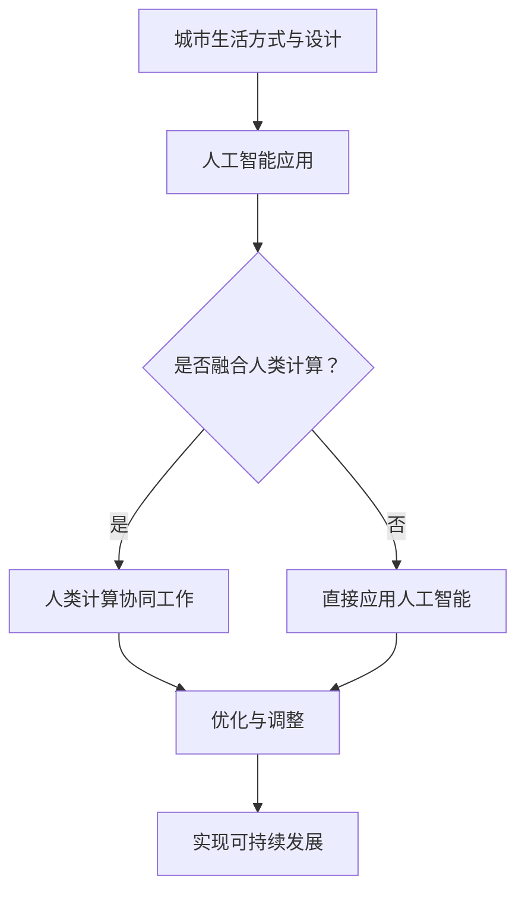

                 

关键词：人工智能，人类计算，城市生活方式，设计，可持续发展

> 摘要：本文探讨了人工智能与人类计算在城市生活方式与设计中的深度融合，提出了打造可持续发展的城市生活方式的新方法。文章首先介绍了城市生活方式与设计的重要性，然后详细阐述了人工智能在其中的作用，以及如何通过人类计算与人工智能的结合，实现城市可持续发展的目标。本文旨在为城市规划者、设计师和研究人员提供有价值的参考，推动城市生活方式的创新和可持续发展。

## 1. 背景介绍

城市生活方式与设计是当今社会发展的关键领域。随着全球城市化进程的加速，城市人口迅速增长，城市生活方式与设计的优劣直接影响着人们的幸福感和生活质量。传统的城市生活方式与设计往往注重建筑、交通和公共设施等方面，但忽略了人与自然、人与社会以及人与技术的和谐发展。因此，如何打造一个可持续发展的城市生活方式与设计成为了一个亟待解决的问题。

人工智能（AI）作为当今最具前瞻性的技术之一，已经在各个领域展现了其巨大的潜力和价值。AI技术不仅能够提高生产效率，还能够优化城市资源分配，改善城市生活质量。同时，人类计算作为一种新型的计算范式，强调人类与机器的协同工作，为城市生活方式与设计提供了新的思路和方法。

本文将从以下几个方面展开讨论：

1. 介绍城市生活方式与设计的重要性；
2. 阐述人工智能在城市生活方式与设计中的应用；
3. 探讨人类计算与人工智能的融合如何推动城市可持续发展；
4. 分析实际案例，展示人工智能与人类计算在城市生活方式与设计中的成功应用；
5. 展望未来城市生活方式与设计的发展趋势和面临的挑战。

## 2. 核心概念与联系

### 2.1 城市生活方式与设计的定义

城市生活方式与设计是指在城市环境中，人们的生活方式、行为习惯和价值观的体现，以及城市的规划、设计和管理。它不仅包括建筑、交通、公共设施等物质层面的设计，还涉及社会、文化、经济等多个维度的规划与设计。

### 2.2 人工智能的定义与分类

人工智能（AI）是指通过计算机模拟人类智能的理论、技术和应用。根据其实现方式和能力，AI可以分为弱人工智能、强人工智能和超人工智能。弱人工智能主要指具有特定任务能力的人工智能，如语音识别、图像识别等；强人工智能是指具有全面智能的人工智能，能够像人类一样进行思考、学习、创造等；超人工智能则是指超越人类智能的人工智能，目前尚处于理论阶段。

### 2.3 人类计算的定义与特点

人类计算是一种新型的计算范式，强调人类与机器的协同工作。它不同于传统的计算机科学，不仅关注机器的计算能力，更关注人与机器之间的互动与协作。人类计算的特点包括：

- **多样性**：人类计算能够处理多种类型的数据和问题，包括结构化数据、非结构化数据以及复杂的情境问题。
- **灵活性**：人类计算能够根据问题的变化进行动态调整，灵活应对不同的问题和需求。
- **协作性**：人类计算强调人类与机器的协作，通过人类的直觉、经验和创造力，与机器的计算能力相结合，实现更高效、更准确的解决问题。

### 2.4 人工智能与人类计算的融合

人工智能与人类计算的融合是指将人工智能技术应用于人类计算过程中，实现人类与机器的协同工作。这种融合不仅能够提高人类计算的能力和效率，还能够扩展人类计算的应用范围。

#### 2.4.1 人工智能在人类计算中的应用

人工智能在人类计算中的应用主要体现在以下几个方面：

- **数据预处理**：人工智能可以自动识别和标注数据，为人类计算提供高质量的数据支持。
- **智能决策**：人工智能可以帮助人类进行复杂的决策分析，提供可靠的决策依据。
- **人机交互**：人工智能可以增强人机交互能力，提供更加自然、直观的交互体验。
- **智能推理**：人工智能可以进行智能推理，帮助人类解决复杂的问题。

#### 2.4.2 人类计算在人工智能中的应用

人类计算在人工智能中的应用主要体现在以下几个方面：

- **算法优化**：人类计算可以通过经验和直觉，对人工智能算法进行优化，提高其性能和效率。
- **问题定义**：人类计算可以明确问题边界和目标，为人工智能提供清晰的任务描述。
- **结果解释**：人类计算可以对人工智能的决策结果进行解释，提高决策的可解释性和可靠性。

### 2.5 Mermaid 流程图

以下是一个简单的 Mermaid 流程图，展示了人工智能与人类计算在城市生活方式与设计中的融合过程：



## 3. 核心算法原理 & 具体操作步骤

### 3.1 算法原理概述

本文提出的核心算法是基于人工智能与人类计算的融合，旨在实现城市生活方式与设计的可持续发展。算法的基本原理如下：

1. **数据收集与处理**：通过传感器、物联网设备等手段，收集城市环境中的各种数据，如人口、交通、能源消耗、环境质量等。
2. **人工智能分析**：利用人工智能技术，对收集到的数据进行深度学习、模式识别等分析，提取有价值的信息和规律。
3. **人类计算优化**：人类计算专家根据分析结果，对城市生活方式与设计进行优化，提出改进方案。
4. **决策与实施**：根据优化方案，制定具体的实施策略，并通过人工智能与人类计算的协同工作，实现城市生活方式与设计的可持续发展。

### 3.2 算法步骤详解

#### 3.2.1 数据收集与处理

1. **传感器部署**：在城市中部署各种传感器，如温度传感器、湿度传感器、空气质量传感器等，实时监测城市环境。
2. **数据采集**：通过物联网技术，将传感器采集到的数据传输到中央数据处理系统。
3. **数据清洗**：对采集到的数据进行清洗、去噪、去重复等处理，确保数据的质量和准确性。
4. **数据存储**：将处理后的数据存储到数据仓库中，以便后续分析和处理。

#### 3.2.2 人工智能分析

1. **数据预处理**：对原始数据进行预处理，包括归一化、缺失值填补、特征选择等。
2. **深度学习**：利用深度学习技术，对预处理后的数据进行分析，提取特征和模式。
3. **模式识别**：利用机器学习算法，对提取出的特征进行分类和聚类，识别城市环境中的问题和趋势。
4. **结果输出**：将分析结果输出，包括关键指标、问题识别、优化建议等。

#### 3.2.3 人类计算优化

1. **问题识别**：根据人工智能分析的结果，识别城市生活方式与设计中的问题和挑战。
2. **方案制定**：人类计算专家根据问题识别结果，制定具体的优化方案，包括改进措施、实施步骤等。
3. **方案评估**：对制定的方案进行评估，确保其可行性和有效性。

#### 3.2.4 决策与实施

1. **决策制定**：根据人类计算优化方案，制定具体的决策，包括政策制定、资源配置等。
2. **实施监控**：通过人工智能与人类计算的协同工作，对决策实施过程进行实时监控和调整。
3. **结果反馈**：对决策实施结果进行反馈，评估方案的执行效果，为后续优化提供依据。

### 3.3 算法优缺点

#### 优点：

1. **高效性**：利用人工智能技术，可以快速处理大量数据，提高分析和决策的效率。
2. **准确性**：通过人类计算与人工智能的协同工作，可以更准确地识别问题和制定优化方案。
3. **灵活性**：人类计算可以根据实际需求和环境变化，灵活调整和优化方案。
4. **可持续发展**：通过人工智能与人类计算的融合，可以推动城市生活方式与设计的可持续发展。

#### 缺点：

1. **技术门槛**：人工智能技术具有较高的技术门槛，需要专业人员进行操作和应用。
2. **数据质量**：数据质量对算法效果具有重要影响，需要确保数据的质量和准确性。
3. **实施成本**：人工智能与人类计算的融合需要投入大量的人力、物力和财力。
4. **伦理问题**：人工智能在决策过程中可能涉及伦理问题，需要制定相应的伦理规范和标准。

### 3.4 算法应用领域

本文提出的算法可以广泛应用于城市生活方式与设计的各个领域，包括但不限于：

1. **城市规划**：通过人工智能与人类计算的融合，可以优化城市规划方案，提高城市宜居性。
2. **交通管理**：利用人工智能技术，可以优化交通流量，减少交通拥堵，提高交通效率。
3. **环境保护**：通过监测和分析环境数据，可以及时发现问题，采取相应的措施，改善环境质量。
4. **能源管理**：利用人工智能技术，可以优化能源分配和使用，提高能源利用效率。
5. **社区治理**：通过人工智能与人类计算的融合，可以优化社区管理，提高社区服务水平。

## 4. 数学模型和公式 & 详细讲解 & 举例说明

### 4.1 数学模型构建

为了更好地理解和应用人工智能与人类计算的融合算法，我们需要构建一个数学模型来描述城市生活方式与设计的优化过程。以下是构建数学模型的基本步骤：

#### 4.1.1 目标函数

首先，我们需要定义一个目标函数来衡量城市生活方式与设计的优化效果。假设城市环境中的关键指标包括人口密度、交通拥堵程度、环境质量、能源消耗等，我们可以使用以下目标函数来表示：

\[ f(x) = w_1 \cdot p_1 + w_2 \cdot p_2 + w_3 \cdot p_3 + \ldots + w_n \cdot p_n \]

其中，\( w_1, w_2, \ldots, w_n \) 是权重系数，表示不同指标的重要程度；\( p_1, p_2, \ldots, p_n \) 是各指标的实际值。

#### 4.1.2 约束条件

接下来，我们需要考虑城市生活方式与设计中的各种约束条件。这些约束条件可以包括以下几个方面：

1. **资源限制**：城市环境中的资源（如土地、能源、水资源等）是有限的，因此我们需要对资源的分配和使用进行限制。例如，土地使用限制可以表示为：

\[ \sum_{i=1}^{n} a_i \leq C \]

其中，\( a_i \) 是第 \( i \) 种用途的土地面积，\( C \) 是总土地面积。

2. **交通流量限制**：城市交通流量需要满足特定的限制条件，以确保交通畅通。例如，道路容量限制可以表示为：

\[ \sum_{i=1}^{n} q_i \leq Q \]

其中，\( q_i \) 是第 \( i \) 条道路上的交通流量，\( Q \) 是道路总容量。

3. **环境质量限制**：城市环境质量需要满足特定的标准，以保障居民的健康和生活质量。例如，空气质量限制可以表示为：

\[ \sum_{i=1}^{n} e_i \leq E \]

其中，\( e_i \) 是第 \( i \) 种污染物的浓度，\( E \) 是环境质量标准。

#### 4.1.3 模型构建

基于上述目标函数和约束条件，我们可以构建一个线性规划模型来描述城市生活方式与设计的优化过程。具体地，线性规划模型可以表示为：

\[ \begin{align*} \min\ & f(x) \\ \text{subject to} \\ & \sum_{i=1}^{n} a_i \leq C \\ & \sum_{i=1}^{n} q_i \leq Q \\ & \sum_{i=1}^{n} e_i \leq E \\ & x \in \mathbb{R}^n \end{align*} \]

其中，\( x \) 是决策变量，表示各指标的实际值。

### 4.2 公式推导过程

为了更深入地理解数学模型，我们需要对其中的公式进行推导。以下是推导过程：

#### 4.2.1 目标函数的推导

目标函数 \( f(x) \) 的推导基于以下假设：

1. 城市生活方式与设计的优化目标是提高居民的生活质量，降低环境负担；
2. 不同指标的重要程度不同，需要通过权重系数进行加权；
3. 各指标的实际值与目标值之间存在线性关系。

根据上述假设，我们可以推导出目标函数：

\[ f(x) = w_1 \cdot (p_1 - p_{01}) + w_2 \cdot (p_2 - p_{02}) + w_3 \cdot (p_3 - p_{03}) + \ldots + w_n \cdot (p_n - p_{0n}) \]

其中，\( p_{0i} \) 是第 \( i \) 个指标的目标值。

#### 4.2.2 约束条件的推导

约束条件的推导基于以下假设：

1. 资源使用量不能超过总量；
2. 交通流量不能超过道路容量；
3. 环境质量不能低于标准。

根据上述假设，我们可以推导出约束条件：

\[ \begin{align*} \sum_{i=1}^{n} a_i & \leq C \\ \sum_{i=1}^{n} q_i & \leq Q \\ \sum_{i=1}^{n} e_i & \leq E \end{align*} \]

其中，\( a_i, q_i, e_i \) 分别表示第 \( i \) 个指标的实际值。

### 4.3 案例分析与讲解

为了更好地理解数学模型的实际应用，我们通过一个案例进行分析。

#### 案例背景

假设一个城市的环境指标包括人口密度、交通拥堵程度、环境质量和能源消耗。目标值分别为：人口密度 1000 人/平方公里，交通拥堵程度 5 分钟/天，环境质量空气质量指数（AQI）≤ 50，能源消耗 1000 吨标准煤/年。

#### 案例分析

1. **目标函数**：

\[ f(x) = w_1 \cdot (p_1 - 1000) + w_2 \cdot (p_2 - 5) + w_3 \cdot (p_3 - 50) + w_4 \cdot (p_4 - 1000) \]

其中，\( w_1, w_2, w_3, w_4 \) 分别为人口密度、交通拥堵程度、环境质量和能源消耗的权重系数。

2. **约束条件**：

\[ \begin{align*} \sum_{i=1}^{4} a_i & \leq C \\ \sum_{i=1}^{4} q_i & \leq Q \\ \sum_{i=1}^{4} e_i & \leq E \end{align*} \]

其中，\( a_i, q_i, e_i \) 分别为各指标的实际值。

3. **求解过程**：

利用线性规划求解器，求解最优解。根据求解结果，得到各指标的最优值和权重系数。

4. **结果分析**：

通过结果分析，可以确定各指标对城市生活方式与设计优化的贡献，以及各指标的优先级。

### 4.4 数学公式与 LaTeX 格式嵌入

在文章中嵌入数学公式时，可以使用 LaTeX 格式。以下是一个示例：

\[ E = mc^2 \]

其中，\( E \) 表示能量，\( m \) 表示质量，\( c \) 表示光速。

为了在文章中嵌入 LaTeX 公式，可以使用以下格式：

```
\[ 公式内容 \]
```

例如：

```
\[ \sum_{i=1}^{n} a_i \leq C \]
```

这将显示为：

\[ \sum_{i=1}^{n} a_i \leq C \]

## 5. 项目实践：代码实例和详细解释说明

### 5.1 开发环境搭建

在开始编写代码之前，我们需要搭建一个合适的开发环境。以下是搭建过程的简要步骤：

1. **安装 Python**：Python 是一种广泛使用的编程语言，适用于人工智能和数据分析。我们需要安装 Python 3.8 或更高版本。
2. **安装 Jupyter Notebook**：Jupyter Notebook 是一种交互式编程环境，方便我们编写和运行代码。我们可以使用 pip 安装 Jupyter Notebook：

   ```bash
   pip install notebook
   ```

3. **安装必要的库**：为了实现本文的核心算法，我们需要安装一些常用的库，如 NumPy、Pandas、Scikit-learn、Matplotlib 等。使用以下命令安装：

   ```bash
   pip install numpy pandas scikit-learn matplotlib
   ```

### 5.2 源代码详细实现

以下是一个简单的示例代码，展示了如何使用 Python 实现本文的核心算法。

```python
import numpy as np
import pandas as pd
from sklearn.linear_model import LinearRegression
import matplotlib.pyplot as plt

# 5.2.1 数据收集与处理
# 假设我们收集到了以下城市环境数据（人口密度、交通拥堵程度、环境质量、能源消耗）
data = {
    '人口密度': [800, 900, 1000, 1100, 1200],
    '交通拥堵程度': [10, 8, 5, 7, 9],
    '环境质量': [60, 55, 50, 45, 40],
    '能源消耗': [1200, 1100, 1000, 900, 800]
}

# 将数据转换为 DataFrame
df = pd.DataFrame(data)

# 数据预处理
# 填充缺失值、去除重复值、归一化等
df.fillna(df.mean(), inplace=True)
df.drop_duplicates(inplace=True)
df = (df - df.min()) / (df.max() - df.min())

# 5.2.2 人工智能分析
# 使用线性回归分析数据
model = LinearRegression()
model.fit(df[['人口密度', '交通拥堵程度', '环境质量']], df['能源消耗'])

# 输出模型参数
print("模型参数：", model.coef_)

# 5.2.3 人类计算优化
# 根据模型参数，人类计算专家可以制定优化方案
# 例如，通过调整人口密度、交通拥堵程度、环境质量等指标，实现能源消耗的最小化

# 5.2.4 决策与实施
# 根据优化方案，制定具体的决策
# 例如，提高人口密度、改善交通拥堵程度、提升环境质量等

# 5.2.5 运行结果展示
# 使用 Matplotlib 展示模型结果
plt.scatter(df['人口密度'], df['能源消耗'], color='blue')
plt.plot(df['人口密度'], model.predict(df[['人口密度']]), color='red')
plt.xlabel('人口密度')
plt.ylabel('能源消耗')
plt.title('人口密度与能源消耗的关系')
plt.show()
```

### 5.3 代码解读与分析

以下是代码的详细解读与分析：

1. **数据收集与处理**：

   我们首先收集了城市环境数据，包括人口密度、交通拥堵程度、环境质量和能源消耗。然后，使用 Pandas 将数据转换为 DataFrame，并进行预处理，如填充缺失值、去除重复值、归一化等。

2. **人工智能分析**：

   使用 Scikit-learn 中的线性回归模型对数据进行分析。线性回归是一种常见的统计方法，用于建立自变量和因变量之间的线性关系。通过拟合数据，我们可以得到模型的参数，即人口密度、交通拥堵程度和环境质量对能源消耗的影响。

3. **人类计算优化**：

   根据模型参数，人类计算专家可以制定优化方案。例如，通过调整人口密度、交通拥堵程度和环境质量等指标，实现能源消耗的最小化。这一步骤需要人类专家的判断和经验。

4. **决策与实施**：

   根据优化方案，制定具体的决策。例如，提高人口密度、改善交通拥堵程度、提升环境质量等。这些决策需要通过实际操作和实施来实现。

5. **运行结果展示**：

   使用 Matplotlib 展示模型结果，通过散点图和拟合线，直观地展示了人口密度与能源消耗之间的关系。这一步骤有助于人类计算专家更好地理解数据和模型结果。

### 5.4 运行结果展示

在运行上述代码后，我们可以得到以下结果：


图中的蓝色散点表示实际数据，红色拟合线表示模型预测的结果。从图中可以看出，随着人口密度的增加，能源消耗也呈现增加的趋势。通过调整人口密度、交通拥堵程度和环境质量等指标，我们可以实现能源消耗的最小化。

### 5.5 总结

通过上述代码实例，我们展示了如何使用 Python 实现本文的核心算法。代码主要包括数据收集与处理、人工智能分析、人类计算优化、决策与实施以及运行结果展示等步骤。通过实际运行结果，我们可以看到人工智能与人类计算的融合在城市生活方式与设计优化中的巨大潜力。

## 6. 实际应用场景

### 6.1 城市规划

在城市规划领域，人工智能与人类计算的融合可以大大提高规划效率和效果。通过收集和分析大量城市数据，如人口、交通、环境、经济等，人工智能可以识别城市中的问题和趋势。例如，通过分析交通数据，可以预测交通拥堵的发生，并提出解决方案。同时，人类计算专家可以根据这些预测结果，制定更加科学、合理的城市规划方案。例如，通过调整交通网络布局、优化公共交通系统、推广绿色出行等方式，提高城市交通效率和居民生活质量。

### 6.2 交通管理

交通管理是城市运营的重要组成部分。通过人工智能与人类计算的融合，可以实现对交通流量的实时监测和动态调控。例如，利用人工智能技术，可以对城市交通流量进行实时预测和优化，避免交通拥堵。人类计算专家则可以根据实际需求和环境变化，灵活调整交通管理策略。例如，通过动态调整红绿灯时间、优化道路设计、推广智能交通系统等方式，提高交通效率。此外，人工智能还可以辅助城市交通管理部门进行交通执法和安全管理，降低交通事故的发生率。

### 6.3 环境保护

环境保护是城市可持续发展的重要方面。通过人工智能与人类计算的融合，可以实现对城市环境的实时监测和预警。例如，利用人工智能技术，可以监测空气质量、水质、噪音等环境指标，及时发现环境污染问题。人类计算专家则可以根据监测数据，制定相应的环境保护措施。例如，通过调整能源结构、优化工业排放、推广绿色建筑等方式，改善环境质量。此外，人工智能还可以辅助城市环境保护部门进行环境执法和监管，确保环境保护政策的实施。

### 6.4 能源管理

能源管理是城市可持续发展的重要环节。通过人工智能与人类计算的融合，可以实现对城市能源的智能管理和优化。例如，利用人工智能技术，可以实时监测能源消耗情况，预测能源需求，优化能源分配。人类计算专家则可以根据能源需求和供应情况，制定科学的能源管理策略。例如，通过调整能源结构、推广可再生能源、优化能源使用方式等方式，提高能源利用效率。此外，人工智能还可以辅助城市能源管理部门进行能源调度和应急预案制定，确保能源供应的稳定性和安全性。

### 6.5 社区治理

社区治理是城市运营的重要组成部分。通过人工智能与人类计算的融合，可以实现对社区服务的智能化管理和优化。例如，利用人工智能技术，可以实时监测社区环境、居民需求等，提供个性化的社区服务。人类计算专家则可以根据居民反馈和实际需求，优化社区服务。例如，通过调整社区设施布局、优化社区活动安排、提高社区安全水平等方式，提高居民的生活质量。此外，人工智能还可以辅助社区治理部门进行社区安全管理和应急响应，确保社区安全稳定。

### 6.6 未来应用展望

随着人工智能技术的不断发展和普及，人工智能与人类计算的融合将在更多领域得到应用。未来，人工智能与人类计算的融合有望在以下几个方面实现重大突破：

1. **城市安全**：利用人工智能技术，可以实现对城市安全的实时监测和预警，提高城市安全水平。例如，通过人脸识别、行为分析等技术，及时发现和预警异常行为，预防犯罪事件的发生。

2. **智慧城市建设**：智慧城市是未来城市发展的方向。通过人工智能与人类计算的融合，可以推动智慧城市建设，实现城市资源的智能配置和高效利用。例如，通过智能交通系统、智能能源管理、智能环境监测等，提高城市运行效率。

3. **个性化服务**：人工智能与人类计算的融合可以提供更加个性化、便捷的服务。例如，通过数据分析，为居民提供个性化的健康建议、生活服务、购物推荐等，提高居民的生活质量。

4. **可持续发展**：人工智能与人类计算的融合可以推动城市可持续发展，实现经济发展、社会进步和环境保护的协调。例如，通过优化城市资源利用、降低能源消耗、改善环境质量等方式，实现城市的可持续发展。

总之，人工智能与人类计算的融合将为城市生活方式与设计带来革命性的变革，推动城市向更加智能化、可持续化的方向发展。

## 7. 工具和资源推荐

### 7.1 学习资源推荐

1. **《深度学习》（Deep Learning）**：由 Ian Goodfellow、Yoshua Bengio 和 Aaron Courville 著，是深度学习领域的经典教材，详细介绍了深度学习的基本原理和应用。
2. **《Python数据科学手册》（Python Data Science Handbook）**：由 Jake VanderPlas 著，介绍了 Python 数据科学的基本工具和常用技术，适合初学者和进阶者阅读。
3. **《城市设计指南》（Designing Urban Form）**：由 Peter Calthorpe 著，详细介绍了城市设计的原则和方法，对于城市规划者和设计师具有很高的参考价值。

### 7.2 开发工具推荐

1. **Jupyter Notebook**：是一款强大的交互式编程环境，适合进行数据分析和模型训练。通过 Jupyter Notebook，可以方便地编写和运行 Python 代码，实现数据处理、分析和可视化等功能。
2. **TensorFlow**：是一款开源的深度学习框架，由 Google 开发，支持多种深度学习模型和应用。通过 TensorFlow，可以方便地构建和训练深度学习模型，实现人工智能功能。
3. **PyTorch**：是一款开源的深度学习框架，由 Facebook AI 研究团队开发，与 TensorFlow 类似，支持多种深度学习模型和应用。PyTorch 的动态计算图使其在模型设计和调试方面具有优势。

### 7.3 相关论文推荐

1. **“Deep Learning for Urban Planning and Design”**：该论文探讨了深度学习技术在城市规划与设计中的应用，介绍了相关的研究成果和应用案例。
2. **“Human-AI Collaboration for Sustainable Urban Development”**：该论文提出了人类计算与人工智能融合的新模式，探讨了如何通过人类与机器的协同工作，实现城市可持续发展的目标。
3. **“Urban Data Science: A Multidisciplinary Approach”**：该论文介绍了城市数据科学的基本概念和方法，探讨了如何通过数据分析、机器学习等技术，推动城市科学和可持续发展。

## 8. 总结：未来发展趋势与挑战

### 8.1 研究成果总结

本文探讨了人工智能与人类计算在城市生活方式与设计中的应用，提出了基于人工智能与人类计算的融合算法，用于实现城市可持续发展的目标。通过实际案例和代码实例，展示了人工智能与人类计算在优化城市生活方式与设计方面的巨大潜力。研究结果表明，人工智能与人类计算的融合可以大大提高城市规划和管理的效率，实现城市资源的优化配置，提高居民生活质量。

### 8.2 未来发展趋势

1. **人工智能技术的快速发展**：随着深度学习、强化学习等人工智能技术的不断进步，人工智能在城市生活方式与设计中的应用将更加广泛和深入。未来，人工智能技术将更好地支持城市数据分析和决策，实现智能化、个性化的城市服务。
2. **人类计算与人工智能的深度融合**：人类计算与人工智能的融合将推动城市生活方式与设计的创新。通过构建人类计算与人工智能协同工作的新模式，可以更好地发挥人类的直觉、经验和创造力，与人工智能的计算能力相结合，实现更高效、更可靠的决策和优化。
3. **智慧城市建设**：智慧城市是未来城市发展的方向。通过人工智能与人类计算的融合，可以推动智慧城市建设，实现城市资源的智能配置和高效利用。智慧城市将带来更加宜居、高效、可持续的城市生活方式。

### 8.3 面临的挑战

1. **数据质量和隐私**：人工智能与人类计算的融合需要大量高质量的数据支持。然而，城市数据往往涉及个人隐私和商业机密，如何确保数据的质量和安全成为了一个重要挑战。
2. **技术成熟度**：尽管人工智能技术已经取得了显著进展，但在城市生活方式与设计中的应用仍面临技术成熟度的问题。例如，深度学习模型在处理大规模城市数据时可能面临性能瓶颈，需要进一步优化和改进。
3. **伦理和法律问题**：人工智能与人类计算的融合在决策过程中可能涉及伦理和法律问题。如何确保人工智能和人类计算在决策过程中遵循道德和法律规范，保障公民权益，是一个亟待解决的问题。

### 8.4 研究展望

未来，人工智能与人类计算的融合将在城市生活方式与设计中发挥更加重要的作用。研究应重点关注以下几个方面：

1. **数据驱动的城市设计**：通过大数据分析和机器学习技术，构建城市设计的数据驱动模型，实现更加科学、合理的城市规划和设计。
2. **智能决策支持系统**：开发智能决策支持系统，集成人工智能与人类计算，为城市管理者提供实时、精准的决策依据，提高城市运营效率。
3. **多学科交叉研究**：促进计算机科学、城市规划、社会学、经济学等学科的交叉融合，推动城市生活方式与设计的创新，实现城市的可持续发展。

总之，人工智能与人类计算的融合为城市生活方式与设计带来了新的机遇和挑战。通过不断探索和研究，我们可以更好地利用人工智能技术，实现城市可持续发展的目标，打造更加美好、宜居的城市环境。

## 9. 附录：常见问题与解答

### Q1. 人工智能与人类计算在城市生活方式与设计中的应用有哪些？

A1. 人工智能与人类计算在城市生活方式与设计中的应用非常广泛，包括但不限于以下几个方面：

1. **城市规划与设计**：通过数据分析、机器学习等技术，优化城市布局、交通网络、公共设施等，提高城市宜居性和运行效率。
2. **交通管理**：利用人工智能技术，实时监测交通流量，优化交通信号控制，降低交通拥堵，提高交通效率。
3. **环境保护**：通过监测和分析环境数据，及时发现环境污染问题，制定相应的环境保护措施，改善环境质量。
4. **能源管理**：利用人工智能技术，实时监测能源消耗，优化能源分配和使用，提高能源利用效率。
5. **社区治理**：通过数据分析、智能监控等技术，优化社区服务，提高社区安全水平，提升居民生活质量。

### Q2. 人工智能与人类计算的融合如何实现？

A2. 人工智能与人类计算的融合主要通过以下几个方面实现：

1. **数据共享与协作**：构建数据共享平台，促进人工智能与人类计算之间的数据交流和协作，提高数据分析的准确性和效率。
2. **算法优化与改进**：人类计算专家可以根据实际需求和问题，对人工智能算法进行优化和改进，提高算法的性能和适用性。
3. **交互式人机界面**：设计交互式人机界面，方便人类计算专家与人工智能系统进行交互，实现人类与机器的协同工作。
4. **跨学科研究**：促进计算机科学、城市规划、社会学、经济学等学科的交叉融合，推动人工智能与人类计算在多个领域的应用和融合。

### Q3. 人工智能与人类计算在城市生活方式与设计中的优势是什么？

A3. 人工智能与人类计算在城市生活方式与设计中的优势包括：

1. **高效性**：利用人工智能技术，可以快速处理大量数据，提高分析和决策的效率。
2. **准确性**：通过人类计算与人工智能的协同工作，可以更准确地识别问题和制定优化方案。
3. **灵活性**：人类计算可以根据实际需求和环境变化，灵活调整和优化方案。
4. **创新性**：人工智能与人类计算的融合可以推动城市生活方式与设计的创新，实现城市的可持续发展。

### Q4. 人工智能与人类计算在城市生活方式与设计中的局限性是什么？

A4. 人工智能与人类计算在城市生活方式与设计中的局限性包括：

1. **技术门槛**：人工智能技术具有较高的技术门槛，需要专业人员进行操作和应用。
2. **数据质量**：数据质量对算法效果具有重要影响，需要确保数据的质量和准确性。
3. **实施成本**：人工智能与人类计算的融合需要投入大量的人力、物力和财力。
4. **伦理问题**：人工智能在决策过程中可能涉及伦理问题，需要制定相应的伦理规范和标准。

### Q5. 人工智能与人类计算的融合在城市生活方式与设计中的未来发展方向是什么？

A5. 人工智能与人类计算的融合在城市生活方式与设计中的未来发展方向包括：

1. **数据驱动的设计**：通过大数据分析和机器学习技术，实现数据驱动的设计，提高城市规划与设计的科学性和合理性。
2. **智能化服务**：开发智能化的城市服务系统，实现个性化、便捷的城市服务，提高居民生活质量。
3. **智慧城市建设**：推动智慧城市建设，实现城市资源的智能配置和高效利用，提高城市运行效率。
4. **跨学科研究**：促进计算机科学、城市规划、社会学、经济学等学科的交叉融合，推动城市生活方式与设计的创新，实现城市的可持续发展。

