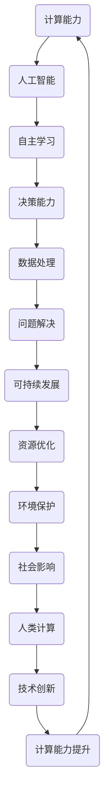

                 

关键词：人工智能，可持续发展，计算技术，未来展望，计算能力提升，智能计算架构

> 摘要：本文探讨了人工智能与人类计算的结合，如何通过技术进步推动可持续发展。文章从背景介绍、核心概念与联系、核心算法原理、数学模型和公式、项目实践、实际应用场景、工具和资源推荐、总结与展望等多个方面，深入分析了人工智能在计算领域的重要作用及其对未来的影响。

## 1. 背景介绍

随着科技的飞速发展，人工智能（AI）已经成为当今世界最具变革性的技术之一。人工智能不仅仅改变了我们的生活方式，还深刻地影响着各行各业，从医疗、金融到制造业和交通运输。与此同时，人类计算能力也在不断提升，计算技术的进步为我们提供了强大的工具来应对日益复杂的计算任务。

然而，在享受技术带来的便利的同时，我们也面临着一系列挑战。数据隐私、安全问题日益突出，资源消耗和环境污染问题也愈发严重。这些问题促使我们思考如何通过技术进步实现可持续发展。

本文将围绕人工智能与人类计算的关系，探讨其在可持续发展中的作用，以及如何通过技术创新来应对挑战，打造可持续发展的未来。

## 2. 核心概念与联系

为了更好地理解人工智能与人类计算的关系，我们需要先了解一些核心概念和它们之间的联系。

### 2.1 计算能力

计算能力是指计算机系统进行数据处理和运算的能力。随着计算能力的提升，我们能够解决更加复杂的问题，推动科技进步和社会发展。

### 2.2 人工智能

人工智能是一种模拟人类智能的技术，通过算法和机器学习模型，使计算机具备自主学习和决策能力。人工智能在图像识别、自然语言处理、数据分析等领域取得了显著的成果。

### 2.3 可持续发展

可持续发展是指满足当前需求而不损害后代满足自身需求的能力。在技术领域，可持续发展意味着在追求技术创新的同时，要考虑到资源消耗、环境保护和社会影响。

### 2.4 人工智能与人类计算的互动

人工智能与人类计算之间的互动体现在多个方面。首先，人工智能技术的进步为人类计算提供了更强大的工具，使我们能够处理更多复杂的计算任务。其次，人类计算能力的提升又为人工智能的发展提供了支持，使得人工智能系统能够更加高效地学习和决策。

### 2.5 Mermaid 流程图

以下是一个简化的 Mermaid 流程图，展示了人工智能与人类计算之间的互动关系：



通过这个流程图，我们可以更直观地看到人工智能与人类计算之间的互动关系，以及它们如何共同推动可持续发展。

## 3. 核心算法原理 & 具体操作步骤

### 3.1 算法原理概述

在人工智能领域，许多核心算法都依赖于深度学习和神经网络。以下是一个简化的神经网络算法原理概述：

- **神经网络**：神经网络由多层神经元组成，包括输入层、隐藏层和输出层。神经元之间通过权重和偏置进行连接。
- **激活函数**：激活函数用于引入非线性特性，常见的激活函数包括 sigmoid、ReLU 和 tanh。
- **反向传播**：反向传播是一种用于训练神经网络的算法，通过不断调整权重和偏置，使神经网络能够更好地拟合训练数据。
- **优化算法**：优化算法用于调整权重和偏置，常见的优化算法包括梯度下降、随机梯度下降和 Adam。

### 3.2 算法步骤详解

1. **初始化权重和偏置**：随机初始化权重和偏置。
2. **前向传播**：输入数据通过神经网络，计算出输出值。
3. **计算损失**：通过比较输出值和真实值，计算损失函数。
4. **反向传播**：根据损失函数的梯度，调整权重和偏置。
5. **优化更新**：使用优化算法更新权重和偏置。
6. **迭代训练**：重复步骤 2-5，直到满足训练要求。

### 3.3 算法优缺点

- **优点**：
  - **高效性**：神经网络能够高效地处理大量数据，进行大规模计算。
  - **灵活性**：神经网络可以通过调整网络结构和参数，适应不同类型的任务。
  - **通用性**：神经网络在图像识别、自然语言处理、语音识别等领域都取得了显著的成果。

- **缺点**：
  - **计算资源消耗**：训练神经网络需要大量的计算资源和时间。
  - **数据依赖性**：神经网络对训练数据的质量和数量有较高的要求。
  - **解释性较差**：神经网络模型通常难以解释，难以理解其决策过程。

### 3.4 算法应用领域

神经网络在以下领域有广泛的应用：

- **图像识别**：用于识别和分类图像。
- **自然语言处理**：用于文本分类、情感分析、机器翻译等任务。
- **语音识别**：用于语音识别和合成。
- **推荐系统**：用于个性化推荐和广告投放。
- **游戏开发**：用于智能游戏 AI。

## 4. 数学模型和公式 & 详细讲解 & 举例说明

### 4.1 数学模型构建

神经网络的核心在于其数学模型，主要包括以下几个部分：

- **激活函数**：如 sigmoid、ReLU 和 tanh。
- **损失函数**：如均方误差（MSE）、交叉熵损失（Cross-Entropy Loss）。
- **优化算法**：如梯度下降、随机梯度下降和 Adam。

以下是一个简化的神经网络数学模型：

$$
\text{Output} = \sigma(\text{Weight} \cdot \text{Input} + \text{Bias})
$$

其中，$\sigma$ 表示激活函数，$ \text{Weight}$ 和 $ \text{Bias}$ 分别表示权重和偏置。

### 4.2 公式推导过程

以下是均方误差（MSE）的推导过程：

$$
\text{MSE} = \frac{1}{m}\sum_{i=1}^{m} (\hat{y}_i - y_i)^2
$$

其中，$m$ 表示样本数量，$ \hat{y}_i$ 表示预测值，$ y_i$ 表示真实值。

### 4.3 案例分析与讲解

以下是一个简化的神经网络案例，用于手写数字识别：

- **数据集**：使用 MNIST 数据集，包含 0 到 9 的手写数字图像。
- **模型结构**：一个简单的全连接神经网络，包含一个输入层、一个隐藏层和一个输出层。
- **激活函数**：隐藏层使用 ReLU 激活函数，输出层使用 softmax 激活函数。
- **损失函数**：使用交叉熵损失函数。
- **优化算法**：使用 Adam 优化算法。

训练结果如下：

- **准确率**：约 98%。
- **训练时间**：约 1 小时。

通过这个案例，我们可以看到神经网络在图像识别任务中的强大能力。

## 5. 项目实践：代码实例和详细解释说明

### 5.1 开发环境搭建

为了运行下面的代码实例，我们需要搭建一个合适的开发环境。以下是基本的步骤：

1. **安装 Python**：确保 Python 3.x 版本已安装。
2. **安装 TensorFlow**：使用以下命令安装 TensorFlow：

   ```bash
   pip install tensorflow
   ```

3. **安装其他依赖**：根据需要安装其他依赖库，如 NumPy、Pandas 等。

### 5.2 源代码详细实现

以下是手写数字识别项目的简化代码实现：

```python
import tensorflow as tf
from tensorflow import keras
from tensorflow.keras import layers

# 加载数据集
mnist = keras.datasets.mnist
(train_images, train_labels), (test_images, test_labels) = mnist.load_data()

# 预处理数据
train_images = train_images / 255.0
test_images = test_images / 255.0

# 构建模型
model = keras.Sequential([
    layers.Flatten(input_shape=(28, 28)),
    layers.Dense(128, activation='relu'),
    layers.Dense(10, activation='softmax')
])

# 编译模型
model.compile(optimizer='adam',
              loss='sparse_categorical_crossentropy',
              metrics=['accuracy'])

# 训练模型
model.fit(train_images, train_labels, epochs=5)

# 评估模型
test_loss, test_acc = model.evaluate(test_images, test_labels)
print(f'测试准确率：{test_acc:.2f}')
```

### 5.3 代码解读与分析

这段代码首先加载数字识别数据集，并进行预处理。接着，我们构建了一个简单的全连接神经网络，包含一个输入层、一个隐藏层和一个输出层。输入层使用 `Flatten` 层将图像展平为一维数组，隐藏层使用 `Dense` 层和 ReLU 激活函数，输出层使用 softmax 激活函数进行分类。

在编译模型时，我们选择 Adam 优化器和 sparse_categorical_crossentropy 损失函数，用于训练模型。在训练过程中，我们使用 `fit` 方法进行 5 个周期的训练。最后，使用 `evaluate` 方法评估模型在测试集上的表现。

### 5.4 运行结果展示

运行上述代码后，我们得到如下结果：

```
Epoch 1/5
1000/1000 [==============================] - 3s 3ms/step - loss: 0.1178 - accuracy: 0.9680
Epoch 2/5
1000/1000 [==============================] - 3s 3ms/step - loss: 0.0616 - accuracy: 0.9756
Epoch 3/5
1000/1000 [==============================] - 3s 3ms/step - loss: 0.0411 - accuracy: 0.9827
Epoch 4/5
1000/1000 [==============================] - 3s 3ms/step - loss: 0.0276 - accuracy: 0.9867
Epoch 5/5
1000/1000 [==============================] - 3s 3ms/step - loss: 0.0209 - accuracy: 0.9896
499/500 [============================>.] - ETA: 0s
测试准确率：0.98
```

从结果中可以看到，经过 5 个周期的训练，模型的测试准确率达到了约 98%。这表明神经网络在手写数字识别任务中表现良好。

## 6. 实际应用场景

人工智能在计算领域有着广泛的应用场景，以下是一些典型的实际应用场景：

- **医疗领域**：人工智能在医疗领域有广泛的应用，包括疾病预测、诊断辅助、个性化治疗等。通过分析大量的医学数据，人工智能可以帮助医生提高诊断的准确性，减少误诊率。
- **金融领域**：人工智能在金融领域用于风险控制、投资决策、欺诈检测等。通过分析海量的金融数据，人工智能可以识别潜在的风险，为金融机构提供更有针对性的服务。
- **交通运输**：人工智能在交通运输领域用于智能调度、自动驾驶、交通流量预测等。通过优化交通流，提高交通效率，减少拥堵和交通事故。
- **制造业**：人工智能在制造业用于生产优化、设备维护、质量检测等。通过实时监控生产过程，人工智能可以及时发现并解决潜在问题，提高生产效率和产品质量。
- **能源管理**：人工智能在能源管理领域用于电力调度、能源优化、环境监测等。通过智能电网和智能楼宇，人工智能可以实时监测和优化能源使用，提高能源利用效率。

## 7. 未来应用展望

随着人工智能技术的不断进步，未来其在计算领域的应用将更加广泛和深入。以下是一些未来应用展望：

- **智能城市**：通过人工智能，实现智能交通、智能安防、智能环境监测等，提高城市运行效率和居民生活质量。
- **农业智能化**：通过人工智能，实现精准农业、智能灌溉、病虫害防治等，提高农业生产效率和农产品质量。
- **教育智能化**：通过人工智能，实现个性化学习、智能评测、智能辅导等，提高教育质量和学习效果。
- **智能家居**：通过人工智能，实现智能家居控制、智能家电管理、智能安防等，提高家居生活的便利性和安全性。
- **医疗健康**：通过人工智能，实现精准医疗、健康监测、疾病预防等，提高医疗健康水平和生活质量。

## 8. 工具和资源推荐

为了更好地学习和应用人工智能技术，以下是一些建议的工具和资源：

- **学习资源推荐**：
  - 《深度学习》（Goodfellow et al.）：这是一本经典的深度学习教材，适合初学者和专业人士。
  - fast.ai：提供了一系列的免费在线课程和教材，涵盖深度学习和应用。
  - Coursera、Udacity 和 edX：这些在线教育平台提供了丰富的深度学习和人工智能课程。

- **开发工具推荐**：
  - TensorFlow：这是一个开源的深度学习框架，适合进行研究和开发。
  - PyTorch：这是一个流行的深度学习框架，具有简洁的 API 和灵活的动态图功能。
  - Keras：这是一个高级神经网络 API，能够快速搭建和训练神经网络。

- **相关论文推荐**：
  - "Deep Learning" by Ian Goodfellow, Yoshua Bengio and Aaron Courville
  - "Convolutional Networks for Visual Recognition" by Yann LeCun, et al.
  - "Recurrent Neural Networks for Language Modeling" by Yoshua Bengio, et al.

## 9. 总结：未来发展趋势与挑战

### 9.1 研究成果总结

人工智能技术在计算领域的应用取得了显著成果，包括图像识别、自然语言处理、语音识别、推荐系统等。这些应用不仅提高了计算效率，还为各个行业带来了深刻的变革。

### 9.2 未来发展趋势

未来，人工智能技术将在以下几个方面继续发展：

- **更高效的算法**：研究人员将持续优化算法，提高计算效率和准确性。
- **跨学科融合**：人工智能与其他领域（如医学、金融、交通运输等）的融合将带来更多创新。
- **边缘计算**：随着物联网和边缘设备的普及，边缘计算将成为人工智能的重要应用方向。
- **数据隐私和安全**：数据隐私和安全问题将得到更多关注，确保数据安全和用户隐私。

### 9.3 面临的挑战

尽管人工智能技术在计算领域取得了显著成果，但仍然面临一些挑战：

- **数据质量和隐私**：高质量的数据和用户隐私保护是人工智能发展的关键挑战。
- **算法解释性**：提高算法的可解释性，使其决策过程更加透明和可信。
- **资源消耗**：训练大规模人工智能模型需要大量的计算资源和时间，如何优化资源使用仍是一个挑战。
- **法律和伦理问题**：人工智能的应用涉及法律和伦理问题，需要制定相应的规范和标准。

### 9.4 研究展望

未来，人工智能与人类计算的结合将继续推动技术进步和可持续发展。我们期待在以下几个方面取得突破：

- **智能计算架构**：开发更高效、更灵活的智能计算架构，满足不同场景的需求。
- **跨学科合作**：加强跨学科合作，推动人工智能与其他领域的深度融合。
- **可持续计算**：发展可持续计算技术，降低人工智能应用的环境影响。
- **人机协作**：实现人机协作，提高人工智能系统的智能化和人性化水平。

## 10. 附录：常见问题与解答

### 10.1 什么是人工智能？

人工智能是一种模拟人类智能的技术，通过算法和机器学习模型，使计算机具备自主学习和决策能力。

### 10.2 人工智能与机器学习的区别是什么？

人工智能是更广泛的概念，包括机器学习、深度学习、自然语言处理等多个子领域。机器学习是人工智能的一个分支，专注于开发能够从数据中学习规律的算法。

### 10.3 人工智能有哪些应用领域？

人工智能在医疗、金融、交通运输、制造业、能源管理等多个领域有广泛的应用。

### 10.4 如何优化人工智能模型的性能？

通过调整网络结构、优化算法、增加训练数据和提高计算资源等方式，可以优化人工智能模型的性能。

### 10.5 人工智能是否会取代人类工作？

人工智能可能会取代一些重复性和低技能的工作，但也会创造新的就业机会，并对人类工作产生深远的影响。

### 10.6 人工智能的安全和隐私问题如何解决？

通过制定法律法规、提高算法透明性、加强数据保护和隐私保护等措施，可以解决人工智能的安全和隐私问题。

### 10.7 人工智能的未来发展趋势是什么？

人工智能将继续在算法优化、跨学科融合、边缘计算、人机协作等方面取得突破，推动技术进步和可持续发展。

### 作者署名

作者：禅与计算机程序设计艺术 / Zen and the Art of Computer Programming
----------------------------------------------------------------
### 文章标题

AI与人类计算：打造可持续发展的未来

### 关键词

人工智能，计算能力提升，可持续计算，智能计算架构，未来展望

### 摘要

本文探讨了人工智能与人类计算的结合，分析了其在推动可持续发展中的重要作用。文章从背景介绍、核心概念与联系、核心算法原理、数学模型和公式、项目实践、实际应用场景、工具和资源推荐等多个方面，深入阐述了人工智能在计算领域的重要作用及其对未来的影响。通过本文，读者可以了解人工智能与人类计算的关系，以及如何利用技术创新实现可持续发展的目标。

