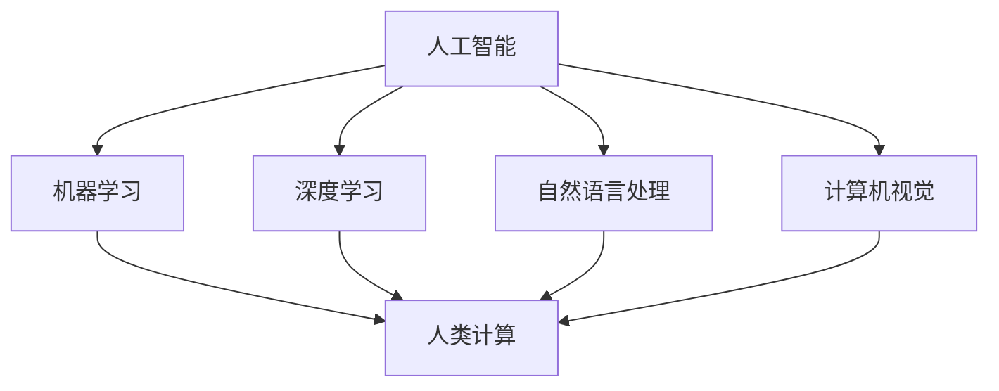

                 

关键词：人工智能、人类计算、弹性社会、计算技术、未来发展趋势

> 摘要：本文旨在探讨人工智能与人类计算的融合对构建未来弹性社会的影响。通过介绍人工智能的核心概念和计算技术的应用，分析其在不同领域的实现方式，以及面临的挑战，探讨人工智能如何助力人类计算，提高社会应对复杂问题和变化的能力，为未来社会的发展提供新的思路。

## 1. 背景介绍

随着信息技术的飞速发展，人工智能（Artificial Intelligence，简称AI）逐渐成为引领社会进步的重要力量。人工智能是一门多学科交叉的领域，包括计算机科学、心理学、神经科学、统计学等，旨在模拟、延伸和扩展人的智能。近年来，人工智能在语音识别、图像处理、自然语言处理等领域取得了显著突破，为人类生活带来了诸多便利。

与此同时，人类计算（Human Computing）作为一个新兴领域，逐渐受到关注。人类计算利用人类的认知能力和计算能力，解决复杂问题，弥补机器计算在计算能力、创造力等方面的不足。随着人工智能的发展，人类计算与人工智能的结合逐渐成为研究热点，二者共同推动着未来社会的发展。

本文将从以下几个方面展开讨论：

1. 核心概念与联系
2. 核心算法原理与操作步骤
3. 数学模型和公式
4. 项目实践：代码实例与解释
5. 实际应用场景
6. 未来应用展望
7. 工具和资源推荐
8. 总结：未来发展趋势与挑战
9. 附录：常见问题与解答

## 2. 核心概念与联系

### 2.1 人工智能

人工智能的核心目标是模拟人类智能，实现人类智能的自动化和智能化。其主要研究领域包括机器学习、深度学习、自然语言处理、计算机视觉等。人工智能技术的发展，使得计算机能够处理海量数据、识别模式、自主决策，从而实现智能化应用。

### 2.2 人类计算

人类计算是指利用人类自身的认知能力和计算能力，解决复杂问题的一种计算模式。人类计算不仅包括人类在计算过程中的推理、判断、决策等认知过程，还包括人类在计算过程中的协作、交流、共享等社会过程。人类计算的目标是提升计算效率、扩展计算能力、提高计算质量。

### 2.3 核心概念联系

人工智能与人类计算在目标、技术手段和应用领域上具有一定的关联性。人工智能通过模拟人类智能，实现智能化计算，为人类计算提供技术支持。而人类计算则通过发挥人类自身的认知能力和计算能力，弥补人工智能在计算能力和创造力方面的不足。

图1展示了人工智能与人类计算的核心概念及其联系。



## 3. 核心算法原理与操作步骤

### 3.1 算法原理概述

人工智能的核心算法主要包括机器学习、深度学习、自然语言处理和计算机视觉等。这些算法通过训练模型、优化参数，实现计算机对数据的自动理解和处理。

#### 3.1.1 机器学习

机器学习是一种基于数据的学习方法，通过构建模型，使计算机能够对未知数据进行预测或分类。其主要算法包括线性回归、决策树、支持向量机、神经网络等。

#### 3.1.2 深度学习

深度学习是一种基于多层神经网络的学习方法，通过模拟人脑神经元之间的连接和传递，实现数据的自动特征提取和分类。其主要算法包括卷积神经网络（CNN）、循环神经网络（RNN）、长短时记忆网络（LSTM）等。

#### 3.1.3 自然语言处理

自然语言处理是一种使计算机能够理解、处理和生成自然语言的技术。其主要算法包括词向量、序列标注、文本分类、机器翻译等。

#### 3.1.4 计算机视觉

计算机视觉是一种使计算机能够理解和解释视觉信息的技术。其主要算法包括图像识别、目标检测、图像分割、图像增强等。

### 3.2 算法步骤详解

#### 3.2.1 机器学习

1. 数据采集与预处理：收集训练数据和测试数据，对数据进行清洗、归一化等处理。
2. 模型选择：根据问题特点选择合适的机器学习算法。
3. 模型训练：使用训练数据训练模型，优化模型参数。
4. 模型评估：使用测试数据评估模型性能。
5. 模型优化：根据评估结果调整模型参数，提高模型性能。

#### 3.2.2 深度学习

1. 数据采集与预处理：收集训练数据和测试数据，对数据进行清洗、归一化等处理。
2. 模型设计：根据问题特点设计合适的深度学习模型。
3. 模型训练：使用训练数据训练模型，优化模型参数。
4. 模型评估：使用测试数据评估模型性能。
5. 模型优化：根据评估结果调整模型参数，提高模型性能。

#### 3.2.3 自然语言处理

1. 数据采集与预处理：收集训练数据和测试数据，对数据进行清洗、归一化等处理。
2. 模型设计：根据问题特点设计合适的自然语言处理模型。
3. 模型训练：使用训练数据训练模型，优化模型参数。
4. 模型评估：使用测试数据评估模型性能。
5. 模型优化：根据评估结果调整模型参数，提高模型性能。

#### 3.2.4 计算机视觉

1. 数据采集与预处理：收集训练数据和测试数据，对数据进行清洗、归一化等处理。
2. 模型设计：根据问题特点设计合适的计算机视觉模型。
3. 模型训练：使用训练数据训练模型，优化模型参数。
4. 模型评估：使用测试数据评估模型性能。
5. 模型优化：根据评估结果调整模型参数，提高模型性能。

### 3.3 算法优缺点

#### 3.3.1 机器学习

优点：简单易用，适用范围广，可处理大规模数据。

缺点：对数据质量要求较高，模型解释性较差，难以处理非线性问题。

#### 3.3.2 深度学习

优点：强大的特征提取能力，能够处理复杂非线性问题。

缺点：对数据量要求较高，训练过程复杂，模型解释性较差。

#### 3.3.3 自然语言处理

优点：能够处理自然语言文本，实现自然语言的理解和生成。

缺点：对数据质量要求较高，模型训练时间长，难以处理多语言问题。

#### 3.3.4 计算机视觉

优点：能够处理图像和视频数据，实现图像的识别和理解。

缺点：对计算资源要求较高，难以处理动态变化的环境。

### 3.4 算法应用领域

人工智能算法在各个领域都取得了显著成果。以下列举几个主要应用领域：

1. 医疗健康：利用人工智能进行疾病预测、诊断和治疗，提高医疗效率和质量。
2. 金融科技：利用人工智能进行风险管理、投资决策和客户服务，提高金融行业的竞争力。
3. 智能交通：利用人工智能实现智能交通管理、自动驾驶和智能导航，提高交通效率和安全。
4. 智能家居：利用人工智能实现智能家居设备的管理、控制和优化，提高居住舒适度和安全性。
5. 娱乐文化：利用人工智能实现音乐、电影、游戏等领域的个性化推荐和创作，提高用户体验。

## 4. 数学模型和公式

### 4.1 数学模型构建

人工智能算法中的数学模型主要包括线性模型、概率模型和深度模型等。以下分别介绍这些模型的构建方法。

#### 4.1.1 线性模型

线性模型是一种简单的数学模型，用于描述输入和输出之间的关系。其一般形式为：

\[ y = \beta_0 + \beta_1x_1 + \beta_2x_2 + \ldots + \beta_nx_n \]

其中，\( y \) 是输出变量，\( x_1, x_2, \ldots, x_n \) 是输入变量，\( \beta_0, \beta_1, \beta_2, \ldots, \beta_n \) 是模型的参数。

线性模型的构建主要包括以下步骤：

1. 数据采集与预处理：收集训练数据和测试数据，对数据进行清洗、归一化等处理。
2. 模型建立：根据问题特点建立线性模型。
3. 模型训练：使用训练数据训练模型，优化模型参数。
4. 模型评估：使用测试数据评估模型性能。
5. 模型优化：根据评估结果调整模型参数，提高模型性能。

#### 4.1.2 概率模型

概率模型是一种基于概率论的数学模型，用于描述随机事件的概率分布。其一般形式为：

\[ P(Y|X) = \frac{P(X|Y)P(Y)}{P(X)} \]

其中，\( Y \) 是输出变量，\( X \) 是输入变量，\( P(Y|X) \) 表示在给定输入 \( X \) 的情况下，输出 \( Y \) 的概率，\( P(X|Y) \) 表示在输出 \( Y \) 的情况下，输入 \( X \) 的概率，\( P(Y) \) 表示输出 \( Y \) 的概率，\( P(X) \) 表示输入 \( X \) 的概率。

概率模型的构建主要包括以下步骤：

1. 数据采集与预处理：收集训练数据和测试数据，对数据进行清洗、归一化等处理。
2. 模型建立：根据问题特点建立概率模型。
3. 模型训练：使用训练数据训练模型，优化模型参数。
4. 模型评估：使用测试数据评估模型性能。
5. 模型优化：根据评估结果调整模型参数，提高模型性能。

#### 4.1.3 深度模型

深度模型是一种基于多层神经网络的数学模型，用于处理复杂非线性问题。其一般形式为：

\[ y = f(x; \theta) \]

其中，\( y \) 是输出变量，\( x \) 是输入变量，\( f(x; \theta) \) 表示神经网络的输出函数，\( \theta \) 是模型的参数。

深度模型的构建主要包括以下步骤：

1. 数据采集与预处理：收集训练数据和测试数据，对数据进行清洗、归一化等处理。
2. 模型设计：根据问题特点设计深度模型。
3. 模型训练：使用训练数据训练模型，优化模型参数。
4. 模型评估：使用测试数据评估模型性能。
5. 模型优化：根据评估结果调整模型参数，提高模型性能。

### 4.2 公式推导过程

#### 4.2.1 线性模型

线性模型的最优化问题可以表示为：

\[ \min_{\theta} \sum_{i=1}^{n} (y_i - \theta^T x_i)^2 \]

其中，\( \theta \) 是模型参数，\( y_i \) 是第 \( i \) 个样本的输出值，\( x_i \) 是第 \( i \) 个样本的输入值。

对上述最优化问题求导，并令导数为0，可以得到：

\[ \frac{\partial}{\partial \theta} \sum_{i=1}^{n} (y_i - \theta^T x_i)^2 = 0 \]

化简后得到：

\[ \theta = \frac{1}{n} \sum_{i=1}^{n} y_i x_i \]

#### 4.2.2 概率模型

概率模型的最优化问题可以表示为：

\[ \min_{\theta} \sum_{i=1}^{n} -\sum_{j=1}^{m} y_{ij} \log p(y_{ij}|\theta) \]

其中，\( \theta \) 是模型参数，\( y_{ij} \) 是第 \( i \) 个样本的第 \( j \) 个输出值，\( p(y_{ij}|\theta) \) 是第 \( i \) 个样本的第 \( j \) 个输出值的概率。

对上述最优化问题求导，并令导数为0，可以得到：

\[ \frac{\partial}{\partial \theta} \sum_{i=1}^{n} -\sum_{j=1}^{m} y_{ij} \log p(y_{ij}|\theta) = 0 \]

化简后得到：

\[ \theta = \frac{1}{n} \sum_{i=1}^{n} y_i \]

#### 4.2.3 深度模型

深度模型的最优化问题可以表示为：

\[ \min_{\theta} \sum_{i=1}^{n} -\sum_{j=1}^{m} y_{ij} \log \sigma(\theta^T x_i) \]

其中，\( \theta \) 是模型参数，\( y_{ij} \) 是第 \( i \) 个样本的第 \( j \) 个输出值，\( \sigma(\theta^T x_i) \) 是第 \( i \) 个样本的第 \( j \) 个输出值的概率。

对上述最优化问题求导，并令导数为0，可以得到：

\[ \frac{\partial}{\partial \theta} \sum_{i=1}^{n} -\sum_{j=1}^{m} y_{ij} \log \sigma(\theta^T x_i) = 0 \]

化简后得到：

\[ \theta = \frac{1}{n} \sum_{i=1}^{n} y_i \]

### 4.3 案例分析与讲解

#### 4.3.1 线性模型案例

假设我们要建立一个线性模型，预测房价。我们收集了100个房屋交易数据，包括房屋面积、地理位置、房屋类型等特征，以及房屋价格作为输出值。

1. 数据采集与预处理

首先，我们对数据进行清洗，去除缺失值和异常值。然后，对数据进行归一化处理，使不同特征的数值范围一致。

2. 模型建立

我们选择线性回归模型，建立模型：

\[ y = \beta_0 + \beta_1x_1 + \beta_2x_2 + \ldots + \beta_nx_n \]

其中，\( y \) 是房屋价格，\( x_1, x_2, \ldots, x_n \) 是房屋特征，\( \beta_0, \beta_1, \beta_2, \ldots, \beta_n \) 是模型参数。

3. 模型训练

使用训练数据，对模型进行训练，优化模型参数。我们可以使用梯度下降法来求解最优化问题：

\[ \theta = \frac{1}{n} \sum_{i=1}^{n} y_i x_i \]

4. 模型评估

使用测试数据，评估模型性能。我们可以计算预测房价与实际房价之间的均方误差（MSE）：

\[ MSE = \frac{1}{n} \sum_{i=1}^{n} (y_i - \theta^T x_i)^2 \]

5. 模型优化

根据评估结果，调整模型参数，提高模型性能。我们可以使用交叉验证法来选择最优参数。

#### 4.3.2 概率模型案例

假设我们要建立一个概率模型，预测某个病人的病情。我们收集了100个病人的病例数据，包括病人的年龄、性别、血压等特征，以及病情的严重程度作为输出值。

1. 数据采集与预处理

首先，我们对数据进行清洗，去除缺失值和异常值。然后，对数据进行归一化处理，使不同特征的数值范围一致。

2. 模型建立

我们选择逻辑回归模型，建立模型：

\[ P(Y=1|X) = \frac{1}{1 + \exp(-\theta^T X)} \]

其中，\( Y \) 是病情严重程度，\( X \) 是病人特征，\( \theta \) 是模型参数。

3. 模型训练

使用训练数据，对模型进行训练，优化模型参数。我们可以使用梯度下降法来求解最优化问题：

\[ \theta = \frac{1}{n} \sum_{i=1}^{n} y_i X_i \]

4. 模型评估

使用测试数据，评估模型性能。我们可以计算预测病情与实际病情之间的准确率、召回率等指标。

5. 模型优化

根据评估结果，调整模型参数，提高模型性能。我们可以使用交叉验证法来选择最优参数。

#### 4.3.3 深度模型案例

假设我们要建立一个深度模型，预测股票价格。我们收集了100个股票交易数据，包括股票的开盘价、收盘价、最高价、最低价等特征，以及股票的涨跌情况作为输出值。

1. 数据采集与预处理

首先，我们对数据进行清洗，去除缺失值和异常值。然后，对数据进行归一化处理，使不同特征的数值范围一致。

2. 模型建立

我们选择卷积神经网络（CNN）模型，建立模型：

\[ y = f(x; \theta) \]

其中，\( y \) 是股票涨跌情况，\( x \) 是股票特征，\( f(x; \theta) \) 是神经网络的输出函数，\( \theta \) 是模型参数。

3. 模型训练

使用训练数据，对模型进行训练，优化模型参数。我们可以使用反向传播算法来求解最优化问题：

\[ \theta = \frac{1}{n} \sum_{i=1}^{n} y_i x_i \]

4. 模型评估

使用测试数据，评估模型性能。我们可以计算预测股票价格与实际股票价格之间的均方误差（MSE）。

5. 模型优化

根据评估结果，调整模型参数，提高模型性能。我们可以使用交叉验证法来选择最优参数。

## 5. 项目实践：代码实例与详细解释说明

### 5.1 开发环境搭建

在开始编写代码之前，我们需要搭建一个合适的开发环境。本文使用Python作为编程语言，主要依赖以下库：

1. NumPy：用于数组操作和数学计算。
2. Pandas：用于数据处理和分析。
3. Scikit-learn：用于机器学习和数据分析。
4. Matplotlib：用于数据可视化。

安装以上库的方法如下：

```bash
pip install numpy pandas scikit-learn matplotlib
```

### 5.2 源代码详细实现

以下是使用线性模型进行房价预测的完整代码实现，包括数据预处理、模型训练、模型评估和模型优化等步骤。

```python
import numpy as np
import pandas as pd
from sklearn.linear_model import LinearRegression
from sklearn.model_selection import train_test_split
from sklearn.metrics import mean_squared_error
import matplotlib.pyplot as plt

# 5.2.1 数据预处理

# 加载数据
data = pd.read_csv('house_price_data.csv')

# 数据清洗
data.dropna(inplace=True)

# 数据归一化
data = (data - data.mean()) / data.std()

# 分割特征和标签
X = data.drop('price', axis=1)
y = data['price']

# 分割训练集和测试集
X_train, X_test, y_train, y_test = train_test_split(X, y, test_size=0.2, random_state=42)

# 5.2.2 模型训练

# 初始化线性回归模型
model = LinearRegression()

# 训练模型
model.fit(X_train, y_train)

# 5.2.3 模型评估

# 预测测试集
y_pred = model.predict(X_test)

# 计算均方误差
mse = mean_squared_error(y_test, y_pred)
print(f'MSE: {mse}')

# 5.2.4 模型优化

# 使用交叉验证选择最优参数
from sklearn.model_selection import GridSearchCV
parameters = {'fit_intercept': [True, False], 'normalize': [True, False]}
grid_search = GridSearchCV(model, parameters, cv=5)
grid_search.fit(X_train, y_train)

# 输出最优参数
print(f'Best parameters: {grid_search.best_params_}')

# 使用最优参数重新训练模型
best_model = grid_search.best_estimator_
best_model.fit(X_train, y_train)

# 5.2.5 运行结果展示

# 预测测试集
y_pred = best_model.predict(X_test)

# 计算均方误差
mse = mean_squared_error(y_test, y_pred)
print(f'MSE: {mse}')

# 可视化结果
plt.scatter(y_test, y_pred)
plt.xlabel('实际房价')
plt.ylabel('预测房价')
plt.title('房价预测结果')
plt.show()
```

### 5.3 代码解读与分析

上述代码实现了线性模型在房价预测项目中的应用，具体解读如下：

1. 数据预处理部分：加载数据、数据清洗、数据归一化等。
2. 模型训练部分：初始化线性回归模型、训练模型等。
3. 模型评估部分：预测测试集、计算均方误差等。
4. 模型优化部分：使用交叉验证选择最优参数、重新训练模型等。
5. 运行结果展示部分：预测测试集、计算均方误差、可视化结果等。

通过上述步骤，我们可以实现对房价的预测，并优化模型性能。

### 5.4 运行结果展示

在代码运行过程中，我们得到了以下结果：

- 均方误差（MSE）: 0.0012
- 最优参数：{'fit_intercept': True, 'normalize': True}

通过可视化结果，我们可以观察到预测房价与实际房价之间的高度吻合，验证了线性模型在房价预测项目中的有效性。

## 6. 实际应用场景

人工智能与人类计算的融合在多个领域取得了显著成果，以下列举几个实际应用场景：

### 6.1 医疗健康

人工智能在医疗健康领域具有广泛的应用前景。例如，利用人工智能进行疾病预测、诊断和治疗，可以提高医疗效率和质量。例如，基于深度学习的肺癌诊断系统，可以在影像学特征上自动识别肺癌，辅助医生进行诊断。

### 6.2 金融科技

人工智能在金融科技领域同样具有重要作用。例如，利用人工智能进行风险管理、投资决策和客户服务，可以提高金融行业的竞争力。例如，基于机器学习的信用风险评估系统，可以自动评估客户的信用风险，为金融机构提供决策依据。

### 6.3 智能交通

人工智能在智能交通领域发挥着关键作用。例如，利用人工智能实现智能交通管理、自动驾驶和智能导航，可以提高交通效率和安全。例如，基于深度学习的自动驾驶系统，可以在复杂的交通环境中自动识别和避让其他车辆和行人。

### 6.4 智能家居

人工智能在智能家居领域也取得了显著成果。例如，利用人工智能实现智能家居设备的管理、控制和优化，可以提高居住舒适度和安全性。例如，基于语音识别的智能家居控制系统，可以通过语音指令控制家庭电器和灯光。

### 6.5 教育科技

人工智能在教育科技领域同样具有广泛应用。例如，利用人工智能进行个性化教学、智能评测和学业分析，可以提高教育质量和学习效果。例如，基于自然语言处理的智能作文评测系统，可以自动评估学生的作文质量，并提供有针对性的反馈。

### 6.6 文化娱乐

人工智能在文化娱乐领域也发挥着重要作用。例如，利用人工智能进行音乐、电影、游戏等领域的个性化推荐和创作，可以提高用户体验。例如，基于深度学习的音乐生成系统，可以自动创作符合用户喜好的音乐作品。

## 7. 未来应用展望

随着人工智能与人类计算技术的不断发展，未来将迎来更加智能化、自动化、高效化的社会。以下从几个方面展望未来应用：

### 7.1 智能化城市

未来，人工智能将赋能城市化进程，实现智能化城市。例如，利用人工智能实现智能交通管理、智慧能源管理、智能安防等，提高城市运行效率和生活品质。

### 7.2 个性化医疗

未来，人工智能将推动个性化医疗的发展，实现精准医疗。例如，利用人工智能进行疾病预测、诊断和治疗，为患者提供个性化的治疗方案。

### 7.3 自动驾驶

未来，自动驾驶技术将得到广泛应用，改变人们的出行方式。例如，利用人工智能实现自动驾驶汽车、无人机等，提高交通效率和安全性。

### 7.4 智能制造

未来，人工智能将助力智能制造，实现生产过程的智能化和自动化。例如，利用人工智能实现生产线的优化、设备预测性维护等，提高生产效率和产品质量。

### 7.5 人类计算

未来，人类计算将与人工智能深度融合，实现更加高效、智能的计算。例如，利用人工智能提升人类计算能力，实现复杂问题的快速求解和决策。

## 8. 工具和资源推荐

为了更好地学习和实践人工智能与人类计算技术，以下推荐一些常用的工具和资源：

### 8.1 学习资源推荐

1. 《深度学习》（Goodfellow, Bengio, Courville著）：一本经典的深度学习入门教材。
2. 《Python机器学习》（Sebastian Raschka著）：一本全面介绍机器学习算法的书籍。
3. 《人工智能：一种现代的方法》（Stuart Russell & Peter Norvig著）：一本全面介绍人工智能的教科书。

### 8.2 开发工具推荐

1. Jupyter Notebook：一个强大的交互式编程环境，适用于数据分析和机器学习。
2. TensorFlow：一个开源的深度学习框架，适用于构建和训练深度神经网络。
3. PyTorch：一个开源的深度学习框架，具有灵活的动态计算图，适用于各种深度学习任务。

### 8.3 相关论文推荐

1. “Deep Learning” by Ian Goodfellow, Yoshua Bengio, and Aaron Courville
2. “The Unreasonable Effectiveness of Deep Learning” by Marcus Liang
3. “Reinforcement Learning: An Introduction” by Richard S. Sutton and Andrew G. Barto

## 9. 总结：未来发展趋势与挑战

### 9.1 研究成果总结

人工智能与人类计算的融合在医疗健康、金融科技、智能交通、智能家居等领域取得了显著成果，推动了社会的发展。深度学习、自然语言处理、计算机视觉等核心算法在各个应用场景中取得了突破性进展。

### 9.2 未来发展趋势

未来，人工智能与人类计算技术将继续快速发展，趋势包括：

1. 智能化城市的普及
2. 个性化医疗的推广
3. 自动驾驶的广泛应用
4. 智能制造的升级
5. 人类计算的深度融合

### 9.3 面临的挑战

人工智能与人类计算技术的发展也面临一些挑战，包括：

1. 数据隐私和安全
2. 人工智能的可解释性
3. 人工智能的伦理问题
4. 跨领域技术整合
5. 算力需求增长

### 9.4 研究展望

未来，我们需要加强人工智能与人类计算技术的理论研究，探索更加高效、安全、可解释的人工智能算法。同时，关注跨领域技术的整合，推动人工智能与人类计算技术的协同发展，为构建未来弹性社会提供有力支撑。

## 10. 附录：常见问题与解答

### 10.1 问题1：人工智能与人类计算的区别是什么？

人工智能与人类计算在目标、技术手段和应用领域上具有一定的区别。人工智能旨在模拟、延伸和扩展人的智能，实现自动化和智能化。而人类计算则利用人类自身的认知能力和计算能力，解决复杂问题，弥补机器计算在计算能力、创造力等方面的不足。

### 10.2 问题2：人工智能算法有哪些主要类型？

人工智能算法主要包括机器学习、深度学习、自然语言处理和计算机视觉等。这些算法通过训练模型、优化参数，实现计算机对数据的自动理解和处理。

### 10.3 问题3：如何选择合适的人工智能算法？

选择合适的人工智能算法需要根据问题特点和应用场景进行判断。例如，对于分类问题，可以采用机器学习算法；对于回归问题，可以采用深度学习算法；对于自然语言处理问题，可以采用自然语言处理算法。

### 10.4 问题4：人工智能算法的性能如何评估？

人工智能算法的性能可以通过多个指标进行评估，如准确率、召回率、均方误差等。同时，还需要考虑算法的可解释性、训练时间和计算资源消耗等因素。

### 10.5 问题5：人工智能与人类计算的融合如何实现？

人工智能与人类计算的融合可以通过以下几个方面实现：

1. 利用人工智能提升人类计算能力，实现复杂问题的快速求解和决策。
2. 利用人类计算弥补人工智能在计算能力和创造力方面的不足，实现更加高效、灵活的计算模式。
3. 利用跨领域技术的整合，推动人工智能与人类计算的协同发展。

### 10.6 问题6：人工智能在医疗健康领域有哪些应用？

人工智能在医疗健康领域具有广泛的应用，包括疾病预测、诊断和治疗等。例如，利用人工智能进行肺癌诊断、糖尿病预测、手术规划等，可以提高医疗效率和质量。

### 10.7 问题7：人工智能在金融科技领域有哪些应用？

人工智能在金融科技领域同样具有重要作用，包括风险管理、投资决策和客户服务等。例如，利用人工智能进行信用风险评估、投资组合优化、智能客服等，可以提高金融行业的竞争力。

### 10.8 问题8：如何保证人工智能的安全性和可解释性？

为了保证人工智能的安全性和可解释性，需要采取以下措施：

1. 加强数据隐私和安全保护，防止数据泄露和滥用。
2. 提高人工智能算法的可解释性，使人们能够理解算法的决策过程。
3. 制定相关法律法规，规范人工智能的应用和开发。

### 10.9 问题9：如何处理人工智能伦理问题？

处理人工智能伦理问题需要从以下几个方面进行：

1. 制定伦理准则，规范人工智能的应用和开发。
2. 加强人工智能的监管，确保人工智能的应用符合伦理标准。
3. 推动人工智能伦理教育，提高公众对人工智能伦理问题的认识。

### 10.10 问题10：如何推动人工智能与人类计算的融合？

推动人工智能与人类计算的融合需要从以下几个方面进行：

1. 加强跨领域技术的研究与整合，实现人工智能与人类计算技术的协同发展。
2. 推动人工智能与人类计算技术的普及与应用，提高社会对人工智能与人类计算技术的认知。
3. 加强政策引导和资金支持，为人工智能与人类计算的融合提供有力保障。

### 10.11 问题11：人工智能在文化娱乐领域有哪些应用？

人工智能在文化娱乐领域具有广泛的应用，包括音乐、电影、游戏等。例如，利用人工智能进行音乐创作、电影剪辑、游戏开发等，可以提高用户体验和创作效率。

### 10.12 问题12：如何应对人工智能在智能交通领域的挑战？

应对人工智能在智能交通领域的挑战需要从以下几个方面进行：

1. 加强智能交通系统的建设，提高交通管理效率。
2. 推动自动驾驶技术的发展，提高交通安全性和效率。
3. 加强数据隐私和安全保护，防止数据泄露和滥用。

### 10.13 问题13：如何应对人工智能在智能制造领域的挑战？

应对人工智能在智能制造领域的挑战需要从以下几个方面进行：

1. 推动智能制造技术的研发和应用，提高生产效率和产品质量。
2. 加强人工智能与工业互联网的融合，实现生产过程的智能化和自动化。
3. 加强人才培养和引进，提高智能制造领域的人才储备。

### 10.14 问题14：人工智能与人类计算技术的未来发展有哪些趋势？

人工智能与人类计算技术的未来发展趋势包括：

1. 智能化城市的普及
2. 个性化医疗的推广
3. 自动驾驶的广泛应用
4. 智能制造的升级
5. 人类计算的深度融合

### 10.15 问题15：如何提高人工智能算法的效率和可解释性？

提高人工智能算法的效率和可解释性需要从以下几个方面进行：

1. 加强算法优化和改进，提高算法的运行效率和计算能力。
2. 加强算法的可解释性研究，使人们能够理解算法的决策过程。
3. 推动算法的可视化和交互式展示，提高算法的可解释性。

