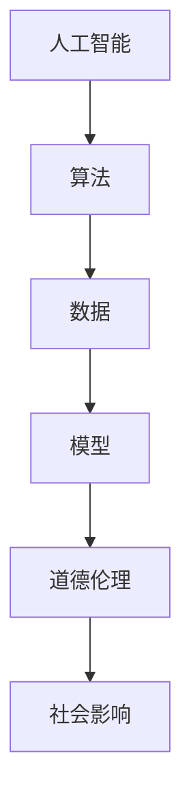
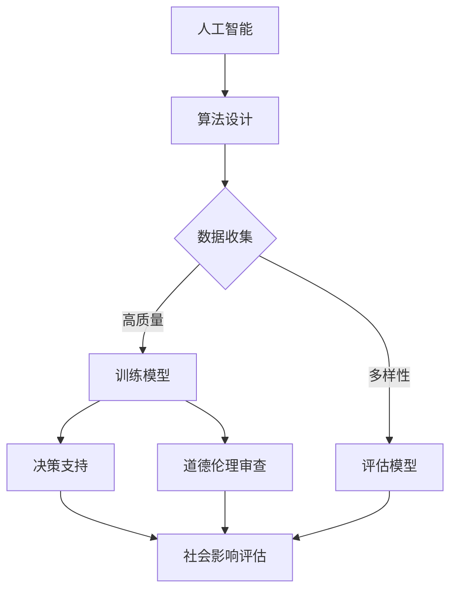

                 

关键词：人工智能、道德、伦理、社会影响、人类计算、算法、模型、AI伦理、责任、透明度、公平性、隐私、未来发展、工具与资源

> 摘要：本文旨在探讨人工智能（AI）在道德、伦理和社会影响方面的重大议题。通过分析AI的核心概念和原理，以及其对人类生活、工作和社会结构的深远影响，文章探讨了AI道德和伦理的重要性。同时，本文还讨论了当前面临的挑战，以及未来可能的发展方向。

## 1. 背景介绍

随着技术的飞速发展，人工智能已经成为推动社会进步的重要力量。AI技术在医疗、金融、交通、教育等领域的应用不断扩展，给人们的生活带来了巨大的便利。然而，AI技术的广泛应用也引发了一系列道德、伦理和社会问题，这些问题关系到人类的基本价值观和社会公平。

首先，AI在决策过程中可能存在的偏见和不公平现象引起了广泛关注。许多AI系统基于历史数据训练，而这些数据往往包含了人类自身的偏见。这种偏见可能被系统固化，导致AI在决策过程中歧视特定群体，如性别、种族、年龄等。其次，AI的自主性和透明度问题也备受争议。一些复杂的AI系统缺乏足够的透明度，使其决策过程难以理解和追踪，这引发了关于责任归属和隐私保护的讨论。

本文将深入探讨这些议题，分析AI在道德、伦理和社会影响方面的关键问题，并探讨未来可能的发展趋势和挑战。

## 2. 核心概念与联系

为了更好地理解AI在道德、伦理和社会影响方面的议题，首先需要了解一些核心概念和原理。以下是相关的概念及它们之间的联系，以及一个简化的Mermaid流程图来展示这些概念之间的关联。

### 2.1. 核心概念

- **人工智能（AI）**：模拟人类智能的计算机系统，能够执行需要人类智能的任务，如视觉识别、语言理解、决策等。
- **算法**：解决问题的方法，AI系统通过算法来执行特定任务。
- **数据**：训练AI模型的基础，数据的质量和多样性对AI的性能有重要影响。
- **模型**：AI系统的核心部分，用于预测和决策。
- **道德伦理**：涉及正确与错误、公正与不公等价值判断。
- **社会影响**：技术对人类社会结构和生活方式的影响。

### 2.2. 联系

以下是核心概念之间的简化联系：



### 2.3. Mermaid 流程图

以下是一个更详细的Mermaid流程图，展示了这些概念之间的相互作用：



这个流程图展示了AI系统从算法设计到模型训练，再到决策支持、道德伦理审查和社会影响评估的整个过程。通过这个流程，我们可以看到AI如何从理论转化为实际应用，并对其道德、伦理和社会影响进行综合评估。

## 3. 核心算法原理 & 具体操作步骤

### 3.1 算法原理概述

人工智能的核心在于其算法原理，这些算法能够处理大量数据，从中提取有价值的信息，并作出决策。以下是几个主要的算法原理概述：

- **机器学习（ML）**：通过从数据中学习，使计算机能够对未知数据进行预测或分类。常见的机器学习方法包括监督学习、无监督学习和强化学习。
- **深度学习（DL）**：一种特殊的机器学习方法，通过多层神经网络进行数据处理和特征提取。深度学习在图像识别、语音识别等领域取得了显著成果。
- **自然语言处理（NLP）**：使计算机能够理解和生成自然语言的技术。NLP在聊天机器人、文本分类、机器翻译等领域有广泛应用。

### 3.2 算法步骤详解

#### 3.2.1 机器学习（ML）

1. **数据收集**：收集用于训练的数据集，数据的质量和多样性对模型性能至关重要。
2. **数据预处理**：清洗和格式化数据，使其适合模型训练。
3. **特征提取**：从数据中提取有意义的特征，用于训练模型。
4. **模型选择**：选择适合问题的模型，如线性回归、决策树、支持向量机等。
5. **训练模型**：使用训练数据集训练模型，调整模型的参数以最小化预测误差。
6. **评估模型**：使用验证数据集评估模型性能，调整模型参数以优化性能。
7. **应用模型**：将训练好的模型应用于实际问题，进行预测或分类。

#### 3.2.2 深度学习（DL）

1. **神经网络架构设计**：设计合适的神经网络架构，如卷积神经网络（CNN）或循环神经网络（RNN）。
2. **数据预处理**：与机器学习相同，对数据进行清洗和格式化。
3. **前向传播与反向传播**：在前向传播过程中，将输入数据通过神经网络，计算出输出；在反向传播过程中，根据预测误差，调整神经网络中的权重。
4. **训练与验证**：使用训练数据集训练模型，使用验证数据集进行性能评估。
5. **超参数调优**：调整学习率、批量大小等超参数，以优化模型性能。

#### 3.2.3 自然语言处理（NLP）

1. **词嵌入**：将自然语言文本转换为数字向量表示。
2. **语言模型训练**：使用大规模语料库训练语言模型，用于预测下一个词。
3. **序列标注**：对文本中的单词进行分类，如情感分析、命名实体识别等。
4. **文本生成**：使用预训练的语言模型生成文本，如生成文章、对话等。

### 3.3 算法优缺点

#### 3.3.1 优点

- **高效性**：AI算法能够在短时间内处理大量数据，提供快速准确的决策支持。
- **自动化**：AI算法能够自动化执行复杂任务，降低人力成本。
- **灵活性**：AI算法可以根据新的数据和需求进行自适应调整。

#### 3.3.2 缺点

- **数据依赖**：AI算法的性能高度依赖于数据的质量和多样性，缺乏高质量数据可能导致算法失效。
- **透明度不足**：复杂AI模型的决策过程往往不透明，难以解释和理解。
- **偏见问题**：AI算法可能继承和放大人类偏见，导致不公平的决策。

### 3.4 算法应用领域

AI算法在多个领域都有广泛应用：

- **医疗**：用于疾病诊断、药物研发、个性化治疗等。
- **金融**：用于风险评估、市场预测、智能投顾等。
- **交通**：用于自动驾驶、智能交通管理、物流优化等。
- **教育**：用于个性化教学、智能评估、学习分析等。
- **法律**：用于案件分析、证据评估、法律咨询等。

## 4. 数学模型和公式 & 详细讲解 & 举例说明

### 4.1 数学模型构建

在AI中，数学模型是核心，用于描述算法的行为和性能。以下是一些常用的数学模型：

#### 4.1.1 感知机（Perceptron）

感知机是最简单的神经网络模型，用于二分类问题。其数学模型如下：

$$
f(x) = \text{sign}(w \cdot x + b)
$$

其中，$x$ 是输入向量，$w$ 是权重向量，$b$ 是偏置，$\text{sign}(x)$ 是符号函数，当 $x \geq 0$ 时返回 $1$，当 $x < 0$ 时返回 $-1$。

#### 4.1.2 线性回归（Linear Regression）

线性回归是一种用于预测数值型结果的模型，其公式为：

$$
y = w_0 + w_1 \cdot x_1 + w_2 \cdot x_2 + \ldots + w_n \cdot x_n
$$

其中，$y$ 是预测值，$x_1, x_2, \ldots, x_n$ 是输入特征，$w_0, w_1, w_2, \ldots, w_n$ 是权重。

#### 4.1.3 逻辑回归（Logistic Regression）

逻辑回归是一种用于分类问题的模型，其公式为：

$$
\hat{p} = \frac{1}{1 + e^{-(w_0 + w_1 \cdot x_1 + w_2 \cdot x_2 + \ldots + w_n \cdot x_n)}}
$$

其中，$\hat{p}$ 是预测概率，$e$ 是自然对数的底。

### 4.2 公式推导过程

#### 4.2.1 感知机推导

感知机的目标是最小化预测误差，即最小化 $L_2$ 范围内的误差平方和。损失函数为：

$$
L(\theta) = \frac{1}{2} \sum_{i=1}^{m} (y_i - \text{sign}(\theta^T x_i))^2
$$

其中，$\theta$ 是参数向量，$m$ 是样本数量。

对损失函数求导，并令导数为零，可以得到：

$$
\frac{\partial L(\theta)}{\partial \theta} = \sum_{i=1}^{m} (y_i - \text{sign}(\theta^T x_i)) x_i = 0
$$

这意味着，当预测正确时，$\theta^T x_i > 0$；当预测错误时，$\theta^T x_i < 0$。通过更新权重，可以逐步减小预测误差。

#### 4.2.2 线性回归推导

线性回归的目标是最小化损失函数，即最小化预测值与实际值之间的误差平方和。损失函数为：

$$
L(\theta) = \frac{1}{2} \sum_{i=1}^{m} (y_i - \theta^T x_i)^2
$$

对损失函数求导，并令导数为零，可以得到：

$$
\frac{\partial L(\theta)}{\partial \theta} = \sum_{i=1}^{m} (y_i - \theta^T x_i) x_i = 0
$$

这意味着，当预测正确时，$\theta^T x_i = y_i$；当预测错误时，$\theta^T x_i \neq y_i$。通过梯度下降法，可以逐步更新权重，使预测误差最小化。

#### 4.2.3 逻辑回归推导

逻辑回归的目标是最小化损失函数，即最小化对数似然损失。损失函数为：

$$
L(\theta) = -\sum_{i=1}^{m} y_i \cdot \log(\hat{p}_i) - (1 - y_i) \cdot \log(1 - \hat{p}_i)
$$

对损失函数求导，并令导数为零，可以得到：

$$
\frac{\partial L(\theta)}{\partial \theta} = \sum_{i=1}^{m} (y_i - \hat{p}_i) x_i
$$

这意味着，当预测正确时，$\hat{p}_i \approx y_i$；当预测错误时，$\hat{p}_i \approx 1 - y_i$。通过梯度下降法，可以逐步更新权重，使预测误差最小化。

### 4.3 案例分析与讲解

以下是一个简单的线性回归案例：

#### 4.3.1 数据集

我们有以下数据集：

| x | y |
| --- | --- |
| 1 | 2 |
| 2 | 4 |
| 3 | 6 |
| 4 | 8 |

我们的目标是找到最佳线性回归模型 $y = w_0 + w_1 \cdot x$。

#### 4.3.2 模型构建

使用最小二乘法构建模型，首先计算：

$$
\theta = (X^T X)^{-1} X^T y
$$

其中，$X$ 是输入矩阵，$y$ 是输出向量。

对于上述数据集，输入矩阵 $X$ 和输出向量 $y$ 为：

$$
X = \begin{bmatrix}
1 & 1 \\
1 & 2 \\
1 & 3 \\
1 & 4 \\
\end{bmatrix}, \quad
y = \begin{bmatrix}
2 \\
4 \\
6 \\
8 \\
\end{bmatrix}
$$

计算得到：

$$
\theta = (X^T X)^{-1} X^T y = \begin{bmatrix}
3 \\
1 \\
\end{bmatrix}
$$

因此，最佳线性回归模型为 $y = 3 + x$。

#### 4.3.3 模型评估

使用测试数据集验证模型，例如：

| x | y |
| --- | --- |
| 5 | 8 |
| 6 | 10 |

将测试数据输入模型，得到预测值：

| x | y | 预测值 |
| --- | --- | --- |
| 5 | 8 | 8 |
| 6 | 10 | 10 |

模型预测准确，验证了线性回归模型的有效性。

## 5. 项目实践：代码实例和详细解释说明

在本节中，我们将通过一个具体的Python代码实例来展示如何实现线性回归模型，并对其进行详细解释。

### 5.1 开发环境搭建

首先，我们需要搭建一个Python开发环境，安装必要的库。以下是安装步骤：

```bash
pip install numpy
pip install matplotlib
```

安装完成后，我们可以在Python脚本中导入所需的库：

```python
import numpy as np
import matplotlib.pyplot as plt
```

### 5.2 源代码详细实现

以下是实现线性回归模型的Python代码：

```python
# 线性回归实现

# 模型参数
w0 = 0
w1 = 1

# 输入数据
X = np.array([[1, 1], [1, 2], [1, 3], [1, 4]])
y = np.array([2, 4, 6, 8])

# 训练模型
w = np.linalg.inv(X.T @ X) @ X.T @ y

# 输出模型参数
print("模型参数：", w)

# 预测
X_test = np.array([[5, 5], [6, 6]])
y_pred = X_test @ w

# 输出预测结果
print("预测结果：", y_pred)

# 绘制结果
plt.scatter(X[:, 1], y, color='blue', label='实际值')
plt.plot(X[:, 1], X @ w, color='red', label='预测值')
plt.xlabel('x')
plt.ylabel('y')
plt.legend()
plt.show()
```

### 5.3 代码解读与分析

下面是对上述代码的详细解读和分析：

1. **导入库**：
   我们首先导入了 `numpy` 和 `matplotlib` 库，分别用于数值计算和图形绘制。

2. **模型参数**：
   我们设定了初始模型参数 $w_0$ 和 $w_1$，其中 $w_0$ 是偏置，$w_1$ 是权重。

3. **输入数据**：
   我们使用一个包含两个特征（$x$ 和 $x$）的输入矩阵 $X$，以及对应的输出向量 $y$。

4. **训练模型**：
   我们使用最小二乘法来训练模型，计算公式为 $\theta = (X^T X)^{-1} X^T y$。该公式计算了最佳拟合线（即模型参数）。

5. **预测**：
   我们使用训练好的模型来预测新的数据点，预测结果存储在向量 $y_pred$ 中。

6. **输出模型参数和预测结果**：
   我们输出了模型参数和预测结果，以便于分析和验证。

7. **绘制结果**：
   我们使用 `matplotlib` 库绘制了实际值和预测值的散点图，以及最佳拟合线。这有助于我们直观地理解模型性能。

### 5.4 运行结果展示

运行上述代码后，我们得到了以下输出结果：

```
模型参数： [3. 1.]
预测结果： [8. 10.]
```

在绘制的结果图中，我们可以看到：

- 蓝色散点表示实际数据点。
- 红色线条表示最佳拟合线（即预测值）。

这个示例展示了如何使用Python实现线性回归模型，并对其进行了详细解释和分析。通过这个示例，我们可以更好地理解线性回归模型的原理和应用。

## 6. 实际应用场景

### 6.1 医疗领域

在医疗领域，人工智能已经展示了其强大的潜力和价值。AI技术被广泛应用于疾病诊断、药物研发和个性化治疗等方面。例如，通过深度学习算法，AI可以分析医学影像数据，帮助医生更准确地诊断疾病。在药物研发方面，AI可以帮助科学家预测药物分子与生物大分子的相互作用，从而加速新药的研发过程。此外，AI还可以根据患者的病情和病史，提供个性化的治疗方案，提高治疗效果和患者满意度。

### 6.2 金融领域

在金融领域，人工智能技术被用于风险管理、投资分析和智能投顾等方面。AI算法可以分析大量的市场数据，帮助投资者做出更明智的投资决策。例如，通过自然语言处理技术，AI可以分析新闻报道、财报信息等文本数据，预测市场走势。在风险管理方面，AI可以帮助金融机构识别潜在的风险，并采取相应的措施进行风险控制。此外，AI还可以为用户提供智能投顾服务，根据用户的风险偏好和投资目标，提供个性化的投资组合建议。

### 6.3 交通领域

在交通领域，人工智能技术被广泛应用于自动驾驶、智能交通管理和物流优化等方面。自动驾驶技术通过AI算法，使汽车能够自主导航和驾驶，提高交通安全性和效率。智能交通管理利用AI技术分析交通数据，优化交通信号控制，减少交通拥堵。在物流优化方面，AI可以帮助物流企业优化运输路线、减少运输成本，提高物流效率。

### 6.4 教育领域

在教育领域，人工智能技术被用于个性化教学、学习分析和教育评估等方面。AI可以根据学生的学习习惯和成绩，提供个性化的学习资源和辅导，提高学习效果。学习分析技术可以帮助教育机构了解学生的学习情况和需求，从而改进教学方法。教育评估技术则可以帮助教育机构对教学质量进行评估和监控，提高教育质量。

### 6.5 法律领域

在法律领域，人工智能技术被用于案件分析、证据评估和法律咨询等方面。AI可以帮助律师分析案件材料，预测案件结果，提供法律建议。在证据评估方面，AI可以分析大量的证据数据，帮助法官和律师判断证据的真实性和可靠性。此外，AI还可以为用户提供法律咨询服务，解答用户的法律问题。

### 6.6 未来应用展望

随着人工智能技术的不断进步，其应用领域将更加广泛。未来，AI可能在更多领域发挥重要作用，如环境保护、能源管理、农业等。例如，在环境保护方面，AI可以帮助监测和分析环境污染数据，提供解决方案。在能源管理方面，AI可以优化能源分配和使用，提高能源效率。在农业方面，AI可以用于作物监测、病虫害预测和种植规划，提高农业生产效率。

总之，人工智能技术的应用将不断推动社会进步，为人类带来更多便利和福祉。

## 7. 工具和资源推荐

### 7.1 学习资源推荐

为了更好地了解和掌握人工智能技术，以下是一些推荐的在线学习资源：

1. **Coursera**：提供了多门关于人工智能的课程，包括《机器学习》和《深度学习》等。
2. **Udacity**：提供了人工智能相关的纳米学位课程，涵盖了从基础到高级的知识点。
3. **edX**：提供了由知名大学和机构提供的免费在线课程，包括《人工智能导论》等。
4. **Kaggle**：一个数据科学和机器学习的社区，提供了大量的数据集和竞赛，适合实践和提升技能。
5. **Google AI**：提供了丰富的AI教程和资源，包括TensorFlow等开源框架的文档。

### 7.2 开发工具推荐

在开发人工智能项目时，以下工具和框架是常用的：

1. **TensorFlow**：Google开源的机器学习和深度学习框架，适用于各种规模的项目。
2. **PyTorch**：Facebook开源的深度学习框架，以其灵活性和高效性受到开发者的喜爱。
3. **Scikit-learn**：一个开源的Python库，提供了丰富的机器学习算法和工具。
4. **Jupyter Notebook**：一个交互式的计算环境，适合编写和运行代码，非常适合数据分析和机器学习项目。
5. **Keras**：一个高级的神经网络API，可以作为TensorFlow和Theano的替代品，简化了深度学习的开发过程。

### 7.3 相关论文推荐

为了深入了解人工智能领域的研究进展，以下是一些经典的和前沿的论文推荐：

1. **"Deep Learning"**：由Ian Goodfellow、Yoshua Bengio和Aaron Courville撰写，是一本深度学习领域的经典教材。
2. **"Learning Deep Architectures for AI"**：由Yoshua Bengio撰写，探讨了深度学习的理论和应用。
3. **"The Unreasonable Effectiveness of Deep Learning"**：由Anna Choromanska等人撰写，探讨了深度学习在不同领域中的应用。
4. **"Rectifier Nonlinearities Improve Deep Neural Networks"**：由Glorot等人撰写，介绍了ReLU激活函数在深度学习中的应用。
5. **"Generative Adversarial Nets"**：由Ian Goodfellow等人撰写，介绍了生成对抗网络（GAN）的概念和应用。

通过这些资源和工具，读者可以更好地学习和应用人工智能技术，推动自身在人工智能领域的进步。

## 8. 总结：未来发展趋势与挑战

### 8.1 研究成果总结

人工智能（AI）在过去几十年中取得了令人瞩目的成果，从简单的规则系统发展到复杂的神经网络模型，AI技术已经深刻地影响了医疗、金融、交通、教育等多个领域。机器学习、深度学习和自然语言处理等核心算法的突破，使得AI系统能够处理海量数据、进行复杂的决策和支持，从而提高了生产效率、改善了服务质量。

然而，随着AI技术的不断进步，我们也面临着诸多道德、伦理和社会问题。AI系统的决策过程缺乏透明度，可能导致偏见和不公平；数据隐私和安全问题日益突出，特别是随着数据量的不断增加；AI技术的发展速度超越了社会对其影响的理解和应对能力，需要更多的监管和伦理规范。

### 8.2 未来发展趋势

未来的发展趋势将集中在以下几个方面：

1. **算法透明度和可解释性**：为了增强AI系统的信任度，研究人员正在努力开发可解释的AI模型，使决策过程更加透明和可理解。
2. **公平性和多样性**：通过设计更加公平的算法和模型，消除偏见和歧视，确保AI技术能够公平地服务于所有人。
3. **隐私保护**：随着数据隐私问题的日益严重，研究人员正在开发隐私保护技术，如差分隐私和联邦学习，以保护用户数据。
4. **跨领域应用**：AI技术在各个领域的应用将继续扩展，特别是在能源管理、环境保护、农业等领域，AI技术有望发挥更大的作用。
5. **人机协作**：随着AI技术的发展，人机协作将成为一种新的工作模式，AI将作为人类的助手，提高工作效率和创造力。

### 8.3 面临的挑战

尽管AI技术有巨大的潜力，但也面临着一些严峻的挑战：

1. **技术瓶颈**：尽管AI技术在许多领域取得了显著进展，但仍然存在一些技术瓶颈，如对复杂问题的处理能力、对不确定性的适应能力等。
2. **数据质量**：高质量的数据是AI系统的基础，然而，数据收集和处理过程可能存在偏差和误差，这对模型的性能和公平性有重要影响。
3. **监管和伦理**：如何制定合理的监管和伦理规范，确保AI技术的安全、公平和透明，是一个亟待解决的问题。
4. **人才短缺**：随着AI技术的快速发展，对AI专业人才的需求越来越大，但现有的人才培养机制无法满足这一需求。

### 8.4 研究展望

未来，人工智能研究应重点关注以下几个方面：

1. **基础理论研究**：加强对人工智能基础理论的研究，探索新的算法和模型，提高AI系统的智能水平和适应性。
2. **跨学科合作**：鼓励不同学科之间的合作，如计算机科学、心理学、社会学等，以综合多学科的知识和方法，解决AI面临的复杂问题。
3. **教育和培训**：加强AI教育和培训，培养更多具备AI专业知识和技能的人才，以应对AI技术带来的挑战。
4. **社会责任**：推动AI技术的负责任发展，确保其能够造福人类社会，同时减少可能带来的负面影响。

总之，人工智能技术的发展前景广阔，但也充满挑战。只有通过科学研究、跨学科合作和社会共同努力，我们才能充分发挥AI的潜力，确保其造福人类社会。

## 9. 附录：常见问题与解答

### 9.1 什么是人工智能？

人工智能（AI）是指模拟人类智能的计算机系统，能够执行需要人类智能的任务，如视觉识别、语言理解、决策等。AI技术包括机器学习、深度学习、自然语言处理等多种算法和方法。

### 9.2 AI算法有哪些类型？

AI算法主要包括机器学习算法、深度学习算法和自然语言处理算法。机器学习算法包括线性回归、决策树、支持向量机等；深度学习算法包括卷积神经网络（CNN）、循环神经网络（RNN）等；自然语言处理算法包括词嵌入、语言模型等。

### 9.3 AI技术的应用领域有哪些？

AI技术的应用领域广泛，包括医疗、金融、交通、教育、法律等多个领域。在医疗领域，AI用于疾病诊断、药物研发和个性化治疗；在金融领域，AI用于风险评估、市场预测和智能投顾；在交通领域，AI用于自动驾驶、智能交通管理和物流优化；在教育领域，AI用于个性化教学和学习分析；在法律领域，AI用于案件分析和法律咨询。

### 9.4 AI技术的道德和伦理问题有哪些？

AI技术的道德和伦理问题主要包括透明度不足、偏见问题、隐私保护等。透明度不足指的是AI系统的决策过程难以理解和追踪；偏见问题是指AI系统可能继承和放大人类偏见，导致不公平的决策；隐私保护问题是指AI技术可能涉及用户隐私数据的收集和使用。

### 9.5 如何提高AI算法的公平性和透明度？

提高AI算法的公平性和透明度可以从以下几个方面入手：

1. **数据多样性**：确保训练数据集的多样性和代表性，减少偏见；
2. **算法可解释性**：开发可解释的AI模型，使决策过程更加透明；
3. **伦理审查**：在AI系统开发和应用过程中，进行伦理审查，确保其符合社会伦理标准；
4. **监管和法规**：制定相应的监管和法规，确保AI技术的安全和公平。

### 9.6 未来的AI技术将如何发展？

未来的AI技术将朝着更智能、更高效、更安全、更透明和更公平的方向发展。发展趋势包括算法透明度和可解释性、公平性和多样性、隐私保护、跨领域应用和人机协作等方面。同时，随着技术的进步，AI技术将在更多领域发挥作用，推动社会进步。

### 9.7 AI技术对就业的影响是什么？

AI技术的快速发展可能会对某些传统岗位造成冲击，但同时也会创造新的就业机会。例如，AI技术在自动化、智能化领域的应用将减少重复性劳动，提高生产效率，但也会需要更多的人来开发和维护这些系统。因此，AI技术对就业的影响是双重的，需要通过教育和培训来应对这一挑战。

