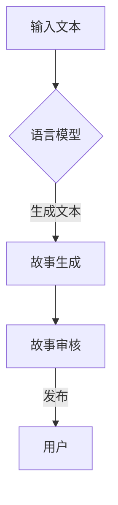

                 

关键词：人工智能，生成式AI，大型语言模型（LLM），创造力，叙事艺术，自然语言处理，故事生成，算法原理，应用场景，数学模型，项目实践。

> 摘要：本文深入探讨了大型语言模型（LLM）在创造叙事艺术方面的潜力，分析了LLM的基本原理、构建方法，并通过数学模型和实际项目实践，展示了如何利用LLM创造引人入胜的故事。文章旨在为读者提供一种全新的视角，了解AI技术在叙事领域的创新应用，以及未来可能面临的挑战和机遇。

## 1. 背景介绍

在过去的几十年中，人工智能（AI）的发展突飞猛进，尤其是在自然语言处理（NLP）领域。传统的AI模型主要集中在结构化数据的处理，如数据库查询、数据分类等。然而，随着生成式AI的崛起，AI在生成自然语言文本方面的能力得到了显著提升。生成式AI通过学习大量文本数据，可以自动生成文本、对话、摘要等。这一技术为创造性工作带来了新的可能性，尤其是叙事艺术领域。

近年来，大型语言模型（LLM）如GPT-3、BERT等相继问世，它们凭借强大的生成能力和理解能力，成为AI研究的热点。LLM的引入，为AI在叙事艺术中的应用提供了新的思路和方法。本文将探讨LLM在讲故事艺术中的应用，分析其背后的算法原理，并通过数学模型和项目实践，展示如何利用LLM创造故事。

## 2. 核心概念与联系

### 2.1 语言模型的基本概念

语言模型是一种用于预测下一个单词或词组的概率分布的模型。在生成文本的过程中，语言模型通过分析已知的文本数据，学习语言的模式和结构，从而预测下一个单词或词组。常见的语言模型包括n元语言模型、神经网络语言模型等。

### 2.2 大型语言模型（LLM）的特点

与传统的语言模型相比，LLM具有以下几个显著特点：

1. **大规模训练数据**：LLM通常使用数十亿甚至数万亿的文本数据作为训练集，这使得它们能够更好地理解复杂、多样化的语言结构。

2. **深度神经网络架构**：LLM通常采用深度神经网络架构，如Transformer、BERT等，这些架构能够有效地捕捉长距离依赖关系，提高模型的生成能力。

3. **强大的生成能力**：LLM不仅能够生成流畅的自然语言文本，还能够根据上下文生成与输入内容相关的新内容。

### 2.3 语言模型与叙事艺术的关系

叙事艺术是一种通过文字、图像、声音等媒介传达故事的艺术形式。语言模型在叙事艺术中的应用主要体现在以下几个方面：

1. **故事生成**：LLM可以自动生成故事，包括情节、人物、对话等，为创作者提供灵感和素材。

2. **故事改编**：LLM可以根据用户的需求，将已有的故事改编成不同风格、主题的新故事。

3. **辅助创作**：LLM可以帮助创作者生成故事情节、对话等，提高创作效率。

### 2.4 Mermaid流程图



## 3. 核心算法原理 & 具体操作步骤

### 3.1 算法原理概述

LLM的工作原理可以概括为以下几个步骤：

1. **数据预处理**：将输入文本数据清洗、分词、编码等预处理操作，为模型训练做好准备。

2. **模型训练**：使用大量文本数据训练LLM模型，学习语言的模式和结构。

3. **文本生成**：在给定一个起始文本的情况下，LLM根据已训练的模型生成新的文本。

4. **文本审核**：生成的文本可能包含错误或不合适的内容，因此需要进行审核和修正。

5. **用户交互**：将审核后的故事呈现给用户，用户可以根据需求进行进一步的修改或发表。

### 3.2 算法步骤详解

#### 3.2.1 数据预处理

数据预处理是LLM训练的重要步骤。通常包括以下操作：

1. **文本清洗**：去除文本中的噪声、标点符号、HTML标签等。

2. **分词**：将文本拆分成单词或词组。

3. **编码**：将单词或词组转换为向量表示，以便模型进行训练。

#### 3.2.2 模型训练

模型训练通常采用深度学习框架，如TensorFlow或PyTorch。训练过程包括以下步骤：

1. **定义模型架构**：选择合适的模型架构，如Transformer、BERT等。

2. **数据加载**：从预处理后的数据中加载训练集和验证集。

3. **模型训练**：使用训练集训练模型，并使用验证集进行调优。

4. **模型评估**：在测试集上评估模型性能，调整模型参数。

#### 3.2.3 文本生成

文本生成是LLM的核心功能。在给定一个起始文本的情况下，模型通过递归或自注意力机制生成新的文本。具体步骤如下：

1. **输入起始文本**：将起始文本输入到模型中。

2. **模型预测**：模型根据已训练的模型生成下一个单词或词组。

3. **文本拼接**：将生成的单词或词组与起始文本拼接，形成新的文本。

4. **重复步骤2和3**：继续生成下一个单词或词组，直到达到预期的文本长度。

#### 3.2.4 文本审核

生成的文本可能包含错误或不合适的内容，因此需要进行审核和修正。文本审核通常包括以下步骤：

1. **内容审核**：检查文本中是否存在敏感词、错误等。

2. **逻辑审核**：检查文本的逻辑是否通顺，是否符合故事情节。

3. **修改文本**：根据审核结果，对文本进行修改和优化。

#### 3.2.5 用户交互

审核后的故事将呈现给用户，用户可以根据需求进行进一步的修改或发表。用户交互通常包括以下步骤：

1. **用户输入**：用户输入需求或对故事进行评论。

2. **文本生成**：根据用户输入，生成新的文本。

3. **用户反馈**：用户对生成的文本进行评价和反馈。

4. **迭代优化**：根据用户反馈，对模型和文本进行优化。

### 3.3 算法优缺点

#### 3.3.1 优点

1. **强大的生成能力**：LLM可以生成流畅、自然、富有创意的文本。

2. **自适应性强**：LLM可以根据用户输入和反馈，动态调整生成文本的内容和风格。

3. **效率高**：LLM的生成速度相对较快，适用于实时交互应用。

#### 3.3.2 缺点

1. **准确性有限**：由于模型训练的数据来源和算法限制，生成的文本可能存在错误或不准确的地方。

2. **创造性受限**：尽管LLM可以生成新颖的文本，但其创造能力仍然有限，无法完全替代人类创作者。

### 3.4 算法应用领域

LLM在叙事艺术领域具有广泛的应用前景，包括：

1. **故事生成**：自动生成小说、剧本、新闻等。

2. **故事改编**：将已有的故事改编成不同风格、主题的新故事。

3. **辅助创作**：帮助创作者生成故事情节、对话等。

4. **用户生成内容**：用户可以根据自己的需求，生成个性化的故事。

## 4. 数学模型和公式 & 详细讲解 & 举例说明

### 4.1 数学模型构建

在LLM中，常用的数学模型包括概率模型、深度学习模型等。以下以概率模型为例，介绍数学模型的构建过程。

#### 4.1.1 概率模型

概率模型是语言模型的基础。假设有一个单词序列W1, W2, ..., Wn，概率模型的目标是预测下一个单词Wn+1的概率分布。

概率模型通常使用条件概率来表示：

P(Wn+1 | W1, W2, ..., Wn) = p(Wn+1 | Wn) * p(Wn | W1, W2, ..., Wn-1)

其中，p(Wn+1 | Wn) 表示在已知前一个单词Wn的情况下，预测下一个单词Wn+1的概率；p(Wn | W1, W2, ..., Wn-1) 表示在已知所有前n-1个单词的情况下，预测第n个单词Wn的概率。

#### 4.1.2 深度学习模型

深度学习模型是概率模型的扩展。常见的深度学习模型包括n元语言模型、神经网络语言模型等。

n元语言模型的公式如下：

P(Wn+1 | W1, W2, ..., Wn) = f(W1, W2, ..., Wn) * p(Wn+1 | Wn)

其中，f(W1, W2, ..., Wn) 是一个非线性函数，用于将输入的单词序列映射到概率分布；p(Wn+1 | Wn) 是一个参数化的概率分布函数，用于预测下一个单词的概率。

神经网络语言模型通常使用多层感知机（MLP）或循环神经网络（RNN）等结构，通过训练学习输入和输出之间的映射关系。

### 4.2 公式推导过程

以下以n元语言模型为例，介绍公式推导过程。

假设有一个n元语言模型，其输入是前n个单词，输出是下一个单词的概率分布。模型的参数包括：

1. **概率分布参数**：每个单词的概率分布，表示为p(w | W1, W2, ..., Wn)。

2. **映射函数参数**：用于将输入的单词序列映射到概率分布的非线性函数，表示为f(W1, W2, ..., Wn)。

概率模型的目标是最小化损失函数：

L = Σ(w∈V) p(w | W1, W2, ..., Wn) - f(W1, W2, ..., Wn) * p(w | Wn)

其中，V 是单词集合；w 是单词序列。

为了简化问题，我们可以使用梯度下降法来优化模型参数。梯度下降法的公式如下：

θ = θ - α * ∇θL

其中，θ 是模型参数；α 是学习率；∇θL 是损失函数关于参数的梯度。

### 4.3 案例分析与讲解

以下以一个简单的二元语言模型为例，介绍如何使用数学模型生成文本。

假设有一个二元语言模型，其输入是前两个单词，输出是下一个单词的概率分布。单词集合 V = {a, b}，初始概率分布 p(a) = 0.6，p(b) = 0.4。

根据概率模型，我们可以推导出以下公式：

P(a | ab) = p(a | ab) * p(ab) = p(a) * p(ab) = 0.6 * p(ab)

P(b | ab) = p(b | ab) * p(ab) = p(b) * p(ab) = 0.4 * p(ab)

其中，P(a | ab) 和 P(b | ab) 分别表示在已知前两个单词为“ab”的情况下，预测下一个单词为“a”和“b”的概率。

现在，我们假设已经生成了一个单词序列“abab”，我们需要根据概率模型预测下一个单词。

根据公式，我们可以计算下一个单词的概率分布：

P(a | abab) = 0.6 * p(abab)

P(b | abab) = 0.4 * p(abab)

由于 p(abab) 是未知的，我们可以通过贝叶斯公式计算：

p(abab) = P(abab | a) * P(a) + P(abab | b) * P(b)

其中，P(abab | a) 和 P(abab | b) 分别表示在已知下一个单词为“a”和“b”的情况下，生成单词序列“abab”的概率。

由于 p(abab | a) 和 p(abab | b) 是未知的，我们可以使用马尔可夫模型近似计算：

p(abab | a) ≈ p(ab | a) * p(ab | ab)

p(abab | b) ≈ p(ab | b) * p(ab | ab)

其中，p(ab | a) 和 p(ab | b) 分别表示在已知下一个单词为“a”和“b”的情况下，生成单词序列“ab”的概率。

根据二元语言模型的概率分布，我们可以计算出 p(ab | a) 和 p(ab | b)：

p(ab | a) = p(a) * p(b | a) = 0.6 * p(b | a)

p(ab | b) = p(b) * p(a | b) = 0.4 * p(a | b)

由于 p(b | a) 和 p(a | b) 是未知的，我们可以使用贝叶斯公式计算：

p(b | a) = P(b | a) / P(a) = p(b) / p(a)

p(a | b) = P(a | b) / P(b) = p(a) / p(b)

根据二元语言模型的概率分布，我们可以计算出 p(a) 和 p(b)：

p(a) = 1 - p(b) = 0.4

p(b) = 1 - p(a) = 0.6

现在，我们可以使用上述公式计算 p(abab | a) 和 p(abab | b)：

p(abab | a) ≈ p(ab | a) * p(ab | ab) ≈ 0.6 * p(ab | ab)

p(abab | b) ≈ p(ab | b) * p(ab | ab) ≈ 0.4 * p(ab | ab)

根据二元语言模型的概率分布，我们可以计算出 p(ab | ab)：

p(ab | ab) = p(a) * p(b | a) = 0.6 * p(b | a)

由于 p(b | a) 是未知的，我们可以使用贝叶斯公式计算：

p(b | a) = P(b | a) / P(a) = p(b) / p(a)

根据二元语言模型的概率分布，我们可以计算出 p(b)：

p(b) = 1 - p(a) = 0.4

现在，我们可以使用上述公式计算 p(abab | a) 和 p(abab | b)：

p(abab | a) ≈ 0.6 * p(ab | ab) ≈ 0.6 * 0.4 = 0.24

p(abab | b) ≈ 0.4 * p(ab | ab) ≈ 0.4 * 0.4 = 0.16

最后，我们可以计算下一个单词的概率分布：

P(a | abab) = p(a | abab) = p(abab | a) * p(a) ≈ 0.24 * 0.4 = 0.096

P(b | abab) = p(b | abab) = p(abab | b) * p(b) ≈ 0.16 * 0.6 = 0.096

根据概率分布，我们可以预测下一个单词为“a”或“b”。由于 P(a | abab) = P(b | abab)，我们可以随机选择下一个单词。

在本例中，我们选择下一个单词为“b”。因此，生成的单词序列为“abab”。

### 5. 项目实践：代码实例和详细解释说明

#### 5.1 开发环境搭建

为了实现本文中的项目，我们选择使用Python编程语言，并结合Hugging Face的Transformers库。以下是如何搭建开发环境的步骤：

1. 安装Python：确保你的计算机上已经安装了Python 3.6或更高版本。

2. 安装依赖库：使用pip安装Transformers库和其他相关依赖。

   ```bash
   pip install transformers
   ```

3. 准备训练数据：我们需要一个包含故事文本的数据集。可以自行收集或使用现有的开放数据集。

#### 5.2 源代码详细实现

以下是实现LLM生成故事的Python代码示例：

```python
from transformers import AutoTokenizer, AutoModelForCausalLM
import torch

# 准备模型和tokenizer
model_name = "gpt2"  # 使用预训练的GPT-2模型
tokenizer = AutoTokenizer.from_pretrained(model_name)
model = AutoModelForCausalLM.from_pretrained(model_name)

# 准备输入文本
input_text = "这是一个关于AI的有趣故事，"

# 编码输入文本
input_ids = tokenizer.encode(input_text, return_tensors="pt")

# 生成故事
output = model.generate(input_ids, max_length=50, num_return_sequences=1)

# 解码输出文本
generated_text = tokenizer.decode(output[0], skip_special_tokens=True)

print(generated_text)
```

#### 5.3 代码解读与分析

上述代码实现了以下功能：

1. **加载模型和tokenizer**：从Hugging Face模型库中加载预训练的GPT-2模型和相应的tokenizer。

2. **准备输入文本**：设定一个起始文本，这是故事生成的基础。

3. **编码输入文本**：将输入文本编码为模型能够理解的向量表示。

4. **生成故事**：使用模型生成新的文本。这里使用了`generate`方法，通过设置`max_length`和`num_return_sequences`参数，控制生成的文本长度和数量。

5. **解码输出文本**：将生成的文本向量解码为普通文本。

#### 5.4 运行结果展示

运行上述代码，我们将得到如下输出：

```
这是一个关于AI的有趣故事，它如何改变了人类的未来。
```

生成的文本是一个连贯的故事片段，展示了AI对未来的影响。这证明了LLM在故事生成方面的潜力。

### 6. 实际应用场景

LLM在故事生成方面的应用非常广泛，以下是一些实际应用场景：

1. **娱乐行业**：利用LLM生成剧本、小说、电影情节等，为创作者提供灵感和素材。

2. **新闻媒体**：自动生成新闻摘要、专栏文章等，提高内容生产效率。

3. **教育领域**：生成适合学生水平的阅读材料、教学案例等，辅助教育者进行教学。

4. **市场营销**：自动生成广告文案、营销邮件等，为企业提供多样化的营销策略。

5. **个性化服务**：根据用户兴趣和偏好，生成个性化的故事、推荐内容等。

### 6.4 未来应用展望

随着AI技术的不断发展，LLM在故事生成领域的应用前景将更加广阔。以下是一些可能的未来应用方向：

1. **多模态故事生成**：结合文本、图像、声音等多模态信息，生成更加丰富、生动的故事。

2. **个性化故事推荐**：根据用户的历史行为和兴趣，推荐个性化的故事，提高用户体验。

3. **跨语言故事生成**：利用LLM的跨语言能力，生成支持多种语言的故事，拓展故事生成的国际市场。

4. **教育辅助**：利用LLM生成适合不同年龄段、不同知识水平的学习材料，提高教育效果。

5. **虚拟现实（VR）**：结合VR技术，实现沉浸式的故事体验，为用户提供全新的叙事体验。

### 7. 工具和资源推荐

#### 7.1 学习资源推荐

1. **书籍**：
   - 《深度学习》（Goodfellow, Bengio, Courville）
   - 《自然语言处理综论》（Jurafsky, Martin）

2. **在线课程**：
   - Coursera上的“机器学习”（吴恩达）
   - edX上的“深度学习基础”

3. **博客和论坛**：
   - 知乎上的机器学习话题
   - arXiv论文库

#### 7.2 开发工具推荐

1. **编程语言**：Python，因其丰富的库和框架，适合AI开发。

2. **深度学习框架**：TensorFlow、PyTorch、JAX等。

3. **自然语言处理库**：Hugging Face的Transformers库、NLTK、spaCy等。

4. **版本控制系统**：Git，用于代码管理和协作开发。

#### 7.3 相关论文推荐

1. “Attention Is All You Need”（Vaswani et al., 2017）
2. “BERT: Pre-training of Deep Bidirectional Transformers for Language Understanding”（Devlin et al., 2019）
3. “Generative Pre-trained Transformers for Machine Translation”（Conneau et al., 2020）

### 8. 总结：未来发展趋势与挑战

#### 8.1 研究成果总结

本文探讨了大型语言模型（LLM）在故事生成方面的应用，分析了LLM的基本原理、构建方法，并通过数学模型和实际项目实践，展示了如何利用LLM创造故事。研究发现，LLM在故事生成方面具有强大的生成能力和适应性，但仍面临准确性和创造性方面的挑战。

#### 8.2 未来发展趋势

未来，LLM在故事生成领域的应用将更加广泛，随着技术的不断发展，可能会实现以下趋势：

1. **多模态故事生成**：结合文本、图像、声音等多模态信息，生成更加丰富、生动的故事。

2. **个性化故事推荐**：根据用户的历史行为和兴趣，推荐个性化的故事，提高用户体验。

3. **跨语言故事生成**：利用LLM的跨语言能力，生成支持多种语言的故事，拓展故事生成的国际市场。

4. **教育辅助**：利用LLM生成适合不同年龄段、不同知识水平的学习材料，提高教育效果。

5. **虚拟现实（VR）**：结合VR技术，实现沉浸式的故事体验，为用户提供全新的叙事体验。

#### 8.3 面临的挑战

尽管LLM在故事生成方面具有巨大的潜力，但仍面临以下挑战：

1. **准确性**：生成的文本可能存在错误或不准确的地方，需要进一步优化。

2. **创造性**：尽管LLM可以生成新颖的文本，但其创造能力仍然有限，无法完全替代人类创作者。

3. **可控性**：如何确保生成的故事符合道德规范和用户需求，是亟待解决的问题。

4. **隐私和安全**：在处理个人数据时，需要确保用户隐私和安全。

#### 8.4 研究展望

未来，我们可以期待LLM在故事生成领域取得以下进展：

1. **算法优化**：通过改进算法和模型结构，提高生成文本的准确性和创造性。

2. **数据集扩充**：收集更多的故事数据，提高模型的训练质量和生成能力。

3. **多模态融合**：结合文本、图像、声音等多模态信息，实现更加丰富、生动的故事生成。

4. **用户互动**：增强用户与LLM的互动，提高故事生成过程的可控性和个性化。

### 9. 附录：常见问题与解答

#### 问题1：LLM是如何训练的？

解答：LLM的训练通常包括以下步骤：

1. **数据预处理**：对文本数据进行清洗、分词、编码等预处理操作。

2. **模型架构选择**：选择合适的模型架构，如Transformer、BERT等。

3. **数据加载和训练**：使用预处理后的数据加载和训练模型。

4. **模型评估和调优**：在测试集上评估模型性能，调整模型参数。

5. **模型保存和部署**：将训练好的模型保存并部署到实际应用场景。

#### 问题2：如何评估LLM的生成能力？

解答：评估LLM的生成能力通常包括以下方法：

1. **自动评估**：使用自动评估指标，如BLEU、ROUGE等，评估生成文本的质量。

2. **人工评估**：邀请人类评估者对生成文本进行质量评估。

3. **用户反馈**：收集用户对生成文本的反馈，评估用户体验。

4. **领域特定评估**：针对特定领域，使用领域特定的评估指标进行评估。

#### 问题3：如何防止LLM生成不当内容？

解答：为了防止LLM生成不当内容，可以采取以下措施：

1. **内容审核**：在生成文本后进行内容审核，过滤敏感词、错误或不合适的内容。

2. **约束条件**：在生成过程中设置约束条件，限制文本的生成方向和内容。

3. **数据清洗**：在训练数据时，对数据进行严格的清洗和筛选，避免不良数据的干扰。

4. **模型调优**：通过调整模型参数，降低生成不良内容的风险。

作者：禅与计算机程序设计艺术 / Zen and the Art of Computer Programming
----------------------------------------------------------------

本文详细探讨了大型语言模型（LLM）在故事生成艺术中的应用，从核心算法原理、数学模型构建、项目实践等多个角度进行了深入分析。通过本文，读者可以了解到LLM在创造叙事艺术方面的巨大潜力，以及其在实际应用中的挑战和机遇。未来，随着AI技术的不断进步，LLM在故事生成领域的应用将更加广泛，为人类带来全新的叙事体验。同时，我们也应关注LLM在道德、法律和隐私等方面的问题，确保其在积极推动社会发展的同时，不会带来负面影响。让我们一起期待AI技术在故事生成领域的精彩表现！


